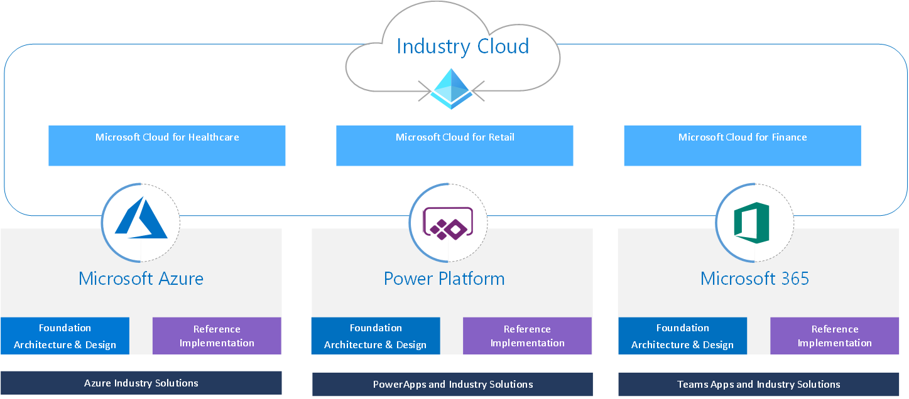

# Introduction

This repository provides holistic architecture design and reference implementation for industry cloud based on proven success of
large scale deployments and at-scale adoption with customers and partners. This guidance is built by active inner-source community
inside Microsoft to help customers and partners by providing prescriptive and actionable guidance and implementation to accelerate
deployment and adoption of industry cloud.

## Industry Cloud Reference Architectures

### Healthcare

Microsoft Cloud for Healthcare spans the Microsoft Clouds (Azure, Power Platform and Microsoft 365). This repository provides prescriptive architecture and design guidence together with respective reference implementations for the industry solution as a whole, as well as the various healthcare capabilities.

- [Pre-requisites](./healthcare/prereqs.md)
  - [Power Platform for Healthcare](./foundations/powerPlatform)  
  - [Healthcare APIs](./healthcare/solutions/healthcareApis)
  - [Microsoft Teams for Healthcare](./healthcare/solutions/microsoftTeams)
- Personalized care
  - [Patient service center](./healthcare/solutions/patientServiceCenter)
  - [Patient access](./healthcare/solutions/patientAccess)
- Patient insights
  - [Patient outreach](./healthcare/solutions/patientOutreach)
- Virtual health
  - [Virtual visits](./healthcare/solutions/virtualVisits)
- Care coordination
  - [Care management](./healthcare/solutions/careMangement)
  - [Home health](./healthcare/solutions/homeHealth)
- Care collaboration
  - [Health assistant](./healthcare/solutions/healthAssistant)
- [Remote patient monitoring](./healthcare/solutions/IoMT)
- [Data Interoperability](./healthcare/solutions)
- Cinical and operational insights
  - [Clinical analytics](./healthcare/solutions)
  - [Operational analytics](./healthcare/solutions)

### Telecommunications

Microsoft Cloud for Telecommunications enables an at-scale, and sustainable architecture for telco specific workloads, catering for the unique set of requirements a telco industry has compared to enterprises or customers in other industries. A prescriptive architecture and design guidance is provided below.

- [Pre-requisites](./telco/prereqs.md)
  - [Azure for Telecommunications](./telco)
    - [Scale-out networking](./telco/nwScaleOut)

### Financial services

Microsoft Cloud for Financial Services provides capabilities to manage data to deliver differentiated experiences, empower employees, and combat financial crime while facilitating security, compliance, and interoperability.

- [Pre-reqiusites](./fsi/prereqs.md)
  - [Power Platform for Financial Services](./foundations/powerPlatform)  
  - [Azure for Financial Services](./fsi/readme.md)
    - [Service enablement framework](./fsi/solutions/serviceEnablement)
  - [Azure Synapse for Banking](./fsi/solutions/synapseBanking)
- Customer and exmployee experience
  - [Unified customer profile](./fsi/solutions/unifiedCustomerProfile)
  - [Customer onboarding](./fsi/solutions/customerOnboarding)
  - [Collaboration manager](./fsi/solutions/collaborationManager)
  - [Banking customer engagement](./fsi/solutions/customerEngagement)
- Financial crime protection
  - [Account protection](./fsi/solutions/accountProtection)
  - [Purchase protection](./fsi/solutions/purchaseProtection)
- Compliance, privacy, and security
  - [Risk assurance and support](./fsi/solutions/riskAssurance)
  - [Regulatory compliance assessments](./fsi/solutions/complianceAssessments)

## Contributing

This project welcomes contributions and suggestions.  Most contributions require you to agree to a
Contributor License Agreement (CLA) declaring that you have the right to, and actually do, grant us
the rights to use your contribution. For details, visit <https://cla.opensource.microsoft.com>.

When you submit a pull request, a CLA bot will automatically determine whether you need to provide
a CLA and decorate the PR appropriately (e.g., status check, comment). Simply follow the instructions
provided by the bot. You will only need to do this once across all repos using our CLA.

This project has adopted the [Microsoft Open Source Code of Conduct](https://opensource.microsoft.com/codeofconduct/).
For more information see the [Code of Conduct FAQ](https://opensource.microsoft.com/codeofconduct/faq/) or
contact [opencode@microsoft.com](mailto:opencode@microsoft.com) with any additional questions or comments.

## Trademarks

This project may contain trademarks or logos for projects, products, or services. Authorized use of Microsoft
trademarks or logos is subject to and must follow
[Microsoft's Trademark & Brand Guidelines](https://www.microsoft.com/en-us/legal/intellectualproperty/trademarks/usage/general).
Use of Microsoft trademarks or logos in modified versions of this project must not cause confusion or imply Microsoft sponsorship.
Any use of third-party trademarks or logos are subject to those third-party's policies.
