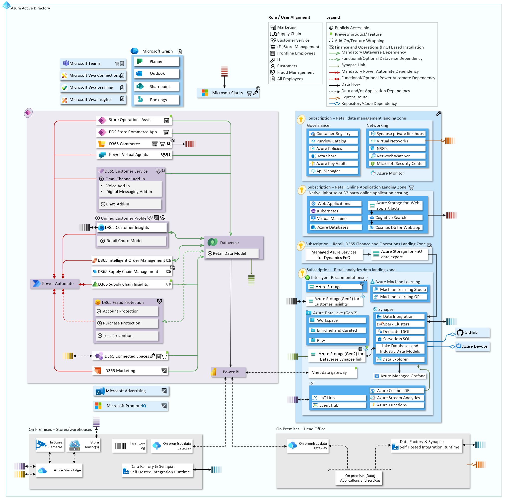
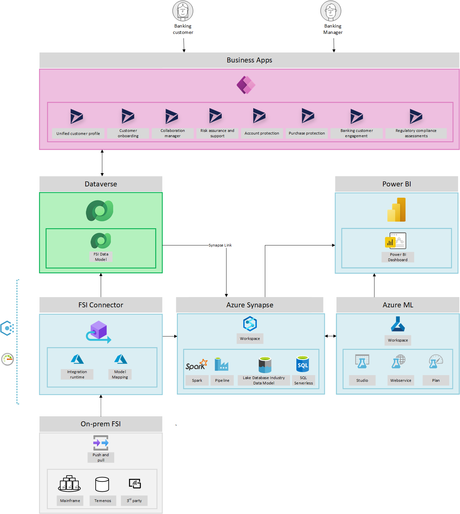

# Introduction

This repository provides holistic architecture design and reference implementation for industry cloud based on proven success of
large scale deployments and at-scale adoption with customers and partners. This guidance is built by active inner-source community
inside Microsoft to help customers and partners by providing prescriptive and actionable guidance and implementation to accelerate
deployment and adoption of industry cloud.

>Microsoft Cloud for industries will take a dependency on well-architected, sustainable, and scalable *cloud foundations* (Microsoft Azure, Microsoft Power Platform, and Microsoft 365), which will de-risk technical debt and ensure durable solutions regardless of the industry cloud reference architecture your organization would need. This repository references and provides proven, authoritative, and prescriptive architecture and design recommendations for these foundations, as well as specific reference implementations targeting the unique industry requirements. See the [following article](./foundations) to learn more

## Industry Cloud Reference Architectures

* [Healthcare](#healthcare)

* [Telecommunications](#telecommunications)

* [Financial Services](#financial-services)

* [Retail](#retail)

### Healthcare

Microsoft Cloud for Healthcare spans the Microsoft Clouds (Azure, Power Platform and Microsoft 365). This repository provides prescriptive architecture and design guidance together with respective reference implementations for the industry solution as a whole, as well as the various healthcare capabilities.

<table>
<thead>
 <tr>
  <th style="text-align:left" width="25%">Healthcare Scenario</th>
  <th style="text-align:left" width="75%">Reference Architecture</th>
 </tr>
</thead>
<tbody>
 <tr>
  <td style="text-align:top">

[Healthcare Foundations (Recommended)](./healthcare/prereqs.md)
- [Power Platform for Healthcare](./foundations/powerPlatform)
- [Azure for Healthcare](./healthcare)
- [Microsoft Teams for Healthcare](./healthcare/solutions/microsoftTeams)

Healthcare Solutions
- Personalized Care
  - [Patient Access](./healthcare/solutions/patientAccess)
  - [Patient Service Center](./healthcare/solutions/patientServiceCenter)
- Patient Insights
  - [Patient Outreach](./healthcare/solutions/patientOutreach)
- Virtual Health
  - [Virtual Visits](./healthcare/solutions/virtualVisits)
- Care Coordination
  - [Care Management](./healthcare/solutions/careManagement)
  - [Home Health](./healthcare/solutions/homeHealth)
<!--
- Care Collaboration
  - [Health Assistant](./healthcare/solutions/healthAssistant)
-->
- Monitoring & Analytics
  - [Remote Patient Monitoring](./healthcare/solutions/IoMT)
  - [Healthcare Analytics](./healthcare/solutions/clinicalAnalytics)

</td>
  <td>
        
    </td>
 </tr>
</tbody>
</table>

### Telecommunications

Microsoft Cloud for Telecommunications enables an at-scale, and sustainable architecture for telecommunications specific workloads, catering for the unique set of requirements the telecommunications industry has compared to enterprises or customers in other industries. A prescriptive architecture and design guidance is summarized below.

<table>
<thead>
 <tr>
  <th style="text-align:left" width="25%">Telecommunications Scenario</th>
  <th style="text-align:left" width="75%">Reference Architecture</th>
 </tr>
</thead>
<tbody>
 <tr>
  <td style="vertical-align:top">

[Telecommunications Foundations (Recommended)](./telco/prereqs.md)
- [Azure for Telecommunications](./telco)
- [Power Platform for Telecommunications](./foundations/powerPlatform)

Telco Solutions
- Solutions across Azure and the edge
  - [Network Analytics Landing Zones](./telco/solutions/observability/readme.md)
  - [Edge Video Services](https://github.com/microsoft/edge-video-services)
- Managed Security Offerings
  - Azure Sentinel and Microsoft Defender for Cloud

  </td>
  <td>
  
  </td>

 </tr>
</tbody>
</table>

### Retail

Microsoft Cloud for Retail is an industry-specific cloud composed of products and services to address retail specific use-cases. With services across Microsoft Azure, Dynamics 365 and Power Platform, customers can design, build and deploy cross-cloud solutions.

<table>
<thead>
 <tr>
  <th style="text-align:left" width="30%">Retail Services</th>
  <th style="text-align:left" width="70%">Reference Architecture</th>
 </tr>
</thead>
<tbody>
 <tr>
  <td style="vertical-align:top">

- [Retail Foundations (Recommended)](./retail/prereqs.md)
- [Reference Implementation](./retail/referenceImplementation/README.md)

- Retail Solutions
  - [Workforce Management with Teams](./retail/solutions/wrkforceMgmt/README.md)
  - [Real-time personalization](./retail/solutions/realtimePersonalization/README.md)
  - [Supply chain and Order lifecycle management](./retail/solutions/flexibleFulfillment/README.md)
  - [Shopper and operations analytics](./retail/solutions/shopperOpsAnalytics/README.md)
  - [Unified Customer profile and Retail churn model](./retail/solutions/unifiedCustomerProfile/README.md)

  </td>
  <td>
  
  </td>

 </tr>
</tbody>
</table>

### Financial services

Microsoft Cloud for Financial Services provides capabilities to manage data to deliver differentiated experiences, empower employees, and combat financial crime while facilitating security, compliance, and interoperability.

<table>
<thead>
 <tr>
  <th style="text-align:left" width="30%">Financial Services</th>
  <th style="text-align:left" width="70%">Reference Architecture</th>
 </tr>
</thead>
<tbody>
 <tr>
  <td style="vertical-align:top">

- [Financial Services Foundations (Recommended)](./fsi/prereqs.md)
  - [Power Platform for Financial Services](./foundations/powerPlatform)
  - [Azure for Financial Services](./fsi/readme.md)

- Customer and employee experience
  - [Unified customer profile](./fsi/solutions/unifiedCustomerProfile)
  - [Customer onboarding](./fsi/solutions/customerOnboarding/readme.md)
  - [Collaboration manager](./fsi/solutions/collaborationManager)
  - [Banking customer engagement](./fsi/solutions/bankingCustomerEngagement)
- Financial crime protection
  - [Account protection](./fsi/solutions/accountProtection)
  - [Purchase protection](./fsi/solutions/purchaseProtection)
- Compliance, privacy, and security
  - [Risk assurance and support](./fsi/solutions/riskAssurance)
  - [Regulatory compliance assessments](./fsi/solutions/complianceAssessments)

  </td>
  <td>
  
  </td>

 </tr>
</tbody>
</table>

## Contributing

This project welcomes contributions and suggestions.  Most contributions require you to agree to a
Contributor License Agreement (CLA) declaring that you have the right to, and actually do, grant us
the rights to use your contribution. For details, visit <https://cla.opensource.microsoft.com>.

When you submit a pull request, a CLA bot will automatically determine whether you need to provide
a CLA and decorate the PR appropriately (e.g., status check, comment). Simply follow the instructions
provided by the bot. You will only need to do this once across all repos using our CLA.

This project has adopted the [Microsoft Open Source Code of Conduct](https://opensource.microsoft.com/codeofconduct/).
For more information see the [Code of Conduct FAQ](https://opensource.microsoft.com/codeofconduct/faq/) or
contact [opencode@microsoft.com](mailto:opencode@microsoft.com) with any additional questions or comments.

## Trademarks

This project may contain trademarks or logos for projects, products, or services. Authorized use of Microsoft
trademarks or logos is subject to and must follow
[Microsoft's Trademark & Brand Guidelines](https://www.microsoft.com/en-us/legal/intellectualproperty/trademarks/usage/general).
Use of Microsoft trademarks or logos in modified versions of this project must not cause confusion or imply Microsoft sponsorship.
Any use of third-party trademarks or logos are subject to those third-party's policies.

## Microsoft Sponsorship

The Industry Reference Architecture project was created by the **Microsoft Customer Architecture Team (CAT)** in partnership with several Microsoft engineering teams who continue to actively sponsor the sustained evolution of the project through the creation of additional reference implementations for common industry scenarios.
