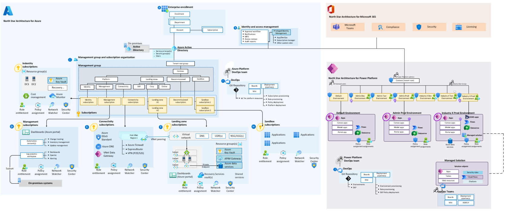

# Microsoft Cloud Foundations for industries

Microsoft Cloud for Industry provides many curated scenarios, capabilities and solutions targeting specific industries that spans across the Microsoft Clouds, such as Azure, Power Platform, and Microsoft 365.

To ensure that regardless where organizations starts on their journey towards leveraging these industry solutions, a pre-requisite and a recommended path is to have a well-architected cloud foundation that caters for security, governance and compliance, scale, and interoperability. This will ultimately de-risk an organization's technical debt as the design recommendations are aligned with the Microsoft Cloud roadmaps.

A high-level architecture of Microsoft Cloud Foundations can be seen below, where all clouds are based on their respective "North Star Architecture and Design Methodology".

Each cloud foundation is rooted on key design principles across critical design areas for each respective cloud with the industry specific requirements in mind, leading with prescriptive guidance for the considerations each organization must do, as well as the Microsoft recommendations.

## Foundations

Review the articles below to learn more about the North Star architecture methodology for each cloud foundation for your industry scenarios, as well as the specific reference implementations per industry:

* [Microsoft Power Platform](./powerPlatform)
* [Microsoft Azure](./azure)
* [Microsoft Teams](./teams)

---

[Back to documentation root](../README.md)