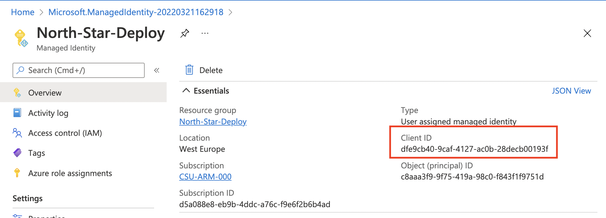
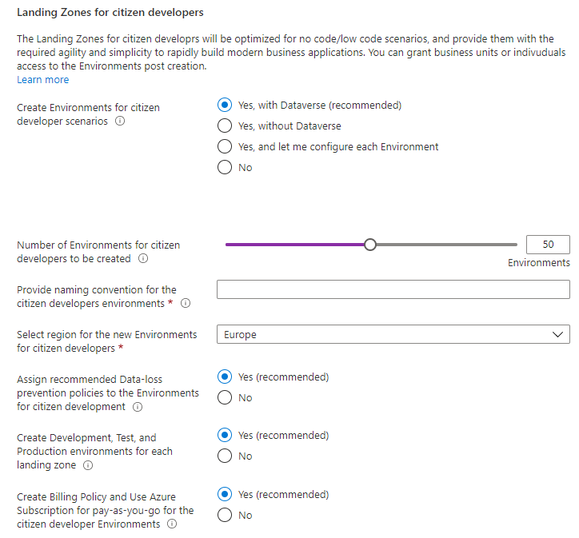
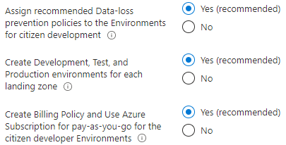
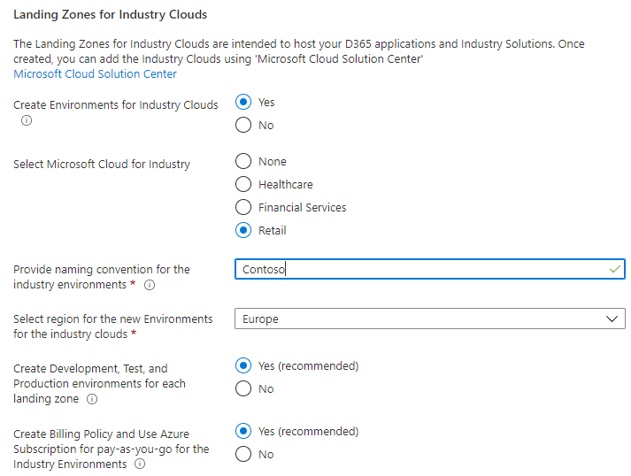

# North Star Landing Zones for Power Platform Reference Implementation

This user guide explains the North Star Landing Zones for Power Platform reference implementation, what it is, what it does, and how organizations can use it to create "landing zones" at scale to support their digital transformation for citizen developers, professional developers, and Microsoft Cloud for industries.

## Table of Contents

- [What is North Star Landing Zones reference implementation?](#what-is-north-star-landing-zones-reference-implementation)
- [Pricing](#pricing)
- [What if I already have an existing Power Platform footprint?](#what-if-i-already-have-an-existing-power-platform-footprint)
- [How North Star Landing Zones reference implementation works](#how-north-star-landing-zones-reference-implementation-works)
  - [Separating platform and landing zones](#separating-platform-and-landing-zones)
    - [Platform responsibilities and functions](#platform-responsibilities-and-functions)
    - [Landing zone owners responsibilities](#landing-zone-owners-responsibilities)
  - [What happens when you deploy North Star Landing Zones](#what-happens-when-you-deploy-north-star-landing-zones)
- [Deployment instructions](#deployment-instructions)
  - [Pre-requisites](#pre-requisites)
  - [Step-by-step guidance](#step-by-step-guidance)

---


## What is North Star Landing Zones reference implementation?

The North Star Landing Zones reference implementation is an optimized, and roadmap aligned implementation that enables organizations to create landing zones at scale into their existing Power Platform tenant, ideally instantiated using the North Star Architecture implementation to ensure the landing zones are secure and well-governed.

## Pricing

There's no cost associated with the reference implementation itself, besides requiring an existing Azure subscription, licenses and capacity within Power Platform as it's an architecture and design composition that spans Azure and Power Platform. However, depending on the options you enable it may incur cost related to Dataverse capacity, logging and retention, as well as premium services like Microsoft Sentinel with Data Connector for Dynamics365.

## What if I already have an existing Power Platform footprint?

North Star Landing Zones for Power Platform is designed to meet organizations where they are, whether there's already usage of Power Platform, or if it is a net new deployment. Additional guidance for existing customers will be provided at a later stage.

## How North Star Landing Zones reference implementation works

This section describes at a high-level how North Star Landing Zones reference implementation works. The landing zones created are the output of a multi-environment setup for the platform which will account for compliance, guardrails, security, connectivity and interoperability, and identity, at scale.

## Landing zone owners responsibilities

When a maker (citizen or/and professional developer) gets a landing zone, the user/team is end-to-end responsible for the components created and running in the Environments. They can independently operate within the security guardrails provided by the platform team. If dependency on central teams or functions are discovered, it is highly recommended to review the process and eliminate as soon as possible to unblock adoption.

## What happens when you deploy North Star Landing Zones reference implementation?

The deployment will allow you to create Landing Zones for citizen developers and professional developers into an existing North Star Architecture for Power Platform. This means that logging, security, DLPs etc., must already exist and is not part of this particular deployment.

## Deployment instructions

This section will describe how to deploy the North Star Architecture reference implementation.

### Pre-requisites

The deployment experience requires a [User assigned managed identity](https://docs.microsoft.com/en-us/azure/active-directory/managed-identities-azure-resources/how-manage-user-assigned-managed-identities?pivots=identity-mi-methods-azp#create-a-user-assigned-managed-identity) registered as a [Power Platform admin management application](https://docs.microsoft.com/en-us/power-platform/admin/powerplatform-api-create-service-principal).

> Note: The actions below must be executed with a user that have at least [Contributor](https://docs.microsoft.com/en-us/azure/role-based-access-control/built-in-roles#contributor) access to an Azure subscription and [Power Platform Administrator](https://docs.microsoft.com/en-us/power-platform/admin/use-service-admin-role-manage-tenant#power-platform-administrator) or [Global Administrator](https://docs.microsoft.com/en-us/azure/active-directory/roles/permissions-reference#global-administrator) permissions in Azure AD.

**1.** In the Azure Portal, navigate to 'Managed Identities' and create a User Managed Identity in your preferred Subscription/Resource Group/Region.
    
    
**2.** Navigate to the User assigned managed identity and copy the Client ID from the identity.
    
**3.** In a PowerShell core session (local or [Azure Cloud Shell](https://docs.microsoft.com/en-us/azure/cloud-shell/overview)), authenticate with Azure and follow instructions below to register the User assigned managed identity as a admin management application.
```powershell
# Connect to Azure
Connect-AzAccount

# Install PowerOps module
Install-Module -Name PowerOps -Force -AllowPrerelease

# Register Admin management application
$clientId = '<Replace with client id from UMIlient id>'
Register-PowerOpsAdminApplication -ClientId $clientId
```
  


### Deployment Setup

The first tab in the experience is where you configure the Deployment Setup. Provide the User Managed Identity you created in the pre-requisites, as this identity will be used to bootstrap and configure the Power Platform landing zones.
Also, a subscription is required in order to place the deployment that is being created, targeting an Azure region.

Optionally you can select if the subscription provided at this step should be used for all the Azure services that you will create as part of th deployment.


### Landing Zones

On the **Landing Zones** tab, you will configure and create the Environments that will be used as landing zones for your organization's citizen and professional developers.

- **Landing Zones for citizen developers**

You can create landing zones for the citizen developers, either with or without Dataverse, and optionally customize each of the environment in case you want to create them into different regions, as well as assigning RBAC.



To create up to 100 environments in batches, select the option "Yes, with Dataverse (recommended)", or "Yes, without Dataverse", select the target region and the naming convention for these Environments.


To customize each environment, select the option "Yes, and let me configure each Environment". This allows you to create 100 Environments with your preferred name for each, the target region, if Dataverse should be enabled, and additionally you can assign RBAC permissions for your individual citizen developers.


Additional configuration for the citizen developer landing zones can be made, by assigning recommended DLP policies to ensure an optimal starting point for citizen developers, as well as enabling recommended ALM (application life-cycle management) by creating dedicated developer, test, and production Environment for each Environment being created.



- **Landing zones for professional developers**

Similar to the landing zones for citizen developers, you can create landing zones for professional developers which will provide them with an on-ramp path to Power Platform, secured by recommended DLP policies that enables co-existence and synergy with Azure, Microsoft 365, and Power Platform.

Similar as the landing zones for citizen developers, you can either create N environments in batches, or customize each environment, assign recommended DLP policies, and optimize for ALM by ensuring there's dedicated ENvironments for each for development, testing, and production usage.


- **Landing Zones for Industry Clouds**

Microsoft Cloud for Industry will require Power Platform and dedicated Environments, and if required, you can select the Industry your organization is in, and the setup will create the Environments with the required dependencies for you to complete the solution deployment in [Microsoft Cloud Solution Center](https://solutions.microsoft.com).



### Review + Create

Once you have completed the deployment wizard, you can review your configuration and start the deployment.

## Post-deployment activities

*In-progress*