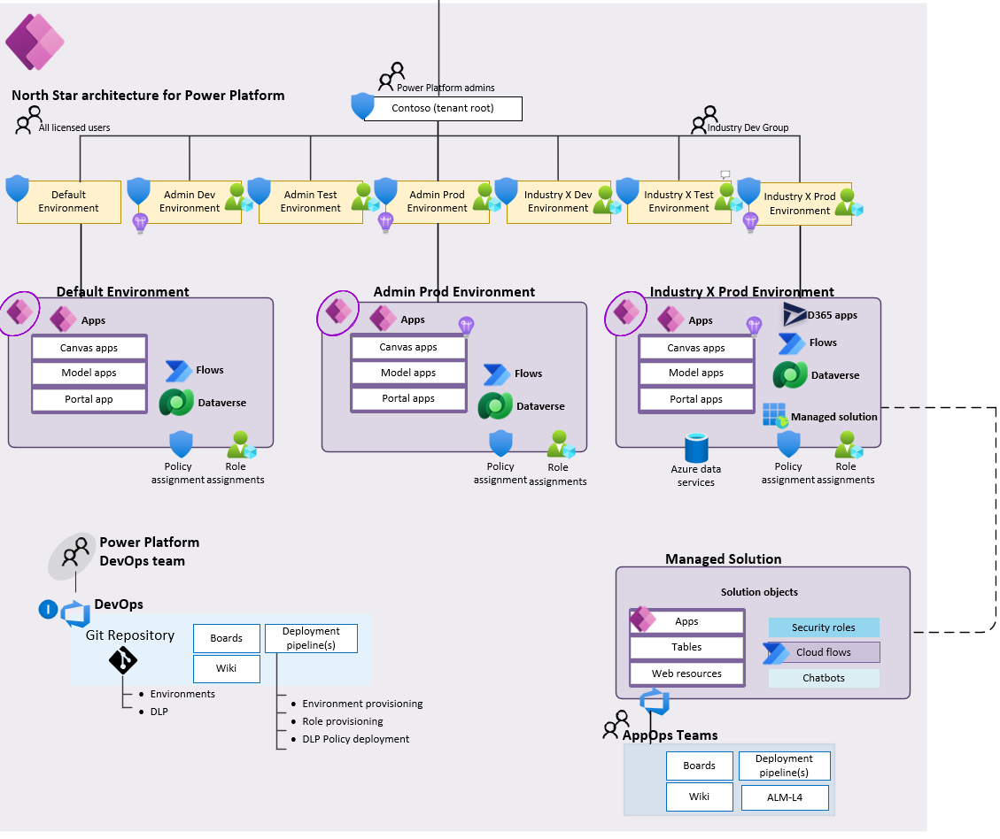

# North Star Architecture for Power Platform

North Star is an architectural approach and a reference implementation. It enables effective construction and operationalization of landing zones (environments) on Power Platform, at scale. This approach aligns with the platform and product roadmap and the Center of Excellence adoption framework.

Specifically for Microsoft Cloud for Industries (e.g., Healthcare, Financial Services), Microsoft Power Platform is an essential platform for the overall industry solutions, and this prescriptive guidance aims to provide you with best practices and recommendations across the critical design areas for Power Platform to host and integrate the various industry applications.

| Reference implementation | Description | Deploy |
|:----------------------|:------------|--------|
| North Star Architecture for Power Platform | Power Platform environments with DLP, logging, and security enabled for scalable industry solutions |

## Architecture overview

North Star architecture for Power Platform represents the strategic design path and target technical state for an organizations Power Platform enviornment. It continues to evolve alongside the Power roadmap. Various design decisions define the architecture that your organization must make to map your Power Platform journey.

### High-level architecture

A North Star architecture includes a set of design considerations and recommendations across the [critical design areas](#critical-design-areas-for-power-platform) for Power Platform. It is modular by design and allows you to start with a foundational architecture that enables construction and operationalization of landing zones (Environments) that supports your business application portfolios, for both pro developers and citizen developers. The architecture will scale regardless your organization scale-point and business requirements.

Figure 1 depicts the high-level architecture of North Star architecture for Power Platform

### Landing zone in North Star architecture for Power Platform

A landing zone (environment) is where professional developers and citizen developers can confidently develop and run their business applications, that accounts for:

* Scale
* Security
* Governance
* Interoperability and extensibility

The landing zones consider all platform capabilities and resources that are necessary to support the organization's business application portfolio.

Figure 2 shows the landing zone (environment) in Power Platform.

## Critical design areas for Power Platform

The core of North Star architecture for Power Platform contains a critical design path comprised of fundamental design areas with heavily interrelated and dependent design decisions. This repository provides design guidance across these architecturally significant technical domains to support the critical design decisions that must occur to define the North Star architecture. For each of the key design areas listed below, review the considerations and recommendations provided and use them to structure and drive design decisions within each area.

* [Identity and access](#identity-and-access)
* [Security, governance, and compliance](#security-governance-and-compliance)
* [Environments](#environments)
* [Data ingress and egress](#data)
* [Management and monitoring](#management-and-monitoring)
* [Azure VNet connectivity for Power Platform](#azure-vnet-connectivity-for-power-platform)

## Identity and access

Identity and access to the Power Platform, the environments, the applications, components, and solutions within the environments must be carefully thought through in parallel with assigned licenses.
Furthermore, for data, security in Dataverse is there to ensure users can do their work with the least amount of friction, while still protecting the data and services. Security in Dataverse can be implemented as a simple security model with broad access all the way to highly complex security models where users have specific record and field level access.

### Design considerations

* Licensing is the first control-gate to allowing access to Power Platform components.
* Ability to create applications and flows is controlled by security roles in the context of an environment.
* Environments act as a security boundary, allowing different security requirements to be implemented in each environment.
* The security and RBAC model for Environments with - and without Dataverse are different.
* Environments with Dataverse support more advanced security models to control access to data and services within the Dataverse environment.
* A user's ability to see and use apps is controlled by sharing the application with the user.
  * Sharing of canvas apps is done directly with a user or Azure AD group but is still subject to Dataverse security roles.
  * Sharing of model-driven apps is done via Dataverse security roles.
* If an Environment is first created without Dataverse and it gets added later, the Dataverse roles will take over for controlling security in the Environment and all environment admins and makers are automatically migrated.

### Design recommendations

* Create AAD groups that are automatically assigned the correct licenses per user per their requirements and roles, and avoid assigning licenses to individual users.
* Organize the AAD groups that streamline and simplify RBAC for the environments per the functions and requirements for the business units and application teams.
* Use Conditional Access Policies in Azure AD to grant/prevent access to Power Apps and Power Automate based upon user/group, device, and location.

## Security, governance, and compliance

An environment in Power Platform is an allow-by default system from a policy perspective, and for the Healthcare solutions and applications, one must use Data-Loss Prevention policies to explicitly categorize and enable/disable connecters for business use cases. This will help to mitigate risk for data exfiltration, and help to stay secure and compliant.

### Design considerations

* A policy can be scoped to include the entire tenant, multiple environments, as well as exclude multiple environments.
* You can create data loss prevention (DLP) policies that can act as guardrails to help prevent users from unintentionally exposing organizational data.
* DLP policies can be scoped at the environment or tenant level, offering flexibility to craft sensible policies that strike the right balance between protection and productivity.
* Connectors can be grouped into business, non-business, and blocked. Once categorized, they cannot be used in conjunction with other connectors outside its group. When a connector is blocked, it cannot be used at all.
* Environment admins cannot edit policies created by tenant admins.
* Tenant isolation for Power Platform can be applied at the connector level and is used to prevent connectors using Azure AD based authentication to other tenants, and supports both one-way (inbound) or two-way (inbound and outbound) restriction. Enabling tenant isolation requires raising a support ticket in the Power Platform admin center.

### Design recommendations

* Create a data loss prevention policy that enforces the bare minimum security requirements at the tenant scope, to ensure that all landing zones are secure by-default and both pro devs and citizen devs can safely develop business applications that do not violate the security requirements.
* The tenant wide policy spanning all environments should prevent all unsupported non-Microsoft connectors, and classify all Microsoft connectors as 'Business data'.
* Create a policy for the default environment that furter restricts which Microsoft connectors are classified as 'Business Data'.
* Establish a process that will always include data-loss prevention policy when creating a new landing zone (environment), to ensure no one are accessing - or starting to create or deploy apps could potentially violate the policies.

## Environments

Environments acts as the scale-unit, and management boundary in Power platform and is where organizations can store, manage, and share business data, applications, including Dynamics 365 apps, chatbots, and flows. It's recommended to have a strategy for how you should create, distribute, and scale environments to accelerate digital transformation for your pro - and citizen developers.
The following section describes the design considerations and the design recommendations for Environments, to help you navigate to the correct setup per your organizational requirements.

### Design considerations

* An environment must be pinned to a location (abstraction of Azure regions), and is determined during creation by the maker/admin, and cannot be changed post creation.
* Environments are defined out of the box to serve different audiences and purposes like dev, test, production, and personal exploration/development. Depending on what type of environment that is created, it will determine what you can do with the environment as well as the apps within.
* Each tenant has a default environment and it is created in the region closest to the default region of the Azure AD tenant.
* Data Loss Prevention (DLP) policies can be applied to individual environments or the tenant root ("/") level.
* Non-default environments can be created by licensed Power Apps, Power Automate and Dynamics users. Creation can be restricted to only global and service admins via a tenant setting.
* An environment can have one or zero database (Dataverse) instances.
* Environments act as security boundaries allowing different security needs to be implemented in each environment.
* Environments can be created with - or without Dynamics 365 application templates available in the tenant.
* Dynamics 365 applications takes a dependency on environments with Dataverse provisioned.

### Design recommendations

* Rename the Default environment to clarify the intent, e.g., "personal productivity" as all licensed users will have access by default.
* Disable self-service of Environment creation, both for Production and Sandbox as well as Trials, and limit this to selected Power Platform admins as this can potentially cause capacity constraints in the tenant.
* Enable a process for the organization to request new environments. Either establish and implement the process yourself, or leverage the [Center of Excellence starter kit](https://docs.microsoft.com/power-platform/guidance/coe/starter-kit) as an enabler and starting point which provides a solution that can be imported to a dedicated environment to facilitate this, together with other core capabilities.
* As part of the Environment creation process, ensure auditing, DLP policies, and RBAC are included so the environments can be used safely.
* Have dedicated environments (dev, test, and prod) for administrative purposes for the Power Platform itself, including management, monitoring, and analytics. These environments should be managed and operated by the Power Platform admins, in order to safely operate and scale the distribution of landing zones (environments) to business units and application teams within the organization.
* Create dedicated environments for test, development, and production for the industry solutions in the same region, which allows ease of maintenance and validation of changes, such as release wave updates which is per environment.
* The production and development environments for industry solutions must be of type "production", while test environments could be of type "sandbox" to simplify reset process for testing purposes.
* Limit high privilege access by using an Azure AD Security Group with PIM for admin access to the environments.
* Create DLP policies to limit data flow between trusted MSFT connectors and 3rd party APIs, aligned with your organizational requirements.
* Manage the correct number of environments in the tenant to avoid sprawl and conserve capacity.
* Enable auditing for your tenant and environments to understand usage and available capacity.
* For industry solutions (e.g., Healthcare, Financial Services Industry), deploy all Dynamics 365 applications to the same environment(s), and avoid creating islands of data that will be complex to combine later.
* Only split solutions across different environments if there are data or security constraints.

## Power BI Admin

Power BI is a visualization tool that can be used to present coherent, visually immersive, and interactive insights from various data sources across cloud environments and on-premises.

### Design considerations

* Available features in Power BI depend on the license that is assigned to the user and workspace. One free and two paid licenses are available (Pro and Premium (Gen2)). In an organization, admins purchase a license subscription (Billing administrator or Global administrator) and then assign licenses to workspaces, groups, and individual users (License administrator, User administrator, Global administrator).
* Self-service sign-up to Power BI licenses can be enabled or disabled within an organization.
* Power BI premium requires an organization to manage capacity and assign capacity to workspaces. Deleting Premium capacity won't result in the deletion of the assigned artifacts.
* Auto-scale in Premium Gen2 allows for automatically adding one v-core for 24-hour periods when the load on the capacity exceeds its limits. Additional v-cores are charged on a pay-as-you-go basis.
* Metadata scanning can be used to facilitates governance over your organization's Power BI data by making it possible to quickly catalog and report on all the metadata of your organization's Power BI artifacts.
* Sensitivity labels can be used to apply Microsoft 365 labels to Power BI artifacts.
* Default and mandatory label policies for Power BI can be defined in the Microsoft 365 compliance center (currently in preview).
* Sensitivity label inheritance can be used to have the label trickle down and be applied to content that is built from other labelled datasets or reports (currently in preview).
* Custom messages can be setup to guide users when creating artifacts within the Power BI tenant.
* Power BI premium allows storing dataflows in a customer owned ADLS Gen2 account. Optionally, workspaces owners can be allowed to configure their own datalake for Power BI dataflows.
* Audit logs can be used to track usage for all Power BI resources at the tenant level.
* Power BI Premium allows connecting workspaces to a Log Analytics Workspace.

### Design recommendations

* To make the most out of Power BI, purchase a Premium (Gen2) license. Large organizations should purchase a Premium capacity license as well as a set of Premium per user (PPU) licenses and assign licenses to the respective workspaces, content creators and user groups. Smaller organizations may only purchase a set of PPU licenses instead of Premium capacity.
  
  Premium licenses will enable a significant number of required functionalities for enterprises to securely access and share data. For instance, only a Premium license allows using the virtual network gateways to privately access data stored in private link enables Azure data services. In addition, workspaces with premium capacity will allow the usage of "Bring Your Own Key" (BYOK), will provide multi-region support, unlimited refresh concurrency, unlimited distributions, and reports on-premises. Premium Gen2 also simplifies the capacity monitoring, as users will in most cases no longer have to monitor the memory used but only the CPU time required to serve the load.

* Assign a free user license to all users who are just consuming content shared with them or who are exploring or learning Power BI through their own personal workspace.
* Create capacities from available v-cores and assign application owner(s) as capacity admin(s). This enables self-services, as it allows application teams within the tenant to manage their own capacity and assign workspaces to Premium capacity. Load testing may be required to select the right SKU and minimize the need for autoscale capacity. Use the [Power BI Premium Capacity Utilization and Metrics App](https://appsource.microsoft.com/product/power-bi/pbi_pcmm.pbipremiumcapacitymonitoringreport) to monitor the used capacity and overload events and decide about SKU upgrades.
* Configure a utilization notification for Power BI premium capacities to receive emails when approaching the the maximum capacity.
* Only assign shared workspaces and no personal workspaces to Premium capacity.
* Enable autoscale for shared workspaces within your organization to reduce the management overhead and the requirement to continuously monitor the required CPU time of each workspace. Set the maximum number of additional autoscale v-cores to a reasonable number between 1-4. If more capacity is required, evaluate whether a AKU upgrade is required. For more details about load evaluation in Power BI Premium Gen2 visit this [documentation page](https://docs.microsoft.com/power-bi/admin/service-premium-concepts). Assign the subscription and resource group of the application team to the autoscale settings for cross-charging purposes.
* Set up metadata scanning in the Power BI tenant to allow Azure Purview or other data catalogues to collect metadata and lineage.
* Enable sensitivity labels in Power BI to allow users to make use of existing Microsoft Information Protection sensitivity labels and to enable comprehensive protection and governance of sensitive data.
* Define a default label and enforce mandatory label policies for Power BI dashboards and datasets in the Microsoft 365 compliance center to enforce applying sensitivity labels.
* Configure sensitivity label inheritance from data sources as well as downstream inheritance in the Power BI tenant to simplify end-to-end information protection inside your organization. <!-- Use the "Downstream inheritance with user consent" mode, to allow users define more restrictive sensitivity labels when combining multiple data assets. --> Also, evaluate restricting highly confidential content from being shared within the organization via links.
* Define and present custom messages in the Power BI tenant to shows disclaimers and guide users before publishing artifacts to a workspace.
* Continuously export Power BI audit logs to an Azure storage account and build dashboards to track usage of Power BI artifacts. More details on how to setup the data export can be found [here](https://docs.microsoft.com/en-us/power-bi/admin/service-admin-auditing#use-the-activity-log).
* Consider restricting export paths that do not support label inheritance. Supported paths are [documented here](https://docs.microsoft.com/en-us/power-bi/admin/service-security-sensitivity-label-overview#supported-export-paths).
* Use Microsoft Cloud App Security to define conditional access policies for Power BI and restrict permissions for labelled artifacts.
* Once it is possible to connect multiple Power BI Premium workspaces to a single Log Analytics workspace, we recommend transferring all Power BI workspace activity logs to a central Azure Log Analytics workspace for further analysis.

## Data

### Data in Dataverse

Apps created in the Power Platform, whether they are canvas, model, or portal based, can all leverage the native database capability through Dataverse within a Power Platform environment. Dataverse is a transactional SaaS data platform that can be used to include data little code to be written inside a Power Platform application.

#### Design considerations

* Data can be integrated into Dataverse as a one-off activity or on a schedule. Alternatively, virtual tables can be used to map data in an external data source so that it appears to exist in Dataverse. Virtual tables do not support many of the security and auditing related features that are offered for non-virtual tables.
* Custom tables and/or standard, pre-defined tables can be used as a datasource when creating a Power Platform application.
* Ownership type of custom tables can't be changed after creation. Virtual tables are always owned at the organizational level.
* Row- and column-level security can be used to restrict access to data within tables.
* Dataverse provides the option of automatic and manual backups. Automatic backups are system-initiated and manual backups are user-initiated.
* Audit Logs can be enabled to track changes to tables and columns over time for security and analytical purposes.
* Data existing in Dataverse can be continuously integrated into an Azure Data Lake Gen2 for running analytical workloads on the data.
* App Makers can perform changes directly within Dataverse (Default Solution) or work within a custom Solution.
* Application data model must be defined including table structure, relationships between tables (one-to-many, many-to-one, many-to-many). Existing business data models should be resused to simplify data integration, data sharing and joins with other datasets.

#### Design recommendations

* Integrate required data sources into Dataverse to leverage a common datastore for your applications, simplify connectivity, reduce management overhead and reduce the point of failures within the architecture. In addition, users will also gain access to additional features such as queues, knowledge management, SLAs, duplicate detection, change tracking, mobile offline capability, column security, and Dataverse search.
* Securely integrate data using Power Platform dataflows and virtual network data gateways for Azure data sources or on-premises data gateways for data sources outside of Azure.
* Setup an automatic refresh schedule or an event-driven update workflow for imported data that changes frequently in the source system. Setup refresh failure notifications to get notified about synch errors. Use incremental refreshes to reduce the amount of data that needs to be processed by Power Platform dataflow or other integration tools.
* Split complex Power Platform dataflows into "Load" and "Transformation" dataflows or use computed entities. This will simplify readability and will allow reuse of the original loaded dataset across multiple transformation dataflows.
* Use standard tables, columns, and table relationships when they make sense for your organization to simplify the app development and reduce the risk of data replication within Dataverse.
* When creating a custom table, decide upfront whether the table and access control should be owned by the "Organization" or by a "User or team".
* Use column-level/field-level security for columns and fields that include sensitive data such as PII data.
* In general, rely on automatic system-initiated backups. Use manual user-initiated backups before updating the environment or before triggering application updates.
* Enable auditing for tables to log any data creation, changes, or deletion in the respective tables. All columns are audited by default, when turning the feature on and auditing must be turned on for the environment.
* For analytical workloads such as machine learning, reporting, data warehousing and other downstream integration processes, use Azure Synapse Link to export the data from Dataverse into the analytical data platform. This will reduce the impact on the transactional Dataverse database and allows multiple Data Product teams to consume the same consistent dataset at scale.
* Always, create and work within the context of a new solution as you add, edit and create components. For Dataverse in particular, [create a segmented solution with table assets](https://docs.microsoft.com/powerapps/maker/data-platform/create-solution#create-a-segmented-solution-with-table-assets). This makes it easy to export your solution so that it can be backed up or imported to another environment.

### Data in Power BI

Power BI is a visualization tool that can be used to present coherent, visually immersive, and interactive insights from various data sources across cloud environments and on-premises.

#### Design considerations

* When connecting to data sources you can import data into Power BI or connect directly to data in the original source repository (Direct Query).
* Data sources connected to a virtual network can be accessed using virtual network data gateways or on-premises data gateways.
* If datasets reside in Power BI, data can be refreshed through different mechanisms.

#### Design recommendations

* Import data into Power BI instead of using Direct Query whenever possible to take full advantage of the Power BI query engine.
* Use Direct Query only in the following cases:
  * The underlying data changes frequently (less than 1h) and/or near real-time reporting is required.
  * The required dataset is very large and importing just a subset or aggregation is not feasible.
  * The security rules are defined in the underlying data source.
  * Data sovereignty does not allow importing the dataset to Power BI.
  * The used connector and data source supports the produced load and can compute aggregations within a short window.
  * Rich data transformation capabilities via Power Query are not required.
  * The source is a multidimensional source containing measures.
  * More limitations can be found [here](https://docs.microsoft.com/power-bi/connect-data/desktop-directquery-about).
* Connect to data sources securely by using virtual network data gateways for Azure data sources or on-premises data gateways for data sources outside of Azure.
* Configure refresh schedules for Power BI datasets that refresh frequently within the source system. Depending on the Power BI license, you will be limited to a pre-defined number of refreshed per day (8 per day for datasets on a shared capacity, 48 per day for datasets on a premium capacity). Also configure refresh failure notifications to get email updates when scheduled refreshed fail.
* If possible, use incremental data refreshes to speed up the refresh process, make it more reliable and consume less capacity.

## Management and monitoring

Power Platform provides first-party connectors for the Power Platform administration capabilities so organizations can configure and implement the desired management scenarios and automation needed for their tenant and environments. The [Center of Excellence starter-kit](https://docs.microsoft.com/power-platform/guidance/coe/core-components) provides ready to use solutions that enables curated management experiences in addition to what the Power Platform admin center enables by default.
Further overall management, including observability and auditing is crucial to ensure a continiously healthy tenant and environments, the the usage of the various applications deployed in the environments, as well as the Dataverse platform. Additional integration and end-to-end view will rely on Microsoft 365 Security and Compliance Center, and Azure Active Directory. For most of the services in Power Platform, organizations who are using Azure can integrate with Azure Monitor (Application Insights and Log Analytics) for long-term retention and further analysis.

### Design considerations

* Only Environments with Dataverse provide auditing capabilities (access logs) at the environment and database layer, and the logs can be viewed and consumed from [Office 365 Security & Compliance center](https://protection.office.com/homepage)
* Auditing for Environments with Dataverse is set to off by default and cannot be enabled on Environments during provisioning. To enable auditing you must explicitly opt-in within the Environment settings once it has been created.
* Power Platform admin center provides out-of-the box analytics capabilities of the various Power Platform components, such as Dataverse, Power Apps, and Power Automate
* The Power Platform admins can configure [Data export](https://admin.powerplatform.microsoft.com/analytics/dataexport) for all Power Apps in the tenant, and export to an Azure Data Lake Storage (Gen2) account to get an overview of the adoption, usage, inventory, and application metadata.
* For each envrionment with Dataverse, the Power Platform admins can export Dataverse diagnostics, such as usage of APIs, form load diagnostics, and performance metrics to an Azure Application Insights instance.
* Activity logs for Power Apps is integrated with Office 365 Security & Compliance center which provides an API to query the data.

### Design recommendations

* Use Application Insights that is linked to a Log Analytics workspace in Azure to capture key diagnostics and performance metrics for all environments using Dataverse, and enable critical alerts for the respective Power Platform admins and environments owners.
* If separation of concern is important, configure Data Export to Application Insights on behalf of the application teams/owners, so they can monitor the diagnostics and performance for their own dedicated environments.
* Use Azure Data Lake Storage (Gen2) account to store and analyze Power App usage for the tenant, for durations as required by your organization's data retention policies, and use Power BI to build informative reports for the various stakeholders for the Power Platform.
* Enable tenant-level analytics for aggregated view of usage across the Power Platform components.

## Azure VNet connectivity for Power Platform

The Power Platform provides different mechanism to allow connectivity to Azure data services. This section will provide prescriptive design considerations and recommendations to help you implement the right connectivity model from the Power Platform to an Azure VNet.

### Design considerations

* The Power Platform provides two types of data gateways:
  * On-premises data gateway
  * VNet data gateway (currently in public preview)
* On-premises data gateway is designed to provide secure data transfers between on-premises data and Microsoft clouds services.
* VNet data gateway is designed to allow connections from Power Platform Cloud services (Power BI Datasets and Power Platform Dataflows) to Azure data services.

* Customers must install and manage the host/virtual machine where the on-premises data gateway is deployed. With the VNet data gateway no installation is required because it's a Microsoft managed service.
* VNet data gateway is well suited to complex scenarios in which multiple people access multiple data sources.
* When using the VNet data gateway, there is no need of using an on-premises data gateway.
* A Power BI Premium license (Power BI Premium workspaces and Premium Per User (PPU)) is required to make use of the VNet data gateway.
* Be sure to familiarize with VNet data gateway [limitations](https://docs.microsoft.com/data-integration/vnet/overview#limitations) as well as [supported Azure data services](https://docs.microsoft.com/data-integration/vnet/use-data-gateways-sources-power-bi#supported-azure-data-services).

### Design recommendations

* Use a VNet data gateway to access data from cloud services in the data platform to Azure data services.
  * This feature is still in public preview, hence may not be suitable for production scenarios.
* Deploy the VNet data gateway in the [hub virtual network](https://docs.microsoft.com/azure/cloud-adoption-framework/ready/azure-best-practices/traditional-azure-networking-topology) on the [Azure Landing Zones](https://docs.microsoft.com/azure/cloud-adoption-framework/ready/enterprise-scale/architecture) platform. This will provide connectivity to Azure data services located in Azure Landing Zones.
* Use on-premises data gateway if you cannot deploy preview services in your Azure environment, or you need to securely access data assets stored outside Azure.
* When using on-premises data gateways:
  * Do not install it in personal mode. The personal mode only allows access for a single user and is therefore not suited for large-scale solutions.
  * To avoid single point of failure, at least two Data Gateways should be installed to [create a cluster](https://docs.microsoft.com/data-integration/gateway/service-gateway-install#add-another-gateway-to-create-a-cluster).
  * To distribute load across the nodes of a cluster, cluster admins should enable the setting to [distribute requests across all active gateways](https://docs.microsoft.com/data-integration/gateway/service-gateway-high-availability-clusters#load-balance-across-gateways-in-a-cluster). To further enhance the load distribution, admins should [setup resource thresholds on the nodes of a cluster](https://docs.microsoft.com/data-integration/gateway/service-gateway-high-availability-clusters#load-balance-based-on-cpu-and-memory-throttling).
  * Updates to on-premises data gateway should be installed regularly by following these [guidelines](https://docs.microsoft.com/data-integration/gateway/service-gateway-update).
  * When installing the on-premises data gateway, [choose the datacenter region](https://docs.microsoft.com/data-integration/gateway/service-gateway-data-region) that is closest to the data.
  * [Enforce HTTPS communication](https://docs.microsoft.com/data-integration/gateway/service-gateway-communication#force-https-communication-with-azure-service-bus) for the on-premises data gateways and make sure that [TLS 1.2 is used](https://docs.microsoft.com/data-integration/gateway/service-gateway-communication#tls-12-for-gateway-traffic) for gateway traffic.
