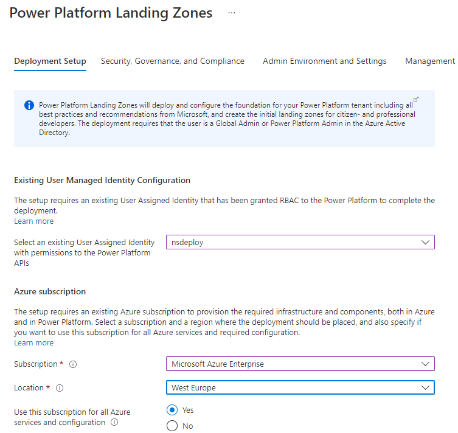

# Power Platform Landing Zones Reference Implementation

This user guide explains the Power Platform Landing Zones reference implementation, what it is, what it does, and how organizations can use it to enable "landing zones" at scale to support their digital transformation for citizen developers, professional developers, and Microsoft Cloud for industries.

| Reference implementation | Description | Deploy | 
|:----------------------|:------------|--------|
| Power Platform Landing Zones | All up architecture for Power Platform with landing zones (Environments) configured with security, governance, and compliance for scalable business applications - and industry solutions for professional and citizen developers | [](https://aka.ms/pplandingzones) |

## Table of Contents

- [What is Power Platform Landing Zones reference implementation?](#what-is-power-platform-landing-zones-reference-implementation)
- [Pricing](#pricing)
- [What if I already have an existing Power Platform footprint?](#what-if-i-already-have-an-existing-power-platform-footprint)
- [How Power Platform Landing Zones reference implementation works](#how-power-platform-landing-zones-reference-implementation-works)
  - [Separating platform and landing zones](#separating-platform-and-landing-zones)
    - [Platform responsibilities and functions](#platform-responsibilities-and-functions)
    - [Landing zone owners responsibilities](#landing-zone-owners-responsibilities)
  - [Power Platform Landing Zones Governance Structure](#power-platform-landing-zones-governance-structure)
  - [What happens when you deploy Power Platform Landing Zones](#what-happens-when-you-deploy-power-platform-landing-zones)
- [Deployment instructions](#deployment-instructions)
  - [Pre-requisites](#pre-requisites)
  - [Step-by-step guidance](#step-by-step-guidance)

---
Power Platform Landing Zones reference architecture provides prescriptive guidance coupled with Power Platform best practices for organizations - regardless of industry and business application scenarios, and it follows 5 design principles across the 8 critical design areas for organizations to define their target state for their Power Platform tenant.

The reference architecture is modular by design and allows organizations of any size to start with the optimized landing zones that support their digital transformation and application portfolios.

In particular, it enables the organizations to start as small as needed and scale alongside their requirements regardless of scale-point.


## What is Power Platform Landing Zones reference implementation?

The Power Platform Landing Zones reference implementation is an optimized, proven, authoritative, and roadmap aligned architecture that enables organizations to rapidly modernize their business applications, and enables citizens and professional developers to accelerate their digital transformation.

## Pricing

There's no cost associated with the reference implementation itself, besides requiring an existing Azure subscription, licenses and capacity within Power Platform as it's an architecture and design composition that spans Azure and Power Platform. However, depending on the options you enable it may incur cost related to Dataverse capacity, logging and retention, as well as premium services like Microsoft Sentinel with Data Connector for Dynamics365.

## What if I already have an existing Power Platform footprint?

Power Platform Landing Zones is designed to meet organizations where they are, whether there's already usage of Power Platform, or if it is a net new deployment. Additional guidance for existing customers will be provided at a later stage.

## How Power Platform Landing Zones reference implementation works

This section describes at a high-level how Power Platform Landing Zones reference implementation works. The landing zones created are the output of a multi-environment setup for the platform which will account for compliance, guardrails, security, connectivity and interoperability, and identity, at scale.

## Power Platform Landing Zones design principles

The design principles outlined in the architecture and design methodology is front and center in the reference implementation, which helps organizations to scale and democratize digital transformation for their citizen - and professional developers.

>Note: The design principles are by design industry agnostic, and applies to all industries. For more details about the design principles and how to use it as a compass across the critical design areas, see the following [article](../../powerPlatform/readme.md)

## Separating platform and landing zones

One of the key tenets of Power Platform Landing Zones is to have a clear separation of the Power *Platform* and the *landing zones*. This allows organizations to scale their architecture and deployment alongside with their business requirements, while providing autonomy to the citizen and professional develops for deploying and doing net-new development into their landing zones. This model fully supports application autonomy and distinguish between central and federated functions.

## Platform responsibilities and functions

Platform resources and shared capabilities should ideally be managed by a cross-functional platform team. The team consists mainly out of the following functions. These functions working in close collaboration with the SME functions across the organization:

- PlatformOps: Responsible for management and deployment of the overall platform, such as Environments, Data-loss prevention policies, billing policies, tenant settings, and related identity resources on Azure AD and cost management for the platform.
- SecOps: Responsible for definition and management of overall policies and IAM permissions on the platform. Security operations includes monitoring and the definition and the operation of reporting and auditing.
- NetOps: Definition and management of the common networking components and integration from on-premises and Azure to Power Platform.

## Landing zone owners responsibilities

When a maker (citizen or/and professional developer) gets a landing zone, the user/team is end-to-end responsible for the components created and running in the Environments. They can independently operate within the security guardrails provided by the platform team. If dependency on central teams or functions are discovered, it is highly recommended to review the process and eliminate as soon as possible to unblock adoption.

## Power Platform Landing Zones governance structure

The governance included with Power Platform Landing Zones reference implementation will ensure a secure-by-default baseline as starting point, covering the tenant, Admin Environments and the different landing zones.

- **Tenant governance:** The setup enables organizations to secure and hardening their tenant from a Power Platform perspective, by assigning a tenant scoped DLP policy. You can select between High, Medium, and Low restrictive DLP policies.

- **Admin Environment governance:** The dedicated Environments created for Admin purposes will be governed by its own DLP to ensure required connectors for the *Center of Excellence Starter-Kit* can be successfully imported to provide key utilities and functionality for managing the Power Platform within the organization.

- **Default Environment governance:**  The Default Environment is accessible by default for any user with a license, and is intended for personal productivity. Given the blast radius within an organization, the recommendation provided in the setup is to further restrict available connectors in the Default Environment, governed by a dedicated DLP policy.

- **Citizen developer landing zones:** When creating landing zones for the citizen developers, you can also assign the recommended DLP policy which will then be scoped to all the Environments you create at this step. This provides recommended starting point to empower citizen developers in the organizations to start on their Power journey in a safe and secure way.

- **Professional developer landing zones:** Similar to citizen developer, you can assign the recommended DLP policy for these landing zones that will enable your professional developers to rapidly contribute by leveraging key connectors among Power Platform, Azure, and Microsoft 365.

## What happens when you deploy Power Platform Landing Zones reference implementation?

By default, all recommendations which originates from the [Power Platform Landing Zones architecture and design methodology](https://aka.ms/NorthStarPowerPlatform) will be enabled by default, and called out as a recommendation. If you would opt out from these, you must explicitly do so in the deployment experience. The deployment will create and configure the following when all options are enabled:

- Security, Governance, and Compliance for Tenant settings:
  - Tenant DLP policies. Select between High, Medium, or Low restricted policy as starting point.
  - Tenant isolation (preview). Specify if you want to block inbound, outbound, or both, and optionally provide tenant ID to explicitly allow.
  - Tenant Guest user and sharing settings. Configure options such as enabling/preventing Azure AD Guest user accounts to make Power Apps, and whether Power Apps can be shared or not.

- Admin Environment and Settings:
  - Configure tenant Environment Settings. Select who can create production and sandbox Environments, restrict trial Environment creation, and restrict capacity (Dataverse) allocation to specific admins.
  - Configure Admin Environments. The setup will create 3 Environments in the designated Region for the Admin scenarios, enabling ALM for the targeted solutions. Recommendation is to import the Center of Excellence starter-kit into these Environments.

- Management and Monitoring:
  - Enable integration with Azure monitoring and security services. Optionally create and configure a dedicated Log Analytics workspace, and specify the data retention required.
  - Enable auditing and integration with M365 Security & Compliance Center. This option will enable auditing on all Environments created during the deployment into M365 Security & Compliance center.
  - Enable Monitoring of Azure AD logs. This option will create a Diagnostic Setting for Azure AD and route the logs to the dedicated Log Analytics workspace.
  - Microsoft Sentinel integration. Optionally you can deploy Sentinel to the Log Analytics workspace for threat detection and preventive guardrails.
  - D365 Data connector for Sentinel. Enables integration of Dataverse events with Microsoft Sentinel.
  - Application Insights integration. Enables integration between Application Insights and Log Analytics for e2e observability of core Power Platform environments for the Admin scenarios.
  - Tenant analytics and usage. Create Data Lake Storage V2 for long-term retention of usage and analytics of the Power Platform adoption.

- Landing Zones:
  - Create and configure landing zones curated towards citizen and professional developers. You can create 200 Environments for each, and also specify if each Environment should be enabled for ALM (this will create dedicated Environments for Developer, Test, and Production for each).

## Deployment instructions

  This section will describe how to deploy the Power Platform Landing Zones reference implementation.

### Pre-requisites

The deployment experience requires a [User assigned managed identity](https://docs.microsoft.com/en-us/azure/active-directory/managed-identities-azure-resources/how-manage-user-assigned-managed-identities?pivots=identity-mi-methods-azp#create-a-user-assigned-managed-identity) registered as a [Power Platform admin management application](https://docs.microsoft.com/en-us/power-platform/admin/powerplatform-api-create-service-principal).

> Note: The actions below must be executed with a user that have at least [Contributor](https://docs.microsoft.com/en-us/azure/role-based-access-control/built-in-roles#contributor) access to an Azure subscription and [Power Platform Administrator](https://docs.microsoft.com/en-us/power-platform/admin/use-service-admin-role-manage-tenant#power-platform-administrator) or [Global Administrator](https://docs.microsoft.com/en-us/azure/active-directory/roles/permissions-reference#global-administrator) permissions in Azure AD.

**1.** In the Azure Portal, navigate to 'Managed Identities' and create a User Managed Identity in your preferred Subscription/Resource Group/Region.
    
    
**2.** Navigate to the User assigned managed identity and copy the Client ID from the identity.
    
**3.** In a PowerShell core session (local or [Azure Cloud Shell](https://docs.microsoft.com/en-us/azure/cloud-shell/overview)), authenticate with Azure and follow instructions below to register the User assigned managed identity as a admin management application.
```powershell
# Connect to Azure
Connect-AzAccount

# Install PowerOps module
Install-Module -Name PowerOps -Force -AllowPrerelease

# Register Admin management application
$clientId = '<Replace with client id from UMIlient id>'
Register-PowerOpsAdminApplication -ClientId $clientId
```
  


### Deployment Setup

The first tab in the experience is where you configure the Deployment Setup. Provide the User Managed Identity you created in the pre-requisites, as this identity will be used to bootstrap and configure the Power Platform.
Also, a subscription is required in order to place the deployment that is being created, targeting an Azure region.

Optionally you can select if the subscription provided at this step should be used for all the Azure services that you will create as part of th deployment.



### Security, Governance, and Compliance

On the **Security, Governance, and Compliance** tab, you can assign one of the recommended DLP policies to the tenant, which will apply to *all* Environments, both new and existing.

If you require tenant isolation, you can select if inbound, outbound, or both should be blocked, and optionally provide tenant IDs for those who should be explicitly allowed.

Lastly, you can configure Tenant Guest and sharing settings.


### Admin Environment and Settings

On this tab, you can select the overall Tenant settings for Environment creation. It is recommended to restrict who can create Sandbox, Production, and Trial Environments as well as who can allocate capacity within the tenant.


The setup will create 3 dedicate Environments for Admin purposes into the selected Power Platform region, where you can import the Center of Excellence starter-kit in order to manage the Power Platform adoption within the organization, providing core utilities such as advanced usage and analytics, request fulfillment and more. Select if you want to create a billing policy and use the provided Azure subscription for pay-as-you-go for the Admin Environments.


### Management and Monitoring

For e2e monitoring of the Power Platform tenant, Azure services are required and recommended to fullfil this. On the **Management and Monitoring** tab you can create a Log Analytics workspace and specify the retention policy for the data being ingested.


When enabling the Log Analytics workspace, additional configuration can be made, such as enabling diagnostics logs for Azure AD, create Microsoft Sentinel with D365 Data Connector, and integrate the workspace with Application Insights for various Power Platform monitoring.


To configure tenant level analytics for the Power Platform, you can optionally create a Data Lake Storage V2 storage account that will be dedicated for this in your provided Azure subscription.


### Landing Zones

Once you have configured the previous tabs, you have effectively configure the **platform** side of the setup. On the **Landing Zones** tab, this is where you will configure and create the Environments that will be used as landing zones for your organization's citizen and professional developers.

- **Default environment**

You can optionally rename the Default Environment in your tenant so the intent of this Environment is clear for all users with an assigned license, which will have access.

It is also recommended to further restrict what connectors can be used here, by assigning a dedicated DLP policy scoped to the Default Environment only.


- **Landing Zones for citizen developers**

You can create landing zones for the citizen developers, either with or without Dataverse, and optionally customize each of the environment in case you want to create them into different regions, as well as assigning RBAC.


To create up to 100 environments in batches, select the option "Yes, with Dataverse (recommended)", or "Yes, without Dataverse", select the target region and the naming convention for these Environments.


To customize each environment, select the option "Yes, and let me configure each Environment". This allows you to create 100 Environments with your preferred name for each, the target region, if Dataverse should be enabled, and additionally you can assign RBAC permissions for your individual citizen developers.


Additional configuration for the citizen developer landing zones can be made, by assigning recommended DLP policies to ensure an optimal starting point for citizen developers, as well as enabling recommended ALM (application life-cycle management) by creating dedicated developer, test, and production Environment for each Environment being created.


- **Landing zones for professional developers**

Similar to the landing zones for citizen developers, you can create landing zones for professional developers which will provide them with an on-ramp path to Power Platform, secured by recommended DLP policies that enables co-existence and synergy with Azure, Microsoft 365, and Power Platform.

Similar as the landing zones for citizen developers, you can either create N environments in batches, or customize each environment, assign recommended DLP policies, and optimize for ALM by ensuring there's dedicated ENvironments for each for development, testing, and production usage.


- **Landing Zones for Industry Clouds**

Microsoft Cloud for Industry will require Power Platform and dedicated Environments, and if required, you can select the Industry your organization is in, and the setup will create the Environments with the required dependencies for you to complete the solution deployment in [Microsoft Cloud Solution Center](https://solutions.microsoft.com).


### Review + Create

Once you have completed the deployment wizard, you can review your configuration and start the deployment.

## Post-deployment activities

*In-progress*
