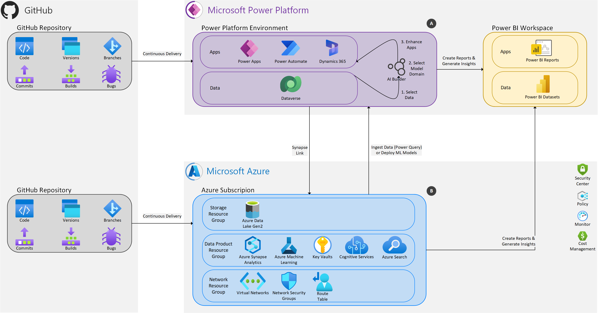

# Data-driven Application

Dynamic data-driven application systems (DDDAS) is a modern application development paradigm with the objective to dynamically incorporate diverse datapoints and measurememts to influence the execution model of the system. Datapoints and insights from historical data collections are integrated into a real-time system and combined with the context in form of online data to allow more effective and accurate results, responses, experiences or decisions. In some scenarios, states cannot be directly measured. As a result, estimations and data assimilations are required. DDDAS ultimately allows to create a dynamic feedback loop which can be used to further enhance the execution model or enhance capabilities of a system.

New capabilities can be driven by new science and technology capabilities and can be related to application modeling approaches, algorithm developments (mathematical and statistical algorithms), systems software & instrumentation methods among others. Today, data science and smart BI solutions can be seen as the main driver of DDDAS, hence we will focus on this topic in this article.

This article will look at DDDAS from a business application context using Microsoft Power Platform as an application framework and will illustrate architectures that can be used to design data-driven applications in combination with other features of the Microsoft Power Platform or other Microsoft technologies. Two different design patterns will be showcased which serve different levels of requirements and use cases.

## Designing a Data-driven Application on the Microsoft Power Platform

The architecture diagram below illustrates the two design patterns (A) and (B), which will be further discussed below:

## (A) Data-driven Application using Microsoft Power Platform

TODO

## (B) Data-driven Application using Microsoft Power Platform and Microsoft Azure

TODO
