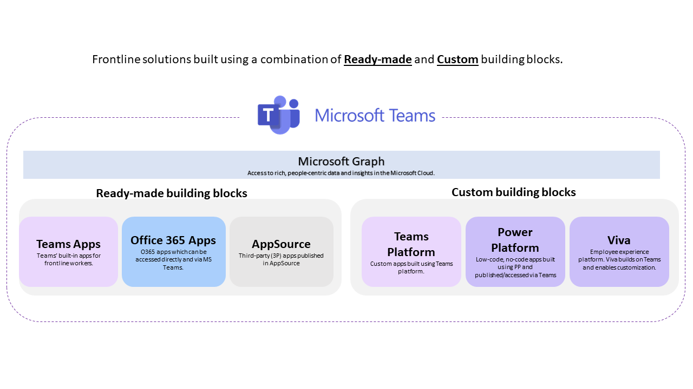
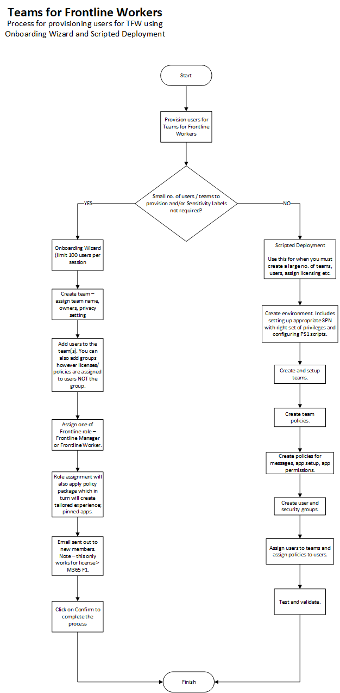

# Teams for Frontline Workers

Teams for Frontline Workers (TFW) is targeted at employees whose primary function is to work directly with customers or the general public providing services, support, and selling products.

**TFW is not a separate application**. It is a solution which builds upon features and capabilities of Teams and it is targeted at mobile workforce. The goal with TFW is to create a valuable solution for frontline workers. The apps are optimized for consumption via a mobile device and targeted at use-cases specific to personas synonymous with retail workforce such as supplychain workers; shopfloor assistants etc. TFW leverages extensibility of Teams, and delivers experiences for frontline workers through which are enabled through MS Teams app. MS Teams is a foundation which delivers a simple, intuitive and secure solutions for frontline workers and consolidating the tools they use in a single pane of glass.

TFW solutions includes combination of **ready-made building blocks** (pre-built apps built on Teams, AppSource, O365 apps) and **custom building blocks** (custom apps built using Teams Platform and/or Power Platform). The solutions built using these building blocks are then published via Teams app.

**Ready-made** apps are built using one or more building blocks include the following:

- **Teams apps**. These are Teams built-in apps made for frontline workers. Example includes Shifts, Planner etc.
- **Office 365 apps**. These are the Office 365 apps that work both inside and outside of Teams. Examples include Word, PowerPoint etc.
- **Third-party apps** (apps published via AppSource).

**Custom apps** can be built using one or more of the following building blocks (see list below). Platforms such as Teams; Viva; and Power Platform enable custom development and support publishing of apps via Teams.

- **Teams Platform**
- **Power Platform**
- **Viva**

> Note: Separate licenses are required for Power Platform and Viva. Building and publishing custom apps using Power Platform, Viva and Teams Platform is beyond the scope of this document.

The **key takeaways** are:

- TFW enables frontline workforce to access apps via Teams.
- TFW builds upon capabilities of MS Teams and it's not a separate application.
- The apps are optimized for mobile experience.
- A solution is composed of one or more apps. The apps could be ready-made or custom apps built.
- Teams provides a single hub for teamwork and keeps frontline and information workers connected.
- The solutions for built building blocks (listed above) address one or more areas for frontline workers:
  - Communication
  - Wellbeing and engagement
  - Schedule management
  - Training and onboarding
  - Digitized processes
  - Digital ecosystem

> Note: The considerations and recommendations are from perspective of an organisation which is at the beginning of its **Teams for Frontline Workers** journey.

Solutions surfaced via Teams using buiding blocks .. we can think of experience areas which holistically represent the end-to-end experience of a frontline workers. A valuable solution for a frontline worker falls under one or more of the following areas. It's a way of framing how one builds a solution in Teams to drive true value. A successful solution falls under the following categories

| Reference implementation | Description | Deploy |
|:-------------------------|:------------|--------|
| Teams for Frontline Workers| Reference implementation for TFW includes default Team apps; policy packages for Frontline manager and worker.  |**Coming Soon** |

## Design Considerations

- Teams for Frontline Workers builds upon capabilities of Team, hence we advise that you consider [limits and specifications for MS Teams](https://docs.microsoft.com/microsoftteams/limits-specifications-teams) while planning a deployment for your organization.

- There are 3 Frontline Worker plans which organisations can choose from to enable TFW.  Depending on the type of activities and features required to accomplish frontline activities, you may choose either M365 F1, M365 F3 or O365 F3 license. Full list of licenses and associated features is available [here](https://go.microsoft.com/fwlink/p/?linkid=2139145).

- Consider characterstics of a **Frontline worker** and an **Information worker**. **Frontline worker** is the primary audience for Teams for Frontline Workers. Differentiation between the two types of workers influences type of licenses you purchase for your team. Licensing has an implication in terms of features and cost.

    |Frontline Worker|Information Worker|
    |:------------|:---------------|
    Uses a mobile device such as a tablet or phone to carry out tasks or access organisational information. | Uses desktop apps such as Office, PowerPoint etc. accomplish their job.
    | Interacts with customers directly. | Interacts primarily with other team members who work in the head-office or within the same site.
    | Communicates on the go; schedule shifts; check-off tasks etc. via Teams. | Communicates over Teams and uses chat, meet, voice and Office apps via Teams.
    | Frontline liceses M365 F1, M365 F3 or O365 F5 | Enterprise licenses.

- Consider using [Advisor for Teams](https://docs.microsoft.com/microsoftteams/use-advisor-teams-roll-out) to assist with planning and deployment of Teams across your organization. There is a learning path available as well to familiarise yourself with [Teams advisor](https://docs.microsoft.com/learn/modules/m365-teams-rollout-using-advisor/).

- Consider using [Frontline Workers scripted deployment](https://docs.microsoft.com/microsoftteams/flw-scripted-deployment) to onboard a large number of users to MS Teams. The scripted experience is driven by PowerShell modules. The [scripts](https://aka.ms/flwteamsscale) are provided as-is by Microsoft and must be modified based on an organization's requirements. As a result of PowerShell's extensibility features administrators can extend scripted deployment and add additional steps as per their requirements i.e. applying [sensitivity labels](https://docs.microsoft.com/microsoft-365/compliance/sensitivity-labels-teams-groups-sites?view=o365-worldwide).

- For improved user experience and reducing adminisrative overhead, you may choose to enable tailored frontline app experience. With [tailored frontline experience](https://docs.microsoft.com/microsoftteams/pin-teams-apps-based-on-license), Teams pins apps based on license to give your frontline workers an out-of-the-box experience in Teams that’s tailored to their needs., your frontline workers get the most relevant apps in Teams without any action needed from the admin.

    > Note: This feature is currently being rolled out and might not be available in your organisation yet.

- If you are using M365 F1 licenses for frontline team, then users won't get an email when they are assigned membership of a team as F1 license does have email feature.

- Consider the following best practices for various aspects of MS Teams:
  - [Organizing teams](https://docs.microsoft.com/en-us/microsoftteams/best-practices-organizing)
  - [Teams access policies](https://docs.microsoft.com/en-us/microsoft-365/security/office-365-security/teams-access-policies?view=o365-worldwide)

## Design Recommendations

- Microsoft has published [Teams for Frontline Workers solutions success kit](https://github.com/TeamsFLW/Teams-FLW-Solutions-Success-Kit) which has assets to help any frontline digital enablement project end-to-end. It covers end-to-end journey implementing Teams for Frontline Workers (TFW) and the approach is aligned to delivering a valuable solution for frontline workers.

- We recommend that your deployment plan must include:
  - Understanding of Teams architecture
  - Calculated network requirements and ensuring that capacity requirements are satisfied
  - Understanding regulatory and compliance requirements
  - An adoption plan for Teams

- We recommend that you review and complete the items listed [here](https://docs.microsoft.com/microsoftteams/get-started-with-teams-quick-start#make-sure-youre-ready).

- Microsoft Teams is constantly evolving and new features are added frequently. From operational perspective, we recommend administrators to monitor the following channels for latest updates and announcements.

  - [Teams blog](https://aka.ms/teamsblog)
  - [Teams roadmap](https://aka.ms/O365Roadmap)
  - [Release notes](https://support.office.com/article/what-s-new-in-microsoft-teams-d7092a6d-c896-424c-b362-a472d5f105de)
  - [MS Teams technical community](https://aka.ms/TeamsCommunity)

- Upon successful completion of pilot phase, we recommend you provision [Teams at scale for Frontline Workers](https://docs.microsoft.com/microsoftteams/flw-scripted-deployment).

- From an administrator perspective, there are two experiences available for onboarding users - **Onboarding Wizard** and **Scripted Deployment**. Onboarding wizard involves provisioning users via a web portal experience. Scripted deployment is intended for large-scale deployments where a large number of users must be provisioned. Both provisioning models have a few differences:

||Onboarding Wizard|Scripted Deployment|
|:-|:-|:-|
Limit on no. of users which can be provisioned at a time|100|No hard limit.
Deployment experience|M365 Admin Portal|PowerShell|
|Sensitivity labels assignment during provisioning process|No|Yes
|Auditibility and logging|M365 Admin Center logging and auditing features. | In addition to standard [M365 Admin Center logs](https://docs.microsoft.com/microsoft-365/admin/activity-reports/activity-reports?view=o365-worldwide#which-activity-reports-are-available-in-the-admin-center), actions of PowerShell scripts can be logged and stored for auditing and troubleshooting purposes. In addition, if you are using Azure DevOps Pipelines to provision users, teams, policies etc., the actions can be tracked and associated with a pipeline run date/time.
|Programmatic approach|No|Yes - existing PowerShell scripts can be modified and new capabilities can be added based on extensibility features of PowerShell.
|Extensibility|Limited|Yes - primarily through [Microsoft Graph](https://docs.microsoft.com/graph/overview); [Microsoft Teams PowerShell](https://docs.microsoft.com/microsoftteams/teams-powershell-overview); [Microsoft Graph SDK](https://docs.microsoft.com/graph/sdks/sdks-overview).

- We recommend using scripted deployment experience when you have to accomplish the following activities for a large number of users:

  - Create a large number of users
  - Create a large number of Teams and channels
  - Assign licenses at scale
  - Create and deploy policies
  - Assign team membership to a large number of users
  - Extend the automated deployment pipeline to include additional steps such as [using PowerShell to apply sensitivity labels to sites](https://docs.microsoft.com/microsoft-365/compliance/sensitivity-labels-teams-groups-sites?view=o365-worldwide#use-powershell-to-apply-a-sensitivity-label-to-multiple-sites).

- Teams are a collection of people, content, and tools within your organization. For most frontline worker-centric organizations, it is best practice to anchor a team around a physical location.

- When designing your channel structure, it's important to keep things simple, especially when you're looking to onboard a lot of users. Resist the urge to create channels for every situation, role, or topic in order to minimize the need for training. Pick 3-5 channels at most to get started.

- We recommend creating two policies: one for frontline workers and one for frontline managers. For most customers, two is a good place to start, even if you give the same settings to each group initially. As your experience with Teams grows, you may choose to differentiate their experience further and having the two separate policies already created can make that simpler. For best practices for Teams policies, we recommend the following [best practices](https://docs.microsoft.com/microsoft-365/security/office-365-security/teams-access-policies?view=o365-worldwide).

- When designing your teams, it's important to keep in mind [Teams limits and specifications](https://docs.microsoft.com/microsoftteams/limits-specifications-teams). For smaller organizations, an org-wide team can be used to streamline communication and complement a physical location structure.

- If you are new to Teams, we recommend completing the training content and learning paths targeted at different aspects of deploying and operating Teams for your organization.

  - [Microsoft Learn for Teams](https://docs.microsoft.com/learn/teams/)
  - [Teams admin center](https://docs.microsoft.com/learn/modules/m365-teams-navigate-admin-portal/)
  - [Configure networking for Teams](https://docs.microsoft.com/learn/modules/m365-teams-connectivity/)
  - [Onboard users to Teams](https://docs.microsoft.com/learn/modules/m365-teams-onboard-users/)

- We recommend enabling sensitivity labels to protect content in Microsoft Teams. [Sensitivity labels](https://docs.microsoft.com/microsoft-365/compliance/sensitivity-labels-teams-groups-sites?view=o365-worldwide) must be used to classify and protect content in Microsoft Teams.
