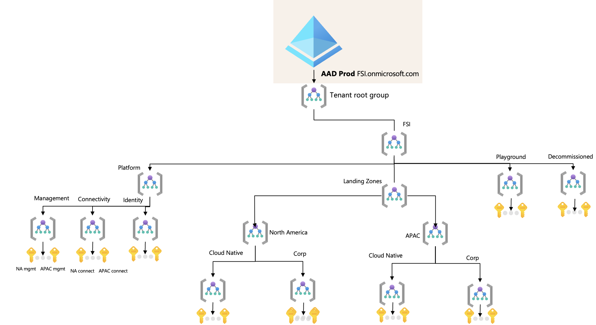

# Architecture and Design

This article goes into the details of the architecture and design of the FSI Landing Zones on Microsoft Azure, and explains key design areas and recommendations across the critical design areas for Azure as a whole that an organization within the financial services industry must consider.

## Table of contents

* [Architecture overview](#overview)
    * [Multi-subscription design](#multi-subscription-design)
    * [Multi-region design](#multi-region-design)
    * [Autonomy and governance](#autonomy-and-governance)
* [Separating platform and landing zones](#separating-platform-and-landing-zones)
    * [Platform responsibilities and functions](#platform-responsibilities-and-functions)
    * [Landing zone owners responsibilities](#landing-zone-owners-responsibilities)
* [FAQ](#faq)
* [Anti-Patterns and untold stories](#anti-patterns-and-untold-stories)
* [Next Steps](#next-steps)

## Architecture overview

FSI Landing Zones on Microsoft Azure provides a scalable architecture from the very first workload to a large enterprise regardless of scale-point. The scale-out architecture is enabled by a purpose-built management group structre that caters for:

* Centralized management of the platform
* Centralized and federated management of the landing zones, supporting N characteristcs of workloads from a policy, networking, management, and security perspective
* On-ramp path to Azure for existing workloads and applications, and net new development and exploration
* Life-cycle management of Azure subscriptions

The architecture is tied closely to the Policy-Driven governance design principle, which enables automony for the *platform*, *landing zones*, and the *workload* within the landing zones. The architecture will meet FSI customers where they are, whether it is brownfield or greenfield, and allow them to scale alongside business requirements, and is aligned with the overall platform roadmap for Microsoft Azure.

A high-level view of the management group structure can be seen below, that provides clear intentions and boundaries for the platform and landing zones.

The architecture is also rooted on the following principles, which are explained in more detail below:

### Multi-subscription design

FSI Landing Zones leverage a multi-subscription design where the platform and landing zones are explicitly separate from each other. A subscription is used to isolate resources, serves as a scale unit, and is a management and policy boundary. Having a multi-subscription design by default provides the following benefits:

* Rapid innovation and experimentation. Each subscription can be used to experiment with new technologies, and can be quickly deleted when no longer needed. Subscriptions can be allocated to application teams, specific workloads, or to specific environments (e.g. development, test, production).

* Governance and management at scale. Subscriptions can be managed independently, yet still be governed centrally at scale by grouping them into management groups to ensure uniform policies and standards are applied across the organization.

* Simplified cost management. Using multiple subscriptions will not incurr additional costs, and can be used to isolate costs for specific workloads or environments. The consumption of the cost can be done in various ways, such as by subscription, management groups, or tags.

FSI Landing Zones provides a prescriptive guidance on how to structure the subscriptions and management groups in Azure. As a starting point, there will be 3 dedicated subscriptions for the platform purposes:

* Connectivity
This is the dedicated subscription for the initial hub in the first Azure region you have precense/will start with. It will contain all centrally managed networking resources such as VNETs, VPNs, ExpressRoute, etc. This subscription will be managed by the platform team, and more specifically the networking team.

* Management

### Multi-region design

FSI Landing Zones on Microsoft Azure is grounded on key design principles that has been developed and evolved over years of experience. The design principles are:

## Separating platform and landing zones

One of the key tenets of FSI Landing Zones architecture is to have a clear separation of the Azure *platform* and the *landing zones*. This allows organizations to scale their Azure architecture alongside with their business requirements, while providing autonomy to their application teams for deploying, migrating and doing net-new development of their workloads into their landing zones. This model fully supports workload autonomy and distinguish between central and federated functions.

Architectually, the separation is achieved by having dedicated management group for the platform, and dedicated management group for the different types of landing zones - such as corp connected workloads, and online workloads which drives different set of requirements for networking, security, governance and compliance.

By having the separation at this level, FSI organizations can scale out both the platform and the landing zones independently and without having to revisit the whiteboard to understand what must be done *when* a new subscription is being introduced, and the intent of that subscription.

## Platform responsibilities and functions

Platform resource are managed by a cross-functional platform team. The team consist mainly out of the following functions. These functions working in close collaboration with the SME functions across the organization:

- PlatformOps: Responsible for management and deployment of control plane resource types such as subscriptions, management groups via IaC and the respective CI/CD pipelines. Management of the platform related identify identity resources on Azure AD and cost management for the platform.
 Operationalization of the Platform for an organization is under the responsibility of the platform function.

- SecOps: Responsible for definition and management of Azure Policy and RBAC permissions on the platform for landing zones and platform management groups and subscriptions. Security operations including monitoring and the definition and the operation of reporting and auditing dashboard.
- NetOps: Definition and management of the common networking components in Azure including the hybrid connectivity and firewall resource to control internet facing networking traffic. NetOps team is responsible to handout virtual networks to landing zone owners or team.

## Landing zone owners responsibilities

FSI Landing Zones reference implementation enables landing zones supporting a both centralized and federated application DevOps models. Most common model are dedicated **DevOps** team aligned with a single workload. In case of smaller workloads or COTS or third-party application a single **AppDevOps** team is responsible for workload operation. Independent of the model every DevOps team manages several workload staging environments (DEV, UAT, PROD) deployed to individual landing zones/subscriptions. Each landing zone has a set of RBAC permissions managed with Azure AD PIM provided by the Platform SecOps team.

When the landing zones/subscriptions are handed over to the DevOps team, the team is end-to-end responsible for the workload. They can independently operate within the security guardrails provided by the platform team. If dependency on central teams or functions are discovered, it is highly recommended to review the process and eliminate as soon as possible to unblock DevOps teams.