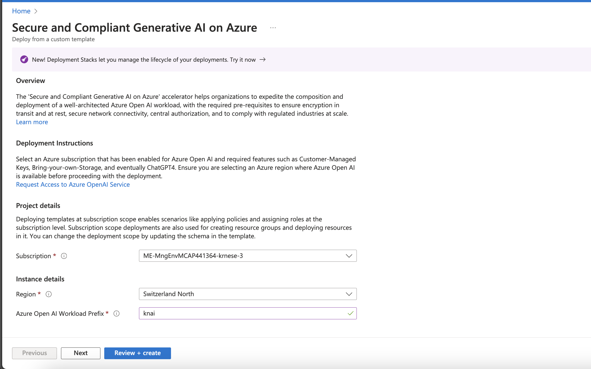
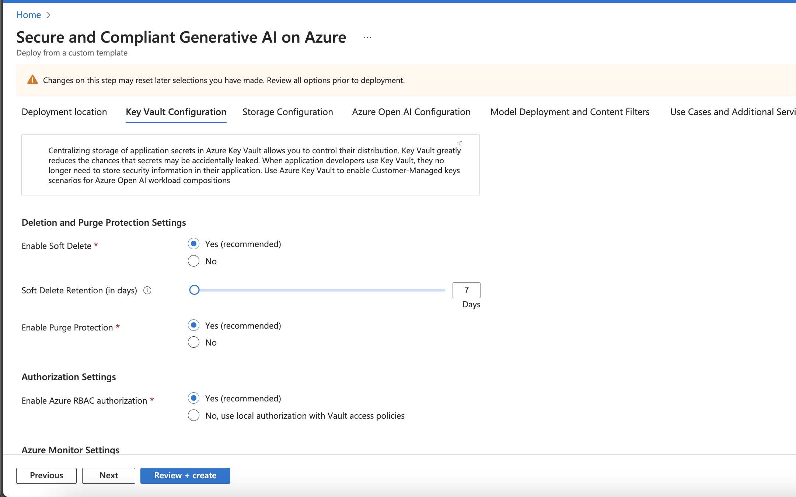
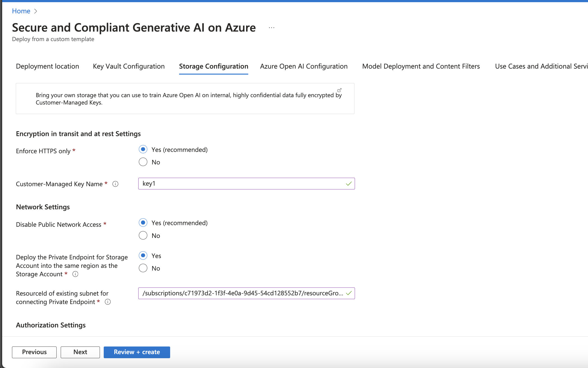
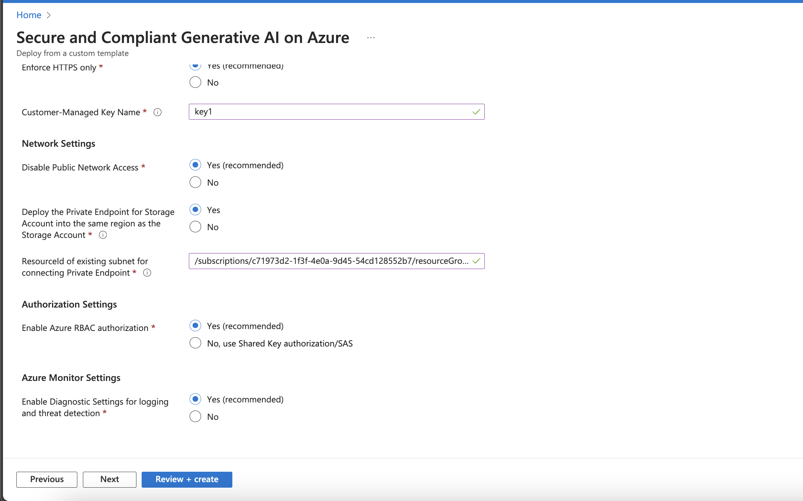
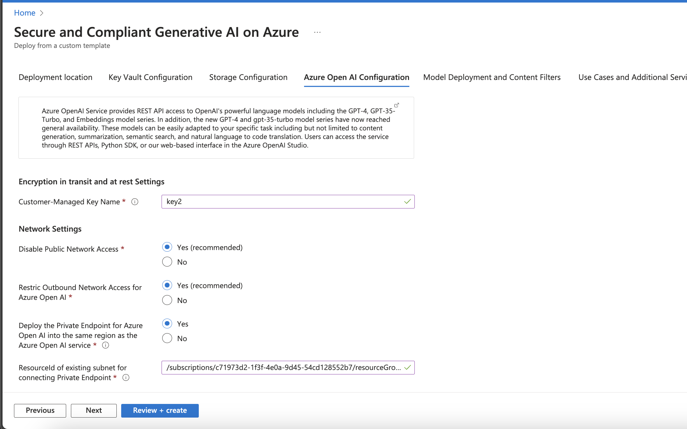

# Secure and Compliant Generative AI on Azure - User Guide

This user guide explains the setup and deployment of "Secure and Compliant Generative Azure Open AI".
The reference implementation has been developed, validated, and proven with several of Microsoft's largest FSI customers, and represent the best practices for the FSI industry to accelerate a safe and secure by-default deployment of Generative Azure Open AI on Microsoft Azure. We will continue to enhance and develop the reference implementation alongside with the overall Azure roadmap, based on proven and validated design patterns with FSI customers at scale.

## Table of Contents

- [What is Secure and Compliant Generative AI on Azure?](#what-is-secure-and-compliant-generative-ai-on-azure)
  - [Alignment with FSI Landing Zones](#alignment-with-fsi-landing-zones)
  - [Deploy for PoC and testing purposes](#deploy-for-poc-and-testing-purposes)
  - [Architecture and scale-out considerations](#architecture-and-scale-out-considerations)
- [Deployment instructions](#deployment-instructions)
  - [Pre-requisites](#pre-requisites)
  - [Step-by-step deployment guidance](#step-by-step-deployment-guidance)

---

| Reference Implementation | Description | Deploy | Documentation
|:----------------------|:------------|--------|--------------|
| Secure and Compliant Generative AI on Azure | Secure and Compliant Generative AI, aligned with the prescriptive guidance for FSI Landing Zones, ensuring a secure and compliant Azure Open AI workload composition into the landing zones | | [User Guide](./fsiAOAI.md)

## What is Secure and Compliant Generative AI on Azure?

Azure Open AI provides powerful, generative AI capabilities that organizations can access securely over a private network, use their own customer-managed keys to encrypt the data, and enable sophisitcated monitoring and observability of their AI workloads, while managing authentication and authorization centrally. This reference implementation provides a secure and compliant deployment of Azure Open AI, and the recommended configuration is aligned with the recommended Azure policies provided by FSI Landing Zones for the Azure services in this workload composition.

Further, it allows organizations to deploy the Azure Open AI instance(s) to the regions of their choice, and where capacity exists for the respective model deployments, while honoring the connectivity and networking requirements of the organization.

The Secure and Compliant Generative Azure Open AI includes the following Azure services:

* Cognitive Services
  * Azure Open AI
* Private Endpoint
* Network Security Groups
  * Application Security Groups
* Storage Accounts
* Key Vault for CMK
* Azure Monitor
  * Log Analytics
* Managed Identity
* Role Assignments

Optionally, you can also get started with the initial Gen AI use case (e.g., Azure native RAG architecture and setup) to accelerate the adoption of Generative AI in your organization.

* Model deployments, such as:
  * GPT-3
  * GPT-4
  * GPT-35-turbo
  * GPT-35-turbo-16k
  * GPT-4-32k
  * GPT-4 with Vision
* Azure AI Search

## Alignment with FSI Landing Zones

FSI Landing Zones on Microsoft Azure provides a secure-by-default architecture and deployment guidance for Azure services, and the Secure and Compliant Generative Azure Open AI reference implementation is aligned with the recommended Azure policies provided by FSI Landing Zones for the Azure services in this workload composition.

All Azure policies in FSI Landing Zones is [documented in this article](./fsiPolicies.md) which provides a detailed view for all the policies per Azure service. You can assess them per Azure Service and map to the services included in the Secure and Compliant Generative Azure Open AI reference implementation.

A few examples:

1. It is recommended to deploy Azure Open AI using a private endpoint, and not expose the service over the public internet. This is enforced by the Azure Policy "Cognitive Services accounts should disable public network access" documented in this section [Azure Open AI - Private Endpoint](./fsiPolicies.md#azure-open-ai---private-endpoint).
2. It is also recommended to enable Azure RBAC for Azure Open AI, so both the level of access, and what type of access is granted to the service can be controlled centrally. This is enforced by the Azure Policy "Configure Cognitive Services accounts to disable local authentication methods".
3. Lastly, it is recommended to use a customer-managed key to encrypt the data, hence an Azure Key Vault is required, as well as several additional Azure policies to ensure the correct configuration of the Key Vault. This is enforced by the Azure Policy "Cognitive Services accounts should enable data encryption with a customer-managed key".

## Deploy for PoC and testing purposes

Although the reference implementation is tailored for the FSI industry, it can be used by any organization that requires a secure and compliant deployment of Azure Open AI. The reference implementation is designed to be deployed in a single Azure region, in a subscription where the virtual network with a dedicated subnet has been created upfront, to be used for the Private Endpoint. However, you can toggle any of the options to deploy the Azure Open AI instance(s) to the regions of your choice, and where capacity exists for the respective model deployments, while honoring the connectivity and networking requirements of the organization. For PoC and testing, you may want to quickly validate a use-case without requiring private connectivity, or monitoring enabled, and the reference implementation provides the flexibility to enable or disable these features as needed.

## Architecture and scale-out considerations

> Note: It is recommended to follow the best practices and overall recommendations when deploying the Secure and Compliang Generative Azure Open AI reference implementation, however, everything can be configured to meet the exact requirements of your organization. With that said, e.g., enablig Public Endpoint for one or more of the Azure services, the FSI Landing Zones provides additional controls to limit the scope of the public endpoint to a specific IP address range with firewall enabled.

The Secure and Compliant Generative Azure Open AI reference implementation is designed to be deployed in a single Azure region, in a subscription where the virtual network with a dedicated subnet has been created upfront, to be used for the Private Endpoint. 

The diagram above shows an example where the Secure and Compliant Generative Azure Open AI is being deployed to a compliant, corp connected landing zone, where all services are connected via private endpoint to the virtual network. The virtual network is connected to the hub virtual network via VNet peering, and the hub virtual network is connected to on-premises network via ExpressRoute.

In the most simplistic form, users - assuming Azure RBAC has been granted to the Open AI instance, and model deployment has completed, can interact with the Azure Open AI API over the private endpoint, and the Azure Open AI instance will respond with the generated text. If any data must be provided, the storage account is encrypted using customer-managed keys, and the keys are stored in a Key Vault. The Key Vault is also used to store the customer-managed keys for the Azure Open AI instance.

### Design considerations

* To scale out the Azure Open AI instance, there's a few things to consider:

    * The limit of Azure Open AI resources per region per Azure subscription is 30
    * The regional quota (soft) limits (token per minutes) per Azure subscription for GPT-35-Turbo and GPT-4 are as follows: 
    * GPT-35-turbo: 
        * eastus, southcentralus, westeurope, francecentral, uksouth: 240k
        * northcentralus, australiaeast, eastus2, canadaeast, japaneast, swedencentral, switzerlandnorth: 300k
    * GPT-35-turbo-16k:
        * eastus, southcentralus, westeurope, francecentral, uksouth: 240k
        * northcentralus, australiaeast, eastus2, canadaeast, japaneast, swedencentral, switzerlandnorth: 300k
    * GPT-4:
        * eastus, southcentralus, westeurope, francecentral: 20k
        * northcentralus, australiaeast, eastus2, canadaeast, japaneast, uksouth, swedencentral, switzerlandnorth: 40k
    * GPT-4-32k:
        * eastus, southcentralus, westeurope, francecentral: 40k
        * northcentralus, australiaeast, eastus2, canadaeast, japaneast, uksouth, swedencentral, switzerlandnorth: 80k

* A single Azure Open AI instance may be suitable for a small PoC by independent application teams. 
* If a model in an Azure Open AI instance is shared by multiple teams, it is a "first come - first served" behavior, and the application must cater for retry logic and error handling.
* Quota is shared between all instances and models in the same region and subscription.

### Design recommendations

* If a model in an Azure Open AI instance is shared by multiple teams, and the model is being used by multiple applications, it is recommended to deploy a dedicated Azure Open AI instance per application, and load balance the requests across the instances. This will provide separation at instance level, and the application layer is responsible for load balancing, retry logic, and error handling if needed.
* To scale out Azure Open AI with multiple instances, it is recommended to deploy the instances across dedicated subscriptions, across dedicated regions. The quota is per region per subscription, and the regional quota is soft limit, and can be increased by contacting Microsoft support.
* Use centralized RBAC (Azure AD) and disable API key access to Azure Open AI, to avoid the need to manage API keys per application, and to ensure that the access to the Azure Open AI instance is centrally managed and controlled.
* Use customer-managed keys to encrypt the data, and store the keys in a Key Vault. This will ensure that the data is encrypted at rest, and the keys are stored in a secure location, and can be rotated as needed.
* Use centralized RBAC (Azure AD) for the Key Vault to ensure that the access to the Key Vault is centrally managed and controlled.
* Empower the application to use dedicated, application-centric Log Analytics Workspace(s) for the Azure Open AI instance(s) and requisite components such as Key Vault, Storage Accounts, NSGs etc., to ensure that the logs are stored in a secure location, and can be accessed by the application team as needed, and where they can build out their own observability using dashboards, workbooks, and alerts.
* Use Azure Policy to ensure that the Azure Open AI instance(s) are deployed with the right configuration, and that the configuration is maintained over time. For example, it is recommended to deploy Azure Open AI using a private endpoint, and not expose the service over the public internet. This is enforced by the Azure Policy "Cognitive Services accounts should disable public network access" documented in this section [Azure Open AI - Private Endpoint](/docs/fsiPolicies.md#azure-open-ai---private-endpoint).

## Deployment instructions

This section will describe how to deploy the "Secure and Compliant Generative Azure Open AI" reference implementation into an Azure subscription.

### Pre-requisites

The "Secure and Compliant Generative Azure Open AI" reference implementation is deployed at the *subscription* scope in Azure, and requires a few pre-requisites to be in place before you can deploy the reference implementation:

- Ideally use a dedicated Azure subscription, where you have submitted the subscription ID into the form for [requesting access to Azure Open AI](https://customervoice.microsoft.com/Pages/ResponsePage.aspx?id=v4j5cvGGr0GRqy180BHbR7en2Ais5pxKtso_Pz4b1_xUOFA5Qk1UWDRBMjg0WFhPMkIzTzhKQ1dWNyQlQCN0PWcu). This will ensure that the subscription is enabled for Azure Open AI, including GTP-4.
- Once the subscription has been approved, you must request access to customer-managed key (CMK) and bring-your-own-storage (BYOS) for Azure Open AI. This is done by submitting another request using [this form](https://forms.office.com/Pages/ResponsePage.aspx?id=v4j5cvGGr0GRqy180BHbR65c5WORsv5NtSDPjRrSCMhUNDZJUERRVVVDME4xNDVNRjEwMTNZV1dHSSQlQCN0PWcu)
- The user who's deploying the reference implementation must be *Owner* of the subscription where the reference implementation will be deployed, as the deployment will be making role assignments for the managed identities that are created.

## Step by step deployment guidance

This section will explain the deployment experience and the options provided for the "Secure and Compliant Generative Azure Open AI" reference implementation.

Once the pre-requisites have been completed, you can deploy the reference implementation using this link [*Deploy to Microsoft Cloud*](https://aka.ms/fsiazureai), it will start the deployment experience in the Azure portal into your default Azure tenant. In case you have access to multiple tenants, ensure you are selecting the right one.

### 1 - Deployment location

On the first page, select the *Region*. This region will primarily be used to place the deployment resources in an Azure region, but also used as the initial region for the resources that are created, unless you explicitly select a different region for the Private Endpoints (covered later). Provide a prefix for the naming convention that will be used for the resources.
> Note: the naming convention will primarily consist of 'prefix'-'region'-'resourcetype' where possible.

### 2 - Key Vault Configuration

Configure the Key Vault that will be used to store the keys used by the storage account for encryption at rest, as well as the Azure Open AI service. It is recommended to leave with the default recommendations as it relates to the security and compliance recommendations. If needed, you can opt out of the recommendations, assuming you are aware of the implications.

In the networking section when deploying using a Private Endpoint, you must provide the resourceId of an existing subnet in the same region where you are deploying into. 
If you want to deploy the Azure Open AI workloads into a different region vs where you have your virtual network, select the region for the Private Endpoint (i.e., "Deploy the Private Endpoint for Key Vault into the same region as the Key Vault" option must be set to "No", and the regional parameter will appear in the portal)

### 3 - Storage Configuration

This page will create and configure the storage account that will be used in conjunction with the Key Vault and the Azure Open AI service. This enables you to bring your own data that you can use to fine-tune and train the Azure Open AI service for enterprise-specific contexts, fully encrypted at rest using a customer-managed key.

Provide a key name, and the resourceId for an existing subnet when deploying with Private Endpoint. Same as with the Key Vault configuration, if you are deploying to a different region vs where the virtual network is created, select a different region for the private endpoint.

### 4 - Azure Open AI Configuration

Configure the Azure Open AI instance that will be created, by providing a name for the customer-managed key, and the resourceId to the subnet where the Private Endpoint will be deployed. Same as with the Key Vault and Storage Account configuration, if you are deploying to a different region vs where the virtual network is created, select a different region for the private endpoint.

### 5 - Model Deployment

On this page, you can optionally select to deploy an available model to your Azure Open AI instance, subject to the available models in the region you have selected. Should there be any capacity constraints with the selected model, the validation API will catch that and inform you before you can submit the deployment.

### Review + create

*Review + Create* page will validate your permission and configuration before you can click deploy. Once it has been validated successfully, you can click *Create*

## Next Steps

Deploy the FSI Landing Zones on Microsoft Azure reference implementation. Explore the user guide and the deployment experience by following the links below:

| Reference Implementation | Description | Deploy | Documentation
|:----------------------|:------------|--------|--------------|
| FSI Landing Zones | FSI Landing Zones foundation that provides a full, rich, compliant architecture with scale-out pattern for secure-by default regions and landing zones, with a robust and customizable service enablement framework to accelerate adoption of Azure service and enables digital transformation | | [User Guide](../referenceImplementation/readme.md)