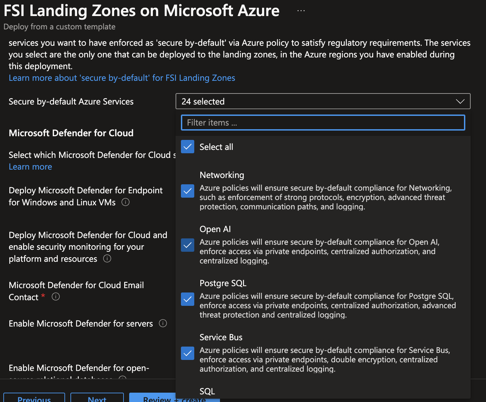

# Secure and Compliant by-default: Azure policies included in FSI Landing Zones on Microsoft Azure

Azure Policy provides comprehensive guardrails capabilities directly embedded into the control plane of Azure, which gives organizations a cohesive way to implement governance and security at scale. For FSI, this helps to enable autonomy for the developers and business into their landing zone while reducing operational burden as new landing zones are created. 

This article documents all the policies included in the FSI Landing Zones on Microsoft Azure, their intent, and assignment scopes.

## Table of contents

* [FSI Landing Zones policy overview](#fsi-landing-zones-policy-overview)
* [Policies by assignment scope](#policies-by-assignment-scope)
  * [Intermediate root management group](#intermediate-root-management-group-eg-fsi)
  * [Platform management group](#platform-management-group-eg-fsi-platform)
  * [Management management group](#management-management-group-eg-fsi-management)
  * [Playground management group](#playground-management-group-eg-fsi-playground)
  * [Landing zones management group](#landing-zones-management-group-eg-fsi-landing-zones)
  * [Geo management group](#geo-management-group-eg-fsi-north-america)
  * [Corp management group](#corp-management-group-eg-fsi-corp)
* [Policies per Azure Service](#policies-per-azure-service)
  * [API Management](#api-management)
  * [App Service](#app-service)
  * [Automation](#automation)
  * [Backup](#backup)
  * [Cognitive Search](#cognitive-search)
  * [Compute](#compute)
  * [Container Apps](#container-apps)
  * [Container Instance](#container-instance)
  * [Container Registry](#container-registry)
  * [Cosmos Db](#cosmos-db)
  * [Data Explorer](#data-explorer)
  * [Data Factory](#data-factory)
  * [Event Grid](#event-grid)
  * [Event Hub](#event-hub)
  * [Key Vault](#key-vault)
  * [Kubernetes](#kubernetes)
  * [Machine Learning](#machine-learning)
  * [Networking](#networking)
  * [Open AI](#open-ai)
  * [Postgre SQL](#postgre-sql)
  * [Service Bus](#service-bus)
  * [SQL](#sql)
  * [Storage Account](#storage-account)
  * [Synapse](#synapse)
  * [Virtual Desktop](#virtual-desktop)
* [Next Steps](#next-steps)

## FSI Landing Zones policy overview

The FSI Landing Zones reference implementation contains over 1000 Azure policies across 24+ Azure services, which we have developed and implemented as part of many years of experience working with FSI customers. These policies are designed to help customers meet their compliance requirements, and to provide a secure and compliant by-default environment for their workloads.

The approach we have taken is as follows:
- We provide horizontal policies where it make sense, such as ensuring Private DNS Zones are being created and registered when deploying any of the Azure services into the corp connected landing zones.
- For each Azure service, we have taken a vertical approach as we know that service enablement is done by service by service, which is where it's critical to look at each service and its technical dimensions and domains, such as encryption, network security, authorization, logging, and more. 
- Since all workloads will be deployed into subscriptions in the child management groups of the landing zones, the assignment of the policies will be done at the Geo management group, and the policies will be inherited by the subscriptions, regardless whether the application characteristics are cloud native or corp connected. 
- We do not distinguish between dev, test, and prod from a policy perspective, meaning that all workloads regardless of the intent of the subscription (which may be dev, test, or prod) will be treated equally. This is important to reduce risk, and friction to the developers as they are transitioning through the various life-cycles of their development.

Which policies are being assigned will depend on some of the selections you make when deploying FSI Landing Zones on Microsoft Azure, especially on the tab for selecting which services should be enabled within the landing zones. Nevertheless, all the policy definitions will always be created at the intermediate root management group, and can be assigned at any time, at any scope, subject to the Azure Service Enablement within each organization.

## Policies by assignment scope

The subsequent sections will provide a summary of all the **policy assignments** at each level of the Management Group hierarchy, and by design, each child node will inherit the policy assignments from its parent nodes.

### Intermediate Root management group (e.g., FSI)

This management group is a parent to all the other management groups created when deploying FSI Landing Zones on Microsoft Azure. Only the non-negotionable policies will be assigned at this scope, such as enforcing Defender for Cloud on every subscription, enablement of Activity Logs to Log Analytics for every subscription, as well as the Microsoft Cloud Security Benchmark initiative for reporting purposes.

>Note: All policies assigned by FSI Landing Zones on Microsoft Azure is using the policy effect of **deny**, **deployIfNotExists**, and **modify** with only one exception, and that is the Microsoft Cloud Security Benchmark initiative which is assigned at the intermediate root management group for reporting purposes only.

| PolicySetDefinition | PolicyDefinition DisplayName | PolicyDefinition Description |
|-----------------------|-----------------------------|-----------------------------|
|  | Configure Azure Activity logs to stream to specified Log Analytics workspace | Deploys the diagnostic settings for Azure Activity to stream subscriptions audit logs to a Log Analytics workspace to monitor subscription-level events |
| Deploy Microsoft Defender for Cloud configuration | Configure Microsoft Defender for SQL to be enabled on Synapse workspaces | Enable Microsoft Defender for SQL on your Azure Synapse workspaces to detect anomalous activities indicating unusual and potentially harmful attempts to access or exploit SQL databases. |
| Deploy Microsoft Defender for Cloud configuration | [Preview]: Configure Microsoft Defender for APIs should be enabled | Microsoft Defender for APIs brings new discovery, protection, detection, & response coverage to monitor for common API based attacks & security misconfigurations. |
| Deploy Microsoft Defender for Cloud configuration | Configure Microsoft Defender for Azure Cosmos DB to be enabled | Microsoft Defender for Azure Cosmos DB is an Azure-native layer of security that detects attempts to exploit databases in your Azure Cosmos DB accounts.
Defender for Azure Cosmos DB detects potential SQL injections, known bad actors based on Microsoft Threat Intelligence, suspicious access patterns, and potential exploitations of your database through compromised identities or malicious insiders. |
| Deploy Microsoft Defender for Cloud configuration | Configure Microsoft Defender CSPM to be enabled | Defender Cloud Security Posture Management (CSPM) provides enhanced posture capabilities and a new intelligent cloud security graph to help identify, prioritize, and reduce risk. Defender CSPM is available in addition to the free foundational security posture capabilities turned on by default in Defender for Cloud. |
| Deploy Microsoft Defender for Cloud configuration | Configure Azure Defender for open-source relational databases to be enabled | Azure Defender for open-source relational databases detects anomalous activities indicating unusual and potentially harmful attempts to access or exploit databases. Learn more about the capabilities of Azure Defender for open-source relational databases at https://aka.ms/AzDforOpenSourceDBsDocu. Important: Enabling this plan will result in charges for protecting your open-source relational databases. Learn about the pricing on Security Center's pricing page: https://aka.ms/pricing-security-center |
| Deploy Microsoft Defender for Cloud configuration | Configure Azure Defender for servers to be enabled | Azure Defender for servers provides real-time threat protection for server workloads and generates hardening recommendations as well as alerts about suspicious activities. |
| Deploy Microsoft Defender for Cloud configuration | Configure Azure Defender for SQL servers on machines to be enabled | Azure Defender for SQL provides functionality for surfacing and mitigating potential database vulnerabilities, detecting anomalous activities that could indicate threats to SQL databases, and discovering and classifying sensitive data. |
| Deploy Microsoft Defender for Cloud configuration | Configure Azure Defender for App Service to be enabled | Azure Defender for App Service leverages the scale of the cloud, and the visibility that Azure has as a cloud provider, to monitor for common web app attacks. |
| Deploy Microsoft Defender for Cloud configuration | Configure Microsoft Defender for Storage (Classic) to be enabled | Microsoft Defender for Storage (Classic) provides detections of unusual and potentially harmful attempts to access or exploit storage accounts. |
| Deploy Microsoft Defender for Cloud configuration | Configure Microsoft Defender for Containers to be enabled | Microsoft Defender for Containers provides hardening, vulnerability assessment and runtime protections for your Azure, hybrid, and multi-cloud Kubernetes environments. |
| Deploy Microsoft Defender for Cloud configuration | Configure Azure Defender for Key Vaults to be enabled | Azure Defender for Key Vault provides an additional layer of protection and security intelligence by detecting unusual and potentially harmful attempts to access or exploit key vault accounts. |
| Deploy Microsoft Defender for Cloud configuration | Configure Azure Defender for DNS to be enabled | Azure Defender for DNS provides an additional layer of protection for your cloud resources by continuously monitoring all DNS queries from your Azure resources. Azure Defender alerts you about suspicious activity at the DNS layer. Learn more about the capabilities of Azure Defender for DNS at https://aka.ms/defender-for-dns . Enabling this Azure Defender plan results in charges. Learn about the pricing details per region on Security Center's pricing page: https://aka.ms/pricing-security-center . |
| Deploy Microsoft Defender for Cloud configuration | Configure Azure Defender for Resource Manager to be enabled | Azure Defender for Resource Manager automatically monitors the resource management operations in your organization. Azure Defender detects threats and alerts you about suspicious activity. Learn more about the capabilities of Azure Defender for Resource Manager at https://aka.ms/defender-for-resource-manager . Enabling this Azure Defender plan results in charges. Learn about the pricing details per region on Security Center's pricing page: https://aka.ms/pricing-security-center . |
| Deploy Microsoft Defender for Cloud configuration | Configure Azure Defender for Azure SQL database to be enabled | Azure Defender for SQL provides functionality for surfacing and mitigating potential database vulnerabilities, detecting anomalous activities that could indicate threats to SQL databases, and discovering and classifying sensitive data. |
| Deploy Microsoft Defender for Cloud configuration | Deploy Azure Security Center Security Contacts | Deploy Azure Security Center Security Contacts |
| Deploy Microsoft Defender for Cloud configuration | Deploy export to Log Analytics workspace for Microsoft Defender for Cloud data | Enable export to Log Analytics workspace of Microsoft Defender for Cloud data. This policy deploys an export to Log Analytics workspace configuration with your conditions and target workspace on the assigned scope. To deploy this policy on newly created subscriptions, open the Compliance tab, select the relevant non-compliant assignment and create a remediation task. |
| [Preview]: Deploy Microsoft Defender for Endpoint agent | [Preview]: Deploy Microsoft Defender for Endpoint agent on Windows virtual machines | Deploys Microsoft Defender for Endpoint on applicable Windows VM images. |
| [Preview]: Deploy Microsoft Defender for Endpoint agent | [Preview]: Deploy Microsoft Defender for Endpoint agent on Linux virtual machines | Deploys Microsoft Defender for Endpoint agent on applicable Linux VM images. |
| [Preview]: Deploy Microsoft Defender for Endpoint agent | [Preview]: Deploy Microsoft Defender for Endpoint agent on Windows Azure Arc machines | Deploys Microsoft Defender for Endpoint on Windows Azure Arc machines. |
| [Preview]: Deploy Microsoft Defender for Endpoint agent | [Preview]: Deploy Microsoft Defender for Endpoint agent on Linux hybrid machines | Deploys Microsoft Defender for Endpoint agent on Linux hybrid machines |
| Microsoft cloud security benchmark | Log Analytics agent should be installed on your virtual machine for Azure Security Center monitoring | This policy audits any Windows/Linux virtual machines (VMs) if the Log Analytics agent is not installed which Security Center uses to monitor for security vulnerabilities and threats |
| Microsoft cloud security benchmark | Log Analytics agent should be installed on your virtual machine scale sets for Azure Security Center monitoring | Security Center collects data from your Azure virtual machines (VMs) to monitor for security vulnerabilities and threats. |
| Microsoft cloud security benchmark | [Preview]: Certificates should have the specified maximum validity period | Manage your organizational compliance requirements by specifying the maximum amount of time that a certificate can be valid within your key vault. |
| Microsoft cloud security benchmark | Key Vault secrets should have an expiration date | Secrets should have a defined expiration date and not be permanent. Secrets that are valid forever provide a potential attacker with more time to compromise them. It is a recommended security practice to set expiration dates on secrets. |
| Microsoft cloud security benchmark | Key Vault keys should have an expiration date | Cryptographic keys should have a defined expiration date and not be permanent. Keys that are valid forever provide a potential attacker with more time to compromise the key. It is a recommended security practice to set expiration dates on cryptographic keys. |
| Microsoft cloud security benchmark | Vulnerabilities in security configuration on your virtual machine scale sets should be remediated | Audit the OS vulnerabilities on your virtual machine scale sets to protect them from attacks. |
| Microsoft cloud security benchmark | Endpoint protection solution should be installed on virtual machine scale sets | Audit the existence and health of an endpoint protection solution on your virtual machines scale sets, to protect them from threats and vulnerabilities. |
| Microsoft cloud security benchmark | System updates on virtual machine scale sets should be installed | Audit whether there are any missing system security updates and critical updates that should be installed to ensure that your Windows and Linux virtual machine scale sets are secure. |
| Microsoft cloud security benchmark | Guest Configuration extension should be installed on your machines | To ensure secure configurations of in-guest settings of your machine, install the Guest Configuration extension. In-guest settings that the extension monitors include the configuration of the operating system, application configuration or presence, and environment settings. Once installed, in-guest policies will be available such as 'Windows Exploit guard should be enabled'. Learn more at https://aka.ms/gcpol. |
| Microsoft cloud security benchmark | Virtual machines' Guest Configuration extension should be deployed with system-assigned managed identity | The Guest Configuration extension requires a system assigned managed identity. Azure virtual machines in the scope of this policy will be non-compliant when they have the Guest Configuration extension installed but do not have a system assigned managed identity. Learn more at https://aka.ms/gcpol |
| Microsoft cloud security benchmark | Windows Defender Exploit Guard should be enabled on your machines | Windows Defender Exploit Guard uses the Azure Policy Guest Configuration agent. Exploit Guard has four components that are designed to lock down devices against a wide variety of attack vectors and block behaviors commonly used in malware attacks while enabling enterprises to balance their security risk and productivity requirements (Windows only). |
| Microsoft cloud security benchmark | Windows machines should meet requirements of the Azure compute security baseline | Requires that prerequisites are deployed to the policy assignment scope. For details, visit https://aka.ms/gcpol. Machines are non-compliant if the machine is not configured correctly for one of the recommendations in the Azure compute security baseline. |
| Microsoft cloud security benchmark | Linux machines should meet requirements for the Azure compute security baseline | Requires that prerequisites are deployed to the policy assignment scope. For details, visit https://aka.ms/gcpol. Machines are non-compliant if the machine is not configured correctly for one of the recommendations in the Azure compute security baseline. |
| Microsoft cloud security benchmark | Resource logs in IoT Hub should be enabled | Audit enabling of resource logs. This enables you to recreate activity trails to use for investigation purposes; when a security incident occurs or when your network is compromised |
| Microsoft cloud security benchmark | Storage accounts should restrict network access | Network access to storage accounts should be restricted. Configure network rules so only applications from allowed networks can access the storage account. To allow connections from specific internet or on-premises clients, access can be granted to traffic from specific Azure virtual networks or to public internet IP address ranges |
| Microsoft cloud security benchmark | Audit usage of custom RBAC roles | Audit built-in roles such as 'Owner, Contributer, Reader' instead of custom RBAC roles, which are error-prone. Using custom roles is treated as an exception and requires a rigorous review and threat modeling |
| Microsoft cloud security benchmark | Resource logs in Azure Stream Analytics should be enabled | Audit enabling of resource logs. This enables you to recreate activity trails to use for investigation purposes; when a security incident occurs or when your network is compromised |
| Microsoft cloud security benchmark | Secure transfer to storage accounts should be enabled | Audit requirement of Secure transfer in your storage account. Secure transfer is an option that forces your storage account to accept requests only from secure connections (HTTPS). Use of HTTPS ensures authentication between the server and the service and protects data in transit from network layer attacks such as man-in-the-middle, eavesdropping, and session-hijacking |
| Microsoft cloud security benchmark | An Azure Active Directory administrator should be provisioned for SQL servers | Audit provisioning of an Azure Active Directory administrator for your SQL server to enable Azure AD authentication. Azure AD authentication enables simplified permission management and centralized identity management of database users and other Microsoft services |
| Microsoft cloud security benchmark | Resource logs in Service Bus should be enabled | Audit enabling of resource logs. This enables you to recreate activity trails to use for investigation purposes; when a security incident occurs or when your network is compromised |
| Microsoft cloud security benchmark | Service Fabric clusters should have the ClusterProtectionLevel property set to EncryptAndSign | Service Fabric provides three levels of protection (None, Sign and EncryptAndSign) for node-to-node communication using a primary cluster certificate. Set the protection level to ensure that all node-to-node messages are encrypted and digitally signed |
| Microsoft cloud security benchmark | Service Fabric clusters should only use Azure Active Directory for client authentication | Audit usage of client authentication only via Azure Active Directory in Service Fabric |
| Microsoft cloud security benchmark | Resource logs in Search services should be enabled | Audit enabling of resource logs. This enables you to recreate activity trails to use for investigation purposes; when a security incident occurs or when your network is compromised |
| Microsoft cloud security benchmark | Only secure connections to your Azure Cache for Redis should be enabled | Audit enabling of only connections via SSL to Azure Cache for Redis. Use of secure connections ensures authentication between the server and the service and protects data in transit from network layer attacks such as man-in-the-middle, eavesdropping, and session-hijacking |
| Microsoft cloud security benchmark | Resource logs in Logic Apps should be enabled | Audit enabling of resource logs. This enables you to recreate activity trails to use for investigation purposes; when a security incident occurs or when your network is compromised |
| Microsoft cloud security benchmark | Resource logs in Key Vault should be enabled | Audit enabling of resource logs. This enables you to recreate activity trails to use for investigation purposes when a security incident occurs or when your network is compromised |
| Microsoft cloud security benchmark | Resource logs in Event Hub should be enabled | Audit enabling of resource logs. This enables you to recreate activity trails to use for investigation purposes; when a security incident occurs or when your network is compromised |
| Microsoft cloud security benchmark | Resource logs in Azure Data Lake Store should be enabled | Audit enabling of resource logs. This enables you to recreate activity trails to use for investigation purposes; when a security incident occurs or when your network is compromised |
| Microsoft cloud security benchmark | Resource logs in Data Lake Analytics should be enabled | Audit enabling of resource logs. This enables you to recreate activity trails to use for investigation purposes; when a security incident occurs or when your network is compromised |
| Microsoft cloud security benchmark | Storage accounts should be migrated to new Azure Resource Manager resources | Use new Azure Resource Manager for your storage accounts to provide security enhancements such as: stronger access control (RBAC), better auditing, Azure Resource Manager based deployment and governance, access to managed identities, access to key vault for secrets, Azure AD-based authentication and support for tags and resource groups for easier security management |
| Microsoft cloud security benchmark | Virtual machines should be migrated to new Azure Resource Manager resources | Use new Azure Resource Manager for your virtual machines to provide security enhancements such as: stronger access control (RBAC), better auditing, Azure Resource Manager based deployment and governance, access to managed identities, access to key vault for secrets, Azure AD-based authentication and support for tags and resource groups for easier security management |
| Microsoft cloud security benchmark | Resource logs in Batch accounts should be enabled | Audit enabling of resource logs. This enables you to recreate activity trails to use for investigation purposes; when a security incident occurs or when your network is compromised |
| Microsoft cloud security benchmark | Automation account variables should be encrypted | It is important to enable encryption of Automation account variable assets when storing sensitive data |
| Microsoft cloud security benchmark | Transparent Data Encryption on SQL databases should be enabled | Transparent data encryption should be enabled to protect data-at-rest and meet compliance requirements |
| Microsoft cloud security benchmark | Auditing on SQL server should be enabled | Auditing on your SQL Server should be enabled to track database activities across all databases on the server and save them in an audit log. |
| Microsoft cloud security benchmark | System updates should be installed on your machines | Missing security system updates on your servers will be monitored by Azure Security Center as recommendations |
| Microsoft cloud security benchmark | [Preview]: System updates should be installed on your machines (powered by Update Center) | Your machines are missing system, security, and critical updates. Software updates often include critical patches to security holes. Such holes are frequently exploited in malware attacks so it's vital to keep your software updated. To install all outstanding patches and secure your machines, follow the remediation steps. |
| Microsoft cloud security benchmark | Machines should be configured to periodically check for missing system updates | To ensure periodic assessments for missing system updates are triggered automatically every 24 hours, the AssessmentMode property should be set to 'AutomaticByPlatform'. Learn more about AssessmentMode property for Windows: https://aka.ms/computevm-windowspatchassessmentmode, for Linux: https://aka.ms/computevm-linuxpatchassessmentmode. |
| Microsoft cloud security benchmark | Management ports of virtual machines should be protected with just-in-time network access control | Possible network Just In Time (JIT) access will be monitored by Azure Security Center as recommendations |
| Microsoft cloud security benchmark | Adaptive application controls for defining safe applications should be enabled on your machines | Enable application controls to define the list of known-safe applications running on your machines, and alert you when other applications run. This helps harden your machines against malware. To simplify the process of configuring and maintaining your rules, Security Center uses machine learning to analyze the applications running on each machine and suggest the list of known-safe applications. |
| Microsoft cloud security benchmark | Allowlist rules in your adaptive application control policy should be updated | Monitor for changes in behavior on groups of machines configured for auditing by Azure Security Center's adaptive application controls. Security Center uses machine learning to analyze the running processes on your machines and suggest a list of known-safe applications. These are presented as recommended apps to allow in adaptive application control policies. |
| Microsoft cloud security benchmark | Subnets should be associated with a Network Security Group | Protect your subnet from potential threats by restricting access to it with a Network Security Group (NSG). NSGs contain a list of Access Control List (ACL) rules that allow or deny network traffic to your subnet. |
| Microsoft cloud security benchmark | internet-facing virtual machines should be protected with network security groups | Protect your virtual machines from potential threats by restricting access to them with network security groups (NSG). Learn more about controlling traffic with NSGs at https://aka.ms/nsg-doc |
| Microsoft cloud security benchmark | Non-internet-facing virtual machines should be protected with network security groups | Protect your non-internet-facing virtual machines from potential threats by restricting access with network security groups (NSG). Learn more about controlling traffic with NSGs at https://aka.ms/nsg-doc |
| Microsoft cloud security benchmark | Vulnerabilities in security configuration on your machines should be remediated | Servers which do not satisfy the configured baseline will be monitored by Azure Security Center as recommendations |
| Microsoft cloud security benchmark | Monitor missing Endpoint Protection in Azure Security Center | Servers without an installed Endpoint Protection agent will be monitored by Azure Security Center as recommendations |
| Microsoft cloud security benchmark | Virtual machines should encrypt temp disks, caches, and data flows between Compute and Storage resources | By default, a virtual machine's OS and data disks are encrypted-at-rest using platform-managed keys. Temp disks, data caches and data flowing between compute and storage aren't encrypted. Disregard this recommendation if: 1. using encryption-at-host, or 2. server-side encryption on Managed Disks meets your security requirements. Learn more in: Server-side encryption of Azure Disk Storage: https://aka.ms/disksse, Different disk encryption offerings: https://aka.ms/diskencryptioncomparison |
| Microsoft cloud security benchmark | A vulnerability assessment solution should be enabled on your virtual machines | Audits virtual machines to detect whether they are running a supported vulnerability assessment solution. A core component of every cyber risk and security program is the identification and analysis of vulnerabilities. Azure Security Center's standard pricing tier includes vulnerability scanning for your virtual machines at no extra cost. Additionally, Security Center can automatically deploy this tool for you. |
| Microsoft cloud security benchmark | All network ports should be restricted on network security groups associated to your virtual machine | Azure Security Center has identified some of your network security groups' inbound rules to be too permissive. Inbound rules should not allow access from 'Any' or 'internet' ranges. This can potentially enable attackers to target your resources. |
| Microsoft cloud security benchmark | SQL databases should have vulnerability findings resolved | Monitor vulnerability assessment scan results and recommendations for how to remediate database vulnerabilities. |
| Microsoft cloud security benchmark | SQL servers on machines should have vulnerability findings resolved | SQL vulnerability assessment scans your database for security vulnerabilities, and exposes any deviations from best practices such as misconfigurations, excessive permissions, and unprotected sensitive data. Resolving the vulnerabilities found can greatly improve your database security posture. |
| Microsoft cloud security benchmark | A maximum of 3 owners should be designated for your subscription | It is recommended to designate up to 3 subscription owners in order to reduce the potential for breach by a compromised owner. |
| Microsoft cloud security benchmark | There should be more than one owner assigned to your subscription | It is recommended to designate more than one subscription owner in order to have administrator access redundancy. |
| Microsoft cloud security benchmark | Accounts with owner permissions on Azure resources should be MFA enabled | Multi-Factor Authentication (MFA) should be enabled for all subscription accounts with owner permissions to prevent a breach of accounts or resources. |
| Microsoft cloud security benchmark | Accounts with write permissions on Azure resources should be MFA enabled | Multi-Factor Authentication (MFA) should be enabled for all subscription accounts with write privileges to prevent a breach of accounts or resources. |
| Microsoft cloud security benchmark | Accounts with read permissions on Azure resources should be MFA enabled | Multi-Factor Authentication (MFA) should be enabled for all subscription accounts with read privileges to prevent a breach of accounts or resources. |
| Microsoft cloud security benchmark | Blocked accounts with owner permissions on Azure resources should be removed | Deprecated accounts with owner permissions should be removed from your subscription.  Deprecated accounts are accounts that have been blocked from signing in. |
| Microsoft cloud security benchmark | Blocked accounts with read and write permissions on Azure resources should be removed | Deprecated accounts should be removed from your subscriptions.  Deprecated accounts are accounts that have been blocked from signing in. |
| Microsoft cloud security benchmark | Guest accounts with owner permissions on Azure resources should be removed | External accounts with owner permissions should be removed from your subscription in order to prevent unmonitored access. |
| Microsoft cloud security benchmark | Guest accounts with write permissions on Azure resources should be removed | External accounts with write privileges should be removed from your subscription in order to prevent unmonitored access. |
| Microsoft cloud security benchmark | Guest accounts with read permissions on Azure resources should be removed | External accounts with read privileges should be removed from your subscription in order to prevent unmonitored access. |
| Microsoft cloud security benchmark | Function apps should have remote debugging turned off | Remote debugging requires inbound ports to be opened on Function apps. Remote debugging should be turned off. |
| Microsoft cloud security benchmark | App Service apps should have remote debugging turned off | Remote debugging requires inbound ports to be opened on an App Service app. Remote debugging should be turned off. |
| Microsoft cloud security benchmark | Function apps should only be accessible over HTTPS | Use of HTTPS ensures server/service authentication and protects data in transit from network layer eavesdropping attacks. |
| Microsoft cloud security benchmark | App Service apps should only be accessible over HTTPS | Use of HTTPS ensures server/service authentication and protects data in transit from network layer eavesdropping attacks. |
| Microsoft cloud security benchmark | Function apps should not have CORS configured to allow every resource to access your apps | Cross-Origin Resource Sharing (CORS) should not allow all domains to access your Function app. Allow only required domains to interact with your Function app. |
| Microsoft cloud security benchmark | App Service apps should not have CORS configured to allow every resource to access your apps | Cross-Origin Resource Sharing (CORS) should not allow all domains to access your app. Allow only required domains to interact with your app. |
| Microsoft cloud security benchmark | Azure DDoS Protection Standard should be enabled | DDoS protection standard should be enabled for all virtual networks with a subnet that is part of an application gateway with a public IP. |
| Microsoft cloud security benchmark | Azure Defender for SQL should be enabled for unprotected Azure SQL servers | Audit SQL servers without Advanced Data Security |
| Microsoft cloud security benchmark | Microsoft Defender for SQL status should be protected for Arc-enabled SQL Servers | Microsoft Defender for SQL provides functionality for surfacing and mitigating potential database vulnerabilities, detecting anomalous activities that could indicate threats to SQL databases, discovering and classifying sensitive data. Once enabled, the protection status indicates that the resource is actively monitored. Even when Defender is enabled, multiple configuration settings should be validated on the agent, machine, workspace and SQL server to ensure active protection. |
| Microsoft cloud security benchmark | [Preview]: Microsoft Defender for APIs should be enabled | Microsoft Defender for APIs brings new discovery, protection, detection, & response coverage to monitor for common API based attacks & security misconfigurations. |
| Microsoft cloud security benchmark | Azure Defender for SQL should be enabled for unprotected SQL Managed Instances | Audit each SQL Managed Instance without advanced data security. |
| Microsoft cloud security benchmark | Azure Role-Based Access Control (RBAC) should be used on Kubernetes Services | To provide granular filtering on the actions that users can perform, use Azure Role-Based Access Control (RBAC) to manage permissions in Kubernetes Service Clusters and configure relevant authorization policies. |
| Microsoft cloud security benchmark | Authorized IP ranges should be defined on Kubernetes Services | Restrict access to the Kubernetes Service Management API by granting API access only to IP addresses in specific ranges. It is recommended to limit access to authorized IP ranges to ensure that only applications from allowed networks can access the cluster. |
| Microsoft cloud security benchmark | Vulnerability assessment should be enabled on your SQL servers | Audit Azure SQL servers which do not have vulnerability assessment properly configured. Vulnerability assessment can discover, track, and help you remediate potential database vulnerabilities. |
| Microsoft cloud security benchmark | Vulnerability assessment should be enabled on SQL Managed Instance | Audit each SQL Managed Instance which doesn't have recurring vulnerability assessment scans enabled. Vulnerability assessment can discover, track, and help you remediate potential database vulnerabilities. |
| Microsoft cloud security benchmark | Adaptive network hardening recommendations should be applied on internet facing virtual machines | Azure Security Center analyzes the traffic patterns of internet facing virtual machines and provides Network Security Group rule recommendations that reduce the potential attack surface |
| Microsoft cloud security benchmark | Management ports should be closed on your virtual machines | Open remote management ports are exposing your VM to a high level of risk from internet-based attacks. These attacks attempt to brute force credentials to gain admin access to the machine. |
| Microsoft cloud security benchmark | IP Forwarding on your virtual machine should be disabled | Enabling IP forwarding on a virtual machine's NIC allows the machine to receive traffic addressed to other destinations. IP forwarding is rarely required (e.g., when using the VM as a network virtual appliance), and therefore, this should be reviewed by the network security team. |
| Microsoft cloud security benchmark | SQL servers should use customer-managed keys to encrypt data at rest | Implementing Transparent Data Encryption (TDE) with your own key provides increased transparency and control over the TDE Protector, increased security with an HSM-backed external service, and promotion of separation of duties. This recommendation applies to organizations with a related compliance requirement. |
| Microsoft cloud security benchmark | SQL managed instances should use customer-managed keys to encrypt data at rest | Implementing Transparent Data Encryption (TDE) with your own key provides you with increased transparency and control over the TDE Protector, increased security with an HSM-backed external service, and promotion of separation of duties. This recommendation applies to organizations with a related compliance requirement. |
| Microsoft cloud security benchmark | Vulnerabilities in container security configurations should be remediated | Audit vulnerabilities in security configuration on machines with Docker installed and display as recommendations in Azure Security Center. |
| Microsoft cloud security benchmark | [Preview]: Network traffic data collection agent should be installed on Windows virtual machines | Security Center uses the Microsoft Dependency agent to collect network traffic data from your Azure virtual machines to enable advanced network protection features such as traffic visualization on the network map, network hardening recommendations and specific network threats. |
| Microsoft cloud security benchmark | [Preview]: Network traffic data collection agent should be installed on Linux virtual machines | Security Center uses the Microsoft Dependency agent to collect network traffic data from your Azure virtual machines to enable advanced network protection features such as traffic visualization on the network map, network hardening recommendations and specific network threats. |
| Microsoft cloud security benchmark | [Preview]: All internet traffic should be routed via your deployed Azure Firewall | Azure Security Center has identified that some of your subnets aren't protected with a next generation firewall. Protect your subnets from potential threats by restricting access to them with Azure Firewall or a supported next generation firewall |
| Microsoft cloud security benchmark | [Preview]: Log Analytics extension should be installed on your Windows Azure Arc machines | This policy audits Windows Azure Arc machines if the Log Analytics extension is not installed. |
| Microsoft cloud security benchmark | [Preview]: Log Analytics extension should be installed on your Linux Azure Arc machines | This policy audits Linux Azure Arc machines if the Log Analytics extension is not installed. |
| Microsoft cloud security benchmark | Windows machines should have Log Analytics agent installed on Azure Arc | Machines are non-compliant if Log Analytics agent is not installed on Azure Arc enabled windows server. |
| Microsoft cloud security benchmark | Linux machines should have Log Analytics agent installed on Azure Arc | Machines are non-compliant if Log Analytics agent is not installed on Azure Arc enabled Linux server. |
| Microsoft cloud security benchmark | Azure Defender for Key Vault should be enabled | Azure Defender for Key Vault provides an additional layer of protection and security intelligence by detecting unusual and potentially harmful attempts to access or exploit key vault accounts. |
| Microsoft cloud security benchmark | Azure Defender for Azure SQL Database servers should be enabled | Azure Defender for SQL provides functionality for surfacing and mitigating potential database vulnerabilities, detecting anomalous activities that could indicate threats to SQL databases, and discovering and classifying sensitive data. |
| Microsoft cloud security benchmark | Azure Defender for SQL servers on machines should be enabled | Azure Defender for SQL provides functionality for surfacing and mitigating potential database vulnerabilities, detecting anomalous activities that could indicate threats to SQL databases, and discovering and classifying sensitive data. |
| Microsoft cloud security benchmark | Microsoft Defender for Storage (Classic) should be enabled | Microsoft Defender for Storage (Classic) provides detections of unusual and potentially harmful attempts to access or exploit storage accounts. |
| Microsoft cloud security benchmark | Azure Defender for App Service should be enabled | Azure Defender for App Service leverages the scale of the cloud, and the visibility that Azure has as a cloud provider, to monitor for common web app attacks. |
| Microsoft cloud security benchmark | Microsoft Defender for Containers should be enabled | Microsoft Defender for Containers provides hardening, vulnerability assessment and runtime protections for your Azure, hybrid, and multi-cloud Kubernetes environments. |
| Microsoft cloud security benchmark | Azure Defender for servers should be enabled | Azure Defender for servers provides real-time threat protection for server workloads and generates hardening recommendations as well as alerts about suspicious activities. |
| Microsoft cloud security benchmark | Azure Policy Add-on for Kubernetes service (AKS) should be installed and enabled on your clusters | Azure Policy Add-on for Kubernetes service (AKS) extends Gatekeeper v3, an admission controller webhook for Open Policy Agent (OPA), to apply at-scale enforcements and safeguards on your clusters in a centralized, consistent manner. |
| Microsoft cloud security benchmark | Azure Arc enabled Kubernetes clusters should have the Azure Policy extension installed | The Azure Policy extension for Azure Arc provides at-scale enforcements and safeguards on your Arc enabled Kubernetes clusters in a centralized, consistent manner. Learn more at https://aka.ms/akspolicydoc. |
| Microsoft cloud security benchmark | Kubernetes cluster containers should only use allowed images | Use images from trusted registries to reduce the Kubernetes cluster's exposure risk to unknown vulnerabilities, security issues and malicious images. This policy is generally available for Kubernetes Service (AKS), and preview for Azure Arc enabled Kubernetes. For more information, see https://aka.ms/kubepolicydoc. |
| Microsoft cloud security benchmark | Kubernetes cluster should not allow privileged containers | Do not allow privileged containers creation in a Kubernetes cluster. This recommendation is part of CIS 5.2.1 which is intended to improve the security of your Kubernetes environments. This policy is generally available for Kubernetes Service (AKS), and preview for Azure Arc enabled Kubernetes. For more information, see https://aka.ms/kubepolicydoc. |
| Microsoft cloud security benchmark | Kubernetes cluster services should listen only on allowed ports | Restrict services to listen only on allowed ports to secure access to the Kubernetes cluster. This policy is generally available for Kubernetes Service (AKS), and preview for Azure Arc enabled Kubernetes. For more information, see https://aka.ms/kubepolicydoc. |
| Microsoft cloud security benchmark | Kubernetes cluster containers CPU and memory resource limits should not exceed the specified limits | Enforce container CPU and memory resource limits to prevent resource exhaustion attacks in a Kubernetes cluster. This policy is generally available for Kubernetes Service (AKS), and preview for Azure Arc enabled Kubernetes. For more information, see https://aka.ms/kubepolicydoc. |
| Microsoft cloud security benchmark | Kubernetes cluster pods and containers should only run with approved user and group IDs | Control the user, primary group, supplemental group and file system group IDs that pods and containers can use to run in a Kubernetes Cluster. This policy is generally available for Kubernetes Service (AKS), and preview for Azure Arc enabled Kubernetes. For more information, see https://aka.ms/kubepolicydoc. |
| Microsoft cloud security benchmark | [Preview]: Azure Arc enabled Kubernetes clusters should have Microsoft Defender for Cloud extension installed | Microsoft Defender for Cloud extension for Azure Arc provides threat protection for your Arc enabled Kubernetes clusters. The extension collects data from all nodes in the cluster and sends it to the Azure Defender for Kubernetes backend in the cloud for further analysis. Learn more in https://docs.microsoft.com/azure/defender-for-cloud/defender-for-containers-enable?pivots=defender-for-container-arc. |
| Microsoft cloud security benchmark | Azure Kubernetes Service clusters should have Defender profile enabled | Microsoft Defender for Containers provides cloud-native Kubernetes security capabilities including environment hardening, workload protection, and runtime protection. When you enable the SecurityProfile.AzureDefender on your Azure Kubernetes Service cluster, an agent is deployed to your cluster to collect security event data. Learn more about Microsoft Defender for Containers in https://docs.microsoft.com/azure/defender-for-cloud/defender-for-containers-introduction?tabs=defender-for-container-arch-aks |
| Microsoft cloud security benchmark | Container registry images should have vulnerability findings resolved | Container image vulnerability assessment scans your registry for security vulnerabilities and exposes detailed findings for each image. Resolving the vulnerabilities can greatly improve your containers' security posture and protect them from attacks. |
| Microsoft cloud security benchmark | Container registry images should have vulnerability findings resolved (powered by Microsoft Defender Vulnerability Management) | Container image vulnerability assessment scans your registry for commonly known vulnerabilities (CVEs) and provides a detailed vulnerability report for each image. Resolving vulnerabilities can greatly improve your security posture, ensuring images are safe to use prior to deployment. |
| Microsoft cloud security benchmark | Running container images should have vulnerability findings resolved | Container image vulnerability assessment scans container images running on your Kubernetes clusters for security vulnerabilities and exposes detailed findings for each image. Resolving the vulnerabilities can greatly improve your containers' security posture and protect them from attacks. |
| Microsoft cloud security benchmark | Running container images should have vulnerability findings resolved (powered by Microsoft Defender Vulnerability Management) | Container image vulnerability assessment scans your registry for commonly known vulnerabilities (CVEs) and provides a detailed vulnerability report for each image. This recommendation provides visibility to vulnerable images currently running in your Kubernetes clusters. Remediating vulnerabilities in container images that are currently running is key to improving your security posture, significantly reducing the attack surface for your containerized workloads. |
| Microsoft cloud security benchmark | Kubernetes clusters should not allow container privilege escalation | Do not allow containers to run with privilege escalation to root in a Kubernetes cluster. This recommendation is part of CIS 5.2.5 which is intended to improve the security of your Kubernetes environments. This policy is generally available for Kubernetes Service (AKS), and preview for Azure Arc enabled Kubernetes. For more information, see https://aka.ms/kubepolicydoc. |
| Microsoft cloud security benchmark | Kubernetes cluster containers should not share host process ID or host IPC namespace | Block pod containers from sharing the host process ID namespace and host IPC namespace in a Kubernetes cluster. This recommendation is part of CIS 5.2.2 and CIS 5.2.3 which are intended to improve the security of your Kubernetes environments. This policy is generally available for Kubernetes Service (AKS), and preview for Azure Arc enabled Kubernetes. For more information, see https://aka.ms/kubepolicydoc. |
| Microsoft cloud security benchmark | Kubernetes cluster containers should run with a read only root file system | Run containers with a read only root file system to protect from changes at runtime with malicious binaries being added to PATH in a Kubernetes cluster. This policy is generally available for Kubernetes Service (AKS), and preview for Azure Arc enabled Kubernetes. For more information, see https://aka.ms/kubepolicydoc. |
| Microsoft cloud security benchmark | Kubernetes cluster containers should only use allowed capabilities | Restrict the capabilities to reduce the attack surface of containers in a Kubernetes cluster. This recommendation is part of CIS 5.2.8 and CIS 5.2.9 which are intended to improve the security of your Kubernetes environments. This policy is generally available for Kubernetes Service (AKS), and preview for Azure Arc enabled Kubernetes. For more information, see https://aka.ms/kubepolicydoc. |
| Microsoft cloud security benchmark | Kubernetes cluster containers should only use allowed AppArmor profiles | Containers should only use allowed AppArmor profiles in a Kubernetes cluster. This policy is generally available for Kubernetes Service (AKS), and preview for Azure Arc enabled Kubernetes. For more information, see https://aka.ms/kubepolicydoc. |
| Microsoft cloud security benchmark | Kubernetes cluster pods should only use approved host network and port range | Restrict pod access to the host network and the allowable host port range in a Kubernetes cluster. This recommendation is part of CIS 5.2.4 which is intended to improve the security of your Kubernetes environments. This policy is generally available for Kubernetes Service (AKS), and preview for Azure Arc enabled Kubernetes. For more information, see https://aka.ms/kubepolicydoc. |
| Microsoft cloud security benchmark | Kubernetes cluster pod hostPath volumes should only use allowed host paths | Limit pod HostPath volume mounts to the allowed host paths in a Kubernetes Cluster. This policy is generally available for Kubernetes Service (AKS), and Azure Arc enabled Kubernetes. For more information, see https://aka.ms/kubepolicydoc. |
| Microsoft cloud security benchmark | [Preview]: Storage account public access should be disallowed | Anonymous public read access to containers and blobs in Azure Storage is a convenient way to share data but might present security risks. To prevent data breaches caused by undesired anonymous access, Microsoft recommends preventing public access to a storage account unless your scenario requires it. |
| Microsoft cloud security benchmark | Azure Backup should be enabled for Virtual Machines | Ensure protection of your Azure Virtual Machines by enabling Azure Backup. Azure Backup is a secure and cost effective data protection solution for Azure. |
| Microsoft cloud security benchmark | Function apps should use managed identity | Use a managed identity for enhanced authentication security |
| Microsoft cloud security benchmark | Geo-redundant backup should be enabled for Azure Database for MariaDB | Azure Database for MariaDB allows you to choose the redundancy option for your database server. It can be set to a geo-redundant backup storage in which the data is not only stored within the region in which your server is hosted, but is also replicated to a paired region to provide recovery option in case of a region failure. Configuring geo-redundant storage for backup is only allowed during server create. |
| Microsoft cloud security benchmark | App Service apps should use managed identity | Use a managed identity for enhanced authentication security |
| Microsoft cloud security benchmark | Geo-redundant backup should be enabled for Azure Database for PostgreSQL | Azure Database for PostgreSQL allows you to choose the redundancy option for your database server. It can be set to a geo-redundant backup storage in which the data is not only stored within the region in which your server is hosted, but is also replicated to a paired region to provide recovery option in case of a region failure. Configuring geo-redundant storage for backup is only allowed during server create. |
| Microsoft cloud security benchmark | App Service apps should have 'Client Certificates (Incoming client certificates)' enabled | Client certificates allow for the app to request a certificate for incoming requests. Only clients that have a valid certificate will be able to reach the app. |
| Microsoft cloud security benchmark | Geo-redundant backup should be enabled for Azure Database for MySQL | Azure Database for MySQL allows you to choose the redundancy option for your database server. It can be set to a geo-redundant backup storage in which the data is not only stored within the region in which your server is hosted, but is also replicated to a paired region to provide recovery option in case of a region failure. Configuring geo-redundant storage for backup is only allowed during server create. |
| Microsoft cloud security benchmark | App Service apps should have resource logs enabled | Audit enabling of resource logs on the app. This enables you to recreate activity trails for investigation purposes if a security incident occurs or your network is compromised. |
| Microsoft cloud security benchmark | Enforce SSL connection should be enabled for PostgreSQL database servers | Azure Database for PostgreSQL supports connecting your Azure Database for PostgreSQL server to client applications using Secure Sockets Layer (SSL). Enforcing SSL connections between your database server and your client applications helps protect against 'man in the middle' attacks by encrypting the data stream between the server and your application. This configuration enforces that SSL is always enabled for accessing your database server. |
| Microsoft cloud security benchmark | Enforce SSL connection should be enabled for MySQL database servers | Azure Database for MySQL supports connecting your Azure Database for MySQL server to client applications using Secure Sockets Layer (SSL). Enforcing SSL connections between your database server and your client applications helps protect against 'man in the middle' attacks by encrypting the data stream between the server and your application. This configuration enforces that SSL is always enabled for accessing your database server. |
| Microsoft cloud security benchmark | App Service apps should use the latest TLS version | Periodically, newer versions are released for TLS either due to security flaws, include additional functionality, and enhance speed. Upgrade to the latest TLS version for App Service apps to take advantage of security fixes, if any, and/or new functionalities of the latest version. |
| Microsoft cloud security benchmark | Function apps should use the latest TLS version | Periodically, newer versions are released for TLS either due to security flaws, include additional functionality, and enhance speed. Upgrade to the latest TLS version for Function apps to take advantage of security fixes, if any, and/or new functionalities of the latest version. |
| Microsoft cloud security benchmark | Private endpoint should be enabled for PostgreSQL servers | Private endpoint connections enforce secure communication by enabling private connectivity to Azure Database for PostgreSQL. Configure a private endpoint connection to enable access to traffic coming only from known networks and prevent access from all other IP addresses, including within Azure. |
| Microsoft cloud security benchmark | Private endpoint should be enabled for MariaDB servers | Private endpoint connections enforce secure communication by enabling private connectivity to Azure Database for MariaDB. Configure a private endpoint connection to enable access to traffic coming only from known networks and prevent access from all other IP addresses, including within Azure. |
| Microsoft cloud security benchmark | Private endpoint should be enabled for MySQL servers | Private endpoint connections enforce secure communication by enabling private connectivity to Azure Database for MySQL. Configure a private endpoint connection to enable access to traffic coming only from known networks and prevent access from all other IP addresses, including within Azure. |
| Microsoft cloud security benchmark | SQL servers with auditing to storage account destination should be configured with 90 days retention or higher | For incident investigation purposes, we recommend setting the data retention for your SQL Server' auditing to storage account destination to at least 90 days. Confirm that you are meeting the necessary retention rules for the regions in which you are operating. This is sometimes required for compliance with regulatory standards. |
| Microsoft cloud security benchmark | Function apps should require FTPS only | Enable FTPS enforcement for enhanced security. |
| Microsoft cloud security benchmark | App Service apps should require FTPS only | Enable FTPS enforcement for enhanced security. |
| Microsoft cloud security benchmark | Function apps should have 'Client Certificates (Incoming client certificates)' enabled | Client certificates allow for the app to request a certificate for incoming requests. Only clients with valid certificates will be able to reach the app. |
| Microsoft cloud security benchmark | Cognitive Services accounts should enable data encryption with a customer-managed key | Customer-managed keys are commonly required to meet regulatory compliance standards. Customer-managed keys enable the data stored in Cognitive Services to be encrypted with an Azure Key Vault key created and owned by you. You have full control and responsibility for the key lifecycle, including rotation and management. Learn more about customer-managed keys at https://go.microsoft.com/fwlink/?linkid=2121321. |
| Microsoft cloud security benchmark | Azure Cosmos DB accounts should use customer-managed keys to encrypt data at rest | Use customer-managed keys to manage the encryption at rest of your Azure Cosmos DB. By default, the data is encrypted at rest with service-managed keys, but customer-managed keys are commonly required to meet regulatory compliance standards. Customer-managed keys enable the data to be encrypted with an Azure Key Vault key created and owned by you. You have full control and responsibility for the key lifecycle, including rotation and management. Learn more at https://aka.ms/cosmosdb-cmk. |
| Microsoft cloud security benchmark | Cosmos DB database accounts should have local authentication methods disabled | Disabling local authentication methods improves security by ensuring that Cosmos DB database accounts exclusively require Azure Active Directory identities for authentication. Learn more at: https://docs.microsoft.com/azure/cosmos-db/how-to-setup-rbac#disable-local-auth. |
| Microsoft cloud security benchmark | Key vaults should have deletion protection enabled | Malicious deletion of a key vault can lead to permanent data loss. You can prevent permanent data loss by enabling purge protection and soft delete. Purge protection protects you from insider attacks by enforcing a mandatory retention period for soft deleted key vaults. No one inside your organization or Microsoft will be able to purge your key vaults during the soft delete retention period. Keep in mind that key vaults created after September 1st 2019 have soft-delete enabled by default. |
| Microsoft cloud security benchmark | Key vaults should have soft delete enabled | Deleting a key vault without soft delete enabled permanently deletes all secrets, keys, and certificates stored in the key vault. Accidental deletion of a key vault can lead to permanent data loss. Soft delete allows you to recover an accidentally deleted key vault for a configurable retention period. |
| Microsoft cloud security benchmark | Azure Cache for Redis should use private link | Private endpoints lets you connect your virtual network to Azure services without a public IP address at the source or destination. By mapping private endpoints to your Azure Cache for Redis instances, data leakage risks are reduced. Learn more at: https://docs.microsoft.com/azure/azure-cache-for-redis/cache-private-link. |
| Microsoft cloud security benchmark | Storage accounts should use customer-managed key for encryption | Secure your blob and file storage account with greater flexibility using customer-managed keys. When you specify a customer-managed key, that key is used to protect and control access to the key that encrypts your data. Using customer-managed keys provides additional capabilities to control rotation of the key encryption key or cryptographically erase data. |
| Microsoft cloud security benchmark | Storage accounts should restrict network access using virtual network rules | Protect your storage accounts from potential threats using virtual network rules as a preferred method instead of IP-based filtering. Disabling IP-based filtering prevents public IPs from accessing your storage accounts. |
| Microsoft cloud security benchmark | Container registries should be encrypted with a customer-managed key | Use customer-managed keys to manage the encryption at rest of the contents of your registries. By default, the data is encrypted at rest with service-managed keys, but customer-managed keys are commonly required to meet regulatory compliance standards. Customer-managed keys enable the data to be encrypted with an Azure Key Vault key created and owned by you. You have full control and responsibility for the key lifecycle, including rotation and management. Learn more at https://aka.ms/acr/CMK. |
| Microsoft cloud security benchmark | Container registries should not allow unrestricted network access | Azure container registries by default accept connections over the internet from hosts on any network. To protect your registries from potential threats, allow access from only specific private endpoints, public IP addresses or address ranges. If your registry doesn't have network rules configured, it will appear in the unhealthy resources. Learn more about Container Registry network rules here: https://aka.ms/acr/privatelink, https://aka.ms/acr/portal/public-network and https://aka.ms/acr/vnet. |
| Microsoft cloud security benchmark | Container registries should use private link | Azure Private Link lets you connect your virtual network to Azure services without a public IP address at the source or destination. The private link platform handles the connectivity between the consumer and services over the Azure backbone network.By mapping private endpoints to your container registries instead of the entire service, you'll also be protected against data leakage risks. Learn more at: https://aka.ms/acr/private-link. |
| Microsoft cloud security benchmark | App Configuration should use private link | Azure Private Link lets you connect your virtual network to Azure services without a public IP address at the source or destination. The private link platform handles the connectivity between the consumer and services over the Azure backbone network. By mapping private endpoints to your app configuration instances instead of the entire service, you'll also be protected against data leakage risks. Learn more at: https://aka.ms/appconfig/private-endpoint. |
| Microsoft cloud security benchmark | Azure Event Grid domains should use private link | Azure Private Link lets you connect your virtual network to Azure services without a public IP address at the source or destination. The Private Link platform handles the connectivity between the consumer and services over the Azure backbone network. By mapping private endpoints to your Event Grid domain instead of the entire service, you'll also be protected against data leakage risks. Learn more at: https://aka.ms/privateendpoints. |
| Microsoft cloud security benchmark | Azure Event Grid topics should use private link | Azure Private Link lets you connect your virtual network to Azure services without a public IP address at the source or destination. The Private Link platform handles the connectivity between the consumer and services over the Azure backbone network. By mapping private endpoints to your Event Grid topic instead of the entire service, you'll also be protected against data leakage risks. Learn more at: https://aka.ms/privateendpoints. |
| Microsoft cloud security benchmark | Azure SignalR Service should use private link | Azure Private Link lets you connect your virtual network to Azure services without a public IP address at the source or destination. The private link platform handles the connectivity between the consumer and services over the Azure backbone network. By mapping private endpoints to your Azure SignalR Service resource instead of the entire service, you'll reduce your data leakage risks. Learn more about private links at: https://aka.ms/asrs/privatelink. |
| Microsoft cloud security benchmark | Azure Machine Learning workspaces should be encrypted with a customer-managed key | Manage encryption at rest of Azure Machine Learning workspace data with customer-managed keys. By default, customer data is encrypted with service-managed keys, but customer-managed keys are commonly required to meet regulatory compliance standards. Customer-managed keys enable the data to be encrypted with an Azure Key Vault key created and owned by you. You have full control and responsibility for the key lifecycle, including rotation and management. Learn more at https://aka.ms/azureml-workspaces-cmk. |
| Microsoft cloud security benchmark | Azure Machine Learning workspaces should use private link | Azure Private Link lets you connect your virtual network to Azure services without a public IP address at the source or destination. The Private Link platform handles the connectivity between the consumer and services over the Azure backbone network. By mapping private endpoints to Azure Machine Learning workspaces, data leakage risks are reduced. Learn more about private links at: https://docs.microsoft.com/azure/machine-learning/how-to-configure-private-link. |
| Microsoft cloud security benchmark | Azure Web Application Firewall should be enabled for Azure Front Door entry-points | Deploy Azure Web Application Firewall (WAF) in front of public facing web applications for additional inspection of incoming traffic. Web Application Firewall (WAF) provides centralized protection of your web applications from common exploits and vulnerabilities such as SQL injections, Cross-Site Scripting, local and remote file executions. You can also restrict access to your web applications by countries, IP address ranges, and other http(s) parameters via custom rules. |
| Microsoft cloud security benchmark | Web Application Firewall (WAF) should be enabled for Application Gateway | Deploy Azure Web Application Firewall (WAF) in front of public facing web applications for additional inspection of incoming traffic. Web Application Firewall (WAF) provides centralized protection of your web applications from common exploits and vulnerabilities such as SQL injections, Cross-Site Scripting, local and remote file executions. You can also restrict access to your web applications by countries, IP address ranges, and other http(s) parameters via custom rules. |
| Microsoft cloud security benchmark | Public network access should be disabled for MariaDB servers | Disable the public network access property to improve security and ensure your Azure Database for MariaDB can only be accessed from a private endpoint. This configuration strictly disables access from any public address space outside of Azure IP range, and denies all logins that match IP or virtual network-based firewall rules. |
| Microsoft cloud security benchmark | Public network access should be disabled for MySQL servers | Disable the public network access property to improve security and ensure your Azure Database for MySQL can only be accessed from a private endpoint. This configuration strictly disables access from any public address space outside of Azure IP range, and denies all logins that match IP or virtual network-based firewall rules. |
| Microsoft cloud security benchmark | MySQL servers should use customer-managed keys to encrypt data at rest | Use customer-managed keys to manage the encryption at rest of your MySQL servers. By default, the data is encrypted at rest with service-managed keys, but customer-managed keys are commonly required to meet regulatory compliance standards. Customer-managed keys enable the data to be encrypted with an Azure Key Vault key created and owned by you. You have full control and responsibility for the key lifecycle, including rotation and management. |
| Microsoft cloud security benchmark | Public network access should be disabled for PostgreSQL servers | Disable the public network access property to improve security and ensure your Azure Database for PostgreSQL can only be accessed from a private endpoint. This configuration disables access from any public address space outside of Azure IP range, and denies all logins that match IP or virtual network-based firewall rules. |
| Microsoft cloud security benchmark | PostgreSQL servers should use customer-managed keys to encrypt data at rest | Use customer-managed keys to manage the encryption at rest of your PostgreSQL servers. By default, the data is encrypted at rest with service-managed keys, but customer-managed keys are commonly required to meet regulatory compliance standards. Customer-managed keys enable the data to be encrypted with an Azure Key Vault key created and owned by you. You have full control and responsibility for the key lifecycle, including rotation and management. |
| Microsoft cloud security benchmark | VM Image Builder templates should use private link | Azure Private Link lets you connect your virtual network to Azure services without a public IP address at the source or destination. The Private Link platform handles the connectivity between the consumer and services over the Azure backbone network. By mapping private endpoints to your VM Image Builder building resources, data leakage risks are reduced. Learn more about private links at: https://docs.microsoft.com/azure/virtual-machines/linux/image-builder-networking#deploy-using-an-existing-vnet. |
| Microsoft cloud security benchmark | Azure Key Vault should have firewall enabled | Enable the key vault firewall so that the key vault is not accessible by default to any public IPs. Optionally, you can configure specific IP ranges to limit access to those networks. Learn more at: https://docs.microsoft.com/azure/key-vault/general/network-security |
| Microsoft cloud security benchmark | Azure Key Vaults should use private link | Azure Private Link lets you connect your virtual networks to Azure services without a public IP address at the source or destination. The Private Link platform handles the connectivity between the consumer and services over the Azure backbone network. By mapping private endpoints to key vault, you can reduce data leakage risks. Learn more about private links at: https://aka.ms/akvprivatelink. |
| Microsoft cloud security benchmark | Azure Spring Cloud should use network injection | Azure Spring Cloud instances should use virtual network injection for the following purposes: 1. Isolate Azure Spring Cloud from internet. 2. Enable Azure Spring Cloud to interact with systems in either on premises data centers or Azure service in other virtual networks. 3. Empower customers to control inbound and outbound network communications for Azure Spring Cloud. |
| Microsoft cloud security benchmark | Subscriptions should have a contact email address for security issues | To ensure the relevant people in your organization are notified when there is a potential security breach in one of your subscriptions, set a security contact to receive email notifications from Security Center. |
| Microsoft cloud security benchmark | Auto provisioning of the Log Analytics agent should be enabled on your subscription | To monitor for security vulnerabilities and threats, Azure Security Center collects data from your Azure virtual machines. Data is collected by the Log Analytics agent, formerly known as the Microsoft Monitoring Agent (MMA), which reads various security-related configurations and event logs from the machine and copies the data to your Log Analytics workspace for analysis. We recommend enabling auto provisioning to automatically deploy the agent to all supported Azure VMs and any new ones that are created. |
| Microsoft cloud security benchmark | Email notification for high severity alerts should be enabled | To ensure the relevant people in your organization are notified when there is a potential security breach in one of your subscriptions, enable email notifications for high severity alerts in Security Center. |
| Microsoft cloud security benchmark | Email notification to subscription owner for high severity alerts should be enabled | To ensure your subscription owners are notified when there is a potential security breach in their subscription, set email notifications to subscription owners for high severity alerts in Security Center. |
| Microsoft cloud security benchmark | Storage accounts should use private link | Azure Private Link lets you connect your virtual network to Azure services without a public IP address at the source or destination. The Private Link platform handles the connectivity between the consumer and services over the Azure backbone network. By mapping private endpoints to your storage account, data leakage risks are reduced. Learn more about private links at - https://aka.ms/azureprivatelinkoverview |
| Microsoft cloud security benchmark | Authentication to Linux machines should require SSH keys | Although SSH itself provides an encrypted connection, using passwords with SSH still leaves the VM vulnerable to brute-force attacks. The most secure option for authenticating to an Azure Linux virtual machine over SSH is with a public-private key pair, also known as SSH keys. Learn more: https://docs.microsoft.com/azure/virtual-machines/linux/create-ssh-keys-detailed. |
| Microsoft cloud security benchmark | Private endpoint connections on Azure SQL Database should be enabled | Private endpoint connections enforce secure communication by enabling private connectivity to Azure SQL Database. |
| Microsoft cloud security benchmark | Public network access on Azure SQL Database should be disabled | Disabling the public network access property improves security by ensuring your Azure SQL Database can only be accessed from a private endpoint. This configuration denies all logins that match IP or virtual network based firewall rules. |
| Microsoft cloud security benchmark | Kubernetes clusters should be accessible only over HTTPS | Use of HTTPS ensures authentication and protects data in transit from network layer eavesdropping attacks. This capability is currently generally available for Kubernetes Service (AKS), and in preview for Azure Arc enabled Kubernetes. For more info, visit https://aka.ms/kubepolicydoc |
| Microsoft cloud security benchmark | Windows web servers should be configured to use secure communication protocols | To protect the privacy of information communicated over the internet, your web servers should use the latest version of the industry-standard cryptographic protocol, Transport Layer Security (TLS). TLS secures communications over a network by using security certificates to encrypt a connection between machines. |
| Microsoft cloud security benchmark | Cognitive Services accounts should restrict network access | Network access to Cognitive Services accounts should be restricted. Configure network rules so only applications from allowed networks can access the Cognitive Services account. To allow connections from specific internet or on-premises clients, access can be granted to traffic from specific Azure virtual networks or to public internet IP address ranges. |
| Microsoft cloud security benchmark | Cognitive Services accounts should disable public network access | To improve the security of Cognitive Services accounts, ensure that it isn't exposed to the public internet and can only be accessed from a private endpoint. Disable the public network access property as described in https://go.microsoft.com/fwlink/?linkid=2129800. This option disables access from any public address space outside the Azure IP range, and denies all logins that match IP or virtual network-based firewall rules. This reduces data leakage risks. |
| Microsoft cloud security benchmark | API Management services should use a virtual network | Azure Virtual Network deployment provides enhanced security, isolation and allows you to place your API Management service in a non-internet routable network that you control access to. These networks can then be connected to your on-premises networks using various VPN technologies, which enables access to your backend services within the network and/or on-premises. The developer portal and API gateway, can be configured to be accessible either from the internet or only within the virtual network. |
| Microsoft cloud security benchmark | Azure Cosmos DB accounts should have firewall rules | Firewall rules should be defined on your Azure Cosmos DB accounts to prevent traffic from unauthorized sources. Accounts that have at least one IP rule defined with the virtual network filter enabled are deemed compliant. Accounts disabling public access are also deemed compliant. |
| Microsoft cloud security benchmark | Network Watcher should be enabled | Network Watcher is a regional service that enables you to monitor and diagnose conditions at a network scenario level in, to, and from Azure. Scenario level monitoring enables you to diagnose problems at an end-to-end network level view. It is required to have a network watcher resource group to be created in every region where a virtual network is present. An alert is enabled if a network watcher resource group is not available in a particular region. |
| Microsoft cloud security benchmark | Resource logs in Azure Machine Learning Workspaces should be enabled | Resource logs enable recreating activity trails to use for investigation purposes when a security incident occurs or when your network is compromised. |
| Microsoft cloud security benchmark | Azure Machine Learning Workspaces should disable public network access | Disabling public network access improves security by ensuring that the Machine Learning Workspaces aren't exposed on the public internet. You can control exposure of your workspaces by creating private endpoints instead. Learn more at: https://learn.microsoft.com/azure/machine-learning/how-to-configure-private-link?view=azureml-api-2&tabs=azure-portal. |
| Microsoft cloud security benchmark | Azure Machine Learning Computes should be in a virtual network | Azure Virtual Networks provide enhanced security and isolation for your Azure Machine Learning Compute Clusters and Instances, as well as subnets, access control policies, and other features to further restrict access. When a compute is configured with a virtual network, it is not publicly addressable and can only be accessed from virtual machines and applications within the virtual network. |
| Microsoft cloud security benchmark | Azure Machine Learning Computes should have local authentication methods disabled | Disabling local authentication methods improves security by ensuring that Machine Learning Computes require Azure Active Directory identities exclusively for authentication. Learn more at: https://aka.ms/azure-ml-aad-policy. |
| Microsoft cloud security benchmark | Azure Machine Learning compute instances should be recreated to get the latest software updates | Ensure Azure Machine Learning compute instances run on the latest available operating system. Security is improved and vulnerabilities reduced by running with the latest security patches. For more information, visit https://aka.ms/azureml-ci-updates/. |
| Microsoft cloud security benchmark | Resource logs in Azure Databricks Workspaces should be enabled | Resource logs enable recreating activity trails to use for investigation purposes when a security incident occurs or when your network is compromised. |
| Microsoft cloud security benchmark | Azure Databricks Workspaces should disable public network access | Disabling public network access improves security by ensuring that the resource isn't exposed on the public internet. You can control exposure of your resources by creating private endpoints instead. Learn more at: https://learn.microsoft.com/azure/databricks/administration-guide/cloud-configurations/azure/private-link.  |
| Microsoft cloud security benchmark | Azure Databricks Clusters should disable public IP | Disabling public IP of clusters in Azure Databricks Workspaces improves security by ensuring that the clusters aren't exposed on the public internet. Learn more at: https://learn.microsoft.com/azure/databricks/security/secure-cluster-connectivity. |
| Microsoft cloud security benchmark | Azure Databricks Workspaces should be in a virtual network | Azure Virtual Networks provide enhanced security and isolation for your Azure Databricks Workspaces, as well as subnets, access control policies, and other features to further restrict access. Learn more at: https://docs.microsoft.com/azure/databricks/administration-guide/cloud-configurations/azure/vnet-inject. |
| Microsoft cloud security benchmark | Azure Databricks Workspaces should use private link | Azure Private Link lets you connect your virtual networks to Azure services without a public IP address at the source or destination. The Private Link platform handles the connectivity between the consumer and services over the Azure backbone network. By mapping private endpoints to Azure Databricks workspaces, you can reduce data leakage risks. Learn more about private links at: https://aka.ms/adbpe. |
| Microsoft cloud security benchmark | Azure Defender for Resource Manager should be enabled | Azure Defender for Resource Manager automatically monitors the resource management operations in your organization. Azure Defender detects threats and alerts you about suspicious activity. Learn more about the capabilities of Azure Defender for Resource Manager at https://aka.ms/defender-for-resource-manager . Enabling this Azure Defender plan results in charges. Learn about the pricing details per region on Security Center's pricing page: https://aka.ms/pricing-security-center . |
| Microsoft cloud security benchmark | Azure Defender for DNS should be enabled | Azure Defender for DNS provides an additional layer of protection for your cloud resources by continuously monitoring all DNS queries from your Azure resources. Azure Defender alerts you about suspicious activity at the DNS layer. Learn more about the capabilities of Azure Defender for DNS at https://aka.ms/defender-for-dns . Enabling this Azure Defender plan results in charges. Learn about the pricing details per region on Security Center's pricing page: https://aka.ms/pricing-security-center . |
| Microsoft cloud security benchmark | Kubernetes clusters should not use the default namespace | Prevent usage of the default namespace in Kubernetes clusters to protect against unauthorized access for ConfigMap, Pod, Secret, Service, and ServiceAccount resource types. For more information, see https://aka.ms/kubepolicydoc. |
| Microsoft cloud security benchmark | Kubernetes clusters should disable automounting API credentials | Disable automounting API credentials to prevent a potentially compromised Pod resource to run API commands against Kubernetes clusters. For more information, see https://aka.ms/kubepolicydoc. |
| Microsoft cloud security benchmark | Kubernetes clusters should not grant CAP_SYS_ADMIN security capabilities | To reduce the attack surface of your containers, restrict CAP_SYS_ADMIN Linux capabilities. For more information, see https://aka.ms/kubepolicydoc. |
| Microsoft cloud security benchmark | [Preview]: vTPM should be enabled on supported virtual machines | Enable virtual TPM device on supported virtual machines to facilitate Measured Boot and other OS security features that require a TPM. Once enabled, vTPM can be used to attest boot integrity. This assessment only applies to trusted launch enabled virtual machines. |
| Microsoft cloud security benchmark | [Preview]: Secure Boot should be enabled on supported Windows virtual machines | Enable Secure Boot on supported Windows virtual machines to mitigate against malicious and unauthorized changes to the boot chain. Once enabled, only trusted bootloaders, kernel and kernel drivers will be allowed to run. This assessment applies to Trusted Launch and Confidential Windows virtual machines. |
| Microsoft cloud security benchmark | [Preview]: Guest Attestation extension should be installed on supported Linux virtual machines | Install Guest Attestation extension on supported Linux virtual machines to allow Azure Security Center to proactively attest and monitor the boot integrity. Once installed, boot integrity will be attested via Remote Attestation. This assessment applies to Trusted Launch and Confidential Linux virtual machines. |
| Microsoft cloud security benchmark | [Preview]: Guest Attestation extension should be installed on supported Linux virtual machines scale sets | Install Guest Attestation extension on supported Linux virtual machines scale sets to allow Azure Security Center to proactively attest and monitor the boot integrity. Once installed, boot integrity will be attested via Remote Attestation.  This assessment applies to Trusted Launch and Confidential Linux virtual machine scale sets. |
| Microsoft cloud security benchmark | [Preview]: Guest Attestation extension should be installed on supported Windows virtual machines | Install Guest Attestation extension on supported virtual machines to allow Azure Security Center to proactively attest and monitor the boot integrity. Once installed, boot integrity will be attested via Remote Attestation. This assessment applies to Trusted Launch and Confidential Windows virtual machines. |
| Microsoft cloud security benchmark | [Preview]: Guest Attestation extension should be installed on supported Windows virtual machines scale sets | Install Guest Attestation extension on supported virtual machines scale sets to allow Azure Security Center to proactively attest and monitor the boot integrity. Once installed, boot integrity will be attested via Remote Attestation. This assessment applies to Trusted Launch and Confidential Windows virtual machine scale sets. |
| Microsoft cloud security benchmark | [Preview]: Linux virtual machines should use only signed and trusted boot components | All OS boot components (boot loader, kernel, kernel drivers) must be signed by trusted publishers. Defender for Cloud has identified untrusted OS boot components on one or more of your Linux machines. To protect your machines from potentially malicious components, add them to your allow list or remove the identified components. |
| Microsoft cloud security benchmark | Endpoint protection should be installed on your machines | To protect your machines from threats and vulnerabilities, install a supported endpoint protection solution. |
| Microsoft cloud security benchmark | Endpoint protection health issues should be resolved on your machines | Resolve endpoint protection health issues on your virtual machines to protect them from latest threats and vulnerabilities. Azure Security Center supported endpoint protection solutions are documented here - https://docs.microsoft.com/azure/security-center/security-center-services?tabs=features-windows#supported-endpoint-protection-solutions. Endpoint protection assessment is documented here - https://docs.microsoft.com/azure/security-center/security-center-endpoint-protection. |
| Microsoft cloud security benchmark | Resource logs in Azure Kubernetes Service should be enabled | Azure Kubernetes Service's resource logs can help recreate activity trails when investigating security incidents. Enable it to make sure the logs will exist when needed |
| Microsoft cloud security benchmark | Azure Defender for open-source relational databases should be enabled | Azure Defender for open-source relational databases detects anomalous activities indicating unusual and potentially harmful attempts to access or exploit databases. Learn more about the capabilities of Azure Defender for open-source relational databases at https://aka.ms/AzDforOpenSourceDBsDocu. Important: Enabling this plan will result in charges for protecting your open-source relational databases. Learn about the pricing on Security Center's pricing page: https://aka.ms/pricing-security-center |
| Microsoft cloud security benchmark | Microsoft Defender CSPM should be enabled | Defender Cloud Security Posture Management (CSPM) provides enhanced posture capabilities and a new intelligent cloud security graph to help identify, prioritize, and reduce risk. Defender CSPM is available in addition to the free foundational security posture capabilities turned on by default in Defender for Cloud. |
| Microsoft cloud security benchmark | [Preview]: Linux virtual machines should enable Azure Disk Encryption or EncryptionAtHost. | By default, a virtual machine's OS and data disks are encrypted-at-rest using platform-managed keys; temp disks and data caches aren't encrypted, and data isn't encrypted when flowing between compute and storage resources. Use Azure Disk Encryption or EncryptionAtHost to encrypt all this data.Visit https://aka.ms/diskencryptioncomparison to compare encryption offerings. This policy requires two prerequisites to be deployed to the policy assignment scope. For details, visit https://aka.ms/gcpol. |
| Microsoft cloud security benchmark | [Preview]: Windows virtual machines should enable Azure Disk Encryption or EncryptionAtHost. | By default, a virtual machine's OS and data disks are encrypted-at-rest using platform-managed keys; temp disks and data caches aren't encrypted, and data isn't encrypted when flowing between compute and storage resources. Use Azure Disk Encryption or EncryptionAtHost to encrypt all this data.Visit https://aka.ms/diskencryptioncomparison to compare encryption offerings. This policy requires two prerequisites to be deployed to the policy assignment scope. For details, visit https://aka.ms/gcpol. |
| Microsoft cloud security benchmark | Azure SQL Database should have Azure Active Directory Only Authentication enabled | Disabling local authentication methods and allowing only Azure Active Directory Authentication improves security by ensuring that Azure SQL Databases can exclusively be accessed by Azure Active Directory identities. Learn more at: aka.ms/adonlycreate. |
| Microsoft cloud security benchmark | An Azure Active Directory administrator should be provisioned for MySQL servers | Audit provisioning of an Azure Active Directory administrator for your MySQL server to enable Azure AD authentication. Azure AD authentication enables simplified permission management and centralized identity management of database users and other Microsoft services |
| Microsoft cloud security benchmark | An Azure Active Directory administrator should be provisioned for PostgreSQL servers | Audit provisioning of an Azure Active Directory administrator for your PostgreSQL server to enable Azure AD authentication. Azure AD authentication enables simplified permission management and centralized identity management of database users and other Microsoft services |
| Microsoft cloud security benchmark | Azure SQL Managed Instance should have Azure Active Directory Only Authentication enabled | Disabling local authentication methods and allowing only Azure Active Directory Authentication improves security by ensuring that Azure SQL Managed Instances can exclusively be accessed by Azure Active Directory identities. Learn more at: aka.ms/adonlycreate. |
| Microsoft cloud security benchmark | Synapse Workspaces should use only Azure Active Directory identities for authentication | Azure Active Directory (AAD) only authentication methods improves security by ensuring that Synapse Workspaces exclusively require AAD identities for authentication. Learn more at: https://aka.ms/Synapse. |
| Microsoft cloud security benchmark | API Management subscriptions should not be scoped to all APIs | API Management subscriptions should be scoped to a product or an individual API instead of all APIs, which could result in an excessive data exposure. |
| Microsoft cloud security benchmark | API Management calls to API backends should not bypass certificate thumbprint or name validation | To improve the API security, API Management should validate the backend server certificate for all API calls. Enable SSL certificate thumbprint and name validation. |
| Microsoft cloud security benchmark | API Management APIs should use only encrypted protocols | To ensure security of data in transit, APIs should be available only through encrypted protocols, like HTTPS or WSS. Avoid using unsecured protocols, such as HTTP or WS. |
| Microsoft cloud security benchmark | API Management secret named values should be stored in Azure Key Vault | Named values are a collection of name and value pairs in each API Management service. Secret values can be stored either as encrypted text in API Management (custom secrets) or by referencing secrets in Azure Key Vault. To improve security of API Management and secrets, reference secret named values from Azure Key Vault. Azure Key Vault supports granular access management and secret rotation policies. |
| Microsoft cloud security benchmark | API Management direct management endpoint should not be enabled | The direct management REST API in Azure API Management bypasses Azure Resource Manager role-based access control, authorization, and throttling mechanisms, thus increasing the vulnerability of your service. |
| Microsoft cloud security benchmark | API Management should disable public network access to the service configuration endpoints | To improve the security of API Management services, restrict connectivity to service configuration endpoints, like direct access management API, Git configuration management endpoint, or self-hosted gateways configuration endpoint. |
| Microsoft cloud security benchmark | API Management minimum API version should be set to 2019-12-01 or higher | To prevent service secrets from being shared with read-only users, the minimum API version should be set to 2019-12-01 or higher. |
| Microsoft cloud security benchmark | API Management calls to API backends should be authenticated | Calls from API Management to backends should use some form of authentication, whether via certificates or credentials. Does not apply to Service Fabric backends. |
| Microsoft cloud security benchmark | Azure MySQL flexible server should have Azure Active Directory Only Authentication enabled | Disabling local authentication methods and allowing only Azure Active Directory Authentication improves security by ensuring that Azure MySQL flexible server can exclusively be accessed by Azure Active Directory identities. |
| Microsoft cloud security benchmark | Machines should have secret findings resolved | Audits virtual machines to detect whether they contain secret findings from the secret scanning solutions on your virtual machines. |
| Microsoft cloud security benchmark | [Preview]: API endpoints that are unused should be disabled and removed from the Azure API Management service | As a security best practice, API endpoints that haven't received traffic for 30 days are considered unused and should be removed from the Azure API Management service. Keeping unused API endpoints may pose a security risk to your organization. These may be APIs that should have been deprecated from the Azure API Management service but may have been accidentally left active. Such APIs typically do not receive the most up to date security coverage. |
| Microsoft cloud security benchmark | [Preview]: API endpoints in Azure API Management should be authenticated | API endpoints published within Azure API Management should enforce authentication to help minimize security risk. Authentication mechanisms are sometimes implemented incorrectly or are missing. This allows attackers to exploit implementation flaws and to access data. Learn More about the OWASP API Threat for Broken User Authentication here: https://learn.microsoft.com/azure/api-management/mitigate-owasp-api-threats#broken-user-authentication |
| Microsoft cloud security benchmark | Microsoft Defender for Storage should be enabled | Microsoft Defender for Storage detects potential threats to your storage accounts. It helps prevent the three major impacts on your data and workload: malicious file uploads, sensitive data exfiltration, and data corruption. The new Defender for Storage plan includes Malware Scanning and Sensitive Data Threat Detection. This plan also provides a predictable pricing structure (per storage account) for control over coverage and costs. |
| Microsoft cloud security benchmark | Cognitive Services accounts should have local authentication methods disabled | Disabling local authentication methods improves security by ensuring that Cognitive Services accounts require Azure Active Directory identities exclusively for authentication. Learn more at: https://aka.ms/cs/auth. |
| Microsoft cloud security benchmark | Cognitive Services should use private link | Azure Private Link lets you connect your virtual networks to Azure services without a public IP address at the source or destination. The Private Link platform handles the connectivity between the consumer and services over the Azure backbone network. By mapping private endpoints to Cognitive Services, you'll reduce the potential for data leakage. Learn more about private links at: https://go.microsoft.com/fwlink/?linkid=2129800. |
| Microsoft cloud security benchmark | Virtual machines and virtual machine scale sets should have encryption at host enabled | Use encryption at host to get end-to-end encryption for your virtual machine and virtual machine scale set data. Encryption at host enables encryption at rest for your temporary disk and OS/data disk caches. Temporary and ephemeral OS disks are encrypted with platform-managed keys when encryption at host is enabled. OS/data disk caches are encrypted at rest with either customer-managed or platform-managed key, depending on the encryption type selected on the disk. Learn more at https://aka.ms/vm-hbe. |
| Microsoft cloud security benchmark | Azure Cosmos DB should disable public network access | Disabling public network access improves security by ensuring that your CosmosDB account isn't exposed on the public internet. Creating private endpoints can limit exposure of your CosmosDB account. Learn more at: https://docs.microsoft.com/azure/cosmos-db/how-to-configure-private-endpoints#blocking-public-network-access-during-account-creation. |
| Microsoft cloud security benchmark | CosmosDB accounts should use private link | Azure Private Link lets you connect your virtual network to Azure services without a public IP address at the source or destination. The Private Link platform handles the connectivity between the consumer and services over the Azure backbone network. By mapping private endpoints to your CosmosDB account, data leakage risks are reduced. Learn more about private links at: https://docs.microsoft.com/azure/cosmos-db/how-to-configure-private-endpoints. |
| Microsoft cloud security benchmark | VPN gateways should use only Azure Active Directory (Azure AD) authentication for point-to-site users | Disabling local authentication methods improves security by ensuring that VPN Gateways use only Azure Active Directory identities for authentication. Learn more about Azure AD authentication at https://docs.microsoft.com/azure/vpn-gateway/openvpn-azure-ad-tenant |
| Microsoft cloud security benchmark | Azure SQL Database should be running TLS version 1.2 or newer | Setting TLS version to 1.2 or newer improves security by ensuring your Azure SQL Database can only be accessed from clients using TLS 1.2 or newer. Using versions of TLS less than 1.2 is not recommended since they have well documented security vulnerabilities. |
| Microsoft cloud security benchmark | Azure SQL Managed Instances should disable public network access | Disabling public network access (public endpoint) on Azure SQL Managed Instances improves security by ensuring that they can only be accessed from inside their virtual networks or via Private Endpoints. To learn more about public network access, visit https://aka.ms/mi-public-endpoint. |
| Microsoft cloud security benchmark | Storage accounts should prevent shared key access | Audit requirement of Azure Active Directory (Azure AD) to authorize requests for your storage account. By default, requests can be authorized with either Azure Active Directory credentials, or by using the account access key for Shared Key authorization. Of these two types of authorization, Azure AD provides superior security and ease of use over Shared Key, and is recommended by Microsoft. |

### Platform management group (e.g., FSI-Platform)

The platform management group is the parent for the connectivity, management, and identity management groups which is designed to contain one or more subscription for each of the intent. The policies assigned at this scope will apply to all of them in addition to what is being inherited from the intermediate root management group created by FSI Landing Zones on Microsoft Azure.

| PolicySetDefinition | PolicyDefinition DisplayName | PolicyDefinition Description |
|-----------------------|-----------------------------|-----------------------------|
| | Enforce centralized logging for Financial Services Industry | Enable logging by category group for Virtual network gateways (microsoft.network/virtualnetworkgateways) to Log Analytics | Resource logs should be enabled to track activities and events that take place on your resources and give you visibility and insights into any changes that occur. This policy deploys a diagnostic setting using a category group to route logs to a Log Analytics workspace for Virtual network gateways (microsoft.network/virtualnetworkgateways). |
| Enforce centralized logging for Financial Services Industry | Enable logging by category group for SignalR (microsoft.signalrservice/signalr) to Log Analytics | Resource logs should be enabled to track activities and events that take place on your resources and give you visibility and insights into any changes that occur. This policy deploys a diagnostic setting using a category group to route logs to a Log Analytics workspace for SignalR (microsoft.signalrservice/signalr). |
| Enforce centralized logging for Financial Services Industry | Enable logging by category group for SQL managed instances (microsoft.sql/managedinstances) to Log Analytics | Resource logs should be enabled to track activities and events that take place on your resources and give you visibility and insights into any changes that occur. This policy deploys a diagnostic setting using a category group to route logs to a Log Analytics workspace for SQL managed instances (microsoft.sql/managedinstances). |
| Enforce centralized logging for Financial Services Industry | Enable logging by category group for Microsoft Purview accounts (microsoft.purview/accounts) to Log Analytics | Resource logs should be enabled to track activities and events that take place on your resources and give you visibility and insights into any changes that occur. This policy deploys a diagnostic setting using a category group to route logs to a Log Analytics workspace for Microsoft Purview accounts (microsoft.purview/accounts). |
| Enforce centralized logging for Financial Services Industry | Enable logging by category group for Media Services (microsoft.media/mediaservices) to Log Analytics | Resource logs should be enabled to track activities and events that take place on your resources and give you visibility and insights into any changes that occur. This policy deploys a diagnostic setting using a category group to route logs to a Log Analytics workspace for Media Services (microsoft.media/mediaservices). |
| Enforce centralized logging for Financial Services Industry | Enable logging by category group for Log Analytics workspaces (microsoft.operationalinsights/workspaces) to Log Analytics | Resource logs should be enabled to track activities and events that take place on your resources and give you visibility and insights into any changes that occur. This policy deploys a diagnostic setting using a category group to route logs to a Log Analytics workspace for Log Analytics workspaces (microsoft.operationalinsights/workspaces). |
| Enforce centralized logging for Financial Services Industry | Enable logging by category group for IoT Hub (microsoft.devices/iothubs) to Log Analytics | Resource logs should be enabled to track activities and events that take place on your resources and give you visibility and insights into any changes that occur. This policy deploys a diagnostic setting using a category group to route logs to a Log Analytics workspace for IoT Hub (microsoft.devices/iothubs). |
| Enforce centralized logging for Financial Services Industry | Enable logging by category group for Event Grid Topics (microsoft.eventgrid/topics) to Log Analytics | Resource logs should be enabled to track activities and events that take place on your resources and give you visibility and insights into any changes that occur. This policy deploys a diagnostic setting using a category group to route logs to a Log Analytics workspace for Event Grid Topics (microsoft.eventgrid/topics). |
| Enforce centralized logging for Financial Services Industry | Enable logging by category group for Event Grid Partner Namespaces (microsoft.eventgrid/partnernamespaces) to Log Analytics | Resource logs should be enabled to track activities and events that take place on your resources and give you visibility and insights into any changes that occur. This policy deploys a diagnostic setting using a category group to route logs to a Log Analytics workspace for Event Grid Partner Namespaces (microsoft.eventgrid/partnernamespaces). |
| Enforce centralized logging for Financial Services Industry | Enable logging by category group for Event Grid Domains (microsoft.eventgrid/domains) to Log Analytics | Resource logs should be enabled to track activities and events that take place on your resources and give you visibility and insights into any changes that occur. This policy deploys a diagnostic setting using a category group to route logs to a Log Analytics workspace for Event Grid Domains (microsoft.eventgrid/domains). |
| Enforce centralized logging for Financial Services Industry | Enable logging by category group for Container registries (microsoft.containerregistry/registries) to Log Analytics | Resource logs should be enabled to track activities and events that take place on your resources and give you visibility and insights into any changes that occur. This policy deploys a diagnostic setting using a category group to route logs to a Log Analytics workspace for Container registries (microsoft.containerregistry/registries). |
| Enforce centralized logging for Financial Services Industry | Enable logging by category group for Cognitive Services (microsoft.cognitiveservices/accounts) to Log Analytics | Resource logs should be enabled to track activities and events that take place on your resources and give you visibility and insights into any changes that occur. This policy deploys a diagnostic setting using a category group to route logs to a Log Analytics workspace for Cognitive Services (microsoft.cognitiveservices/accounts). |
| Enforce centralized logging for Financial Services Industry | Enable logging by category group for Bastions (microsoft.network/bastionhosts) to Log Analytics | Resource logs should be enabled to track activities and events that take place on your resources and give you visibility and insights into any changes that occur. This policy deploys a diagnostic setting using a category group to route logs to a Log Analytics workspace for Bastions (microsoft.network/bastionhosts). |
| Enforce centralized logging for Financial Services Industry | Enable logging by category group for Azure Cache for Redis (microsoft.cache/redis) to Log Analytics | Resource logs should be enabled to track activities and events that take place on your resources and give you visibility and insights into any changes that occur. This policy deploys a diagnostic setting using a category group to route logs to a Log Analytics workspace for Azure Cache for Redis (microsoft.cache/redis). |
| Enforce centralized logging for Financial Services Industry | Enable logging by category group for Automation Accounts (microsoft.automation/automationaccounts) to Log Analytics | Resource logs should be enabled to track activities and events that take place on your resources and give you visibility and insights into any changes that occur. This policy deploys a diagnostic setting using a category group to route logs to a Log Analytics workspace for Automation Accounts (microsoft.automation/automationaccounts). |
| Enforce centralized logging for Financial Services Industry | Enable logging by category group for Attestation providers (microsoft.attestation/attestationproviders) to Log Analytics | Resource logs should be enabled to track activities and events that take place on your resources and give you visibility and insights into any changes that occur. This policy deploys a diagnostic setting using a category group to route logs to a Log Analytics workspace for Attestation providers (microsoft.attestation/attestationproviders). |
| Enforce centralized logging for Financial Services Industry | Enable logging by category group for App Configuration (microsoft.appconfiguration/configurationstores) to Log Analytics | Resource logs should be enabled to track activities and events that take place on your resources and give you visibility and insights into any changes that occur. This policy deploys a diagnostic setting using a category group to route logs to a Log Analytics workspace for App Configuration (microsoft.appconfiguration/configurationstores). |
| Enforce centralized logging for Financial Services Industry | Enable logging by category group for AVS Private clouds (microsoft.avs/privateclouds) to Log Analytics | Resource logs should be enabled to track activities and events that take place on your resources and give you visibility and insights into any changes that occur. This policy deploys a diagnostic setting using a category group to route logs to a Log Analytics workspace for AVS Private clouds (microsoft.avs/privateclouds). |
| Enforce centralized logging for Financial Services Industry | Enable logging by category group for API Management services (microsoft.apimanagement/service) to Log Analytics | Resource logs should be enabled to track activities and events that take place on your resources and give you visibility and insights into any changes that occur. This policy deploys a diagnostic setting using a category group to route logs to a Log Analytics workspace for API Management services (microsoft.apimanagement/service). |
| Enforce centralized logging for Financial Services Industry | Configure diagnostic settings for Azure Machine Learning Workspaces to Log Analytics workspace | Deploys the diagnostic settings for Azure Machine Learning Workspaces to stream resource logs to a Log Analytics Workspace when any Azure Machine Learning Workspace which is missing this diagnostic settings is created or updated. |
| Enforce centralized logging for Financial Services Industry | Deploy Diagnostic Settings for Data Lake Analytics to Log Analytics workspace | Deploys the diagnostic settings for Data Lake Analytics to stream to a regional Log Analytics workspace when any Data Lake Analytics which is missing this diagnostic settings is created or updated. |
| Enforce centralized logging for Financial Services Industry | Deploy Diagnostic Settings for Batch Account to Log Analytics workspace | Deploys the diagnostic settings for Batch Account to stream to a regional Log Analytics workspace when any Batch Account which is missing this diagnostic settings is created or updated. |
| Enforce centralized logging for Financial Services Industry | Deploy Diagnostic Settings for Recovery Services Vault to Log Analytics workspace for resource specific categories. | Deploy Diagnostic Settings for Recovery Services Vault to stream to Log Analytics workspace for Resource specific categories. If any of the Resource specific categories are not enabled, a new diagnostic setting is created. |
| Enforce centralized logging for Financial Services Industry | Deploy Diagnostic Settings for Logic Apps to Log Analytics workspace | Deploys the diagnostic settings for Logic Apps to stream to a regional Log Analytics workspace when any Logic Apps which is missing this diagnostic settings is created or updated. |
| Enforce centralized logging for Financial Services Industry | Deploy - Configure diagnostic settings for SQL Databases to Log Analytics workspace | Deploys the diagnostic settings for SQL Databases to stream resource logs to a Log Analytics workspace when any SQL Database which is missing this diagnostic settings is created or updated. |
| Enforce centralized logging for Financial Services Industry | Configure diagnostic settings for Blob Services to Log Analytics workspace | Deploys the diagnostic settings for Blob Services to stream resource logs to a Log Analytics workspace when any blob Service which is missing this diagnostic settings is created or updated. |
| Enforce centralized logging for Financial Services Industry | Deploy - Configure diagnostic settings to a Log Analytics workspace to be enabled on Azure Key Vault Managed HSM | Deploys the diagnostic settings for Azure Key Vault Managed HSM to stream to a regional Log Analytics workspace when any Azure Key Vault Managed HSM which is missing this diagnostic settings is created or updated. |
| Enforce centralized logging for Financial Services Industry | Configure diagnostic settings for Azure Network Security Groups to Log Analytics workspace | Deploy diagnostic settings to Azure Network Security Groups to stream resource logs to a Log Analytics workspace. |
| Enforce centralized logging for Financial Services Industry | Deploy - Configure diagnostic settings for Azure Key Vault to Log Analytics workspace | Deploys the diagnostic settings for Azure Key Vault to stream resource logs to a Log Analytics workspace when any Key Vault which is missing this diagnostic settings is created or updated. |
| Enforce centralized logging for Financial Services Industry | Configure Azure SQL database servers diagnostic settings to Log Analytics workspace | Enables auditing logs for Azure SQL Database server and stream the logs to a Log Analytics workspace when any SQL Server which is missing this auditing is created or updated |
| Enforce centralized logging for Financial Services Industry | Deploy - Configure diagnostic settings for Azure Kubernetes Service to Log Analytics workspace | Deploys the diagnostic settings for Azure Kubernetes Service to stream resource logs to a Log Analytics workspace. |
| Enforce centralized logging for Financial Services Industry | Deploy Diagnostic Settings for Data Lake Storage Gen1 to Log Analytics workspace | Deploys the diagnostic settings for Data Lake Storage Gen1 to stream to a regional Log Analytics workspace when any Data Lake Storage Gen1 which is missing this diagnostic settings is created or updated. |
| Enforce centralized logging for Financial Services Industry | Deploy Diagnostic Settings for Stream Analytics to Log Analytics workspace | Deploys the diagnostic settings for Stream Analytics to stream to a regional Log Analytics workspace when any Stream Analytics which is missing this diagnostic settings is created or updated. |
| Enforce centralized logging for Financial Services Industry | Configure diagnostic settings for Azure Databricks Workspaces to Log Analytics workspace | Deploys the diagnostic settings for Azure Databricks Workspaces to stream resource logs to a Log Analytics Workspace when any Azure Databricks Workspace which is missing this diagnostic settings is created or updated. |
| Enforce centralized logging for Financial Services Industry | Deploy Diagnostic Settings for Event Hub to Log Analytics workspace | Deploys the diagnostic settings for Event Hub to stream to a regional Log Analytics workspace when any Event Hub which is missing this diagnostic settings is created or updated. |
| Enforce centralized logging for Financial Services Industry | Deploy Diagnostic Settings for Search Services to Log Analytics workspace | Deploys the diagnostic settings for Search Services to stream to a regional Log Analytics workspace when any Search Services which is missing this diagnostic settings is created or updated. |
| Enforce centralized logging for Financial Services Industry | Deploy Diagnostic Settings for Service Bus to Log Analytics workspace | Deploys the diagnostic settings for Service Bus to stream to a regional Log Analytics workspace when any Service Bus which is missing this diagnostic settings is created or updated. |
| Enforce centralized logging for Financial Services Industry | Enable logging by category group for Front Door and CDN profiles (microsoft.cdn/profiles) to Log Analytics | Resource logs should be enabled to track activities and events that take place on your resources and give you visibility and insights into any changes that occur. This policy deploys a diagnostic setting using a category group to route logs to a Log Analytics workspace for Front Door and CDN profiles (microsoft.cdn/profiles). |
| Enforce centralized logging for Financial Services Industry | Enable logging by category group for Public IP addresses (microsoft.network/publicipaddresses) to Log Analytics | Resource logs should be enabled to track activities and events that take place on your resources and give you visibility and insights into any changes that occur. This policy deploys a diagnostic setting using a category group to route logs to a Log Analytics workspace for Public IP addresses (microsoft.network/publicipaddresses). |
| Enforce centralized logging for Financial Services Industry | Enable logging by category group for microsoft.network/p2svpngateways to Log Analytics | Resource logs should be enabled to track activities and events that take place on your resources and give you visibility and insights into any changes that occur. This policy deploys a diagnostic setting using a category group to route logs to a Log Analytics workspace for microsoft.network/p2svpngateways. |
| Enforce centralized logging for Financial Services Industry | Enable logging by category group for microsoft.network/p2svpngateways to Log Analytics | Resource logs should be enabled to track activities and events that take place on your resources and give you visibility and insights into any changes that occur. This policy deploys a diagnostic setting using a category group to route logs to a Log Analytics workspace for microsoft.network/p2svpngateways. |
| Enforce centralized logging for Financial Services Industry | Deploy Diagnostic Settings for ExpressRoute to Log Analytics workspace | Deploys the diagnostic settings for ExpressRoute to stream to a Log Analytics workspace when any ExpressRoute which is missing this diagnostic settings is created or updated. The Policy will set the diagnostic with all metrics and category enabled |
| Enforce centralized logging for Financial Services Industry | Deploy Diagnostic Settings for Virtual Network to Log Analytics workspace | Deploys the diagnostic settings for Virtual Network to stream to a Log Analytics workspace when any Virtual Network which is missing this diagnostic settings is created or updated. The Policy will set the diagnostic with all metrics and category enabled |
| Enforce centralized logging for Financial Services Industry | Deploy Diagnostic Settings for Traffic Manager to Log Analytics workspace | Deploys the diagnostic settings for Traffic Manager to stream to a Log Analytics workspace when any Traffic Manager which is missing this diagnostic settings is created or updated. The Policy will set the diagnostic with all metrics and category enabled |
| Enforce centralized logging for Financial Services Industry | Deploy Diagnostic Settings for Load Balancer to Log Analytics workspace | Deploys the diagnostic settings for Load Balancer to stream to a Log Analytics workspace when any Load Balancer which is missing this diagnostic settings is created or updated. The Policy will set the diagnostic with all metrics and category enabled |
| Enforce centralized logging for Financial Services Industry | Deploy Diagnostic Settings for Front Door to Log Analytics workspace | Deploys the diagnostic settings for Front Door to stream to a Log Analytics workspace when any Front Door which is missing this diagnostic settings is created or updated. The Policy will set the diagnostic with all metrics and category enabled |
|  | Configure network security groups to use specific workspace, storage account and flowlog retention policy for traffic analytics | If it already has traffic analytics enabled, then policy will overwrite its existing settings with the ones provided during policy creation. Traffic analytics is a cloud-based solution that provides visibility into user and application activity in cloud networks. |
| Enforce secure-by-default Network and Networking services for Financial Services Industry | Gateway subnets should not be configured with a network security group | This policy denies if a gateway subnet is configured with a network security group. Assigning a network security group to a gateway subnet will cause the gateway to stop functioning. |
| Enforce secure-by-default Network and Networking services for Financial Services Industry | VPN gateways should use only Azure Active Directory (Azure AD) authentication for point-to-site users | Disabling local authentication methods improves security by ensuring that VPN Gateways use only Azure Active Directory identities for authentication. Learn more about Azure AD authentication at https://docs.microsoft.com/azure/vpn-gateway/openvpn-azure-ad-tenant |
| Enforce secure-by-default Network and Networking services for Financial Services Industry | Azure Web Application Firewall should be enabled for Azure Front Door entry-points | Deploy Azure Web Application Firewall (WAF) in front of public facing web applications for additional inspection of incoming traffic. Web Application Firewall (WAF) provides centralized protection of your web applications from common exploits and vulnerabilities such as SQL injections, Cross-Site Scripting, local and remote file executions. You can also restrict access to your web applications by countries, IP address ranges, and other http(s) parameters via custom rules. |
| Enforce secure-by-default Network and Networking services for Financial Services Industry | Firewall Policy Premium should enable the Intrusion Detection and Prevention System (IDPS) | Enabling the Intrusion Detection and Prevention System (IDPS) allows you to monitor your network for malicious activity, log information about this activity, report it, and optionally attempt to block it. To learn more about the Intrusion Detection and Prevention System (IDPS) with Azure Firewall Premium, visit https://aka.ms/fw-idps |
| Enforce secure-by-default Network and Networking services for Financial Services Industry | Firewall Policy Premium should enable all IDPS signature rules to monitor all inbound and outbound traffic flows | Enabling all Intrusion Detection and Prevention System (IDPS) signature rules is recommanded to better identify known threats in the traffic flows. To learn more about the Intrusion Detection and Prevention System (IDPS) signatures with Azure Firewall Premium, visit https://aka.ms/fw-idps-signature |
| Enforce secure-by-default Network and Networking services for Financial Services Industry | Bypass list of Intrusion Detection and Prevention System (IDPS) should be empty in Firewall Policy Premium | Intrusion Detection and Prevention System (IDPS) Bypass List allows you to not filter traffic to any of the IP addresses, ranges, and subnets specified in the bypass list. However, enabling IDPS is recommanded for all traffic flows to better identify known threats. To learn more about the Intrusion Detection and Prevention System (IDPS) signatures with Azure Firewall Premium, visit https://aka.ms/fw-idps-signature |
| Enforce secure-by-default Network and Networking services for Financial Services Industry | Azure Firewall Premium should configure a valid intermediate certificate to enable TLS inspection | Configure a valid intermediate certificate and enable Azure Firewall Premium TLS inspection to detect, alert, and mitigate malicious activity in HTTPS. To learn more about TLS inspection with Azure Firewall, visit https://aka.ms/fw-tlsinspect |
| Enforce secure-by-default Network and Networking services for Financial Services Industry | Azure firewall policy should enable TLS inspection within application rules | Enabling TLS inspection is recommended for all application rules to detect, alert, and mitigate malicious activity in HTTPS. To learn more about TLS inspection with Azure Firewall, visit https://aka.ms/fw-tlsinspect |
| Enforce secure-by-default Network and Networking services for Financial Services Industry | Enable logging by category group for microsoft.network/p2svpngateways to Log Analytics | Resource logs should be enabled to track activities and events that take place on your resources and give you visibility and insights into any changes that occur. This policy deploys a diagnostic setting using a category group to route logs to a Log Analytics workspace for microsoft.network/p2svpngateways. |
| Enforce secure-by-default Network and Networking services for Financial Services Industry | Enable logging by category group for Virtual network gateways (microsoft.network/virtualnetworkgateways) to Log Analytics | Resource logs should be enabled to track activities and events that take place on your resources and give you visibility and insights into any changes that occur. This policy deploys a diagnostic setting using a category group to route logs to a Log Analytics workspace for Virtual network gateways (microsoft.network/virtualnetworkgateways). |
| Enforce secure-by-default Network and Networking services for Financial Services Industry | Enable logging by category group for Public IP addresses (microsoft.network/publicipaddresses) to Log Analytics | Resource logs should be enabled to track activities and events that take place on your resources and give you visibility and insights into any changes that occur. This policy deploys a diagnostic setting using a category group to route logs to a Log Analytics workspace for Public IP addresses (microsoft.network/publicipaddresses). |
| Enforce secure-by-default Network and Networking services for Financial Services Industry | Enable logging by category group for Front Door and CDN profiles (microsoft.cdn/profiles) to Log Analytics | Resource logs should be enabled to track activities and events that take place on your resources and give you visibility and insights into any changes that occur. This policy deploys a diagnostic setting using a category group to route logs to a Log Analytics workspace for Front Door and CDN profiles (microsoft.cdn/profiles). |
| Enforce secure-by-default Network and Networking services for Financial Services Industry | Enable logging by category group for Bastions (microsoft.network/bastionhosts) to Log Analytics | Resource logs should be enabled to track activities and events that take place on your resources and give you visibility and insights into any changes that occur. This policy deploys a diagnostic setting using a category group to route logs to a Log Analytics workspace for Bastions (microsoft.network/bastionhosts). |
| Enforce secure-by-default Network and Networking services for Financial Services Industry | Web Application Firewall (WAF) should use the specified mode for Application Gateway | Mandates the use of 'Detection' or 'Prevention' mode to be active on all Web Application Firewall policies for Application Gateway. |
| Enforce secure-by-default Network and Networking services for Financial Services Industry | Web Application Firewall (WAF) should enable all firewall rules for Application Gateway | Enabling all Web Application Firewall (WAF) rules strengthens your application security and protects your web applications against common vulnerabilities. To learn more about Web Application Firewall (WAF) with Application Gateway, visit https://aka.ms/waf-ag |
| Enforce secure-by-default Network and Networking services for Financial Services Industry | Web Application Firewall (WAF) should use the specified mode for Azure Front Door Service | Mandates the use of 'Detection' or 'Prevention' mode to be active on all Web Application Firewall policies for Azure Front Door Service. |
| Enforce secure-by-default Network and Networking services for Financial Services Industry | Configure diagnostic settings for Azure Network Security Groups to Log Analytics workspace | Deploy diagnostic settings to Azure Network Security Groups to stream resource logs to a Log Analytics workspace. |
| Enforce secure-by-default Network and Networking services for Financial Services Industry | Virtual networks should be protected by Azure DDoS Protection Standard | Protect your virtual networks against volumetric and protocol attacks with Azure DDoS Protection Standard. For more information, visit https://aka.ms/ddosprotectiondocs. |
| Enforce secure-by-default Network and Networking services for Financial Services Industry | Network interfaces should disable IP forwarding | This policy denies the network interfaces which enabled IP forwarding. The setting of IP forwarding disables Azure's check of the source and destination for a network interface. This should be reviewed by the network security team. |
| Enforce secure-by-default Network and Networking services for Financial Services Industry | Network interfaces should not have public IPs | This policy denies the network interfaces which are configured with any public IP. Public IP addresses allow internet resources to communicate inbound to Azure resources, and Azure resources to communicate outbound to the internet. This should be reviewed by the network security team. |
| Enforce secure-by-default Network and Networking services for Financial Services Industry | Web Application Firewall (WAF) should be enabled for Application Gateway | Deploy Azure Web Application Firewall (WAF) in front of public facing web applications for additional inspection of incoming traffic. Web Application Firewall (WAF) provides centralized protection of your web applications from common exploits and vulnerabilities such as SQL injections, Cross-Site Scripting, local and remote file executions. You can also restrict access to your web applications by countries, IP address ranges, and other http(s) parameters via custom rules. |
| Enforce secure-by-default Network and Networking services for Financial Services Industry | Prevent creation of subnets without Route Table | This policy prevents creation of subnets without a UDR attached to them. |
| Enforce secure-by-default Network and Networking services for Financial Services Industry | Subnets should have a Network Security Group | This policy denies the creation of a subnet without a Network Security Group. NSG help to protect traffic across subnet-level. |
| Enforce secure-by-default Network and Networking services for Financial Services Industry | Prevent NSG rule changes that allow all inbound traffic | Prevent the creation of network security group rules that allow all inbound traffic |
| Enforce secure-by-default Network and Networking services for Financial Services Industry | Deny or Audit service endpoints on subnets | This Policy will deny/audit Service Endpoints on subnets. Service Endpoints allows the network traffic to bypass Network appliances, such as the Azure Firewall. |
| Enforce secure-by-default Network and Networking services for Financial Services Industry | Deploy Diagnostic Settings for Load Balancer to Log Analytics workspace | Deploys the diagnostic settings for Load Balancer to stream to a Log Analytics workspace when any Load Balancer which is missing this diagnostic settings is created or updated. The Policy will set the diagnostic with all metrics and category enabled |
| Enforce secure-by-default Network and Networking services for Financial Services Industry | Deploy Diagnostic Settings for Front Door to Log Analytics workspace | Deploys the diagnostic settings for Front Door to stream to a Log Analytics workspace when any Front Door which is missing this diagnostic settings is created or updated. The Policy will set the diagnostic with all metrics and category enabled |
| Enforce secure-by-default Network and Networking services for Financial Services Industry | Deploy Diagnostic Settings for Traffic Manager to Log Analytics workspace | Deploys the diagnostic settings for Traffic Manager to stream to a Log Analytics workspace when any Traffic Manager which is missing this diagnostic settings is created or updated. The Policy will set the diagnostic with all metrics and category enabled |
| Enforce secure-by-default Network and Networking services for Financial Services Industry | Deploy Diagnostic Settings for Virtual Network to Log Analytics workspace | Deploys the diagnostic settings for Virtual Network to stream to a Log Analytics workspace when any Virtual Network which is missing this diagnostic settings is created or updated. The Policy will set the diagnostic with all metrics and category enabled |
| Enforce secure-by-default Network and Networking services for Financial Services Industry | RDP access from the internet should be blocked | This policy denies any network security rule that allows RDP access from internet |
| Enforce secure-by-default Network and Networking services for Financial Services Industry | SSH access from the internet should be blocked | This policy denies any network security rule that allows SSH access from internet |
| Enforce secure-by-default Network and Networking services for Financial Services Industry | Deploy Diagnostic Settings for ExpressRoute to Log Analytics workspace | Deploys the diagnostic settings for ExpressRoute to stream to a Log Analytics workspace when any ExpressRoute which is missing this diagnostic settings is created or updated. The Policy will set the diagnostic with all metrics and category enabled |
| Enforce secure-by-default Network and Networking services for Financial Services Industry | Deploy Diagnostic Settings for Application Gateway to Log Analytics workspace | Deploys the diagnostic settings for Application Gateway to stream to a Log Analytics workspace when any Application Gateway which is missing this diagnostic settings is created or updated. The Policy will set the diagnostic with all metrics and category enabled |
| Enforce secure-by-default Network and Networking services for Financial Services Industry | Application Gateway should be deployed with predefined Microsoft policy that is using TLS version 1.2 | This policy enables you to restrict that Application Gateways is always deployed with predefined Microsoft policy that is using TLS version 1.2 |
| Enforce secure-by-default Network and Networking services for Financial Services Industry | Enforce specific configuration of User-Defined Routes (UDR) | This policy enforces the configuration of User-Defined Routes (UDR) within a subnet. |
| Enforce secure-by-default Network and Networking services for Financial Services Industry | Enforce specific configuration of Network Security Groups (NSG) | This policy enforces the configuration of Network Security Groups (NSG). |
| Enforce secure-by-default Network and Networking services for Financial Services Industry | Deploy Diagnostic Settings for Azure Firewall to Log Analytics workspace | Deploys the diagnostic settings for Azure Firewall to stream to a Log Analytics workspace when any Firewall which is missing this diagnostic settings is created or updated. The Policy will set the diagnostic with all metrics and category enabled |

### Management management group (e.g., FSI-Management)

The management mananagement group contains dedicated subscriptions per geo political boundary per the various regulatory requirements depending on the global presence of the FSI organization. 

| PolicySetDefinition | PolicyDefinition DisplayName | PolicyDefinition Description |
|-----------------------|-----------------------------|-----------------------------|
|  | Configure Log Analytics workspace and automation account to centralize logs and monitoring| Deploy resource group containing Log Analytics workspace and linked automation account to centralize logs and monitoring. The automation account is aprerequisite for solutions like Updates and Change Tracking. |

### Playground management group (e.g., FSI-Playground)

The playground management group is intended to provide a safe and secure space for the FSI organization to learn and experiment with Azure services, where the subscriptions are less restrictive from a policy perspective, yet still managed from a security perspective and cannot be used for production workloads nor reach any of the other subscriptions in the hierarchy.

| PolicySetDefinition | PolicyDefinition DisplayName | PolicyDefinition Description |
|-----------------------|-----------------------------|-----------------------------|
| Enforce centralized logging for Financial Services Industry | Enable logging by category group for Virtual network gateways (microsoft.network/virtualnetworkgateways) to Log Analytics | Resource logs should be enabled to track activities and events that take place on your resources and give you visibility and insights into any changes that occur. This policy deploys a diagnostic setting using a category group to route logs to a Log Analytics workspace for Virtual network gateways (microsoft.network/virtualnetworkgateways). |
| Enforce centralized logging for Financial Services Industry | Enable logging by category group for SignalR (microsoft.signalrservice/signalr) to Log Analytics | Resource logs should be enabled to track activities and events that take place on your resources and give you visibility and insights into any changes that occur. This policy deploys a diagnostic setting using a category group to route logs to a Log Analytics workspace for SignalR (microsoft.signalrservice/signalr). |
| Enforce centralized logging for Financial Services Industry | Enable logging by category group for SQL managed instances (microsoft.sql/managedinstances) to Log Analytics | Resource logs should be enabled to track activities and events that take place on your resources and give you visibility and insights into any changes that occur. This policy deploys a diagnostic setting using a category group to route logs to a Log Analytics workspace for SQL managed instances (microsoft.sql/managedinstances). |
| Enforce centralized logging for Financial Services Industry | Enable logging by category group for Microsoft Purview accounts (microsoft.purview/accounts) to Log Analytics | Resource logs should be enabled to track activities and events that take place on your resources and give you visibility and insights into any changes that occur. This policy deploys a diagnostic setting using a category group to route logs to a Log Analytics workspace for Microsoft Purview accounts (microsoft.purview/accounts). |
| Enforce centralized logging for Financial Services Industry | Enable logging by category group for Media Services (microsoft.media/mediaservices) to Log Analytics | Resource logs should be enabled to track activities and events that take place on your resources and give you visibility and insights into any changes that occur. This policy deploys a diagnostic setting using a category group to route logs to a Log Analytics workspace for Media Services (microsoft.media/mediaservices). |
| Enforce centralized logging for Financial Services Industry | Enable logging by category group for Log Analytics workspaces (microsoft.operationalinsights/workspaces) to Log Analytics | Resource logs should be enabled to track activities and events that take place on your resources and give you visibility and insights into any changes that occur. This policy deploys a diagnostic setting using a category group to route logs to a Log Analytics workspace for Log Analytics workspaces (microsoft.operationalinsights/workspaces). |
| Enforce centralized logging for Financial Services Industry | Enable logging by category group for IoT Hub (microsoft.devices/iothubs) to Log Analytics | Resource logs should be enabled to track activities and events that take place on your resources and give you visibility and insights into any changes that occur. This policy deploys a diagnostic setting using a category group to route logs to a Log Analytics workspace for IoT Hub (microsoft.devices/iothubs). |
| Enforce centralized logging for Financial Services Industry | Enable logging by category group for Event Grid Topics (microsoft.eventgrid/topics) to Log Analytics | Resource logs should be enabled to track activities and events that take place on your resources and give you visibility and insights into any changes that occur. This policy deploys a diagnostic setting using a category group to route logs to a Log Analytics workspace for Event Grid Topics (microsoft.eventgrid/topics). |
| Enforce centralized logging for Financial Services Industry | Enable logging by category group for Event Grid Partner Namespaces (microsoft.eventgrid/partnernamespaces) to Log Analytics | Resource logs should be enabled to track activities and events that take place on your resources and give you visibility and insights into any changes that occur. This policy deploys a diagnostic setting using a category group to route logs to a Log Analytics workspace for Event Grid Partner Namespaces (microsoft.eventgrid/partnernamespaces). |
| Enforce centralized logging for Financial Services Industry | Enable logging by category group for Event Grid Domains (microsoft.eventgrid/domains) to Log Analytics | Resource logs should be enabled to track activities and events that take place on your resources and give you visibility and insights into any changes that occur. This policy deploys a diagnostic setting using a category group to route logs to a Log Analytics workspace for Event Grid Domains (microsoft.eventgrid/domains). |
| Enforce centralized logging for Financial Services Industry | Enable logging by category group for Container registries (microsoft.containerregistry/registries) to Log Analytics | Resource logs should be enabled to track activities and events that take place on your resources and give you visibility and insights into any changes that occur. This policy deploys a diagnostic setting using a category group to route logs to a Log Analytics workspace for Container registries (microsoft.containerregistry/registries). |
| Enforce centralized logging for Financial Services Industry | Enable logging by category group for Cognitive Services (microsoft.cognitiveservices/accounts) to Log Analytics | Resource logs should be enabled to track activities and events that take place on your resources and give you visibility and insights into any changes that occur. This policy deploys a diagnostic setting using a category group to route logs to a Log Analytics workspace for Cognitive Services (microsoft.cognitiveservices/accounts). |
| Enforce centralized logging for Financial Services Industry | Enable logging by category group for Bastions (microsoft.network/bastionhosts) to Log Analytics | Resource logs should be enabled to track activities and events that take place on your resources and give you visibility and insights into any changes that occur. This policy deploys a diagnostic setting using a category group to route logs to a Log Analytics workspace for Bastions (microsoft.network/bastionhosts). |
| Enforce centralized logging for Financial Services Industry | Enable logging by category group for Azure Cache for Redis (microsoft.cache/redis) to Log Analytics | Resource logs should be enabled to track activities and events that take place on your resources and give you visibility and insights into any changes that occur. This policy deploys a diagnostic setting using a category group to route logs to a Log Analytics workspace for Azure Cache for Redis (microsoft.cache/redis). |
| Enforce centralized logging for Financial Services Industry | Enable logging by category group for Automation Accounts (microsoft.automation/automationaccounts) to Log Analytics | Resource logs should be enabled to track activities and events that take place on your resources and give you visibility and insights into any changes that occur. This policy deploys a diagnostic setting using a category group to route logs to a Log Analytics workspace for Automation Accounts (microsoft.automation/automationaccounts). |
| Enforce centralized logging for Financial Services Industry | Enable logging by category group for Attestation providers (microsoft.attestation/attestationproviders) to Log Analytics | Resource logs should be enabled to track activities and events that take place on your resources and give you visibility and insights into any changes that occur. This policy deploys a diagnostic setting using a category group to route logs to a Log Analytics workspace for Attestation providers (microsoft.attestation/attestationproviders). |
| Enforce centralized logging for Financial Services Industry | Enable logging by category group for App Configuration (microsoft.appconfiguration/configurationstores) to Log Analytics | Resource logs should be enabled to track activities and events that take place on your resources and give you visibility and insights into any changes that occur. This policy deploys a diagnostic setting using a category group to route logs to a Log Analytics workspace for App Configuration (microsoft.appconfiguration/configurationstores). |
| Enforce centralized logging for Financial Services Industry | Enable logging by category group for AVS Private clouds (microsoft.avs/privateclouds) to Log Analytics | Resource logs should be enabled to track activities and events that take place on your resources and give you visibility and insights into any changes that occur. This policy deploys a diagnostic setting using a category group to route logs to a Log Analytics workspace for AVS Private clouds (microsoft.avs/privateclouds). |
| Enforce centralized logging for Financial Services Industry | Enable logging by category group for API Management services (microsoft.apimanagement/service) to Log Analytics | Resource logs should be enabled to track activities and events that take place on your resources and give you visibility and insights into any changes that occur. This policy deploys a diagnostic setting using a category group to route logs to a Log Analytics workspace for API Management services (microsoft.apimanagement/service). |
| Enforce centralized logging for Financial Services Industry | Configure diagnostic settings for Azure Machine Learning Workspaces to Log Analytics workspace | Deploys the diagnostic settings for Azure Machine Learning Workspaces to stream resource logs to a Log Analytics Workspace when any Azure Machine Learning Workspace which is missing this diagnostic settings is created or updated. |
| Enforce centralized logging for Financial Services Industry | Deploy Diagnostic Settings for Data Lake Analytics to Log Analytics workspace | Deploys the diagnostic settings for Data Lake Analytics to stream to a regional Log Analytics workspace when any Data Lake Analytics which is missing this diagnostic settings is created or updated. |
| Enforce centralized logging for Financial Services Industry | Deploy Diagnostic Settings for Batch Account to Log Analytics workspace | Deploys the diagnostic settings for Batch Account to stream to a regional Log Analytics workspace when any Batch Account which is missing this diagnostic settings is created or updated. |
| Enforce centralized logging for Financial Services Industry | Deploy Diagnostic Settings for Recovery Services Vault to Log Analytics workspace for resource specific categories. | Deploy Diagnostic Settings for Recovery Services Vault to stream to Log Analytics workspace for Resource specific categories. If any of the Resource specific categories are not enabled, a new diagnostic setting is created. |
| Enforce centralized logging for Financial Services Industry | Deploy Diagnostic Settings for Logic Apps to Log Analytics workspace | Deploys the diagnostic settings for Logic Apps to stream to a regional Log Analytics workspace when any Logic Apps which is missing this diagnostic settings is created or updated. |
| Enforce centralized logging for Financial Services Industry | Deploy - Configure diagnostic settings for SQL Databases to Log Analytics workspace | Deploys the diagnostic settings for SQL Databases to stream resource logs to a Log Analytics workspace when any SQL Database which is missing this diagnostic settings is created or updated. |
| Enforce centralized logging for Financial Services Industry | Configure diagnostic settings for Blob Services to Log Analytics workspace | Deploys the diagnostic settings for Blob Services to stream resource logs to a Log Analytics workspace when any blob Service which is missing this diagnostic settings is created or updated. |
| Enforce centralized logging for Financial Services Industry | Deploy - Configure diagnostic settings to a Log Analytics workspace to be enabled on Azure Key Vault Managed HSM | Deploys the diagnostic settings for Azure Key Vault Managed HSM to stream to a regional Log Analytics workspace when any Azure Key Vault Managed HSM which is missing this diagnostic settings is created or updated. |
| Enforce centralized logging for Financial Services Industry | Configure diagnostic settings for Azure Network Security Groups to Log Analytics workspace | Deploy diagnostic settings to Azure Network Security Groups to stream resource logs to a Log Analytics workspace. |
| Enforce centralized logging for Financial Services Industry | Deploy - Configure diagnostic settings for Azure Key Vault to Log Analytics workspace | Deploys the diagnostic settings for Azure Key Vault to stream resource logs to a Log Analytics workspace when any Key Vault which is missing this diagnostic settings is created or updated. |
| Enforce centralized logging for Financial Services Industry | Configure Azure SQL database servers diagnostic settings to Log Analytics workspace | Enables auditing logs for Azure SQL Database server and stream the logs to a Log Analytics workspace when any SQL Server which is missing this auditing is created or updated |
| Enforce centralized logging for Financial Services Industry | Deploy - Configure diagnostic settings for Azure Kubernetes Service to Log Analytics workspace | Deploys the diagnostic settings for Azure Kubernetes Service to stream resource logs to a Log Analytics workspace. |
| Enforce centralized logging for Financial Services Industry | Deploy Diagnostic Settings for Data Lake Storage Gen1 to Log Analytics workspace | Deploys the diagnostic settings for Data Lake Storage Gen1 to stream to a regional Log Analytics workspace when any Data Lake Storage Gen1 which is missing this diagnostic settings is created or updated. |
| Enforce centralized logging for Financial Services Industry | Deploy Diagnostic Settings for Stream Analytics to Log Analytics workspace | Deploys the diagnostic settings for Stream Analytics to stream to a regional Log Analytics workspace when any Stream Analytics which is missing this diagnostic settings is created or updated. |
| Enforce centralized logging for Financial Services Industry | Configure diagnostic settings for Azure Databricks Workspaces to Log Analytics workspace | Deploys the diagnostic settings for Azure Databricks Workspaces to stream resource logs to a Log Analytics Workspace when any Azure Databricks Workspace which is missing this diagnostic settings is created or updated. |
| Enforce centralized logging for Financial Services Industry | Deploy Diagnostic Settings for Event Hub to Log Analytics workspace | Deploys the diagnostic settings for Event Hub to stream to a regional Log Analytics workspace when any Event Hub which is missing this diagnostic settings is created or updated. |
| Enforce centralized logging for Financial Services Industry | Deploy Diagnostic Settings for Search Services to Log Analytics workspace | Deploys the diagnostic settings for Search Services to stream to a regional Log Analytics workspace when any Search Services which is missing this diagnostic settings is created or updated. |
| Enforce centralized logging for Financial Services Industry | Deploy Diagnostic Settings for Service Bus to Log Analytics workspace | Deploys the diagnostic settings for Service Bus to stream to a regional Log Analytics workspace when any Service Bus which is missing this diagnostic settings is created or updated. |
| Enforce centralized logging for Financial Services Industry | Enable logging by category group for Front Door and CDN profiles (microsoft.cdn/profiles) to Log Analytics | Resource logs should be enabled to track activities and events that take place on your resources and give you visibility and insights into any changes that occur. This policy deploys a diagnostic setting using a category group to route logs to a Log Analytics workspace for Front Door and CDN profiles (microsoft.cdn/profiles). |
| Enforce centralized logging for Financial Services Industry | Enable logging by category group for Public IP addresses (microsoft.network/publicipaddresses) to Log Analytics | Resource logs should be enabled to track activities and events that take place on your resources and give you visibility and insights into any changes that occur. This policy deploys a diagnostic setting using a category group to route logs to a Log Analytics workspace for Public IP addresses (microsoft.network/publicipaddresses). |
| Enforce centralized logging for Financial Services Industry | Enable logging by category group for microsoft.network/p2svpngateways to Log Analytics | Resource logs should be enabled to track activities and events that take place on your resources and give you visibility and insights into any changes that occur. This policy deploys a diagnostic setting using a category group to route logs to a Log Analytics workspace for microsoft.network/p2svpngateways. |
| Enforce centralized logging for Financial Services Industry | Enable logging by category group for microsoft.network/p2svpngateways to Log Analytics | Resource logs should be enabled to track activities and events that take place on your resources and give you visibility and insights into any changes that occur. This policy deploys a diagnostic setting using a category group to route logs to a Log Analytics workspace for microsoft.network/p2svpngateways. |
| Enforce centralized logging for Financial Services Industry | Deploy Diagnostic Settings for ExpressRoute to Log Analytics workspace | Deploys the diagnostic settings for ExpressRoute to stream to a Log Analytics workspace when any ExpressRoute which is missing this diagnostic settings is created or updated. The Policy will set the diagnostic with all metrics and category enabled |
| Enforce centralized logging for Financial Services Industry | Deploy Diagnostic Settings for Virtual Network to Log Analytics workspace | Deploys the diagnostic settings for Virtual Network to stream to a Log Analytics workspace when any Virtual Network which is missing this diagnostic settings is created or updated. The Policy will set the diagnostic with all metrics and category enabled |
| Enforce centralized logging for Financial Services Industry | Deploy Diagnostic Settings for Traffic Manager to Log Analytics workspace | Deploys the diagnostic settings for Traffic Manager to stream to a Log Analytics workspace when any Traffic Manager which is missing this diagnostic settings is created or updated. The Policy will set the diagnostic with all metrics and category enabled |
| Enforce centralized logging for Financial Services Industry | Deploy Diagnostic Settings for Load Balancer to Log Analytics workspace | Deploys the diagnostic settings for Load Balancer to stream to a Log Analytics workspace when any Load Balancer which is missing this diagnostic settings is created or updated. The Policy will set the diagnostic with all metrics and category enabled |
| Enforce centralized logging for Financial Services Industry | Deploy Diagnostic Settings for Front Door to Log Analytics workspace | Deploys the diagnostic settings for Front Door to stream to a Log Analytics workspace when any Front Door which is missing this diagnostic settings is created or updated. The Policy will set the diagnostic with all metrics and category enabled |
| | Configure network security groups to use specific workspace, storage account and flowlog retention policy for traffic analytics | If it already has traffic analytics enabled, then policy will overwrite its existing settings with the ones provided during policy creation. Traffic analytics is a cloud-based solution that provides visibility into user and application activity in cloud networks. |
| | Ensure there is a budget associated with the subscription | Ensure there is a budget on all subscriptions under the assigned scope to control cost and spending. | 
|| Deny vNet peering cross subscription. | This policy denies the creation of vNet Peerings outside of the same subscriptions under the assigned scope.|

### Landing Zones management group (e.g., FSI-Landing-Zones)

The landing zones management group is the overall management group for the initial geo management group that is being created, subject to the region that is selected for deployment. For Azure service enablement, once a new Azure service is approved and must be enabled by the FSI organization, the policy assignment at this scope must be updated to allow the related resource types for that service. When deploying FSI Landing Zones on Microsoft Azure, each of the services that are selected on the **Security, Governance, and Compliance** page of the [**FSI Landing Zones**](https://aka.ms/fsilz) wizard will be enabled by default.

| PolicySetDefinition | PolicyDefinition DisplayName | PolicyDefinition Description |
|-----------------------|-----------------------------|-----------------------------|
|  | Allowed resource types | This policy enables you to specify the resource types that your organization can deploy. Only resource types that support 'tags' and 'location' will be affected by this policy. To restrict all resources please duplicate this policy and change the 'mode' to 'All'. |

### Geo management group (e.g., FSI-North-America)

The geo management group is where all the Azure policies for each service is assigned, such as Key Vault, Storage Accounts, Networking Services, Azure Open AI etc. Should there be a need to expand to another geo in the future, the recommendation will be to assign the same policy initiatives to the new geo management group as it would require different input to the parameters for the policies that has dependencies, such as new connectivity hub, Log Analytics workspace etc., in order for the organization to remain compliant while expanding.

| PolicySetDefinition | PolicyDefinition DisplayName | PolicyDefinition Description |
|-----------------------|-----------------------------|-----------------------------|
|  | Allowed locations for Landing Zone workloads | This policy enables you to restrict the locations your organization can specify when deploying resources. Use to enforce your geo-compliance requirements. Excludes resource groups, Microsoft.AzureActiveDirectory/b2cDirectories, and resources that use the 'global' region. |
| Enforce secure-by-default SQL and SQL Managed Instance for Financial Services Industry | Deploy - Configure diagnostic settings for SQL Databases to Log Analytics workspace | Deploys the diagnostic settings for SQL Databases to stream resource logs to a Log Analytics workspace when any SQL Database which is missing this diagnostic settings is created or updated. |
| Enforce secure-by-default SQL and SQL Managed Instance for Financial Services Industry | Configure Azure SQL database servers diagnostic settings to Log Analytics workspace | Enables auditing logs for Azure SQL Database server and stream the logs to a Log Analytics workspace when any SQL Server which is missing this auditing is created or updated |
| Enforce secure-by-default SQL and SQL Managed Instance for Financial Services Industry | Configure Azure Defender to be enabled on SQL managed instances | Enable Azure Defender on your Azure SQL Managed Instances to detect anomalous activities indicating unusual and potentially harmful attempts to access or exploit databases. |
| Enforce secure-by-default SQL and SQL Managed Instance for Financial Services Industry | SQL managed instances should use customer-managed keys to encrypt data at rest | Implementing Transparent Data Encryption (TDE) with your own key provides you with increased transparency and control over the TDE Protector, increased security with an HSM-backed external service, and promotion of separation of duties. This recommendation applies to organizations with a related compliance requirement. |
| Enforce secure-by-default SQL and SQL Managed Instance for Financial Services Industry | Azure SQL Database should have Azure Active Directory Only Authentication enabled | Disabling local authentication methods and allowing only Azure Active Directory Authentication improves security by ensuring that Azure SQL Databases can exclusively be accessed by Azure Active Directory identities. Learn more at: aka.ms/adonlycreate. |
| Enforce secure-by-default SQL and SQL Managed Instance for Financial Services Industry | SQL Managed Instance should have the minimal TLS version of 1.2 | Setting minimal TLS version to 1.2 improves security by ensuring your SQL Managed Instance can only be accessed from clients using TLS 1.2. Using versions of TLS less than 1.2 is not recommended since they have well documented security vulnerabilities. |
| Enforce secure-by-default SQL and SQL Managed Instance for Financial Services Industry | Azure SQL Managed Instances should disable public network access | Disabling public network access (public endpoint) on Azure SQL Managed Instances improves security by ensuring that they can only be accessed from inside their virtual networks or via Private Endpoints. To learn more about public network access, visit https://aka.ms/mi-public-endpoint. |
| Enforce secure-by-default SQL and SQL Managed Instance for Financial Services Industry | Deploy SQL DB transparent data encryption | Enables transparent data encryption on SQL databases |
| Enforce secure-by-default SQL and SQL Managed Instance for Financial Services Industry | Azure SQL Managed Instance should have Azure Active Directory Only Authentication enabled | Disabling local authentication methods and allowing only Azure Active Directory Authentication improves security by ensuring that Azure SQL Managed Instances can exclusively be accessed by Azure Active Directory identities. Learn more at: aka.ms/adonlycreate. |
| Enforce secure-by-default SQL and SQL Managed Instance for Financial Services Industry | Configure Azure Defender to be enabled on SQL servers | Enable Azure Defender on your Azure SQL Servers to detect anomalous activities indicating unusual and potentially harmful attempts to access or exploit databases. |
| Enforce secure-by-default SQL and SQL Managed Instance for Financial Services Industry | Deploy Advanced Data Security on SQL servers | This policy enables Advanced Data Security on SQL Servers. This includes turning on Threat Detection and Vulnerability Assessment. It will automatically create a storage account in the same region and resource group as the SQL server to store scan results, with a 'sqlva' prefix. |
| Enforce secure-by-default SQL and SQL Managed Instance for Financial Services Industry | Azure SQL Database should be running TLS version 1.2 or newer | Setting TLS version to 1.2 or newer improves security by ensuring your Azure SQL Database can only be accessed from clients using TLS 1.2 or newer. Using versions of TLS less than 1.2 is not recommended since they have well documented security vulnerabilities. |
| Enforce secure-by-default SQL and SQL Managed Instance for Financial Services Industry | SQL servers should use customer-managed keys to encrypt data at rest | Implementing Transparent Data Encryption (TDE) with your own key provides increased transparency and control over the TDE Protector, increased security with an HSM-backed external service, and promotion of separation of duties. This recommendation applies to organizations with a related compliance requirement. |
| Enforce secure-by-default SQL and SQL Managed Instance for Financial Services Industry | Public network access on Azure SQL Database should be disabled | Disabling the public network access property improves security by ensuring your Azure SQL Database can only be accessed from a private endpoint. This configuration denies all logins that match IP or virtual network based firewall rules. |
| Enforce secure-by-default SQL and SQL Managed Instance for Financial Services Industry | Configure SQL servers to have auditing enabled to Log Analytics workspace | To ensure the operations performed against your SQL assets are captured, SQL servers should have auditing enabled. If auditing is not enabled, this policy will configure auditing events to flow to the specified Log Analytics workspace. |
| Enforce secure-by-default SQL and SQL Managed Instance for Financial Services Industry | Configure Azure SQL Server to disable public network access | Disabling the public network access property shuts down public connectivity such that Azure SQL Server can only be accessed from a private endpoint. This configuration disables the public network access for all databases under the Azure SQL Server. |
| Enforce secure-by-default Cognitive Search for Financial Services Industry | Deploy Diagnostic Settings for Cognitive Search to Log Analytics workspace | Deploys the diagnostic settings for Cognitive Search to stream to a Log Analytics workspace when any Open Ai which is missing this diagnostic settings is created or updated. The Policy will set the diagnostic with all and categorys enabled. |
| Enforce secure-by-default Cognitive Search for Financial Services Industry | Azure Cognitive Search service should use a SKU that supports private link | With supported SKUs of Azure Cognitive Search, Azure Private Link lets you connect your virtual network to Azure services without a public IP address at the source or destination. The private link platform handles the connectivity between the consumer and services over the Azure backbone network. By mapping private endpoints to your Search service, data leakage risks are reduced. Learn more at: https://aka.ms/azure-cognitive-search/inbound-private-endpoints. |
| Enforce secure-by-default Cognitive Search for Financial Services Industry | Azure Cognitive Search services should disable public network access | Disabling public network access improves security by ensuring that your Azure Cognitive Search service is not exposed on the public internet. Creating private endpoints can limit exposure of your Search service. Learn more at: https://aka.ms/azure-cognitive-search/inbound-private-endpoints. |
| Enforce secure-by-default Cognitive Search for Financial Services Industry | Azure Cognitive Search services should have local authentication methods disabled | Disabling local authentication methods improves security by ensuring that Azure Cognitive Search services exclusively require Azure Active Directory identities for authentication. Learn more at: https://aka.ms/azure-cognitive-search/rbac. Note that while the disable local authentication parameter is still in preview, the deny effect for this policy may result in limited Azure Cognitive Search portal functionality since some features of the Portal use the GA API which does not support the parameter. |
| Enforce secure-by-default Cognitive Search for Financial Services Industry | Azure Cognitive Search services should use customer-managed keys to encrypt data at rest | Enabling encryption at rest using a customer-managed key on your Azure Cognitive Search services provides additional control over the key used to encrypt data at rest. This feature is often applicable to customers with special compliance requirements to manage data encryption keys using a key vault. |
| Enforce secure-by-default Cognitive Search for Financial Services Industry | Configure Azure Cognitive Search services to disable local authentication | Disable local authentication methods so that your Azure Cognitive Search services exclusively require Azure Active Directory identities for authentication. Learn more at: https://aka.ms/azure-cognitive-search/rbac. |
| Enforce secure-by-default Cognitive Search for Financial Services Industry | Configure Azure Cognitive Search services to disable public network access | Disable public network access for your Azure Cognitive Search service so that it is not accessible over the public internet. This can reduce data leakage risks. Learn more at: https://aka.ms/azure-cognitive-search/inbound-private-endpoints. |
| Enforce secure-by-default Automation Account for Financial Services Industry | Enable logging by category group for Automation Accounts (microsoft.automation/automationaccounts) to Log Analytics | Resource logs should be enabled to track activities and events that take place on your resources and give you visibility and insights into any changes that occur. This policy deploys a diagnostic setting using a category group to route logs to a Log Analytics workspace for Automation Accounts (microsoft.automation/automationaccounts). |
| Enforce secure-by-default Automation Account for Financial Services Industry | Hotpatch should be enabled for Windows Server Azure Edition VMs | Minimize reboots and install updates quickly with hotpatch. Learn more at https://docs.microsoft.com/azure/automanage/automanage-hotpatch |
| Enforce secure-by-default Automation Account for Financial Services Industry | Automation Account should have Managed Identity | Use Managed Identities as the recommended method for authenticating with Azure resources from the runbooks. Managed identity for authentication is more secure and eliminates the management overhead associated with using RunAs Account in your runbook code . |
| Enforce secure-by-default Automation Account for Financial Services Industry | Automation accounts should disable public network access | Disabling public network access improves security by ensuring that the resource isn't exposed on the public internet. You can limit exposure of your Automation account resources by creating private endpoints instead. Learn more at: https://docs.microsoft.com/azure/automation/how-to/private-link-security. |
| Enforce secure-by-default Automation Account for Financial Services Industry | Azure Automation accounts should use customer-managed keys to encrypt data at rest | Use customer-managed keys to manage the encryption at rest of your Azure Automation Accounts. By default, customer data is encrypted with service-managed keys, but customer-managed keys are commonly required to meet regulatory compliance standards. Customer-managed keys enable the data to be encrypted with an Azure Key Vault key created and owned by you. You have full control and responsibility for the key lifecycle, including rotation and management. Learn more at https://aka.ms/automation-cmk. |
| Enforce secure-by-default Automation Account for Financial Services Industry | Azure Automation account should have local authentication method disabled | Disabling local authentication methods improves security by ensuring that Azure Automation accounts exclusively require Azure Active Directory identities for authentication. |
| Enforce secure-by-default Automation Account for Financial Services Industry | Automation account variables should be encrypted | It is important to enable encryption of Automation account variable assets when storing sensitive data |
| Enforce secure-by-default Automation Account for Financial Services Industry | Configure Azure Automation account to disable local authentication | Disable local authentication methods so that your Azure Automation accounts exclusively require Azure Active Directory identities for authentication. |
| Enforce secure-by-default Automation Account for Financial Services Industry | Configure Azure Automation accounts to disable public network access | Disable public network access for Azure Automation account so that it isn't accessible over the public internet. This configuration helps protect them against data leakage risks. You can limit exposure of the your Automation account resources by creating private endpoints instead. Learn more at: https://aka.ms/privateendpoints. |
| Enforce secure-by-default Compute for Financial Services Industry | Virtual machines and virtual machine scale sets should have encryption at host enabled | Use encryption at host to get end-to-end encryption for your virtual machine and virtual machine scale set data. Encryption at host enables encryption at rest for your temporary disk and OS/data disk caches. Temporary and ephemeral OS disks are encrypted with platform-managed keys when encryption at host is enabled. OS/data disk caches are encrypted at rest with either customer-managed or platform-managed key, depending on the encryption type selected on the disk. Learn more at https://aka.ms/vm-hbe. |
| Enforce secure-by-default Compute for Financial Services Industry | OS and data disks should be encrypted with a customer-managed key | Use customer-managed keys to manage the encryption at rest of the contents of your managed disks. By default, the data is encrypted at rest with platform-managed keys, but customer-managed keys are commonly required to meet regulatory compliance standards. Customer-managed keys enable the data to be encrypted with an Azure Key Vault key created and owned by you. You have full control and responsibility for the key lifecycle, including rotation and management. Learn more at https://aka.ms/disks-cmk. |
| Enforce secure-by-default Compute for Financial Services Industry | Managed disks should disable public network access | Disabling public network access improves security by ensuring that a managed disk isn't exposed on the public internet. Creating private endpoints can limit exposure of managed disks. Learn more at: https://aka.ms/disksprivatelinksdoc. |
| Enforce secure-by-default Compute for Financial Services Industry | Managed disks should be double encrypted with both platform-managed and customer-managed keys | High security sensitive customers who are concerned of the risk associated with any particular encryption algorithm, implementation, or key being compromised can opt for additional layer of encryption using a different encryption algorithm/mode at the infrastructure layer using platform managed encryption keys. The disk encryption sets are required to use double encryption. Learn more at https://aka.ms/disks-doubleEncryption. |
| Enforce secure-by-default Container Registry for Financial Services Industry | Enable logging by category group for Container registries (microsoft.containerregistry/registries) to Log Analytics | Resource logs should be enabled to track activities and events that take place on your resources and give you visibility and insights into any changes that occur. This policy deploys a diagnostic setting using a category group to route logs to a Log Analytics workspace for Container registries (microsoft.containerregistry/registries). |
| Enforce secure-by-default Container Registry for Financial Services Industry | Public network access should be disabled for Container registries | Disabling public network access improves security by ensuring that container registries are not exposed on the public internet. Creating private endpoints can limit exposure of container registry resources. Learn more at: https://aka.ms/acr/portal/public-network and https://aka.ms/acr/private-link. |
| Enforce secure-by-default Container Registry for Financial Services Industry | Configure Container registries to disable public network access | Disable public network access for your Container Registry resource so that it's not accessible over the public internet. This can reduce data leakage risks. Learn more at https://aka.ms/acr/portal/public-network and https://aka.ms/acr/private-link. |
| Enforce secure-by-default Container Registry for Financial Services Industry | Configure container registries to disable local admin account. | Disable admin account for your registry so that it is not accessible by local admin. Disabling local authentication methods like admin user, repository scoped access tokens and anonymous pull improves security by ensuring that container registries exclusively require Azure Active Directory identities for authentication. Learn more at: https://aka.ms/acr/authentication. |
| Enforce secure-by-default Container Registry for Financial Services Industry | Configure container registries to disable repository scoped access token. | Disable repository scoped access tokens for your registry so that repositories are not accessible by tokens. Disabling local authentication methods like admin user, repository scoped access tokens and anonymous pull improves security by ensuring that container registries exclusively require Azure Active Directory identities for authentication. Learn more at: https://aka.ms/acr/authentication. |
| Enforce secure-by-default Container Registry for Financial Services Industry | Container registries should be encrypted with a customer-managed key | Use customer-managed keys to manage the encryption at rest of the contents of your registries. By default, the data is encrypted at rest with service-managed keys, but customer-managed keys are commonly required to meet regulatory compliance standards. Customer-managed keys enable the data to be encrypted with an Azure Key Vault key created and owned by you. You have full control and responsibility for the key lifecycle, including rotation and management. Learn more at https://aka.ms/acr/CMK. |
| Enforce secure-by-default Container Registry for Financial Services Industry | Container registries should have ARM audience token authentication disabled. | Disable Azure Active Directory ARM audience tokens for authentication to your registry. Only Azure Container Registry (ACR) audience tokens will be used for authentication. This will ensure only tokens meant for usage on the registry can be used for authentication. Disabling ARM audience tokens does not affect admin user's or scoped access tokens' authentication. Learn more at: https://aka.ms/acr/authentication. |
| Enforce secure-by-default Container Registry for Financial Services Industry | Configure container registries to disable ARM audience token authentication. | Disable Azure Active Directory ARM audience tokens for authentication to your registry. Only Azure Container Registry (ACR) audience tokens will be used for authentication. This will ensure only tokens meant for usage on the registry can be used for authentication. Disabling ARM audience tokens does not affect admin user's or scoped access tokens' authentication. Learn more at: https://aka.ms/acr/authentication. |
| Enforce secure-by-default Container Registry for Financial Services Industry | Container registries should have SKUs that support Private Links | Azure Private Link lets you connect your virtual network to Azure services without a public IP address at the source or destination. The private link platform handles the connectivity between the consumer and services over the Azure backbone network. By mapping private endpoints to your container registries instead of the entire service, data leakage risks are reduced. Learn more at: https://aka.ms/acr/private-link. |
| Enforce secure-by-default Container Registry for Financial Services Industry | Configure container registries to disable anonymous authentication. | Disable anonymous pull for your registry so that data not accessible by unauthenticated user. Disabling local authentication methods like admin user, repository scoped access tokens and anonymous pull improves security by ensuring that container registries exclusively require Azure Active Directory identities for authentication. Learn more at: https://aka.ms/acr/authentication. |
| Enforce secure-by-default Container Registry for Financial Services Industry | Container registries should have anonymous authentication disabled. | Disable anonymous pull for your registry so that data is not accessible by unauthenticated user. Disabling local authentication methods like admin user, repository scoped access tokens and anonymous pull improves security by ensuring that container registries exclusively require Azure Active Directory identities for authentication. Learn more at: https://aka.ms/acr/authentication. |
| Enforce secure-by-default Container Registry for Financial Services Industry | Container registries should have exports disabled | Disabling exports improves security by ensuring data in a registry is accessed solely via the dataplane ('docker pull'). Data cannot be moved out of the registry via 'acr import' or via 'acr transfer'. In order to disable exports, public network access must be disabled. Learn more at: https://aka.ms/acr/export-policy. |
| Enforce secure-by-default Container Registry for Financial Services Industry | Container registries should have local admin account disabled. | Disable admin account for your registry so that it is not accessible by local admin. Disabling local authentication methods like admin user, repository scoped access tokens and anonymous pull improves security by ensuring that container registries exclusively require Azure Active Directory identities for authentication. Learn more at: https://aka.ms/acr/authentication. |
| Enforce secure-by-default Container Registry for Financial Services Industry | Container registries should have repository scoped access token disabled. | Disable repository scoped access tokens for your registry so that repositories are not accessible by tokens. Disabling local authentication methods like admin user, repository scoped access tokens and anonymous pull improves security by ensuring that container registries exclusively require Azure Active Directory identities for authentication. Learn more at: https://aka.ms/acr/authentication. |
| Enforce secure-by-default Container Registry for Financial Services Industry | Container registries should not allow unrestricted network access | Azure container registries by default accept connections over the internet from hosts on any network. To protect your registries from potential threats, allow access from only specific private endpoints, public IP addresses or address ranges. If your registry doesn't have network rules configured, it will appear in the unhealthy resources. Learn more about Container Registry network rules here: https://aka.ms/acr/privatelink, https://aka.ms/acr/portal/public-network and https://aka.ms/acr/vnet. |
| Enforce secure-by-default Network and Networking services for Financial Services Industry | Gateway subnets should not be configured with a network security group | This policy denies if a gateway subnet is configured with a network security group. Assigning a network security group to a gateway subnet will cause the gateway to stop functioning. |
| Enforce secure-by-default Network and Networking services for Financial Services Industry | VPN gateways should use only Azure Active Directory (Azure AD) authentication for point-to-site users | Disabling local authentication methods improves security by ensuring that VPN Gateways use only Azure Active Directory identities for authentication. Learn more about Azure AD authentication at https://docs.microsoft.com/azure/vpn-gateway/openvpn-azure-ad-tenant |
| Enforce secure-by-default Network and Networking services for Financial Services Industry | Azure Web Application Firewall should be enabled for Azure Front Door entry-points | Deploy Azure Web Application Firewall (WAF) in front of public facing web applications for additional inspection of incoming traffic. Web Application Firewall (WAF) provides centralized protection of your web applications from common exploits and vulnerabilities such as SQL injections, Cross-Site Scripting, local and remote file executions. You can also restrict access to your web applications by countries, IP address ranges, and other http(s) parameters via custom rules. |
| Enforce secure-by-default Network and Networking services for Financial Services Industry | Firewall Policy Premium should enable the Intrusion Detection and Prevention System (IDPS) | Enabling the Intrusion Detection and Prevention System (IDPS) allows you to monitor your network for malicious activity, log information about this activity, report it, and optionally attempt to block it. To learn more about the Intrusion Detection and Prevention System (IDPS) with Azure Firewall Premium, visit https://aka.ms/fw-idps |
| Enforce secure-by-default Network and Networking services for Financial Services Industry | Firewall Policy Premium should enable all IDPS signature rules to monitor all inbound and outbound traffic flows | Enabling all Intrusion Detection and Prevention System (IDPS) signature rules is recommanded to better identify known threats in the traffic flows. To learn more about the Intrusion Detection and Prevention System (IDPS) signatures with Azure Firewall Premium, visit https://aka.ms/fw-idps-signature |
| Enforce secure-by-default Network and Networking services for Financial Services Industry | Bypass list of Intrusion Detection and Prevention System (IDPS) should be empty in Firewall Policy Premium | Intrusion Detection and Prevention System (IDPS) Bypass List allows you to not filter traffic to any of the IP addresses, ranges, and subnets specified in the bypass list. However, enabling IDPS is recommanded for all traffic flows to better identify known threats. To learn more about the Intrusion Detection and Prevention System (IDPS) signatures with Azure Firewall Premium, visit https://aka.ms/fw-idps-signature |
| Enforce secure-by-default Network and Networking services for Financial Services Industry | Azure Firewall Premium should configure a valid intermediate certificate to enable TLS inspection | Configure a valid intermediate certificate and enable Azure Firewall Premium TLS inspection to detect, alert, and mitigate malicious activity in HTTPS. To learn more about TLS inspection with Azure Firewall, visit https://aka.ms/fw-tlsinspect |
| Enforce secure-by-default Network and Networking services for Financial Services Industry | Azure firewall policy should enable TLS inspection within application rules | Enabling TLS inspection is recommended for all application rules to detect, alert, and mitigate malicious activity in HTTPS. To learn more about TLS inspection with Azure Firewall, visit https://aka.ms/fw-tlsinspect |
| Enforce secure-by-default Network and Networking services for Financial Services Industry | Enable logging by category group for microsoft.network/p2svpngateways to Log Analytics | Resource logs should be enabled to track activities and events that take place on your resources and give you visibility and insights into any changes that occur. This policy deploys a diagnostic setting using a category group to route logs to a Log Analytics workspace for microsoft.network/p2svpngateways. |
| Enforce secure-by-default Network and Networking services for Financial Services Industry | Enable logging by category group for Virtual network gateways (microsoft.network/virtualnetworkgateways) to Log Analytics | Resource logs should be enabled to track activities and events that take place on your resources and give you visibility and insights into any changes that occur. This policy deploys a diagnostic setting using a category group to route logs to a Log Analytics workspace for Virtual network gateways (microsoft.network/virtualnetworkgateways). |
| Enforce secure-by-default Network and Networking services for Financial Services Industry | Enable logging by category group for Public IP addresses (microsoft.network/publicipaddresses) to Log Analytics | Resource logs should be enabled to track activities and events that take place on your resources and give you visibility and insights into any changes that occur. This policy deploys a diagnostic setting using a category group to route logs to a Log Analytics workspace for Public IP addresses (microsoft.network/publicipaddresses). |
| Enforce secure-by-default Network and Networking services for Financial Services Industry | Enable logging by category group for Front Door and CDN profiles (microsoft.cdn/profiles) to Log Analytics | Resource logs should be enabled to track activities and events that take place on your resources and give you visibility and insights into any changes that occur. This policy deploys a diagnostic setting using a category group to route logs to a Log Analytics workspace for Front Door and CDN profiles (microsoft.cdn/profiles). |
| Enforce secure-by-default Network and Networking services for Financial Services Industry | Enable logging by category group for Bastions (microsoft.network/bastionhosts) to Log Analytics | Resource logs should be enabled to track activities and events that take place on your resources and give you visibility and insights into any changes that occur. This policy deploys a diagnostic setting using a category group to route logs to a Log Analytics workspace for Bastions (microsoft.network/bastionhosts). |
| Enforce secure-by-default Network and Networking services for Financial Services Industry | Web Application Firewall (WAF) should use the specified mode for Application Gateway | Mandates the use of 'Detection' or 'Prevention' mode to be active on all Web Application Firewall policies for Application Gateway. |
| Enforce secure-by-default Network and Networking services for Financial Services Industry | Web Application Firewall (WAF) should enable all firewall rules for Application Gateway | Enabling all Web Application Firewall (WAF) rules strengthens your application security and protects your web applications against common vulnerabilities. To learn more about Web Application Firewall (WAF) with Application Gateway, visit https://aka.ms/waf-ag |
| Enforce secure-by-default Network and Networking services for Financial Services Industry | Web Application Firewall (WAF) should use the specified mode for Azure Front Door Service | Mandates the use of 'Detection' or 'Prevention' mode to be active on all Web Application Firewall policies for Azure Front Door Service. |
| Enforce secure-by-default Network and Networking services for Financial Services Industry | Configure diagnostic settings for Azure Network Security Groups to Log Analytics workspace | Deploy diagnostic settings to Azure Network Security Groups to stream resource logs to a Log Analytics workspace. |
| Enforce secure-by-default Network and Networking services for Financial Services Industry | Virtual networks should be protected by Azure DDoS Protection Standard | Protect your virtual networks against volumetric and protocol attacks with Azure DDoS Protection Standard. For more information, visit https://aka.ms/ddosprotectiondocs. |
| Enforce secure-by-default Network and Networking services for Financial Services Industry | Network interfaces should disable IP forwarding | This policy denies the network interfaces which enabled IP forwarding. The setting of IP forwarding disables Azure's check of the source and destination for a network interface. This should be reviewed by the network security team. |
| Enforce secure-by-default Network and Networking services for Financial Services Industry | Network interfaces should not have public IPs | This policy denies the network interfaces which are configured with any public IP. Public IP addresses allow internet resources to communicate inbound to Azure resources, and Azure resources to communicate outbound to the internet. This should be reviewed by the network security team. |
| Enforce secure-by-default Network and Networking services for Financial Services Industry | Web Application Firewall (WAF) should be enabled for Application Gateway | Deploy Azure Web Application Firewall (WAF) in front of public facing web applications for additional inspection of incoming traffic. Web Application Firewall (WAF) provides centralized protection of your web applications from common exploits and vulnerabilities such as SQL injections, Cross-Site Scripting, local and remote file executions. You can also restrict access to your web applications by countries, IP address ranges, and other http(s) parameters via custom rules. |
| Enforce secure-by-default Network and Networking services for Financial Services Industry | Prevent creation of subnets without Route Table | This policy prevents creation of subnets without a UDR attached to them. |
| Enforce secure-by-default Network and Networking services for Financial Services Industry | Subnets should have a Network Security Group | This policy denies the creation of a subnet without a Network Security Group. NSG help to protect traffic across subnet-level. |
| Enforce secure-by-default Network and Networking services for Financial Services Industry | Prevent NSG rule changes that allow all inbound traffic | Prevent the creation of network security group rules that allow all inbound traffic |
| Enforce secure-by-default Network and Networking services for Financial Services Industry | Deny or Audit service endpoints on subnets | This Policy will deny/audit Service Endpoints on subnets. Service Endpoints allows the network traffic to bypass Network appliances, such as the Azure Firewall. |
| Enforce secure-by-default Network and Networking services for Financial Services Industry | Deploy Diagnostic Settings for Load Balancer to Log Analytics workspace | Deploys the diagnostic settings for Load Balancer to stream to a Log Analytics workspace when any Load Balancer which is missing this diagnostic settings is created or updated. The Policy will set the diagnostic with all metrics and category enabled |
| Enforce secure-by-default Network and Networking services for Financial Services Industry | Deploy Diagnostic Settings for Front Door to Log Analytics workspace | Deploys the diagnostic settings for Front Door to stream to a Log Analytics workspace when any Front Door which is missing this diagnostic settings is created or updated. The Policy will set the diagnostic with all metrics and category enabled |
| Enforce secure-by-default Network and Networking services for Financial Services Industry | Deploy Diagnostic Settings for Traffic Manager to Log Analytics workspace | Deploys the diagnostic settings for Traffic Manager to stream to a Log Analytics workspace when any Traffic Manager which is missing this diagnostic settings is created or updated. The Policy will set the diagnostic with all metrics and category enabled |
| Enforce secure-by-default Network and Networking services for Financial Services Industry | Deploy Diagnostic Settings for Virtual Network to Log Analytics workspace | Deploys the diagnostic settings for Virtual Network to stream to a Log Analytics workspace when any Virtual Network which is missing this diagnostic settings is created or updated. The Policy will set the diagnostic with all metrics and category enabled |
| Enforce secure-by-default Network and Networking services for Financial Services Industry | RDP access from the internet should be blocked | This policy denies any network security rule that allows RDP access from internet |
| Enforce secure-by-default Network and Networking services for Financial Services Industry | SSH access from the internet should be blocked | This policy denies any network security rule that allows SSH access from internet |
| Enforce secure-by-default Network and Networking services for Financial Services Industry | Deploy Diagnostic Settings for ExpressRoute to Log Analytics workspace | Deploys the diagnostic settings for ExpressRoute to stream to a Log Analytics workspace when any ExpressRoute which is missing this diagnostic settings is created or updated. The Policy will set the diagnostic with all metrics and category enabled |
| Enforce secure-by-default Network and Networking services for Financial Services Industry | Deploy Diagnostic Settings for Application Gateway to Log Analytics workspace | Deploys the diagnostic settings for Application Gateway to stream to a Log Analytics workspace when any Application Gateway which is missing this diagnostic settings is created or updated. The Policy will set the diagnostic with all metrics and category enabled |
| Enforce secure-by-default Network and Networking services for Financial Services Industry | Application Gateway should be deployed with predefined Microsoft policy that is using TLS version 1.2 | This policy enables you to restrict that Application Gateways is always deployed with predefined Microsoft policy that is using TLS version 1.2 |
| Enforce secure-by-default Network and Networking services for Financial Services Industry | Enforce specific configuration of User-Defined Routes (UDR) | This policy enforces the configuration of User-Defined Routes (UDR) within a subnet. |
| Enforce secure-by-default Network and Networking services for Financial Services Industry | Enforce specific configuration of Network Security Groups (NSG) | This policy enforces the configuration of Network Security Groups (NSG). |
| Enforce secure-by-default Network and Networking services for Financial Services Industry | Deploy Diagnostic Settings for Azure Firewall to Log Analytics workspace | Deploys the diagnostic settings for Azure Firewall to stream to a Log Analytics workspace when any Firewall which is missing this diagnostic settings is created or updated. The Policy will set the diagnostic with all metrics and category enabled |
| Enforce secure-by-default Data Factory for Financial Services Industry | Deploy Diagnostic Settings for Data Factory to Log Analytics workspace | Deploys the diagnostic settings for Data Factory to stream to a Log Analytics workspace when any Data Factory which is missing this diagnostic settings is created or updated. The Policy will set the diagnostic with all metrics and category enabled |
| Enforce secure-by-default Data Factory for Financial Services Industry | Azure Data Factory linked services should use system-assigned managed identity authentication when it is supported | Using system-assigned managed identity when communicating with data stores via linked services avoids the use of less secured credentials such as passwords or connection strings. |
| Enforce secure-by-default Data Factory for Financial Services Industry | Azure Data Factory should use a Git repository for source control | Configure only your development data factory with Git integration. Changes to test and production should be deployed via CI/CD and should NOT have Git integration.  DO NOT apply this policy on your QA / Test / Production data factories. |
| Enforce secure-by-default Data Factory for Financial Services Industry | Azure data factories should be encrypted with a customer-managed key | Use customer-managed keys to manage the encryption at rest of your Azure Data Factory. By default, customer data is encrypted with service-managed keys, but customer-managed keys are commonly required to meet regulatory compliance standards. Customer-managed keys enable the data to be encrypted with an Azure Key Vault key created and owned by you. You have full control and responsibility for the key lifecycle, including rotation and management. Learn more at https://aka.ms/adf-cmk. |
| Enforce secure-by-default Data Factory for Financial Services Industry | Public network access on Azure Data Factory should be disabled | Disabling the public network access property improves security by ensuring your Azure Data Factory can only be accessed from a private endpoint. |
| Enforce secure-by-default Data Factory for Financial Services Industry | Azure Data Factory linked services should use Key Vault for storing secrets | To ensure secrets (such as connection strings) are managed securely, require users to provide secrets using an Azure Key Vault instead of specifying them inline in linked services. |
| Enforce secure-by-default Data Factory for Financial Services Industry | Configure Data Factories to disable public network access | Disable public network access for your Data Factory so that it is not accessible over the public internet. This can reduce data leakage risks. Learn more at: https://docs.microsoft.com/azure/data-factory/data-factory-private-link. |
| Enforce secure-by-default Data Factory for Financial Services Industry | SQL Server Integration Services integration runtimes on Azure Data Factory should be joined to a virtual network | Azure Virtual Network deployment provides enhanced security and isolation for your SQL Server Integration Services integration runtimes on Azure Data Factory, as well as subnets, access control policies, and other features to further restrict access. |
| Enforce secure-by-default Storage Account for Financial Services Industry | Storage accounts should use customer-managed key for encryption | Secure your blob and file storage account with greater flexibility using customer-managed keys. When you specify a customer-managed key, that key is used to protect and control access to the key that encrypts your data. Using customer-managed keys provides additional capabilities to control rotation of the key encryption key or cryptographically erase data. |
| Enforce secure-by-default Storage Account for Financial Services Industry | Allowed Copy scope should be restricted for Storage Accounts | Azure Storage accounts should restrict the allowed copy scope. Enforce this for increased data exfiltration protection. |
| Enforce secure-by-default Storage Account for Financial Services Industry | Encryption for storage services should be enforced for Storage Accounts | Azure Storage accounts should enforce encryption for all storage services. Enforce this for increased encryption scope. |
| Enforce secure-by-default Storage Account for Financial Services Industry | Local users should be restricted for Storage Accounts | Azure Storage accounts should disable local users for features like SFTP. Enforce this for increased data exfiltration protection. |
| Enforce secure-by-default Storage Account for Financial Services Industry | SFTP should be restricted for Storage Accounts | Azure Storage accounts should disable SFTP. Enforce this for increased data exfiltration protection. |
| Enforce secure-by-default Storage Account for Financial Services Industry | Network ACL bypass option should be restricted for Storage Accounts | Azure Storage accounts should restrict the bypass option for service-level network ACLs. Enforce this for increased data exfiltration protection. |
| Enforce secure-by-default Storage Account for Financial Services Industry | Resource Access Rules Tenants should be restricted for Storage Accounts | Azure Storage accounts should restrict the resource access rule for service-level network ACLs to service from the same AAD tenant. Enforce this for increased data exfiltration protection. |
| Enforce secure-by-default Storage Account for Financial Services Industry | Resource Access Rules resource IDs should be restricted for Storage Accounts | Azure Storage accounts should restrict the resource access rule for service-level network ACLs to services from a specific Azure subscription. Enforce this for increased data exfiltration protection. |
| Enforce secure-by-default Storage Account for Financial Services Industry | Virtual network rules should be restricted for Storage Accounts | Azure Storage accounts should restrict the virtual network service-level network ACLs. Enforce this for increased data exfiltration protection. |
| Enforce secure-by-default Storage Account for Financial Services Industry | Public blob access should be restricted for Storage Accounts | Azure Storage accounts should restrict blob access to private. Enforce this for increased data exfiltration protection. |
| Enforce secure-by-default Storage Account for Financial Services Industry | Storage Accounts should use a container delete retention policy | Enforce container delete retention policies larger than seven days for storage account. Enable this for increased data loss protection |
| Enforce secure-by-default Storage Account for Financial Services Industry | Storage Accounts should restrict CORS rules | Deny cors rules for storage account for increased data exfiltration protection and endpoint protection. |
| Enforce secure-by-default Storage Account for Financial Services Industry | Configure diagnostic settings for Blob Services to Log Analytics workspace | Deploys the diagnostic settings for Blob Services to stream resource logs to a Log Analytics workspace when any blob Service which is missing this diagnostic settings is created or updated. |
| Enforce secure-by-default Storage Account for Financial Services Industry | Storage account encryption scopes should use customer-managed keys to encrypt data at rest | Use customer-managed keys to manage the encryption at rest of your storage account encryption scopes. Customer-managed keys enable the data to be encrypted with an Azure key-vault key created and owned by you. You have full control and responsibility for the key lifecycle, including rotation and management. Learn more about storage account encryption scopes at https://aka.ms/encryption-scopes-overview. |
| Enforce secure-by-default Storage Account for Financial Services Industry | Storage accounts should have the specified minimum TLS version | Configure a minimum TLS version for secure communication between the client application and the storage account. To minimize security risk, the recommended minimum TLS version is the latest released version, which is currently TLS 1.2. |
| Enforce secure-by-default Storage Account for Financial Services Industry | Queue Storage should use customer-managed key for encryption | Secure your queue storage with greater flexibility using customer-managed keys. When you specify a customer-managed key, that key is used to protect and control access to the key that encrypts your data. Using customer-managed keys provides additional capabilities to control rotation of the key encryption key or cryptographically erase data. |
| Enforce secure-by-default Storage Account for Financial Services Industry | Storage account encryption scopes should use double encryption for data at rest | Enable infrastructure encryption for encryption at rest of your storage account encryption scopes for added security. Infrastructure encryption ensures that your data is encrypted twice. |
| Enforce secure-by-default Storage Account for Financial Services Industry | Storage accounts should disable public network access | To improve the security of Storage Accounts, ensure that they aren't exposed to the public internet and can only be accessed from a private endpoint. Disable the public network access property as described in https://aka.ms/storageaccountpublicnetworkaccess. This option disables access from any public address space outside the Azure IP range, and denies all logins that match IP or virtual network-based firewall rules. This reduces data leakage risks. |
| Enforce secure-by-default Storage Account for Financial Services Industry | Configure storage accounts to disable public network access | To improve the security of Storage Accounts, ensure that they aren't exposed to the public internet and can only be accessed from a private endpoint. Disable the public network access property as described in https://aka.ms/storageaccountpublicnetworkaccess. This option disables access from any public address space outside the Azure IP range, and denies all logins that match IP or virtual network-based firewall rules. This reduces data leakage risks. |
| Enforce secure-by-default Storage Account for Financial Services Industry | Storage accounts should prevent cross tenant object replication | Audit restriction of object replication for your storage account. By default, users can configure object replication with a source storage account in one Azure AD tenant and a destination account in a different tenant. It is a security concern because customer's data can be replicated to a storage account that is owned by the customer. By setting allowCrossTenantReplication to false, objects replication can be configured only if both source and destination accounts are in the same Azure AD tenant. |
| Enforce secure-by-default Storage Account for Financial Services Industry | Storage accounts should prevent shared key access | Audit requirement of Azure Active Directory (Azure AD) to authorize requests for your storage account. By default, requests can be authorized with either Azure Active Directory credentials, or by using the account access key for Shared Key authorization. Of these two types of authorization, Azure AD provides superior security and ease of use over Shared Key, and is recommended by Microsoft. |
| Enforce secure-by-default Storage Account for Financial Services Industry | Table Storage should use customer-managed key for encryption | Secure your table storage with greater flexibility using customer-managed keys. When you specify a customer-managed key, that key is used to protect and control access to the key that encrypts your data. Using customer-managed keys provides additional capabilities to control rotation of the key encryption key or cryptographically erase data. |
| Enforce secure-by-default Storage Account for Financial Services Industry | Configure diagnostic settings for Queue Services to Log Analytics workspace | Deploys the diagnostic settings for Queue Services to stream resource logs to a Log Analytics workspace when any queue Service which is missing this diagnostic settings is created or updated. Note: This policy is not triggered upon Storage Account creation and requires creation of a remediation task in order to update for the account. |
| Enforce secure-by-default Storage Account for Financial Services Industry | Configure a private DNS Zone ID for blob groupID | Configure private DNS zone group to override the DNS resolution for a blob groupID private endpoint. |
| Enforce secure-by-default Storage Account for Financial Services Industry | Configure a private DNS Zone ID for blob_secondary groupID | Configure private DNS zone group to override the DNS resolution for a blob_secondary groupID private endpoint. |
| Enforce secure-by-default Storage Account for Financial Services Industry | Configure a private DNS Zone ID for dfs groupID | Configure private DNS zone group to override the DNS resolution for a dfs groupID private endpoint. |
| Enforce secure-by-default Storage Account for Financial Services Industry | Configure a private DNS Zone ID for dfs_secondary groupID | Configure private DNS zone group to override the DNS resolution for a dfs_secondary groupID private endpoint. |
| Enforce secure-by-default Storage Account for Financial Services Industry | Configure a private DNS Zone ID for queue groupID | Configure private DNS zone group to override the DNS resolution for a queue groupID private endpoint. |
| Enforce secure-by-default Storage Account for Financial Services Industry | Configure a private DNS Zone ID for queue_secondary groupID | Configure private DNS zone group to override the DNS resolution for a queue_secondary groupID private endpoint. |
| Enforce secure-by-default Storage Account for Financial Services Industry | Configure a private DNS Zone ID for web groupID | Configure private DNS zone group to override the DNS resolution for a web groupID private endpoint. |
| Enforce secure-by-default Storage Account for Financial Services Industry | Configure a private DNS Zone ID for web_secondary groupID | Configure private DNS zone group to override the DNS resolution for a web_secondary groupID private endpoint. |
| Enforce secure-by-default Storage Account for Financial Services Industry | Configure diagnostic settings for Storage Accounts to Log Analytics workspace | Deploys the diagnostic settings for Storage accounts to stream resource logs to a Log Analytics workspace when any storage accounts which is missing this diagnostic settings is created or updated. |
| Enforce secure-by-default Storage Account for Financial Services Industry | [Preview]: Storage account public access should be disallowed | Anonymous public read access to containers and blobs in Azure Storage is a convenient way to share data but might present security risks. To prevent data breaches caused by undesired anonymous access, Microsoft recommends preventing public access to a storage account unless your scenario requires it. |
| Enforce secure-by-default Storage Account for Financial Services Industry | Storage accounts should have infrastructure encryption | Enable infrastructure encryption for higher level of assurance that the data is secure. When infrastructure encryption is enabled, data in a storage account is encrypted twice. |
| Enforce secure-by-default Storage Account for Financial Services Industry | Secure transfer to storage accounts should be enabled | Audit requirement of Secure transfer in your storage account. Secure transfer is an option that forces your storage account to accept requests only from secure connections (HTTPS). Use of HTTPS ensures authentication between the server and the service and protects data in transit from network layer attacks such as man-in-the-middle, eavesdropping, and session-hijacking |
| Enforce secure-by-default Storage Account for Financial Services Industry | Storage accounts should be migrated to new Azure Resource Manager resources | Use new Azure Resource Manager for your storage accounts to provide security enhancements such as: stronger access control (RBAC), better auditing, Azure Resource Manager based deployment and governance, access to managed identities, access to key vault for secrets, Azure AD-based authentication and support for tags and resource groups for easier security management |
| Enforce secure-by-default Storage Account for Financial Services Industry | Deploy Defender for Storage (Classic) on storage accounts | This policy enables Defender for Storage (Classic) on storage accounts. |
| Enforce secure-by-default Storage Account for Financial Services Industry | Storage accounts should restrict network access | Network access to storage accounts should be restricted. Configure network rules so only applications from allowed networks can access the storage account. To allow connections from specific internet or on-premises clients, access can be granted to traffic from specific Azure virtual networks or to public internet IP address ranges |
| Enforce secure-by-default Storage Account for Financial Services Industry | Configure diagnostic settings for Table Services to Log Analytics workspace | Deploys the diagnostic settings for Table Services to stream resource logs to a Log Analytics workspace when any table Service which is missing this diagnostic settings is created or updated. Note: This policy is not triggered upon Storage Account creation and requires creation of a remediation task in order to update for the account. |
| Enforce secure-by-default Storage Account for Financial Services Industry | Storage accounts should restrict network access using virtual network rules | Protect your storage accounts from potential threats using virtual network rules as a preferred method instead of IP-based filtering. Disabling IP-based filtering prevents public IPs from accessing your storage accounts. |
| Enforce secure-by-default Storage Account for Financial Services Industry | Configure diagnostic settings for File Services to Log Analytics workspace | Deploys the diagnostic settings for File Services to stream resource logs to a Log Analytics workspace when any file Service which is missing this diagnostic settings is created or updated. |
| Enforce secure-by-default Storage Account for Financial Services Industry | Public network access should be disabled for Azure File Sync | Disabling the public endpoint allows you to restrict access to your Storage Sync Service resource to requests destined to approved private endpoints on your organization's network. There is nothing inherently insecure about allowing requests to the public endpoint, however, you may wish to disable it to meet regulatory, legal, or organizational policy requirements. You can disable the public endpoint for a Storage Sync Service by setting the incomingTrafficPolicy of the resource to AllowVirtualNetworksOnly. |
| Enforce secure-by-default Storage Account for Financial Services Industry | Configure your Storage account public access to be disallowed | Anonymous public read access to containers and blobs in Azure Storage is a convenient way to share data but might present security risks. To prevent data breaches caused by undesired anonymous access, Microsoft recommends preventing public access to a storage account unless your scenario requires it. |
| Enforce secure-by-default Storage Account for Financial Services Industry | Modify - Configure Azure File Sync to disable public network access | The Azure File Sync's internet-accessible public endpoint are disabled by your organizational policy. You may still access the Storage Sync Service via its private endpoint(s). |
| Enforce secure-by-default Storage Account for Financial Services Industry | Storage account keys should not be expired | Ensure the user storage account keys are not expired when key expiration policy is set, for improving security of account keys by taking action when the keys are expired. |
|  | Configure network security groups to use specific workspace, storage account and flowlog retention policy for traffic analytics | If it already has traffic analytics enabled, then policy will overwrite its existing settings with the ones provided during policy creation. Traffic analytics is a cloud-based solution that provides visibility into user and application activity in cloud networks. |
|  | Allowed locations for resource groups | This policy enables you to restrict the locations your organization can create resource groups in. Use to enforce your geo-compliance requirements. |
| Enforce secure-by-default Data Explorer for Financial Services Industry | Deploy Diagnostic Settings for Azure Data Explorer Cluster to Log Analytics workspace | Deploys the diagnostic settings for Azure Data Explorer Cluster to stream to a Log Analytics workspace when any Azure Data Explorer Cluster which is missing this diagnostic settings is created or updated. The Policy will set the diagnostic with all metrics and category enabled |
| Enforce secure-by-default Data Explorer for Financial Services Industry | Azure Data Explorer should use a SKU that supports private link | With supported SKUs, Azure Private Link lets you connect your virtual network to Azure services without a public IP address at the source or destination. The Private Link platform handles the connectivity between the consumer and services over the Azure backbone network. By mapping private endpoints to apps, you can reduce data leakage risks. Learn more about private links at: https://aka.ms/private-link. |
| Enforce secure-by-default Data Explorer for Financial Services Industry | Public network access on Azure Data Explorer should be disabled | Disabling the public network access property improves security by ensuring Azure Data Explorer can only be accessed from a private endpoint. This configuration denies all logins that match IP or virtual network based firewall rules. |
| Enforce secure-by-default Data Explorer for Financial Services Industry | Configure Azure Data Explorer to disable public network access | Disabling the public network access property shuts down public connectivity such that Azure Data Explorer can only be accessed from a private endpoint. This configuration disables the public network access for all Azure Data Explorer clusters . |
| Enforce secure-by-default Data Explorer for Financial Services Industry | Double encryption should be enabled on Azure Data Explorer | Enabling double encryption helps protect and safeguard your data to meet your organizational security and compliance commitments. When double encryption has been enabled, data in the storage account is encrypted twice, once at the service level and once at the infrastructure level, using two different encryption algorithms and two different keys. |
| Enforce secure-by-default Data Explorer for Financial Services Industry | Disk encryption should be enabled on Azure Data Explorer | Enabling disk encryption helps protect and safeguard your data to meet your organizational security and compliance commitments. |
| Enforce secure-by-default Data Explorer for Financial Services Industry | Azure Data Explorer encryption at rest should use a customer-managed key | Enabling encryption at rest using a customer-managed key on your Azure Data Explorer cluster provides additional control over the key being used by the encryption at rest. This feature is oftentimes applicable to customers with special compliance requirements and requires a Key Vault to managing the keys. |
| Enforce secure-by-default Event Hub for Financial Services Industry | Deploy Diagnostic Settings for Event Hub to Log Analytics workspace | Deploys the diagnostic settings for Event Hub to stream to a regional Log Analytics workspace when any Event Hub which is missing this diagnostic settings is created or updated. |
| Enforce secure-by-default Event Hub for Financial Services Industry | Event Hub Cluster namespaces should use a customer-managed key for encryption | Azure Event Hub Cluster supports the option of encrypting data at rest with either Microsoft-managed keys (default) or customer-managed keys. Choosing to encrypt data using customer-managed keys enables you to assign, rotate, disable, and revoke access to the keys that Event Hub will use to encrypt data in your namespace. Note that Event Hub only supports encryption with customer-managed keys for namespaces in dedicated clusters. |
| Enforce secure-by-default Event Hub for Financial Services Industry | Event Hub namespaces should use a valid TLS version | Event Hub namespaces should use a valid TLS version. |
| Enforce secure-by-default Event Hub for Financial Services Industry | Event Hub namespaces (Premium) should use a customer-managed key for encryption | Event Hub namespaces (Premium) should use a customer-managed key for encryption. |
| Enforce secure-by-default Event Hub for Financial Services Industry | Event Hub namespaces should have double encryption enabled | Enabling double encryption helps protect and safeguard your data to meet your organizational security and compliance commitments. When double encryption has been enabled, data in the storage account is encrypted twice, once at the service level and once at the infrastructure level, using two different encryption algorithms and two different keys. |
| Enforce secure-by-default Event Hub for Financial Services Industry | Event Hub Namespaces should disable public network access | Azure Event Hub should have public network access disabled. Disabling public network access improves security by ensuring that the resource isn't exposed on the public internet. You can limit exposure of your resources by creating private endpoints instead. Learn more at: https://docs.microsoft.com/azure/event-hubs/private-link-service |
| Enforce secure-by-default Event Hub for Financial Services Industry | Configure Azure Event Hub namespaces to disable local authentication | Disable local authentication methods so that your Azure Event Hub namespaces exclusively require Azure Active Directory identities for authentication. Learn more at: https://aka.ms/disablelocalauth-eh. |
| Enforce secure-by-default Event Hub for Financial Services Industry | Azure Event Hub namespaces should have local authentication methods disabled | Disabling local authentication methods improves security by ensuring that Azure Event Hub namespaces exclusively require Azure Active Directory identities for authentication. Learn more at: https://aka.ms/disablelocalauth-eh. |
| Enforce secure-by-default Event Hub for Financial Services Industry | All authorization rules except RootManageSharedAccessKey should be removed from Event Hub namespace | Event Hub clients should not use a namespace level access policy that provides access to all queues and topics in a namespace. To align with the least privilege security model, you should create access policies at the entity level for queues and topics to provide access to only the specific entity |
| Enforce secure-by-default Cosmos DB for Financial Services Industry | Deploy Diagnostic Settings for Cosmos DB to Log Analytics workspace | Deploys the diagnostic settings for Cosmos DB to stream to a Log Analytics workspace when any Cosmos DB which is missing this diagnostic settings is created or updated. The Policy will set the diagnostic with all metrics and category enabled |
| Enforce secure-by-default Cosmos DB for Financial Services Industry | Configure Cosmos DB database accounts to disable local authentication | Disable local authentication methods so that your Cosmos DB database accounts exclusively require Azure Active Directory identities for authentication. Learn more at: https://docs.microsoft.com/azure/cosmos-db/how-to-setup-rbac#disable-local-auth. |
| Enforce secure-by-default Cosmos DB for Financial Services Industry | Configure CosmosDB accounts to disable public network access | Disable public network access for your CosmosDB resource so that it's not accessible over the public internet. This can reduce data leakage risks. Learn more at: https://docs.microsoft.com/azure/cosmos-db/how-to-configure-private-endpoints#blocking-public-network-access-during-account-creation. |
| Enforce secure-by-default Cosmos DB for Financial Services Industry | Deploy Advanced Threat Protection for Cosmos DB Accounts | This policy enables Advanced Threat Protection across Cosmos DB accounts. |
| Enforce secure-by-default Cosmos DB for Financial Services Industry | Azure Cosmos DB accounts should have firewall rules | Firewall rules should be defined on your Azure Cosmos DB accounts to prevent traffic from unauthorized sources. Accounts that have at least one IP rule defined with the virtual network filter enabled are deemed compliant. Accounts disabling public access are also deemed compliant. |
| Enforce secure-by-default Cosmos DB for Financial Services Industry | Azure Cosmos DB should disable public network access | Disabling public network access improves security by ensuring that your CosmosDB account isn't exposed on the public internet. Creating private endpoints can limit exposure of your CosmosDB account. Learn more at: https://docs.microsoft.com/azure/cosmos-db/how-to-configure-private-endpoints#blocking-public-network-access-during-account-creation. |
| Enforce secure-by-default Cosmos DB for Financial Services Industry | Cosmos DB database accounts should have local authentication methods disabled | Disabling local authentication methods improves security by ensuring that Cosmos DB database accounts exclusively require Azure Active Directory identities for authentication. Learn more at: https://docs.microsoft.com/azure/cosmos-db/how-to-setup-rbac#disable-local-auth. |
| Enforce secure-by-default Cosmos DB for Financial Services Industry | Azure Cosmos DB key based metadata write access should be disabled | This policy enables you to ensure all Azure Cosmos DB accounts disable key based metadata write access. |
| Enforce secure-by-default Cosmos DB for Financial Services Industry | Azure Cosmos DB accounts should use customer-managed keys to encrypt data at rest | Use customer-managed keys to manage the encryption at rest of your Azure Cosmos DB. By default, the data is encrypted at rest with service-managed keys, but customer-managed keys are commonly required to meet regulatory compliance standards. Customer-managed keys enable the data to be encrypted with an Azure Key Vault key created and owned by you. You have full control and responsibility for the key lifecycle, including rotation and management. Learn more at https://aka.ms/cosmosdb-cmk. |
| Enforce secure-by-default PostgreSQL for Financial Services Industry | Configure Advanced Threat Protection to be enabled on Azure database for PostgreSQL servers | Enable Advanced Threat Protection on your non-Basic tier Azure database for PostgreSQL servers to detect anomalous activities indicating unusual and potentially harmful attempts to access or exploit databases. |
| Enforce secure-by-default PostgreSQL for Financial Services Industry | Enforce SSL connection should be enabled for PostgreSQL database servers | Azure Database for PostgreSQL supports connecting your Azure Database for PostgreSQL server to client applications using Secure Sockets Layer (SSL). Enforcing SSL connections between your database server and your client applications helps protect against 'man in the middle' attacks by encrypting the data stream between the server and your application. This configuration enforces that SSL is always enabled for accessing your database server. |
| Enforce secure-by-default PostgreSQL for Financial Services Industry | Deploy Diagnostic Settings for Database for PostgreSQL (server and flexible server) to Log Analytics workspace | Deploys the diagnostic settings for Database for PostgreSQL (server and flexible) to stream to a Log Analytics workspace when any Database for PostgreSQL which is missing this diagnostic settings is created or updated. The Policy will set the diagnostic with all metrics and category enabled |
| Enforce secure-by-default PostgreSQL for Financial Services Industry | Public network access should be disabled for PostgreSQL servers | Disable the public network access property to improve security and ensure your Azure Database for PostgreSQL can only be accessed from a private endpoint. This configuration disables access from any public address space outside of Azure IP range, and denies all logins that match IP or virtual network-based firewall rules. |
| Enforce secure-by-default PostgreSQL for Financial Services Industry | Public network access should be disabled for PostgreSQL flexible servers | Disabling the public network access property improves security by ensuring your Azure Database for PostgreSQL flexible servers can only be accessed from a private endpoint. This configuration strictly disables access from any public address space outside of Azure IP range and denies all logins that match IP or virtual network-based firewall rules. |
| Enforce secure-by-default Event Grid for Financial Services Industry | Enable logging by category group for Event Grid Domains (microsoft.eventgrid/domains) to Log Analytics | Resource logs should be enabled to track activities and events that take place on your resources and give you visibility and insights into any changes that occur. This policy deploys a diagnostic setting using a category group to route logs to a Log Analytics workspace for Event Grid Domains (microsoft.eventgrid/domains). |
| Enforce secure-by-default Event Grid for Financial Services Industry | Enable logging by category group for Event Grid Topics (microsoft.eventgrid/topics) to Log Analytics | Resource logs should be enabled to track activities and events that take place on your resources and give you visibility and insights into any changes that occur. This policy deploys a diagnostic setting using a category group to route logs to a Log Analytics workspace for Event Grid Topics (microsoft.eventgrid/topics). |
| Enforce secure-by-default Event Grid for Financial Services Industry | Enable logging by category group for Event Grid Partner Namespaces (microsoft.eventgrid/partnernamespaces) to Log Analytics | Resource logs should be enabled to track activities and events that take place on your resources and give you visibility and insights into any changes that occur. This policy deploys a diagnostic setting using a category group to route logs to a Log Analytics workspace for Event Grid Partner Namespaces (microsoft.eventgrid/partnernamespaces). |
| Enforce secure-by-default Event Grid for Financial Services Industry | Modify - Configure Azure Event Grid domains to disable public network access | Disable public network access for Azure Event Grid resource so that it isn't accessible over the public internet. This will help protect them against data leakage risks. You can limit exposure of the your resources by creating private endpoints instead. Learn more at: https://aka.ms/privateendpoints. |
| Enforce secure-by-default Event Grid for Financial Services Industry | Modify - Configure Azure Event Grid topics to disable public network access | Disable public network access for Azure Event Grid resource so that it isn't accessible over the public internet. This will help protect them against data leakage risks. You can limit exposure of the your resources by creating private endpoints instead. Learn more at: https://aka.ms/privateendpoints. |
| Enforce secure-by-default Event Grid for Financial Services Industry | Configure Azure Event Grid partner namespaces to disable local authentication | Disable local authentication methods so that your Azure Event Grid partner namespaces exclusively require Azure Active Directory identities for authentication. Learn more at: https://aka.ms/aeg-disablelocalauth. |
| Enforce secure-by-default Event Grid for Financial Services Industry | Configure Azure Event Grid domains to disable local authentication | Disable local authentication methods so that your Azure Event Grid domains exclusively require Azure Active Directory identities for authentication. Learn more at: https://aka.ms/aeg-disablelocalauth. |
| Enforce secure-by-default Event Grid for Financial Services Industry | Azure Event Grid topics should have local authentication methods disabled | Disabling local authentication methods improves security by ensuring that Azure Event Grid topics exclusively require Azure Active Directory identities for authentication. Learn more at: https://aka.ms/aeg-disablelocalauth. |
| Enforce secure-by-default Event Grid for Financial Services Industry | Configure Azure Event Grid topics to disable local authentication | Disable local authentication methods so that your Azure Event Grid topics exclusively require Azure Active Directory identities for authentication. Learn more at: https://aka.ms/aeg-disablelocalauth. |
| Enforce secure-by-default Event Grid for Financial Services Industry | Azure Event Grid topics should disable public network access | Disabling public network access improves security by ensuring that the resource isn't exposed on the public internet. You can limit exposure of your resources by creating private endpoints instead. Learn more at: https://aka.ms/privateendpoints. |
| Enforce secure-by-default Event Grid for Financial Services Industry | Azure Event Grid partner namespaces should have local authentication methods disabled | Disabling local authentication methods improves security by ensuring that Azure Event Grid partner namespaces exclusively require Azure Active Directory identities for authentication. Learn more at: https://aka.ms/aeg-disablelocalauth. |
| Enforce secure-by-default Event Grid for Financial Services Industry | Azure Event Grid domains should have local authentication methods disabled | Disabling local authentication methods improves security by ensuring that Azure Event Grid domains exclusively require Azure Active Directory identities for authentication. Learn more at: https://aka.ms/aeg-disablelocalauth. |
| Enforce secure-by-default Event Grid for Financial Services Industry | Azure Event Grid domains should disable public network access | Disabling public network access improves security by ensuring that the resource isn't exposed on the public internet. You can limit exposure of your resources by creating private endpoints instead. Learn more at: https://aka.ms/privateendpoints. |
| Enforce secure-by-default Synapse workspaces for Financial Services Industry | Configure Synapse workspaces to have auditing enabled to Log Analytics workspace | To ensure the operations performed against your SQL assets are captured, Synapse workspaces should have auditing enabled. If auditing is not enabled, this policy will configure auditing events to flow to the specified Log Analytics workspace. |
| Enforce secure-by-default Synapse workspaces for Financial Services Industry | Configure Microsoft Defender for SQL to be enabled on Synapse workspaces | Enable Microsoft Defender for SQL on your Azure Synapse workspaces to detect anomalous activities indicating unusual and potentially harmful attempts to access or exploit SQL databases. |
| Enforce secure-by-default Synapse workspaces for Financial Services Industry | Azure Synapse workspaces should use customer-managed keys to encrypt data at rest | Use customer-managed keys to control the encryption at rest of the data stored in Azure Synapse workspaces. Customer-managed keys deliver double encryption by adding a second layer of encryption on top of the default encryption with service-managed keys. |
| Enforce secure-by-default Synapse workspaces for Financial Services Industry | Azure Synapse Workspace SQL Server should be running TLS version 1.2 or newer | Setting TLS version to 1.2 or newer improves security by ensuring your Azure Synapse workspace SQL server can only be accessed from clients using TLS 1.2 or newer. Using versions of TLS less than 1.2 is not recommended since they have well documented security vulnerabilities. |
| Enforce secure-by-default Synapse workspaces for Financial Services Industry | Configure Synapse Workspaces to use only Azure Active Directory identities for authentication | Azure Active Directory (AAD) only authentication methods improves security by ensuring that Synapse Workspaces exclusively require AAD identities for authentication. Learn more at: https://aka.ms/Synapse. |
| Enforce secure-by-default Synapse workspaces for Financial Services Industry | Configure Azure Synapse Workspace Dedicated SQL minimum TLS version | Customers can raise or lower the minimal TLS version using the API, for both new Synapse workspaces or existing workspaces. So users who need to use a lower client version in the workspaces can connect while users who has security requirement can raise the minimum TLS version. Learn more at: https://docs.microsoft.com/azure/synapse-analytics/security/connectivity-settings. |
| Enforce secure-by-default Synapse workspaces for Financial Services Industry | Configure Azure Synapse workspaces to disable public network access | Disable public network access for your Synapse workspace so that it is not accessible over the public internet. This can reduce data leakage risks. Learn more at: https://docs.microsoft.com/azure/synapse-analytics/security/connectivity-settings. |
| Enforce secure-by-default Synapse workspaces for Financial Services Industry | IP firewall rules on Azure Synapse workspaces should be removed | Removing all IP firewall rules improves security by ensuring your Azure Synapse workspace can only be accessed from a private endpoint. This configuration audits creation of firewall rules that allow public network access on the workspace. |
| Enforce secure-by-default Synapse workspaces for Financial Services Industry | Synapse managed private endpoints should only connect to resources in approved Azure Active Directory tenants | Protect your Synapse workspace by only allowing connections to resources in approved Azure Active Directory (Azure AD) tenants. The approved Azure AD tenants can be defined during policy assignment. |
| Enforce secure-by-default Synapse workspaces for Financial Services Industry | Azure Synapse workspaces should disable public network access | Disabling public network access improves security by ensuring that the Synapse workspace isn't exposed on the public internet. Creating private endpoints can limit exposure of your Synapse workspaces. Learn more at: https://docs.microsoft.com/azure/synapse-analytics/security/connectivity-settings. |
| Enforce secure-by-default Synapse workspaces for Financial Services Industry | Azure Synapse workspaces should allow outbound data traffic only to approved targets | Increase security of your Synapse workspace by allowing outbound data traffic only to approved targets. This helps prevention against data exfiltration by validating the target before sending data. |
| Enforce secure-by-default Synapse workspaces for Financial Services Industry | Managed workspace virtual network on Azure Synapse workspaces should be enabled | Enabling a managed workspace virtual network ensures that your workspace is network isolated from other workspaces. Data integration and Spark resources deployed in this virtual network also provides user level isolation for Spark activities. |
| Enforce secure-by-default Synapse workspaces for Financial Services Industry | Synapse Workspaces should use only Azure Active Directory identities for authentication | Azure Active Directory (AAD) only authentication methods improves security by ensuring that Synapse Workspaces exclusively require AAD identities for authentication. Learn more at: https://aka.ms/Synapse. |
| Enforce secure-by-default Container Apps for Financial Services Industry | Container App environments should use network injection | Container Apps environments should use virtual network injection to: 1.Isolate Container Apps from the public internet 2.Enable network integration with resources on-premises or in other Azure virtual networks 3.Achieve more granular control over network traffic flowing to and from the environment. |
| Enforce secure-by-default Container Apps for Financial Services Industry | Container Apps environment should disable public network access | Disable public network access to improve security by exposing the Container Apps environment through an internal load balancer. This removes the need for a public IP address and prevents internet access to all Container Apps within the environment. |
| Enforce secure-by-default Container Apps for Financial Services Industry | Managed Identity should be enabled for Container Apps | Enforcing managed identity ensures Container Apps can securely authenticate to any resource that supports Azure AD authentication |
| Enforce secure-by-default Container Apps for Financial Services Industry | Container Apps should only be accessible over HTTPS | Use of HTTPS ensures server/service authentication and protects data in transit from network layer eavesdropping attacks. Disabling 'allowInsecure' will result in the automatic redirection of requests from HTTP to HTTPS connections for container apps. |
| Enforce secure-by-default Container Apps for Financial Services Industry | Container Apps should disable external network access | Disable external network access to your Container Apps by enforcing internal-only ingress. This will ensure inbound communication for Container Apps is limited to callers within the Container Apps environment. |
| Enforce secure-by-default Kubernetes for Financial Services Industry | Deploy - Configure diagnostic settings for Azure Kubernetes Service to Log Analytics workspace | Deploys the diagnostic settings for Azure Kubernetes Service to stream resource logs to a Log Analytics workspace. |
| Enforce secure-by-default Kubernetes for Financial Services Industry | Kubernetes cluster Windows containers should not run as ContainerAdministrator | Prevent usage of ContainerAdministrator as the user to execute the container processes for Windows pods or containers. This recommendation is intended to improve the security of Windows nodes. For more information, see https://kubernetes.io/docs/concepts/windows/intro/ . |
| Enforce secure-by-default Kubernetes for Financial Services Industry | Kubernetes cluster containers should not share host process ID or host IPC namespace | Block pod containers from sharing the host process ID namespace and host IPC namespace in a Kubernetes cluster. This recommendation is part of CIS 5.2.2 and CIS 5.2.3 which are intended to improve the security of your Kubernetes environments. This policy is generally available for Kubernetes Service (AKS), and preview for Azure Arc enabled Kubernetes. For more information, see https://aka.ms/kubepolicydoc. |
| Enforce secure-by-default Kubernetes for Financial Services Industry | Kubernetes cluster should not use naked pods | Block usage of naked Pods. Naked Pods will not be rescheduled in the event of a node failure. Pods should be managed by Deployment, Replicset, Daemonset or Jobs |
| Enforce secure-by-default Kubernetes for Financial Services Industry | Kubernetes clusters should not use the default namespace | Prevent usage of the default namespace in Kubernetes clusters to protect against unauthorized access for ConfigMap, Pod, Secret, Service, and ServiceAccount resource types. For more information, see https://aka.ms/kubepolicydoc. |
| Enforce secure-by-default Kubernetes for Financial Services Industry | Kubernetes clusters should be accessible only over HTTPS | Use of HTTPS ensures authentication and protects data in transit from network layer eavesdropping attacks. This capability is currently generally available for Kubernetes Service (AKS), and in preview for Azure Arc enabled Kubernetes. For more info, visit https://aka.ms/kubepolicydoc |
| Enforce secure-by-default Kubernetes for Financial Services Industry | Kubernetes clusters should use internal load balancers | Use internal load balancers to make a Kubernetes service accessible only to applications running in the same virtual network as the Kubernetes cluster. For more information, see https://aka.ms/kubepolicydoc. |
| Enforce secure-by-default Kubernetes for Financial Services Industry | Temp disks and cache for agent node pools in Azure Kubernetes Service clusters should be encrypted at host | To enhance data security, the data stored on the virtual machine (VM) host of your Azure Kubernetes Service nodes VMs should be encrypted at rest. This is a common requirement in many regulatory and industry compliance standards. |
| Enforce secure-by-default Kubernetes for Financial Services Industry | Kubernetes cluster containers should only use allowed capabilities | Restrict the capabilities to reduce the attack surface of containers in a Kubernetes cluster. This recommendation is part of CIS 5.2.8 and CIS 5.2.9 which are intended to improve the security of your Kubernetes environments. This policy is generally available for Kubernetes Service (AKS), and preview for Azure Arc enabled Kubernetes. For more information, see https://aka.ms/kubepolicydoc. |
| Enforce secure-by-default Kubernetes for Financial Services Industry | Kubernetes clusters should not allow container privilege escalation | Do not allow containers to run with privilege escalation to root in a Kubernetes cluster. This recommendation is part of CIS 5.2.5 which is intended to improve the security of your Kubernetes environments. This policy is generally available for Kubernetes Service (AKS), and preview for Azure Arc enabled Kubernetes. For more information, see https://aka.ms/kubepolicydoc. |
| Enforce secure-by-default Kubernetes for Financial Services Industry | Kubernetes cluster should not allow privileged containers | Do not allow privileged containers creation in a Kubernetes cluster. This recommendation is part of CIS 5.2.1 which is intended to improve the security of your Kubernetes environments. This policy is generally available for Kubernetes Service (AKS), and preview for Azure Arc enabled Kubernetes. For more information, see https://aka.ms/kubepolicydoc. |
| Enforce secure-by-default Kubernetes for Financial Services Industry | Ensure cluster containers have readiness or liveness probes configured | This policy enforces that all pods have a readiness and/or liveness probes configured. Probe Types can be any of tcpSocket, httpGet and exec. This policy is generally available for Kubernetes Service (AKS), and preview for Azure Arc enabled Kubernetes. For instructions on using this policy, visit https://aka.ms/kubepolicydoc. |
| Enforce secure-by-default Kubernetes for Financial Services Industry | Disable Command Invoke on Azure Kubernetes Service clusters | Disabling command invoke can enhance the security by rejecting invoke-command access to the cluster |
| Enforce secure-by-default Kubernetes for Financial Services Industry | Deploy Azure Policy Add-on to Azure Kubernetes Service clusters | Use Azure Policy Add-on to manage and report on the compliance state of your Azure Kubernetes Service (AKS) clusters. For more information, see https://aka.ms/akspolicydoc. |
| Enforce secure-by-default Kubernetes for Financial Services Industry | Both operating systems and data disks in Azure Kubernetes Service clusters should be encrypted by customer-managed keys | Encrypting OS and data disks using customer-managed keys provides more control and greater flexibility in key management. This is a common requirement in many regulatory and industry compliance standards. |
| Enforce secure-by-default Kubernetes for Financial Services Industry | Configure Azure Kubernetes Service clusters to enable Defender profile | Microsoft Defender for Containers provides cloud-native Kubernetes security capabilities including environment hardening, workload protection, and runtime protection. When you enable the SecurityProfile.Defender on your Azure Kubernetes Service cluster, an agent is deployed to your cluster to collect security event data. Learn more about Microsoft Defender for Containers: https://docs.microsoft.com/azure/defender-for-cloud/defender-for-containers-introduction?tabs=defender-for-container-arch-aks. |
| Enforce secure-by-default Kubernetes for Financial Services Industry | Azure Kubernetes Service Private Clusters should be enabled | Enable the private cluster feature for your Azure Kubernetes Service cluster to ensure network traffic between your API server and your node pools remains on the private network only. This is a common requirement in many regulatory and industry compliance standards. |
| Enforce secure-by-default Kubernetes for Financial Services Industry | Azure Kubernetes Service Clusters should have local authentication methods disabled | Disabling local authentication methods improves security by ensuring that Azure Kubernetes Service Clusters should exclusively require Azure Active Directory identities for authentication. Learn more at: https://aka.ms/aks-disable-local-accounts. |
| Enforce secure-by-default Kubernetes for Financial Services Industry | Azure Kubernetes Clusters should enable Key Management Service (KMS) | Use Key Management Service (KMS) to encrypt secret data at rest in etcd for Kubernetes cluster security. Learn more at: https://aka.ms/aks/kmsetcdencryption. |
| Enforce secure-by-default Kubernetes for Financial Services Industry | Azure Kubernetes Clusters should use Azure CNI | Azure CNI is a prerequisite for some Azure Kubernetes Service features, including Azure network policies, Windows node pools and virtual nodes add-on. Learn more at: https://aka.ms/aks-azure-cni |
| Enforce secure-by-default Backup for Financial Services Industry | Deploy Diagnostic Settings for Recovery Services Vault to Log Analytics workspace for resource specific categories. | Deploy Diagnostic Settings for Recovery Services Vault to stream to Log Analytics workspace for Resource specific categories. If any of the Resource specific categories are not enabled, a new diagnostic setting is created. |
| Enforce secure-by-default Backup for Financial Services Industry | [Preview]: Azure Recovery Services vaults should disable public network access | Disabling public network access improves security by ensuring that recovery services vault is not exposed on the public internet. Creating private endpoints can limit exposure of recovery services vault. Learn more at: https://aka.ms/AB-PublicNetworkAccess-Deny. |
| Enforce secure-by-default Backup for Financial Services Industry | Soft delete should be enabled for Backup Vaults | This policy audits if soft delete is enabled for Backup vaults in the scope. Soft delete can help you recover your data after it has been deleted. Learn more at https://aka.ms/AB-SoftDelete |
| Enforce secure-by-default Backup for Financial Services Industry | Configure backup on virtual machines with a given tag to a new recovery services vault with a default policy | Enforce backup for all virtual machines by deploying a recovery services vault in the same location and resource group as the virtual machine. Doing this is useful when different application teams in your organization are allocated separate resource groups and need to manage their own backups and restores. You can optionally include virtual machines containing a specified tag to control the scope of assignment. See https://aka.ms/AzureVMAppCentricBackupIncludeTag. |
| Enforce secure-by-default Backup for Financial Services Industry | [Preview]: Azure Recovery Services vaults should use customer-managed keys for encrypting backup data | Use customer-managed keys to manage the encryption at rest of your backup data. By default, customer data is encrypted with service-managed keys, but customer-managed keys are commonly required to meet regulatory compliance standards. Customer-managed keys enable the data to be encrypted with an Azure Key Vault key created and owned by you. You have full control and responsibility for the key lifecycle, including rotation and management. Learn more at https://aka.ms/AB-CmkEncryption. |
| Enforce secure-by-default Backup for Financial Services Industry | Immutability must be enabled for backup vaults | This policy audits if the immutable vaults property is enabled for Backup vaults in the scope. This helps protect your backup data from being deleted before its intended expiry. Learn more at https://aka.ms/AB-ImmutableVaults. |
| Enforce secure-by-default API Management for Financial Services Industry | Enable logging by category group for API Management services (microsoft.apimanagement/service) to Log Analytics | Resource logs should be enabled to track activities and events that take place on your resources and give you visibility and insights into any changes that occur. This policy deploys a diagnostic setting using a category group to route logs to a Log Analytics workspace for API Management services (microsoft.apimanagement/service). |
| Enforce secure-by-default API Management for Financial Services Industry | API Management secret named values should be stored in Azure Key Vault | Named values are a collection of name and value pairs in each API Management service. Secret values can be stored either as encrypted text in API Management (custom secrets) or by referencing secrets in Azure Key Vault. To improve security of API Management and secrets, reference secret named values from Azure Key Vault. Azure Key Vault supports granular access management and secret rotation policies. |
| Enforce secure-by-default API Management for Financial Services Industry | API Management services should use a virtual network | Azure Virtual Network deployment provides enhanced security, isolation and allows you to place your API Management service in a non-internet routable network that you control access to. These networks can then be connected to your on-premises networks using various VPN technologies, which enables access to your backend services within the network and/or on-premises. The developer portal and API gateway, can be configured to be accessible either from the internet or only within the virtual network. |
| Enforce secure-by-default API Management for Financial Services Industry | API Management services should use TLS version 1.2 | Azure API Management service should use TLS version 1.2 |
| Enforce secure-by-default API Management for Financial Services Industry | API Management APIs should use only encrypted protocols | To ensure security of data in transit, APIs should be available only through encrypted protocols, like HTTPS or WSS. Avoid using unsecured protocols, such as HTTP or WS. |
| Enforce secure-by-default API Management for Financial Services Industry | API Management calls to API backends should be authenticated | Calls from API Management to backends should use some form of authentication, whether via certificates or credentials. Does not apply to Service Fabric backends. |
| Enforce secure-by-default API Management for Financial Services Industry | API Management direct management endpoint should not be enabled | The direct management REST API in Azure API Management bypasses Azure Resource Manager role-based access control, authorization, and throttling mechanisms, thus increasing the vulnerability of your service. |
| Enforce secure-by-default API Management for Financial Services Industry | API Management calls to API backends should not bypass certificate thumbprint or name validation | To improve the API security, API Management should validate the backend server certificate for all API calls. Enable SSL certificate thumbprint and name validation. |
| Enforce secure-by-default API Management for Financial Services Industry | Configure API Management services to disable access to API Management public service configuration endpoints | To improve the security of API Management services, restrict connectivity to service configuration endpoints, like direct access management API, Git configuration management endpoint, or self-hosted gateways configuration endpoint. |
| Enforce secure-by-default API Management for Financial Services Industry | API Management service should use a SKU that supports virtual networks | With supported SKUs of API Management, deploying service into a virtual network unlocks advanced API Management networking and security features which provides you greater control over your network security configuration. Learn more at: https://aka.ms/apimvnet. |
| Enforce secure-by-default API Management for Financial Services Industry | API Management minimum API version should be set to 2019-12-01 or higher | To prevent service secrets from being shared with read-only users, the minimum API version should be set to 2019-12-01 or higher. |
| Enforce secure-by-default API Management for Financial Services Industry | API Management subscriptions should not be scoped to all APIs | API Management subscriptions should be scoped to a product or an individual API instead of all APIs, which could result in an excessive data exposure. |
| Enforce secure-by-default Service Bus for Financial Services Industry | All authorization rules except RootManageSharedAccessKey should be removed from Service Bus namespace | Service Bus clients should not use a namespace level access policy that provides access to all queues and topics in a namespace. To align with the least privilege security model, you should create access policies at the entity level for queues and topics to provide access to only the specific entity |
| Enforce secure-by-default Service Bus for Financial Services Industry | Deploy Diagnostic Settings for Service Bus to Log Analytics workspace | Deploys the diagnostic settings for Service Bus to stream to a regional Log Analytics workspace when any Service Bus which is missing this diagnostic settings is created or updated. |
| Enforce secure-by-default Service Bus for Financial Services Industry | Service Bus Premium namespaces must use a customer-managed key for encryption | Azure Service Bus supports the option of encrypting data at rest with either Microsoft-managed keys (default) or customer-managed keys. Choosing to encrypt data using customer-managed keys enables you to assign, rotate, disable, and revoke access to the keys that Service Bus will use to encrypt data in your namespace. Note that Service Bus only supports encryption with customer-managed keys for premium namespaces. |
| Enforce secure-by-default Service Bus for Financial Services Industry | Service Bus namespaces should have double encryption enabled | Enabling double encryption helps protect and safeguard your data to meet your organizational security and compliance commitments. When double encryption has been enabled, data in the storage account is encrypted twice, once at the service level and once at the infrastructure level, using two different encryption algorithms and two different keys. |
| Enforce secure-by-default Service Bus for Financial Services Industry | Service Bus Namespaces should disable public network access | Azure Service Bus should have public network access disabled. Disabling public network access improves security by ensuring that the resource isn't exposed on the public internet. You can limit exposure of your resources by creating private endpoints instead. Learn more at: https://docs.microsoft.com/azure/service-bus-messaging/private-link-service |
| Enforce secure-by-default Service Bus for Financial Services Industry | Azure Service Bus namespaces should have local authentication methods disabled | Disabling local authentication methods improves security by ensuring that Azure Service Bus namespaces exclusively require Azure Active Directory identities for authentication. Learn more at: https://aka.ms/disablelocalauth-sb. |
| Enforce secure-by-default Service Bus for Financial Services Industry | Configure Azure Service Bus namespaces to disable local authentication | Disable local authentication methods so that your Azure ServiceBus namespaces exclusively require Azure Active Directory identities for authentication. Learn more at: https://aka.ms/disablelocalauth-sb. |
| Enforce secure-by-default Container Instance for Financial Services Industry | Azure Container Instance container group should deploy into a virtual network | Secure communication between your containers with Azure Virtual Networks. When you specify a virtual network, resources within the virtual network can securely and privately communicate with each other. |
| Enforce secure-by-default Container Instance for Financial Services Industry | Azure Container Instance container group should use customer-managed key for encryption | Secure your containers with greater flexibility using customer-managed keys. When you specify a customer-managed key, that key is used to protect and control access to the key that encrypts your data. Using customer-managed keys provides additional capabilities to control rotation of the key encryption key or cryptographically erase data. |
| Enforce secure-by-default Machine Learning for Financial Services Industry | Enable logging by category group for Azure Machine Learning (microsoft.machinelearningservices/workspaces) to Log Analytics | Resource logs should be enabled to track activities and events that take place on your resources and give you visibility and insights into any changes that occur. This policy deploys a diagnostic setting using a category group to route logs to a Log Analytics workspace for Azure Machine Learning (microsoft.machinelearningservices/workspaces). |
| Enforce secure-by-default Machine Learning for Financial Services Industry | Azure Machine Learning workspaces should be encrypted with a customer-managed key | Manage encryption at rest of Azure Machine Learning workspace data with customer-managed keys. By default, customer data is encrypted with service-managed keys, but customer-managed keys are commonly required to meet regulatory compliance standards. Customer-managed keys enable the data to be encrypted with an Azure Key Vault key created and owned by you. You have full control and responsibility for the key lifecycle, including rotation and management. Learn more at https://aka.ms/azureml-workspaces-cmk. |
| Enforce secure-by-default Machine Learning for Financial Services Industry | Audit/Deny Azure Machine Learning Compute Instances with an outdated operating system | Compute instances are non-compliant if the instance has an outdated operating system version. For more information, visit http://aka.ms/azureml-ci-updates/. |
| Enforce secure-by-default Machine Learning for Financial Services Industry | Azure Machine Learning Computes should have local authentication methods disabled | Disabling local authentication methods improves security by ensuring that Machine Learning Computes require Azure Active Directory identities exclusively for authentication. Learn more at: https://aka.ms/azure-ml-aad-policy. |
| Enforce secure-by-default Machine Learning for Financial Services Industry | Configure Azure Machine Learning Computes to disable local authentication methods | Disable location authentication methods so that your Machine Learning Computes require Azure Active Directory identities exclusively for authentication. Learn more at: https://aka.ms/azure-ml-aad-policy. |
| Enforce secure-by-default Machine Learning for Financial Services Industry | Configure Azure Machine Learning Workspaces to disable public network access | Disable public network access for Azure Machine Learning Workspaces so that your workspaces aren't accessible over the public internet. This helps protect the workspaces against data leakage risks. You can control exposure of your workspaces by creating private endpoints instead. Learn more at: https://learn.microsoft.com/azure/machine-learning/how-to-configure-private-link?view=azureml-api-2&tabs=azure-portal. |
| Enforce secure-by-default Machine Learning for Financial Services Industry | Azure Machine Learning workspaces should use user-assigned managed identity | Manange access to Azure ML workspace and associated resources, Azure Container Registry, KeyVault, Storage, and App Insights using user-assigned managed identity. By default, system-assigned managed identity is used by Azure ML workspace to access the associated resources. User-assigned managed identity allows you to create the identity as an Azure resource and maintain the lifecycle of that identity. Learn more at https://docs.microsoft.com/azure/machine-learning/how-to-use-managed-identities?tabs=python. |
| Enforce secure-by-default Machine Learning for Financial Services Industry | Azure Machine Learning Workspaces should disable public network access | Disabling public network access improves security by ensuring that the Machine Learning Workspaces aren't exposed on the public internet. You can control exposure of your workspaces by creating private endpoints instead. Learn more at: https://learn.microsoft.com/azure/machine-learning/how-to-configure-private-link?view=azureml-api-2&tabs=azure-portal. |
| Enforce secure-by-default Open AI (Cognitive Service) for Financial Services Industry | Outbound network access should be restricted for Cognitive Services | Azure Cognitive Services allow restricting outbound network access. Enable this to limit outbound connectivity for the service. |
| Enforce secure-by-default Open AI (Cognitive Service) for Financial Services Industry | Network ACLs should be restricted for Cognitive Services | Azure Cognitive Services should not allow adding individual IPs or virtual network rules to the service-level firewall. Enable this to restrict inbound network access and enforce the usage of private endpoints. |
| Enforce secure-by-default Open AI (Cognitive Service) for Financial Services Industry | Deploy Diagnostic Settings for Open Ai (Cognitive Services) to Log Analytics workspace | Deploys the diagnostic settings for Open Ai (Cognitive Services) to stream to a Log Analytics workspace when any Open Ai which is missing this diagnostic settings is created or updated. The Policy will set the diagnostic with all and categorys enabled. |
| Enforce secure-by-default Open AI (Cognitive Service) for Financial Services Industry | Cognitive Services accounts should use a managed identity | Assigning a managed identity to your Cognitive Service account helps ensure secure authentication. This identity is used by this Cognitive service account to communicate with other Azure services, like Azure Key Vault, in a secure way without you having to manage any credentials. |
| Enforce secure-by-default Open AI (Cognitive Service) for Financial Services Industry | Cognitive Services accounts should have local authentication methods disabled | Disabling local authentication methods improves security by ensuring that Cognitive Services accounts require Azure Active Directory identities exclusively for authentication. Learn more at: https://aka.ms/cs/auth. |
| Enforce secure-by-default Open AI (Cognitive Service) for Financial Services Industry | Cognitive Services accounts should enable data encryption with a customer-managed key | Customer-managed keys are commonly required to meet regulatory compliance standards. Customer-managed keys enable the data stored in Cognitive Services to be encrypted with an Azure Key Vault key created and owned by you. You have full control and responsibility for the key lifecycle, including rotation and management. Learn more about customer-managed keys at https://go.microsoft.com/fwlink/?linkid=2121321. |
| Enforce secure-by-default Open AI (Cognitive Service) for Financial Services Industry | Configure Cognitive Services accounts to disable public network access | Disable public network access for your Cognitive Services resource so that it's not accessible over the public internet. This can reduce data leakage risks. Learn more at: https://go.microsoft.com/fwlink/?linkid=2129800. |
| Enforce secure-by-default Open AI (Cognitive Service) for Financial Services Industry | Cognitive Services accounts should use customer owned storage | Use customer owned storage to control the data stored at rest in Cognitive Services. To learn more about customer owned storage, visit https://aka.ms/cogsvc-cmk. |
| Enforce secure-by-default Open AI (Cognitive Service) for Financial Services Industry | Configure Cognitive Services accounts to disable local authentication methods | Disable local authentication methods so that your Cognitive Services accounts require Azure Active Directory identities exclusively for authentication. Learn more at: https://aka.ms/cs/auth. |
| Enforce secure-by-default Open AI (Cognitive Service) for Financial Services Industry | Cognitive Services accounts should disable public network access | To improve the security of Cognitive Services accounts, ensure that it isn't exposed to the public internet and can only be accessed from a private endpoint. Disable the public network access property as described in https://go.microsoft.com/fwlink/?linkid=2129800. This option disables access from any public address space outside the Azure IP range, and denies all logins that match IP or virtual network-based firewall rules. This reduces data leakage risks. |
| Enforce secure-by-default Open AI (Cognitive Service) for Financial Services Industry | Cognitive Services accounts should restrict network access | Network access to Cognitive Services accounts should be restricted. Configure network rules so only applications from allowed networks can access the Cognitive Services account. To allow connections from specific internet or on-premises clients, access can be granted to traffic from specific Azure virtual networks or to public internet IP address ranges. |
| Enforce secure-by-default App Service for Financial Services Industry | Deploy Diagnostic Settings for App Service Web App to Log Analytics workspace | Deploys the diagnostic settings for Web App to stream to a Log Analytics workspace when any Web App which is missing this diagnostic settings is created or updated. The Policy will set the diagnostic with all metrics and category enabled |
| Enforce secure-by-default App Service for Financial Services Industry | Deploy Diagnostic Settings for Azure Function App to Log Analytics workspace | Deploys the diagnostic settings for Azure Function App to stream to a Log Analytics workspace when any function app which is missing this diagnostic settings is created or updated. The Policy will set the diagnostic with all metrics and category enabled |
| Enforce secure-by-default App Service for Financial Services Industry | API App should only be accessible over HTTPS | Use of HTTPS ensures server/service authentication and protects data in transit from network layer eavesdropping attacks. |
| Enforce secure-by-default App Service for Financial Services Industry | Logic apps should disable public network access | Disabling public network access improves security by ensuring that the Logic App is not exposed on the public internet. Creating private endpoints can limit exposure of a Logic App. Learn more at: https://aka.ms/app-service-private-endpoint. |
| Enforce secure-by-default App Service for Financial Services Industry | Logic app should only be accessible over HTTPS | Use of HTTPS ensures server/service authentication and protects data in transit from network layer eavesdropping attacks. |
| Enforce secure-by-default App Service for Financial Services Industry | Configure Logic apps to use the latest TLS version | Periodically, newer versions are released for TLS either due to security flaws, include additional functionality, and enhance speed. Upgrade to the latest TLS version for Function apps to take advantage of security fixes, if any, and/or new functionalities of the latest version. |
| Enforce secure-by-default App Service for Financial Services Industry | Deploy Diagnostic Settings for Azure Logic App to Log Analytics workspace | Deploys the diagnostic settings for Azure Logic App to stream to a Log Analytics workspace when any function app which is missing this diagnostic settings is created or updated. The Policy will set the diagnostic with all metrics and category enabled |
| Enforce secure-by-default App Service for Financial Services Industry | App Service certificates must be stored in Key Vault | App Service (including Logic apps and Function apps) must use certificates stored in Key Vault |
| Enforce secure-by-default App Service for Financial Services Industry | Configure Function app slots to use the latest TLS version | Periodically, newer versions are released for TLS either due to security flaws, include additional functionality, and enhance speed. Upgrade to the latest TLS version for Function apps to take advantage of security fixes, if any, and/or new functionalities of the latest version. |
| Enforce secure-by-default App Service for Financial Services Industry | Configure Function app slots to only be accessible over HTTPS | Use of HTTPS ensures server/service authentication and protects data in transit from network layer eavesdropping attacks. |
| Enforce secure-by-default App Service for Financial Services Industry | Configure Function app slots to disable public network access | Disable public network access for your Function apps so that it is not accessible over the public internet. This can reduce data leakage risks. Learn more at: https://aka.ms/app-service-private-endpoint. |
| Enforce secure-by-default App Service for Financial Services Industry | Configure App Service apps to use the latest TLS version | Periodically, newer versions are released for TLS either due to security flaws, include additional functionality, and enhance speed. Upgrade to the latest TLS version for App Service apps to take advantage of security fixes, if any, and/or new functionalities of the latest version. |
| Enforce secure-by-default App Service for Financial Services Industry | Configure App Service apps to turn off remote debugging | Remote debugging requires inbound ports to be opened on an App Service app. Remote debugging should be turned off. |
| Enforce secure-by-default App Service for Financial Services Industry | Configure App Service apps to disable public network access | Disable public network access for your App Services so that it is not accessible over the public internet. This can reduce data leakage risks. Learn more at: https://aka.ms/app-service-private-endpoint. |
| Enforce secure-by-default App Service for Financial Services Industry | Configure App Service app slots to disable public network access | Disable public network access for your App Services so that it is not accessible over the public internet. This can reduce data leakage risks. Learn more at: https://aka.ms/app-service-private-endpoint. |
| Enforce secure-by-default App Service for Financial Services Industry | Configure App Service app slots to turn off remote debugging | Remote debugging requires inbound ports to be opened on an App Service app. Remote debugging should be turned off. |
| Enforce secure-by-default App Service for Financial Services Industry | App Service Environment should be provisioned with latest versions | Only allow App Service Environment version 2 or version 3 to be provisioned. Older versions of App Service Environment require manual management of Azure resources and have greater scaling limitations. |
| Enforce secure-by-default App Service for Financial Services Industry | App Service apps should only be accessible over HTTPS | Use of HTTPS ensures server/service authentication and protects data in transit from network layer eavesdropping attacks. |
| Enforce secure-by-default App Service for Financial Services Industry | App Service apps should enable configuration routing to Azure Virtual Network | By default, app configuration such as pulling container images and mounting content storage will not be routed through the regional virtual network integration. Using the API to set routing options to true enables configuration traffic through the Azure Virtual Network. These settings allow features like network security groups and user defined routes to be used, and service endpoints to be private. For more information, visit https://aka.ms/appservice-vnet-configuration-routing. |
| Enforce secure-by-default App Service for Financial Services Industry | App Service app slots should only be accessible over HTTPS | Use of HTTPS ensures server/service authentication and protects data in transit from network layer eavesdropping attacks. |
| Enforce secure-by-default App Service for Financial Services Industry | App Service app slots should enable outbound non-RFC 1918 traffic to Azure Virtual Network | By default, if one uses regional Azure Virtual Network (VNET) integration, the app only routes RFC1918 traffic into that respective virtual network. Using the API to set 'vnetRouteAllEnabled' to true enables all outbound traffic into the Azure Virtual Network. This setting allows features like network security groups and user defined routes to be used for all outbound traffic from the App Service app. |
| Enforce secure-by-default App Service for Financial Services Industry | App Service apps should enable outbound non-RFC 1918 traffic to Azure Virtual Network | By default, if one uses regional Azure Virtual Network (VNET) integration, the app only routes RFC1918 traffic into that respective virtual network. Using the API to set 'vnetRouteAllEnabled' to true enables all outbound traffic into the Azure Virtual Network. This setting allows features like network security groups and user defined routes to be used for all outbound traffic from the App Service app. |
| Enforce secure-by-default App Service for Financial Services Industry | App Service Environment should have TLS 1.0 and 1.1 disabled | TLS 1.0 and 1.1 are out-of-date protocols that do not support modern cryptographic algorithms. Disabling inbound TLS 1.0 and 1.1 traffic helps secure apps in an App Service Environment. |
| Enforce secure-by-default App Service for Financial Services Industry | Function apps should disable public network access | Disabling public network access improves security by ensuring that the Function app is not exposed on the public internet. Creating private endpoints can limit exposure of a Function App. Learn more at: https://aka.ms/app-service-private-endpoint. |
| Enforce secure-by-default App Service for Financial Services Industry | Configure Function app slots to turn off remote debugging | Remote debugging requires inbound ports to be opened on a Function app. Remote debugging should be turned off. |
| Enforce secure-by-default App Service for Financial Services Industry | App Service app slots should disable public network access | Disabling public network access improves security by ensuring that the App Service is not exposed on the public internet. Creating private endpoints can limit exposure of an App Service. Learn more at: https://aka.ms/app-service-private-endpoint. |
| Enforce secure-by-default App Service for Financial Services Industry | Function apps should only be accessible over HTTPS | Use of HTTPS ensures server/service authentication and protects data in transit from network layer eavesdropping attacks. |
| Enforce secure-by-default App Service for Financial Services Industry | Configure App Service apps to disable local authentication for SCM sites | Disabling local authentication methods for SCM sites improves security by ensuring that App Services exclusively require Azure Active Directory identities for authentication. Learn more at: https://aka.ms/app-service-disable-basic-auth. |
| Enforce secure-by-default App Service for Financial Services Industry | Function app slots should only be accessible over HTTPS | Use of HTTPS ensures server/service authentication and protects data in transit from network layer eavesdropping attacks. |
| Enforce secure-by-default App Service for Financial Services Industry | App Service app slots should enable configuration routing to Azure Virtual Network | By default, app configuration such as pulling container images and mounting content storage will not be routed through the regional virtual network integration. Using the API to set routing options to true enables configuration traffic through the Azure Virtual Network. These settings allow features like network security groups and user defined routes to be used, and service endpoints to be private. For more information, visit https://aka.ms/appservice-vnet-configuration-routing. |
| Enforce secure-by-default App Service for Financial Services Industry | Configure App Service apps to disable local authentication for FTP deployments | Disabling local authentication methods for FTP deployments improves security by ensuring that App Services exclusively require Azure Active Directory identities for authentication. Learn more at: https://aka.ms/app-service-disable-basic-auth. |
| Enforce secure-by-default App Service for Financial Services Industry | App Service apps should use a SKU that supports private link | With supported SKUs, Azure Private Link lets you connect your virtual network to Azure services without a public IP address at the source or destination. The Private Link platform handles the connectivity between the consumer and services over the Azure backbone network. By mapping private endpoints to apps, you can reduce data leakage risks. Learn more about private links at: https://aka.ms/private-link. |
| Enforce secure-by-default App Service for Financial Services Industry | App Service Environment apps should not be reachable over public internet | To ensure apps deployed in an App Service Environment are not accessible over public internet, one should deploy App Service Environment with an IP address in virtual network. To set the IP address to a virtual network IP, the App Service Environment must be deployed with an internal load balancer. |
| Enforce secure-by-default App Service for Financial Services Industry | Configure App Service app slots to disable local authentication for SCM sites | Disabling local authentication methods for SCM sites improves security by ensuring that App Service slots exclusively require Azure Active Directory identities for authentication. Learn more at: https://aka.ms/app-service-disable-basic-auth. |
| Enforce secure-by-default App Service for Financial Services Industry | Configure Function apps to turn off remote debugging | Remote debugging requires inbound ports to be opened on Function apps. Remote debugging should be turned off. |
| Enforce secure-by-default App Service for Financial Services Industry | Configure App Service app slots to use the latest TLS version | Periodically, newer versions are released for TLS either due to security flaws, include additional functionality, and enhance speed. Upgrade to the latest TLS version for App Service apps to take advantage of security fixes, if any, and/or new functionalities of the latest version. |
| Enforce secure-by-default App Service for Financial Services Industry | Configure App Service apps to only be accessible over HTTPS | Use of HTTPS ensures server/service authentication and protects data in transit from network layer eavesdropping attacks. |
| Enforce secure-by-default App Service for Financial Services Industry | Function app slots should disable public network access | Disabling public network access improves security by ensuring that the Function app is not exposed on the public internet. Creating private endpoints can limit exposure of a Function App. Learn more at: https://aka.ms/app-service-private-endpoint. |
| Enforce secure-by-default App Service for Financial Services Industry | Function app slots should disable public network access | Disabling public network access improves security by ensuring that the Function app is not exposed on the public internet. Creating private endpoints can limit exposure of a Function App. Learn more at: https://aka.ms/app-service-private-endpoint. |
| Enforce secure-by-default App Service for Financial Services Industry | App Service apps should disable public network access | Disabling public network access improves security by ensuring that the App Service is not exposed on the public internet. Creating private endpoints can limit exposure of an App Service. Learn more at: https://aka.ms/app-service-private-endpoint. |
| Enforce secure-by-default App Service for Financial Services Industry | Configure Function apps to use the latest TLS version | Periodically, newer versions are released for TLS either due to security flaws, include additional functionality, and enhance speed. Upgrade to the latest TLS version for Function apps to take advantage of security fixes, if any, and/or new functionalities of the latest version. |
| Enforce secure-by-default Key Vault for Financial Services Industry | [Preview]: Certificates should not expire within the specified number of days | Manage certificates that will expire within a specified number of days to ensure your organization has sufficient time to rotate the certificate prior to expiration. |
| Enforce secure-by-default Key Vault for Financial Services Industry | [Preview]: Azure Key Vault Managed HSM keys using elliptic curve cryptography should have the specified curve names | To use this policy in preview, you must first follow these instructions at https://aka.ms/mhsmgovernance. Keys backed by elliptic curve cryptography can have different curve names. Some applications are only compatible with specific elliptic curve keys. Enforce the types of elliptic curve keys that are allowed to be created in your environment. |
| Enforce secure-by-default Key Vault for Financial Services Industry | [Preview]: Azure Key Vault Managed HSM Keys should have more than the specified number of days before expiration | To use this policy in preview, you must first follow these instructions at https://aka.ms/mhsmgovernance. If a key is too close to expiration, an organizational delay to rotate the key may result in an outage. Keys should be rotated at a specified number of days prior to expiration to provide sufficient time to react to a failure. |
| Enforce secure-by-default Key Vault for Financial Services Industry | Certificates should be issued by the specified integrated certificate authority | Manage your organizational compliance requirements by specifying the Azure integrated certificate authorities that can issue certificates in your key vault such as Digicert or GlobalSign. |
| Enforce secure-by-default Key Vault for Financial Services Industry | Certificates should be issued by the specified non-integrated certificate authority | Manage your organizational compliance requirements by specifying the custom or internal certificate authorities that can issue certificates in your key vault. |
| Enforce secure-by-default Key Vault for Financial Services Industry | Secrets should have content type set | A content type tag helps identify whether a secret is a password, connection string, etc. Different secrets have different rotation requirements. Content type tag should be set on secrets. |
| Enforce secure-by-default Key Vault for Financial Services Industry | Enable logging by category group for Managed HSMs (microsoft.keyvault/managedhsms) to Log Analytics | Resource logs should be enabled to track activities and events that take place on your resources and give you visibility and insights into any changes that occur. This policy deploys a diagnostic setting using a category group to route logs to a Log Analytics workspace for Managed HSMs (microsoft.keyvault/managedhsms). |
| Enforce secure-by-default Key Vault for Financial Services Industry | Secrets should not be active for longer than the specified number of days | If your secrets were created with an activation date set in the future, you must ensure that your secrets have not been active for longer than the specified duration. |
| Enforce secure-by-default Key Vault for Financial Services Industry | Secrets should have more than the specified number of days before expiration | If a secret is too close to expiration, an organizational delay to rotate the secret may result in an outage. Secrets should be rotated at a specified number of days prior to expiration to provide sufficient time to react to a failure. |
| Enforce secure-by-default Key Vault for Financial Services Industry | Keys using elliptic curve cryptography should have the specified curve names | Keys backed by elliptic curve cryptography can have different curve names. Some applications are only compatible with specific elliptic curve keys. Enforce the types of elliptic curve keys that are allowed to be created in your environment. |
| Enforce secure-by-default Key Vault for Financial Services Industry | Keys should not be active for longer than the specified number of days | Specify the number of days that a key should be active. Keys that are used for an extended period of time increase the probability that an attacker could compromise the key. As a good security practice, make sure that your keys have not been active longer than two years. |
| Enforce secure-by-default Key Vault for Financial Services Industry | Keys should have more than the specified number of days before expiration | If a key is too close to expiration, an organizational delay to rotate the key may result in an outage. Keys should be rotated at a specified number of days prior to expiration to provide sufficient time to react to a failure. |
| Enforce secure-by-default Key Vault for Financial Services Industry | Keys should be the specified cryptographic type RSA or EC | Some applications require the use of keys backed by a specific cryptographic type. Enforce a particular cryptographic key type, RSA or EC, in your environment. |
| Enforce secure-by-default Key Vault for Financial Services Industry | Configure key vaults to enable firewall | Enable the key vault firewall so that the key vault is not accessible by default to any public IPs. You can then configure specific IP ranges to limit access to those networks. Learn more at: https://docs.microsoft.com/azure/key-vault/general/network-security |
| Enforce secure-by-default Key Vault for Financial Services Industry | Certificates using elliptic curve cryptography should have allowed curve names | Manage the allowed elliptic curve names for ECC Certificates stored in key vault. More information can be found at https://aka.ms/akvpolicy. |
| Enforce secure-by-default Key Vault for Financial Services Industry | Certificates should use allowed key types | Manage your organizational compliance requirements by restricting the key types allowed for certificates. |
| Enforce secure-by-default Key Vault for Financial Services Industry | Azure Key Vault should have firewall enabled | Enable the key vault firewall so that the key vault is not accessible by default to any public IPs. Optionally, you can configure specific IP ranges to limit access to those networks. Learn more at: https://docs.microsoft.com/azure/key-vault/general/network-security |
| Enforce secure-by-default Key Vault for Financial Services Industry | Secrets should have the specified maximum validity period | Manage your organizational compliance requirements by specifying the maximum amount of time in days that a secret can be valid within your key vault. |
| Enforce secure-by-default Key Vault for Financial Services Industry | Keys should have the specified maximum validity period | Manage your organizational compliance requirements by specifying the maximum amount of time in days that a key can be valid within your key vault. |
| Enforce secure-by-default Key Vault for Financial Services Industry | Key Vault secrets should have an expiration date | Secrets should have a defined expiration date and not be permanent. Secrets that are valid forever provide a potential attacker with more time to compromise them. It is a recommended security practice to set expiration dates on secrets. |
| Enforce secure-by-default Key Vault for Financial Services Industry | [Preview]: Azure Key Vault Managed HSM keys should have an expiration date | To use this policy in preview, you must first follow these instructions at https://aka.ms/mhsmgovernance. Cryptographic keys should have a defined expiration date and not be permanent. Keys that are valid forever provide a potential attacker with more time to compromise the key. It is a recommended security practice to set expiration dates on cryptographic keys. |
| Enforce secure-by-default Key Vault for Financial Services Industry | Key Vault keys should have an expiration date | Cryptographic keys should have a defined expiration date and not be permanent. Keys that are valid forever provide a potential attacker with more time to compromise the key. It is a recommended security practice to set expiration dates on cryptographic keys. |
| Enforce secure-by-default Key Vault for Financial Services Industry | [Preview]: Certificates should have the specified maximum validity period | Manage your organizational compliance requirements by specifying the maximum amount of time that a certificate can be valid within your key vault. |
| Enforce secure-by-default Key Vault for Financial Services Industry | Azure Key Vault Managed HSM should have purge protection enabled | Malicious deletion of an Azure Key Vault Managed HSM can lead to permanent data loss. A malicious insider in your organization can potentially delete and purge Azure Key Vault Managed HSM. Purge protection protects you from insider attacks by enforcing a mandatory retention period for soft deleted Azure Key Vault Managed HSM. No one inside your organization or Microsoft will be able to purge your Azure Key Vault Managed HSM during the soft delete retention period. |
| Enforce secure-by-default Key Vault for Financial Services Industry | Deploy - Configure diagnostic settings for Azure Key Vault to Log Analytics workspace | Deploys the diagnostic settings for Azure Key Vault to stream resource logs to a Log Analytics workspace when any Key Vault which is missing this diagnostic settings is created or updated. |
| Enforce secure-by-default Key Vault for Financial Services Industry | [Preview]: Configure Azure Key Vault Managed HSM to disable public network access | Disable public network access for your Azure Key Vault Managed HSM so that it's not accessible over the public internet. This can reduce data leakage risks. Learn more at: https://docs.microsoft.com/azure/key-vault/managed-hsm/private-link#allow-trusted-services-to-access-managed-hsm. |
| Enforce secure-by-default Key Vault for Financial Services Industry | Azure Key Vault should disable public network access | Disable public network access for your key vault so that it's not accessible over the public internet. This can reduce data leakage risks. Learn more at: https://aka.ms/akvprivatelink. |
| Enforce secure-by-default Key Vault for Financial Services Industry | Key vaults should have soft delete enabled | Deleting a key vault without soft delete enabled permanently deletes all secrets, keys, and certificates stored in the key vault. Accidental deletion of a key vault can lead to permanent data loss. Soft delete allows you to recover an accidentally deleted key vault for a configurable retention period. |
| Enforce secure-by-default Key Vault for Financial Services Industry | [Preview]: Azure Key Vault Managed HSM should disable public network access | Disable public network access for your Azure Key Vault Managed HSM so that it's not accessible over the public internet. This can reduce data leakage risks. Learn more at: https://docs.microsoft.com/azure/key-vault/managed-hsm/private-link#allow-trusted-services-to-access-managed-hsm. |
| Enforce secure-by-default Key Vault for Financial Services Industry | [Preview]: Azure Key Vault should use RBAC permission model | Enable RBAC permission model across Key Vaults. Learn more at: https://learn.microsoft.com/en-us/azure/key-vault/general/rbac-migration |
| Enforce secure-by-default Key Vault for Financial Services Industry | Key vaults should have deletion protection enabled | Malicious deletion of a key vault can lead to permanent data loss. You can prevent permanent data loss by enabling purge protection and soft delete. Purge protection protects you from insider attacks by enforcing a mandatory retention period for soft deleted key vaults. No one inside your organization or Microsoft will be able to purge your key vaults during the soft delete retention period. Keep in mind that key vaults created after September 1st 2019 have soft-delete enabled by default. |
| Enforce secure-by-default Key Vault for Financial Services Industry | Certificates should have the specified lifetime action triggers | Manage your organizational compliance requirements by specifying whether a certificate lifetime action is triggered at a specific percentage of its lifetime or at a certain number of days prior to its expiration. |
| Enforce secure-by-default Key Vault for Financial Services Industry | Keys using RSA cryptography should have a specified minimum key size | Set the minimum allowed key size for use with your key vaults. Use of RSA keys with small key sizes is not a secure practice and doesn't meet many industry certification requirements. |
| Enforce secure-by-default Key Vault for Financial Services Industry | [Preview]: Azure Key Vault Managed HSM keys using RSA cryptography should have a specified minimum key size | To use this policy in preview, you must first follow these instructions at https://aka.ms/mhsmgovernance. Set the minimum allowed key size for use with your key vaults. Use of RSA keys with small key sizes is not a secure practice and doesn't meet many industry certification requirements.|
| Enforce secure-by-default Key Vault for Financial Services Industry | Certificates using RSA cryptography should have the specified minimum key size | Manage your organizational compliance requirements by specifying a minimum key size for RSA certificates stored in your key vault. |
| Enforce secure-by-default Virtual Desktop for Financial Services Industry | Deploy Diagnostic Settings for AVD Application group to Log Analytics workspace | Deploys the diagnostic settings for AVD Application group to stream to a Log Analytics workspace when any application group which is missing this diagnostic settings is created or updated. The Policy will set the diagnostic with all and categorys enabled. |
| Enforce secure-by-default Virtual Desktop for Financial Services Industry | Deploy Diagnostic Settings for AVD Host Pools to Log Analytics workspace | Deploys the diagnostic settings for AVD Host Pools to stream to a Log Analytics workspace when any Host Pools which is missing this diagnostic settings is created or updated. The Policy will set the diagnostic with all and categorys enabled. |
| Enforce secure-by-default Virtual Desktop for Financial Services Industry | Deploy Diagnostic Settings for AVD Workspace to Log Analytics workspace | Deploys the diagnostic settings for AVD Workspace to stream to a Log Analytics workspace when any Workspace which is missing this diagnostic settings is created or updated. The Policy will set the diagnostic with all and categorys enabled. |
| Enforce secure-by-default Virtual Desktop for Financial Services Industry | Azure Virtual Desktop workspaces should disable public network access | Disabling public network access for your Azure Virtual Desktop workspace resource prevents the feed from being accessible over the public internet. Allowing only private network access improves security and keeps your data safe. Learn more at: https://aka.ms/avdprivatelink. |
| Enforce secure-by-default Virtual Desktop for Financial Services Industry | Configure Azure Virtual Desktop workspaces to disable public network access | Disable public network access for your Azure Virtual Desktop workspace resource so the feed is not accessible over the public internet. This improves security and keeps your data safe. Learn more at: https://aka.ms/avdprivatelink. |
| Enforce secure-by-default Virtual Desktop for Financial Services Industry | Azure Virtual Desktop hostpools should disable public network access | Disabling public network access improves security and keeps your data safe by ensuring that access to the Azure Virtual Desktop service is not exposed to the public internet. Learn more at: https://aka.ms/avdprivatelink. |
| Enforce secure-by-default Virtual Desktop for Financial Services Industry | Configure Azure Virtual Desktop hostpools to disable public network access | Disable public network access for session hosts and end users on your Azure Virtual Desktop hostpool resource so that it's not accessible over the public internet. This improves security and keeps your data safe. Learn more at: https://aka.ms/avdprivatelink. |

### Corp management group (e.g., FSI-Corp)

The corp management group has the controls specifically for the workloads that requires corp connectivity, and the policies are primarily centered on networking and connectivity.

| PolicySetDefinition | PolicyDefinition DisplayName | PolicyDefinition Description |
|-----------------------|-----------------------------|-----------------------------|
| Enforce secure-by-default Corp Connected Landing Zones for Financial Services Industry | Configure Azure Virtual Desktop workspace resources to use private DNS zones | Use private DNS zones to override the DNS resolution for a private endpoint. A private DNS zone links to your virtual network to resolve to Azure Virtual Desktop resources. Learn more at: https://aka.ms/privatednszone. |
| Enforce secure-by-default Corp Connected Landing Zones for Financial Services Industry | Configure Azure Virtual Desktop hostpool resources to use private DNS zones | Use private DNS zones to override the DNS resolution for a private endpoint. A private DNS zone links to your virtual network to resolve to Azure Virtual Desktop resources. Learn more at: https://aka.ms/privatednszone. |
| Enforce secure-by-default Corp Connected Landing Zones for Financial Services Industry | Configure Azure Synapse workspaces to use private DNS zones | Use private DNS zones to override the DNS resolution for a private endpoint. A private DNS zone links to your virtual network to resolve to Azure Synapse workspace. Learn more at: https://docs.microsoft.com/azure/synapse-analytics/security/how-to-connect-to-workspace-from-restricted-network#appendix-dns-registration-for-private-endpoint. |
| Enforce secure-by-default Corp Connected Landing Zones for Financial Services Industry | Configure Service Bus namespaces to use private DNS zones | Use private DNS zones to override the DNS resolution for a private endpoint. A private DNS zone links to your virtual network to resolve to Service Bus namespaces. Learn more at: https://docs.microsoft.com/azure/service-bus-messaging/private-link-service. |
| Enforce secure-by-default Corp Connected Landing Zones for Financial Services Industry | Configure Cognitive Services accounts to use private DNS zones | Use private DNS zones to override the DNS resolution for a private endpoint. A private DNS zone links to your virtual network to resolve to Cognitive Services accounts. Learn more at: https://go.microsoft.com/fwlink/?linkid=2110097. |
| Enforce secure-by-default Corp Connected Landing Zones for Financial Services Industry | Configure Cognitive Services accounts to use private DNS zones | Use private DNS zones to override the DNS resolution for a private endpoint. A private DNS zone links to your virtual network to resolve to Cognitive Services accounts. Learn more at: https://go.microsoft.com/fwlink/?linkid=2110097. |
| Enforce secure-by-default Corp Connected Landing Zones for Financial Services Industry | Configure Azure Machine Learning workspace to use private DNS zones | Use private DNS zones to override the DNS resolution for a private endpoint. A private DNS zone links to your virtual network to resolve to Azure Machine Learning workspaces. Learn more at: https://docs.microsoft.com/azure/machine-learning/how-to-network-security-overview. |
| Enforce secure-by-default Corp Connected Landing Zones for Financial Services Industry | Configure Azure Key Vaults to use private DNS zones | Use private DNS zones to override the DNS resolution for a private endpoint. A private DNS zone links to your virtual network to resolve to key vault. Learn more at: https://aka.ms/akvprivatelink. |
| Enforce secure-by-default Corp Connected Landing Zones for Financial Services Industry | Configure Event Hub namespaces to use private DNS zones | Use private DNS zones to override the DNS resolution for a private endpoint. A private DNS zone links to your virtual network to resolve to Event Hub namespaces. Learn more at: https://docs.microsoft.com/azure/event-hubs/private-link-service. |
| Enforce secure-by-default Corp Connected Landing Zones for Financial Services Industry | Deploy - Configure Azure Event Grid topics to use private DNS zones | Use private DNS zones to override the DNS resolution for a private endpoint. Learn more at: https://aka.ms/privatednszone. |
| Enforce secure-by-default Corp Connected Landing Zones for Financial Services Industry | Deploy - Configure Azure Event Grid domains to use private DNS zones | Use private DNS zones to override the DNS resolution for a private endpoint. Learn more at: https://aka.ms/privatednszone. |
| Enforce secure-by-default Corp Connected Landing Zones for Financial Services Industry | Configure private DNS zones for private endpoints that connect to Azure Data Factory | Private DNS records allow private connections to private endpoints. Private endpoint connections allow secure communication by enabling private connectivity to your Azure Data Factory without a need for public IP addresses at the source or destination. For more information on private endpoints and DNS zones in Azure Data Factory, see https://docs.microsoft.com/azure/data-factory/data-factory-private-link. |
| Enforce secure-by-default Corp Connected Landing Zones for Financial Services Industry | Configure Container registries to use private DNS zones | Use private DNS zones to override the DNS resolution for a private endpoint. A private DNS zone links to your virtual network to resolve to your Container Registry. Learn more at: https://aka.ms/privatednszone and https://aka.ms/acr/private-link. |
| Enforce secure-by-default Corp Connected Landing Zones for Financial Services Industry | Configure CosmosDB accounts to use private DNS zones | Use private DNS zones to override the DNS resolution for a private endpoint. A private DNS zone links to your virtual network to resolve to CosmosDB account. Learn more at: https://aka.ms/privatednszone. |
| Enforce secure-by-default Corp Connected Landing Zones for Financial Services Industry | Configure disk access resources to use private DNS zones | Use private DNS zones to override the DNS resolution for a private endpoint. A private DNS zone links to your virtual network to resolve to a managed disk. Learn more at: https://aka.ms/disksprivatelinksdoc. |
| Enforce secure-by-default Corp Connected Landing Zones for Financial Services Industry | [Preview]: Configure Recovery Services vaults to use private DNS zones for backup | Use private DNS zones to override the DNS resolution for a private endpoint. A private DNS zone links to your virtual network to resolve to your Recovery Services vault. Learn more at: https://aka.ms/AB-PrivateEndpoints. |
| Enforce secure-by-default Corp Connected Landing Zones for Financial Services Industry | Configure Azure Automation accounts with private DNS zones | Use private DNS zones to override the DNS resolution for a private endpoint. You need private DNS zone properly configured to connect to Azure Automation account via Azure Private Link. Learn more at: https://aka.ms/privatednszone. |
| Enforce secure-by-default Corp Connected Landing Zones for Financial Services Industry | Configure App Service apps to use private DNS zones | Use private DNS zones to override the DNS resolution for a private endpoint. A private DNS zone links a virtual network to an App Service. Learn more at: https://docs.microsoft.com/azure/app-service/networking/private-endpoint#dns. |
| Enforce secure-by-default Corp Connected Landing Zones for Financial Services Industry | Configure a private DNS Zone ID for blob groupID | Configure private DNS zone group to override the DNS resolution for a blob groupID private endpoint. |
| Enforce secure-by-default Corp Connected Landing Zones for Financial Services Industry | Configure a private DNS Zone ID for blob_secondary groupID | Configure private DNS zone group to override the DNS resolution for a blob_secondary groupID private endpoint. |
| Enforce secure-by-default Corp Connected Landing Zones for Financial Services Industry | Configure a private DNS Zone ID for dfs groupID | Configure private DNS zone group to override the DNS resolution for a dfs groupID private endpoint. |
| Enforce secure-by-default Corp Connected Landing Zones for Financial Services Industry | Configure a private DNS Zone ID for dfs_secondary groupID | Configure private DNS zone group to override the DNS resolution for a dfs_secondary groupID private endpoint. |
| Enforce secure-by-default Corp Connected Landing Zones for Financial Services Industry | Configure a private DNS Zone ID for queue groupID | Configure private DNS zone group to override the DNS resolution for a queue groupID private endpoint. |
| Enforce secure-by-default Corp Connected Landing Zones for Financial Services Industry | Configure a private DNS Zone ID for queue_secondary groupID | Configure private DNS zone group to override the DNS resolution for a queue_secondary groupID private endpoint. |
| Enforce secure-by-default Corp Connected Landing Zones for Financial Services Industry | Configure a private DNS Zone ID for web groupID | Configure private DNS zone group to override the DNS resolution for a web groupID private endpoint. |
| Enforce secure-by-default Corp Connected Landing Zones for Financial Services Industry | Configure a private DNS Zone ID for web_secondary groupID | Configure private DNS zone group to override the DNS resolution for a web_secondary groupID private endpoint. |
| Enforce secure-by-default Corp Connected Landing Zones for Financial Services Industry | Configure a private DNS Zone ID for file groupID | Configure private DNS zone group to override the DNS resolution for a file groupID private endpoint. |
| Enforce secure-by-default Corp Connected Landing Zones for Financial Services Industry | Configure a private DNS Zone ID for table groupID | Configure private DNS zone group to override the DNS resolution for a table groupID private endpoint. |
| Enforce secure-by-default Corp Connected Landing Zones for Financial Services Industry | Configure a private DNS Zone ID for table_secondary groupID | Configure private DNS zone group to override the DNS resolution for a table_secondary groupID private endpoint. |
| Enforce secure-by-default Corp Connected Landing Zones for Financial Services Industry | Configure Azure File Sync to use private DNS zones | To access the private endpoint(s) for Storage Sync Service resource interfaces from a registered server, you need to configure your DNS to resolve the correct names to your private endpoint's private IP addresses. This policy creates the requisite Azure Private DNS Zone and A records for the interfaces of your Storage Sync Service private endpoint(s). |

## Policies per Azure service

The following section provides a list of policies per Azure service as part of the FSI Landing Zones on Microsoft Azure reference implementation.

### API Management

| PolicySetDefinition | PolicyDefinition DisplayName | PolicyDefinition Description |
|-----------------------|-----------------------------|-----------------------------|
| Enforce secure-by-default API Management for Financial Services Industry | Enable logging by category group for API Management services (microsoft.apimanagement/service) to Log Analytics | Resource logs should be enabled to track activities and events that take place on your resources and give you visibility and insights into any changes that occur. This policy deploys a diagnostic setting using a category group to route logs to a Log Analytics workspace for API Management services (microsoft.apimanagement/service). |
| Enforce secure-by-default API Management for Financial Services Industry | API Management secret named values should be stored in Azure Key Vault | Named values are a collection of name and value pairs in each API Management service. Secret values can be stored either as encrypted text in API Management (custom secrets) or by referencing secrets in Azure Key Vault. To improve security of API Management and secrets, reference secret named values from Azure Key Vault. Azure Key Vault supports granular access management and secret rotation policies. |
| Enforce secure-by-default API Management for Financial Services Industry | API Management services should use a virtual network | Azure Virtual Network deployment provides enhanced security, isolation and allows you to place your API Management service in a non-internet routable network that you control access to. These networks can then be connected to your on-premises networks using various VPN technologies, which enables access to your backend services within the network and/or on-premises. The developer portal and API gateway, can be configured to be accessible either from the internet or only within the virtual network. |
| Enforce secure-by-default API Management for Financial Services Industry | API Management services should use TLS version 1.2 | Azure API Management service should use TLS version 1.2 |
| Enforce secure-by-default API Management for Financial Services Industry | API Management APIs should use only encrypted protocols | To ensure security of data in transit, APIs should be available only through encrypted protocols, like HTTPS or WSS. Avoid using unsecured protocols, such as HTTP or WS. |
| Enforce secure-by-default API Management for Financial Services Industry | API Management calls to API backends should be authenticated | Calls from API Management to backends should use some form of authentication, whether via certificates or credentials. Does not apply to Service Fabric backends. |
| Enforce secure-by-default API Management for Financial Services Industry | API Management direct management endpoint should not be enabled | The direct management REST API in Azure API Management bypasses Azure Resource Manager role-based access control, authorization, and throttling mechanisms, thus increasing the vulnerability of your service. |
| Enforce secure-by-default API Management for Financial Services Industry | API Management calls to API backends should not bypass certificate thumbprint or name validation | To improve the API security, API Management should validate the backend server certificate for all API calls. Enable SSL certificate thumbprint and name validation. |
| Enforce secure-by-default API Management for Financial Services Industry | Configure API Management services to disable access to API Management public service configuration endpoints | To improve the security of API Management services, restrict connectivity to service configuration endpoints, like direct access management API, Git configuration management endpoint, or self-hosted gateways configuration endpoint. |
| Enforce secure-by-default API Management for Financial Services Industry | API Management service should use a SKU that supports virtual networks | With supported SKUs of API Management, deploying service into a virtual network unlocks advanced API Management networking and security features which provides you greater control over your network security configuration. Learn more at: https://aka.ms/apimvnet. |
| Enforce secure-by-default API Management for Financial Services Industry | API Management minimum API version should be set to 2019-12-01 or higher | To prevent service secrets from being shared with read-only users, the minimum API version should be set to 2019-12-01 or higher. |
| Enforce secure-by-default API Management for Financial Services Industry | API Management subscriptions should not be scoped to all APIs | API Management subscriptions should be scoped to a product or an individual API instead of all APIs, which could result in an excessive data exposure. | 

### App Service

| PolicySetDefinition | PolicyDefinition DisplayName | PolicyDefinition Description |
|-----------------------|-----------------------------|-----------------------------|
| Enforce secure-by-default App Service for Financial Services Industry | Deploy Diagnostic Settings for App Service Web App to Log Analytics workspace | Deploys the diagnostic settings for Web App to stream to a Log Analytics workspace when any Web App which is missing this diagnostic settings is created or updated. The Policy will set the diagnostic with all metrics and category enabled |
| Enforce secure-by-default App Service for Financial Services Industry | Deploy Diagnostic Settings for Azure Function App to Log Analytics workspace | Deploys the diagnostic settings for Azure Function App to stream to a Log Analytics workspace when any function app which is missing this diagnostic settings is created or updated. The Policy will set the diagnostic with all metrics and category enabled |
| Enforce secure-by-default App Service for Financial Services Industry | API App should only be accessible over HTTPS | Use of HTTPS ensures server/service authentication and protects data in transit from network layer eavesdropping attacks. |
| Enforce secure-by-default App Service for Financial Services Industry | Logic apps should disable public network access | Disabling public network access improves security by ensuring that the Logic App is not exposed on the public internet. Creating private endpoints can limit exposure of a Logic App. Learn more at: https://aka.ms/app-service-private-endpoint. |
| Enforce secure-by-default App Service for Financial Services Industry | Logic app should only be accessible over HTTPS | Use of HTTPS ensures server/service authentication and protects data in transit from network layer eavesdropping attacks. |
| Enforce secure-by-default App Service for Financial Services Industry | Configure Logic apps to use the latest TLS version | Periodically, newer versions are released for TLS either due to security flaws, include additional functionality, and enhance speed. Upgrade to the latest TLS version for Function apps to take advantage of security fixes, if any, and/or new functionalities of the latest version. |
| Enforce secure-by-default App Service for Financial Services Industry | Deploy Diagnostic Settings for Azure Logic App to Log Analytics workspace | Deploys the diagnostic settings for Azure Logic App to stream to a Log Analytics workspace when any function app which is missing this diagnostic settings is created or updated. The Policy will set the diagnostic with all metrics and category enabled |
| Enforce secure-by-default App Service for Financial Services Industry | App Service certificates must be stored in Key Vault | App Service (including Logic apps and Function apps) must use certificates stored in Key Vault |
| Enforce secure-by-default App Service for Financial Services Industry | Configure Function app slots to use the latest TLS version | Periodically, newer versions are released for TLS either due to security flaws, include additional functionality, and enhance speed. Upgrade to the latest TLS version for Function apps to take advantage of security fixes, if any, and/or new functionalities of the latest version. |
| Enforce secure-by-default App Service for Financial Services Industry | Configure Function app slots to only be accessible over HTTPS | Use of HTTPS ensures server/service authentication and protects data in transit from network layer eavesdropping attacks. |
| Enforce secure-by-default App Service for Financial Services Industry | Configure Function app slots to disable public network access | Disable public network access for your Function apps so that it is not accessible over the public internet. This can reduce data leakage risks. Learn more at: https://aka.ms/app-service-private-endpoint. |
| Enforce secure-by-default App Service for Financial Services Industry | Configure App Service apps to use the latest TLS version | Periodically, newer versions are released for TLS either due to security flaws, include additional functionality, and enhance speed. Upgrade to the latest TLS version for App Service apps to take advantage of security fixes, if any, and/or new functionalities of the latest version. |
| Enforce secure-by-default App Service for Financial Services Industry | Configure App Service apps to turn off remote debugging | Remote debugging requires inbound ports to be opened on an App Service app. Remote debugging should be turned off. |
| Enforce secure-by-default App Service for Financial Services Industry | Configure App Service apps to disable public network access | Disable public network access for your App Services so that it is not accessible over the public internet. This can reduce data leakage risks. Learn more at: https://aka.ms/app-service-private-endpoint. |
| Enforce secure-by-default App Service for Financial Services Industry | Configure App Service app slots to disable public network access | Disable public network access for your App Services so that it is not accessible over the public internet. This can reduce data leakage risks. Learn more at: https://aka.ms/app-service-private-endpoint. |
| Enforce secure-by-default App Service for Financial Services Industry | Configure App Service app slots to turn off remote debugging | Remote debugging requires inbound ports to be opened on an App Service app. Remote debugging should be turned off. |
| Enforce secure-by-default App Service for Financial Services Industry | App Service Environment should be provisioned with latest versions | Only allow App Service Environment version 2 or version 3 to be provisioned. Older versions of App Service Environment require manual management of Azure resources and have greater scaling limitations. |
| Enforce secure-by-default App Service for Financial Services Industry | App Service apps should only be accessible over HTTPS | Use of HTTPS ensures server/service authentication and protects data in transit from network layer eavesdropping attacks. |
| Enforce secure-by-default App Service for Financial Services Industry | App Service apps should enable configuration routing to Azure Virtual Network | By default, app configuration such as pulling container images and mounting content storage will not be routed through the regional virtual network integration. Using the API to set routing options to true enables configuration traffic through the Azure Virtual Network. These settings allow features like network security groups and user defined routes to be used, and service endpoints to be private. For more information, visit https://aka.ms/appservice-vnet-configuration-routing. |
| Enforce secure-by-default App Service for Financial Services Industry | App Service app slots should only be accessible over HTTPS | Use of HTTPS ensures server/service authentication and protects data in transit from network layer eavesdropping attacks. |
| Enforce secure-by-default App Service for Financial Services Industry | App Service app slots should enable outbound non-RFC 1918 traffic to Azure Virtual Network | By default, if one uses regional Azure Virtual Network (VNET) integration, the app only routes RFC1918 traffic into that respective virtual network. Using the API to set 'vnetRouteAllEnabled' to true enables all outbound traffic into the Azure Virtual Network. This setting allows features like network security groups and user defined routes to be used for all outbound traffic from the App Service app. |
| Enforce secure-by-default App Service for Financial Services Industry | App Service apps should enable outbound non-RFC 1918 traffic to Azure Virtual Network | By default, if one uses regional Azure Virtual Network (VNET) integration, the app only routes RFC1918 traffic into that respective virtual network. Using the API to set 'vnetRouteAllEnabled' to true enables all outbound traffic into the Azure Virtual Network. This setting allows features like network security groups and user defined routes to be used for all outbound traffic from the App Service app. |
| Enforce secure-by-default App Service for Financial Services Industry | App Service Environment should have TLS 1.0 and 1.1 disabled | TLS 1.0 and 1.1 are out-of-date protocols that do not support modern cryptographic algorithms. Disabling inbound TLS 1.0 and 1.1 traffic helps secure apps in an App Service Environment. |
| Enforce secure-by-default App Service for Financial Services Industry | Function apps should disable public network access | Disabling public network access improves security by ensuring that the Function app is not exposed on the public internet. Creating private endpoints can limit exposure of a Function App. Learn more at: https://aka.ms/app-service-private-endpoint. |
| Enforce secure-by-default App Service for Financial Services Industry | Configure Function app slots to turn off remote debugging | Remote debugging requires inbound ports to be opened on a Function app. Remote debugging should be turned off. |
| Enforce secure-by-default App Service for Financial Services Industry | App Service app slots should disable public network access | Disabling public network access improves security by ensuring that the App Service is not exposed on the public internet. Creating private endpoints can limit exposure of an App Service. Learn more at: https://aka.ms/app-service-private-endpoint. |
| Enforce secure-by-default App Service for Financial Services Industry | Function apps should only be accessible over HTTPS | Use of HTTPS ensures server/service authentication and protects data in transit from network layer eavesdropping attacks. |
| Enforce secure-by-default App Service for Financial Services Industry | Configure App Service apps to disable local authentication for SCM sites | Disabling local authentication methods for SCM sites improves security by ensuring that App Services exclusively require Azure Active Directory identities for authentication. Learn more at: https://aka.ms/app-service-disable-basic-auth. |
| Enforce secure-by-default App Service for Financial Services Industry | Function app slots should only be accessible over HTTPS | Use of HTTPS ensures server/service authentication and protects data in transit from network layer eavesdropping attacks. |
| Enforce secure-by-default App Service for Financial Services Industry | App Service app slots should enable configuration routing to Azure Virtual Network | By default, app configuration such as pulling container images and mounting content storage will not be routed through the regional virtual network integration. Using the API to set routing options to true enables configuration traffic through the Azure Virtual Network. These settings allow features like network security groups and user defined routes to be used, and service endpoints to be private. For more information, visit https://aka.ms/appservice-vnet-configuration-routing. |
| Enforce secure-by-default App Service for Financial Services Industry | Configure App Service apps to disable local authentication for FTP deployments | Disabling local authentication methods for FTP deployments improves security by ensuring that App Services exclusively require Azure Active Directory identities for authentication. Learn more at: https://aka.ms/app-service-disable-basic-auth. |
| Enforce secure-by-default App Service for Financial Services Industry | App Service apps should use a SKU that supports private link | With supported SKUs, Azure Private Link lets you connect your virtual network to Azure services without a public IP address at the source or destination. The Private Link platform handles the connectivity between the consumer and services over the Azure backbone network. By mapping private endpoints to apps, you can reduce data leakage risks. Learn more about private links at: https://aka.ms/private-link. |
| Enforce secure-by-default App Service for Financial Services Industry | App Service Environment apps should not be reachable over public internet | To ensure apps deployed in an App Service Environment are not accessible over public internet, one should deploy App Service Environment with an IP address in virtual network. To set the IP address to a virtual network IP, the App Service Environment must be deployed with an internal load balancer. |
| Enforce secure-by-default App Service for Financial Services Industry | Configure App Service app slots to disable local authentication for SCM sites | Disabling local authentication methods for SCM sites improves security by ensuring that App Service slots exclusively require Azure Active Directory identities for authentication. Learn more at: https://aka.ms/app-service-disable-basic-auth. |
| Enforce secure-by-default App Service for Financial Services Industry | Configure Function apps to turn off remote debugging | Remote debugging requires inbound ports to be opened on Function apps. Remote debugging should be turned off. |
| Enforce secure-by-default App Service for Financial Services Industry | Configure App Service app slots to use the latest TLS version | Periodically, newer versions are released for TLS either due to security flaws, include additional functionality, and enhance speed. Upgrade to the latest TLS version for App Service apps to take advantage of security fixes, if any, and/or new functionalities of the latest version. |
| Enforce secure-by-default App Service for Financial Services Industry | Configure App Service apps to only be accessible over HTTPS | Use of HTTPS ensures server/service authentication and protects data in transit from network layer eavesdropping attacks. |
| Enforce secure-by-default App Service for Financial Services Industry | Function app slots should disable public network access | Disabling public network access improves security by ensuring that the Function app is not exposed on the public internet. Creating private endpoints can limit exposure of a Function App. Learn more at: https://aka.ms/app-service-private-endpoint. |
| Enforce secure-by-default App Service for Financial Services Industry | Function app slots should disable public network access | Disabling public network access improves security by ensuring that the Function app is not exposed on the public internet. Creating private endpoints can limit exposure of a Function App. Learn more at: https://aka.ms/app-service-private-endpoint. |
| Enforce secure-by-default App Service for Financial Services Industry | App Service apps should disable public network access | Disabling public network access improves security by ensuring that the App Service is not exposed on the public internet. Creating private endpoints can limit exposure of an App Service. Learn more at: https://aka.ms/app-service-private-endpoint. |
| Enforce secure-by-default App Service for Financial Services Industry | Configure Function apps to use the latest TLS version | Periodically, newer versions are released for TLS either due to security flaws, include additional functionality, and enhance speed. Upgrade to the latest TLS version for Function apps to take advantage of security fixes, if any, and/or new functionalities of the latest version. |

### Automation

| PolicySetDefinition | PolicyDefinition DisplayName | PolicyDefinition Description |
|-----------------------|-----------------------------|-----------------------------|
| Enforce secure-by-default Automation Account for Financial Services Industry | Enable logging by category group for Automation Accounts (microsoft.automation/automationaccounts) to Log Analytics | Resource logs should be enabled to track activities and events that take place on your resources and give you visibility and insights into any changes that occur. This policy deploys a diagnostic setting using a category group to route logs to a Log Analytics workspace for Automation Accounts (microsoft.automation/automationaccounts). |
| Enforce secure-by-default Automation Account for Financial Services Industry | Hotpatch should be enabled for Windows Server Azure Edition VMs | Minimize reboots and install updates quickly with hotpatch. Learn more at https://docs.microsoft.com/azure/automanage/automanage-hotpatch |
| Enforce secure-by-default Automation Account for Financial Services Industry | Automation Account should have Managed Identity | Use Managed Identities as the recommended method for authenticating with Azure resources from the runbooks. Managed identity for authentication is more secure and eliminates the management overhead associated with using RunAs Account in your runbook code . |
| Enforce secure-by-default Automation Account for Financial Services Industry | Automation accounts should disable public network access | Disabling public network access improves security by ensuring that the resource isn't exposed on the public internet. You can limit exposure of your Automation account resources by creating private endpoints instead. Learn more at: https://docs.microsoft.com/azure/automation/how-to/private-link-security. |
| Enforce secure-by-default Automation Account for Financial Services Industry | Azure Automation accounts should use customer-managed keys to encrypt data at rest | Use customer-managed keys to manage the encryption at rest of your Azure Automation Accounts. By default, customer data is encrypted with service-managed keys, but customer-managed keys are commonly required to meet regulatory compliance standards. Customer-managed keys enable the data to be encrypted with an Azure Key Vault key created and owned by you. You have full control and responsibility for the key lifecycle, including rotation and management. Learn more at https://aka.ms/automation-cmk. |
| Enforce secure-by-default Automation Account for Financial Services Industry | Azure Automation account should have local authentication method disabled | Disabling local authentication methods improves security by ensuring that Azure Automation accounts exclusively require Azure Active Directory identities for authentication. |
| Enforce secure-by-default Automation Account for Financial Services Industry | Automation account variables should be encrypted | It is important to enable encryption of Automation account variable assets when storing sensitive data |
| Enforce secure-by-default Automation Account for Financial Services Industry | Configure Azure Automation account to disable local authentication | Disable local authentication methods so that your Azure Automation accounts exclusively require Azure Active Directory identities for authentication. |
| Enforce secure-by-default Automation Account for Financial Services Industry | Configure Azure Automation accounts to disable public network access | Disable public network access for Azure Automation account so that it isn't accessible over the public internet. This configuration helps protect them against data leakage risks. You can limit exposure of the your Automation account resources by creating private endpoints instead. Learn more at: https://aka.ms/privateendpoints. |

### Backup

| PolicySetDefinition | PolicyDefinition DisplayName | PolicyDefinition Description |
|-----------------------|-----------------------------|-----------------------------|
| Enforce secure-by-default Backup for Financial Services Industry | Deploy Diagnostic Settings for Recovery Services Vault to Log Analytics workspace for resource specific categories. | Deploy Diagnostic Settings for Recovery Services Vault to stream to Log Analytics workspace for Resource specific categories. If any of the Resource specific categories are not enabled, a new diagnostic setting is created. |
| Enforce secure-by-default Backup for Financial Services Industry | [Preview]: Azure Recovery Services vaults should disable public network access | Disabling public network access improves security by ensuring that recovery services vault is not exposed on the public internet. Creating private endpoints can limit exposure of recovery services vault. Learn more at: https://aka.ms/AB-PublicNetworkAccess-Deny. |
| Enforce secure-by-default Backup for Financial Services Industry | Soft delete should be enabled for Backup Vaults | This policy audits if soft delete is enabled for Backup vaults in the scope. Soft delete can help you recover your data after it has been deleted. Learn more at https://aka.ms/AB-SoftDelete |
| Enforce secure-by-default Backup for Financial Services Industry | Configure backup on virtual machines with a given tag to a new recovery services vault with a default policy | Enforce backup for all virtual machines by deploying a recovery services vault in the same location and resource group as the virtual machine. Doing this is useful when different application teams in your organization are allocated separate resource groups and need to manage their own backups and restores. You can optionally include virtual machines containing a specified tag to control the scope of assignment. See https://aka.ms/AzureVMAppCentricBackupIncludeTag. |
| Enforce secure-by-default Backup for Financial Services Industry | [Preview]: Azure Recovery Services vaults should use customer-managed keys for encrypting backup data | Use customer-managed keys to manage the encryption at rest of your backup data. By default, customer data is encrypted with service-managed keys, but customer-managed keys are commonly required to meet regulatory compliance standards. Customer-managed keys enable the data to be encrypted with an Azure Key Vault key created and owned by you. You have full control and responsibility for the key lifecycle, including rotation and management. Learn more at https://aka.ms/AB-CmkEncryption. |
| Enforce secure-by-default Backup for Financial Services Industry | Immutability must be enabled for backup vaults |

### Cognitive Search

| PolicySetDefinition | PolicyDefinition DisplayName | PolicyDefinition Description |
|-----------------------|-----------------------------|-----------------------------|
| Enforce secure-by-default Cognitive Search for Financial Services Industry | Deploy Diagnostic Settings for Cognitive Search to Log Analytics workspace | Deploys the diagnostic settings for Cognitive Search to stream to a Log Analytics workspace when any Open Ai which is missing this diagnostic settings is created or updated. The Policy will set the diagnostic with all and categorys enabled. |
| Enforce secure-by-default Cognitive Search for Financial Services Industry | Azure Cognitive Search service should use a SKU that supports private link | With supported SKUs of Azure Cognitive Search, Azure Private Link lets you connect your virtual network to Azure services without a public IP address at the source or destination. The private link platform handles the connectivity between the consumer and services over the Azure backbone network. By mapping private endpoints to your Search service, data leakage risks are reduced. Learn more at: https://aka.ms/azure-cognitive-search/inbound-private-endpoints. |
| Enforce secure-by-default Cognitive Search for Financial Services Industry | Azure Cognitive Search services should disable public network access | Disabling public network access improves security by ensuring that your Azure Cognitive Search service is not exposed on the public internet. Creating private endpoints can limit exposure of your Search service. Learn more at: https://aka.ms/azure-cognitive-search/inbound-private-endpoints. |
| Enforce secure-by-default Cognitive Search for Financial Services Industry | Azure Cognitive Search services should have local authentication methods disabled | Disabling local authentication methods improves security by ensuring that Azure Cognitive Search services exclusively require Azure Active Directory identities for authentication. Learn more at: https://aka.ms/azure-cognitive-search/rbac. Note that while the disable local authentication parameter is still in preview, the deny effect for this policy may result in limited Azure Cognitive Search portal functionality since some features of the Portal use the GA API which does not support the parameter. |
| Enforce secure-by-default Cognitive Search for Financial Services Industry | Azure Cognitive Search services should use customer-managed keys to encrypt data at rest | Enabling encryption at rest using a customer-managed key on your Azure Cognitive Search services provides additional control over the key used to encrypt data at rest. This feature is often applicable to customers with special compliance requirements to manage data encryption keys using a key vault. |
| Enforce secure-by-default Cognitive Search for Financial Services Industry | Configure Azure Cognitive Search services to disable local authentication | Disable local authentication methods so that your Azure Cognitive Search services exclusively require Azure Active Directory identities for authentication. Learn more at: https://aka.ms/azure-cognitive-search/rbac. |
| Enforce secure-by-default Cognitive Search for Financial Services Industry | Configure Azure Cognitive Search services to disable public network access | Disable public network access for your Azure Cognitive Search service so that it is not accessible over the public internet. This can reduce data leakage risks. Learn more at: https://aka.ms/azure-cognitive-search/inbound-private-endpoints. |

### Compute

| PolicySetDefinition | PolicyDefinition DisplayName | PolicyDefinition Description |
|-----------------------|-----------------------------|-----------------------------|
| Enforce secure-by-default Compute for Financial Services Industry | Virtual machines and virtual machine scale sets should have encryption at host enabled | Use encryption at host to get end-to-end encryption for your virtual machine and virtual machine scale set data. Encryption at host enables encryption at rest for your temporary disk and OS/data disk caches. Temporary and ephemeral OS disks are encrypted with platform-managed keys when encryption at host is enabled. OS/data disk caches are encrypted at rest with either customer-managed or platform-managed key, depending on the encryption type selected on the disk. Learn more at https://aka.ms/vm-hbe. |
| Enforce secure-by-default Compute for Financial Services Industry | OS and data disks should be encrypted with a customer-managed key | Use customer-managed keys to manage the encryption at rest of the contents of your managed disks. By default, the data is encrypted at rest with platform-managed keys, but customer-managed keys are commonly required to meet regulatory compliance standards. Customer-managed keys enable the data to be encrypted with an Azure Key Vault key created and owned by you. You have full control and responsibility for the key lifecycle, including rotation and management. Learn more at https://aka.ms/disks-cmk. |
| Enforce secure-by-default Compute for Financial Services Industry | Managed disks should disable public network access | Disabling public network access improves security by ensuring that a managed disk isn't exposed on the public internet. Creating private endpoints can limit exposure of managed disks. Learn more at: https://aka.ms/disksprivatelinksdoc. |
| Enforce secure-by-default Compute for Financial Services Industry | Managed disks should be double encrypted with both platform-managed and customer-managed keys | High security sensitive customers who are concerned of the risk associated with any particular encryption algorithm, implementation, or key being compromised can opt for additional layer of encryption using a different encryption algorithm/mode at the infrastructure layer using platform managed encryption keys. The disk encryption sets are required to use double encryption. Learn more at https://aka.ms/disks-doubleEncryption. |

### Container Apps

| PolicySetDefinition | PolicyDefinition DisplayName | PolicyDefinition Description |
|-----------------------|-----------------------------|-----------------------------|
| Enforce secure-by-default Container Apps for Financial Services Industry | Container App environments should use network injection | Container Apps environments should use virtual network injection to: 1.Isolate Container Apps from the public internet 2.Enable network integration with resources on-premises or in other Azure virtual networks 3.Achieve more granular control over network traffic flowing to and from the environment. |
| Enforce secure-by-default Container Apps for Financial Services Industry | Container Apps environment should disable public network access | Disable public network access to improve security by exposing the Container Apps environment through an internal load balancer. This removes the need for a public IP address and prevents internet access to all Container Apps within the environment. |
| Enforce secure-by-default Container Apps for Financial Services Industry | Managed Identity should be enabled for Container Apps | Enforcing managed identity ensures Container Apps can securely authenticate to any resource that supports Azure AD authentication |
| Enforce secure-by-default Container Apps for Financial Services Industry | Container Apps should only be accessible over HTTPS | Use of HTTPS ensures server/service authentication and protects data in transit from network layer eavesdropping attacks. Disabling 'allowInsecure' will result in the automatic redirection of requests from HTTP to HTTPS connections for container apps. |
| Enforce secure-by-default Container Apps for Financial Services Industry | Container Apps should disable external network access | Disable external network access to your Container Apps by enforcing internal-only ingress. This will ensure inbound communication for Container Apps is limited to callers within the Container Apps environment. |

### Container Instance

| PolicySetDefinition | PolicyDefinition DisplayName | PolicyDefinition Description |
|-----------------------|-----------------------------|-----------------------------|
| Enforce secure-by-default Container Instance for Financial Services Industry | Azure Container Instance container group should deploy into a virtual network | Secure communication between your containers with Azure Virtual Networks. When you specify a virtual network, resources within the virtual network can securely and privately communicate with each other. |
| Enforce secure-by-default Container Instance for Financial Services Industry | Azure Container Instance container group should use customer-managed key for encryption | Secure your containers with greater flexibility using customer-managed keys. When you specify a customer-managed key, that key is used to protect and control access to the key that encrypts your data. Using customer-managed keys provides additional capabilities to control rotation of the key encryption key or cryptographically erase data. |

### Container Registry

| PolicySetDefinition | PolicyDefinition DisplayName | PolicyDefinition Description |
|-----------------------|-----------------------------|-----------------------------|
| Enforce secure-by-default Container Registry for Financial Services Industry | Enable logging by category group for Container registries (microsoft.containerregistry/registries) to Log Analytics | Resource logs should be enabled to track activities and events that take place on your resources and give you visibility and insights into any changes that occur. This policy deploys a diagnostic setting using a category group to route logs to a Log Analytics workspace for Container registries (microsoft.containerregistry/registries). |
| Enforce secure-by-default Container Registry for Financial Services Industry | Public network access should be disabled for Container registries | Disabling public network access improves security by ensuring that container registries are not exposed on the public internet. Creating private endpoints can limit exposure of container registry resources. Learn more at: https://aka.ms/acr/portal/public-network and https://aka.ms/acr/private-link. |
| Enforce secure-by-default Container Registry for Financial Services Industry | Configure Container registries to disable public network access | Disable public network access for your Container Registry resource so that it's not accessible over the public internet. This can reduce data leakage risks. Learn more at https://aka.ms/acr/portal/public-network and https://aka.ms/acr/private-link. |
| Enforce secure-by-default Container Registry for Financial Services Industry | Configure container registries to disable local admin account. | Disable admin account for your registry so that it is not accessible by local admin. Disabling local authentication methods like admin user, repository scoped access tokens and anonymous pull improves security by ensuring that container registries exclusively require Azure Active Directory identities for authentication. Learn more at: https://aka.ms/acr/authentication. |
| Enforce secure-by-default Container Registry for Financial Services Industry | Configure container registries to disable repository scoped access token. | Disable repository scoped access tokens for your registry so that repositories are not accessible by tokens. Disabling local authentication methods like admin user, repository scoped access tokens and anonymous pull improves security by ensuring that container registries exclusively require Azure Active Directory identities for authentication. Learn more at: https://aka.ms/acr/authentication. |
| Enforce secure-by-default Container Registry for Financial Services Industry | Container registries should be encrypted with a customer-managed key | Use customer-managed keys to manage the encryption at rest of the contents of your registries. By default, the data is encrypted at rest with service-managed keys, but customer-managed keys are commonly required to meet regulatory compliance standards. Customer-managed keys enable the data to be encrypted with an Azure Key Vault key created and owned by you. You have full control and responsibility for the key lifecycle, including rotation and management. Learn more at https://aka.ms/acr/CMK. |
| Enforce secure-by-default Container Registry for Financial Services Industry | Container registries should have ARM audience token authentication disabled. | Disable Azure Active Directory ARM audience tokens for authentication to your registry. Only Azure Container Registry (ACR) audience tokens will be used for authentication. This will ensure only tokens meant for usage on the registry can be used for authentication. Disabling ARM audience tokens does not affect admin user's or scoped access tokens' authentication. Learn more at: https://aka.ms/acr/authentication. |
| Enforce secure-by-default Container Registry for Financial Services Industry | Configure container registries to disable ARM audience token authentication. | Disable Azure Active Directory ARM audience tokens for authentication to your registry. Only Azure Container Registry (ACR) audience tokens will be used for authentication. This will ensure only tokens meant for usage on the registry can be used for authentication. Disabling ARM audience tokens does not affect admin user's or scoped access tokens' authentication. Learn more at: https://aka.ms/acr/authentication. |
| Enforce secure-by-default Container Registry for Financial Services Industry | Container registries should have SKUs that support Private Links | Azure Private Link lets you connect your virtual network to Azure services without a public IP address at the source or destination. The private link platform handles the connectivity between the consumer and services over the Azure backbone network. By mapping private endpoints to your container registries instead of the entire service, data leakage risks are reduced. Learn more at: https://aka.ms/acr/private-link. |
| Enforce secure-by-default Container Registry for Financial Services Industry | Configure container registries to disable anonymous authentication. | Disable anonymous pull for your registry so that data not accessible by unauthenticated user. Disabling local authentication methods like admin user, repository scoped access tokens and anonymous pull improves security by ensuring that container registries exclusively require Azure Active Directory identities for authentication. Learn more at: https://aka.ms/acr/authentication. |
| Enforce secure-by-default Container Registry for Financial Services Industry | Container registries should have anonymous authentication disabled. | Disable anonymous pull for your registry so that data is not accessible by unauthenticated user. Disabling local authentication methods like admin user, repository scoped access tokens and anonymous pull improves security by ensuring that container registries exclusively require Azure Active Directory identities for authentication. Learn more at: https://aka.ms/acr/authentication. |
| Enforce secure-by-default Container Registry for Financial Services Industry | Container registries should have exports disabled | Disabling exports improves security by ensuring data in a registry is accessed solely via the dataplane ('docker pull'). Data cannot be moved out of the registry via 'acr import' or via 'acr transfer'. In order to disable exports, public network access must be disabled. Learn more at: https://aka.ms/acr/export-policy. |
| Enforce secure-by-default Container Registry for Financial Services Industry | Container registries should have local admin account disabled. | Disable admin account for your registry so that it is not accessible by local admin. Disabling local authentication methods like admin user, repository scoped access tokens and anonymous pull improves security by ensuring that container registries exclusively require Azure Active Directory identities for authentication. Learn more at: https://aka.ms/acr/authentication. |
| Enforce secure-by-default Container Registry for Financial Services Industry | Container registries should have repository scoped access token disabled. | Disable repository scoped access tokens for your registry so that repositories are not accessible by tokens. Disabling local authentication methods like admin user, repository scoped access tokens and anonymous pull improves security by ensuring that container registries exclusively require Azure Active Directory identities for authentication. Learn more at: https://aka.ms/acr/authentication. |
| Enforce secure-by-default Container Registry for Financial Services Industry | Container registries should not allow unrestricted network access | Azure container registries by default accept connections over the internet from hosts on any network. To protect your registries from potential threats, allow access from only specific private endpoints, public IP addresses or address ranges. If your registry doesn't have network rules configured, it will appear in the unhealthy resources. Learn more about Container Registry network rules here: https://aka.ms/acr/privatelink, https://aka.ms/acr/portal/public-network and https://aka.ms/acr/vnet. |

### Cosmos Db

| PolicySetDefinition | PolicyDefinition DisplayName | PolicyDefinition Description |
|-----------------------|-----------------------------|-----------------------------|
| Enforce secure-by-default Cosmos DB for Financial Services Industry | Deploy Diagnostic Settings for Cosmos DB to Log Analytics workspace | Deploys the diagnostic settings for Cosmos DB to stream to a Log Analytics workspace when any Cosmos DB which is missing this diagnostic settings is created or updated. The Policy will set the diagnostic with all metrics and category enabled |
| Enforce secure-by-default Cosmos DB for Financial Services Industry | Configure Cosmos DB database accounts to disable local authentication | Disable local authentication methods so that your Cosmos DB database accounts exclusively require Azure Active Directory identities for authentication. Learn more at: https://docs.microsoft.com/azure/cosmos-db/how-to-setup-rbac#disable-local-auth. |
| Enforce secure-by-default Cosmos DB for Financial Services Industry | Configure CosmosDB accounts to disable public network access | Disable public network access for your CosmosDB resource so that it's not accessible over the public internet. This can reduce data leakage risks. Learn more at: https://docs.microsoft.com/azure/cosmos-db/how-to-configure-private-endpoints#blocking-public-network-access-during-account-creation. |
| Enforce secure-by-default Cosmos DB for Financial Services Industry | Deploy Advanced Threat Protection for Cosmos DB Accounts | This policy enables Advanced Threat Protection across Cosmos DB accounts. |
| Enforce secure-by-default Cosmos DB for Financial Services Industry | Azure Cosmos DB accounts should have firewall rules | Firewall rules should be defined on your Azure Cosmos DB accounts to prevent traffic from unauthorized sources. Accounts that have at least one IP rule defined with the virtual network filter enabled are deemed compliant. Accounts disabling public access are also deemed compliant. |
| Enforce secure-by-default Cosmos DB for Financial Services Industry | Azure Cosmos DB should disable public network access | Disabling public network access improves security by ensuring that your CosmosDB account isn't exposed on the public internet. Creating private endpoints can limit exposure of your CosmosDB account. Learn more at: https://docs.microsoft.com/azure/cosmos-db/how-to-configure-private-endpoints#blocking-public-network-access-during-account-creation. |
| Enforce secure-by-default Cosmos DB for Financial Services Industry | Cosmos DB database accounts should have local authentication methods disabled | Disabling local authentication methods improves security by ensuring that Cosmos DB database accounts exclusively require Azure Active Directory identities for authentication. Learn more at: https://docs.microsoft.com/azure/cosmos-db/how-to-setup-rbac#disable-local-auth. |
| Enforce secure-by-default Cosmos DB for Financial Services Industry | Azure Cosmos DB key based metadata write access should be disabled | This policy enables you to ensure all Azure Cosmos DB accounts disable key based metadata write access. |
| Enforce secure-by-default Cosmos DB for Financial Services Industry | Azure Cosmos DB accounts should use customer-managed keys to encrypt data at rest | Use customer-managed keys to manage the encryption at rest of your Azure Cosmos DB. By default, the data is encrypted at rest with service-managed keys, but customer-managed keys are commonly required to meet regulatory compliance standards. Customer-managed keys enable the data to be encrypted with an Azure Key Vault key created and owned by you. You have full control and responsibility for the key lifecycle, including rotation and management. Learn more at https://aka.ms/cosmosdb-cmk. |

### Data Explorer

| PolicySetDefinition | PolicyDefinition DisplayName | PolicyDefinition Description |
|-----------------------|-----------------------------|-----------------------------|
| Enforce secure-by-default Data Explorer for Financial Services Industry | Deploy Diagnostic Settings for Azure Data Explorer Cluster to Log Analytics workspace | Deploys the diagnostic settings for Azure Data Explorer Cluster to stream to a Log Analytics workspace when any Azure Data Explorer Cluster which is missing this diagnostic settings is created or updated. The Policy will set the diagnostic with all metrics and category enabled |
| Enforce secure-by-default Data Explorer for Financial Services Industry | Azure Data Explorer should use a SKU that supports private link | With supported SKUs, Azure Private Link lets you connect your virtual network to Azure services without a public IP address at the source or destination. The Private Link platform handles the connectivity between the consumer and services over the Azure backbone network. By mapping private endpoints to apps, you can reduce data leakage risks. Learn more about private links at: https://aka.ms/private-link. |
| Enforce secure-by-default Data Explorer for Financial Services Industry | Public network access on Azure Data Explorer should be disabled | Disabling the public network access property improves security by ensuring Azure Data Explorer can only be accessed from a private endpoint. This configuration denies all logins that match IP or virtual network based firewall rules. |
| Enforce secure-by-default Data Explorer for Financial Services Industry | Configure Azure Data Explorer to disable public network access | Disabling the public network access property shuts down public connectivity such that Azure Data Explorer can only be accessed from a private endpoint. This configuration disables the public network access for all Azure Data Explorer clusters . |
| Enforce secure-by-default Data Explorer for Financial Services Industry | Double encryption should be enabled on Azure Data Explorer | Enabling double encryption helps protect and safeguard your data to meet your organizational security and compliance commitments. When double encryption has been enabled, data in the storage account is encrypted twice, once at the service level and once at the infrastructure level, using two different encryption algorithms and two different keys. |
| Enforce secure-by-default Data Explorer for Financial Services Industry | Disk encryption should be enabled on Azure Data Explorer | Enabling disk encryption helps protect and safeguard your data to meet your organizational security and compliance commitments. |
| Enforce secure-by-default Data Explorer for Financial Services Industry | Azure Data Explorer encryption at rest should use a customer-managed key | Enabling encryption at rest using a customer-managed key on your Azure Data Explorer cluster provides additional control over the key being used by the encryption at rest. This feature is oftentimes applicable to customers with special compliance requirements and requires a Key Vault to managing the keys. |

### Data Factory

| PolicySetDefinition | PolicyDefinition DisplayName | PolicyDefinition Description |
|-----------------------|-----------------------------|-----------------------------|
| Enforce secure-by-default Data Factory for Financial Services Industry | Deploy Diagnostic Settings for Data Factory to Log Analytics workspace | Deploys the diagnostic settings for Data Factory to stream to a Log Analytics workspace when any Data Factory which is missing this diagnostic settings is created or updated. The Policy will set the diagnostic with all metrics and category enabled |
| Enforce secure-by-default Data Factory for Financial Services Industry | Azure Data Factory linked services should use system-assigned managed identity authentication when it is supported | Using system-assigned managed identity when communicating with data stores via linked services avoids the use of less secured credentials such as passwords or connection strings. |
| Enforce secure-by-default Data Factory for Financial Services Industry | Azure Data Factory should use a Git repository for source control | Configure only your development data factory with Git integration. Changes to test and production should be deployed via CI/CD and should NOT have Git integration.  DO NOT apply this policy on your QA / Test / Production data factories. |
| Enforce secure-by-default Data Factory for Financial Services Industry | Azure data factories should be encrypted with a customer-managed key | Use customer-managed keys to manage the encryption at rest of your Azure Data Factory. By default, customer data is encrypted with service-managed keys, but customer-managed keys are commonly required to meet regulatory compliance standards. Customer-managed keys enable the data to be encrypted with an Azure Key Vault key created and owned by you. You have full control and responsibility for the key lifecycle, including rotation and management. Learn more at https://aka.ms/adf-cmk. |
| Enforce secure-by-default Data Factory for Financial Services Industry | Public network access on Azure Data Factory should be disabled | Disabling the public network access property improves security by ensuring your Azure Data Factory can only be accessed from a private endpoint. |
| Enforce secure-by-default Data Factory for Financial Services Industry | Azure Data Factory linked services should use Key Vault for storing secrets | To ensure secrets (such as connection strings) are managed securely, require users to provide secrets using an Azure Key Vault instead of specifying them inline in linked services. |
| Enforce secure-by-default Data Factory for Financial Services Industry | Configure Data Factories to disable public network access | Disable public network access for your Data Factory so that it is not accessible over the public internet. This can reduce data leakage risks. Learn more at: https://docs.microsoft.com/azure/data-factory/data-factory-private-link. |
| Enforce secure-by-default Data Factory for Financial Services Industry | SQL Server Integration Services integration runtimes on Azure Data Factory should be joined to a virtual network | Azure Virtual Network deployment provides enhanced security and isolation for your SQL Server Integration Services integration runtimes on Azure Data Factory, as well as subnets, access control policies, and other features to further restrict access. |

### Event Grid

| PolicySetDefinition | PolicyDefinition DisplayName | PolicyDefinition Description |
|-----------------------|-----------------------------|-----------------------------|
| Enforce secure-by-default Event Grid for Financial Services Industry | Enable logging by category group for Event Grid Domains (microsoft.eventgrid/domains) to Log Analytics | Resource logs should be enabled to track activities and events that take place on your resources and give you visibility and insights into any changes that occur. This policy deploys a diagnostic setting using a category group to route logs to a Log Analytics workspace for Event Grid Domains (microsoft.eventgrid/domains). |
| Enforce secure-by-default Event Grid for Financial Services Industry | Enable logging by category group for Event Grid Topics (microsoft.eventgrid/topics) to Log Analytics | Resource logs should be enabled to track activities and events that take place on your resources and give you visibility and insights into any changes that occur. This policy deploys a diagnostic setting using a category group to route logs to a Log Analytics workspace for Event Grid Topics (microsoft.eventgrid/topics). |
| Enforce secure-by-default Event Grid for Financial Services Industry | Enable logging by category group for Event Grid Partner Namespaces (microsoft.eventgrid/partnernamespaces) to Log Analytics | Resource logs should be enabled to track activities and events that take place on your resources and give you visibility and insights into any changes that occur. This policy deploys a diagnostic setting using a category group to route logs to a Log Analytics workspace for Event Grid Partner Namespaces (microsoft.eventgrid/partnernamespaces). |
| Enforce secure-by-default Event Grid for Financial Services Industry | Modify - Configure Azure Event Grid domains to disable public network access | Disable public network access for Azure Event Grid resource so that it isn't accessible over the public internet. This will help protect them against data leakage risks. You can limit exposure of the your resources by creating private endpoints instead. Learn more at: https://aka.ms/privateendpoints. |
| Enforce secure-by-default Event Grid for Financial Services Industry | Modify - Configure Azure Event Grid topics to disable public network access | Disable public network access for Azure Event Grid resource so that it isn't accessible over the public internet. This will help protect them against data leakage risks. You can limit exposure of the your resources by creating private endpoints instead. Learn more at: https://aka.ms/privateendpoints. |
| Enforce secure-by-default Event Grid for Financial Services Industry | Configure Azure Event Grid partner namespaces to disable local authentication | Disable local authentication methods so that your Azure Event Grid partner namespaces exclusively require Azure Active Directory identities for authentication. Learn more at: https://aka.ms/aeg-disablelocalauth. |
| Enforce secure-by-default Event Grid for Financial Services Industry | Configure Azure Event Grid domains to disable local authentication | Disable local authentication methods so that your Azure Event Grid domains exclusively require Azure Active Directory identities for authentication. Learn more at: https://aka.ms/aeg-disablelocalauth. |
| Enforce secure-by-default Event Grid for Financial Services Industry | Azure Event Grid topics should have local authentication methods disabled | Disabling local authentication methods improves security by ensuring that Azure Event Grid topics exclusively require Azure Active Directory identities for authentication. Learn more at: https://aka.ms/aeg-disablelocalauth. |
| Enforce secure-by-default Event Grid for Financial Services Industry | Configure Azure Event Grid topics to disable local authentication | Disable local authentication methods so that your Azure Event Grid topics exclusively require Azure Active Directory identities for authentication. Learn more at: https://aka.ms/aeg-disablelocalauth. |
| Enforce secure-by-default Event Grid for Financial Services Industry | Azure Event Grid topics should disable public network access | Disabling public network access improves security by ensuring that the resource isn't exposed on the public internet. You can limit exposure of your resources by creating private endpoints instead. Learn more at: https://aka.ms/privateendpoints. |
| Enforce secure-by-default Event Grid for Financial Services Industry | Azure Event Grid partner namespaces should have local authentication methods disabled | Disabling local authentication methods improves security by ensuring that Azure Event Grid partner namespaces exclusively require Azure Active Directory identities for authentication. Learn more at: https://aka.ms/aeg-disablelocalauth. |
| Enforce secure-by-default Event Grid for Financial Services Industry | Azure Event Grid domains should have local authentication methods disabled | Disabling local authentication methods improves security by ensuring that Azure Event Grid domains exclusively require Azure Active Directory identities for authentication. Learn more at: https://aka.ms/aeg-disablelocalauth. |
| Enforce secure-by-default Event Grid for Financial Services Industry | Azure Event Grid domains should disable public network access | Disabling public network access improves security by ensuring that the resource isn't exposed on the public internet. You can limit exposure of your resources by creating private endpoints instead. Learn more at: https://aka.ms/privateendpoints. |

### Event Hub

| PolicySetDefinition | PolicyDefinition DisplayName | PolicyDefinition Description |
|-----------------------|-----------------------------|-----------------------------|
| Enforce secure-by-default Event Hub for Financial Services Industry | Deploy Diagnostic Settings for Event Hub to Log Analytics workspace | Deploys the diagnostic settings for Event Hub to stream to a regional Log Analytics workspace when any Event Hub which is missing this diagnostic settings is created or updated. |
| Enforce secure-by-default Event Hub for Financial Services Industry | Event Hub Cluster namespaces should use a customer-managed key for encryption | Azure Event Hub Cluster supports the option of encrypting data at rest with either Microsoft-managed keys (default) or customer-managed keys. Choosing to encrypt data using customer-managed keys enables you to assign, rotate, disable, and revoke access to the keys that Event Hub will use to encrypt data in your namespace. Note that Event Hub only supports encryption with customer-managed keys for namespaces in dedicated clusters. |
| Enforce secure-by-default Event Hub for Financial Services Industry | Event Hub namespaces should use a valid TLS version | Event Hub namespaces should use a valid TLS version. |
| Enforce secure-by-default Event Hub for Financial Services Industry | Event Hub namespaces (Premium) should use a customer-managed key for encryption | Event Hub namespaces (Premium) should use a customer-managed key for encryption. |
| Enforce secure-by-default Event Hub for Financial Services Industry | Event Hub namespaces should have double encryption enabled | Enabling double encryption helps protect and safeguard your data to meet your organizational security and compliance commitments. When double encryption has been enabled, data in the storage account is encrypted twice, once at the service level and once at the infrastructure level, using two different encryption algorithms and two different keys. |
| Enforce secure-by-default Event Hub for Financial Services Industry | Event Hub Namespaces should disable public network access | Azure Event Hub should have public network access disabled. Disabling public network access improves security by ensuring that the resource isn't exposed on the public internet. You can limit exposure of your resources by creating private endpoints instead. Learn more at: https://docs.microsoft.com/azure/event-hubs/private-link-service |
| Enforce secure-by-default Event Hub for Financial Services Industry | Configure Azure Event Hub namespaces to disable local authentication | Disable local authentication methods so that your Azure Event Hub namespaces exclusively require Azure Active Directory identities for authentication. Learn more at: https://aka.ms/disablelocalauth-eh. |
| Enforce secure-by-default Event Hub for Financial Services Industry | Azure Event Hub namespaces should have local authentication methods disabled | Disabling local authentication methods improves security by ensuring that Azure Event Hub namespaces exclusively require Azure Active Directory identities for authentication. Learn more at: https://aka.ms/disablelocalauth-eh. |
| Enforce secure-by-default Event Hub for Financial Services Industry | All authorization rules except RootManageSharedAccessKey should be removed from Event Hub namespace | Event Hub clients should not use a namespace level access policy that provides access to all queues and topics in a namespace. To align with the least privilege security model, you should create access policies at the entity level for queues and topics to provide access to only the specific entity |

### Key Vault

| PolicySetDefinition | PolicyDefinition DisplayName | PolicyDefinition Description |
|-----------------------|-----------------------------|-----------------------------|
| Enforce secure-by-default Key Vault for Financial Services Industry | [Preview]: Certificates should not expire within the specified number of days | Manage certificates that will expire within a specified number of days to ensure your organization has sufficient time to rotate the certificate prior to expiration. |
| Enforce secure-by-default Key Vault for Financial Services Industry | [Preview]: Azure Key Vault Managed HSM keys using elliptic curve cryptography should have the specified curve names | To use this policy in preview, you must first follow these instructions at https://aka.ms/mhsmgovernance. Keys backed by elliptic curve cryptography can have different curve names. Some applications are only compatible with specific elliptic curve keys. Enforce the types of elliptic curve keys that are allowed to be created in your environment. |
| Enforce secure-by-default Key Vault for Financial Services Industry | [Preview]: Azure Key Vault Managed HSM Keys should have more than the specified number of days before expiration | To use this policy in preview, you must first follow these instructions at https://aka.ms/mhsmgovernance. If a key is too close to expiration, an organizational delay to rotate the key may result in an outage. Keys should be rotated at a specified number of days prior to expiration to provide sufficient time to react to a failure. |
| Enforce secure-by-default Key Vault for Financial Services Industry | Certificates should be issued by the specified integrated certificate authority | Manage your organizational compliance requirements by specifying the Azure integrated certificate authorities that can issue certificates in your key vault such as Digicert or GlobalSign. |
| Enforce secure-by-default Key Vault for Financial Services Industry | Certificates should be issued by the specified non-integrated certificate authority | Manage your organizational compliance requirements by specifying the custom or internal certificate authorities that can issue certificates in your key vault. |
| Enforce secure-by-default Key Vault for Financial Services Industry | Secrets should have content type set | A content type tag helps identify whether a secret is a password, connection string, etc. Different secrets have different rotation requirements. Content type tag should be set on secrets. |
| Enforce secure-by-default Key Vault for Financial Services Industry | Enable logging by category group for Managed HSMs (microsoft.keyvault/managedhsms) to Log Analytics | Resource logs should be enabled to track activities and events that take place on your resources and give you visibility and insights into any changes that occur. This policy deploys a diagnostic setting using a category group to route logs to a Log Analytics workspace for Managed HSMs (microsoft.keyvault/managedhsms). |
| Enforce secure-by-default Key Vault for Financial Services Industry | Secrets should not be active for longer than the specified number of days | If your secrets were created with an activation date set in the future, you must ensure that your secrets have not been active for longer than the specified duration. |
| Enforce secure-by-default Key Vault for Financial Services Industry | Secrets should have more than the specified number of days before expiration | If a secret is too close to expiration, an organizational delay to rotate the secret may result in an outage. Secrets should be rotated at a specified number of days prior to expiration to provide sufficient time to react to a failure. |
| Enforce secure-by-default Key Vault for Financial Services Industry | Keys using elliptic curve cryptography should have the specified curve names | Keys backed by elliptic curve cryptography can have different curve names. Some applications are only compatible with specific elliptic curve keys. Enforce the types of elliptic curve keys that are allowed to be created in your environment. |
| Enforce secure-by-default Key Vault for Financial Services Industry | Keys should not be active for longer than the specified number of days | Specify the number of days that a key should be active. Keys that are used for an extended period of time increase the probability that an attacker could compromise the key. As a good security practice, make sure that your keys have not been active longer than two years. |
| Enforce secure-by-default Key Vault for Financial Services Industry | Keys should have more than the specified number of days before expiration | If a key is too close to expiration, an organizational delay to rotate the key may result in an outage. Keys should be rotated at a specified number of days prior to expiration to provide sufficient time to react to a failure. |
| Enforce secure-by-default Key Vault for Financial Services Industry | Keys should be the specified cryptographic type RSA or EC | Some applications require the use of keys backed by a specific cryptographic type. Enforce a particular cryptographic key type, RSA or EC, in your environment. |
| Enforce secure-by-default Key Vault for Financial Services Industry | Configure key vaults to enable firewall | Enable the key vault firewall so that the key vault is not accessible by default to any public IPs. You can then configure specific IP ranges to limit access to those networks. Learn more at: https://docs.microsoft.com/azure/key-vault/general/network-security |
| Enforce secure-by-default Key Vault for Financial Services Industry | Certificates using elliptic curve cryptography should have allowed curve names | Manage the allowed elliptic curve names for ECC Certificates stored in key vault. More information can be found at https://aka.ms/akvpolicy. |
| Enforce secure-by-default Key Vault for Financial Services Industry | Certificates should use allowed key types | Manage your organizational compliance requirements by restricting the key types allowed for certificates. |
| Enforce secure-by-default Key Vault for Financial Services Industry | Azure Key Vault should have firewall enabled | Enable the key vault firewall so that the key vault is not accessible by default to any public IPs. Optionally, you can configure specific IP ranges to limit access to those networks. Learn more at: https://docs.microsoft.com/azure/key-vault/general/network-security |
| Enforce secure-by-default Key Vault for Financial Services Industry | Secrets should have the specified maximum validity period | Manage your organizational compliance requirements by specifying the maximum amount of time in days that a secret can be valid within your key vault. |
| Enforce secure-by-default Key Vault for Financial Services Industry | Keys should have the specified maximum validity period | Manage your organizational compliance requirements by specifying the maximum amount of time in days that a key can be valid within your key vault. |
| Enforce secure-by-default Key Vault for Financial Services Industry | Key Vault secrets should have an expiration date | Secrets should have a defined expiration date and not be permanent. Secrets that are valid forever provide a potential attacker with more time to compromise them. It is a recommended security practice to set expiration dates on secrets. |
| Enforce secure-by-default Key Vault for Financial Services Industry | [Preview]: Azure Key Vault Managed HSM keys should have an expiration date | To use this policy in preview, you must first follow these instructions at https://aka.ms/mhsmgovernance. Cryptographic keys should have a defined expiration date and not be permanent. Keys that are valid forever provide a potential attacker with more time to compromise the key. It is a recommended security practice to set expiration dates on cryptographic keys. |
| Enforce secure-by-default Key Vault for Financial Services Industry | Key Vault keys should have an expiration date | Cryptographic keys should have a defined expiration date and not be permanent. Keys that are valid forever provide a potential attacker with more time to compromise the key. It is a recommended security practice to set expiration dates on cryptographic keys. |
| Enforce secure-by-default Key Vault for Financial Services Industry | [Preview]: Certificates should have the specified maximum validity period | Manage your organizational compliance requirements by specifying the maximum amount of time that a certificate can be valid within your key vault. |
| Enforce secure-by-default Key Vault for Financial Services Industry | Azure Key Vault Managed HSM should have purge protection enabled | Malicious deletion of an Azure Key Vault Managed HSM can lead to permanent data loss. A malicious insider in your organization can potentially delete and purge Azure Key Vault Managed HSM. Purge protection protects you from insider attacks by enforcing a mandatory retention period for soft deleted Azure Key Vault Managed HSM. No one inside your organization or Microsoft will be able to purge your Azure Key Vault Managed HSM during the soft delete retention period. |
| Enforce secure-by-default Key Vault for Financial Services Industry | Deploy - Configure diagnostic settings for Azure Key Vault to Log Analytics workspace | Deploys the diagnostic settings for Azure Key Vault to stream resource logs to a Log Analytics workspace when any Key Vault which is missing this diagnostic settings is created or updated. |
| Enforce secure-by-default Key Vault for Financial Services Industry | [Preview]: Configure Azure Key Vault Managed HSM to disable public network access | Disable public network access for your Azure Key Vault Managed HSM so that it's not accessible over the public internet. This can reduce data leakage risks. Learn more at: https://docs.microsoft.com/azure/key-vault/managed-hsm/private-link#allow-trusted-services-to-access-managed-hsm. |
| Enforce secure-by-default Key Vault for Financial Services Industry | Azure Key Vault should disable public network access | Disable public network access for your key vault so that it's not accessible over the public internet. This can reduce data leakage risks. Learn more at: https://aka.ms/akvprivatelink. |
| Enforce secure-by-default Key Vault for Financial Services Industry | Key vaults should have soft delete enabled | Deleting a key vault without soft delete enabled permanently deletes all secrets, keys, and certificates stored in the key vault. Accidental deletion of a key vault can lead to permanent data loss. Soft delete allows you to recover an accidentally deleted key vault for a configurable retention period. |
| Enforce secure-by-default Key Vault for Financial Services Industry | [Preview]: Azure Key Vault Managed HSM should disable public network access | Disable public network access for your Azure Key Vault Managed HSM so that it's not accessible over the public internet. This can reduce data leakage risks. Learn more at: https://docs.microsoft.com/azure/key-vault/managed-hsm/private-link#allow-trusted-services-to-access-managed-hsm. |
| Enforce secure-by-default Key Vault for Financial Services Industry | [Preview]: Azure Key Vault should use RBAC permission model | Enable RBAC permission model across Key Vaults. Learn more at: https://learn.microsoft.com/en-us/azure/key-vault/general/rbac-migration |
| Enforce secure-by-default Key Vault for Financial Services Industry | Key vaults should have deletion protection enabled | Malicious deletion of a key vault can lead to permanent data loss. You can prevent permanent data loss by enabling purge protection and soft delete. Purge protection protects you from insider attacks by enforcing a mandatory retention period for soft deleted key vaults. No one inside your organization or Microsoft will be able to purge your key vaults during the soft delete retention period. Keep in mind that key vaults created after September 1st 2019 have soft-delete enabled by default. |
| Enforce secure-by-default Key Vault for Financial Services Industry | Certificates should have the specified lifetime action triggers | Manage your organizational compliance requirements by specifying whether a certificate lifetime action is triggered at a specific percentage of its lifetime or at a certain number of days prior to its expiration. |
| Enforce secure-by-default Key Vault for Financial Services Industry | Keys using RSA cryptography should have a specified minimum key size | Set the minimum allowed key size for use with your key vaults. Use of RSA keys with small key sizes is not a secure practice and doesn't meet many industry certification requirements. |
| Enforce secure-by-default Key Vault for Financial Services Industry | [Preview]: Azure Key Vault Managed HSM keys using RSA cryptography should have a specified minimum key size | To use this policy in preview, you must first follow these instructions at https://aka.ms/mhsmgovernance. Set the minimum allowed key size for use with your key vaults. Use of RSA keys with small key sizes is not a secure practice and doesn't meet many industry certification requirements.
 |
| Enforce secure-by-default Key Vault for Financial Services Industry | Certificates using RSA cryptography should have the specified minimum key size | Manage your organizational compliance requirements by specifying a minimum key size for RSA certificates stored in your key vault. |

### Kubernetes

| PolicySetDefinition | PolicyDefinition DisplayName | PolicyDefinition Description |
|-----------------------|-----------------------------|-----------------------------|
| Enforce secure-by-default Kubernetes for Financial Services Industry | Deploy - Configure diagnostic settings for Azure Kubernetes Service to Log Analytics workspace | Deploys the diagnostic settings for Azure Kubernetes Service to stream resource logs to a Log Analytics workspace. |
| Enforce secure-by-default Kubernetes for Financial Services Industry | Kubernetes cluster Windows containers should not run as ContainerAdministrator | Prevent usage of ContainerAdministrator as the user to execute the container processes for Windows pods or containers. This recommendation is intended to improve the security of Windows nodes. For more information, see https://kubernetes.io/docs/concepts/windows/intro/ . |
| Enforce secure-by-default Kubernetes for Financial Services Industry | Kubernetes cluster containers should not share host process ID or host IPC namespace | Block pod containers from sharing the host process ID namespace and host IPC namespace in a Kubernetes cluster. This recommendation is part of CIS 5.2.2 and CIS 5.2.3 which are intended to improve the security of your Kubernetes environments. This policy is generally available for Kubernetes Service (AKS), and preview for Azure Arc enabled Kubernetes. For more information, see https://aka.ms/kubepolicydoc. |
| Enforce secure-by-default Kubernetes for Financial Services Industry | Kubernetes cluster should not use naked pods | Block usage of naked Pods. Naked Pods will not be rescheduled in the event of a node failure. Pods should be managed by Deployment, Replicset, Daemonset or Jobs |
| Enforce secure-by-default Kubernetes for Financial Services Industry | Kubernetes clusters should not use the default namespace | Prevent usage of the default namespace in Kubernetes clusters to protect against unauthorized access for ConfigMap, Pod, Secret, Service, and ServiceAccount resource types. For more information, see https://aka.ms/kubepolicydoc. |
| Enforce secure-by-default Kubernetes for Financial Services Industry | Kubernetes clusters should be accessible only over HTTPS | Use of HTTPS ensures authentication and protects data in transit from network layer eavesdropping attacks. This capability is currently generally available for Kubernetes Service (AKS), and in preview for Azure Arc enabled Kubernetes. For more info, visit https://aka.ms/kubepolicydoc |
| Enforce secure-by-default Kubernetes for Financial Services Industry | Kubernetes clusters should use internal load balancers | Use internal load balancers to make a Kubernetes service accessible only to applications running in the same virtual network as the Kubernetes cluster. For more information, see https://aka.ms/kubepolicydoc. |
| Enforce secure-by-default Kubernetes for Financial Services Industry | Temp disks and cache for agent node pools in Azure Kubernetes Service clusters should be encrypted at host | To enhance data security, the data stored on the virtual machine (VM) host of your Azure Kubernetes Service nodes VMs should be encrypted at rest. This is a common requirement in many regulatory and industry compliance standards. |
| Enforce secure-by-default Kubernetes for Financial Services Industry | Kubernetes cluster containers should only use allowed capabilities | Restrict the capabilities to reduce the attack surface of containers in a Kubernetes cluster. This recommendation is part of CIS 5.2.8 and CIS 5.2.9 which are intended to improve the security of your Kubernetes environments. This policy is generally available for Kubernetes Service (AKS), and preview for Azure Arc enabled Kubernetes. For more information, see https://aka.ms/kubepolicydoc. |
| Enforce secure-by-default Kubernetes for Financial Services Industry | Kubernetes clusters should not allow container privilege escalation | Do not allow containers to run with privilege escalation to root in a Kubernetes cluster. This recommendation is part of CIS 5.2.5 which is intended to improve the security of your Kubernetes environments. This policy is generally available for Kubernetes Service (AKS), and preview for Azure Arc enabled Kubernetes. For more information, see https://aka.ms/kubepolicydoc. |
| Enforce secure-by-default Kubernetes for Financial Services Industry | Kubernetes cluster should not allow privileged containers | Do not allow privileged containers creation in a Kubernetes cluster. This recommendation is part of CIS 5.2.1 which is intended to improve the security of your Kubernetes environments. This policy is generally available for Kubernetes Service (AKS), and preview for Azure Arc enabled Kubernetes. For more information, see https://aka.ms/kubepolicydoc. |
| Enforce secure-by-default Kubernetes for Financial Services Industry | Ensure cluster containers have readiness or liveness probes configured | This policy enforces that all pods have a readiness and/or liveness probes configured. Probe Types can be any of tcpSocket, httpGet and exec. This policy is generally available for Kubernetes Service (AKS), and preview for Azure Arc enabled Kubernetes. For instructions on using this policy, visit https://aka.ms/kubepolicydoc. |
| Enforce secure-by-default Kubernetes for Financial Services Industry | Disable Command Invoke on Azure Kubernetes Service clusters | Disabling command invoke can enhance the security by rejecting invoke-command access to the cluster |
| Enforce secure-by-default Kubernetes for Financial Services Industry | Deploy Azure Policy Add-on to Azure Kubernetes Service clusters | Use Azure Policy Add-on to manage and report on the compliance state of your Azure Kubernetes Service (AKS) clusters. For more information, see https://aka.ms/akspolicydoc. |
| Enforce secure-by-default Kubernetes for Financial Services Industry | Both operating systems and data disks in Azure Kubernetes Service clusters should be encrypted by customer-managed keys | Encrypting OS and data disks using customer-managed keys provides more control and greater flexibility in key management. This is a common requirement in many regulatory and industry compliance standards. |
| Enforce secure-by-default Kubernetes for Financial Services Industry | Configure Azure Kubernetes Service clusters to enable Defender profile | Microsoft Defender for Containers provides cloud-native Kubernetes security capabilities including environment hardening, workload protection, and runtime protection. When you enable the SecurityProfile.Defender on your Azure Kubernetes Service cluster, an agent is deployed to your cluster to collect security event data. Learn more about Microsoft Defender for Containers: https://docs.microsoft.com/azure/defender-for-cloud/defender-for-containers-introduction?tabs=defender-for-container-arch-aks. |
| Enforce secure-by-default Kubernetes for Financial Services Industry | Azure Kubernetes Service Private Clusters should be enabled | Enable the private cluster feature for your Azure Kubernetes Service cluster to ensure network traffic between your API server and your node pools remains on the private network only. This is a common requirement in many regulatory and industry compliance standards. |
| Enforce secure-by-default Kubernetes for Financial Services Industry | Azure Kubernetes Service Clusters should have local authentication methods disabled | Disabling local authentication methods improves security by ensuring that Azure Kubernetes Service Clusters should exclusively require Azure Active Directory identities for authentication. Learn more at: https://aka.ms/aks-disable-local-accounts. |
| Enforce secure-by-default Kubernetes for Financial Services Industry | Azure Kubernetes Clusters should enable Key Management Service (KMS) | Use Key Management Service (KMS) to encrypt secret data at rest in etcd for Kubernetes cluster security. Learn more at: https://aka.ms/aks/kmsetcdencryption. |
| Enforce secure-by-default Kubernetes for Financial Services Industry | Azure Kubernetes Clusters should use Azure CNI | Azure CNI is a prerequisite for some Azure Kubernetes Service features, including Azure network policies, Windows node pools and virtual nodes add-on. Learn more at: https://aka.ms/aks-azure-cni |

### Machine Learning

| PolicySetDefinition | PolicyDefinition DisplayName | PolicyDefinition Description |
|-----------------------|-----------------------------|-----------------------------|
| Enforce secure-by-default Machine Learning for Financial Services Industry | Enable logging by category group for Azure Machine Learning (microsoft.machinelearningservices/workspaces) to Log Analytics | Resource logs should be enabled to track activities and events that take place on your resources and give you visibility and insights into any changes that occur. This policy deploys a diagnostic setting using a category group to route logs to a Log Analytics workspace for Azure Machine Learning (microsoft.machinelearningservices/workspaces). |
| Enforce secure-by-default Machine Learning for Financial Services Industry | Azure Machine Learning workspaces should be encrypted with a customer-managed key | Manage encryption at rest of Azure Machine Learning workspace data with customer-managed keys. By default, customer data is encrypted with service-managed keys, but customer-managed keys are commonly required to meet regulatory compliance standards. Customer-managed keys enable the data to be encrypted with an Azure Key Vault key created and owned by you. You have full control and responsibility for the key lifecycle, including rotation and management. Learn more at https://aka.ms/azureml-workspaces-cmk. |
| Enforce secure-by-default Machine Learning for Financial Services Industry | Audit/Deny Azure Machine Learning Compute Instances with an outdated operating system | Compute instances are non-compliant if the instance has an outdated operating system version. For more information, visit http://aka.ms/azureml-ci-updates/. |
| Enforce secure-by-default Machine Learning for Financial Services Industry | Azure Machine Learning Computes should have local authentication methods disabled | Disabling local authentication methods improves security by ensuring that Machine Learning Computes require Azure Active Directory identities exclusively for authentication. Learn more at: https://aka.ms/azure-ml-aad-policy. |
| Enforce secure-by-default Machine Learning for Financial Services Industry | Configure Azure Machine Learning Computes to disable local authentication methods | Disable location authentication methods so that your Machine Learning Computes require Azure Active Directory identities exclusively for authentication. Learn more at: https://aka.ms/azure-ml-aad-policy. |
| Enforce secure-by-default Machine Learning for Financial Services Industry | Configure Azure Machine Learning Workspaces to disable public network access | Disable public network access for Azure Machine Learning Workspaces so that your workspaces aren't accessible over the public internet. This helps protect the workspaces against data leakage risks. You can control exposure of your workspaces by creating private endpoints instead. Learn more at: https://learn.microsoft.com/azure/machine-learning/how-to-configure-private-link?view=azureml-api-2&tabs=azure-portal. |
| Enforce secure-by-default Machine Learning for Financial Services Industry | Azure Machine Learning workspaces should use user-assigned managed identity | Manange access to Azure ML workspace and associated resources, Azure Container Registry, KeyVault, Storage, and App Insights using user-assigned managed identity. By default, system-assigned managed identity is used by Azure ML workspace to access the associated resources. User-assigned managed identity allows you to create the identity as an Azure resource and maintain the lifecycle of that identity. Learn more at https://docs.microsoft.com/azure/machine-learning/how-to-use-managed-identities?tabs=python. |
| Enforce secure-by-default Machine Learning for Financial Services Industry | Azure Machine Learning Workspaces should disable public network access | Disabling public network access improves security by ensuring that the Machine Learning Workspaces aren't exposed on the public internet. You can control exposure of your workspaces by creating private endpoints instead. Learn more at: https://learn.microsoft.com/azure/machine-learning/how-to-configure-private-link?view=azureml-api-2&tabs=azure-portal. |

### Metworking

| PolicySetDefinition | PolicyDefinition DisplayName | PolicyDefinition Description |
|-----------------------|-----------------------------|-----------------------------|
| Enforce secure-by-default Network and Networking services for Financial Services Industry | Gateway subnets should not be configured with a network security group | This policy denies if a gateway subnet is configured with a network security group. Assigning a network security group to a gateway subnet will cause the gateway to stop functioning. |
| Enforce secure-by-default Network and Networking services for Financial Services Industry | VPN gateways should use only Azure Active Directory (Azure AD) authentication for point-to-site users | Disabling local authentication methods improves security by ensuring that VPN Gateways use only Azure Active Directory identities for authentication. Learn more about Azure AD authentication at https://docs.microsoft.com/azure/vpn-gateway/openvpn-azure-ad-tenant |
| Enforce secure-by-default Network and Networking services for Financial Services Industry | Azure Web Application Firewall should be enabled for Azure Front Door entry-points | Deploy Azure Web Application Firewall (WAF) in front of public facing web applications for additional inspection of incoming traffic. Web Application Firewall (WAF) provides centralized protection of your web applications from common exploits and vulnerabilities such as SQL injections, Cross-Site Scripting, local and remote file executions. You can also restrict access to your web applications by countries, IP address ranges, and other http(s) parameters via custom rules. |
| Enforce secure-by-default Network and Networking services for Financial Services Industry | Firewall Policy Premium should enable the Intrusion Detection and Prevention System (IDPS) | Enabling the Intrusion Detection and Prevention System (IDPS) allows you to monitor your network for malicious activity, log information about this activity, report it, and optionally attempt to block it. To learn more about the Intrusion Detection and Prevention System (IDPS) with Azure Firewall Premium, visit https://aka.ms/fw-idps |
| Enforce secure-by-default Network and Networking services for Financial Services Industry | Firewall Policy Premium should enable all IDPS signature rules to monitor all inbound and outbound traffic flows | Enabling all Intrusion Detection and Prevention System (IDPS) signature rules is recommanded to better identify known threats in the traffic flows. To learn more about the Intrusion Detection and Prevention System (IDPS) signatures with Azure Firewall Premium, visit https://aka.ms/fw-idps-signature |
| Enforce secure-by-default Network and Networking services for Financial Services Industry | Bypass list of Intrusion Detection and Prevention System (IDPS) should be empty in Firewall Policy Premium | Intrusion Detection and Prevention System (IDPS) Bypass List allows you to not filter traffic to any of the IP addresses, ranges, and subnets specified in the bypass list. However, enabling IDPS is recommanded for all traffic flows to better identify known threats. To learn more about the Intrusion Detection and Prevention System (IDPS) signatures with Azure Firewall Premium, visit https://aka.ms/fw-idps-signature |
| Enforce secure-by-default Network and Networking services for Financial Services Industry | Azure Firewall Premium should configure a valid intermediate certificate to enable TLS inspection | Configure a valid intermediate certificate and enable Azure Firewall Premium TLS inspection to detect, alert, and mitigate malicious activity in HTTPS. To learn more about TLS inspection with Azure Firewall, visit https://aka.ms/fw-tlsinspect |
| Enforce secure-by-default Network and Networking services for Financial Services Industry | Azure firewall policy should enable TLS inspection within application rules | Enabling TLS inspection is recommended for all application rules to detect, alert, and mitigate malicious activity in HTTPS. To learn more about TLS inspection with Azure Firewall, visit https://aka.ms/fw-tlsinspect |
| Enforce secure-by-default Network and Networking services for Financial Services Industry | Enable logging by category group for microsoft.network/p2svpngateways to Log Analytics | Resource logs should be enabled to track activities and events that take place on your resources and give you visibility and insights into any changes that occur. This policy deploys a diagnostic setting using a category group to route logs to a Log Analytics workspace for microsoft.network/p2svpngateways. |
| Enforce secure-by-default Network and Networking services for Financial Services Industry | Enable logging by category group for Virtual network gateways (microsoft.network/virtualnetworkgateways) to Log Analytics | Resource logs should be enabled to track activities and events that take place on your resources and give you visibility and insights into any changes that occur. This policy deploys a diagnostic setting using a category group to route logs to a Log Analytics workspace for Virtual network gateways (microsoft.network/virtualnetworkgateways). |
| Enforce secure-by-default Network and Networking services for Financial Services Industry | Enable logging by category group for Public IP addresses (microsoft.network/publicipaddresses) to Log Analytics | Resource logs should be enabled to track activities and events that take place on your resources and give you visibility and insights into any changes that occur. This policy deploys a diagnostic setting using a category group to route logs to a Log Analytics workspace for Public IP addresses (microsoft.network/publicipaddresses). |
| Enforce secure-by-default Network and Networking services for Financial Services Industry | Enable logging by category group for Front Door and CDN profiles (microsoft.cdn/profiles) to Log Analytics | Resource logs should be enabled to track activities and events that take place on your resources and give you visibility and insights into any changes that occur. This policy deploys a diagnostic setting using a category group to route logs to a Log Analytics workspace for Front Door and CDN profiles (microsoft.cdn/profiles). |
| Enforce secure-by-default Network and Networking services for Financial Services Industry | Enable logging by category group for Bastions (microsoft.network/bastionhosts) to Log Analytics | Resource logs should be enabled to track activities and events that take place on your resources and give you visibility and insights into any changes that occur. This policy deploys a diagnostic setting using a category group to route logs to a Log Analytics workspace for Bastions (microsoft.network/bastionhosts). |
| Enforce secure-by-default Network and Networking services for Financial Services Industry | Web Application Firewall (WAF) should use the specified mode for Application Gateway | Mandates the use of 'Detection' or 'Prevention' mode to be active on all Web Application Firewall policies for Application Gateway. |
| Enforce secure-by-default Network and Networking services for Financial Services Industry | Web Application Firewall (WAF) should enable all firewall rules for Application Gateway | Enabling all Web Application Firewall (WAF) rules strengthens your application security and protects your web applications against common vulnerabilities. To learn more about Web Application Firewall (WAF) with Application Gateway, visit https://aka.ms/waf-ag |
| Enforce secure-by-default Network and Networking services for Financial Services Industry | Web Application Firewall (WAF) should use the specified mode for Azure Front Door Service | Mandates the use of 'Detection' or 'Prevention' mode to be active on all Web Application Firewall policies for Azure Front Door Service. |
| Enforce secure-by-default Network and Networking services for Financial Services Industry | Configure diagnostic settings for Azure Network Security Groups to Log Analytics workspace | Deploy diagnostic settings to Azure Network Security Groups to stream resource logs to a Log Analytics workspace. |
| Enforce secure-by-default Network and Networking services for Financial Services Industry | Virtual networks should be protected by Azure DDoS Protection Standard | Protect your virtual networks against volumetric and protocol attacks with Azure DDoS Protection Standard. For more information, visit https://aka.ms/ddosprotectiondocs. |
| Enforce secure-by-default Network and Networking services for Financial Services Industry | Network interfaces should disable IP forwarding | This policy denies the network interfaces which enabled IP forwarding. The setting of IP forwarding disables Azure's check of the source and destination for a network interface. This should be reviewed by the network security team. |
| Enforce secure-by-default Network and Networking services for Financial Services Industry | Network interfaces should not have public IPs | This policy denies the network interfaces which are configured with any public IP. Public IP addresses allow internet resources to communicate inbound to Azure resources, and Azure resources to communicate outbound to the internet. This should be reviewed by the network security team. |
| Enforce secure-by-default Network and Networking services for Financial Services Industry | Web Application Firewall (WAF) should be enabled for Application Gateway | Deploy Azure Web Application Firewall (WAF) in front of public facing web applications for additional inspection of incoming traffic. Web Application Firewall (WAF) provides centralized protection of your web applications from common exploits and vulnerabilities such as SQL injections, Cross-Site Scripting, local and remote file executions. You can also restrict access to your web applications by countries, IP address ranges, and other http(s) parameters via custom rules. |
| Enforce secure-by-default Network and Networking services for Financial Services Industry | Prevent creation of subnets without Route Table | This policy prevents creation of subnets without a UDR attached to them. |
| Enforce secure-by-default Network and Networking services for Financial Services Industry | Subnets should have a Network Security Group | This policy denies the creation of a subnet without a Network Security Group. NSG help to protect traffic across subnet-level. |
| Enforce secure-by-default Network and Networking services for Financial Services Industry | Prevent NSG rule changes that allow all inbound traffic | Prevent the creation of network security group rules that allow all inbound traffic |
| Enforce secure-by-default Network and Networking services for Financial Services Industry | Deny or Audit service endpoints on subnets | This Policy will deny/audit Service Endpoints on subnets. Service Endpoints allows the network traffic to bypass Network appliances, such as the Azure Firewall. |
| Enforce secure-by-default Network and Networking services for Financial Services Industry | Deploy Diagnostic Settings for Load Balancer to Log Analytics workspace | Deploys the diagnostic settings for Load Balancer to stream to a Log Analytics workspace when any Load Balancer which is missing this diagnostic settings is created or updated. The Policy will set the diagnostic with all metrics and category enabled |
| Enforce secure-by-default Network and Networking services for Financial Services Industry | Deploy Diagnostic Settings for Front Door to Log Analytics workspace | Deploys the diagnostic settings for Front Door to stream to a Log Analytics workspace when any Front Door which is missing this diagnostic settings is created or updated. The Policy will set the diagnostic with all metrics and category enabled |
| Enforce secure-by-default Network and Networking services for Financial Services Industry | Deploy Diagnostic Settings for Traffic Manager to Log Analytics workspace | Deploys the diagnostic settings for Traffic Manager to stream to a Log Analytics workspace when any Traffic Manager which is missing this diagnostic settings is created or updated. The Policy will set the diagnostic with all metrics and category enabled |
| Enforce secure-by-default Network and Networking services for Financial Services Industry | Deploy Diagnostic Settings for Virtual Network to Log Analytics workspace | Deploys the diagnostic settings for Virtual Network to stream to a Log Analytics workspace when any Virtual Network which is missing this diagnostic settings is created or updated. The Policy will set the diagnostic with all metrics and category enabled |
| Enforce secure-by-default Network and Networking services for Financial Services Industry | RDP access from the internet should be blocked | This policy denies any network security rule that allows RDP access from internet |
| Enforce secure-by-default Network and Networking services for Financial Services Industry | SSH access from the internet should be blocked | This policy denies any network security rule that allows SSH access from internet |
| Enforce secure-by-default Network and Networking services for Financial Services Industry | Deploy Diagnostic Settings for ExpressRoute to Log Analytics workspace | Deploys the diagnostic settings for ExpressRoute to stream to a Log Analytics workspace when any ExpressRoute which is missing this diagnostic settings is created or updated. The Policy will set the diagnostic with all metrics and category enabled |
| Enforce secure-by-default Network and Networking services for Financial Services Industry | Deploy Diagnostic Settings for Application Gateway to Log Analytics workspace | Deploys the diagnostic settings for Application Gateway to stream to a Log Analytics workspace when any Application Gateway which is missing this diagnostic settings is created or updated. The Policy will set the diagnostic with all metrics and category enabled |
| Enforce secure-by-default Network and Networking services for Financial Services Industry | Application Gateway should be deployed with predefined Microsoft policy that is using TLS version 1.2 | This policy enables you to restrict that Application Gateways is always deployed with predefined Microsoft policy that is using TLS version 1.2 |
| Enforce secure-by-default Network and Networking services for Financial Services Industry | Enforce specific configuration of User-Defined Routes (UDR) | This policy enforces the configuration of User-Defined Routes (UDR) within a subnet. |
| Enforce secure-by-default Network and Networking services for Financial Services Industry | Enforce specific configuration of Network Security Groups (NSG) | This policy enforces the configuration of Network Security Groups (NSG). |
| Enforce secure-by-default Network and Networking services for Financial Services Industry | Deploy Diagnostic Settings for Azure Firewall to Log Analytics workspace | Deploys the diagnostic settings for Azure Firewall to stream to a Log Analytics workspace when any Firewall which is missing this diagnostic settings is created or updated. The Policy will set the diagnostic with all metrics and category enabled |

### Open AI

| PolicySetDefinition | PolicyDefinition DisplayName | PolicyDefinition Description |
|-----------------------|-----------------------------|-----------------------------|
| Enforce secure-by-default Open AI (Cognitive Service) for Financial Services Industry | Outbound network access should be restricted for Cognitive Services | Azure Cognitive Services allow restricting outbound network access. Enable this to limit outbound connectivity for the service. |
| Enforce secure-by-default Open AI (Cognitive Service) for Financial Services Industry | Network ACLs should be restricted for Cognitive Services | Azure Cognitive Services should not allow adding individual IPs or virtual network rules to the service-level firewall. Enable this to restrict inbound network access and enforce the usage of private endpoints. |
| Enforce secure-by-default Open AI (Cognitive Service) for Financial Services Industry | Deploy Diagnostic Settings for Open Ai (Cognitive Services) to Log Analytics workspace | Deploys the diagnostic settings for Open Ai (Cognitive Services) to stream to a Log Analytics workspace when any Open Ai which is missing this diagnostic settings is created or updated. The Policy will set the diagnostic with all and categorys enabled. |
| Enforce secure-by-default Open AI (Cognitive Service) for Financial Services Industry | Cognitive Services accounts should use a managed identity | Assigning a managed identity to your Cognitive Service account helps ensure secure authentication. This identity is used by this Cognitive service account to communicate with other Azure services, like Azure Key Vault, in a secure way without you having to manage any credentials. |
| Enforce secure-by-default Open AI (Cognitive Service) for Financial Services Industry | Cognitive Services accounts should have local authentication methods disabled | Disabling local authentication methods improves security by ensuring that Cognitive Services accounts require Azure Active Directory identities exclusively for authentication. Learn more at: https://aka.ms/cs/auth. |
| Enforce secure-by-default Open AI (Cognitive Service) for Financial Services Industry | Cognitive Services accounts should enable data encryption with a customer-managed key | Customer-managed keys are commonly required to meet regulatory compliance standards. Customer-managed keys enable the data stored in Cognitive Services to be encrypted with an Azure Key Vault key created and owned by you. You have full control and responsibility for the key lifecycle, including rotation and management. Learn more about customer-managed keys at https://go.microsoft.com/fwlink/?linkid=2121321. |
| Enforce secure-by-default Open AI (Cognitive Service) for Financial Services Industry | Configure Cognitive Services accounts to disable public network access | Disable public network access for your Cognitive Services resource so that it's not accessible over the public internet. This can reduce data leakage risks. Learn more at: https://go.microsoft.com/fwlink/?linkid=2129800. |
| Enforce secure-by-default Open AI (Cognitive Service) for Financial Services Industry | Cognitive Services accounts should use customer owned storage | Use customer owned storage to control the data stored at rest in Cognitive Services. To learn more about customer owned storage, visit https://aka.ms/cogsvc-cmk. |
| Enforce secure-by-default Open AI (Cognitive Service) for Financial Services Industry | Configure Cognitive Services accounts to disable local authentication methods | Disable local authentication methods so that your Cognitive Services accounts require Azure Active Directory identities exclusively for authentication. Learn more at: https://aka.ms/cs/auth. |
| Enforce secure-by-default Open AI (Cognitive Service) for Financial Services Industry | Cognitive Services accounts should disable public network access | To improve the security of Cognitive Services accounts, ensure that it isn't exposed to the public internet and can only be accessed from a private endpoint. Disable the public network access property as described in https://go.microsoft.com/fwlink/?linkid=2129800. This option disables access from any public address space outside the Azure IP range, and denies all logins that match IP or virtual network-based firewall rules. This reduces data leakage risks. |
| Enforce secure-by-default Open AI (Cognitive Service) for Financial Services Industry | Cognitive Services accounts should restrict network access | Network access to Cognitive Services accounts should be restricted. Configure network rules so only applications from allowed networks can access the Cognitive Services account. To allow connections from specific internet or on-premises clients, access can be granted to traffic from specific Azure virtual networks or to public internet IP address ranges. |

### Postgre SQL

| PolicySetDefinition | PolicyDefinition DisplayName | PolicyDefinition Description |
|-----------------------|-----------------------------|-----------------------------|
| Enforce secure-by-default PostgreSQL for Financial Services Industry | Configure Advanced Threat Protection to be enabled on Azure database for PostgreSQL servers | Enable Advanced Threat Protection on your non-Basic tier Azure database for PostgreSQL servers to detect anomalous activities indicating unusual and potentially harmful attempts to access or exploit databases. |
| Enforce secure-by-default PostgreSQL for Financial Services Industry | Enforce SSL connection should be enabled for PostgreSQL database servers | Azure Database for PostgreSQL supports connecting your Azure Database for PostgreSQL server to client applications using Secure Sockets Layer (SSL). Enforcing SSL connections between your database server and your client applications helps protect against 'man in the middle' attacks by encrypting the data stream between the server and your application. This configuration enforces that SSL is always enabled for accessing your database server. |
| Enforce secure-by-default PostgreSQL for Financial Services Industry | Deploy Diagnostic Settings for Database for PostgreSQL (server and flexible server) to Log Analytics workspace | Deploys the diagnostic settings for Database for PostgreSQL (server and flexible) to stream to a Log Analytics workspace when any Database for PostgreSQL which is missing this diagnostic settings is created or updated. The Policy will set the diagnostic with all metrics and category enabled |
| Enforce secure-by-default PostgreSQL for Financial Services Industry | Public network access should be disabled for PostgreSQL servers | Disable the public network access property to improve security and ensure your Azure Database for PostgreSQL can only be accessed from a private endpoint. This configuration disables access from any public address space outside of Azure IP range, and denies all logins that match IP or virtual network-based firewall rules. |
| Enforce secure-by-default PostgreSQL for Financial Services Industry | Public network access should be disabled for PostgreSQL flexible servers | Disabling the public network access property improves security by ensuring your Azure Database for PostgreSQL flexible servers can only be accessed from a private endpoint. This configuration strictly disables access from any public address space outside of Azure IP range and denies all logins that match IP or virtual network-based firewall rules. |

### Service Bus

| PolicySetDefinition | PolicyDefinition DisplayName | PolicyDefinition Description |
|-----------------------|-----------------------------|-----------------------------|
| Enforce secure-by-default Service Bus for Financial Services Industry | All authorization rules except RootManageSharedAccessKey should be removed from Service Bus namespace | Service Bus clients should not use a namespace level access policy that provides access to all queues and topics in a namespace. To align with the least privilege security model, you should create access policies at the entity level for queues and topics to provide access to only the specific entity |
| Enforce secure-by-default Service Bus for Financial Services Industry | Deploy Diagnostic Settings for Service Bus to Log Analytics workspace | Deploys the diagnostic settings for Service Bus to stream to a regional Log Analytics workspace when any Service Bus which is missing this diagnostic settings is created or updated. |
| Enforce secure-by-default Service Bus for Financial Services Industry | Service Bus Premium namespaces must use a customer-managed key for encryption | Azure Service Bus supports the option of encrypting data at rest with either Microsoft-managed keys (default) or customer-managed keys. Choosing to encrypt data using customer-managed keys enables you to assign, rotate, disable, and revoke access to the keys that Service Bus will use to encrypt data in your namespace. Note that Service Bus only supports encryption with customer-managed keys for premium namespaces. |
| Enforce secure-by-default Service Bus for Financial Services Industry | Service Bus namespaces should have double encryption enabled | Enabling double encryption helps protect and safeguard your data to meet your organizational security and compliance commitments. When double encryption has been enabled, data in the storage account is encrypted twice, once at the service level and once at the infrastructure level, using two different encryption algorithms and two different keys. |
| Enforce secure-by-default Service Bus for Financial Services Industry | Service Bus Namespaces should disable public network access | Azure Service Bus should have public network access disabled. Disabling public network access improves security by ensuring that the resource isn't exposed on the public internet. You can limit exposure of your resources by creating private endpoints instead. Learn more at: https://docs.microsoft.com/azure/service-bus-messaging/private-link-service |
| Enforce secure-by-default Service Bus for Financial Services Industry | Azure Service Bus namespaces should have local authentication methods disabled | Disabling local authentication methods improves security by ensuring that Azure Service Bus namespaces exclusively require Azure Active Directory identities for authentication. Learn more at: https://aka.ms/disablelocalauth-sb. |
| Enforce secure-by-default Service Bus for Financial Services Industry | Configure Azure Service Bus namespaces to disable local authentication | Disable local authentication methods so that your Azure ServiceBus namespaces exclusively require Azure Active Directory identities for authentication. Learn more at: https://aka.ms/disablelocalauth-sb. |

### SQL

| PolicySetDefinition | PolicyDefinition DisplayName | PolicyDefinition Description |
|-----------------------|-----------------------------|-----------------------------|
| Enforce secure-by-default SQL and SQL Managed Instance for Financial Services Industry | Deploy - Configure diagnostic settings for SQL Databases to Log Analytics workspace | Deploys the diagnostic settings for SQL Databases to stream resource logs to a Log Analytics workspace when any SQL Database which is missing this diagnostic settings is created or updated. |
| Enforce secure-by-default SQL and SQL Managed Instance for Financial Services Industry | Configure Azure SQL database servers diagnostic settings to Log Analytics workspace | Enables auditing logs for Azure SQL Database server and stream the logs to a Log Analytics workspace when any SQL Server which is missing this auditing is created or updated |
| Enforce secure-by-default SQL and SQL Managed Instance for Financial Services Industry | Configure Azure Defender to be enabled on SQL managed instances | Enable Azure Defender on your Azure SQL Managed Instances to detect anomalous activities indicating unusual and potentially harmful attempts to access or exploit databases. |
| Enforce secure-by-default SQL and SQL Managed Instance for Financial Services Industry | SQL managed instances should use customer-managed keys to encrypt data at rest | Implementing Transparent Data Encryption (TDE) with your own key provides you with increased transparency and control over the TDE Protector, increased security with an HSM-backed external service, and promotion of separation of duties. This recommendation applies to organizations with a related compliance requirement. |
| Enforce secure-by-default SQL and SQL Managed Instance for Financial Services Industry | Azure SQL Database should have Azure Active Directory Only Authentication enabled | Disabling local authentication methods and allowing only Azure Active Directory Authentication improves security by ensuring that Azure SQL Databases can exclusively be accessed by Azure Active Directory identities. Learn more at: aka.ms/adonlycreate. |
| Enforce secure-by-default SQL and SQL Managed Instance for Financial Services Industry | SQL Managed Instance should have the minimal TLS version of 1.2 | Setting minimal TLS version to 1.2 improves security by ensuring your SQL Managed Instance can only be accessed from clients using TLS 1.2. Using versions of TLS less than 1.2 is not recommended since they have well documented security vulnerabilities. |
| Enforce secure-by-default SQL and SQL Managed Instance for Financial Services Industry | Azure SQL Managed Instances should disable public network access | Disabling public network access (public endpoint) on Azure SQL Managed Instances improves security by ensuring that they can only be accessed from inside their virtual networks or via Private Endpoints. To learn more about public network access, visit https://aka.ms/mi-public-endpoint. |
| Enforce secure-by-default SQL and SQL Managed Instance for Financial Services Industry | Deploy SQL DB transparent data encryption | Enables transparent data encryption on SQL databases |
| Enforce secure-by-default SQL and SQL Managed Instance for Financial Services Industry | Azure SQL Managed Instance should have Azure Active Directory Only Authentication enabled | Disabling local authentication methods and allowing only Azure Active Directory Authentication improves security by ensuring that Azure SQL Managed Instances can exclusively be accessed by Azure Active Directory identities. Learn more at: aka.ms/adonlycreate. |
| Enforce secure-by-default SQL and SQL Managed Instance for Financial Services Industry | Configure Azure Defender to be enabled on SQL servers | Enable Azure Defender on your Azure SQL Servers to detect anomalous activities indicating unusual and potentially harmful attempts to access or exploit databases. |
| Enforce secure-by-default SQL and SQL Managed Instance for Financial Services Industry | Deploy Advanced Data Security on SQL servers | This policy enables Advanced Data Security on SQL Servers. This includes turning on Threat Detection and Vulnerability Assessment. It will automatically create a storage account in the same region and resource group as the SQL server to store scan results, with a 'sqlva' prefix. |
| Enforce secure-by-default SQL and SQL Managed Instance for Financial Services Industry | Azure SQL Database should be running TLS version 1.2 or newer | Setting TLS version to 1.2 or newer improves security by ensuring your Azure SQL Database can only be accessed from clients using TLS 1.2 or newer. Using versions of TLS less than 1.2 is not recommended since they have well documented security vulnerabilities. |
| Enforce secure-by-default SQL and SQL Managed Instance for Financial Services Industry | SQL servers should use customer-managed keys to encrypt data at rest | Implementing Transparent Data Encryption (TDE) with your own key provides increased transparency and control over the TDE Protector, increased security with an HSM-backed external service, and promotion of separation of duties. This recommendation applies to organizations with a related compliance requirement. |
| Enforce secure-by-default SQL and SQL Managed Instance for Financial Services Industry | Public network access on Azure SQL Database should be disabled | Disabling the public network access property improves security by ensuring your Azure SQL Database can only be accessed from a private endpoint. This configuration denies all logins that match IP or virtual network based firewall rules. |
| Enforce secure-by-default SQL and SQL Managed Instance for Financial Services Industry | Configure SQL servers to have auditing enabled to Log Analytics workspace | To ensure the operations performed against your SQL assets are captured, SQL servers should have auditing enabled. If auditing is not enabled, this policy will configure auditing events to flow to the specified Log Analytics workspace. |
| Enforce secure-by-default SQL and SQL Managed Instance for Financial Services Industry | Configure Azure SQL Server to disable public network access | Disabling the public network access property shuts down public connectivity such that Azure SQL Server can only be accessed from a private endpoint. This configuration disables the public network access for all databases under the Azure SQL Server. |

### Synapse

| PolicySetDefinition | PolicyDefinition DisplayName | PolicyDefinition Description |
|-----------------------|-----------------------------|-----------------------------|
| Enforce secure-by-default Synapse workspaces for Financial Services Industry | Configure Synapse workspaces to have auditing enabled to Log Analytics workspace | To ensure the operations performed against your SQL assets are captured, Synapse workspaces should have auditing enabled. If auditing is not enabled, this policy will configure auditing events to flow to the specified Log Analytics workspace. |
| Enforce secure-by-default Synapse workspaces for Financial Services Industry | Configure Microsoft Defender for SQL to be enabled on Synapse workspaces | Enable Microsoft Defender for SQL on your Azure Synapse workspaces to detect anomalous activities indicating unusual and potentially harmful attempts to access or exploit SQL databases. |
| Enforce secure-by-default Synapse workspaces for Financial Services Industry | Azure Synapse workspaces should use customer-managed keys to encrypt data at rest | Use customer-managed keys to control the encryption at rest of the data stored in Azure Synapse workspaces. Customer-managed keys deliver double encryption by adding a second layer of encryption on top of the default encryption with service-managed keys. |
| Enforce secure-by-default Synapse workspaces for Financial Services Industry | Azure Synapse Workspace SQL Server should be running TLS version 1.2 or newer | Setting TLS version to 1.2 or newer improves security by ensuring your Azure Synapse workspace SQL server can only be accessed from clients using TLS 1.2 or newer. Using versions of TLS less than 1.2 is not recommended since they have well documented security vulnerabilities. |
| Enforce secure-by-default Synapse workspaces for Financial Services Industry | Configure Synapse Workspaces to use only Azure Active Directory identities for authentication | Azure Active Directory (AAD) only authentication methods improves security by ensuring that Synapse Workspaces exclusively require AAD identities for authentication. Learn more at: https://aka.ms/Synapse. |
| Enforce secure-by-default Synapse workspaces for Financial Services Industry | Configure Azure Synapse Workspace Dedicated SQL minimum TLS version | Customers can raise or lower the minimal TLS version using the API, for both new Synapse workspaces or existing workspaces. So users who need to use a lower client version in the workspaces can connect while users who has security requirement can raise the minimum TLS version. Learn more at: https://docs.microsoft.com/azure/synapse-analytics/security/connectivity-settings. |
| Enforce secure-by-default Synapse workspaces for Financial Services Industry | Configure Azure Synapse workspaces to disable public network access | Disable public network access for your Synapse workspace so that it is not accessible over the public internet. This can reduce data leakage risks. Learn more at: https://docs.microsoft.com/azure/synapse-analytics/security/connectivity-settings. |
| Enforce secure-by-default Synapse workspaces for Financial Services Industry | IP firewall rules on Azure Synapse workspaces should be removed | Removing all IP firewall rules improves security by ensuring your Azure Synapse workspace can only be accessed from a private endpoint. This configuration audits creation of firewall rules that allow public network access on the workspace. |
| Enforce secure-by-default Synapse workspaces for Financial Services Industry | Synapse managed private endpoints should only connect to resources in approved Azure Active Directory tenants | Protect your Synapse workspace by only allowing connections to resources in approved Azure Active Directory (Azure AD) tenants. The approved Azure AD tenants can be defined during policy assignment. |
| Enforce secure-by-default Synapse workspaces for Financial Services Industry | Azure Synapse workspaces should disable public network access | Disabling public network access improves security by ensuring that the Synapse workspace isn't exposed on the public internet. Creating private endpoints can limit exposure of your Synapse workspaces. Learn more at: https://docs.microsoft.com/azure/synapse-analytics/security/connectivity-settings. |
| Enforce secure-by-default Synapse workspaces for Financial Services Industry | Azure Synapse workspaces should allow outbound data traffic only to approved targets | Increase security of your Synapse workspace by allowing outbound data traffic only to approved targets. This helps prevention against data exfiltration by validating the target before sending data. |
| Enforce secure-by-default Synapse workspaces for Financial Services Industry | Managed workspace virtual network on Azure Synapse workspaces should be enabled | Enabling a managed workspace virtual network ensures that your workspace is network isolated from other workspaces. Data integration and Spark resources deployed in this virtual network also provides user level isolation for Spark activities. |
| Enforce secure-by-default Synapse workspaces for Financial Services Industry | Synapse Workspaces should use only Azure Active Directory identities for authentication | Azure Active Directory (AAD) only authentication methods improves security by ensuring that Synapse Workspaces exclusively require AAD identities for authentication. Learn more at: https://aka.ms/Synapse. |

### Virtual Desktop

| PolicySetDefinition | PolicyDefinition DisplayName | PolicyDefinition Description |
|-----------------------|-----------------------------|-----------------------------|
| Enforce secure-by-default Virtual Desktop for Financial Services Industry | Deploy Diagnostic Settings for AVD Application group to Log Analytics workspace | Deploys the diagnostic settings for AVD Application group to stream to a Log Analytics workspace when any application group which is missing this diagnostic settings is created or updated. The Policy will set the diagnostic with all and categorys enabled. |
| Enforce secure-by-default Virtual Desktop for Financial Services Industry | Deploy Diagnostic Settings for AVD Host Pools to Log Analytics workspace | Deploys the diagnostic settings for AVD Host Pools to stream to a Log Analytics workspace when any Host Pools which is missing this diagnostic settings is created or updated. The Policy will set the diagnostic with all and categorys enabled. |
| Enforce secure-by-default Virtual Desktop for Financial Services Industry | Deploy Diagnostic Settings for AVD Workspace to Log Analytics workspace | Deploys the diagnostic settings for AVD Workspace to stream to a Log Analytics workspace when any Workspace which is missing this diagnostic settings is created or updated. The Policy will set the diagnostic with all and categorys enabled. |
| Enforce secure-by-default Virtual Desktop for Financial Services Industry | Azure Virtual Desktop workspaces should disable public network access | Disabling public network access for your Azure Virtual Desktop workspace resource prevents the feed from being accessible over the public internet. Allowing only private network access improves security and keeps your data safe. Learn more at: https://aka.ms/avdprivatelink. |
| Enforce secure-by-default Virtual Desktop for Financial Services Industry | Configure Azure Virtual Desktop workspaces to disable public network access | Disable public network access for your Azure Virtual Desktop workspace resource so the feed is not accessible over the public internet. This improves security and keeps your data safe. Learn more at: https://aka.ms/avdprivatelink. |
| Enforce secure-by-default Virtual Desktop for Financial Services Industry | Azure Virtual Desktop hostpools should disable public network access | Disabling public network access improves security and keeps your data safe by ensuring that access to the Azure Virtual Desktop service is not exposed to the public internet. Learn more at: https://aka.ms/avdprivatelink. |
| Enforce secure-by-default Virtual Desktop for Financial Services Industry | Configure Azure Virtual Desktop hostpools to disable public network access | Disable public network access for session hosts and end users on your Azure Virtual Desktop hostpool resource so that it's not accessible over the public internet. This improves security and keeps your data safe. Learn more at: https://aka.ms/avdprivatelink. |

## Next Steps

Deploy the FSI Landing Zones on Microsoft Azure reference implementation. Explore the user guide and the deployment experience by following the links below:

| Reference Implementation | Description | Deploy | Documentation
|:----------------------|:------------|--------|--------------|
| FSI Landing Zones | FSI Landing Zones foundation that provides a full, rich, compliant architecture with scale-out pattern for secure-by default regions and landing zones, with a robust and customizable service enablement framework to accelerate adoption of Azure service and enables digital transformation | | [User Guide](../referenceImplementation/readme.md)