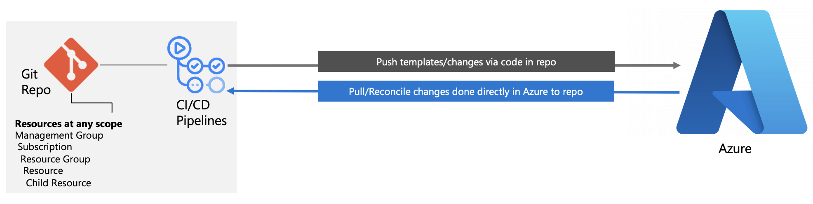
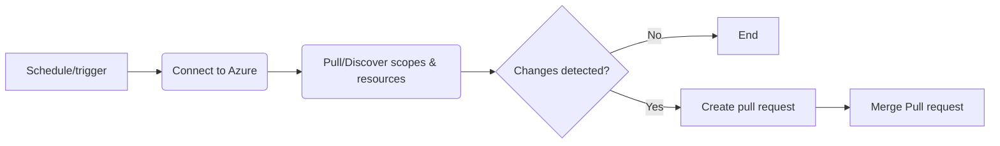
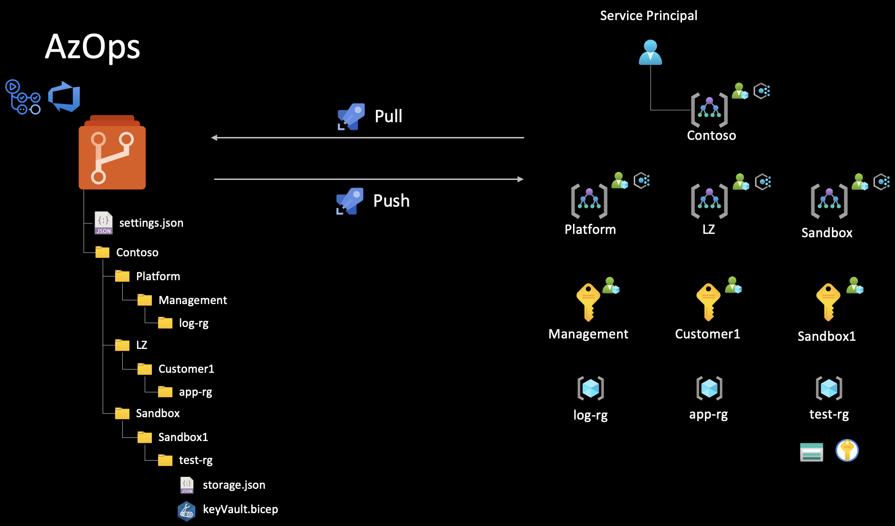
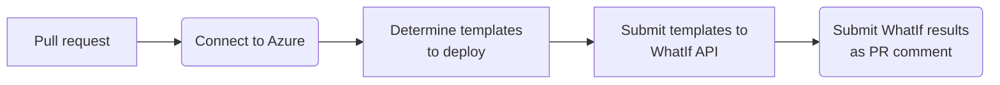
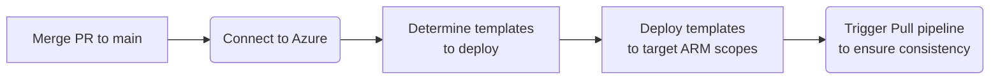

# Operational Excellence for FSI Landing Zones

The FSI Landing Zones on Microsoft Azure servers as an enterprise architecture framework for organizations in the financial service industry, which provides a holistic view of technology throughout the financial institution's technology infrastructure, systems, inter-connectivity, and security controls. The FSI Landing Zones facilitates the conceptual design and maintenance of the all-up architecture on Azure, security controls and policies, and serves as the foundation on which financial institutions plan and structure system development and acquisition strategies to meet business goals.

In addition to an architecture framework, organizations in the financial service industry must establish clear risk management policies and practices for the key phases of the system development life-cycle (SDLC) encompassing system design, development, testing, deployment, change management, maintenance and decommissioning. Such policies and practices must also embed security and relevant enterprise architecture considerations into the SDLC to ensure confidentiality, integrity and availability of data.

With regards to code reviews, organizations in the financial service industry must also ensure any changes to the source code of critical systems are subject to adequate source code reviews to ensure code is secure and was developed in line with recognized coding practices prior to introducing any system changes.

To comply with the above, organizations in the financial service industry are often spending a lot of time to enable Infrastructure-as-code in Azure just in order to operationalize the Azure platform itself, and then must rinse and repeat per workloads for each application team that gets onboarded into their landing zones.

In order to accelerate this process and meet the FSI organizations where they are, regardless whether they are new to FSI Landing Zones or already have an established footprint in Azure, we have developed [*AzOps*](https://github.com/Azure/AzOps-Accelerator) which is an Azure-aligned and Azure Resource Manager native module that will help organizations in the financial service industry to operationalize Azure at scale, regardless of starting point and scale

## Table of contents

* [AzOps - Intro](#azops-intro)
  * [Discovery](#discovery)
  * [Deployment](#deployment)
* [Examples of end-to-end walkthrough](#examples-of-end-to-end-walkthrough)
* [Next Steps](#next-steps)

## AzOps - Intro

After many years of hands-on engagement with several customers across multiple industries, it was evident that the pace of development of the Azure platform was outpacing the ability of customers to operationalize Azure at scale using infrastructure as code. This was especially true for customers in the financial service industry, where the pace of change and the scale of the Azure platform was even more pronounced, given the strict security requirements they must adhere to.

Specifically related to Azure deployments using Azure Resource Manager templates (ARM), historically, ARM could only deploy to an existing *resource group*, which made it very simple - although also constrained - what type of resources one could deploy to Azure. However, as the Azure platform grew, the need to deploy *any* resources to Azure in a more structured and repeatable manner became more apparent. Since the limitation of resource group scoped deployments only, Azure - and Azure Resource Manager - which is the unified control-plane for Azure, has evolved to allow you to deploy to any scope (tenant, management groups, subscriptions, and resource groups). Now, from a pipeline perspective, this opened up many new opportunities for customers to declare larger set of resources and scopes in a single or/and multiple deployments, but also introduced some operational challenges from a Git and pipeline perspective in terms of what must be stored where, and how it would evolve over time.

> **Note:** When referring to Azure *scopes*, we are referring to the following: tenant -> management group -> subscription -> resource group -> resource within the resource group. As ARM has evolved, even management groups and subscription are now resources that can be created, hence the scopes would be dynamic in Azure, yet at the same time, the scope is the key input to any deployment to deterministically deploy and target the right resource at the right scope.

AzOps was developed with the above in mind, to ensure that customers could continue to operationalize their Azure platform at scale when 1) new scopes were created as part of the pipelines, and 2) if there were any outbound changes directly in Azure (e.g., someone had to remediate something directly via the Azure portal due to urgency and criticality), AzOps would be able to detect and reconcile those changes back into the Git repository, where the structure of the repository would be 1:1 with the Azure scopes, organizing the ARM templates in a way that would be easy to consume and understand.

### Discovery (Pull pipeline)

The Discovery process (Pull pipeline) is used to discover all Azure Scopes and Resources, subject to the [Service Principal RBAC Permissions](https://github.com/azure/azops/wiki/prerequisites) and [settings](https://github.com/azure/azops/wiki/settings) configured. This allows for an IaC-first approach, using the Validate/Push pipelines as well as creating, updating, and deleting infrastructure via the Portal. The Pull pipeline will then manage configuration drift by querying the Azure Resource Manager, determining any changes with respect to the repos main branch, and then opening and merging a Pull Request to integrate those changes.
The Pull pipeline is configured to run every 6 hours via cron and can also be run manually on-demand.

For further details, refer to the [AzOps documentation](https://github.com/azure/azops/wiki/steps#pull).

### Deployment (Validate/Push pipeline)

The deployment process in AzOps follows common IaC best practices and consists of two pipelines.

#### Validate pipeline

The Validate pipeline is designed to be run on Pull Requests. On creation of a Pull Request, or commits to the PR, the Validate pipeline will look for changes, validate them against the Azure Resource Manage WhatIf API, and add a PR comment with "WhatIf" results showing the proposed changes. Below is an example showing the "WhatIf" result for update of a policyDefinition:

For further details, refer to the [AzOps documentation](https://github.com/azure/azops/wiki/steps#validate).

#### Push pipeline

The Push pipeline will run automatically on any commits to the main branch, either directly or preferably via Pull Request. Upon creation of a PR (and on subsequent PR commits), the Validate pipeline will run (as described above). When the PR is merged, the Push pipeline will run and deploy the changes to Azure.

For further details, refer to the [AzOps documentation](https://github.com/azure/azops/wiki/steps#push).

## Examples of end-to-end walkthrough

## Next Steps
