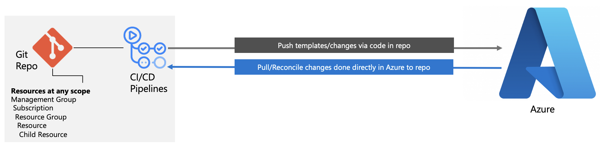

# Security, Governance, and Compliance by-default for FSI Landing Zones

The FSI Landing Zones on Microsoft Azure provides a proven, authoritative, and scalable starting point for organizations within the financial services industry on their digital transformation trajectory.

This article provides an up-to-date view of every Azure Policy and security control capability that is provided in the reference implementation, and explains the intent, user experiences, and also the required steps for an application teams within the landing zones to mitigate through self-service.scale

## Table of contents

* [Autonomy with Governance](#autonomy-with-governance)
  * [Prescriptive, preventive, and proactive](#prescriptive-preventive-and-proactive)
* [FSI Landing Zones Azure Policy index](#fsi-landing-zones-azure-policy-index)
* [Next Steps](#next-steps)

## Autonomy with Governance

Azure Policy is one of the key primitives in the Azure platform to ensure that resource configuration and the overall architecture is compliant and meet the regulatory requirements. FSI Landing Zones is intentially prescriptive with its usage of Azure Policy to reduce the management overhead as the environment grows, new business requirements are being introduced, and new Azure services are evolving. As being one of the key principles of FSI Landing Zones on Microsoft Azure, Azure Policy should be used in a prescriptive way to 1) prevent, and 2) be proactive to ensure continous compliance and the desired goal state of the Azure platform, landing zones, and the workload within the landing zones.

### Prescriptive, preventive, and proactive

Azure Policy provides multiple policy effects where organizations in general can decide to prevent, detec, and be proactive with the controls being implemented. The FSI Landing Zones on Microsoft Azure 

## FSI Landing Zones Azure Policy index

## Next Steps
