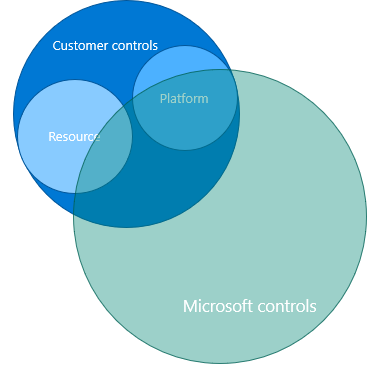

# Service Enablement Framework for FSI Landing Zones on Microsoft Azure

Organizations in the financial services regulated industry face the challenge of defining, mapping, and enforcing their controls that are needed for them to meet the compliance and security requirements. In parallel, they must balance the need of the business and developers while empowering them to accelerate the digital transformation journey. This must all work in harmony while addressing risk, reliability, and other requirements, and also comply with frameworks and standards such as PCI DSS, NIST 800-53, SOC 1,2,3 and more.

The process of definining, mapping, and implementing the required controls can in most cases be an expensive and time-consuming job, performed by "Digital Security Office", "Tech Risk Assessment" or equivalent function/team within the organization. However, this is a critical function to enable specific Azure services to be broadly adopted, and the *Service Enablement Framework for FSI Landing Zones* aim to help organizations within the financial services industry to accelerate this process, coupled with a proven, prescriptive architecture and implementation on Microsoft Azure.

## Table of contents

* [Operating Model and required functions](#Operating-model-and-required-functions)
* [Service Enablement Framework](#service-enablement-framework)
    * [Microsoft controls and customer controls](#microsoft-controls-and-customer-controls)
        * [Control mapping](#control-mapping)
        * [Design](#design)
        * [Implementation](#implementation)
            * [Enablement and acceleration](#enablement-and-acceleration)
        * [Evidence](#evidence)
* [Examples of end-to-end walkthrough](#examples-of-end-to-end-walkthrough)
* [Next Steps](#next-steps)

## Operating model and required functions
This section outlines the recommended operating model and reqiured functions to operationalize the Azure platform while enabling the landing zones for an FSI organization.

Sustainable engineering is key to succeed with cloud adoption, and an well-defined operating moodel is recommended that enables the organization to scale and grow, while having clear separation of duties with regards to operating the *platform* - and to operate the landing zones with the workloads.

The following picture depicts the recommended operating model that has been successfully adopted by several of Microsoft's larges FSI customers, where there's clear separation of *Platform DevOps* - being the team with required functions to enable and operationalize the Azure platform, which provides the landing zones as output to the business and application teams, and the *DevOps* and *AppOps* who will be responsible for their workloads in the landing zones.

### Platform DevOps

They key functions required to compose and organize a dedicated platform team is:
* System Ops
    * Provides expertise for operarting systems, database technologies, and runtimes.
* Automation Ops
    * Provides expertise for automating the deployment and management of the platform, such as subscription provisioning into the landing zones, policy definitions/assignments, management group structure, roleDefinitions/assignments and more - scoped to the platform
* Management Ops
    * Provides expertise for managing the platform, such as monitoring, alerting, and reporting from a *platform* perspective.
* Network Ops
    * Responsible for the all-up network topology and connectivity in Azure, for hybrid connectivity (on-premises, to/from other cloud providers)
* Security Ops
    * Responsible for the security of the platform, such as security monitoring, threat detection, risks assessment, and governance and compliance.
* Identity Ops
    * Responsible for the identity and access management of the platform, such as identity management, authentication, authorization, access control, access reviews and more.
* Customer Ops
    * Responsible for the customer experience of the platform, such as customer support, customer enablement and success, and customer engagement. This function is helpful for overall enablement and onboarding application teams successfully to the Azure platform in their respective landing zones.

The Platform DevOps team is overall responsible for the holistic architecture governance and management of the Azure platform, and from a team objective perspective, the team must have the following areas in scope:
* Architecture governance
    * Define and govern the architecture of the Azure platform, including the landing zones, and ensure that the architecture is aligned with the business and application requirements.
* Subscription management
    * Manage the subscription lifecycle, such as provisioning and placement into the management group structure (i.e., to ensure the right policies are in place to ensure a deterministic continuous compliance state), and de-provisioning of the subscriptions.
* "Platform as Code"
    * Define and implement the platform as code, such as the ARM templates/code artifacts for management group structure, policy definitions/assignments, roleDefinitions/assignments and more - scoped to the platform.
* Service Enablement (holistic)
    * Control mapping, design, implementation, and maintenance of the Azure Policy enforcement holisitically across the platform, and ensure that the Azure platform is compliant with the required controls.
* Platform management and monitoring (holistic)
    * Manage and monitor the Azure platform related events, signals, and metrics.
* Role based access control (holistic)
    * Define, implement and control the identity and access management of the Azure platform, often in partnership with on-prem identity functions for AD sync, federeation and more.
* Key management (central service)
    * Primarily responsible for keys required for AD domain joined virtual machines, where the key management is done centrally as this requires to be a shared service.
* Network management (holistic)
    * Responsible for end-to-end networking to and from Azure, managed the address space, peering, and connectivity to other cloud providers.
### DevOps and AppOps

In comparison to the Platform DevOps team - which will be one team responsible for the overall Azure platform (holistic), there will be multiple DevOps teams depending on the size of the organization. Recommendation is to have a dedicated team for each application, as in "you build it - you run it", where they have full autonomy and ownership of their deployment pipelines and landing zones. Further, the *AppOps* team can be 1:1 per application, or 1:many, where the applications are either first-party - or third-party. 
The key responsibiliies for these teams inside the landing zones are:
* Production systems resiliency, reliablity, and availability within SLA targets
* Development or enhancement of application DevOps pipelines
* Review and enhancement of the application design, deployment and lifecycle
* Application migration and/or transformation
* Application management and monitoring (app resources)
* Key management (app keys)
* Role based access control (app resources)
* Security monitoring and audit (app resources)
* Cost management (app resources)
* Network management (app resources)
## Service Enablement Framework

The Service Enablement Framework encompass the requisite sequence, activities, and artifacts required to enable the Azure platform and services for a specific customer. The framework is designed to be used by the Platform DevOps team, and is a holistic approach to enable the Azure platform and services, and ensure that the platform is compliant with the required controls.

From a high-level perspective, the Service Enablement Framework is composed of the following activities:

The first phase is to recognize and distinguish between what is a control and responsibility by Microsoft, and what the explicit customer responsibilities are. Once this has been generally understood and established, it simplifies the process and accelerates subsequent enablements the organization will perform. 
### Microsoft controls and customer controls

For Service Enablement, it is key to understand how to distinguish between the controls that Microsoft is responsible for for the Azure platform and services (e.g., ensure data in-transit encryption for data plane for Cosmos DB is enabled, is a Microsoft control and responsibility as this cannot be disabled by the customer), vs the controls that the customer is responsible for (.e.g., ensure customer-managed key is used for encrypting data at rest when required), as well as when the responsibility is shared (e.g., in support scenarios where Microsoft needs to access your data, use Customer Lockbox to review, then approve or reject each of Microsoft's data access requests).

Further, Azure compliance for the platform and services as a whole are based on various types of assurances, including formal certifications, attestations, validations, authorizations, and assements produced by independent third-party auditing firms, as well as contractual amendments, self-assessments, and customer guidance documents provided by Microsoft. 

Each offering description in [this document](https://azure.microsoft.com/mediahandler/files/resourcefiles/microsoft-azure-compliance-offerings/Microsoft%20Azure%20Compliance%20Offerings.pdf) provides an up to date scope statement indicating which Azure customer-facing services are in scope for the assessment, as well as links to downloadable resources to assist customers with their own compliance obligations. Azure compliance offerings are grouped into four segments: globally applicable, US government, industry specific, and region/country specific.

### Control mapping

This section provides a mapping of the controls to the Azure services. The mapping is based on the Azure services documentation and the Microsoft Cloud Security Baseline. The mapping is not exhaustive and is intended to provide a starting point for your security assessment.

With Microsoft Cloud Security Benchmark, we have consolidated security controls and baselines and how it maps to guidance like Center for Internet Security (CIS) Controls, National Institute of Standards and Technology (NIST), and the Payment Card Industry Data Security Standard (PCI-DSS) framework, which makes it easier to map the controls to the Azure services.

The following table provides a framework to assess enterprise security readiness of Azure services.

| Assesment                    | Category                                                              | Crtieria                                                                                                                                     |
|------------------------------|-----------------------------------------------------------------------|----------------------------------------------------------------------------------------------------------------------------------------------|
| Security                     | Network endpoint                                                      | Does the service have a public endpoint that is accessible outside of a VNet?                                                                |
|                              |                                                                       | Does it support VNet Service Endpoints?                                                                                                      |
|                              |                                                                       | Can Azure services interact directly with the service endpoint?                                                                              |
|                              |                                                                       | Does it support Private Link Endpoints?                                                                                                           |
|                              |                                                                       | Can it be deployed within a VNet?                                                                                                            |
|                              | Data Exfiltration Prevention                                          | Does the PaaS service have a separate BGP community in ExpressRoute Microsoft Peering? (i.e. does ER expose a Route Filter for the service?) |
|                              |                                                                       | Does the service support Private Link Endpoints?                                                                                                       |
|                              | Enforce Network Traffic Flow for management and data plane operations | Is it possible to inspect traffic entering/exiting the service? Can traffic be force tunnelled with UDRs?                                    |
|                              |                                                                       | Do management operations use Azure shared public ip ranges?                                                                                 |
|                              |                                                                       | Is management traffic directed via a link-local endpoint exposed on the host?                                                                |
|                              | Data Encryption at-rest                                               | Is encryption applied by default?                                                                                                            |
|                              |                                                                       | Can encryption be disabled?                                                                                                                  |
|                              |                                                                       | Is encryption performed using Microsoft Managed Keys (MMK) or Customer Managed Keys (CMK)?                                                   |
|                              | Data Encryption in-transit                                            | Is traffic to the service encrypted at a protocol level (SSL/TLS)?                                                                           |
|                              |                                                                       | Are there any HTTP endpoints and can the be disabled?                                                                                        |
|                              |                                                                       | Is underlying service communication also encrypted?                                                                                          |
|                              |                                                                       | Is encryption performed using MMK or CMK? (is BYoK supported?)                                                                               |
|                              | Software Deployment                                                   | Can application software or third party products be deployed to the service?                                                                 |
|                              |                                                                       | How is software deployment performed and managed?                                                                                            |
|                              |                                                                       | Can policies enforced to control source or code integrity?                                                                                   |
|                              |                                                                       | If software is deployable, can antimalware, vulnerability management and security monitoring tools be used?                                  |
|                              |                                                                       | Does the service provide such capabilities natively? (e.g., AKS)                                                                              |
| Identity & Access Management | Authentication & Access Control                                       | Are all Control plane operations governed by Azure AD? (i.e. is there a nested control plane, such as for Kubernetes)                             |
|                              |                                                                       | What methods exist to provide access to the Data plane?                                                                                      |
|                              |                                                                       | Does the Data plane integrate with Azure AD?                                                                                                      |
|                              |                                                                       | Does Azure to Azure (service to service) authentication use a MSI/Service Principal?                                                         |
|                              |                                                                       | Is Azure to IaaS (Service to VNet) authentication via Azure AD?                                                                                   |
|                              |                                                                       | How are any applicable keys/SAS managed?                                                                                                     |
|                              |                                                                       | How can access be revoked?                                                                                                                   |
|                              | Segregation of Duties                                                 | Does the service separate Control plane and Data plane operations within Azure AD?                                                                |
|                              | MFA and conditional access                                            | Is MFA enforced for user to service interactions?                                                                                            |
| Governance                   | Data Export & Import                                                  | Does service allow you to import and export data securely and encrypted?                                                                     |
|                              | Data Privacy & Usage                                                  | Can Microsoft engineers access the data?                                                                                                     |
|                              |                                                                       | Is any Microsoft support interaction with the service audited?                                                                               |
|                              | Data Residency                                                        | Is data contained to the service deployment region?                                                                                          |
| Operations                   | Monitoring                                                            | Does the service integrate with Azure Monitor?                                                                                               |
|                              | Backup Management                                                     | Which workload data need to be backed?                                                                                                       |
|                              |                                                                       | How are backups captured?                                                                                                                    |
|                              |                                                                       | How frequently can backups be taken?                                                                                                         |
|                              |                                                                       | How long can backups be retained for?                                                                                                        |
|                              |                                                                       | Are backups encrypted?                                                                                                                       |
|                              |                                                                       | Is backup encryption performed using MMK or CMK?                                                                                             |
|                              | Disaster Recovery                                                     | How can the service be used in a regional redundant fashion?                                                                                 |
|                              |                                                                       | What is the attainable RTO and RPO?                                                                                                          |
|                              | SKU                                                                   | What SKUs are available? and how do they differ?                                                                                             |
|                              |                                                                       | Are there any features related to security for premium SKU?                                                                                  |
|                              | Capacity Management                                                   | How is capacity monitored?                                                                                                                   |
|                              |                                                                       | What is the unit of horizontal scale?                                                                                                        |
|                              | Patch & Update Management                                             | Does the service require patching or is it abstracted by the service?                                                                        |
|                              |                                                                       | How frequently are patches applied and can they be automated?                                                                                |
|                              | Audit                                                                 | Are nested Control plane operations captured? (e.g., AKS or Databricks)                                                                       |
|                              |                                                                       | Are key Data plane activities recorded?                                                                                                      |
|                              | Configuration Management                                              | Does it support Tags and provide a PUT schema for all resources?                                                                             |
| Azure Service Compliance     | Service Attestation, Certification and External Audits                | Is the service PCI/ISO/SOC compliant?                                                                                                        |
|                              | Service Availability                                                  | Is the service Private Preview/Public Preview/GA?                                                                                            |
|                              |                                                                       | In what regions is the service available?                                                                                                    |
|                              |                                                                       | What is the deployment scope of the service? (i.e. is it a regional or global service?)                                                      |
|                              | Service Level Agreements                                              | What is the SLA for service availability?                                                                                                    |
|                              |                                                                       | If applicable, what is the SLA for performance?                                                                                              |

### Design
This section explains the design phase of the controls

Understand what should be:
1. Azure policy
2. Identity related
3. Outside of ARM related
4. Internal processes

### Implementation
This section explains the implementation phase of the controls

Highlight the architecture and how it is implemented. simplified assignment process
focus on the right policy effects
show how to create custom policy and how to assign it

#### Enablement and acceleration
This section explains the enablement and acceleration phase of the controls

### Evidence
This section provides evidence of the controls

## Examples of end-to-end walkthrough