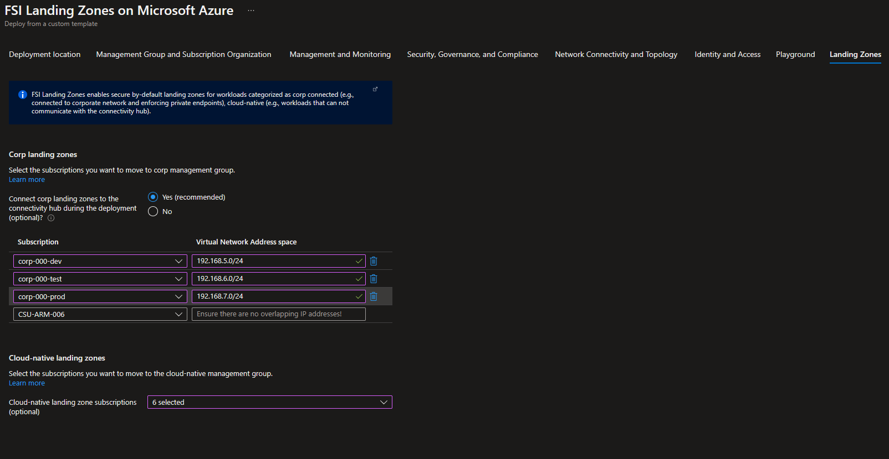

# Service Enablement Framework for FSI Landing Zones on Microsoft Azure

Organizations in the financial services regulated industry face the challenge of defining, mapping, and enforcing their controls that are needed for them to meet the compliance and security requirements. In parallel, they must balance the need of the business and developers while empowering them to accelerate the digital transformation journey. This must all work in harmony while addressing risk, reliability, and other requirements, and also comply with frameworks and standards such as PCI DSS, NIST 800-53, SOC 1,2,3 and more.

The process of definining, mapping, and implementing the required controls can in most cases be an expensive and time-consuming job, performed by "Digital Security Office", "Tech Risk Assessment" or equivalent function/team within the organization. However, this is a critical function to enable specific Azure services to be broadly adopted, and the *Service Enablement Framework for FSI Landing Zones* aim to help organizations within the financial services industry to accelerate this process, coupled with a proven, prescriptive architecture and implementation on Microsoft Azure.

## Table of contents

* [Operating Model and required functions](#Operating-model-and-required-functions)
* [Required Azure Services](#required-azure-services)
* [Service Enablement Framework](#service-enablement-framework)
    * [Microsoft controls and customer controls](#microsoft-controls-and-customer-controls)
        * [Control mapping](#control-mapping)
        * [Design](#design)
        * [Implementation](#implementation)
        * [Evidence](#evidence)
* [Examples of end-to-end walkthrough](#examples-of-end-to-end-walkthrough)
* [Next Steps](#next-steps)

## Operating model and required functions
This section outlines the recommended operating model and reqiured functions to operationalize the Azure platform while enabling the landing zones for an FSI organization.

Sustainable engineering is key to succeed with cloud adoption, and an well-defined operating moodel is recommended that enables the organization to scale and grow, while having clear separation of duties with regards to operating the *platform* - and to operate the landing zones with the workloads.

The following picture depicts the recommended operating model that has been successfully adopted by several of Microsoft's larges FSI customers, where there's clear separation of *Platform DevOps* - being the team with required functions to enable and operationalize the Azure platform, which provides the landing zones as output to the business and application teams, and the *DevOps* and *AppOps* who will be responsible for their workloads in the landing zones.


### Platform DevOps

They key functions required to compose and organize a dedicated platform team is:
* System Ops
    * Provides expertise for operarting systems, database technologies, and runtimes.
* Automation Ops
    * Provides expertise for automating the deployment and management of the platform, such as subscription provisioning into the landing zones, policy definitions/assignments, management group structure, roleDefinitions/assignments and more - scoped to the platform
* Management Ops
    * Provides expertise for managing the platform, such as monitoring, alerting, and reporting from a *platform* perspective.
* Network Ops
    * Responsible for the all-up network topology and connectivity in Azure, for hybrid connectivity (on-premises, to/from other cloud providers)
* Security Ops
    * Responsible for the security of the platform, such as security monitoring, threat detection, risks assessment, and governance and compliance.
* Identity Ops
    * Responsible for the identity and access management of the platform, such as identity management, authentication, authorization, access control, access reviews and more.
* Customer Ops
    * Responsible for the customer experience of the platform, such as customer support, customer enablement and success, and customer engagement. This function is helpful for overall enablement and onboarding application teams successfully to the Azure platform in their respective landing zones.

The Platform DevOps team is overall responsible for the holistic architecture governance and management of the Azure platform, and from a team objective perspective, the team must have the following areas in scope:
* Architecture governance
    * Define and govern the architecture of the Azure platform, including the landing zones, and ensure that the architecture is aligned with the business and application requirements.
* Subscription management
    * Manage the subscription lifecycle, such as provisioning and placement into the management group structure (i.e., to ensure the right policies are in place to ensure a deterministic continuous compliance state), and de-provisioning of the subscriptions.
* "Platform as Code"
    * Define and implement the platform as code, such as the ARM templates/code artifacts for management group structure, policy definitions/assignments, roleDefinitions/assignments and more - scoped to the platform.
* Service Enablement (holistic)
    * Control mapping, design, implementation, and maintenance of the Azure Policy enforcement holisitically across the platform, and ensure that the Azure platform is compliant with the required controls.
* Platform management and monitoring (holistic)
    * Manage and monitor the Azure platform related events, signals, and metrics.
* Role based access control (holistic)
    * Define, implement and control the identity and access management of the Azure platform, often in partnership with on-prem identity functions for AD sync, federeation and more.
* Key management (central service)
    * Primarily responsible for keys required for AD domain joined virtual machines, where the key management is done centrally as this requires to be a shared service.
* Network management (holistic)
    * Responsible for end-to-end networking to and from Azure, managed the address space, peering, and connectivity to other cloud providers.
### DevOps and AppOps

In comparison to the Platform DevOps team - which will be one team responsible for the overall Azure platform (holistic), there will be multiple DevOps teams depending on the size of the organization. Recommendation is to have a dedicated team for each application, as in "you build it - you run it", where they have full autonomy and ownership of their deployment pipelines and landing zones. Further, the *AppOps* team can be 1:1 per application, or 1:many, where the applications are either first-party - or third-party. 
The key responsibiliies for these teams inside the landing zones are:
* Production systems resiliency, reliablity, and availability within SLA targets
* Development or enhancement of application DevOps pipelines
* Review and enhancement of the application design, deployment and lifecycle
* Application migration and/or transformation
* Application management and monitoring (app resources)
* Key management (app keys)
* Role based access control (app resources)
* Security monitoring and audit (app resources)
* Cost management (app resources)
* Network management (app resources)

## Required Azure Services

To meet the compliance requirements at scale in Azure and to streamline the service enablement framework and processes involved, the following services would be required - and are created as part of FSI Landing Zones on Microsoft Azure:

* Azure Policy

Azure Policy is a core component of Azure Resource Manager which means it is baked into the control-plane, and will act on all kinds of requests regardless of client one may use. Azure Policy is a service that enables you to create, assign, and manage policies. A policy is a declarative statement that describes a rule and an effect. A policy can be assigned at a management group, subscription, or resource group scope. When a policy is assigned, it is evaluated against all resources in the scope. If the resource does not comply with the policy, the policy effect is applied. The policy effect can be deny, audit, modify, denyDelete, auditIfNotExists or deployIfNotExists. Azure Policy is the primary control mechanism that organizations will use to govern, operate, and manage Azure at scale alongside an optimized Azure architecture such as FSI Landing Zones.

* Microsoft Defender for Cloud

Microsoft Defender for Cloud is a cloud-native security service that provides advanced threat protection for your cloud workloads. It provides a unified security management experience for your cloud workloads, including Azure, Microsoft 365, and SaaS applications. Azure Policy will be used to enforce Microsoft Defender for Cloud enablement on every subscription that will be created, which will continiously assess subscriptions and resources from a security perspective, and provide additional intelligence to te PlatformOps team.

* Azure Log Analytics

Log Analytics is a service that helps you collect and analyze data generated by resources in your cloud and on-premises environments. It is a fully managed service that offers a fast, easy, and cost-effective way to aggregate and analyze data from any source. Azure Policy will be used to enforce Azure Log Analytics enablement on every subscription and resource that will be created, so the PlatformOps team can view platform related events and metrics.

* Microsoft Sentinel

Microsoft Sentinel is a cloud-native security information and event management (SIEM) and security orchestration automated response (SOAR) solution that helps you rapidly detect, investigate, and respond to threats. Azure Policy will be used to enforce all security related information from across all subscription in consolidated in to the Log Analytics workspace, which is the underlying infrastructure of Microsoft Sentinel.

* Azure AD Priviliged Identity Management

Azure AD Privileged Identity Management (PIM) is a cloud-based service that helps you manage access to your critical resources. It enables you to manage access to your privileged accounts and resources in Azure. It provides features such as just-in-time authorization (JIT) with approval processes, access reviews, and is integrated with Mult-Factor Authentication (MFA).

> NOTE: Azure Policy is the primary vehicle for service enablement and continious compliance which sits natively in Azure, wheares the other services must be excplicitly enabled and configured, and Log Analytics and Microsoft Sentinel will be created into a dedicated Management subscription that belongs to the PlatformOps team, separated from all the landing zones where the workloads will be deployed.

## Service Enablement Framework

The Service Enablement Framework encompass the requisite sequence, activities, and artifacts required to enable the Azure platform and services for a specific customer. The framework is designed to be used by the Platform DevOps team, and is a holistic approach to enable the Azure platform and services, and ensure that the platform is compliant with the required controls.

From a high-level perspective, the Service Enablement Framework is composed of the following activities:


The first phase is to recognize and distinguish between what is a control and responsibility by Microsoft, and what the explicit customer responsibilities are. Once this has been generally understood and established, it simplifies the process and accelerates subsequent enablements the organization will perform. 

### Microsoft controls and customer controls

For Service Enablement, it is key to understand how to distinguish between the controls that Microsoft is responsible for for the Azure platform and services. 

Examples:

* "Ensure data in-transit encryption for data plane for Cosmos DB is enabled", is a Microsoft control and responsibility as this cannot be disabled by the customer.

* "Ensure customer-managed key is used for encrypting data at rest when required", is a customer responsibility as they must provide the key - and the life-cycle management of it, and a KeyVault in a subscription to meet this requirement.

 In addition, sometimes the responsibility is shared between Microsoft and the customer, such as "Ensure Customer Lockbox is used to review, approve, or reject Microsoft data access requests". In this case, the customer is responsible for enabling Customer Lockbox, and Microsoft is responsible for using it.

 To review service by service per Microsoft Cloud security benchmark and baselines individually, please refer to the [Microsoft Cloud security benchmark and baselines](https://docs.microsoft.com/en-us/security/benchmark/azure/baselines) documentation.

 An example of how the benchmark is assessing each service to contextualize the responsiblity and to meet the control requirement can be seen below:

**Azure AD Authentication Required for Data Plane Access**

**Description**: Service supports using Azure AD authentication for data plane access.

| Supported | Enabled By Default | Configuration Responsibility |
|---|---|---|
| True | False | Customer |

**Feature notes**: Azure AD authentication is only supported on the Core (SQL) API. Other APIs only support key-based authentication.

**Configuration Guidance**: There is no current Microsoft guidance for this feature configuration. Please review and determine if your organization wants to configure this security feature.

**Local Authentication Methods for Data Plane Access**

**Description**: Local authentication methods supported for data plane access, such as a local username and password.

| Supported | Enabled By Default | Configuration Responsibility |
|---|---|---|
| True | True | Microsoft |

Further, Azure compliance for the platform and services as a whole are based on various types of assurances, including formal certifications, attestations, validations, authorizations, and assements produced by independent third-party auditing firms, as well as contractual amendments, self-assessments, and customer guidance documents provided by Microsoft. 

Each offering description in [this document](https://azure.microsoft.com/mediahandler/files/resourcefiles/microsoft-azure-compliance-offerings/Microsoft%20Azure%20Compliance%20Offerings.pdf) provides an up to date scope statement indicating which Azure customer-facing services are in scope for the assessment, as well as links to downloadable resources to assist customers with their own compliance obligations. Azure compliance offerings are grouped into four segments: globally applicable, US government, industry specific, and region/country specific.

### Control mapping

This section provides a mapping of the controls to the Azure services. The mapping is based on the Azure services documentation and the Microsoft Cloud Security Baseline. The mapping is not exhaustive and is intended to provide a starting point for your security assessment.

With Microsoft Cloud Security Benchmark, we have consolidated security controls and baselines and how it maps to guidance like Center for Internet Security (CIS) Controls, National Institute of Standards and Technology (NIST), and the Payment Card Industry Data Security Standard (PCI-DSS) framework, which makes it easier to map the controls to the Azure services.

The following table provides a framework to assess enterprise security readiness of Azure services.

| Assesment                    | Category                                                              | Crtieria                                                                                                                                     |
|------------------------------|-----------------------------------------------------------------------|----------------------------------------------------------------------------------------------------------------------------------------------|
| Security                     | Network endpoint                                                      | Does the service have a public endpoint that is accessible outside of a VNet?                                                                |
|                              |                                                                       | Does it support VNet Service Endpoints?                                                                                                      |
|                              |                                                                       | Can Azure services interact directly with the service endpoint?                                                                              |
|                              |                                                                       | Does it support Private Link Endpoints?                                                                                                           |
|                              |                                                                       | Can it be deployed within a VNet?                                                                                                            |
|                              | Data Exfiltration Prevention                                          | Does the PaaS service have a separate BGP community in ExpressRoute Microsoft Peering? (i.e. does ER expose a Route Filter for the service?) |
|                              |                                                                       | Does the service support Private Link Endpoints?                                                                                                       |
|                              | Enforce Network Traffic Flow for management and data plane operations | Is it possible to inspect traffic entering/exiting the service? Can traffic be force tunnelled with UDRs?                                    |
|                              |                                                                       | Do management operations use Azure shared public ip ranges?                                                                                 |
|                              |                                                                       | Is management traffic directed via a link-local endpoint exposed on the host?                                                                |
|                              | Data Encryption at-rest                                               | Is encryption applied by default?                                                                                                            |
|                              |                                                                       | Can encryption be disabled?                                                                                                                  |
|                              |                                                                       | Is encryption performed using Microsoft Managed Keys (MMK) or Customer Managed Keys (CMK)?                                                   |
|                              | Data Encryption in-transit                                            | Is traffic to the service encrypted at a protocol level (SSL/TLS)?                                                                           |
|                              |                                                                       | Are there any HTTP endpoints and can the be disabled?                                                                                        |
|                              |                                                                       | Is underlying service communication also encrypted?                                                                                          |
|                              |                                                                       | Is encryption performed using MMK or CMK? (is BYoK supported?)                                                                               |
|                              | Software Deployment                                                   | Can application software or third party products be deployed to the service?                                                                 |
|                              |                                                                       | How is software deployment performed and managed?                                                                                            |
|                              |                                                                       | Can policies enforced to control source or code integrity?                                                                                   |
|                              |                                                                       | If software is deployable, can antimalware, vulnerability management and security monitoring tools be used?                                  |
|                              |                                                                       | Does the service provide such capabilities natively? (e.g., AKS)                                                                              |
| Identity & Access Management | Authentication & Access Control                                       | Are all Control plane operations governed by Azure AD? (i.e. is there a nested control plane, such as for Kubernetes)                             |
|                              |                                                                       | What methods exist to provide access to the Data plane?                                                                                      |
|                              |                                                                       | Does the Data plane integrate with Azure AD?                                                                                                      |
|                              |                                                                       | Does Azure to Azure (service to service) authentication use a MSI/Service Principal?                                                         |
|                              |                                                                       | Is Azure to IaaS (Service to VNet) authentication via Azure AD?                                                                                   |
|                              |                                                                       | How are any applicable keys/SAS managed?                                                                                                     |
|                              |                                                                       | How can access be revoked?                                                                                                                   |
|                              | Segregation of Duties                                                 | Does the service separate Control plane and Data plane operations within Azure AD?                                                                |
|                              | MFA and conditional access                                            | Is MFA enforced for user to service interactions?                                                                                            |
| Governance                   | Data Export & Import                                                  | Does service allow you to import and export data securely and encrypted?                                                                     |
|                              | Data Privacy & Usage                                                  | Can Microsoft engineers access the data?                                                                                                     |
|                              |                                                                       | Is any Microsoft support interaction with the service audited?                                                                               |
|                              | Data Residency                                                        | Is data contained to the service deployment region?                                                                                          |
| Operations                   | Monitoring                                                            | Does the service integrate with Azure Monitor?                                                                                               |
|                              | Backup Management                                                     | Which workload data need to be backed?                                                                                                       |
|                              |                                                                       | How are backups captured?                                                                                                                    |
|                              |                                                                       | How frequently can backups be taken?                                                                                                         |
|                              |                                                                       | How long can backups be retained for?                                                                                                        |
|                              |                                                                       | Are backups encrypted?                                                                                                                       |
|                              |                                                                       | Is backup encryption performed using MMK or CMK?                                                                                             |
|                              | Disaster Recovery                                                     | How can the service be used in a regional redundant fashion?                                                                                 |
|                              |                                                                       | What is the attainable RTO and RPO?                                                                                                          |
|                              | SKU                                                                   | What SKUs are available? and how do they differ?                                                                                             |
|                              |                                                                       | Are there any features related to security for premium SKU?                                                                                  |
|                              | Capacity Management                                                   | How is capacity monitored?                                                                                                                   |
|                              |                                                                       | What is the unit of horizontal scale?                                                                                                        |
|                              | Patch & Update Management                                             | Does the service require patching or is it abstracted by the service?                                                                        |
|                              |                                                                       | How frequently are patches applied and can they be automated?                                                                                |
|                              | Audit                                                                 | Are nested Control plane operations captured? (e.g., AKS or Databricks)                                                                       |
|                              |                                                                       | Are key Data plane activities recorded?                                                                                                      |
|                              | Configuration Management                                              | Does it support Tags and provide a PUT schema for all resources?                                                                             |
| Azure Service Compliance     | Service Attestation, Certification and External Audits                | Is the service PCI/ISO/SOC compliant?                                                                                                        |
|                              | Service Availability                                                  | Is the service Private Preview/Public Preview/GA?                                                                                            |
|                              |                                                                       | In what regions is the service available?                                                                                                    |
|                              |                                                                       | What is the deployment scope of the service? (i.e. is it a regional or global service?)                                                      |
|                              | Service Level Agreements                                              | What is the SLA for service availability?                                                                                                    |
|                              |                                                                       | If applicable, what is the SLA for performance?                                                                                              |

### Design
This section explains the design phase of the controls

Understand what should be:
1. Azure policy
2. Identity related
3. Outside of ARM related
4. Internal processes

### Implementation
This section explains the implementation phase of the controls.

The implementation of the control in context of FSI Landing Zones on Microsoft Azure is tightly bound to the target architecture, where there is a clear separation of what is being defined as *platform* and what is being defined as *landing zones*. For all the *workloads* that will be deployed, will go into the *landing zones* which means that service enablement will primarily be focusing on implementing the controls on the *landing zones management* group, **and** at the level below; *corp* and *online* as the characteristics from a networking, security, and governance perspective will be different between those two. 
Having the target architecture in place will help to accelerate this as one would aim to have a uniformed implementation across all the *landing zones* within the Azure tenant.



The overall implmenentation process is depicted below, where we distinguish between *process*, *people*, and *technology*, where the *technology* part is what we will be focusing on in this document as it relates to implementing a control in context of FSI Landing Zones on Microsoft Azure.


An implementation of a control is subject to the characteristics of the control and the service itself. To demonstrate this we will be using an example that goes through the different steps using Azure Policy to implement the control.

**Step 1: Understanding the control**

There's a myriad of controls that an FSI organization must comply with, hence it is important to understand the control and its requirement. To illustrate this, we will be using an example where an organization will enable Azure SQL within the tenant, and must comply with the requirements within the **Logging and Threat Detection** category.

This means it's more than just enabling the logs and diagnostics on Azure SQL database itself, as it requires additional services and configuration, which also drivers additional set of controls and requirements such as:

1. Data sink (where the logs are stored)
2. Data retention (how long the logs must stored)
3. Access to the logs (who can access the logs)
4. Data export (how and where the logs can be exported)

>Note: With FSI Landing Zones on Microsoft Azure, the core components are already provided within the management subscription which contains the Log Analytics workspace for holistic observability of the platform from a security perspective. In terms of data retention, this can be configured directly on the Log Analytics workspace, and one can also define this granularity per log type.

Once we have a clear understanding of the control, we can start to assess the built-in policies that are available within Azure Policy in order to enable the diagnostics settings on Azure SQL databases and stream to the designated Log Analytics workspace.

**Step 2a: Assess Built-In policies**

Microsoft continues to evolve the platform and the investments in Azure Policy, and as such, it is important to understand what is available out of the box to accelerate the implementation and reduce the amount of custom policies (customer will be responsible to maintain the code and its life-cycle).

You can assess the built-in policies directly in the Azure Portal, or using PowerShell or CLI.

Example below using PowerShell to enumerate all built-in policies categorized as *SQL* and with a *description* referring to diagnostic settings.

```powershell
(Get-AzPolicyDefinition  | where-object {($_.Properties.metadata.category -eq "SQL" -and $_.properties.description -like "*diagn*")}).properties.description

Deploys the diagnostic settings for Azure SQL Database to stream to a regional Event Hub on any Azure SQL Database which is missing this diagnostic settings is created or updated.
Deploys the diagnostic settings for SQL Databases to stream resource logs to a Log Analytics workspace when any SQL Database which is missing this diagnostic settings is created or updated.

````

For further details, we can also extract the entire JSON to see the different parameters, such as the *effect*, and other relevant conditions for how the rule will be applied.

```powershell

Get-AzPolicyDefinition  | where-object {($_.Properties.metadata.category -eq "SQL" -and $_.properties.description -like "*log analytics*")} | convertto-json -depth 10

{
    "Name": "b79fa14e-238a-4c2d-b376-442ce508fc84",
    "ResourceId": "/providers/Microsoft.Authorization/policyDefinitions/b79fa14e-238a-4c2d-b376-442ce508fc84",
    "ResourceName": "b79fa14e-238a-4c2d-b376-442ce508fc84",
    "ResourceType": "Microsoft.Authorization/policyDefinitions",
    "SubscriptionId": null,
    "Properties": {
      "Description": "Deploys the diagnostic settings for SQL Databases to stream resource logs to a Log Analytics workspace when any SQL Database which is missing this diagnostic settings is created or updated.",
      "DisplayName": "Deploy - Configure diagnostic settings for SQL Databases to Log Analytics workspace",
      "Metadata": {
        "version": "4.0.0",
        "category": "SQL"
      },
      "Mode": "Indexed",
      "Parameters": {
        "effect": {
          "type": "String",
          "metadata": {
            "displayName": "Effect",
            "description": "Enable or disable the execution of the policy"
          },
          "allowedValues": [
            "DeployIfNotExists",
            "Disabled"
          ],
          "defaultValue": "DeployIfNotExists"
        },
        "diagnosticsSettingNameToUse": {
          "type": "String",
          "metadata": {
            "displayName": "Setting name",
            "description": "Name of the diagnostic settings."
          },
          "defaultValue": "SQLDatabaseDiagnosticsLogsToWorkspace"
        },
        "logAnalytics": {
          "type": "String",
          "metadata": {
            "displayName": "Log Analytics workspace",
            "description": "Select the Log Analytics workspace from dropdown list",
            "strongType": "omsWorkspace",
            "assignPermissions": true
          }
        },
        "QueryStoreRuntimeStatisticsEnabled": {
          "type": "String",
          "metadata": {
            "displayName": "QueryStoreRuntimeStatistics - Enabled",
            "description": "Whether to stream QueryStoreRuntimeStatistics logs to the Log Analytics workspace - True or False"
          },
          "allowedValues": [
            "True",
            "False"
          ],
          "defaultValue": "True"
        },
        "QueryStoreWaitStatisticsEnabled": {
          "type": "String",
          "metadata": {
            "displayName": "QueryStoreWaitStatistics - Enabled",
            "description": "Whether to stream QueryStoreWaitStatistics logs to the Log Analytics workspace - True or False"
          },
          "allowedValues": [
            "True",
            "False"
          ],
          "defaultValue": "True"
        },
        "ErrorsEnabled": {
          "type": "String",
          "metadata": {
            "displayName": "Errors - Enabled",
            "description": "Whether to stream Errors logs to the Log Analytics workspace - True or False"
          },
          "allowedValues": [
            "True",
            "False"
          ],
          "defaultValue": "True"
        },
        "DatabaseWaitStatisticsEnabled": {
          "type": "String",
          "metadata": {
            "displayName": "DatabaseWaitStatistics - Enabled",
            "description": "Whether to stream DatabaseWaitStatistics logs to the Log Analytics workspace - True or False"
          },
          "allowedValues": [
            "True",
            "False"
          ],
          "defaultValue": "True"
        },
        "BlocksEnabled": {
          "type": "String",
          "metadata": {
            "displayName": "Blocks - Enabled",
            "description": "Whether to stream Blocks logs to the Log Analytics workspace - True or False"
          },
          "allowedValues": [
            "True",
            "False"
          ],
          "defaultValue": "True"
        },
        "SQLInsightsEnabled": {
          "type": "String",
          "metadata": {
            "displayName": "SQLInsights - Enabled",
            "description": "Whether to stream SQLInsights logs to the Log Analytics workspace - True or False"
          },
          "allowedValues": [
            "True",
            "False"
          ],
          "defaultValue": "True"
        },
        "SQLSecurityAuditEventsEnabled": {
          "type": "String",
          "metadata": {
            "displayName": "SQLSecurityAuditEvents - Enabled",
            "description": "Whether to stream SQLSecurityAuditEvents logs to the Log Analytics workspace - True or False"
          },
          "allowedValues": [
            "True",
            "False"
          ],
          "defaultValue": "True"
        },
        "TimeoutsEnabled": {
          "type": "String",
          "metadata": {
            "displayName": "Timeouts - Enabled",
            "description": "Whether to stream Timeouts logs to the Log Analytics workspace - True or False"
          },
          "allowedValues": [
            "True",
            "False"
          ],
          "defaultValue": "True"
        },
        "AutomaticTuningEnabled": {
          "type": "String",
          "metadata": {
            "displayName": "AutomaticTuning - Enabled",
            "description": "Whether to stream AutomaticTuning logs to the Log Analytics workspace - True or False"
          },
          "allowedValues": [
            "True",
            "False"
          ],
          "defaultValue": "True"
        },
        "DeadlocksEnabled": {
          "type": "String",
          "metadata": {
            "displayName": "Deadlocks - Enabled",
            "description": "Whether to stream Deadlocks logs to the Log Analytics workspace - True or False"
          },
          "allowedValues": [
            "True",
            "False"
          ],
          "defaultValue": "True"
        },
        "Basic": {
          "type": "String",
          "metadata": {
            "displayName": "Basic (metric) - Enabled",
            "description": "Whether to stream Basic metrics to the Log Analytics workspace - True or False"
          },
          "allowedValues": [
            "True",
            "False"
          ],
          "defaultValue": "True"
        },
        "InstanceAndAppAdvanced": {
          "type": "String",
          "metadata": {
            "displayName": "InstanceAndAppAdvanced (metric) - Enabled",
            "description": "Whether to stream InstanceAndAppAdvanced metrics to the Log Analytics workspace - True or False"
          },
          "allowedValues": [
            "True",
            "False"
          ],
          "defaultValue": "True"
        },
        "WorkloadManagement": {
          "type": "String",
          "metadata": {
            "displayName": "WorkloadManagement (metric) - Enabled",
            "description": "Whether to stream WorkloadManagement metrics to the Log Analytics workspace - True or False"
          },
          "allowedValues": [
            "True",
            "False"
          ],
          "defaultValue": "True"
        }
      },
      "PolicyRule": {
        "if": {
          "allOf": [
            {
              "field": "type",
              "equals": "Microsoft.Sql/servers/databases"
            },
            {
              "field": "name",
              "notEquals": "master"
            }
          ]
        },
        "then": {
          "effect": "[parameters('effect')]",
          "details": {
            "type": "Microsoft.Insights/diagnosticSettings",
            "roleDefinitionIds": [
              "/providers/microsoft.authorization/roleDefinitions/749f88d5-cbae-40b8-bcfc-e573ddc772fa",
              "/providers/microsoft.authorization/roleDefinitions/92aaf0da-9dab-42b6-94a3-d43ce8d16293"
            ],
            "existenceCondition": {
              "allOf": [
                {
                  "field": "Microsoft.Insights/diagnosticSettings/workspaceId",
                  "equals": "[parameters('logAnalytics')]"
                },
                {
                  "count": {
                    "field": "Microsoft.Insights/diagnosticSettings/logs[*]",
                    "where": {
                      "anyOf": "         "
                    }
                  },
                  "equals": 10
                },
                {
                  "count": {
                    "field": "Microsoft.Insights/diagnosticSettings/metrics[*]",
                    "where": {
                      "anyOf": "  "
                    }
                  },
                  "equals": 3
                }
              ]
            },
            "deployment": {
              "properties": {
                "mode": "incremental",
                "template": {
                  "$schema": "http://schema.management.azure.com/schemas/2015-01-01/deploymentTemplate.json#",
                  "contentVersion": "1.0.0.0",
                  "parameters": {
                    "diagnosticsSettingNameToUse": {
                      "type": "string"
                    },
                    "resourceName": {
                      "type": "string"
                    },
                    "logAnalytics": {
                      "type": "string"
                    },
                    "location": {
                      "type": "string"
                    },
                    "Basic": {
                      "type": "string"
                    },
                    "InstanceAndAppAdvanced": {
                      "type": "string"
                    },
                    "WorkloadManagement": {
                      "type": "string"
                    },
                    "QueryStoreRuntimeStatisticsEnabled": {
                      "type": "string"
                    },
                    "QueryStoreWaitStatisticsEnabled": {
                      "type": "string"
                    },
                    "ErrorsEnabled": {
                      "type": "string"
                    },
                    "DatabaseWaitStatisticsEnabled": {
                      "type": "string"
                    },
                    "BlocksEnabled": {
                      "type": "string"
                    },
                    "SQLInsightsEnabled": {
                      "type": "string"
                    },
                    "SQLSecurityAuditEventsEnabled": {
                      "type": "string"
                    },
                    "TimeoutsEnabled": {
                      "type": "string"
                    },
                    "AutomaticTuningEnabled": {
                      "type": "string"
                    },
                    "DeadlocksEnabled": {
                      "type": "string"
                    }
                  },
                  "variables": {},
                  "resources": [
                    {
                      "type": "Microsoft.Sql/servers/databases/providers/diagnosticSettings",
                      "apiVersion": "2017-05-01-preview",
                      "name": "[concat(parameters('resourceName'), '/', 'Microsoft.Insights/', parameters('diagnosticsSettingNameToUse'))]",
                      "location": "[parameters('location')]",
                      "dependsOn": "",
                      "properties": "@{workspaceId=[parameters('logAnalytics')]; metrics=System.Object[]; logs=System.Object[]}"
                    }
                  ],
                  "outputs": {}
                },
                "parameters": {
                  "Basic": {
                    "value": "[parameters('Basic')]"
                  },
                  "InstanceAndAppAdvanced": {
                    "value": "[parameters('InstanceAndAppAdvanced')]"
                  },
                  "diagnosticsSettingNameToUse": {
                    "value": "[parameters('diagnosticsSettingNameToUse')]"
                  },
                  "WorkloadManagement": {
                    "value": "[parameters('WorkloadManagement')]"
                  },
                  "logAnalytics": {
                    "value": "[parameters('logAnalytics')]"
                  },
                  "location": {
                    "value": "[field('location')]"
                  },
                  "resourceName": {
                    "value": "[field('fullName')]"
                  },
                  "QueryStoreRuntimeStatisticsEnabled": {
                    "value": "[parameters('QueryStoreRuntimeStatisticsEnabled')]"
                  },
                  "QueryStoreWaitStatisticsEnabled": {
                    "value": "[parameters('QueryStoreWaitStatisticsEnabled')]"
                  },
                  "ErrorsEnabled": {
                    "value": "[parameters('ErrorsEnabled')]"
                  },
                  "DatabaseWaitStatisticsEnabled": {
                    "value": "[parameters('DatabaseWaitStatisticsEnabled')]"
                  },
                  "BlocksEnabled": {
                    "value": "[parameters('BlocksEnabled')]"
                  },
                  "SQLInsightsEnabled": {
                    "value": "[parameters('SQLInsightsEnabled')]"
                  },
                  "SQLSecurityAuditEventsEnabled": {
                    "value": "[parameters('SQLSecurityAuditEventsEnabled')]"
                  },
                  "TimeoutsEnabled": {
                    "value": "[parameters('TimeoutsEnabled')]"
                  },
                  "AutomaticTuningEnabled": {
                    "value": "[parameters('AutomaticTuningEnabled')]"
                  },
                  "DeadlocksEnabled": {
                    "value": "[parameters('DeadlocksEnabled')]"
                  }
                }
              }
            }
          }
        }
      },
      "PolicyType": 2
    },
    "PolicyDefinitionId": "/providers/Microsoft.Authorization/policyDefinitions/b79fa14e-238a-4c2d-b376-442ce508fc84"
  }
```

**Step 2b: Develop Custom policies**

In some cases, you may need to develop custom policies. This is the case when you need to implement a policy that is not available in the Azure Policy library, or if you want additional conditions and rules as part of an existing built-in policy.

To illustrate the approach one must take, we will take an example of a custom policy that is not available in the Azure Policy library. In this example, we will create a policy that will ensure that all Virtual Machine Extensions are from Microsoft. If there's a different publisher, the policy will deny the deployment of the virtual machine extension

1. Explore the available policy aliases for the Microsoft.Compute resource provider. This can easily be done using Azure CLI or Azure PowerShell.

````powershell

(Get-AzPolicyAlias -NameSpaceMatch Microsoft.Compute -ResourceTypeMatch).Name

Microsoft.Compute/virtualMachines/extensions/provisioningState
Microsoft.Compute/virtualMachines/extensions/publisher
Microsoft.Compute/virtualMachines/extensions/type
Microsoft.Compute/virtualMachines/extensions/typeHandlerVersion
Microsoft.Compute/virtualMachines/extensions/autoUpgradeMinorVersion
Microsoft.Compute/virtualMachines/extensions/enableAutomaticUpgrade
Microsoft.Compute/virtualMachines/extensions/settings

````

2. As we have an alias for 'Microsoft.Compute/virtualMachines/extensions/publisher', we can create a new policy definition using the Azure CLI, Azure PowerShell, Azure Portal, or Azure Resource Manager template using this alias in the rule set. The policy definition property bag could look like the one below:

````json

{
  "properties": {
    "displayName": "Ensure that all Virtual Machine Extensions are from Microsoft",
    "policyType": "Custom",
    "mode": "Indexed",
    "description": "This policy ensures that all Virtual Machine Extensions are from Microsoft",
    "metadata": {
      "version": "1.0.0",
      "category": "Compute"
    },
    "parameters": {
      "effect": {
        "type": "String",
        "metadata": {
          "displayName": "Effect",
          "description": "Enable or disable the execution of the policy"
        },
        "allowedValues": [
          "Audit",
          "Disabled",
          "Deny"
        ],
        "defaultValue": "Audit"
      }
    },
    "policyRule": {
      "if": {
        "allOf": [
          {
            "field": "type",
            "equals": "Microsoft.Compute/virtualMachines/extensions"
          },
          {
            "field": "Microsoft.Compute/virtualMachines/extensions/publisher",
            "notEquals": "Microsoft"
          }
        ]
      },
      "then": {
        "effect": "[parameters('effect')]"
      }
    }
  }
}

````

3. Deploy the policy definition to the intermediate root management group (the one below Tenant Root Group) so it can be assigned at any scope below.

**Step 3: Assign the policy**

Once the policy has been identified, either being a Built-In or a custom policy, it must be implemented at the appropriate scope in the management group hierarchy. For FSI Landing Zones, it will primarily happen on the Landing Zones management group if it should apply to all workloads, or explicitly on corp or online management group. The recommendation is to always assign at the management group scope as this will ensure segregation of duties as the application teams will inherit the control to their landing zones (subscriptions) and not be able to modify or tamper with the assignment.

In the examples we have used for Azure SQL Database, the policy effect should be *deployIfNotExists*, and for the custom policy for Virtual Machine Extensions, the policy effect should be *deny*.

This will ensure that a) every Azure SQL Database that gets deployed, will always have the diagnostic settings deployed, and b) every Virtual Machine Extension that gets deployed, will always be from Microsoft.

### Evidence
This section provides evidence of the controls

## Examples of end-to-end walkthrough

Explain usage of playground, ASB auditing and assessmenet, towards implentation of controls and applicationt team experiences