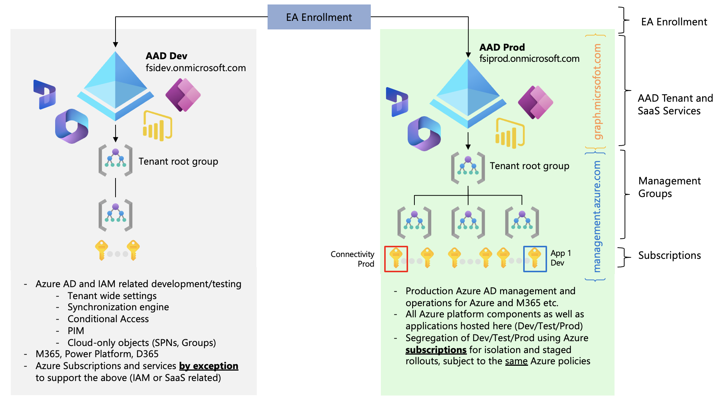
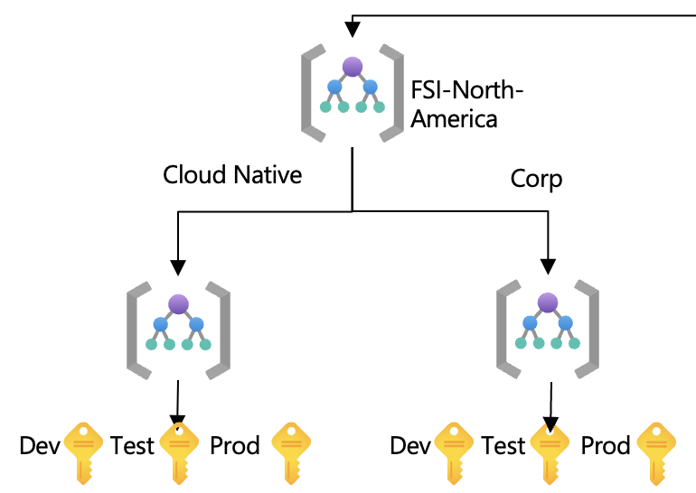

# Why environment separation at the subscription level

This article goes into the details how separation of concerns and environments - such as development, test, and production is done within the context of FSI Landing Zones on Microsoft Azure. 

## Table of contents

* [Understanding the platform primitives](#understanding-the-platform-primitives)
* [Separation at the subscription level](#separation-at-the-subscription-level)
* [FAQ](#faq)
* [Next Steps](#next-steps)

## Understanding the platform primitives

Azure AD (Entra ID) is the source of truth with regards to all *authentication* across the Microsoft Cloud offerings, such as Microsoft 365, Azure, Dynamics 365, and Power Platform. However, for the *authorization* of resources in Azure, the Azure Resource Manager (ARM) is the source of truth. This means that the authorization of resources in Azure is done by using the Azure Resource Manager which is a completely separate management endpoint and control plane compared to Azure AD.

In short, a principal (user, group, service principal, managed identity, etc) is authenticated by Azure AD, and then authorized by Azure Resource Manager to perform a specific action on a specific resource or/and scope. This is done by using the Azure Resource Manager API, and the authorization is done by using the Azure Resource Manager Role-Based Access Control (RBAC) model which determines the set of actions, notActions, dataActions, and notDataActions the principal can do.

With this context, we want to pre-empt the assumption of having multiple Azure AD tenants is needed to separate the lifecycle management of development, testing, and production of workloads deployed to Azure and explain how to achieve the required separation using the core primitives of the Azure platform aligned with the design principle of having a multi-subscription design.

To start at a high-level, the following diagram shows the different entities within Azure AD (graph) and Azure Resource Manager (ARM) that are used to achieve the separation of concerns and environments.

The diagram represents two Azure AD (Entra ID) tenants. A dedicated engineering dev tenant, and a production tenant. The dedicated engineering tenant is used for the development and testing of Azure AD specific resources, entities, and configuration. This is a good practice and recommended as many of the settings in Azure AD is global, and will have a significant impact and blast radius if not tested properly. The production tenant is then used to roll out the Azure AD specific changes performed in the Azure AD engineering dev tenant once validated and tested.

In the diagram, in the upper right corner you can find the representation of all the entities that are subject to RBAC within Azure AD (graph.microsoft.com) itself, which includes Power BI, Dynamics365, Power Platform etc. Below these entities, you can find the representation of all the entities that are subject to RBAC within Azure Resource Manager (management.azure.com) itself, which includes Management Groups, subscriptions, resource groups, and resources.

## Separation at the subscription level

One key principle of FSI Landing Zones is that the *subscription* is the unit of scale, management and policy boundary, hence the recommendation is to separate lifecycle management at the subscription level. From a developer perspective this would mean the following:

* Dedicated subscriptions are requested into the respective management groups depending on the intent and characteristics of the workload(s), which will determine the required set of policies, security controls, and networking requirements.

* The developer team is granted different RBAC permissions either directly at each of the subscriptions, or ideally by using eligible roles defined as entitlements in Privileged Identity Management (PIM) for just-in-time access, so they can have different level of permissions based on the intent of each subscription. E.g., Contributor permission can be granted to the test subscription, while Reader permission can be granted to the production subscription.

* The developer team is either using dedicated Managed Identities or Service Principals (subject to their toolchain and its capabilities) and have separation at the RBAC level there for each deployment pipeline.

The following diagram shows the separation of concerns and environments at the subscription level, and how the different RBAC permissions are granted to the developer team.

With a well-defined approach for subscription usage that aligns with the principles and take scale into account, this will also give several benefits from an overall operational perspective for nurturing the Azure Platform as a whole:

* Security controls and governance at scale can easily be implemented without additional operational burden, when treating each subscription as the same from an Azure Policy perspective.

* RBAC and Azure Policy is separated to avoid potential conflicts, where policies are assigned at the management group level(s), inherited to the subscriptions, whereas RBAC is assigned directly at the subscription level.

* Developers are not introduced to unnecessary complexity and friction, as their infrastructure-as-code would not have to change *drastically* when moving from development to test to production, as the subscription is the unit of scale, management and policy boundary.
    * Example: if one subscription would be subject to audit policies (e.g., not enforcing customer-managed keys and private endpoint) in test, while the prod subscription would enforce that, it would require significant changes to the code base and the sequence of deployment and dependencies when moving from test to prod.

For more information and details about the overall management group structure and its intent in FSI Landing Zones, please read the following article: [FSI Landing Zones architecture and design](./architectureAndDesign.md)

## FAQ

Q. What is the difference between a landing zone and a subscription?

A. The subscription is the scale-unit, management boundary, and isolation boundary. The landing zone is a *definition* when everything that must be **true** in order for workload deployments to commence into the subscription, is provided by the platform team, such as shared networking capabilities, identity and access management, governance, and security.

Q. Can we start with a single subscription, and later add a new subscription?

A. Trust us - you do not want to start with a single subscription. In the scenario where you combine both *platform* resources and *application* resources in a single subscription, and then later adds a new subscription, you are up for a tedious exercise to move or/and redeploy resources which will cause interruption. Further, it violates known best practices and design principles for overall landing zones. Lastly, there's no additional cost associated with the subscriptions themselves, hence it will not cost more for the subscriptions, just that the resource composition and distribution is better aligned for scale.

## Next Steps

Deploy the FSI Landing Zones on Microsoft Azure reference implementation. Explore the user guide and the deployment experience by following the links below:

| Reference Implementation | Description | Deploy | Documentation
|:----------------------|:------------|--------|--------------|
| FSI Landing Zones | FSI Landing Zones foundation that provides a full, rich, compliant architecture with scale-out pattern for secure-by default regions and landing zones, with a robust and customizable service enablement framework to accelerate adoption of Azure service and enables digital transformation | | [User Guide](../referenceImplementation/readme.md)
