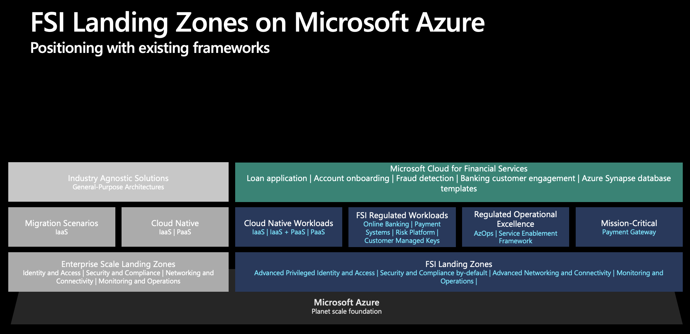

# Financial Services Industry (FSI) Landing Zones on Microsoft Azure

The FSI Landing Zones on Microsoft Azure is an architecture and design methdology, with a proven reference implementation that is developed after years of learnings and experience, working closely with our most complex and sophisticated customers in the financial services industry.

Due to being in a highly regulated industry where strict and non-negotionable compliance requirements must be met and is the nature of the FSI business, organizations in the FSI industry have unique requirements compared to other organizations of similar scale. Such requirements include:

* Delivery of a secure-by-default infrastructure that meets the regulatory compliance requirements, every hour, every day, and every year, with evidence provided to regulators.
* Highly-resillient foundation to ensure mission-critical applications - such as payment gateways are meeting the required service level agreement(s) (SLA).
* Foundation that caters for generic - and industry specific workloads and scenarios, while balancing various degree of security and compliance requirements.
* Operational Excellence aligned with the target architecture to confirm with the required SDLC and DevOps processes for FSI.

This article provides a reference architecture with prescriptive guidance and recommendations for the FSI industry on Microsoft Azure.

## Table of contents

* [FSI Landing Zones Reference Implementations](#fsi-landing-zones-reference-implementation)
* [FSI Landing Zones architecture and design methodology](#fsi-landing-zones-architecture-and-design-methodology)
* [High-level architecture](#high-level-architecture)
  * [Security, Governance, and Compliance by-default for FSI industry scenarios](#letter-a)
  * [Service Enablement Framework for FSI industry scenarios](#letter-b)
  * [Operational Excellence for regulated industries](#letter-c)
* [Solutions](#solutions)
  * [Payment Gateway](#network-analytics-landing-zones-for-operators)
  * [Banking Desktop solution](#edge-video-services)
  * [Compliant workload accelerators for FSI](#bpf-for-fsi)
* [Next Steps](#next-steps)

## FSI Landing Zones Reference Implementation

| Reference Implementation | Description | Deploy | Documentation
|:----------------------|:------------|--------|--------------|
| FSI Landing Zones | FSI Landing Zones foundation that provides a full, rich, compliant architecture with scale-out pattern for secure-by default regions and landing zones, with a robust and customizable service enablement framework to accelerate adoption of Azure service and enables digital transformation | | [User Guide](./referenceImplementation/readme.md)

## FSI Landing Zones architecture and design methodology

The FSI Landing Zones is exclusively designed-with, and built-with our largest FSI customers with global precense, and is based on proven architecture and design guidance to employ Azure at scale in a secure-by-default fashion, accelerating the digital transformation. The core foundation with landing zones underpins multiple turn-key architecture solutions, such as mission-critical payment gateways, digital banking, and the underlying Azure architecture for Microsoft Cloud for Financial Services Industry.

The conceptual all-up architecture is depicted below.

## High-level Architecture

 [Security, Governance, and Compliance by-default for FSI industry scenarios](./docs/securityGovernanceAndCompliance.md)

This section focuses on core Azure platform privitives in the realm of governance and security. Customers in regulated industries such as FSI must define and enforce required controls in order to meet compliance and security requirements while empowering application teams with sufficient freedom to innovate and deploy Azure services in a safe and secure manner. To ensure the right balance for the central platform and the application teams, FSI Landing Zones will rely on Azure Policy and Microsoft Defender for Cloud to provide a prescriptive, autonomous, preventive, and proactive continious compliant experience, that scales alongside withe the FSI's adoption of the Azure platform.

 [Service Enablement Framework for FSI Landing Zones](./docs/serviceEnablementFramework.md)

Microsoft Azure is a cloud platform that is rapidly evolving, meaning new services, features, API versions and more are frequently released across multiple Azure regions used by our FSI customers to compose, publish, configure, and deploy their applications based on the Azure services. For an organization to be able to validate security controls and baselines for each Azure service in order to make the service available within the organization, there's a need for an enablement process and framework that is aligned with the overall Azure architecture. This section focuses on the enablement process, and describes the *Service Enablement Framework for FSI Landing Zones* which is developed based on years with hands-on engagements with our FSI customers, and provides a proven methodology to accelerate this process, aligned with the *Policy-driven governance* design principle that ensures a secure-by-default Azure platform.

 [Operational Excellence for regulated industries](./docs/operationalExcellence.md)

This section focuses on how organizations in the financial services industry can operationalize and democratize Microsoft Azure within their organizations, and conform to safe deployment practices both for the platform deployments, as well as application deployments into the landing zones. To solve for this in a scalable way for the financial services industry, we have developed [AzOps](https://github.com/Azure/AzOps-Accelerator) which can be used together with Azure DevOps, Github, and GitLab.

## Solutions

### Payment Gateway