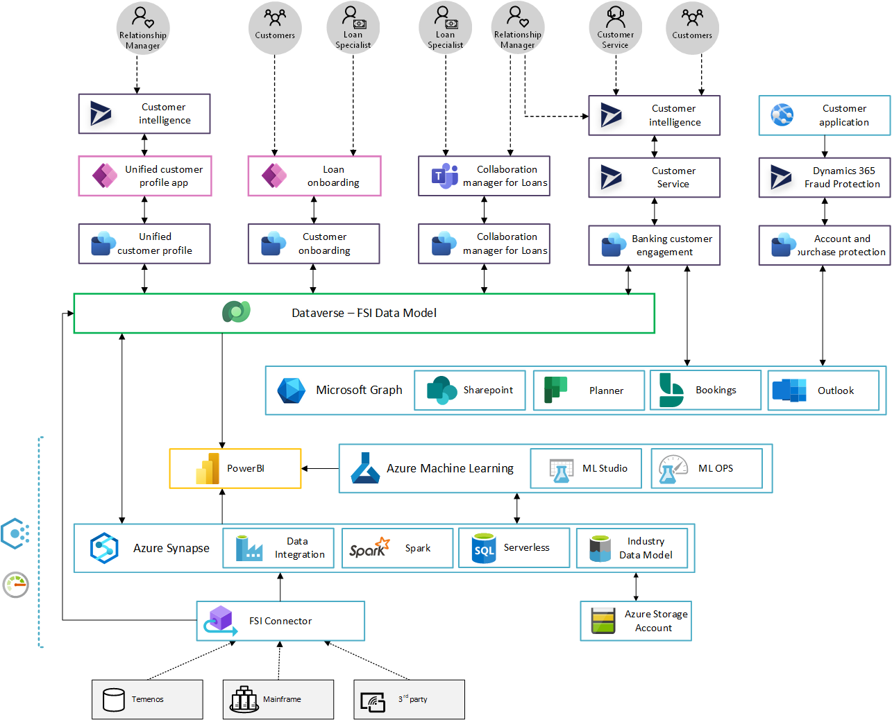

# Financial Services

Overall architecture for Microsoft Cloud for Financial Services.

| Industry Architecture | Description | Deploy |
|:----------------------|:------------|--------|
| Azure for FSI | Azure for FSI foundation  provides full architecture with landing zones for FSI industry |Coming Soon
| Power Platform for FSI | Coming Soon | Coming Soon
| Microsoft Teams for FSI | Coming Soon | Coming Soon

| Subject | Description |
|:---------------------------|:------------|
| [Financial Services Foundations (Recommended)](./fsi/prereqs.md) | Prerequisites
| Customer and employee experience
| [Unified customer profile](./solutions/unifiedCustomerProfile) | Help tailor customer experiences via a comprehensive view of the customer's financial situation
| [Customer onboarding](./solutions/customerOnboarding/) | Provide customers with easy-access loan apps and self-service tools, streamlining the loan process to help enhance customer experience and loyalty
| [Collaboration manager](./solutions/collaborationManager) | Enable automation, collaboration, and communications to help accelerate lending processes, minimize errors, and enhance customer experience
| [Banking customer engagement](./solutions/customerEngagement) | Help personalize customer interactions with relevant financial information to accelerate time to resolution
| Financial crime protection
| [Account protection](./solutions/accountProtection) | Help prevent fraudulent digital account creation and account takeover
| [Purchase protection](./solutions/purchaseProtection) | Help provide a differentiated experience for merchants to improve revenue and retention
| Compliance, privacy, and security
| [Risk assurance and support](./solutions/riskAssurance) | White glove service to support risk, audit, and compliance teams in addressing financial services regulatory compliance, cybersecurity, and privacy
| [Regulatory compliance assessments](./solutions/complianceAssessments) | Assess, monitor, and help improve compliance posture with global, regional, and industry regulations and standards
