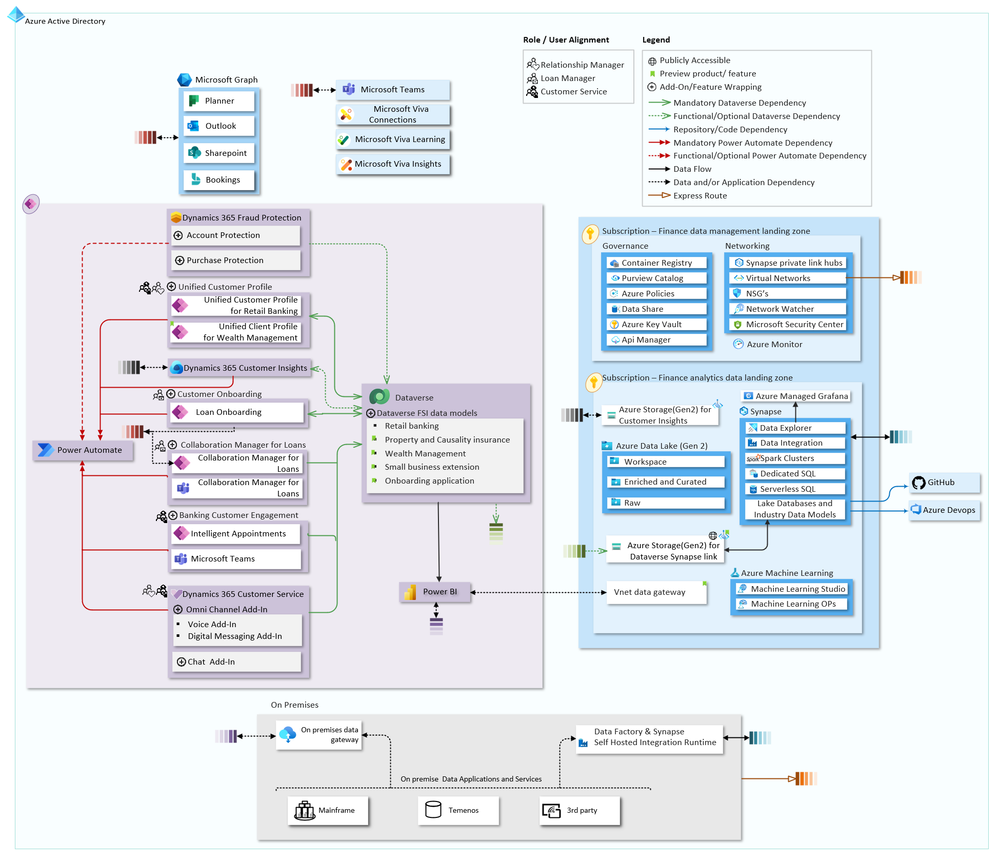

# Financial Services

Below you can find the overall architecture diagram for Microsoft Cloud for Financial Services, covering the suggested positioning of Azure services, Power Platform Services, other Microsoft products like Teams, Viva, SharePoint and Office.

The reference architecture builds upon the principles of Enterprise Scale Landing Zones, Power Platform Landing Zones and Cloud Scale Analytics.

| Industry Architecture | Description | Deploy |
|:----------------------|:------------|--------|
| Azure for FSI | Azure for FSI foundation  provides full architecture with landing zones for FSI industry | Coming Soon
| Power Platform for FSI | Coming Soon | Coming Soon
| Microsoft Teams for FSI | Coming Soon | Coming Soon

The Visio diagram for above architecture can be reached from [here](./docs/mc4f_v2.vsdx).

Below you can find the list of covered Microsoft Cloud for Financial Services components in the Reference Architecture and information about them.

| Subject | Description |
|:---------------------------|:------------|
| [Financial Services Foundations (Recommended)](./fsi/prereqs.md) | Prerequisites
| Customer and employee experience
| [Unified customer profile](./solutions/unifiedCustomerProfile) | Help tailor customer experiences via a comprehensive view of the customer's financial situation
| [Customer onboarding](./solutions/customerOnboarding) | Provide customers with easy-access loan apps and self-service tools, streamlining the loan process to help enhance customer experience and loyalty
| [Collaboration manager](./solutions/collaborationManager) | Enable automation, collaboration, and communications to help accelerate lending processes, minimize errors, and enhance customer experience
| [Banking customer engagement](./solutions/bankingCustomerEngagement) | Help personalize customer interactions with relevant financial information to accelerate time to resolution
| Financial crime protection
| [Account protection](./solutions/accountProtection) | Help prevent fraudulent digital account creation and account takeover
| [Purchase protection](./solutions/purchaseProtection) | Help provide a differentiated experience for merchants to improve revenue and retention
| Compliance, privacy, and security
| [Risk assurance and support](./solutions/riskAssurance) | White glove service to support risk, audit, and compliance teams in addressing financial services regulatory compliance, cybersecurity, and privacy
| [Regulatory compliance assessments](./solutions/complianceAssessments) | Assess, monitor, and help improve compliance posture with global, regional, and industry regulations and standards
