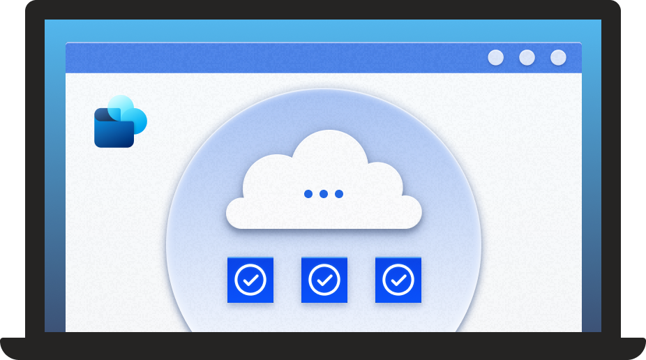
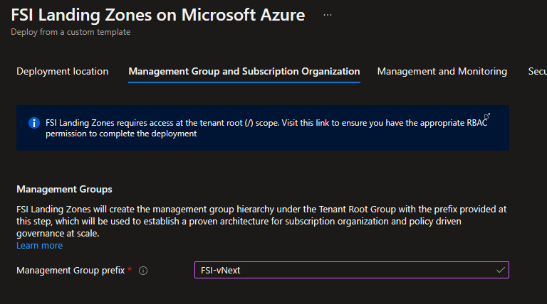
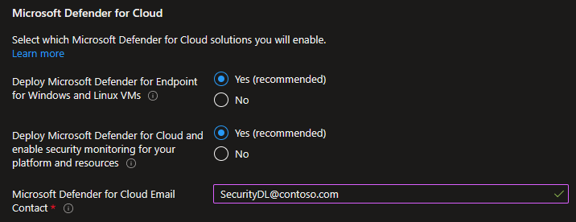
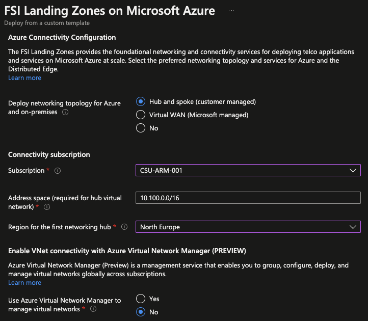
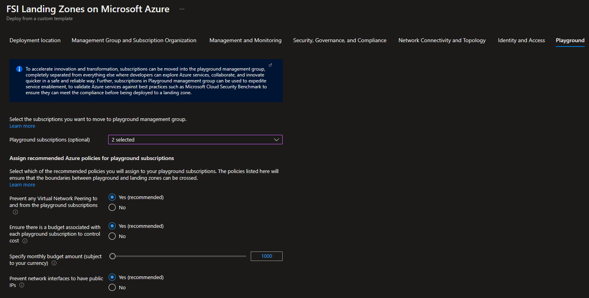

# Financial Services Industry (FSI) Landing Zones on Microsoft Azure - User Guide


This user guide explains the FSI Landing Zones on Microsoft Azure reference implementation, what it is, what it does, and how FSI organizations can use this as a starting point in their tenant - both for greenfield and brownfield deployments, to achieve a secure-by-default, and scalable Azure platform and landing zones regardless of their scale-point.

> Note: This reference implementation has been developed, validated, and proven with several of Microsoft's largest FSI customers, and represent the best practices for the FSI industry to accelerate a safe and secure digital transformation for the organization as a whole on Microsoft Azure. We will continue to enhance and develop the reference implementation alongside with the overall Azure roadmap, based on proven and validated design patterns with FSI customers at scale.

## Table of Contents

- [What is FSI Landing Zones on Microsoft Azure reference implementation?](#what-is-fsi-landing-zones-on-microsoft-azure-reference-implementation)
- [Pricing](#pricing)
- [What if I already have an existing Azure footprint?](#what-if-i-already-have-an-existing-azure-footprint)
- [How FSI Landing Zones reference implementation works](#how-FSI-landing-zones-reference-implementation-works)
- [Deployment instructions](#deployment-instructions)
  - [Pre-requisites](#pre-requisites)
  - [Step-by-step guidance](#step-by-step-guidance)
- [Next steps](#next-steps)

---

FSI Landing Zones on Microsoft Azure reference implementation provides prescriptive guidance coupled with Azure best practices for the financial services industry, and it follows 5 design principles across the 8 critical design areas for organizations to define their target state for their Azure architecture.

>Note: To read and learn about the architecture and design, please visit this [article](../docs/architectureAndDesign.md).

The reference architecture is modular by design and allows organizations of any size in the financial services industry to start with the optimized landing zones that support their banking workloads, and application portfolios.

In particular, it enables the organizations to start as small as needed and scale alongside their business requirements regardless of scale point.



## What is FSI Landing Zones on Microsoft Azure reference implementation?

The FSI Landing Zones reference implementation is an optimized, proven, authoritative, and roadmap aligned architecture that enables the financial services industry to deploy mission-critical, secure-by-default workloads in Azure at scale.

The reference implementation ties together all the Azure platform primitives and creates a proven, well-defined Azure architecture based on a multi-subscription design, leveraging native platform capabilities to simplify the operations of the platform as well as the landing zones containing the workloads.

## Pricing

There’s no cost associated with the reference implementation itself, as it is just an architecture that is constructed using existing Azure products and services. Therefore you only pay for the Azure products and services that you choose to enable, and also the products and services your organization will deploy into the landing zones for your workloads.

For example, you don’t pay for the Management Groups or the Azure Policies that are being assigned, but assigning a policy to enable Microsoft Defender for Cloud (previously known as Azure Security Center Standard) on all landing zone subscriptions will generate cost on those subscriptions for the Microsoft Defender for Cloud service as detailed [here](https://azure.microsoft.com/pricing/details/azure-defender/).

## What if I already have an existing Azure footprint?

FSI Landing Zones reference implementation will meet the organizations in the financial services industry where they are, and the design has catered for existing subscriptions and workloads in Azure.

See the following [generic guidance](https://docs.microsoft.com/en-us/azure/cloud-adoption-framework/ready/enterprise-scale/transition) to learn more how you can transition into an Azure architecture based on a multi-subscription design with clear separation of platform and landing zones, such as FSI Landing Zones on Microsoft Azure.

## How FSI Landing Zones reference implementation works

This section describes at a high level how FSI Landing Zones reference implementation works. Your landing zones are the output of a multi-subscription environment for all your Azure services, where compliance, guardrails, security, networking, and identity is provided at scale by the platform.

### FSI Landing Zones architecture

The Management Group structure implemented with FSI Landing Zones on Microsoft Azure is with clear intention to streamline and optimize operational excellence with security and governance being front and center. It caters for the entire life-cycle of a subscription, provides clear separation of concerns with regards to platform resources, and workload resources inside the landing zones.

The following structure is being created when deploying FSI Landing Zones on Microsoft Azure, and enables organizations to transition existing subscription into the target architecture, as well as being the ideal starting point for FSI organizations who are new to Azure.


- **Intermediate Management Group** (directly under the tenant root group) is created with a prefix provided by the organization, which purposely will avoid the usage of the root group to allow organizations to move existing Azure subscriptions into the hierarchy, and also enables future scenarios. This Management Group is parent to all the other Management Groups created by FSI Landing Zones

- **Platform:** This Management Group contains all the *platform* child Management Groups, such as Management, Connectivity, and Identity. Common Azure Policies for the entire platform is assigned at this level

- **Management:** This Management Group contains the dedicated subscription for management, monitoring, and security, which will host Azure Log Analytics, Azure Automation, Azure Storage Account for NSG Flow Logs, and Microsoft Sentinel. Specific Azure policies are assigned to harden and manage the resources in the management subscription.

- **Connectivity:** This Management Group contains the dedicated subscription for connectivity for Azure platform and Distributed Edge, which will host the Azure networking resources required for the platform, such as Azure Virtual WAN/Virtual Network for the hub, Azure Firewall, DNS Private Zones, Express Route circuits, ExpressRoute/VPN Gateways etc among others. Specific Azure policies are assigned to harden and manage the resources in the connectivity subscription. For typical scale-out scenarios for the FSI industry, additional connectivity subscriptions can be added and brought to compliant state in an autonomous fashion due to the policy driven guardrails design principle.

- **Identity:** This Management Group contains the dedicated subscription for identity, which is a placeholder for Windows Server Active Directory Domain Services (AD DS) VMs, or Azure Active Directory Domain Services to enable AuthN/AuthZ for workloads within the landing zones. Specific Azure policies are assigned to harden and manage the resources in the identity subscription.

- **Landing Zones:** This is the parent Management Group for all the landing zone subscriptions and will have workload agnostic Azure Policies assigned to ensure workloads are secure and compliant.

- **** This is the dedicated Management Group for landing zones, which are optimized and governed aligned with migration scenarios, net-new development using PaaS services, as well as mission-critical banking workloads. An application team request as many subscriptions as they want into the various landing zones, and will be responsible for development, testing, and production. From a platform perspective, each subscription is treated equally (i.e., everything is treated as production) to reduce friction in deployment, operations, and overall continuous compliance.

- **Online:** This is the dedicated Management Group for Online landing zones, meaning workloads that may require direct internet inbound/outbound connectivity or also for workloads that may not require a VNet.

- **Corp:** This is the dedicated Management Group for Corp landing zones, meaning workloads that requires connectivity/hybrid connectivity with the corporate network thru the hub in the connectivity subscription.

- **Playground:** This is the dedicated Management Group for subscriptions that will solely be used for testing and exploration by anyone in the organization that want to explore Azure services. Further, subscriptions placed in this management group can be leveraged to expedite service enablement for an FSI organization, to assess and validate Azure services with best practices such as Microsoft Cloud Security Benchmark before allowing new services to be deployed to landing zone subscriptions.

>Note: Playground will be securely isolated and disconnected from everything else within the tenant by Azure policies, be subject to an budget and cost enforcement, and is not meant to provide a path from test, dev, or production.

- **Deprecated:** This is the dedicated Management Group for landing zones that are being cancelled, which then will be moved to this Management Group before deleted by Azure after 30-60 days. Policies will ensure no further resource deployment or writes can occur on these subscriptions.

## Deployment instructions

This section will describe how to deploy FSI Landing Zones reference implementation with traditional "hub and spoke" networking topology in Azure connected to the Distributed Edge and to on-premises datacenters and branch offices.

### Pre-requisites

Since FSI Landing Zones is a complete, end-to-end setup of your Azure tenant as a whole, the user making the deployment requires the "Owner" permission at the Azure tenant root scope. The following instructions explains how a Global Admin in the Azure Active Directory can elevate himself/herself - or others to have the required permissions prior to starting the deployment.

>Note: Both the role assignment as well as the deployment is a one-off exercise, and post deployment you can remove the role assignment from the tenant root scope in Azure.

The pre-requisites requires the following:

- A user that is Global Admin in the Azure Active Directory where FSI Landing Zones will be deployed.
- Elevation of privileges of a Global Admin that will grant him/her the "User Access Administrator" role assignment at the tenant root scope.
- An explicit role assignment (Azure RBAC) made at the tenant root scope via Azure CLI or Azure PowerShell (Note: There's currently no graphical user interface to make this role assignment).

#### Elevate Access to manage Azure resources in Azure Active Directory

>Note: The pre-requisites described here is a *one off* exercise. Once the deployment has completed, permission to the tenant root ("/") can safely be removed as the user will have Owner permission at the intermediate root management group (below tenant root ("/") and tenant root management group).

1.1 Sign into the Azure portal as the user being Global Admin.

1.2 Open Azure Active Directory.

1.3 Under 'Manage', select 'Properties'.

1.4 Under 'Access management for Azure resources' set the toggle to *Yes.


Grant explicit access to the User at the tenant root scope ("/") to deploy FSI Landing Zones

You can use either Bash (Azure CLI) o1r PowerShell (Az.Resources) to create the role assignment for user that will do the deployment.

>Note: It is not required to deploy the FSI Landing Zones on Microsoft Azure as a global admin, as the role assignment in next step can be assigned to a different user/group.

Bash:

```bash
#sign into AZ CLI, this will redirect you to a web browser for authentication, if required
az login

#assign Owner role to Tenant root scope ("/") as a Owner (gets object Id of the current user (az login))
az role assignment create --scope '/' --role 'Owner' --assignee-object-id $(az ad signed-in-user show --query "objectId" --output tsv)
```

Powershell:

```powershell
#sign in to Azure from Powershell, this will redirect you to a web browser for authentication, if required
Connect-AzAccount

#get object Id of the current user (that is used above)
$user = Get-AzADUser -UserPrincipalName (Get-AzContext).Account

#assign Owner role to Tenant root scope ("/") as a User Access Administrator
New-AzRoleAssignment -Scope '/' -RoleDefinitionName 'Owner' -ObjectId $user.Id
```

> Please note: it can take up to 15 minutes for permission to propagate at tenant root scope. It is therefore recommended that you log out and log back in to refresh the token before you proceed with the deployment.*

### Optional pre-requisites

The deployment experience in Azure portal allows you to bring in existing (preferably empty) subscriptions dedicated for the platform part of the FSI Landing Zones architecture. It also allows you to bring existing subscriptions that can be used as the initial landing zones for workload deployments by one or more application teams.

## Step by step guidance

This section will explain the deployment experience and the options provided for FSI Landing Zones reference implementation.

When you click on [*Deploy to Microsoft Cloud*](https://aka.ms/fsilz), it will start the deployment experience in the Azure portal into your default Azure tenant. In case you have access to multiple tenants, ensure you are selecting the right one.

### 1 - Deployment location

On the first page, select the *Region*. This region will primarily be used to place the deployment resources in an Azure region, but also used as the initial region for some of the resources that are deployed, such as Azure Monitoring resources.

### 2 - Management Group & Subscription Organization

Provide a prefix that will be used to create the management group hierarchy and platform resources, and select if you would use dedicated subscriptions or a single subscription for platform resources (please note that dedicates subscriptions are recommended, and single platform subscription is only for PoC and testing purposes). For this scenario, select **Dedicated**.



### 3 - Security, Governance, and Compliance

On the *Security, Governance, and Compliance* tab, you will configure the core infrastructure required for all-up platform observability and security, which will be enabled at scale via Azure Policy for the entire Azure architecture as well as the landing zones to ensure continuously compliance for the Azure resources. A dedicated (and empty) subscription is required to host this infrastructure, which will be separated from other platform resources, such as networking and identity that you will configure later.


>Note: FSI Landing Zones recommends to use Microsoft Cloud Security Benchmark as a baseline for the entire architecture, and by assigning the policy initiative you will have an at-scale consumption experience of best practices that will be applied to every management group, subscription, and resources that will be deployed. Note that this is the only policy assignment that will use the policy effect of *audit* and *auditIfNotExists*. Policies that are assigned at other scopes by the deployment will use *deny* and *deployIfNotExists* to enforce goal-state and continuous compliance.

Azure Monitor is essential to capture key and critical platform and security logs into a dedicated Log Analytics workspace for the platform operations purposes.


Once you enable, you can determine the data retention (in days) and optionally enable several curated solutions that will be enabled for the workspace.
This includes:

- Agent Health solution (VM based)
- Change Tracking solution (VM based)
- Update Management solution (VM based)
- Activity Log solution (Azure subscriptions, resource logs)
- VM Insights solution (VM based)
- Service Map solution (VM based)
- SQL Assessment solution (IaaS and PaaS based)

For the Microsoft Defender for Cloud settings, you must also provide an email address in order to receive critical security notifications from Microsoft Defender for Cloud service.

Select which Defender solution you will add. Once configured, Azure Policy will ensure every subscription (existing and new) will have Defender configured for the subscription and the specific Azure services that will be created into the landing zones by application team(s)



### 4 - Network Connectivity and Topology

On the *Connectivity for Azure and Distributed Edge* tab, you will configure the core networking platform resources, such as hub virtual network, gateways (VPN and/or ExpressRoute), Azure Firewall, Private DNS Zones for Azure PaaS services, and depending on the options you selected on the *Security, Governance, and Compliance* tab, additional networking security and monitoring options will be presented, such as DDoS Protection Standard, Network Watcher, NSG Flow Logs, and Traffic Analytics.

To deploy and configure a "hub and spoke" topology, you must:

- In the *Deploy networking topology for Azure and Distributed Edge* option, select either "Hub and spoke with Azure Firewall" or "Virtual VWAN (Microsoft managed). In this guidance we will select the "Hub and spoke with Azure Firewall".
- Provide a dedicated (empty) subscription that will be used to host the requisite networking infrastructure.
- Provide the address space to be assigned to the hub virtual network
- Select an Azure region where the hub virtual network will be created
- Depending on the Azure region, you can optionally use Azure Virtual Network Manager to manage your virtual networks at scale and also enable full mesh.

 

In addition, you can configure:

- Azure Private DNS Zones for Azure PaaS services
- VPN and ExpressRoute Gateways
- If you choose to deploy either or both of these gateways, you will have the option to select the subnet to be dedicated for these resources, if you decide to deploy them as regional or zone-redundant gateways, as well as choose the right SKU based on your requirements
- If you choose to deploy Azure Firewall, you will have the option to
- Select the subnet
- Select to deploy Azure Firewall as regional or zone redundant (recommended)
- Select the Firewall SKU (Standard or Premium). It is recommended to choose the Azure Firewall [Premium](https://docs.microsoft.com/azure/firewall/premium-features) SKU if your organization requires next generation firewall capabilities such as TLS inspection or network intrusion detection and prevention system (IDPS).
- Indicate if you want to enable DNS Proxy in Azure Firewall.

For Networking security and monitoring solutions:

- DDoS Protection Standard to be enabled for the Azure platform. Enabling this will provide an option to assign requisite Azure Policy on the *landing zones* tab later.
- Network Watcher observability for the virtual networks that will be created. Enabling this will assign Azure Policy to ensure that Network Watcher will be created into all subscriptions containing a virtual network.
- NSG Flow Logs can be enabled for all Network Security Groups, and will be stored into a storage account in the dedicated subscription for *Security, Governance, and Compliance* subscription, and also in the Azure Log Analytics workspace.
- Traffic Analytics which provides a curated view of networking traffic for Azure and Distributed Edge.

 

### 5 - Identity & Access

On the *Authentication & Authorization* tab you can specify if you want to assign recommended policies to primarily secure and govern domain controllers in Azure, which will have its dedicated subscription to ensure clear separation of concerns, and to provide AuthN/AuthZ to workloads into the landing zones. You can then select which policies you want to get assigned, and you will need to provide the address space for the virtual network that will be deployed on this subscription. Please note that this virtual network will be connected to the hub virtual network via VNet peering.

If you don't need - or plan to host domain controllers in Azure for your FSI  workloads, you can select *No*. If you later want to add dedicated subscription for these purposes, you can move it manually to the 'identity' management group in the hierarchy created by FSI Landing Zones.

 

### 6 - Playground

 The Playground tab allows you to move subscriptions into the playground management group. The intention of playground is to provide subscriptions where developers and business units can experiment with Azure services in a safe and secure way, completely separated from the landing zones (production). Playground is also a good starting point for any service enablement processes within the FSI organization, to assess an Azure service from a security baseline perspective. Additionally, policies can be assigned during the setup that prevents any accidental configuration that can reach any other Azure subscription within the architecture, provides a budget baseline to control cost and spending, as well as recommended policy to prevent usage of the more expensive SKUs for Azure services.

 

### 7 - Landing Zones

On the *Landing Zones* tab, you can bring in the subscriptions you want to use initially for **, *online*, and *corp* landing zones. Each landing zone type is represented by its own child management group of the *landing zones* management group in the hierarchy, and provides different characteristics regarding networking requirements, security, policy, and availability. For each of the landing zone types, you can select the recommended Azure policies you want to assign, as well as the policies recommended for *all* landing zone types.

- Corp landing zones

For workloads that require corp connectivity, and hybrid connectivity through the central connectivity subscription for the Azure platform and Distributed Edge, can be moved/created into the *corp* management group.


- Online landing zones

For workloads that does not require corp connectivity, subscriptions can be moved/created into the *online* management group.


- Recommended Azure policies for all landing zones

By default, every recommendation is enabled, and you must explicitly opt out if you do not want to assign the recommended policies. The list of available policies will depend on configuration made earlier in the deployment experience.


### Review + create

*Review + Create* page will validate your permission and configuration before you can click deploy. Once it has been validated successfully, you can click *Create*
