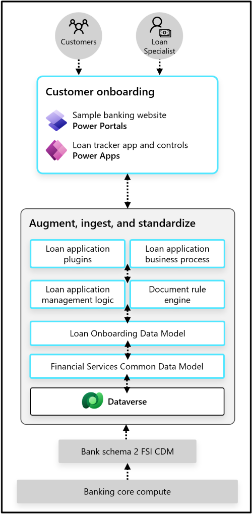

# Customer Onboarding

The Customer Onboarding capability of Microsoft Cloud for FSI provides customers with easy access loan apps and self-service tools, helping to streamline the loan process to enhance customer experience and loyalty and increase organizational and employee productivity.

Key Capabilities that Customer Onboarding provides:

**Portfolio Level loan management status monitoring:** Ability to follow the stage of each loan application from application to closure.

**Detailed and Unified Loan Dashboard:** Ability to view applicant and application details in one dashboard and manage files for each loan.

**Loan Based Drill down functionality:** Ability to select a loan to view all relevant application information, see the application timeline, and manage applicant details and documents.

Customer Onboarding consists of below D365 offering(s):

* Loan onboarding

You can deploy the solution from below.

| Reference implementation    | Description | Deploy |
|:----------------------------|:------------|--------|
| Customer Onboarding | The scenario enables customers to efficiently apply for and keep track of a loan by streamlining the application process. | |

>Note: The implementation of the Customer Onboarding solution can currently not be automated, and requires manual implementation and configuration across Solution Center, Power Platform Admin Center, and portal for Power Apps. See the [Deployment of Customer Onboarding solution](#deployment-of-customer-onboarding-solution) for  instructions.

## Prerequisites

Before you deploy and configure, verify you have implemented the [prerequisites](../../prereqs.md).

Specifically for the **Customer Onboarding** scenario, you need:

* [Power Platform environments](../../../foundations/powerPlatform/)
  * Power Platform Environment be created upfront
  * Must be created in MC4F supported regions (*As of latest update in this document, supported regions are: United States, United Kingdom  and Canada. For up-to-date information please visit [MC4F docs international availability page](https://docs.microsoft.com/industry/financial-services/availability#microsoft-cloud-for-financial-services-solutions-powered-by-dynamics-365-and-power-platform))*
  * Power Platform Environment must have Dataverse enabled
  * Power Platform Environment must have Power Apps enabled
  * Power Platform Environment must have an initial (Blank or changeable) Portal deployed (*If there will be a [sample portal deployment](#deployment-options)*) .

For further implementation if the Customer Onboarding workflows you will need also [Power Automate](https://powerautomate.microsoft.com/).

## Deployment of Customer Onboarding solution

### Deployment Options

Customer Onboarding can be deployed in three main different configuration called as additional components:

1. Including Configuration Data for Loan Onboarding
1. Including Sample Loan Onboarding Portal (a customizable self service platform UI)
1. Including the Sample Loan Onboarding Data.

If you're deploying the solution for the first time, make sure you select the Configuration Data  option for an automated configuration process. If you don't select it, you'll have to configure the solution manually, or through FastTrack. At this time, no content is available yet to help you manually configure the solutions.

The deployment with sample data is optional, can be considered for demo or sandbox purposes. Deployment with Sample Portal is also optional and independent from sample data. Sample Portal can be used as a reference to create actual end customer user interfaces. The sample data can only be added when deploying the solution through the solution center. There is no capability to remove the sample data. This needs to be done in the application.

### Deployment Considerations

#### Dataverse Deployment

Power Platform Environment must have Dataverse enabled, to do that,

* During initial Power Platform Environment creation switch **Yes** for  **Create a database for this environment**
* Follow **[Add a Microsoft Dataverse database](https://docs.microsoft.com/power-platform/admin/create-database)** guide for existing Power Platform Environments

#### Power Platform Portal Deployment

If the deployment options with Sample UI and Data is considered, Power Platform Environment must have an initial (Blank or used) Portal deployment. To create a new Blank Portal,

* Go to **[https://make.powerapps.com/](https://make.powerapps.com/)** and log in with your credentials.
* From **+ Create** menu select **Blank App**
* From pop-up window select **Blank website** and fill in the necessary information requested on **Portal from blank** form and click **Create**.
* After the deployment of the module you need to reconfigure the portal binding to **Retail Banking Sample Portal** from **Portal Details** and then **restart** the portal from **Portal Actions**. This process is clearly described [here in the docs](https://docs.microsoft.com/dynamics365/industry/financial-services/configure-sample-portal).

*Portal creation may take a while, if you came to that step from the solution center deployment interface, **Configure pre-deployment dependencies** blade, **Re-check dependencies** option may not refresh your dependency status correctly depending on the time spend, you may need to go back in the wizard and come back*

## Access of Customer Onboarding solution

For details on how to grant users access to an environment you can follow [this guidance](https://docs.microsoft.com/power-platform/admin/add-users-to-environment). For details about security roles, you can follow [this guidance](https://docs.microsoft.com/power-platform/admin/database-security).

### Design considerations

* The retail banking data model is a standalone option for partners and Dataverse customers. It's already included in Microsoft Cloud for Financial Services. Customer onboarding solution comes with its own set of tables from [loan onboarding data model](https://docs.microsoft.com/common-data-model/schema/core/industrycommon/financialservices/loanonboardingdatamodel/overview) but if you  need a broader integration the financial services data model which is not a requirement for Customer Onboarding solution, this has its own deployment process. For more information about deploying the Financial Services Retail Banking  data model, go to [Deploy the Retail banking data model (optional)](https://docs.microsoft.com/dynamics365/industry/financial-services/deploy-data-model).

### Design recommendations

* Ensure user/group mapping for the requisite licenses are done before deploying the solutions to Power Platform.
* Ensure appropriate RBAC is assigned to the Security group for the dedicated Environment for Finance in Power Platform, ideally as part of the Environment creation process.
* Any type of additional reporting or dashboard building should be planned within Azure utilizing [Azure Synapse Link for Dataverse](https://docs.microsoft.com/powerapps/maker/data-platform/azure-synapse-link-synapse)

---

[Back to documentation root](../../../README.md)
