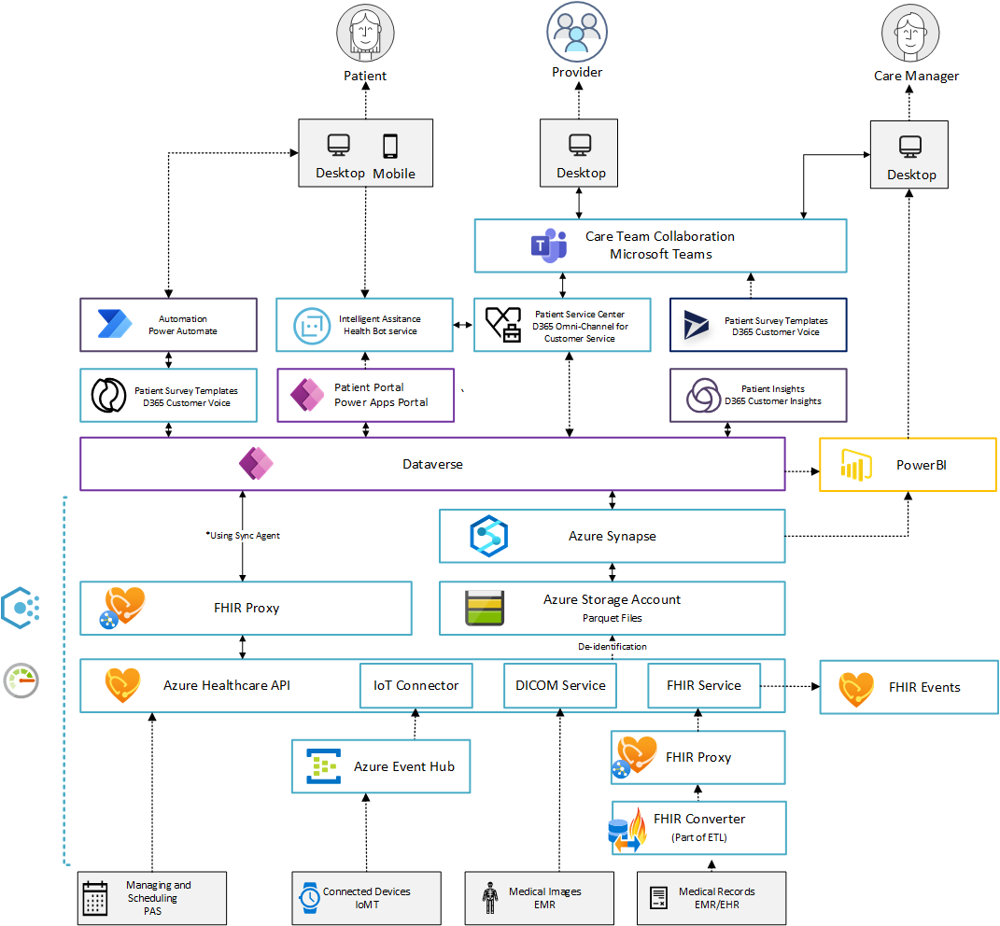

# Healthcare

In the overall architecture for Microsoft Cloud for Healthcare, the Healthcare APIs components together with the FHIR Sync Agent enable organizations to use standards based data models e.g. Fast Healthcare Interoperability Resources (FHIR) standards frameworks and simplifies data synchronization between Azure and Microsoft Dataverse in the Power Platform.

| Industry Architecture | Description | Deploy | Documentation
|:----------------------|:------------|--------|--------------|
| Azure for Healthcare | Azure for Healthcare foundation that provides a full, rich, compliant architecture which caters for highly regulated landing zones for Healthcare industry scenarios | | [User Guide](./referenceImplementation/readme.md)
| Azure Healthcare APIs | Reference implementation for Healthcare APIs | | [User Guide](./referenceImplementation/readme.md)
| Healthcare Analytics | Reference implementation for data and analytics specifically for Healthcare industry | | [User Guide](./referenceImplementation/readme.md)

## Known issues

> - Existing storage account and existing workspace is currently not mapped
> - Container for storage account must be created post deployment (will be fixed shortly)
> - FHIR sync agent is coming shortly
> - FHIR proxy is coming shortly