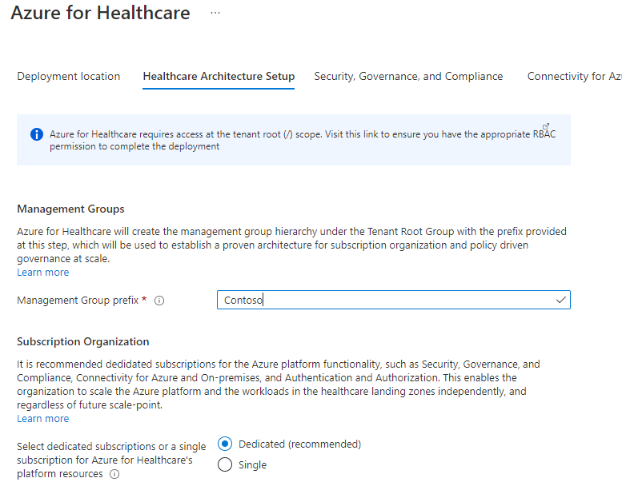
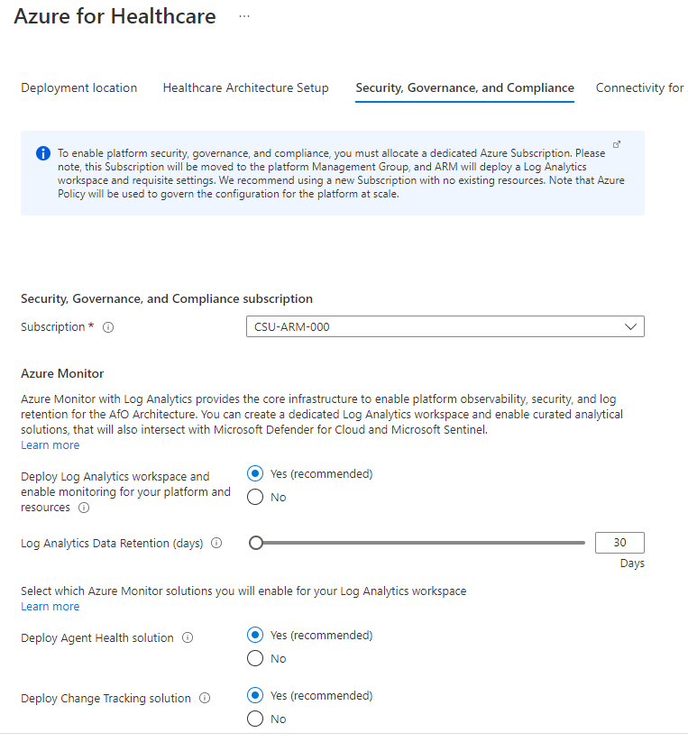
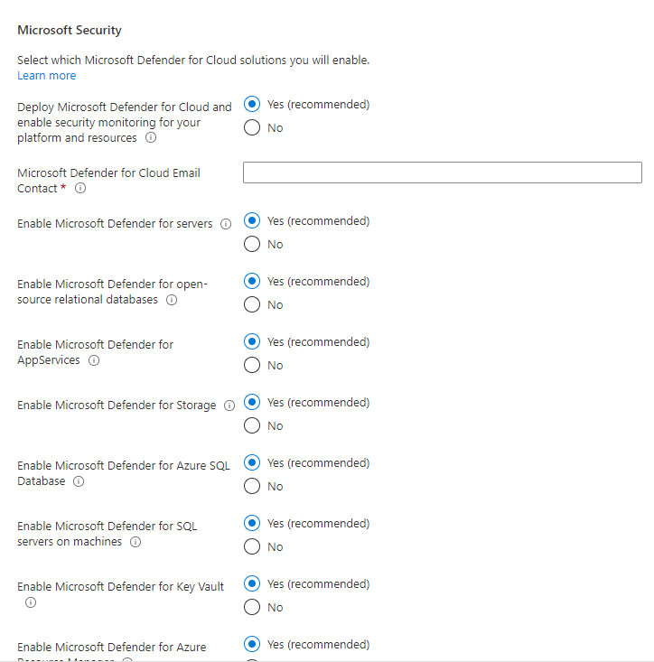
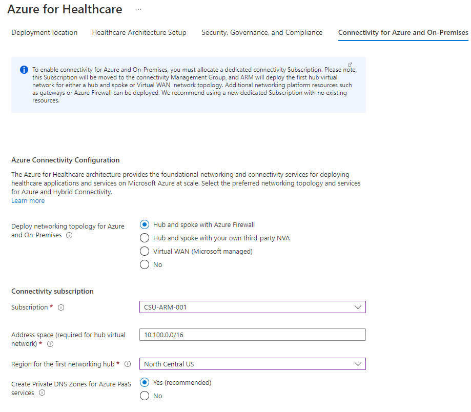
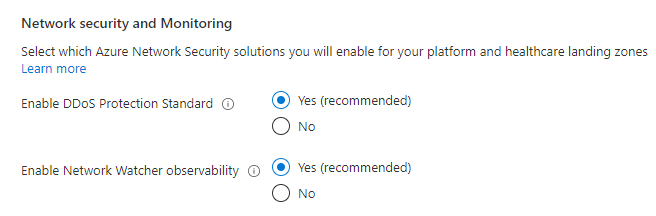
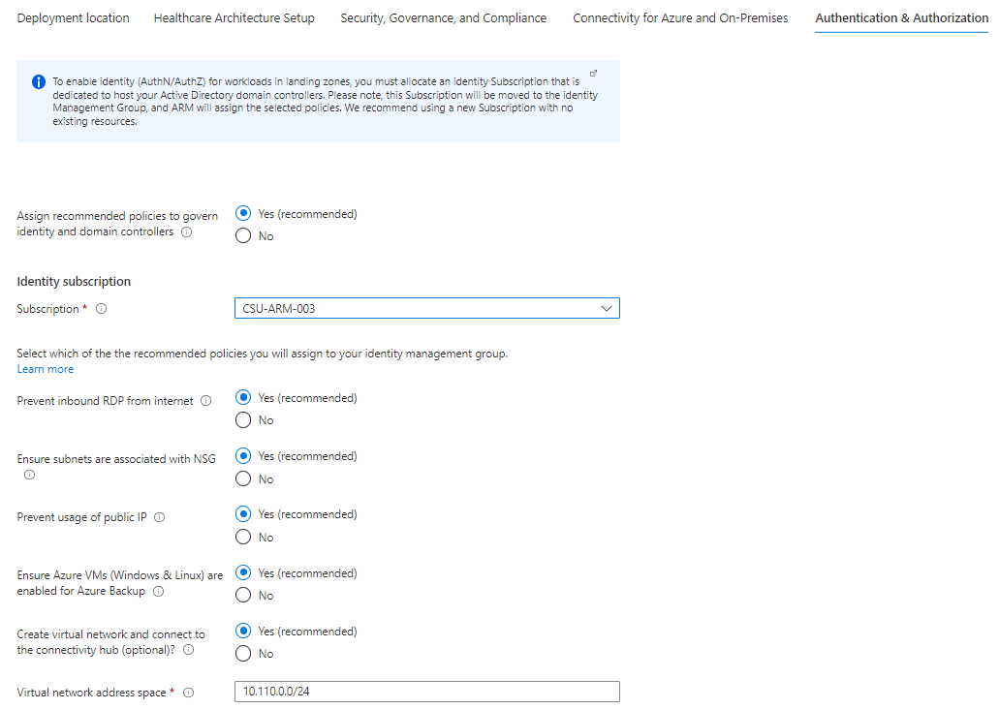
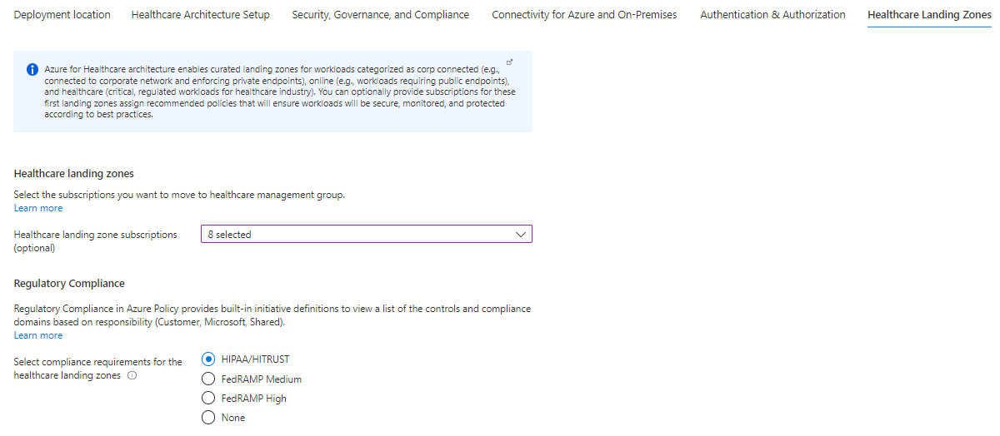
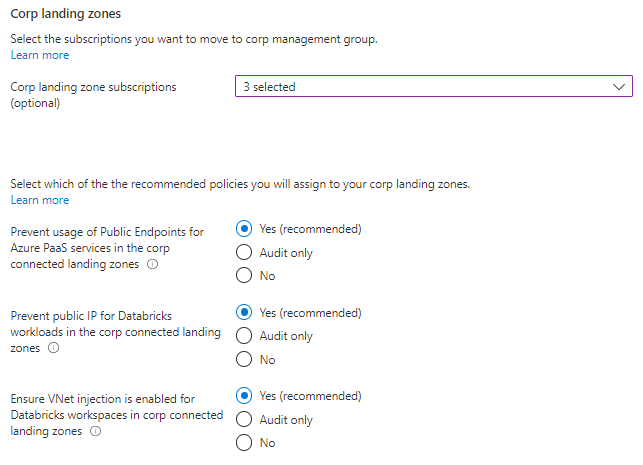
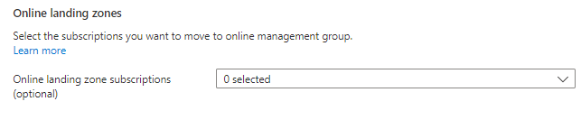
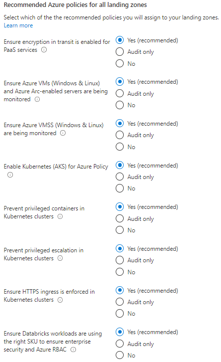

# Azure for Healthcare User Guide

This user guide explains the Azure for Healthcare reference implementation, what it is, what it does, how organizations within the healthcare industry can use it to run their workloads on a sustainable, scalable, secure, and compliant Azure architecture.

## Table of Contents

- [What is Azure for Healthcare industry reference implementation?](#what-is-azure-for-healthcare-reference-implementation)
- [Pricing](#pricing)
- [What if I already have an existing Azure footprint?](#what-if-i-already-have-an-existing-azure-footprint)
- [How Azure for Healthcare reference implementation works](#how-azure-for-healthcare-reference-implementation-works)
  - [Azure for Healthcare design principles](#azure-for-healthcare-design-principles)
    - [Subscription Democratization](#subscription-democratization)
    - [Policy Driven Governance](#policy-driven-governance)
    - [Single Control and Management Plane](#single-control-and-management-plane)
    - [Application Centric and Archetype-neutral](#application-centric-and-archetype-neutral)
    - [Azure native design and aligned with platform roadmap](#application-native-design-and-aligned-with-platform-roadmap)
  - [Separating platform and healthcare landing zones](#separating-platform-and-healthcare-landing-zones)
    - [Platform responsibilities and functions](#platform-responsibilities-and-functions)
    - [Healthcare landing zone owners responsibilities](#healthcare-landing-zone-owners-responsibilities)
  - [Azure for Healthcare Management Group Structure](#azure-for-Healthcare-management-group-structure)
  - [What happens when you deploy Azure for Healthcare](#what-happens-when-you-deploy-azure-for-Healthcare)
- [Deployment instructions](#deployment-instructions)
  - [Pre-requisites](#pre-requisites)
  - [Step-by-step guidance](#step-by-step-guidance)

---
Azure for Healthcare industry reference architecture provides prescriptive guidance coupled with Azure best practices for the healthcare industry, and it follows 5 design principles across the 8 critical design areas for organizations to define their target state for their Azure architecture.

The reference architecture is modular by design and allows organizations of any size in the healthcare industry to start with the optimized landing zones that support their healthcare workloads, and application portfolios.

In particular, it enables the organizations to start as small as needed and scale alongside their business requirements regardless of scale point.

<!---->

## What is Azure for Healthcare reference implementation

The Azure for Healthcare industry reference implementation is an optimized, proven, authoritative, and roadmap aligned architecture that enables the Healthcare industry to deploy highly regulated healthcare workloads in Azure at scale.

The reference implementation ties together all the Azure platform primitives and creates a proven, well-defined Azure architecture based on a multi-subscription design, leveraging native platform capabilities to ensure organizations in the healthcare industry can create and operationalize their healthcare landing zones in Azure at scale.

## Pricing

There’s no cost associated with the reference implementation itself, as it is just an architecture that is constructed using existing Azure products and services. Therefore you only pay for the Azure products and services that you choose to enable, and also the products and services your organization will deploy into the healthcare landing zones for your workloads.

For example, you don’t pay for the Management Groups or the Azure Policies that are being assigned, but assigning a policy to enable Microsoft Defender for Cloud (previously known as Azure Security Center Standard) on all landing zone subscriptions will generate cost on those subscriptions for the Microsoft Defender for Cloud service as detailed [here](https://azure.microsoft.com/pricing/details/azure-defender/).

## What if I already have an existing Azure footprint

Azure for Healthcare industry reference implementation will meet the organizations in the Healthcare industry where they are, and the design has catered for existing subscriptions and workloads in Azure.

See the following [article](https://docs.microsoft.com/en-us/azure/cloud-adoption-framework/ready/enterprise-scale/transition) to learn more how you can transition into an Azure architecture based on a multi-subscription design with clear separation of platform and landing zones, such as Azure for Healthcare.

## How Azure for Healthcare reference implementation works

This section describes at a high level how Azure for Healthcare reference implementation works. Your healthcare landing zones are the output of a multi-subscription environment for all your Azure services, where compliance, guardrails, security, networking, and identity is provided at scale by the platform.

## Azure for Healthcare design principles

The Azure for Healthcare architecture prescribed in this guidance is based on the design principles described here. These principles serve as a compass for subsequent design decisions across critical technical domains. Familiarize yourself with these principles to better understand their impact and the trade-offs associated with nonadherence, and how them will help you to scale in alignment with the Azure product roadmap.

>Note: The design principles for Azure are by design industry agnostic, and applies to all industries. For more details about architecture and design methodologies for Microsoft Clouds, see [this article](../../foundations/README.md).

### Subscription Democratization

Subscriptions should be used as a unit of management and scale aligned with business needs and priorities to support business areas and portfolio owners to accelerate application migrations and new application development. Subscriptions should be provided to business units to support the design, development, and testing and deployment of new workloads and migration of existing workloads.

### Policy Driven Governance

Azure Policy should be used to provide guardrails and ensure continued compliance with your organization's platform, along with the applications deployed onto it. Azure Policy also provides application owners with sufficient freedom and a secure unhindered path to the cloud.

### Single Control and Management Plane

Azure for Healthcare architecture shouldn't consider any abstraction layers, such as customer-developed portals or tooling. It should provide a consistent experience for both AppOps (centrally managed operation teams) and DevOps (dedicated application operation teams). Azure provides a unified and consistent control plane across all Azure resources and provisioning channels subject to role-based access and policy-driven controls. Azure can be used to establish a standardized set of policies and controls for governing the entire enterprise application estate in the cloud.

### Application Centric and Archetype-neutral

Azure for Healthcare architecture should focus on application-centric migrations and development rather than pure infrastructure lift-and-shift migrations, such as moving virtual machines. It shouldn't differentiate between old and new applications, infrastructure as a service, or platform as a service applications. Ultimately, it should provide a safe and secure foundation for all application types to be deployed onto your Azure platform.

### Azure native design and aligned with platform roadmap

The Azure for Healthcare architecture approach advocates using Azure-native platform services and capabilities whenever possible. This approach should align with Azure platform roadmaps to ensure that new capabilities are available within your environments. Azure platform roadmaps should help to inform the migration strategy and Azure for Healthcare architecture trajectory.

## Separating platform and healthcare landing zones

One of the key tenets of Azure for Healthcare architecture is to have a clear separation of the Azure *platform* and the *landing zones*. This allows organizations to scale their Azure architecture alongside with their business requirements, while providing autonomy to their application teams for deploying, migrating and doing net-new development of their workloads into their landing zones. This model fully supports workload autonomy and distinguish between central and federated functions.

## Platform responsibilities and functions

Platform resource are managed by a cross-functional platform team. The team consist mainly out of the following functions. These functions working in close collaboration with the SME functions across the organization:

- PlatformOps: Responsible for management and deployment of control plane resource types such as subscriptions, management groups via IaC and the respective CI/CD pipelines. Management of the platform related identify identity resources on Azure AD and cost management for the platform.
     Operationalization of the Platform for an organization is under the responsibility of the platform function.

- SecOps: Responsible for definition and management of Azure Policy and RBAC permissions on the platform for landing zones and platform management groups and subscriptions. Security operations including monitoring and the definition and the operation of reporting and auditing dashboard.
- NetOps: Definition and management of the common networking components in Azure including the hybrid connectivity and firewall resource to control internet facing networking traffic. NetOps team is responsible to handout virtual networks to landing zone owners or team.

## Healthcare landing zone owners responsibilities

Azure for Healthcare reference implementation enables landing zones supporting a both centralized and federated application DevOps models. Most common model are dedicated **DevOps** team aligned with a single workload. In case of smaller workloads or COTS or third-party application a single **AppDevOps** team is responsible for workload operation. Independent of the model every DevOps team manages several workload staging environments (DEV, UAT, PROD) deployed to individual landing zones/subscriptions. Each landing zone has a set of RBAC permissions managed with Azure AD PIM provided by the Platform SecOps team.

When the landing zones/subscriptions are handed over to the DevOps team, the team is end-to-end responsible for the workload. They can independently operate within the security guardrails provided by the platform team. If dependency on central teams or functions are discovered, it is highly recommended to review the process and eliminated as soon as possible to unblock DevOps teams.

## Azure for Healthcare Management Group Structure

The Management Group structure implemented with Azure for Healthcare is as follows:

- **Top-level Management Group** (directly under the tenant root group) is created with a prefix provided by the organization, which purposely will avoid the usage of the root group to allow organizations to move existing Azure subscriptions into the hierarchy, and also enables future scenarios. This Management Group is parent to all the other Management Groups created by Azure for Healthcare

- **Platform:** This Management Group contains all the *platform* child Management Groups, such as Management, Connectivity, and Identity. Common Azure Policies for the entire platform is assigned at this level

  - **Management:** This Management Group contains the dedicated subscription for management, monitoring, and security, which will host Azure Log Analytics, Azure Automation, Azure Storage Account for NSG Flow Logs, and Microsoft Sentinel. Specific Azure policies are assigned to harden and manage the resources in the management subscription.

  - **Connectivity:** This Management Group contains the dedicated subscription for connectivity for Azure platform and Distributed Edge, which will host the Azure networking resources required for the platform, such as Azure Virtual WAN/Virtual Network for the hub, Azure Firewall, DNS Private Zones, Express Route circuits, ExpressRoute/VPN Gateways etc among others. Specific Azure policies are assigned to harden and manage the resources in the connectivity subscription. For typical scale-out scenarios for the Healthcare industry, additional connectivity subscriptions can be added and brought to compliant state in an autonomous fashion due to the policy driven guardrails design principle.

  - **Identity:** This Management Group contains the dedicated subscription for identity, which is a placeholder for Windows Server Active Directory Domain Services (AD DS) VMs, or Azure Active Directory Domain Services to enable AuthN/AuthZ for workloads within the landing zones. Specific Azure policies are assigned to harden and manage the resources in the identity subscription.

- **Landing Zones:** This is the parent Management Group for all the landing zone subscriptions and will have workload agnostic Azure Policies assigned to ensure workloads are secure and compliant.

  - **Healthcare** This is the dedicated Management Group for healthcare landing zones for the Healthcare workloads subject to regulatory compliance.
  - **Online:** This is the dedicated Management Group for Online landing zones, meaning workloads that may require direct internet inbound/outbound connectivity or also for workloads that may not require a VNet..
  - **Corp:** This is the dedicated Management Group for Corp landing zones, meaning workloads that requires connectivity/hybrid connectivity with the corporate network thru the hub in the connectivity subscription.

- **Sandboxes:** This is the dedicated Management Group for subscriptions that will solely be used for testing and exploration by an organization’s application teams. These subscriptions will be securely disconnected from the Corp and Online landing zones.
- **Decommissioned:** This is the dedicated Management Group for landing zones that are being cancelled, which then will be moved to this Management Group before deleted by Azure after 30-60 days.

## What happens when you deploy Azure for Healthcare reference implementation?

By default, all recommended settings and resources recommendations are enabled and deployed, and you must explicitly disable them if you don't want them to be deployed and configured. These resources and configurations include:

- A scalable Management Group hierarchy aligned to core platform capabilities, allowing you to operationalize at scale using centrally managed Azure RBAC and Azure Policy where platform and workloads have clear separation.

- Azure Policies that will enable autonomy for the platform and the landing zones.
- An Azure subscription dedicated for **Security, Governance, and Compliance**, which enables core platform capabilities at scale using Azure Policy such as:

  - A Log Analytics workspace and an Automation account
  - Microsoft Sentinel
  - Microsoft Defender for Cloud
  - Storage Account for the NSG Flow Logs setup
  - Diagnostics settings for Activity Logs, VMs, and PaaS resources sent to Log Analytics

- An Azure subscription dedicated for **Connectivity** for Azure platform networking and On-Premises connectivity, which deploys core Azure networking resources such as:

  - A hub virtual network
  - Azure Firewall
  - ExpressRoute Gateway
  - VPN Gateway
  - Azure Private DNS Zones for Private Link

- In addition, network security monitoring can be enabled which includes:

  - Enable DDoS Standard protection
  - Network Watcher
  - NSG Flow Logs
  
- (Optionally) An Azure subscription dedicated for **Identity** in case your organization requires to have Active Directory Domain Controllers to provide authorization and authentication for workloads deployed into the landing zones.

- Landing Zone Management Group for **Healthcare** for regulated healthcare applications that has unique requirements for security, governance, compliance, and connectivity.
  - This is where you will create your subscriptions that will host your healthcare workloads.

- Landing Zone Management Group for **Corp** connected applications that require connectivity to on-premises, to other landing zones or to the internet via shared services provided in the hub virtual network.
  - This is where you will create your subscriptions that will host your corp-connected workloads.

- Landing Zone Management Group for **Online** applications that will be internet-facing, where a virtual network is optional and hybrid connectivity is not required.
  - This is where you will create your Subscriptions that will host your online workloads.

- Landing zone subscriptions for Azure native, internet-facing **Online** applications and resources.

- Landing zone subscriptions for **Healthcare** for regulated healthcare applications and resources.
- Azure Policies for healthcare landing zones, which include:
  - Enable particular regulatory compliance, such as FedRAMP Medium, FedRAMP High, or HIPAA/HITRUST. This will enable at-scale compliance reporting for all your healthcare application and resources.

- Landing zone subscriptions for **Corp** connected applications and resources, including a virtual network that will be connected to the hub via VNet peering.
- Azure Policies for online and corp-connected landing zones, which include:
  - Enforce VM monitoring (Windows & Linux)
  - Enforce VMSS monitoring (Windows & Linux)
  - Enforce Azure Arc VM monitoring (Windows & Linux)
  - Enforce DDoS on Virtual Networks
  - Enforce VM backup (Windows & Linux)
  - Enforce secure access (HTTPS) to storage accounts
  - Enforce auditing for Azure SQL
  - Enforce encryption for Azure SQL
  - Prevent IP forwarding
  - Prevent inbound RDP from internet
  - Ensure subnets are associated with Network Security Groups
  - Ensure subnets are associated with User-Defined routes

## Deployment instructions

This section will describe how to deploy Azure for Healthcare industry reference implementation with traditional "hub and spoke" networking topology in Azure connected to the Distributed Edge and to on-premises datacenters and branch offices.

### Pre-requisites

Since Azure for Healthcare is a complete, end-to-end setup of your Azure tenant as a whole, the user making the deployment requires the "Owner" permission at the Azure tenant root scope. The following instructions explains how a Global Admin in the Azure Active Directory can elevate himself/herself - or others to have the required permissions prior to starting the deployment.

>Note: Both the role assignment as well as the deployment is a one-off exercise, and post deployment you can remove the role assignment from the tenant root scope in Azure.

The pre-requisites requires the following:

- A user that is Global Admin in the Azure Active Directory where Azure for Healthcare will be deployed.
- Elevation of privileges of a Global Admin that will grant him/her the "User Access Administrator" role assignment at the tenant root scope.
- An explicit role assignment (Azure RBAC) made at the tenant root scope via Azure CLI or Azure PowerShell (Note: There's currently no graphical user interface to make this role assignment).

#### Elevate Access to manage Azure resources in the directory

1.1 Sign into the Azure portal as the user being Global Admin.

1.2 Open Azure Active Directory.

1.3 Under 'Manage', select 'Properties'.


1.4 Under 'Access management for Azure resources' set the toggle to *Yes.


Grant explicit access to the User at the tenant root scope ("/") to deploy Azure for Healthcare

You can use either Bash (Azure CLI) or PowerShell (Az.Resources) to create the role assignment for user that will do the deployment.

Bash:

```bash
#sign  into AZ CLI, this will redirect you to a web browser for authentication, if required
az login

#assign Owner role to Tenant root scope  ("/") as a Owner (gets object Id of the current user (az login))
az role assignment create --scope '/'  --role 'Owner' --assignee-object-id $(az ad signed-in-user show --query "objectId" --output tsv)
```

Powershell:

```powershell
#sign in to Azure  from Powershell, this will redirect you to a web browser for authentication, if required
Connect-AzAccount

#get object Id of  the current user (that is used above)
$user = Get-AzADUser -UserPrincipalName (Get-AzContext).Account

#assign Owner  role to Tenant root scope ("/") as a User Access Administrator
New-AzRoleAssignment -Scope '/' -RoleDefinitionName 'Owner' -ObjectId $user.Id
```

> Please note: it can take up to 15 minutes for permission to propagate at tenant root scope. It is therefore recommended that you log out and log back in to refresh the token before you proceed with the deployment.*

### Optional pre-requisites

The deployment experience in Azure portal allows you to bring in existing (preferably empty) subscriptions dedicated for the platform part of the Azure for Healthcare architecture. It also allows you to bring existing subscriptions that can be used as the initial healthcare landing zones for your healthcare workloads.

## Step by step guidance

This section will explain the deployment experience and the options provided for Azure for Healthcare reference implementation.

When you click on [*Deploy to Microsoft Cloud*](https://aka.ms/afhRi), it will start the deployment experience in the Azure portal into your default Azure tenant. In case you have access to multiple tenants, ensure you are selecting the right one.

### Deployment location

On the first page, select the *Region*. This region will primarily be used to place the deployment resources in an Azure region, but also used as the initial region for some of the resources that are deployed, such as Azure Monitoring resources.

### Healthcare Architecture setup

Provide a prefix that will be used to create the management group hierarchy and platform resources, and select if you would use dedicated subscriptions or a single subscription for platform resources (please note that dedicates subscriptions are recommended, and single platform subscription is only for PoC and testing purposes). For this scenario, select **Dedicated**.



### Security, Governance, and Compliance

On the *Security, Governance, and Compliance* tab, you will configure the core infrastructure required for all-up platform observability and security, which will be enabled at scale via Azure Policy for the entire Azure architecture as well as the healthcare landing zones to ensure continuously compliance for the Azure resources. A dedicated (and empty) subscription is required to host this infrastructure, which will be separated from other platform resources, such as networking and identity that you will configure later.



For the Microsoft Defender for Cloud settings, you must also provide an email address in order to receive critical security notifications from Microsoft Defender for Cloud service.



### Connectivity for Azure and On-Premises

On the *Connectivity for Azure and On-Premises* tab, you will configure the core networking platform resources, such as hub virtual network, gateways (VPN and/or ExpressRoute), Azure Firewall, Private DNS Zones for Azure PaaS services, and depending on the options you selected on the *Security, Governance, and Compliance* tab, additional networking security and monitoring options will be presented, such as DDoS Protection Standard and Network Watcher.

To deploy and configure a "hub and spoke" topology, you must:

- In the *Deploy networking topology for Azure and On-Premises* option, select either "Hub and spoke with Azure Firewall" or "Hub and spoke with your own third-party NVA". In this guidance we will select the "Hub and spoke with Azure Firewall".
- Provide a dedicated (empty) subscription that will be used to host the requisite networking infrastructure.
- Provide the address space to be assigned to the hub virtual network
- Select an Azure region where the hub virtual network will be created

 

In addition, you can configure:

- Azure Private DNS Zones for Azure PaaS services
- VPN and ExpressRoute Gateways
  - If you choose to deploy either or both of these gateways, you will have the option to select the subnet to be dedicated for these resources, if you decide to deploy them as regional or zone-redundant gateways, as well as choose the right SKU based on your requirements
- If you choose to deploy Azure Firewall, you will have the option to
  - Select the subnet
  - Select to deploy Azure Firewall as regional or zone redundant (recommended)
  - Select the Firewall SKU (Standard or Premium). It is recommended to choose the Azure Firewall [Premium](https://docs.microsoft.com/azure/firewall/premium-features) SKU if your organization requires next generation firewall capabilities such as TLS inspection or network intrusion detection and prevention system (IDPS).
  - Indicate if you want to enable DNS Proxy in Azure Firewall.

For Networking security and monitoring solutions:

- DDoS Protection Standard to be enabled for the Azure platform. Enabling this will provide an option to assign requisite Azure Policy on the *healthcare landing zones* tab later.
- Network Watcher observability for the virtual networks that will be created. Enabling this will assign Azure Policy to ensure that Network Watcher will be created into all subscriptions containing a virtual network.

 

### Authentication & Authorization

On the *Authentication & Authorization* tab you can specify if you want to assign recommended policies to primarily secure and govern domain controllers in Azure, which will have its dedicated subscription to ensure clear separation of concerns, and to provide AuthN/AuthZ to workloads into the landing zones. You can then select which policies you want to get assigned, and you will need to provide the address space for the virtual network that will be deployed on this subscription. Please note that this virtual network will be connected to the hub virtual network via VNet peering.

If you don't need - or plan to host domain controllers in Azure for your Healthcare workloads, you can select *No*. If you later want to add dedicated subscription for these purposes, you can move it manually to the 'identity' management group in the hierarchy created by Azure for Healthcare.

 

### healthcare Landing Zones

On the *healthcare Landing Zones* tab, you can bring in the subscriptions you want to use initially for *healthcare*, *online*, and *corp* landing zones. Each landing zone type is represented by its own child management group of the *landing zones* management group in the hierarchy, and provides different characteristics regarding networking requirements, security, policy, and availability. For each of the landing zone types, you can select the recommended Azure policies you want to assign, as well as the policies recommended for *all* landing zone types.

- Healthcare landing zones

Subscriptions can be moved into the *healthcare* management group, and bootstrapped with Azure policies that are assigned directly to this management group, as well as the overarching policies assigned to the intermediate root management group, and the landing zones management group.
The specific policies for the healthcare landing zones will conform to the healthcare industry regulatory compliance.



- Corp landing zones

For workloads that require corp connectivity, and hybrid connectivity through the central connectivity subscription for the Azure platform and Distributed Edge, can be moved/created into the *corp* management group.



- Online landing zones

For workloads that does not require corp connectivity, subscriptions can be moved/created into the *online* management group.



- Recommended Azure policies for all landing zones

By default, every recommendation is enabled, and you must explicitly opt out if you do not want to assign the recommended policies. The list of available policies will depend on configuration made earlier in the deployment experience.



### Review + create

*Review + Create* page will validate your permission and configuration before you can click deploy. Once it has been validated successfully, you can click *Create*

---

[Back to documentation root](../README.md)
