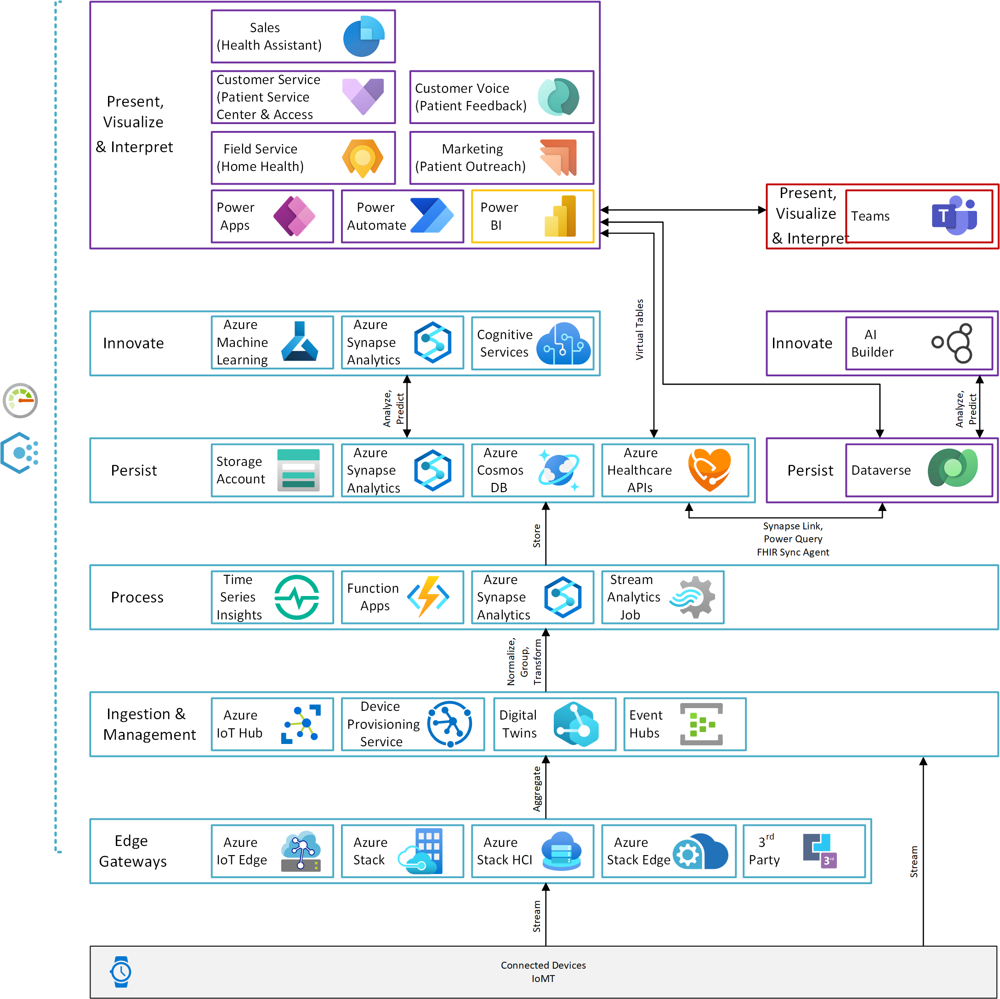

# Internet of Medical Things

Internet of Medical Things (IoMT) focusses on the practical application of IoT in the area of healthcare. In IoMT scenarios medical data is collected and sometime pre-processed through the means of internet Connected medical devices and then sent to a datacenter in (near) real-time. The data can then be used for various data-driven applications and use-cases including:

- The prediction of medical states and incidents for device users as well as healthcare providers.
- Allowing healthcare professional to remotely monitor patients' key biometrics in (near) real-time.
- Shorter time to diagnosis, because of more efficient and quick data exchange, asynchronous analysis of datasets and analysis of medical data, before impactful medical incidents take place. No in-person visits required.

Classical IoT as well as IoMT scenarios share similar architectures. The most significant differences can be identified on the application and data-driven use-case level. Analytics and Data Science use-cases in the healthcare industry can differ vastly from other industry scenarios. Also, there is a higher emphasis on the security aspect in the IoMT space and the compliance with legal regulations and standards, because often personal identifiable information (PII) gets processed that is highly sensible. Additional security mechanisms on the network, identity and data layer need to be established to secure the data and only grant access to individual data points. In the next paragraphs, we will look at the various layers of an IoMT architecture.

| Reference implementation | Description | Deploy |
|:-------------------------|:------------|--------|
| IoMT                     | IoMT scenario for integration, analysis and visualization of healthcare data. | |

## Prerequisites

Before you deploy and configure, verify you have implemented the [prerequisites](../../prereqs.md).

Specifically for IoMT, you need:

* [Power Platform environments](../powerPlatform/)
  * Must be created upfront, in United States with Dataverse and D365 Apps enabled
  * Dynamics 365 application dependency: Dynamics 365 Field Service License, Microsoft Cloud for Healthcare License

## IoMT Architecture

The architecture diagram depicts a typical IoMT scenario, where practical-connected devices collect protected health information (PHI) of patients and then transmit the data points over one or multiple gateways to the cloud.

After the data has reached the Azure datacenter, data can be further processed by using tools such as Azure Functions, Azure Synapse or Azure Stream Analytics. Finally, data usually gets persisted onto one of the various data services inside Azure like Azure Cosmos DB, Azure Storage, Azure Synapse SQL Pool or Azure Healthcare APIs.

Except for the data persistence layer, the Microsoft Cloud for Healthcare does not offer any industry-specific solutions for realizing such end-to-end scenarios. Today, standard Azure services including Azure IoT Edge, Azure IoT Hub or Azure Synapse must be used by customers to realize such architectures. Only for the storage layer, the industry-specific Azure Healthcare APIs service is available, which supports standards such as Fast Healthcare Interoperability Resources (FHIR), Digital Imaging and Communications in Medicine (DICOM) and conversion of multiple other data standards into FHIR.

Due to sensitivity of the data being transmitted, security is a key factor and various kinds of regulations have to be fulfilled by companies when realizing IoMT scenarios. However, a key factor of success of such solutions depends on the use of Machine Learning and integrated Dashboards, as the sheer size of data makes it impossible to review all data points.

## Dynamics 365 Integration

Within Dynamics 365, the Microsoft Cloud for Healthcare offers a comprehensive set of solutions for the healthcare market to expedite a healthcare organization’s ability to roll out solutions. Patients, providers, and care coordinators can perform daily duties in a modern yet familiar user-interface that provides robust functionality. An overview of the ever-growing list of Dynamics 365 healthcare solutions can be found [here](https://docs.microsoft.com/en-us/dynamics365/industry/healthcare/overview).

The healthcare data model for Dynamics 365 is also based on the FHIR framework, which makes it easier for customers and partners to develop new applications without redefining the healthcare data architecture.

In order to not end up with two disparate systems and datasets, customers can make use of a FHIR synch agent to synch data points and updates between Dataverse and Azure Healthcare APIs. The synch Agent consists of two components, the FHIR Synch Agent service and the FHIR Synch Agent Administration Application. Both components are required to synch data between Azure and the Power Platform. The synch must be setup by providing few application secrets as well as Service Bus Queue propertied.

Within the FHIR Synch Agent Administration Application, administrators can define entity maps, attribute maps and expansion maps. Sync Agent Logs can be used to validate synch operations and to understand why a certain data point is sent over the services bus and why others are not.

This allows customers to leverage datasets, collected in IoMT scenarios, in Dynamics 365 to further enhance the patients experience and quality of results. Additional applications and data-driven solutions can be built to simplify the end-to-end experience for all participants and reduce the time to diagnosis.

## Planning guidelines for IoMT

This section provides prescriptive guidance with design considerations and recommendations across the critical design areas for the IoMT scenario for the teams that will deploy and manage the capabilities within the Microsoft Cloud for Healthcare.

### Identity and access

Identity and access management (IAM) is one of the core security layers in any architecture design and should be treated as the foundation of any secure and fully compliant public cloud solution. This design area examines design considerations and recommendations related to IAM in an IoTM solution. Specifically, it will look at authentication of users and identities to resources and core requirements for seperation of duties.

#### Design considerations

* The user who deploys and configures the Dynamics 365 solutions must have sufficient permissions directly on the dedicated Power Platform environment.
* To deploy the health D365 solutions, the user must have an assigned license for the Healthcare add-on.
* Different authentication mechanisms can be used to grant access to data across Azure and Power Platform.

#### Design recommendations

* Ensure user/group mapping for the requisite licenses are done before deploying the solutions to Power Platform.
* Ensure appropriate RBAC is assigned to the Security group for the dedicated Environment for Healthcare in Power Platform, ideally as part of the Environment creation process.
* Ensure that there is no standing access to the production Azure and Power Platform environment and use PIM where applicable.
* Use managed identitied and credential passthrough across all environments and use row-level security (RLS) or column-level security (CLS) to further limit visibility of data points.
* Always follow the least privilege principle to not put any patient data at risk.

### Monitoring

Monitoring and logging is critical not only from a security, but also from an observability and application monitoring standpoint. This design area is critical for defining the uptime targets and to be able to define Service Level Agreements (SLAs), Service Level Objectives (SLOs) and Service Level Indicators (SLIs). This section examines design considerations and recommendations related to monitoring in an IoTM solution. 

#### Design considerations

* Telemetry, metrics, and logs can be enabled for services across Azure, Power Platform and Microsoft 365.
* Alerts and metrics can be used to get notifications or take automated actions in case of issues or outages.
* Different telemetry solutions are available across the Microsoft Cloud.
* Application monitoring and service level indicators can be defined as monitored as part of the application design and development.

#### Design recommendations

* Use Azure Log Analytics and application insights to collect logs across Azure services, Power Platform and Microsoft 365. Use other more specific logging capabilities such as the Microsoft 365 monitoring and audit logs where necessary.
* Collect audit logs, diagnostic logs and metrics in Azure using Log Analytics, enable auditing for Power Platform environments and review audit Logs in teh Microsoft 365 compliance center and enable Microsoft 365 audit logs in the Microsoft 365 compliance center.
* Create a health model for your application and setup dashboards for monitoring and evaluation.
* Setup alerts and take automated actions to ensure a highly available application design.
* Define SLAs, SLOs and SLIs for your application across Azure, Microsoft 365 and Power Platform. Collect monitoring data and define an observability startegy to fulfill set requirements.

### Security

Security across different technical layers is another core construct for each and every application on the Microsoft cloud platform. This design area examines design considerations and recommendations related to security in an IoTM solution. Specifically, the section will look at security controls, networking, vulnerability management, encryption and keys.

#### Design considerations

* Different connectivity options are available for the respective services including public endpoints, public endpoints with service endpoints and private endpoints.
* In-transit encryption can be enforced via HTTPS and TLS.
* Data and data access can be managed in different ways and different services provide a different set of capabilities.

#### Design recommendations

* Ensure usage of Private Endpoints across all Azure services to not put patient data at risk.
* Enforce encryption of data in transit by enforcing HTTPS and TLS 1.2 connections between services.
* Use row-level security (RLS) or column-level security (CLS) to further limit visibility of data points.
* Use Power Query to securely transfer data from Azure to Dataverse.
* Use Synapse Link for Dataverse to transfer data from Dataverse to Azure.
* Access Azure services hosted with private endpoints securely using VPN, ExpressRoute or Azure Bastion.

---

[Back to documentation root](../../../README.md)