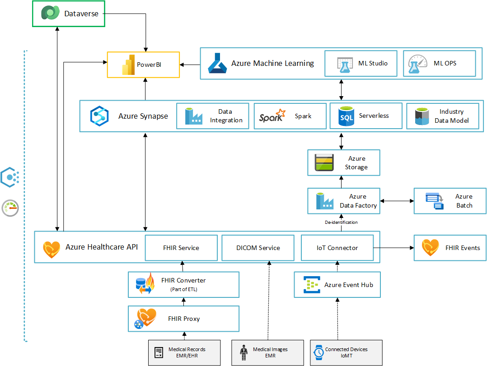
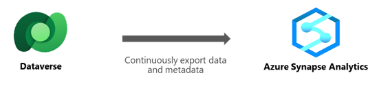
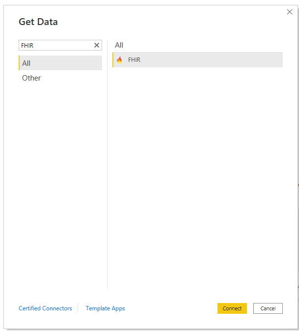
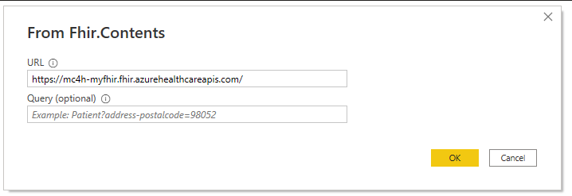
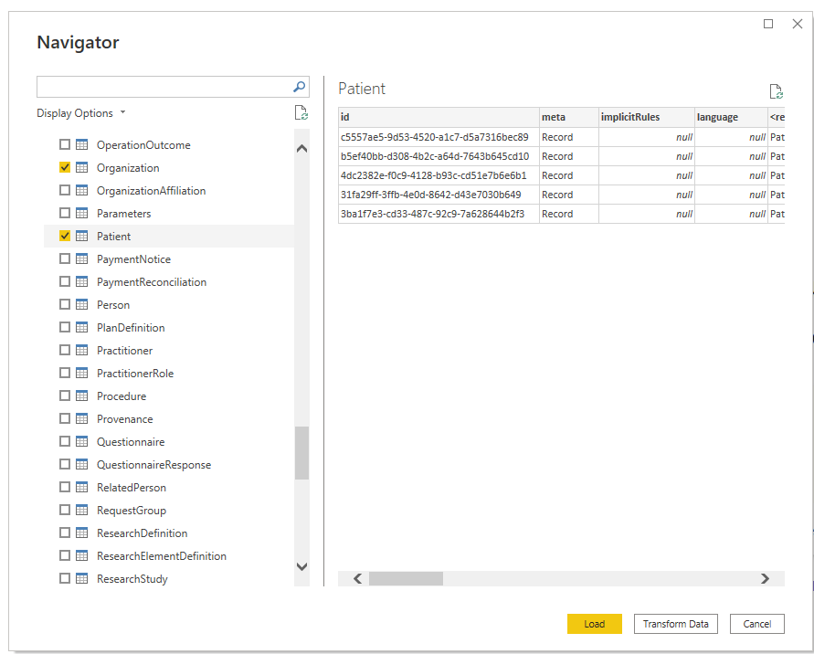
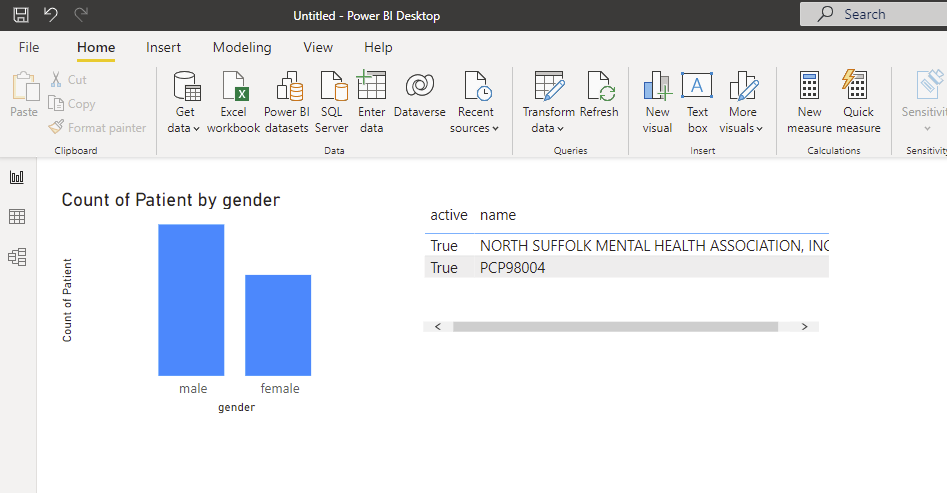
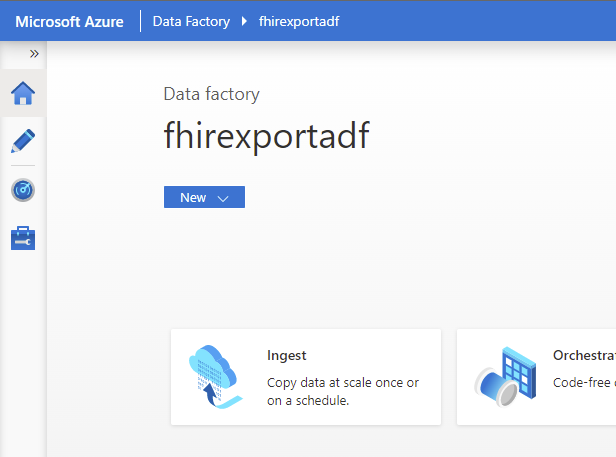
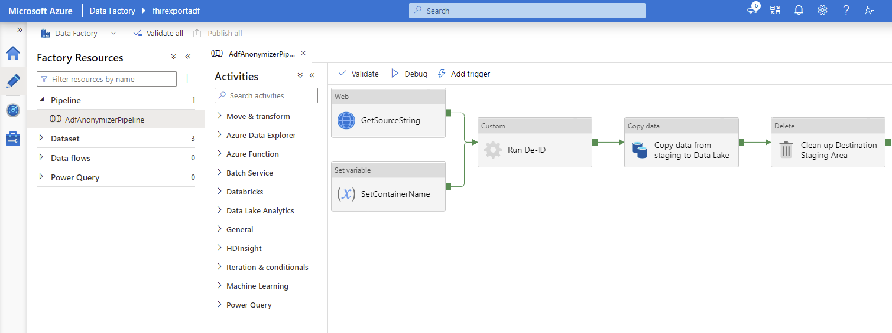

# Healthcare Analytics

The solution for Healthcare Analytics will harness data and discover insights to deliver value. In this guidance we show how you can persist data in the Healthcare API, export de-identified data to an analytical store, enable large scale analytical query capabilities and leverage insights from AI assisted imaging analysis and population health metrics to determine course of care. The analytical solution enable you to search through large amounts of data from sources like electronic medical records, smart medical devices, patient and population demographics, and the public domain to find hidden patterns and trends and predict outcomes for individual patients. The care guidance can rely on AI learning models that become more precise when additional data and cases are introduced.

Key capabilities of Healthcare Analytics include:

* **Provider Evaluation**: Reviews IoMT data, EHR and patient data.
* **Imaging AI**: DICOM images supported by an AI report, which indicates patient condition.
* **Population Health**: Leverage large datasets to compare effectiveness of different treatment options with patients of similar demographics.

| Reference implementation | Description | Deploy |
|:----------------------|:------------|--------|
| Healthcare Analytics | End-to-end deployment and configuration of analytics solution for healthcare |

## Reference architecture

## Critical design areas for healthcare Analytics

>The analytical use-cases for healthcare leverages a combination of services in Azure, Dynamics and the Power platform.

* [Prerequisites](#Prerequisites)
* [Synapse for clinical analyticsl](#Synapse-for-clinical-analytics)
* [AI and Machine Learning for clinical analytics](#AI-and-Machine-Learning-for-clinical-analytics)
* [Observability and logging](#observability-and-logging)

### Prerequisites

* **Azure platform**: Enterprise Scale Landing Zones
* **Data platform**: Enterprise Scale Analytics (optional)
* **Azure Healthcare APIs**: FHIR + DICOM + IoT Connector
* **Synapse**: Workspace + Spark + SQL pool (optional)
* **Azure ML**: Custom AI app or cognitive services Custom vision (TBD)

### Synapse for clinical analytics

#### Design considerations

Using Azure Synapse Link, continuously export data from:

* Dataverse to Azure Synapse Analytics
* Dataverse to Azure Data Lake Storage Gen2

Azure Data Lake Storage Gen2 is required for setting up Synapse Link for Dataverse. You can consider deploying Enterprise Scala Analytics (ESA) for a consistent set up of you analytics environment. ESA includes Azure Data Lake Storage Gen2.

Consider in-place updates vs. append-only writes. For the Dataverse tables you are writing to the Data Lake consider if you should use in-place or append mode. In-place will update or upsert (update or insert) from source tables where createdOn is available. Append only mode will append source tables in Dataverse to the corresponding file partition in the Data Lake.

|Event |In place update |Append only |
|-------|-----------------|-------------|
|Create| The row is inserted in the partition file and is based on the createdOn value on the row.|The row is added to the end of the partition file and is based on the createdOn value of the record.|
|Update| If the row exists in the partition file, then it is replaced or updated with updated data. If it doesn't exist, it's inserted in the file.|The row, along with the updated version, is added to the end of the partition file.|
|Delete | If the row exists in the partition file, it's removed from the file.|The row is added to the end of the partition file with isDeleted column = True.|

You can also use Synapse Link to connect your Dataverse data to Synapse and query it using serverless SQL pool or Apache Spark. Querying multiple Dataverse databases is possible, but requires that both Dataverse environments are in the same region. In Power Apps select Go to *Azure Synapse workspace*. Select New notebook for Spark or New SQL script for SQL pool.
>Azure Synapse Link for Dataverse does not support the use of dedicated SQL pools at this time.

#### Design recommendations

Use the Azure Synapse Link to connect your Microsoft Dataverse data to Azure Synapse Analytics.

* The storage account and Synapse workspace must be created in the same Azure Active Directory (Azure AD) tenant as your Power Apps tenant.
* The storage account and Synapse workspace must be created in the same region as the Power Apps environment you will use the feature in.
* You must have Reader role access to the resource group with the storage account and Synapse workspace.
*To link the Dataverse environment to Azure Data Lake Storage Gen2, you must have the Dataverse system administrator security role.
* Only tables that have change tracking enabled can be exported.
* When you add multiple users to the synapse workspace, they must have the Synapse Administrator role access within the Synapse Studio and the Storage * Blob Data Contributor role on the Azure Data Lake Storage Gen2 account.

When you Dataverse table data to Azure data lake storage using Azure Synapse Link, the tables are partitioned. Based on the Dataverse table volume and data distribution, choose a more granular partition strategy to partition your data by month or day using **createdOn**.

Make the Azure Synapse Link configurations solution-aware, import the Azure Synapse Link solution into the environment. This enables basic application lifecycle management (ALM) abilities such as distribution, and backup and restore of the Azure Synapse Link configuration.

### AI and Machine Learning for clinical analytics

#### Design considerations

If your use-case involves analyzing text then consider using Azure Cognitive Service for Text Analytics in healthcare. Text Analytics for health extracts and labels relevant medical information from unstructured texts such as doctor's notes, discharge summaries, clinical documents, and electronic health records.

Named Entity Recognition detects words and phrases mentioned in unstructured text that can be associated with one or more semantic types, such as diagnosis, medication name, symptom/sign, or age.

Relation extraction identifies meaningful connections between concepts mentioned in text. For example, a "time of condition" relation is found by associating a condition name with a time or between an abbreviation and the full description.

Entity linking disambiguate distinct entities by associating named entities mentioned in text to concepts found in a predefined database of concepts including the Unified Medical Language System (UMLS). Medical concepts are also assigned preferred naming, as an additional form of normalization.

The meaning of medical content is highly affected by modifiers, such as negative or conditional assertions which can have critical implications if misrepresented. Text Analytics for health supports three categories of assertion detection for entities in the text:
Certainty, Conditional and Association.

Text Analytics has 3 deployment options:

* Language Studio
* REST API and client-library
* Docker container

#### Design recommendations

Do not use for scenarios that use this service as a medical device, clinical support, or diagnostic tools to be used in the diagnosis, cure, mitigation, treatment or prevention of disease or other conditions without a human intervention. A qualified medical professional should always do due diligence and verify the source data regarding patient care decisions.
Do not use for scenarios related to automatically granting or denying medical service or health insurance without human intervention. Since this is an extremely impactful decision, the source data should always be verified for decisions that affect coverage level.
Do not use for scenarios that use personal health information for a purpose that consent was not obtained for. Health information has special protections regarding consent. Make sure all data you use has consent for the purpose of your system.*

Currently the health feature only supports English text. If there are other languages embedded within the input text, the quality of the output may be affected.
Incorrect spelling may affect the output. Specifically, entity linking is looking for terms and synonyms based on correct spelling. If a drug name, for example, is spelled incorrectly, the system may have enough information to recognize that the text is a drug name, but it may not have the link identified as it would for the correctly spelled drug name.
The system does not yet recognize the context of a hypothetical in text. For example, if the doctor were to say "if the patient starts to experience nausea, I would recommend to start Dramamine b.i.d", The system might recognize nausea as an existing symptom rather than a hypothetical one. Review your data and ensure you have other ways to account for recognizing hypotheticals in your data.

### Observability and logging

After you have set up the Azure Synapse Link, you can monitor it under the Tables tab in Power Apps. There will be a list of tables that are a part of the selected Synapse Link.
There are different stages the sync status will circulate through. NotStarted indicates that the table is waiting to be synced. Once the table initial sync has been Completed, there will be a post processing stage where incremental updates will not take place. This may take several hours depending on the size of your data. As the incremental updates start taking place, the date for the last sync will be regularly updated. The Count column shows the number of changes to the data. It does not show the total number of rows to the data. The Append only and Partition strategy columns show the usage of different advanced configurations.

## Analytics using PowerBI Connector

Using the PowerBI connector you can connect directly to your Healthcare API FHIR service. The connector does not anonymize the data. Using the connector is the easiest approach to get insights into your data. Using PowerBI you can wrangle the data and present graphs, lists and other visualizations in a dashboard.

### Connect and import

In order to import your data into PowerBI first click the **Get Data** button and search for **FHIR**.

To connect to your FHIR service write or insert the URL to the Healthcare API you deploy earlier. **Example: h ttps://your-fhir-service.fhir.azurehealthcareapis.com**
If you want to reduce the amount of data transferred to PowerBI you can include a query parameter like *Patient?name:exact=Jon*, this will limit the data returned only including patients with the name Jon.

To be able to access your FHIR service you will be asked to log in.

Once connected you can select the relevant FHIR resources. The chosen resources will be available as tables in PowerBI. Any relations between resources/tables will have to be applied manually as part of your data wrangling.

### Create dashboard

Once your data is imported, cleaned and prepared you can start building a dashboard using the available set of data visualizations or import/create custom visuals.

To update your data from the source either manually refresh or define an automated refresh interval.

## Analytics using Synapse Pipelines or Azure Data Factory

If you need more advanced capabilities like anonymize the data for research datasets while applying HIPAA safe harbor rules, you can create a pipeline in Azure Synapse or Azure Data Factory.  

### Pipeline

To export data from Azure Healthcare API - FHIR service we use the export function.

## Known limitations

* Data flow from FHIR to Dataverse is currently done using a a proprietary sync agent. A more scalable and reliable solution is recommended.
* Data flow into FHIR needs a more detailed description and samples.
* Write analytic result-set back to Dataverse needs a prescriptive guidance.

---

[Back to documentation root](../../../README.md)