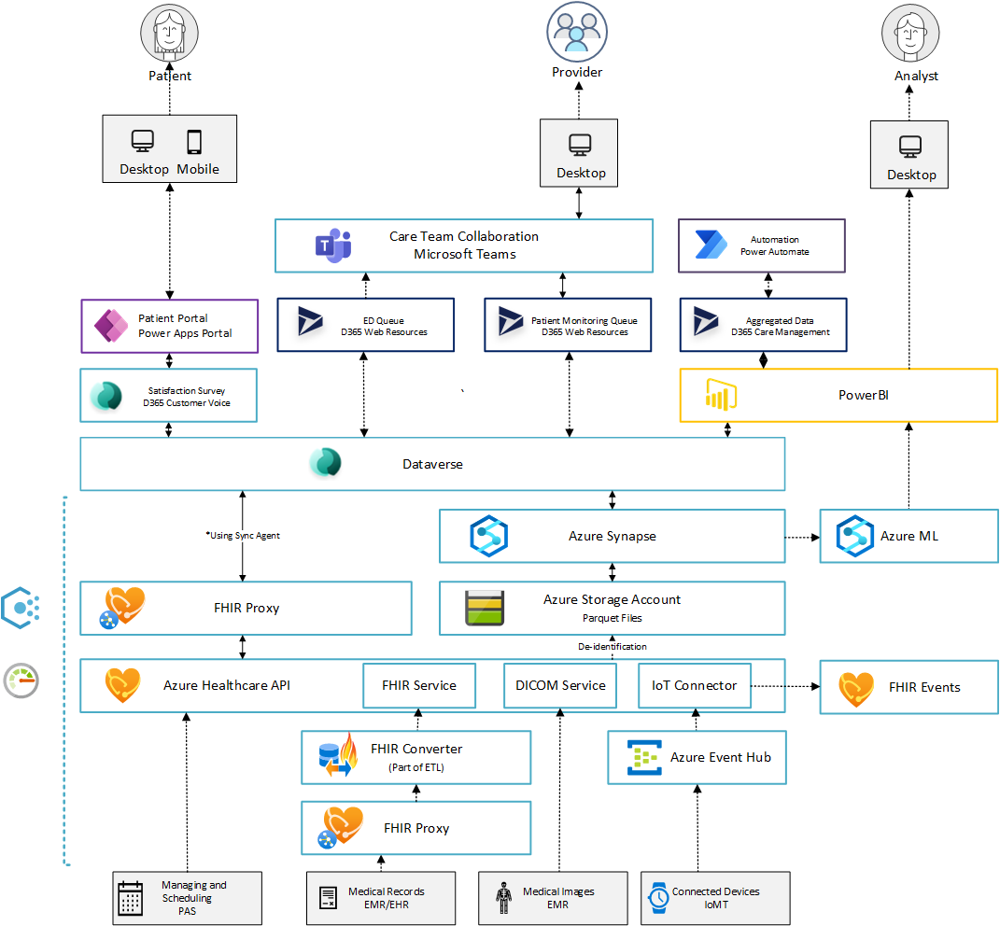

# Coming soon
# Clinical Analytics

The solution for Clinical Analytics will harness data and discover clinical insights to deliver value-based care models. In this flow, we look at how you can persist data in an analytical store, enable large scale analytical query capabilities and leverage insights from AI assisted imaging analysis and population health metrics to determine course of care. The analytical solution enable you to search through large amounts of data from sources like electronic medical records, smart medical devices, patient and population demographics, and the public domain to find hidden patterns and trends and predict outcomes for individual patients. The care guidance can rely on AI learning models that become more precise when additional data and cases are introduced.

Key capabilities of Clinical Analytics include:

* **Provider Evaluation**: Reviews IoMT data, EHR and patient data.
* **Imaging AI**: DICOM images supported by an AI report, which indicates patient condition.
* **Population Health**: Leverage large datasets to compare effectiveness of different treatment options with patients of similar demographics.

| Reference implementation | Description | Deploy |
|:----------------------|:------------|--------|
| Healthcare Analytics | End-2-end deployment and configuration of analytics solution for healthcare |

## Reference architecture

## Critical design areas for Clinical Analytics

>The analytical use-cases for healthcare leverages a combination of services in Azure, Dynamics and the Power platform.

* [Prerequisites](#Prerequisites)
* [Synapse for clinical analyticsl](#Synapse-for-clinical-analytics)
* [AI and Machine Learning for clinical analytics](#AI-and-Machine-Learning-for-clinical-analytics)
* [Observability and logging](#observability-and-logging)

### Prerequisites

* **Azure platform**: Enterprise Scale Landing Zones
* **Data platform**: Enterprise Scale Analytics (optional)
* **Azure Healthcare APIs**: FHIR + DICOM + IOT Connector
* **Synapse**: Workspace + Spark + SQL pool (optional)
* **Azure ML**: Custom AI app or cognitive services Custom vision (TBD)

### Synapse for clinical analytics

#### Design considerations

Using Azure Synapse Link, continuously export data from:

* Dataverse to Azure Synapse Analytics
* Dataverse to Azure Data Lake Storage Gen2

Azure Data Lake Storage Gen2 is required for setting up Synapse Link for Dataverse. You can consider deploying Enterprise Scala Analytics (ESA) for a consisten set up of you analytics environment. ESA includes Azure Data Lake Storage Gen2.

Consider in-place updates vs. append-only writes. For the Dataverse tables you are writing to the Data Lake consider if you should use in-place or append mode. In-place will update or upsert (update or insert) from source tables where createdOn is available. Append only mode will append source tables in Dataverse to the corresponding file partition in the Data Lake.

|Event |In place update |Append only |
|-------|-----------------|-------------|
|Create| The row is inserted in the partition file and is based on the createdOn value on the row.|The row is added to the end of the partition file and is based on the createdOn value of the record.|
|Update| If the row exists in the partition file, then it is replaced or updated with updated data. If it doesn't exist, it's inserted in the file.|The row, along with the updated version, is added to the end of the partition file.|
|Delete | If the row exists in the partition file, it's removed from the file.|The row is added to the end of the partition file with isDeleted column = True.|

You can also use Synapse Link to connect your Dataverse data to Synapse and query it using serverless SQL pool or Apache Spark. Querying multiple Dataverse databases is possible, but requires that both Dataverse environments are in the same region. In Power Apps select Go to *Azure Synapse workspace*. Select New notebook for Spark or New SQL script for SQL pool.
>Azure Synapse Link for Dataverse does not support the use of dedicated SQL pools at this time.

#### Design recommendations

Use the Azure Synapse Link to connect your Microsoft Dataverse data to Azure Synapse Analytics.

* The storage account and Synapse workspace must be created in the same Azure Active Directory (Azure AD) tenant as your Power Apps tenant.
* The storage account and Synapse workspace must be created in the same region as the Power Apps environment you will use the feature in.
* You must have Reader role access to the resource group with the storage account and Synapse workspace.
*To link the Dataverse environment to Azure Data Lake Storage Gen2, you must have the Dataverse system administrator security role.
* Only tables that have change tracking enabled can be exported.
* When you add multiple users to the synapse workspace, they must have the Synapse Administrator role access within the Synapse Studio and the Storage * Blob Data Contributor role on the Azure Data Lake Storage Gen2 account.

When you Dataverse table data to Azure data lake storage using Azure Synapse Link, the tables are partitioned. Based on the Dataverse table volume and data distribution, choose a more granular partition strategy to partition your data by month or day using **createdOn**.

Make the Azure Synapse Link configurations solution-aware, import the Azure Synapse Link solution into the environment. This enables basic application lifecycle management (ALM) abilities such as distribution, and backup and restore of the Azure Synapse Link configuration.

### AI and Machine Learning for clinical analytics

#### Design considerations

>Work in progress

#### Design recommendations

>Work in progress

### Observability and logging

After you have set up the Azure Synapse Link, you can monitor it under the Tables tab in Power Apps. There will be a list of tables that are a part of the selected Synapse Link.
There are different stages the sync status will circulate through. NotStarted indicates that the table is waiting to be synced. Once the table initial sync has been Completed, there will be a post processing stage where incremental updates will not take place. This may take several hours depending on the size of your data. As the incremental updates start taking place, the date for the last sync will be regularly updated. The Count column shows the number of changes to the data. It does not show the total number of rows to the data. The Append only and Partition strategy columns show the usage of different advanced configurations.

## TODO

* Data flow from FHIR to Dataverse
* Data flow into FHIR
* Write analytic result-set back to Dataverse
  