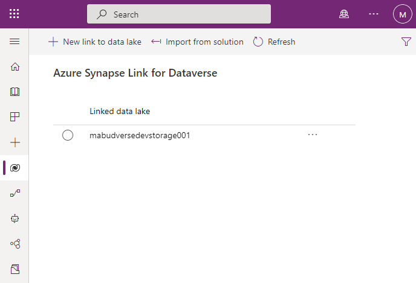
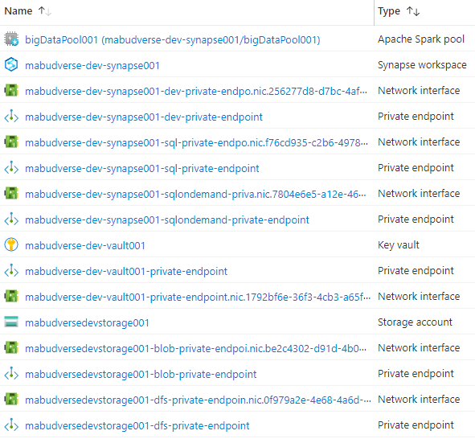
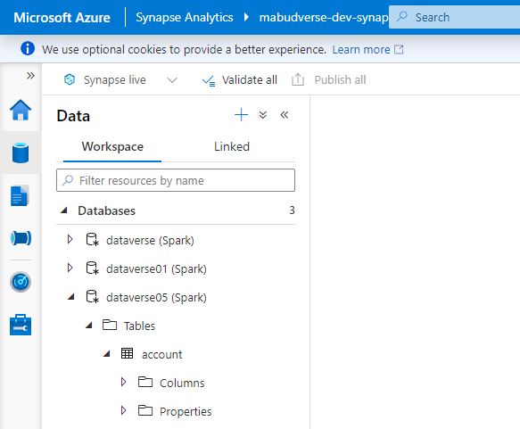
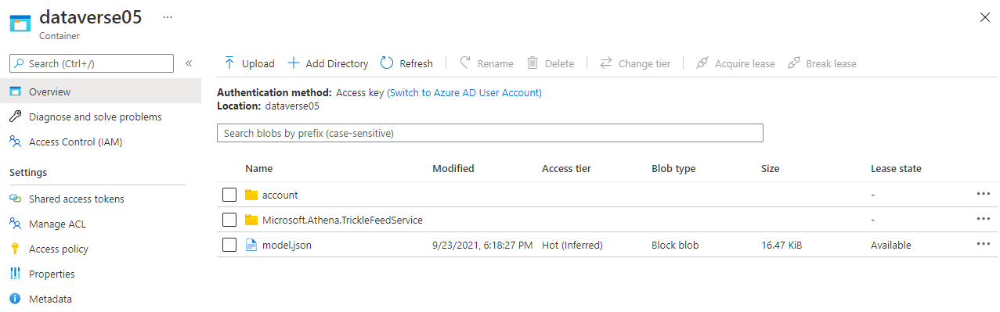

# Link Dataverse with Azure Data Lake Gen2 and Azure Synapse

In a data platform, disparate data sources and datasets are integrated onto a Data Lake in order to allow the development of new data products as well as the generation of new insights by using machine learning and other techniques. One of such data sources can be Dataverse, which is the standard storage option for all business applications running inside a Power Platform enviornment. Dataverse stores datasets in a tabular format and allows them to be extracted to a Data Lake Gen2 via a feature called "Azure Synapse Link for Dataverse".

Simply put, this feature sets up a connection between Dataverse and a Storage Account in Azure with Hierarchical Namespaces (HNS) enabled. In addition, it allows to automatically generate a the metadata for the extracted tables in a Synapse workspace. If this option is enabled, a Spark metastore with table definitions for the extracted datasets is generated and can be used for loading the datasets and further data processing. The "Azure Synapse Link" feature in Power Apps also allows users to configure how specific tables are extracted. Options include the specification of the partitioning mode and in-place vs. append-only writes. More details about these options can be found [here](https://docs.microsoft.com/en-us/powerapps/maker/data-platform/azure-synapse-link-advanced-configuration).

## Service Requirements

When setting this feature up, the Storage Account as well as the Synapse workspace must be configured correctly. Otherwise, the setup of the feature or the actual dataset extraction will fail. Therefore, the below sections will describe how the two services must be configured in order for the automatic data extraction to work.

### Storage Account

The storage Account must have hierarchical namespaces (HNS) enabled. This is a strict requirement, since the Power Platform uses the dfs endpoint of the storage account for data extraction. In addition, the firewall of the storage account needs to be opened so that the power platform cann access the storage account and update datasets within the data lake file systems. Today, it is not possible to rely on private endpoints or service endpoints for the export feature to work. Hence, the `defaultAction` in the `networkAcls` property bag needs to be set to `Allow`. Enabling `AzureServices` to bypass the firewall was not sufficient when testing the setup of the feature.

The storage account requires two containers/file systems. One is used for the actual export of data and the second one is used for power platform dataflows. In addition to that, multiple role assignments are required as outlined below:

| Service Principle                                  | Role Name                     | Scope                     |
|:---------------------------------------------------|:------------------------------|---------------------------|
| 'Microsoft Power Query' (Power Platform Dataflows) | Reader and Data Access        | Storage Account           |
| 'Microsoft Power Query' (Power Platform Dataflows) | Storage Blob Data Owner       | Storage Account Container |
| 'Export to data lake' (Dataverse)                  | Owner                         | Storage Account           |
| 'Export to data lake' (Dataverse)                  | Storage Blob Data Owner       | Storage Account           |
| 'Export to data lake' (Dataverse)                  | Storage Blob Data Contributor | Storage Account           |
| 'Export to data lake' (Dataverse)                  | Storage Account Contributor   | Storage Account           |
| 'Export to data lake' (Dataverse)                  | Storage Account Contributor   | Storage Account Container |
| 'Export to data lake' (Dataverse)                  | Owner                         | Storage Account Container |
| 'Export to data lake' (Dataverse)                  | Storage Blob Data Owner       | Storage Account Container |
| 'Export to data lake' (Dataverse)                  | Storage Blob Data Contributor | Storage Account Container |

### Synapse workspace

Our tests have shown that similar requirements are existing for the Synapse workspace. Disabling traffic on the public endpoint of Synase is not possible and private endpoints can also not be used today. The Synapse workspace firewall needs to be opened up to allow traffic from the Power Platform environment. The following role assignment is required to enable the creation of the metadata tables in Synapse:

| Service Principle                                  | Role Name                     | Scope                     |
|:---------------------------------------------------|:------------------------------|---------------------------|
| 'Export to data lake' (Dataverse)                  | Synapse Administrator         | Synapse Workspace         |

### Other comments

The Storage Account, the Synapse Workspace and the Power Platform Environment must be in the same region. Otherwise, the "Azure Synapse Link" feature in Power Apps will not work. Also, all services need to be in the same tenant, subscription and resource group.

The user creating the connection requires Owner or User Access Administrator rights on the two Azure resources in order to be able to assign RBAC roles to the Service Principles of the two Enterprise Applications. In addition, the user needs to have the Dataverse system administrator role in the environment to connect Azure and Dataverse successfully.

## Reference Implementations

To accelerate the integration of datasets between Dataverse and a data platform, a reference implementation has been developed to set this up much more quickly. The code consists of Infrastructure as Code (IaC) templates and a "Deploy To Azure" Button to setup everything related to Azure including the following:

- Azure Services: Storage Account, Synapse workspace (including Spark pool), Key Vault
- All Role assigments ([see role assignments above](#service-requirements))

Also, the reference implementation includes a set of powershell scripts to automate the first setup of "Azure Synapse Link". Afterwards, modifications can be made with respect to the tables that get synchronized as well as the settings for each table.

### Deploy To Azure

First, use the "Deploy To Azure" Button to setup all Azure related services. Go through the portal experience and specify the details of your environment to successfully deploy the setup:

[](#TODO)

Please look at the outputs of the Azure deployment and take note of the Synapse Workspace Id as well as the Dataverse data lake file system Id, as they are required in the next step.

### Connect Azure Services and Dataverse

For the next step, you will need the following PowerShell scripts included in this folder: "SetupSynapseLink.ps1" and "Helper.ps1". This step cannot be automated, because the Power Platform APIs do not support the on-behalf workflow. Therefore, this script needs to be executed by a user. Before executing "SetupSynapseLink.ps1", please follow the steps below:

1. [Install the Azure Az PowerShell module](https://docs.microsoft.com/en-us/powershell/azure/install-az-ps?view=azps-6.4.0) including the Az.Synapse module. If the Az.Synapse module did not get installed, please execute the following command in your PowerShell environment:

```powershell
Install-Module -Name Az.Synapse -Scope CurrentUser -Repository PSGallery -Force
```

2. Connect to your Azure environment using the following command:

```powershell
Connect-AzAccount
```

3. Collect all inputs required for the "SetupSynapseLink.ps1":

| Input                         | Description                   | Sample                    |
|:------------------------------|:------------------------------|---------------------------|
| PowerPlatformEnvironmentId    | Specifies the ID of the Power Platform environment. | `0000aa0a-aaa0-0a00-aa00000a0000` |
| OrganizationUrl               | Specifies the Organization URL. | `https://org111aa111.crm.dynamics.com/` |
| OrganizationId                | Specifies the Organization ID. | `aaaaaaaa-aaaa-aaaa-aaaa-aaaaaaaaaaaa` |
| SynapseId                     | Specifies the Synapse Workspace resource ID. This is specified as output in the Azure deployment. | `/subscriptions/{subscription-id}/resourceGroups/{rg-name}/providers/Microsoft.Synapse/workspaces/{synapse-workspace-name}` |
| DataverseDataLakeFileSystemId | Specifies the resource ID of the Storage Account Container. This is specified as output in the Azure deployment. | `/subscriptions/{subscription-id}/resourceGroups/{rg-name}/providers/Microsoft.Storage/storageAccounts/{storage-name}/blobServices/default/containers/{container-name}` |
| Entities                      | Specifies the tables that will be synched to the data lake. | `[{"Type": "msdyn_actual", "RecordCountPerBlock": 0, "PartitionStrategy": "Month", "AppendOnlyMode": false}, {"Type": "adx_ad", "RecordCountPerBlock": 0, "PartitionStrategy": "Month", "AppendOnlyMode": false}]` |

4. Run "SetupSynapseLink.ps1" in PowerShell by running the following command (please update the parameters):

```powershell
./SetupSynapseLink.ps1 `
    -PowerPlatformEnvironmentId "<your-power-platform-enviornment-id>" `
    -OrganizationUrl "<your-organization-url>" `
    -OrganizationId "<your-organization-id>" `
    -SynapseId "<your-synapse-workspace-resource-id>"
    -DataverseDataLakeFileSystemId "<your-dataverse-datalake-filesystem-id>" `
    -Entities "<your-entities>"
```

The following can be used as an example for the "Entities" parameter:

```powershell
$entities = @(
    @{
        "Type"                = "account"
        "RecordCountPerBlock" = 0
        "PartitionStrategy"   = "Month"
        "AppendOnlyMode"      = $false
    }
)
```

### Review Deployment

After running the PowerShell script, you should be able to see the "Azure Synapse Link" in Power Platform:



In Azure, you will find the following resources inside teh specified resource group:



In the Synapse workspace, you should see a database with the tables that you selected for the synch to the data lake:



Lastly, in the Storage Account users will find the synched tables inside the "dataverse" container:


