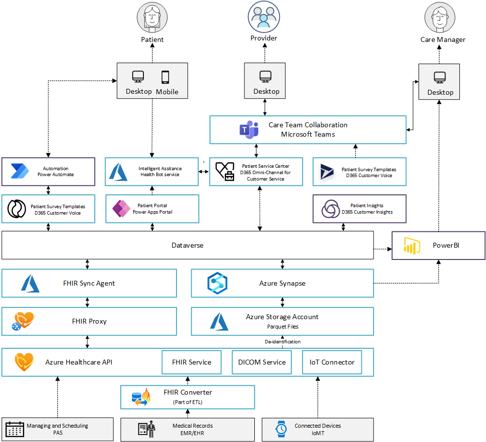
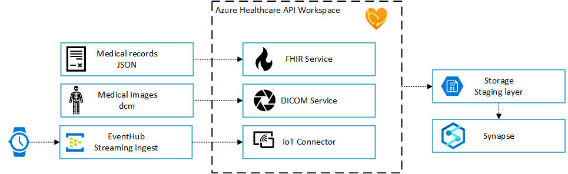
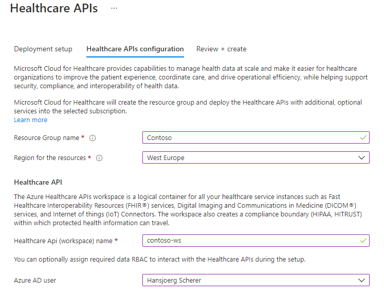
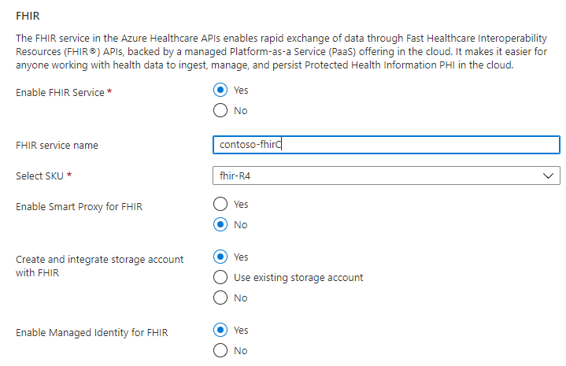
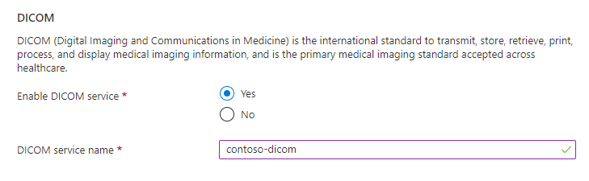
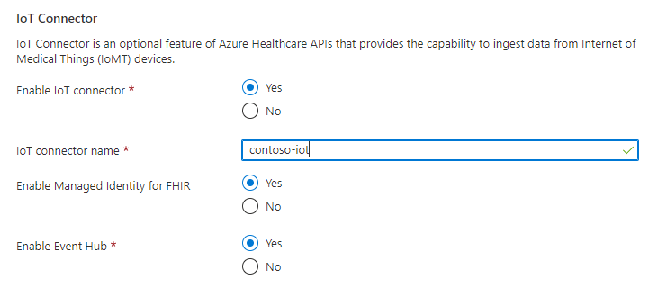
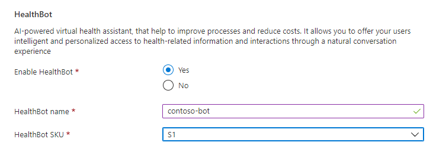
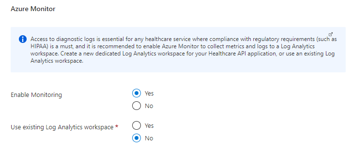
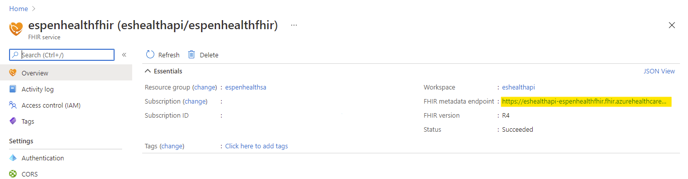

# Azure for Healthcare

Healthcare APIs with FHIR is essential in many of the Microsoft Cloud for Healthcare scenarios, and is strongly recommended to deploy them into a landing zone in Azure to simplify and expedite the integration with Power Platform (Dataverse and Healthcare applications), and Microsoft Teams.

| Industry Architecture | Description | Deploy |
|:----------------------|:------------|--------|
| Azure Healthcare APIs | Healthcare APIs architecture with FHIR, Dicom, IoT connectors, and requisite infrastructure that can be deployed into an existing landing zone in Azure |[](https://portal.azure.com/#blade/Microsoft_Azure_CreateUIDef/CustomDeploymentBlade/uri/https%3A%2F%2Fraw.githubusercontent.com%2Fmicrosoft%2Findustry%2Fmain%2Fhealthcare%2Fsolutions%2FhealthcareApis%2FhealthcareArm.json/uiFormDefinitionUri/https%3A%2F%2Fraw.githubusercontent.com%2Fmicrosoft%2Findustry%2Fmain%2Fhealthcare%2Fsolutions%2FhealthcareApis%2Fhealthcare-portal.json)



## Critical design areas for Healthcare APIs

The core of enterprise-scale architecture for Healthcare APIs contains a critical design path comprised of fundamental design topics with heavily interrelated and dependent design decisions. This repository provides design guidance across these architecturally significant technical domains to support the critical design decisions that must occur to define the enterprise-scale architecture. For each of the design areas, review the provided considerations and recommendations and use them to structure and drive designs within each area.

* [Composition of the Healthcare APIs](#Azure-Healthcare-APIs)
* [Access Control](#Access-Control)
* [Data ingress and egress](#Data-ingress-and-egress)
* [Observability and logging](#observability-and-logging)
* [Networking](#networking)
* [Regulatory compliance](#regulatory-compliance)

### Composition of the Healthcare APIs

Azure Healthcare APIs enables rapid exchange of data through APIs, backed by a managed Platform-as-a Service (PaaS) offering in the cloud. It makes it easier for anyone working with health data to ingest, manage, and persist protected health information (PHI) in the cloud using an industry standard. The healthcare APIs consist of a workspace that enables several services such as [FHIR](https://docs.microsoft.com/azure/healthcare-apis/fhir/), [DICOM](https://docs.microsoft.com/azure/healthcare-apis/dicom/), and [IoT Connector](https://docs.microsoft.com/azure/healthcare-apis/iot/).



#### Healthcare API Workspace

The Healthcare API workspace is a logical construct. All your healthcare service instances, such as FHIR services, DICOM services, and IoT Connectors are deployed within the workspace. Inside the workspace you can provision one or multiple instances of the FHIR service, DICOM service or IoT Connector. The workspace can also be used as a compliance boundary for HIPAA, HITRUST, CCPA, GDPR. Each service within the workspace has its own endpoint and can share common workspace-level configurations, like keys data encryption, or RBAC. Deployment region is defined in the workspace and all services within the workspace will be hosted in that region.

#### FHIR Service

The FHIR service is a set of tools to combine and store disparate health datasets and standardize data in the cloud. The service offers a set of search options to query the persisted data or export for consumption by other services. Role-based access control (RBAC) enables you to manage how your data is stored and accessed. Based on the role definitions you created you determine who has access to the datasets.

#### DICOM Service

The DICOM Service enables the secure exchange of medical images and associated metadata with any DICOMweb™ enabled systems.
QIDO, WADO, and STOW supports query, retrieve, and store of DICOM objects.
Ingests and persists DICOM data from VNA, PACS and other medical imaging systems at thousands of images per second.
DICOM Custom Tags allows for user defined, searchable tags.​

#### IoT Connector

The IoT Connector ingests streaming data from devices in real-time at millions of events per second. It can accept any JSON-based messages sent out by an IoMT device. This data is first transformed into appropriate FHIR-based Observation resources and then persisted into Azure API for FHIR. The data transformation logic is defined through a pair of mapping templates that you configure based on your message schema and FHIR requirements. The settings are used to manage device content, sample data rates, and set the desired capture thresholds.
Device data is normalized, grouped, and mapped to FHIR that can be sent via FHIR APIs to an EHR or other FHIR Service.

### Access Control

The recommended way to configure access control is using Azure role-based access control (RBAC). RBAC only works if you want to secure data plane access using the Azure Active Directory tenant associated with your subscription. It is possible to use a different tenant, but not recommended. When adding a role assignment, the roles you can choose between are:

* FHIR Data Reader: Can read (and search) FHIR data.
* FHIR Data Writer: Can read, write, and soft delete FHIR data.
* FHIR Data Exporter: Can read and export ($export operator) data.
* FHIR Data Contributor: Can perform all data plane operations.

### Data ingress and egress

#### Data ingress

Ingesting data into the Azure Healthcare services for FHIR or DICOM is performed in an ETL/ELT or using the IoT Connector. Pulling data from the source system and converting if required.

> FHIR Converter and Loader are released under MIT License and are not supported by Microsoft Support.

FHIR Converter is an open source project that enables conversion of health data from legacy formats to FHIR.
[GitHub: FHIR Converter](https://github.com/microsoft/FHIR-Converter)
The converter supports HL7v2 and C-CDA formats.

FHIR Bulk Loader is an Azure Function App solution that provides the following services for ingesting FHIR Resources into the FHIR Server
[GitHub: FHIR Loader](https://github.com/microsoft/fhir-loader)

#### Data egress

Egress from FHIR is done using the $export function. Before using $export, you have to configure the FHIR service to use it. There are three steps involved in configuring export in FHIR service:

1. Enable Managed Identity on FHIR service Service.
2. Creating a Azure storage account (if not done before) and assigning  permission to FHIR service to the storage account.
3. Selecting the storage account in FHIR service as export storage account.
The FHIR service supports $export at the following levels:

* System:

```http
GET https://<<FHIR service base URL>>/$export>>
```

* Patient:

```http
GET https://<<FHIR service base URL>>/Patient/$export>>
```

* Group of patients, FHIR service exports all related resources but doesn't export the characteristics of the group:

```http
GET https://<<FHIR service base URL>>/Group/[ID]/$export>>
```

When data is exported, a separate file is created for each resource type.

The $export command can also be used to export de-identified data from the FHIR server. This is using the tool for data anonymization: [GitHub: Tools for Health Data Anonymization](https://github.com/microsoft/Tools-for-Health-Data-Anonymization)

### Observability and logging

Having access to diagnostic logs is essential for monitoring a service and providing compliance reports. Azure API for FHIR allows you to do these actions through diagnostic logs. Access to diagnostic logs is  a compliance requirement with regulatory such as HIPAA. Diagnostic settings are applied as part of the service deployment. Log data is streamed to the Log Analytics workspace in Azure Monitor.

### Networking

Please note that [Azure Private Link](https://docs.microsoft.com/azure/private-link/) is currently not available for the Healthcare API FHIR service.

### Regulatory compliance

Please refer to the this page for regulatory compliance in the Healthcare API's: [Compliance in Microsoft Cloud for Healthcare](https://docs.microsoft.com/en-us/industry/healthcare/compliance-overview)

## Deployment instructions

Click this button to deploy the reference implementation for Healthcare APIs, and sign into your Azure tenant.

[](https://portal.azure.com/#blade/Microsoft_Azure_CreateUIDef/CustomDeploymentBlade/uri/https%3A%2F%2Fraw.githubusercontent.com%2FMicrosoft%2Findustry%2Fmain%2Fhealthcare%2Fsolutions%2FhealthcareApis%2FhealthcareArm.json/uiFormDefinitionUri/https%3A%2F%2Fraw.githubusercontent.com%2FMicrosoft%2Findustry%2Fmain%2Fhealthcare%2Fsolutions%2FhealthcareApis%2Fhealthcare-portal.json)

The deployment requires you to select the subscription you will create the Healthcare APIs into, and a location.

Once provided, navigate to the Healthcare APIs configuration tab, and provide inputs for the following:

* Resource group name. A resource group will be created to logically group all the Healthcare APIs resources and additional infrastructure, such as monitoring, storage accounts, managed identities etc.

* Region for the resources. Select one of the supported regions you will deploy Healthcare APIs into.

* Healthcare API (workspace) name. Provide a resource name for the Healthcare API workspace, which act as a logical container for the Healthcare API services.

* Azure AD user. You can optionally select a user that will be granted the required RBAC for the data plane operations for Healthcare APIs, across all services.



* Enable FHIR Service. Select whether FHIR should be created or not. By selecting yes, additional parameters will be required.

* FHIR service name. Provide a unique name for the FHIR service name, that will also be used to construct the service endpoint name for your FHIR service.

* Select SKU. Select one of the supported SKUs for FHIR service, per your requirements.

* Create and integrate storage account with FHIR. FHIR service supports a secure export operation to Azure Storage account. If you select yes, the storage account will be created and associated with the FHIR service, and RBAC for the managed identity is assigned.

* Enable Managed Identity for FHIR. If you select yes, a system managed identity is created for the FHIR service.



* Enable DICOM service. Select if DICOM should be provisioned and configured as part of the Healthcare API setup.

* DICOM service name. Provide a unique name for the DICOM service name, that will also be used to construct the service endpoint for your DICOM service.



* Enable IoT connector. Select if IoT connector should be provisioned and configured as part of the Healthcare API setup.

* IoT connector name. Provide a name for the IoT connector service name.

* Enable Managed Identity for IoT. If you select yes, a system managed identity is created for the IoT connector service.

* Enable Event Hub. If you select yes, an Event Hub with namespace is created and configured as part of the IoT connector service.



* Enable HealthBot. Select yes if you want to configur an AI-powered health assistant.

* HealthBot name. Provide a name for the Health Bot service.

* HealthBot SKU. Select the required SKU for the Health Bot



* Enable Monitoring. Select yes if you want to enable end-to-end monitoring of the Healthcare APIs and all services that are being created.

* Use existing Log Analytics workspace. Select yes if you want to use an existing Log Analytics workspace to collect the diagnostics and metrics of the services, or select no if you want to create a new dedicated Log Analytics workspace for the Healthcare API services (application centric).



Once the configuration has been made, you can validate and review your input before deploying into the Azure subscription (landing zone) which will host the Healthcare APIs.

### Post deployment

Get the FHIR endpoint:


### Validate the deployment

Ensure you are connected to the correct tenant and subscription

```powershell
Connect-AzAccount -Tenant "<<your_tenant_id>>" -Subscription "<<your_subscription_id>>"
```

$fhirservice is the endpoint you copied in the previous step.

```powershell

$fhirservice = 'https://<<your_healtcare_api_service>>'
$token = (Get-AzAccessToken -ResourceUrl $fhirservice).token

$headers = New-Object "System.Collections.Generic.Dictionary[[String],[String]]"
$headers.Add("Authorization", "Bearer $($token)")
$headers.Add("Content-Type", "application/json")

$FhirGetMalePatients = Invoke-RestMethod "$fhirservice/Patient?gender:not=female" `
    -Method 'GET' `
    -Headers $headers
Write-Host $FhirGetPatient
```

### Sample patient data

To simplify dowloading sample data and posting it to the API you can either clone this repository and run download.ps1 or you can run edit and paste this:

```powershell
$token = (Get-AzAccessToken -ResourceUrl $fhirservice).token

$headers = New-Object "System.Collections.Generic.Dictionary[[String],[String]]"
$headers.Add("Authorization", "Bearer $($token)")
$headers.Add("Content-Type", "application/json")
function DownloadFilesFromRepo {
    Param(
        [string]$Owner,
        [string]$Repository,
        [string]$Path,
        [string]$fhirservice
        )

        $baseUri = "https://api.github.com/"
        $args = "repos/$Owner/$Repository/contents/$Path"
        $wr = Invoke-WebRequest -Uri $($baseuri+$args)
        $objects = $wr.Content | ConvertFrom-Json
        $files = $objects | where {$_.type -eq "file"} | Select -exp download_url
        $directories = $objects | where {$_.type -eq "dir"}

        $directories | ForEach-Object {
            DownloadFilesFromRepo -Owner $Owner -Repository $Repository -Path $_.path -DestinationPath $($DestinationPath+$_.name)
        }

        foreach ($file in $files[0]) {
            $dlfile = Invoke-WebRequest -Uri $file
            try {

                $FhirGetPatient = Invoke-RestMethod "$fhirservice/" `
                -Method 'POST' `
                -Headers $headers `
                -Body $dlfile

                Write-Host $file
            } catch {
                throw "Unable to download '$($file)' Patient: '$($FhirGetPatient)'"
            }
        }
    }

    DownloadFilesFromRepo -Owner 'esbran' -Repository 'CatHealthAPI' -Path 'sampledata/fhir/' -fhirservice 'https://{<<your_fhir_service>>}.azurehealthcareapis.com'
```

>**Remember to replace <<your_fhir_service>> in the last line before running the function DownloadFilesFromRepo.**

### Search the patients

Example of a search that returns all non-female patients:

```powershell
$FhirGetMalePatients = Invoke-RestMethod "$fhirservice/Patient?gender:not=female" `
    -Method 'GET' `
    -Headers $headers
Write-Host $FhirGetPatient
```

Other examples can be found here: [FHIR Search](solutions/healthcareApis/sampledata/fhirget.ps1)

---

[Back to documentation root](../../../README.md)