# Patient access

Patient access customizes a Microsoft Power Apps portal with healthcare-specific capabilities as part of Microsoft Cloud for Healthcare.
It provides patients with access to their health data, knowledge articles, and in-person and virtual appointment scheduling, chat with health bot, communicate with a caregiver, and view their clinical data. The portal connects with entities in Dataverse.

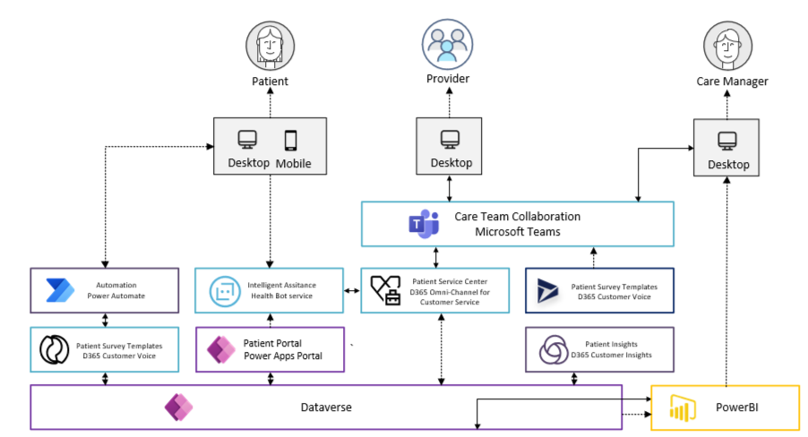

Before you deploy and configure, verify you have implemented the [prerequisites](../../prereqs.md).

Specifically for patient access, you need:

* [Power Platform environments](../powerPlatform/)
  * Must be created upfront, in United States with Dataverse and D365 Apps enabled
  * Power Apps Portal app deployed and configured in the targeted environment(s)

## Installing Power Apps Portal application

The following instructions will guide you to how to install and configure the patient access portal in your Power Platform environment for healthcare.

1. Navigate to <https://make.powerapps.com> and select the environment where you will deploy the Patient access scenario, and click “+Create” to create a new portal based on the “Customer self-service” template

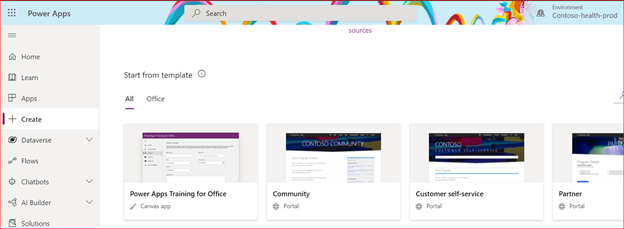

2. Give the portal a name, and provide a unique DNS name for the portal.

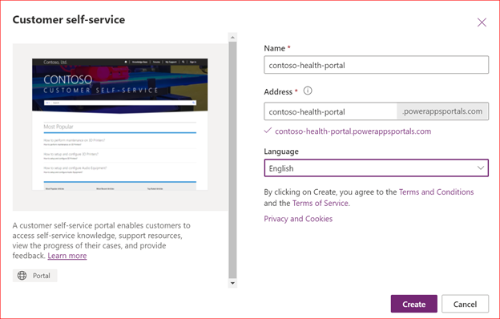

3. Click create in order to start provisioning the portal application.

> Note: an environment can have one portal of each type and for each language

4. The provisioning of the portal app will take some time, and you can monitor the progress by navigating to “Apps” on the left side, which will list all the types of applications in the environment

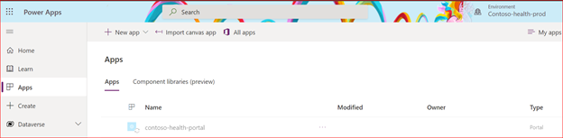

## Installing Patient access solution

Once the portal application has been provisioned, go to <https://solutions.microsoft.com> to deploy the “Patient access” scenario to your Power Platform environment.

1. Select “Patient access” and deploy, and select the dedicated Power Platform environment and provide a deployment name. The deployment name will be used for all solutions you will deploy to this environment.

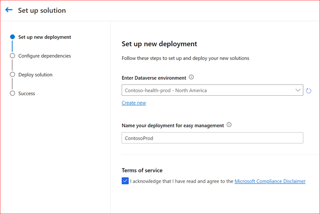

2. On the next screen, the solution center will check for any missing pre-requisites, and allow you to include codable concepts and sample data (for test/dev environments only).

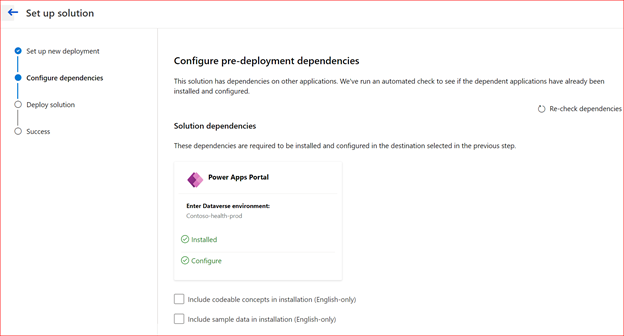

3. Start the deployment of the “Patient access” solution by clicking next. This can take approximately 60 to 70 minutes to complete.

4. Once the deployment has completed, you will find the solution available in the Solution Center, with recommended next steps for post-deployment configuration.

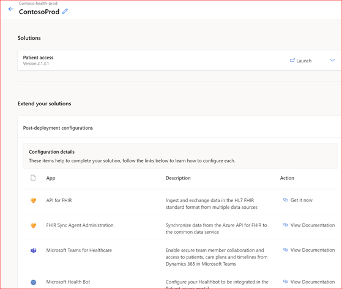

5. In the Power Platform environment, you should see at least the following Healthcare applications being installed.

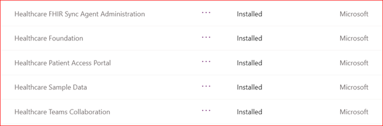

## Configure Portal application

To complete the configuration of the portal application you created before deploying the “Patient access” solution, you must navigate to <https://make.powerapps.com> and change the bindings, and optionally customize the portal per your organizations requiremenents.

1. Log into the environment in the maker portal, via <https://make.powerapps.com> and ensure you have selected the correct Environment.

2. Select the portal application you created, and go to "settings". This will open a pane on the right side, where you must select “administration” to change the bindings to use the patient portal.

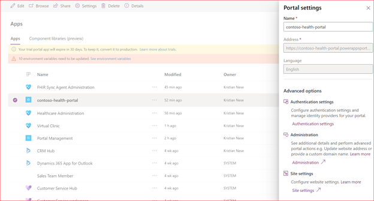

3. Select “Update Portal Bindings”, and change from “Customer Self-Service” to “Healthcare Patient Portal. Click update and the changes will be made to the portal application.

4. Once the changes are saved, access the patient access portal via its URL.

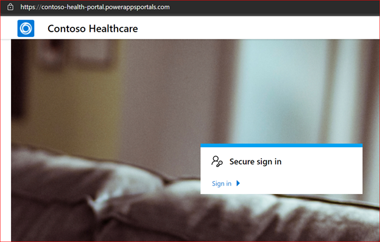

## Update Healthcare administration

Once the portal has been created and configured, you must update the Healthcare administration application with the URL for your portal application.

1. Find the Healthcare administration application, either directly from within the Environment in Power Platform admin center, or open the application in the <https://make.powerapp.com> portal. Remember to select the correct Environment context.

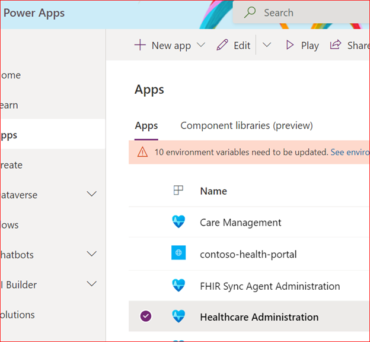

2. The default view is the Healthcare administration. Change to “Settings” from the drop down list.

3. Provide the URL for your patient access portal you created earlier, and save.

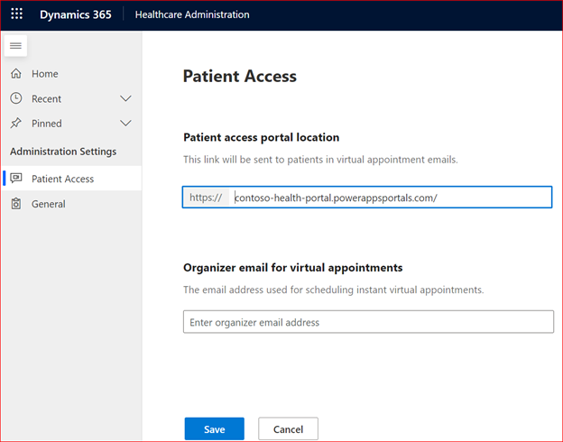
