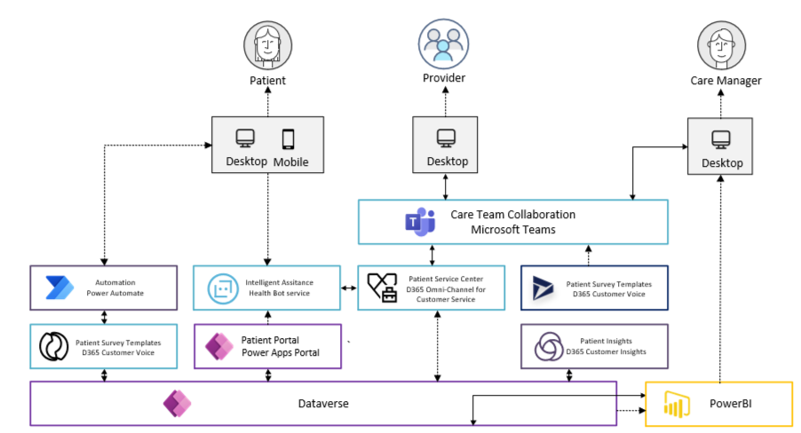
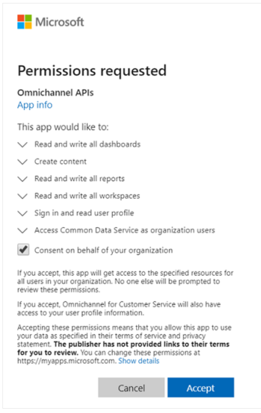
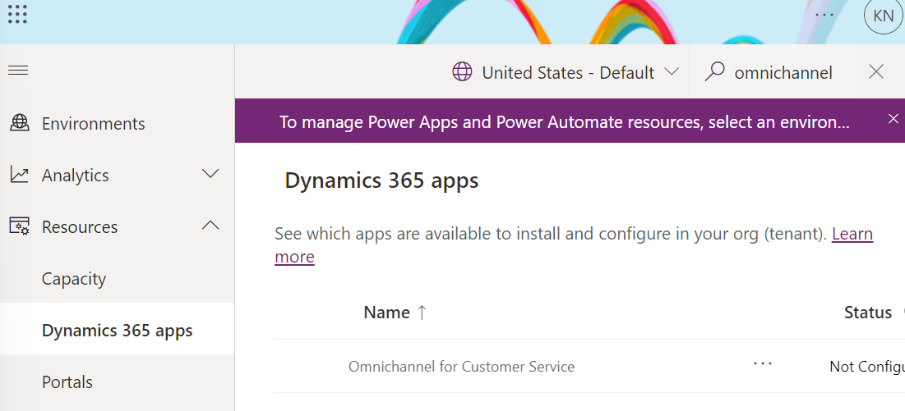
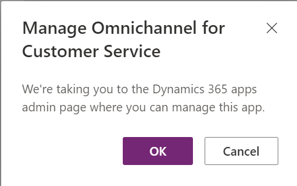
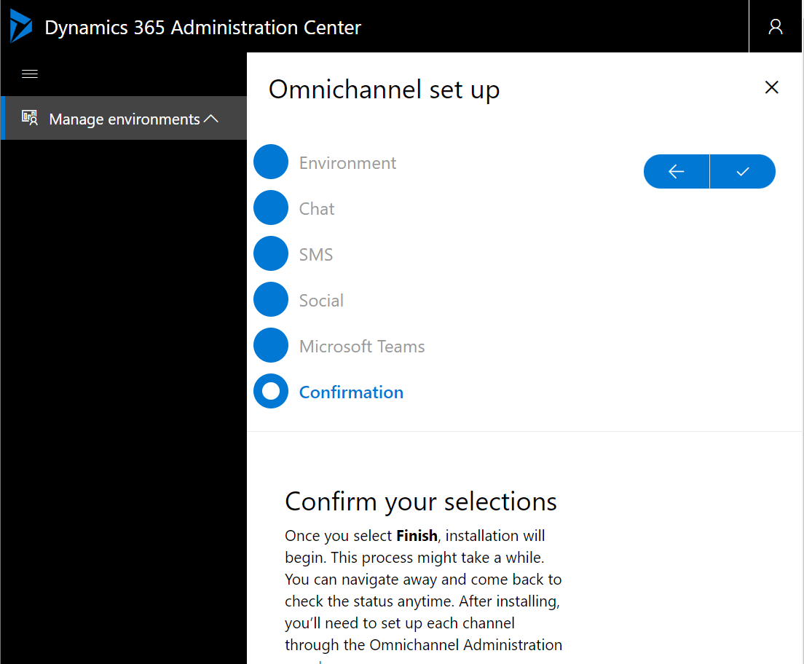
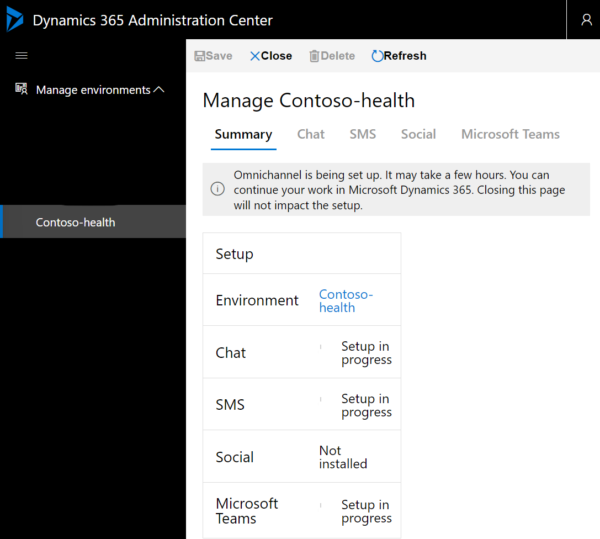
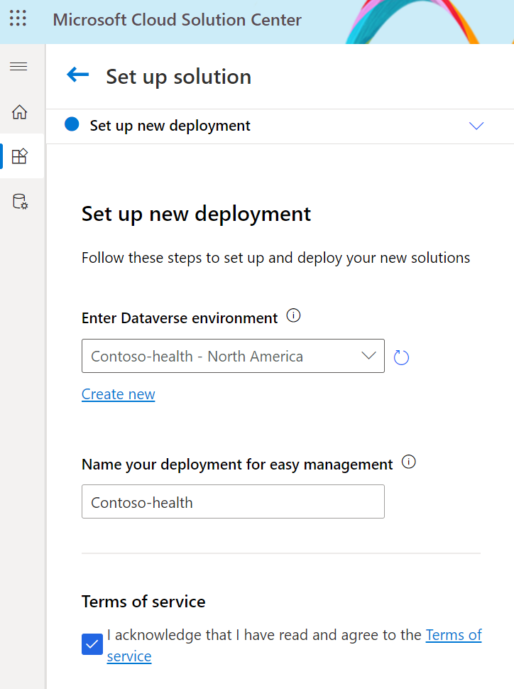
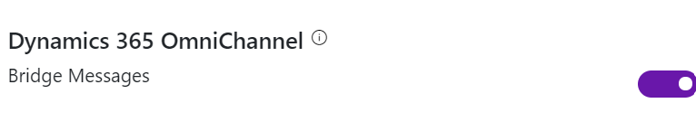
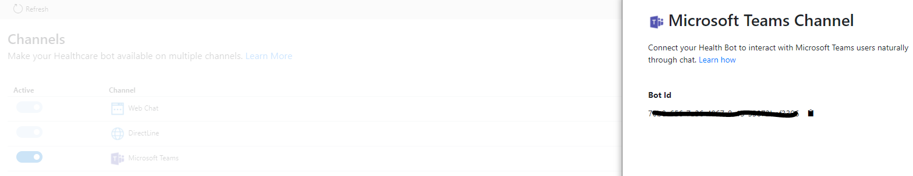

# Patient service center

Patient service center enables your organization to engage with your patients in the way they want, by using chat, and monitor automatic conversations through the Microsoft Azure Healthbot service. Service agents can help your patients with information and setting up appoints.

Patient service center builds on Power Platform, Dynamics 365 Customer Service and its Digital Messaging Add-in to provide healthcare-specific capabilities.

Further, Patient service center can be integrated with [Patient access portal](../patientAccess) to create a direct channel for your patients and automate conversations using the Healthbot.

| Reference implementation | Description | Deploy |
|:----------------------|:------------|--------|
| Compliant Azure Healthbot | End-to-end deployment and configuration of a compliant Azure Healthbot for integration with Omnichannel and Patient service center, and Patient Access portal |

>Note: The implementation of the Patient service center solution can currently not be automated, and requires manual implementation and configuration across Solution Center, Power Platform Admin Center, and portal for Power Apps. See the [implementation guide](#implementation-guide-for-patient-service-center) for detailed instructions.

Before you deploy and configure, verify you have implemented the [prerequisites](../../prereqs.md).

Specifically for Patient service center, you need:

* [Power Platform environments](../../../foundations/powerPlatform/)
  * Must be created upfront, in United States with Dataverse and D365 Apps enabled
  * If you plan to integrate with Patient Access Portal, see the [pre-requisites](../patientAccess/) for this scenario.
  * Dynamics 365 Customer Service
  * Digital Messaging add-in for Dynamics 365 Customer Service

## Planning guidelines for Patient service center

This section provide prescriptive guidance with design considerations and recommendations across the critical design areas for Patient service center scenario for the teams that will deploy and manage these specific capabilities within the Microsoft Cloud for Healthcare.

* [Identity and access](#identity-and-access)
* [Monitoring](#monitoring)
* [Security](#identity-and-access)

## Identity and access

### Design considerations

* For a complete setup of the Patient service center scenario, the persona(s) doing the setup and configuration requires permissions across Azure AD, Azure (landing zone subscription), Power Platform, and Microsoft teams.
* Azure Healthbot is an Azure resource provided by the "Microsoft.Healthbot" Resource Provider. To register this resource provider, the user must at least be *Contributor* (RBAC) on the landing zone subscription(s).
* Users accessing the Healthcare applications - such as the Patient service center need to be explicitly added to the security group in the Power Platform environments.
* Healthcare Bot and Omnichannel integration requires an AD Application with read permissions to several MS Graph APIs.
* To configure and manage Omnichannel, the user/group/application must be added explicitly to the built-in roles for Omnichannel once the solution has been deployed, in the Power Platform environment

### Design recommendations

* Ensure the right permission are assigned upfront before installing and enabling the Patient service center solution. If there's clear separation of concerns within the organization to carry out these tasks across Power Platform, Azure, and Microsoft Teams, ensure the required personas are involved and engaged to adhere to the required deployment sequence.
* Create dedicated Azure AD Groups to maintain access to the Healthcare applications such as Patient service center. This AAD group must be mapped towards the built-in *Healthcare users* role in the Power Platform environments.
* For Omnichannel configuration and management, users, groups, and applications (e.g., chat bots etc.) should be mapped directly to the built-in Omnichannel security roles in the environment, such as Administrator, Agent, or Operator.
* Create a dedicated AD Application for Healthcare Bot and Omnichannel integration. For dev, test, and production scenarios, ensure you are using dedicated applications for this.

## Monitoring

### Design considerations

* Microsoft Azure Health Bot does not provide a diagnostic setting similar to other Azure resources.
* All writes (create, update, and delete) operations towards the Healthcare Bot service from an Azure control plane perspective is logged in the Azure Activity log for 90 days
* Azure AD sign-ins and operations are logged to the Azure AD logs.

### Design recommendations

* Use dedicated Application Insights instances per Healthcare Bot environment, and persist the data in an associated Log Analytics workspace.
* Capture Azure Activity Logs from the subscription into the dedicated Log Analytics workspace.
* Enable Data export from the Power Platform environment to capture diagnostics for the Dataverse instance in the Environment for Healthcare solutions, into the dedicated Application Insights instance.
* If integrating with Patient access portal app, ensure the portal is also ingesting metrics and logs to the dedicated Application Insights instance.

## Security

### Design considerations

* Azure Health Bot is a multi-tenant service in Azure, where the infrastructure and runtime is being managed by Microsoft and is HIPAA compliant alongside with multiple other certifications.
* Azure Health Bot stores customer data in Azure storage and Azure Cosmos DB and is always encrypted at rest, where the encryption keys are managed by Microsoft.
* All communication (inbound and outbound) with the Health Bot service happens over HTTPS, ensuring data in transit is also always encrypted.

### Design recommendations

* The Application Id for the Healthcare Bot integration must be added to the 'Omnichannel agent' built-in security role in the Environment where the Healthcare solution is deployed.
* Map Azure AD Group to the requisite built-in roles for Omnichannel in the Power Platform environment where the Healthcare solutions are deployed.
* For Patient access integration, ensure portal authentication is configured to your chosen identity provider.
* Use Azure AD PIM to ensure no standing access to the Azure Health Bot service.
* Create an Azure AD Group with users who should have access to the Azure Health Bot Service.
* For Patient access integration, restrict portal access from a list of IP addresses and CIDR ranges to limit portal access as described on this [article](https://docs.microsoft.com/powerapps/maker/portals/admin/ip-address-restrict).
* For Patient access integration, create required policies and flows for user sign-up if integrating the portal application with Azure AD B2C

## Implementation guide for Patient Service Center

The following instructions will guide you to how to install and configure the Patient service center across Azure, Power Platform, and Microsoft Teams.

1. Patient service center will be deployed from the Microsoft Solution Center, but prior to that an environment with the pre-requisites must be deployed. Please refer to the [North Star Architecture for Power Platform](../../../foundations/powerPlatform) to ensure you have a compliant, production ready environment before you start.
Further, Dynamics 365 Customer Service and Digital Messaging add-in for Dynamics 365 Customer Service must be pre-provisioned and configured into the target environment(s).

2. For the environment you will enable the Patient service center scenario, you must first enable the *Customer Service Hub (CRM Hub)* solution as this is a pre-requisite for the Omnichannel setup you will complete later.

>Note: If your environment has been created after October 1st 2021, this is already pre-loaded in your environment and this step is not required. If the enviornment was created before this date, you must navigate to [Admin portal for Power Platform](https://admin.powerplatform.com), select *Resources* --> *D365 Apps* --> and install *Microsoft Dynamics 365 CRM Hub*

3. To configure Omnichannel for Customer Service, you must [provide data access consent](https://go.microsoft.com/fwlink/p/?linkid=2070932) as a user being Global Tenant Admin and select *Consent on behalf of your organization* checkbox.

4. When the consent has been granted, navigate to [Admin portal for Power Platform](https://admin.powerplatform.com), select *Resources* --> *D365 Apps* --> and locate *Omnichannel for Customer Service*

Click on the *...* button and select *Manage*. This will take you to the Dynamics 365 apps admin page to start the setup.

5. In the *Dynamics 365 Administration Center*, select *+Add environment* and ensure you are using the same environment you will be using for the Patient Service Center deployment later. Once selected, you can enable the capabilities you require for your setup. For now, we are enabling *Chat*, *SMS*, and *Microsoft Teams*. You can visit the *Dynamics 365 Administration Center* later if you want to enable further capabilities.

Once you have confirmed the selection, Omnichannel setup will start and can take a few hours to complete.

6. Once the setup has completed, you need to start the deployment of the *Patient service center* solution using the [Microsoft Cloud Solution Center](https://solutions.microsoft.com). Ensure you are targeting the same Power Platform environment as used for Customer Service and omnichannel. The deployment can take one or more hours.

## Integrate Patient service center with chat functionality using Microsoft Azure Health Bot

Once the Patient service center has been deployed and enabled, you can integrate with the Microsoft Azure Health Bot to enable AI-powered virtual health assistants. This will provide an intelligent and personalized access to health-related information and interactions through a natural conversation experience.

The bot will handle simple patient questions in the portal of the [Patient access](../patientAccess) solution (or any other website). For complex questions you can instrument the Health bot service to hand off the conversation to professional care coordinators in the Patient service center.

1. Deploy a Microsoft Azure Health Bot into a compliant landing zone (Azure). You can use the reference implementation provided here to ensure it is fully configured, secured, and monitored.

2. Post deployment, navigate to the *management portal* of the Health bot, go to *Configuration* --> *Conversation* and select *Human Handoff*. Here you must toggle the *Dynamics 365 OmniChannel* option to bridge messages.

3. Create a Bot user, add the bot user to the queues in Dynamics 365 Omnichannel and set the escalation rules.

To create the bot user, navigate to channels in the *management portal* of your Healthcare Bot. Select *Integration* --> *Channels*, and set *Microsoft Teams* to active if not done already, and click *View*. This will show the Bot id. Copy this id to your clipboard.

In the Power Platform [admin center](https://admin.powerplatform.com), locate the enviornment where you have deployed the solutions, and open *Settings*, select *Security*, and *Users*.

Select *Application Users* and create a new, where you enter or select the following:

* User Name: User name of the Bot (this will not be displayed in the chat-widget)
* Application Id: An application ID for any valid (non-expired) application created in Azure Active Directory.

*WORK IN PROGRESS*

---

[Back to documentation root](../../../)