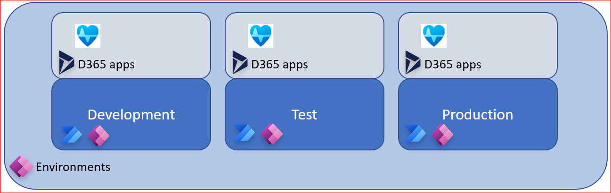
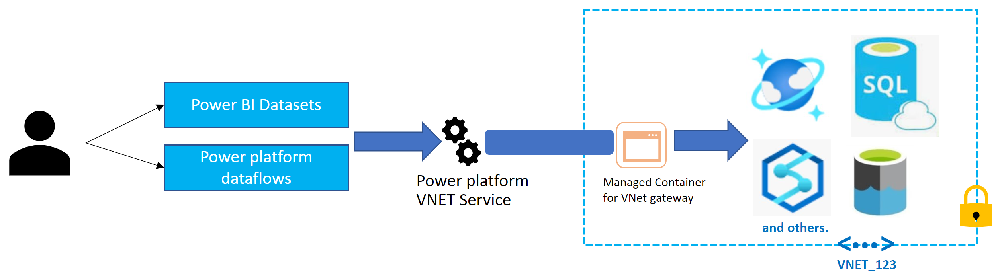

# Power Platform for Healthcare

Microsoft Power Platform is an essential component of the overall Healthcare solutions for Microsoft clouds, and this prescriptive guidance aim to provide you with best practices and recommendations across the critical design areas for Power Platform to host and integrate the various Healthcare applications.

| Reference implementation | Description | Deploy |
|:----------------------|:------------|--------|
| Power Platform for Healthcare | Power Platform environments with DLP, logging, and security enabled for Healthcare solutions |

## Environments

Healthcare applications requires an environment in Power Platform, that must be created and governed upfront and in a supported region for Healthcare.
The following section describes the design considerations and the design recommendations for Environments, to help you navigate to the correct setup per your organizational requirements.

### Design considerations

* An environment must be pinned to a location (abstraction of Azure regions), and is determined during creation by the maker/admin, and cannot be changed post creation.
* Environments are defined out of the box to serve different audiences and purposes like dev, test, production, and personal exploration/development. Depending on what type of environment that is created, it will determine what you can do with the environment as well as the apps within.
* Each tenant has a default environment and it is created in the region closest to the default region of the Azure AD tenant
* Environments can be used to target different audiences and/or for different purposes such as dev,
test and production
* Data Loss Prevention (DLP) policies can be applied to individual environments or the tenant root ("/") level
* Non-default environments can be created by licensed Power Apps, Power Automate and
Dynamics users. Creation can be restricted to only global and service admins via a tenant setting
* An environment can have one or zero database (Dataverse) instances
* Environments act as security boundaries allowing different security needs to be implemented in each environment

### Design recommendations

* Rename the Default environment to clarify the intent, e.g., "personal productivity"
* Create dedicated environments for test, development, and production for the Healthcare solutions, which allows ease of maintenance and validation of changes, such as release wave updates which is per environment
* Create the dedicated environments for Healthcare in the same region
* The production environment for Healthcare must be of type "production", while test and development environments should be of type "sandbox"
* Limit high privilege access by using an AAD Security Group with PIM for admin access to the environments
* Create DLP policies to limit data flow between trusted MSFT connectors and 3rd party APIs, aligned with your organizational requirements
* Manage the correct number of environments in the tenant to avoid sprawl and conserve capacity
* Limit creation of production and sandbox environments to only specific administrators
* Allow users to create trial environments via self-service for exploration and development

To do: End to end architecture reference

## Identity and access

Identity and access to the Power Platform, the environments, and the applications, components, and solutions within the environments must be carefully thought through in parallel with assigned licenses.
Further, for data, security in Dataverse is there to ensure users can do the work they need to do with the least amount of friction, while still protecting the data and services. Security in Dataverse can be implemented as a simple security model with broad access all the way to highly complex security models where users have specific record and field level access.
### Design considerations

* Licensing is the first control-gate to allowing access to Power Platform components
* Ability to create applications and flows is controlled by security roles in the context of an environment
* Environments act as a security boundary, allowing different security requirements to be implemented in each environment
* The security and RBAC model for Environments with - and without Dataverse are different
* Environments with Dataverse supports more advanced security models to control access to data and services within the Dataverse environment
### Design recommendations

* Create AAD groups that are automatically assigned the correct licenses per user per their requirements and roles, and avoid assigning licenses to individual users
## Data-Loss Prevention (governance)

An environment in Power Platform is an allow-by default system from a policy perspective, and for the Healthcare solutions and applications, one must use Data-Loss Prevention policies to explicitly categorize and enable/disable connecters for business use cases. This will help to mitigate risk for data exfiltration, and help to stay secure and compliant.
### Design considerations

* A policy can be scoped to include the entire tenant, multiple environments, as well as exclude multiple environments

* You can create data loss prevention (DLP) policies that can act as guardrails to help prevent users from unintentionally exposing organizational data.
* DLP policies can be scoped at the environment level or tenant level, offering flexibility to craft sensible policies that strike the right balance between protection and productivity.
* Connectors can be grouped into business, non-business, and blocked. Once categorized, it cannot be used in conjunction with other connectors outside its group. When a connector is blocked, it cannot be used at all.
* Environment admins cannot edit policies created by tenant admins
### Design recommendations

## Data

### Design considerations

### Design recommendations
## Observability and logging

### Design considerations

### Design recommendations

* Enable tenant-level analytics for aggregated view of usage across the Power Platform components

## Azure VNet connectivity for Power Platform

The Power Platform provides different mechanism to allow connectivity to Azure data services. This section will provide prescriptive design considerations and recommendations to help you implement the right connectivity model from the Power Platform to an Azure VNet.

### Design considerations

* The Power Platform provides two types of data gateways:
    * On-premises data gateway
    * VNet data gateway (currently in public preview)
* On-premises data gateway is designed to provide secure data transfers between on-premises data and Microsoft clouds services.
* VNet data gateway is designed to allow connections from Power Platform Cloud services (Power BI Datasets and Power Platform Dataflows) to Azure data services.

* Customers must install and manage the host/virtual machine where the on-premises data gateway is deployed. With the VNet data gateway no installation is required because it's a Microsoft managed service.
* VNet data gateway is well suited to complex scenarios in which multiple people access multiple data sources.
* When using the VNet data gateway, there is no need of using an on-premises data gateway.
* A Power BI Premium license (Power BI Premium workspaces and Premium Per User (PPU)) is required to make use of the VNet data gateway.
* Be sure to familiarize with VNet data gateway [limitations](https://docs.microsoft.com/en-us/data-integration/vnet/overview#limitations) as well as [supported Azure data services](https://docs.microsoft.com/en-us/data-integration/vnet/use-data-gateways-sources-power-bi#supported-azure-data-services).

### Design recommendations

* Use a VNet data gateway to access data from cloud services in the data platform to Azure data services.
    * This feature is still in public preview, hence may not be suitable for production scenarios.
* Deploy the VNet data gateway in the [hub virtual network](https://docs.microsoft.com/en-us/azure/cloud-adoption-framework/ready/azure-best-practices/traditional-azure-networking-topology) on the [Azure Landing Zones](https://docs.microsoft.com/en-us/azure/cloud-adoption-framework/ready/enterprise-scale/architecture) platform. This will provide connectivity to Azure data services located in Azure Landing Zones.
* Use on-premises data gateway if you cannot deploy preview services in your Azure environment, or you need to securely access data assets stored outside Azure.
* When using on-premises data gateways:
    * Do not install it in personal mode. The personal mode only allows access for a single user and is therefore not suited for large-scale solutions.
    * To avoid single point of failure, at least two Data Gateways should be installed to [create a cluster](https://docs.microsoft.com/en-us/data-integration/gateway/service-gateway-install#add-another-gateway-to-create-a-cluster).
    * To distribute load across the nodes of a cluster, cluster admins should enable the setting to [distribute requests across all active gateways](https://docs.microsoft.com/en-us/data-integration/gateway/service-gateway-high-availability-clusters#load-balance-across-gateways-in-a-cluster). To further enhance the load distribution, admins should [setup resource thresholds on the nodes of a cluster](https://docs.microsoft.com/en-us/data-integration/gateway/service-gateway-high-availability-clusters#load-balance-based-on-cpu-and-memory-throttling).
    * Updates to on-premises data gateway should be installed regularly by following these [guidelines](https://docs.microsoft.com/en-us/data-integration/gateway/service-gateway-update).
    * When installing the on-premises data gateway, [choose the datacenter region](https://docs.microsoft.com/en-us/data-integration/gateway/service-gateway-data-region) that is closest to the data.
    * [Enforce HTTPS communication](https://docs.microsoft.com/en-us/data-integration/gateway/service-gateway-communication#force-https-communication-with-azure-service-bus) for the on-premises data gateways and make sure that [TLS 1.2 is used](https://docs.microsoft.com/en-us/data-integration/gateway/service-gateway-communication#tls-12-for-gateway-traffic) for gateway traffic.
