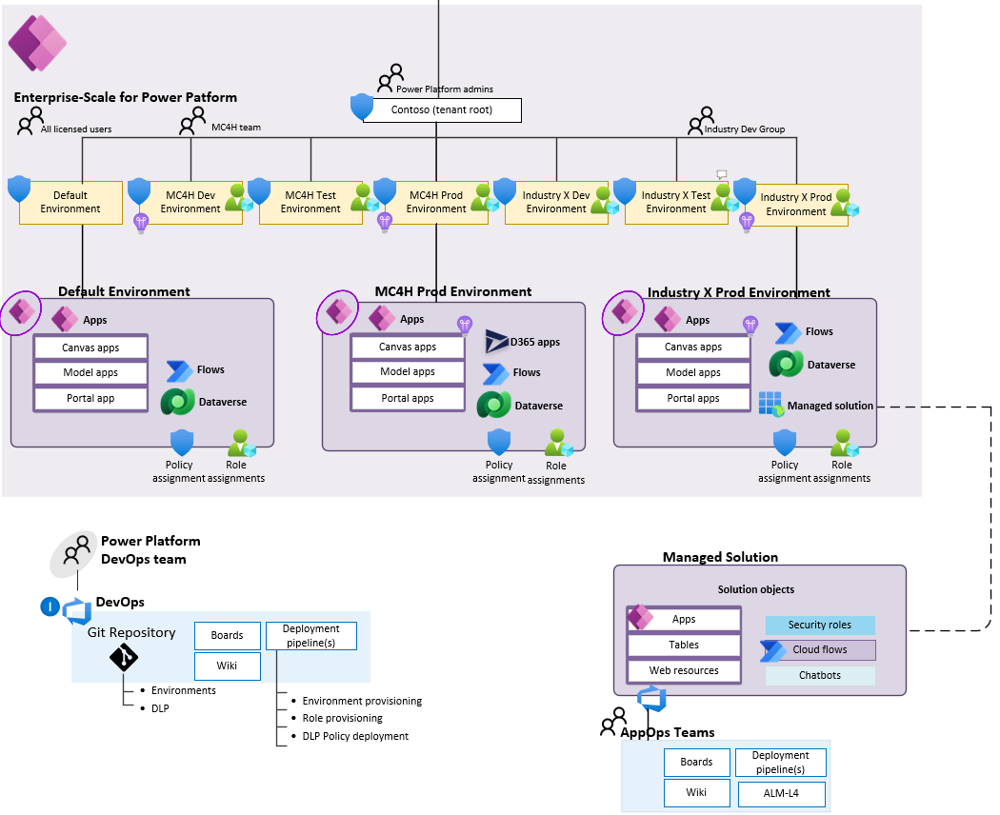
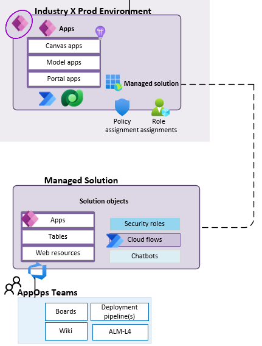

# Enterprise-Scale architecture for Power Platform

Enterprise-scale is an architectural approach and a reference implementation. It enables effective construction and operationalization of environments (landing zones) on Power Platform, at scale. This approach aligns with the platform and product roadmap.

Specifically for Microsoft Cloud for Healthcare, Microsoft Power Platform is an essential platform for the overall Healthcare solutions, and this prescriptive guidance aim to provide you with best practices and recommendations across the critical design areas for Power Platform to host and integrate the various Healthcare applications.

| Reference implementation | Description | Deploy |
|:----------------------|:------------|--------|
| Enterprise-Scale for Power Platform | Power Platform environments with DLP, logging, and security enabled for scalable Healthcare solutions |

## Architecture overview

Enterprise-Scale for Power Platform architecture represents the strategic design path and target technical state for an organizations Power Platform enviornment. It continues to evolve alongside the Power roadmap. Various design decisions define the architecture that your organization must make to map your Power Platform journey.

### High-level architecture

An Enterprise-Scale architecture includes a set of design considerations and recommendations across the [critical design areas](#critical-design-areas-for-power-platform-for-healthcare) for Power Platform. It is modular by design and allows you to start with a foundational architecture that enables construction and operationalization of landing zones (Environments) that supports your business application portfolios, for both pro developers and citizen developers. The architecture will scale regardless your organization scale-point and business requirements.

Figure 1 shows the high-level architecture of Enterprise-Scale for Power Platform

### Landing zone in Enterprise-Scale for Power Platform

A landing zone (environment) is where professional developers and citizen developers can confidently develop and run their business applications, that accounts for:

* Scale
* Security
* Governance
* Interoperability and extensibility

The landing zones consider all platform capabilities and resources that are necessary to support the organization's business application portfolio.

Figure 2 shows the landing zone (environment) in Power Platform.

## Critical design areas for Power Platform for Healthcare

The core of enterprise-scale architecture for Power Platform contains a critical design path comprised of fundamental design topics with heavily interrelated and dependent design decisions. This repo provides design guidance across these architecturally significant technical domains to support the critical design decisions that must occur to define the enterprise-scale architecture. For each of the considered domains, review the provided considerations and recommendations and use them to structure and drive designs within each area.

* [Identity and access](#identity-and-access)
* [Security, governance, and compliance](#security-governance-and-compliance)
* [Environments](#environments)
* [Data ingress and egress](#data)
* [Observability and logging](#observability-and-logging)
* [Azure VNet connectivity for Power Platform](#azure-vnet-connectivity-for-power-platform)

## Identity and access

Identity and access to the Power Platform, the environments, and the applications, components, and solutions within the environments must be carefully thought through in parallel with assigned licenses.
Further, for data, security in Dataverse is there to ensure users can do the work they need to do with the least amount of friction, while still protecting the data and services. Security in Dataverse can be implemented as a simple security model with broad access all the way to highly complex security models where users have specific record and field level access.

### Design considerations

* Licensing is the first control-gate to allowing access to Power Platform components
* Ability to create applications and flows is controlled by security roles in the context of an environment
* Environments act as a security boundary, allowing different security requirements to be implemented in each environment
* The security and RBAC model for Environments with - and without Dataverse are different
* Environments with Dataverse supports more advanced security models to control access to data and services within the Dataverse environment
* A user's ability to see and use apps is controlled by sharing the application with the user. Sharing of canvas apps is done directly with a user or Azure AD group but is still subject to Dataverse security roles, and sharing of model-driven apps is done via Dataverse security roles

### Design recommendations

* Create AAD groups that are automatically assigned the correct licenses per user per their requirements and roles, and avoid assigning licenses to individual users
* Organize the AAD groups that streamlines and simplifies RBAC for the environments per the functions and requirements for the business units and application teams

## Security, governance, and compliance

An environment in Power Platform is an allow-by default system from a policy perspective, and for the Healthcare solutions and applications, one must use Data-Loss Prevention policies to explicitly categorize and enable/disable connecters for business use cases. This will help to mitigate risk for data exfiltration, and help to stay secure and compliant.

### Design considerations

* A policy can be scoped to include the entire tenant, multiple environments, as well as exclude multiple environments
* You can create data loss prevention (DLP) policies that can act as guardrails to help prevent users from unintentionally exposing organizational data.
* DLP policies can be scoped at the environment level or tenant level, offering flexibility to craft sensible policies that strike the right balance between protection and productivity.
* Connectors can be grouped into business, non-business, and blocked. Once categorized, it cannot be used in conjunction with other connectors outside its group. When a connector is blocked, it cannot be used at all.
* Environment admins cannot edit policies created by tenant admins
* Tenant isolation for Power Platform can be applied at the connector level and is used to prevent connectors using Azure AD based authentication to other tenants, and supports both one-way (inbound) or two-way (inbound and outbound) restriction. Enabling tenant isolation requires raising a support ticket in the Power Platform admin center.

### Design recommendations

* Create a data loss prevention policy that enforces the bare minimum security requirements at the tenant scope, to ensure that all landing zones are secure by-default and both pro devs and citizen devs can safely develop business applications that does not vialates the security requirements.
* The tenant wide policy spanning all environments should prevent all unsupported non-Microsoft connectors, and classify all Microsoft connectors as 'Business data'
* Create a policy for the default environment that furter restricts which Microsoft connectors are classified as 'Business Data'
* Establish a process that will always include data-loss prevention policy when creating a new landing zone (environment), to ensure no one are accessing - or starting to create or deploy apps into it that could potentially violate the policies.

## Environments

Healthcare applications requires an environment in Power Platform, that must be created and governed upfront and in a supported region for Healthcare.
The following section describes the design considerations and the design recommendations for Environments, to help you navigate to the correct setup per your organizational requirements.

### Design considerations

* An environment must be pinned to a location (abstraction of Azure regions), and is determined during creation by the maker/admin, and cannot be changed post creation.
* Environments are defined out of the box to serve different audiences and purposes like dev, test, production, and personal exploration/development. Depending on what type of environment that is created, it will determine what you can do with the environment as well as the apps within.
* Each tenant has a default environment and it is created in the region closest to the default region of the Azure AD tenant
* Data Loss Prevention (DLP) policies can be applied to individual environments or the tenant root ("/") level
* Non-default environments can be created by licensed Power Apps, Power Automate and
Dynamics users. Creation can be restricted to only global and service admins via a tenant setting
* An environment can have one or zero database (Dataverse) instances
* Environments act as security boundaries allowing different security needs to be implemented in each environment

### Design recommendations

* Rename the Default environment to clarify the intent, e.g., "personal productivity"
* Disable self-service of Environment creation, both for Production and Sandbox as well as Trials, and limit this to selected Power Platform admins as this can potentially cause capacity constraints in the tenant
* Enable a process for the organization to request new environments. Either establish and implement the process yourself, or leverage the ["Center of Excellence starter kit"](https://docs.microsoft.com/power-platform/guidance/coe/starter-kit) which provides a solution that can be imported to a dedicated environment to facilitate this, together with other core capabilities.
* Have dedicated environments (dev, test, and prod) for management, monitoring, and analytics, that is managed and operated by the Power Platform admins, providing core capabilities for the Power Platform as a whole
* Create dedicated environments for test, development, and production for the Healthcare solutions in the same region, which allows ease of maintenance and validation of changes, such as release wave updates which is per environment
* The production and development environments for Healthcare must be of type "production", while test environments could be of type "sandbox" to simplify reset process for testing purposes.
* Limit high privilege access by using an AAD Security Group with PIM for admin access to the environments
* Create DLP policies to limit data flow between trusted MSFT connectors and 3rd party APIs, aligned with your organizational requirements
* Manage the correct number of environments in the tenant to avoid sprawl and conserve capacity
* Enable auditing for your tenant and environments to understand usage and available capacity

## Data with Dataverse

Apps created in the Power Platform, whether they are canvas, model, or portal based, can all leverage the native database capability through Dataverse within a Power Platform environment. Dataverse is a transactional SaaS data platform that can be used to include data little code to be written inside a Power Platform application.

### Design considerations

* Data can be integrated into Dataverse as a one-off activity or on a schedule. Alternatively, virtual tables can be used to map data in an external data source so that it appears to exist in Dataverse.
* Custom tables and/or standard, pre-defined tables can be used as a datasource when creating a Power Platform application.
* Ownership type of custom tables can't be changed after creation.
* Row- and column-level security can be used to restrict access to data within tables.
* Dataverse provides the option of automatic and manual backups. Automatic backups are system-initiated and manual backups are user-initiated.
* Audit Logs can be enabled to track changes to tables and columns over time for security and analytical purposes.
* Data existing in Dataverse can be continuously integrated into an Azure Data Lake Gen2 for running analytical workloads on the data.

### Design recommendations

* Integrate required data sources into Dataverse to leverage a common datastore for your applications, simplify connectivity, reduce management overhead and reduce the point of failures within the architecture.
* Setup an automatic refresh schedule or an event-driven update workflow for imported data that changes frequently in the source system. Setup refresh failure notifications to get notified about synch errors. Use incremental refreshes to reduce the amount of data that needs to be processed by Power Platform Dataflow or other integration tools.
* Use standard tables, columns, and table relationships when they make sense for your organization to simplify the app development and reduce the risk of data replication within Dataverse.
* When creating a custom table, decide upfront whether the table and accesscontrol should be owned by the "Organization" or by a "User or team".
* In general, rely on automatic system-initiated backups. Use manual user-initiated backups before updating the environment or before making any application updates.
* Enable auditing for tables to log any data creation, changes, or deletion in the respective tables. All columns are audited by default, when turning the feature on and auditing must be turned on for the environment.
* For analytical workloads such as machine learning, reporting, data warehousing and other downstream integration processes, use Azure Synapse Link to export the data from Dataverse into the analytical data platform. This will reduce the impact on the transactional Dataverse database and allows multiple Data Product teams to consume the same consistent dataset at scale.

## Power BI

Power BI is a visualization tool that can be used to present coherent, visually immersive, and interactive insights from various data sources across cloud environments and on-premises.

### Design considerations

PowerBI offers 3 paid and one free lisence option. Consider your requirements for capacity (1GB, 100GB, 400GB) and need for refresh rate (7 vs. 48 times per day). Other important aspects to consider are key management, multi-geo requirements and auto scaling. More details on Power-BI pricing and licenses can be found here: [Pricing & Product Comparison | Microsoft Power BI](https://powerbi.microsoft.com/en-us/pricing/)

In case you are managing your own keys or your deployment spans multiple geo's, this can only be achieved using Premium.

### Design recommendations

When designing your data environment make a plan for:

* data modeling
* data connectivity
* data sources
* update frequencies
* bandwidth requirements

When you need to access data from an existing source consider if a replica should be made in Dataverse and if this needs to be bidirectional synched or if you need a one directionally static snapshop.

* Data modeling
  * Define the data structure and relation requirements, one-to-may or many-to-many.
  * Every application building on the data have individual modeling requirements, but consider standardizing on models. This can simplify integrations and avoid data duplication.
  * In some scenarios standard Industry Data models are available. Evaluate if  this is the right approach for your company and if they need adoption/ configuration.

* Data sources
  * When connecting to other data sources its important to define the need to gateways to connect to on-prem systems, the network bandwidth between you Dataverse environment and server location.
  * Ensure that the database source has capacity to handle the additional load and the data transferred is optimized. Map the data volume and update frequency needed for each use case.  

## Observability and logging

Observability and auditing is key for the environments, the various application components into the environments, as well as the Dataverse platform. Additional integration and end-to-end view will rely on Microsoft 365 Security and Compliance Center, and Azure Active Directory. For most of the services in Power PLatform, organizations who are using Azure can integrate with Azure Monitor (Application Insights and Log Analytics) for long-term retention and further analysis.

### Design considerations

* Auditing for Environments is default set to off and cannot be enabled on Environments during provisioning. To enable auditing you must explicitly opt-in within the Environment settings once it has been created.

*

### Design recommendations

* Enable tenant-level analytics for aggregated view of usage across the Power Platform components

## Azure VNet connectivity for Power Platform

The Power Platform provides different mechanism to allow connectivity to Azure data services. This section will provide prescriptive design considerations and recommendations to help you implement the right connectivity model from the Power Platform to an Azure VNet.

### Design considerations

* The Power Platform provides two types of data gateways:
  * On-premises data gateway
  * VNet data gateway (currently in public preview)
* On-premises data gateway is designed to provide secure data transfers between on-premises data and Microsoft clouds services.
* VNet data gateway is designed to allow connections from Power Platform Cloud services (Power BI Datasets and Power Platform Dataflows) to Azure data services.

* Customers must install and manage the host/virtual machine where the on-premises data gateway is deployed. With the VNet data gateway no installation is required because it's a Microsoft managed service.
* VNet data gateway is well suited to complex scenarios in which multiple people access multiple data sources.
* When using the VNet data gateway, there is no need of using an on-premises data gateway.
* A Power BI Premium license (Power BI Premium workspaces and Premium Per User (PPU)) is required to make use of the VNet data gateway.
* Be sure to familiarize with VNet data gateway [limitations](https://docs.microsoft.com/data-integration/vnet/overview#limitations) as well as [supported Azure data services](https://docs.microsoft.com/data-integration/vnet/use-data-gateways-sources-power-bi#supported-azure-data-services).

### Design recommendations

* Use a VNet data gateway to access data from cloud services in the data platform to Azure data services.
  * This feature is still in public preview, hence may not be suitable for production scenarios.
* Deploy the VNet data gateway in the [hub virtual network](https://docs.microsoft.com/azure/cloud-adoption-framework/ready/azure-best-practices/traditional-azure-networking-topology) on the [Azure Landing Zones](https://docs.microsoft.com/azure/cloud-adoption-framework/ready/enterprise-scale/architecture) platform. This will provide connectivity to Azure data services located in Azure Landing Zones.
* Use on-premises data gateway if you cannot deploy preview services in your Azure environment, or you need to securely access data assets stored outside Azure.
* When using on-premises data gateways:
  * Do not install it in personal mode. The personal mode only allows access for a single user and is therefore not suited for large-scale solutions.
  * To avoid single point of failure, at least two Data Gateways should be installed to [create a cluster](https://docs.microsoft.com/data-integration/gateway/service-gateway-install#add-another-gateway-to-create-a-cluster).
  * To distribute load across the nodes of a cluster, cluster admins should enable the setting to [distribute requests across all active gateways](https://docs.microsoft.com/data-integration/gateway/service-gateway-high-availability-clusters#load-balance-across-gateways-in-a-cluster). To further enhance the load distribution, admins should [setup resource thresholds on the nodes of a cluster](https://docs.microsoft.com/data-integration/gateway/service-gateway-high-availability-clusters#load-balance-based-on-cpu-and-memory-throttling).
  * Updates to on-premises data gateway should be installed regularly by following these [guidelines](https://docs.microsoft.com/data-integration/gateway/service-gateway-update).
  * When installing the on-premises data gateway, [choose the datacenter region](https://docs.microsoft.com/data-integration/gateway/service-gateway-data-region) that is closest to the data.
  * [Enforce HTTPS communication](https://docs.microsoft.com/data-integration/gateway/service-gateway-communication#force-https-communication-with-azure-service-bus) for the on-premises data gateways and make sure that [TLS 1.2 is used](https://docs.microsoft.com/data-integration/gateway/service-gateway-communication#tls-12-for-gateway-traffic) for gateway traffic.
