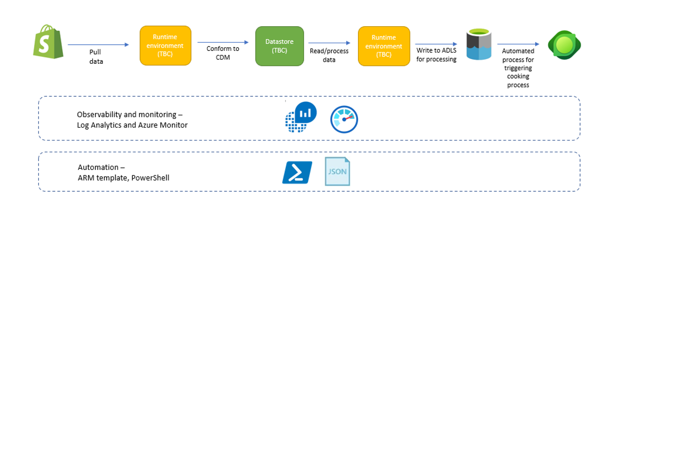

# Shopify with Intelligent Recommendations

## Overview

> Note - this is work in progress. Final solution may vary.

At a high-level, the scenario centers around sourcing data from Shopify and then using the data to drive personalization. The data will be processed by Intelligent Recommendations (IR) service to build recommendations for downstream applications.

Data is pulled back from Shopify via REST APIs and conformed to retail data model. The data is then stored on an Azure datastore. For integration with IR, datasets are extracted to an ADLS container. IR then processes data stored on ADLS at specific time intervals to produce recommendations.

## Design principles

- Leverage ESA guidance for deployment.
- Leverage 1P solutions to build end to end solution.
