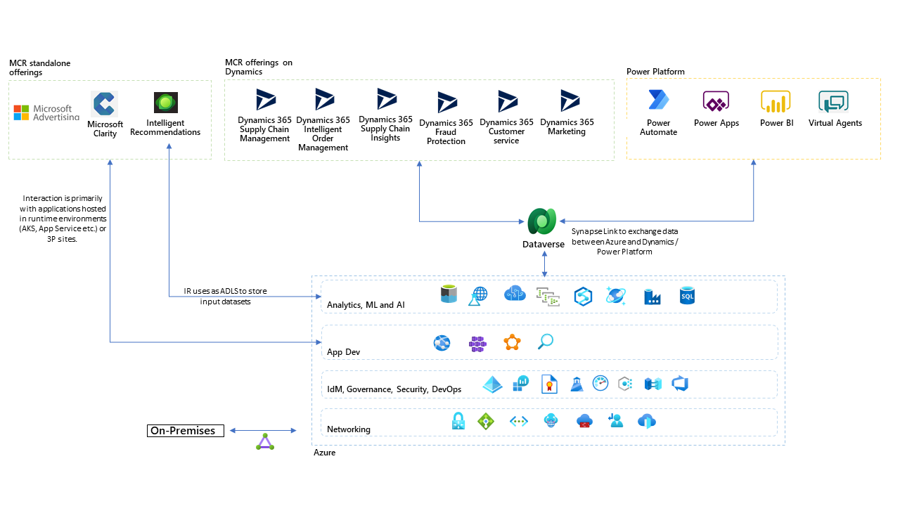

# Microsoft Cloud for Retail

## Overview

Microsoft Cloud for Retail (MCR) is Microsoft's retail-specific configurations, connectors, and applications built on Microsoft Cloud. It's built to address four key opportunities within retail in the year 2022 and beyond.

1. **Maximise the value of retail data** by using data models to bring multiple systems and applications together, unifying disparate data sources to establish a singular, in-depth profile of each shopper​.Capabilities here include unified customer profile, shopper and operational analytics, intelligent fraud protection, and retail media.

2. **Elevate the shopping experience** by enabling personalized recommendations and search results. Capabilities here include real-time personalization, intelligent stores, unified commerce, digital advertising solutions, and seamless customer service.

3. **Build a real-time, sustainable supply chain** by using capabilities such as supply chain visibility, demand planning and optimization​, and flexible fulfillment.

4. **Empower the store associate** through real-time store communication and collaboration, retail workforce management, process automation, and career development.

- [MCR GA announcement](https://cloudblogs.microsoft.com/industry-blog/retail/2022/01/12/microsoft-cloud-for-retail-is-now-generally-available/)
- [Microsoft Cloud for Retail public documentation](https://www.microsoft.com/en-us/industry/retail/microsoft-cloud-for-retail)

## Microsoft cloud for Retail compared to other industry clouds

The primary goal of all industry clouds is to enable industry-specific scenarios using solutions built on Microsoft cloud.

Microsoft Cloud for Retail (MCR) is slightly different from other industry clouds as in the individual offerings which make up Microsoft Cloud for Retail (MCR) have been available to customers as standalone SKUs even before they were available to customers collectively under MCR banner as an industry solution.

It's worth calling out that the MCR is composed of several services which  can be further categorised into Dynamics and non-Dynamics based services. This categorisation is not part of nomenclature however this categorisation is used in this guidance for delineation of integration paths available to these services. Dynamics-based services have a tight-integration with Dataverse whereas non-Dynamics based service do not have any out-of-the-box Dataverse integration. The non-Dynamics based services can be accessed directly via the APIs and one doesn't have to go via Dataverse path.

**Dynamics365 (D365) based services:**

- Supply Chain Management
- Supply Chain Insights
- Intelligent Order Management
- Fraud Protection
- Customer Service
- Marketing
- Commerce

**Non Dynamics365 based services:**

- Intelligent Recommendations
- Clarity
- PromoteIQ
- Microsoft Advertising (formerly BingAds)

## Goals

- This guidance will surface various paths available to individual MCR services with Azure and other 3P applications and platforms. These integration will enable scenarios such as custom applications; integration with on-premises/3P systems; and using custom ML/AI models.
- Surface and common deployment patterns for MCR services.

> Note - This guidance is work in progress and it may change before it's made publicily available.
