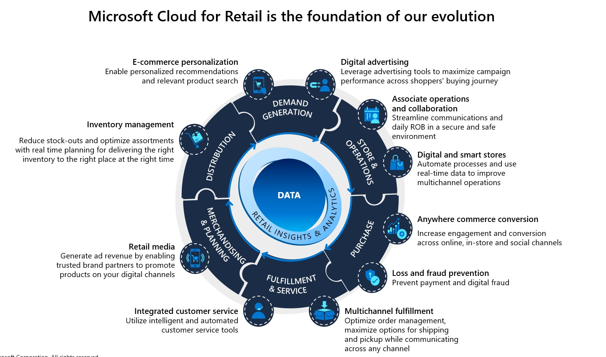

# Microsoft Cloud for Retail

This directory stores the artefacts created by CAT related to Microsoft Cloud for Retail (MC4R).

This is a work in progress and over the coming months, we shall continue to add content as we gain more experience on MC4R either through experiementation by building out scenarios using internal sandpit environments or through working on customer engagements related to MC4R.

## Goals

Build artefacts in the form of playbooks, documentation, templates etc. which will help wider Microsoft technical community to implement MC4R capabilities at scale.

## Non-Goals

TBD

## Principles

- Do not reinvent the wheel; leverage existing guidance i.e. Enterprise Scale Landing Zone, Enterprise Scale Analytics, AlwaysOn to build end-to-end solutions for industry cloud.

> Note - Over time, we plan to standardise form-factor of this guidance/artefacts to align with artefacts which are being created for other industry clouds.