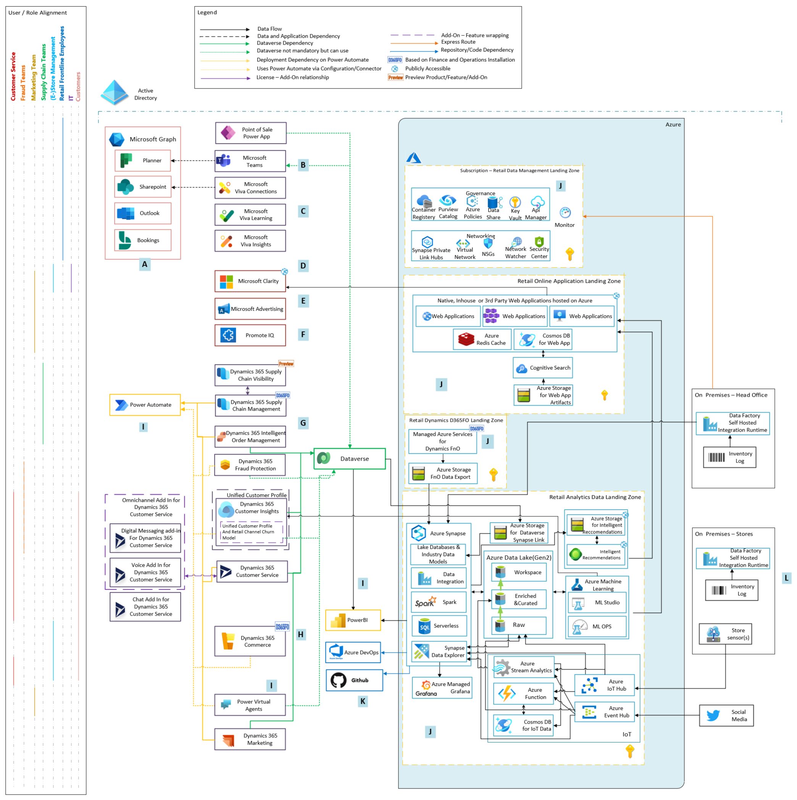

# Microsoft Cloud for Retail

Goal of this documentation is to provide Northstar reference architecture; provide opinionated considerations and best practices for implementing Microsoft cloud services and products for retail use-cases.

## Table of Contents

- [Microsoft Cloud for Retail](#microsoft-cloud-for-retail)
  - [Table of Contents](#table-of-contents)
  - [Reference Implementation](#reference-implementation)
  - [Retail Solutions](#retail-solutions)

## Reference Implementation

## Retail Solutions

- [Real-time personalization](./solutions/realtimePersonalization/README.md)
- [Flexible Fulfillment](./solutions/flexibleFulfillment/README.md)
- [Shopper and operations analytics](./solutions/shopperOpsAnalytics/README.md)
- [Churn](./solutions/churn/readme.md)

---

[Back to documentation root](../README.md)
