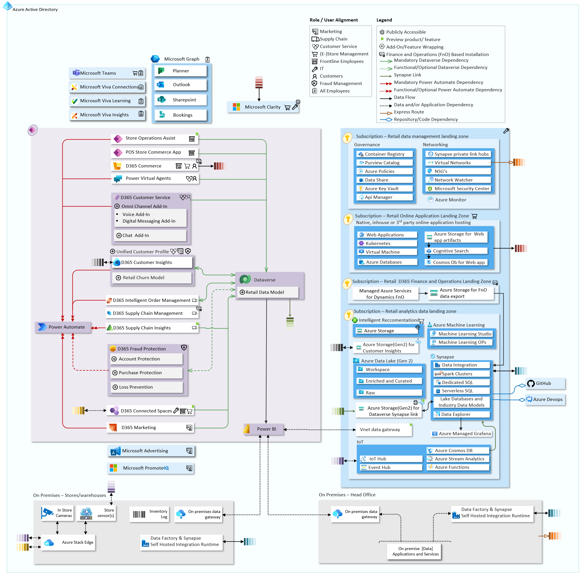

# Microsoft Cloud for Retail

Goal of this documentation is to provide Northstar reference architecture; provide opinionated considerations and best practices for implementing Microsoft cloud services and products for retail use-cases.

## Table of Contents

- [Microsoft Cloud for Retail](#microsoft-cloud-for-retail)
  - [Table of Contents](#table-of-contents)
  - [Reference Implementation](#reference-implementation)
  - [Retail Solutions](#retail-solutions)

## Reference Implementation

A detailed explanation of the reference architecture components is provided in [Reference architecture for Microsoft Cloud for Retail](./referenceImplementation/README.md) section. The Visio diagram for alterations can be found [here](./referenceImplementation/media/mc4r_v02.vsdx).

## Retail Solutions

- [Real-time personalization](./solutions/realtimePersonalization/README.md)
- [Flexible Fulfillment](./solutions/flexibleFulfillment/README.md)
- [Shopper and operations analytics](./solutions/shopperOpsAnalytics/README.md)
- [Unified Customer profile and Retail churn model](./solutions/unifiedCustomerProfile/README.md)
- [Workforce Management with Teams](./solutions/wrkforceMgmt/README.md)

---

[Back to documentation root](../README.md)
