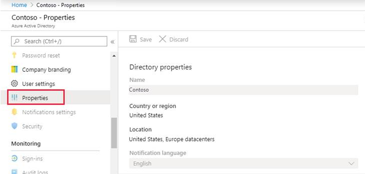
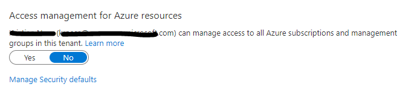

# Microsoft Cloud for Retail User Guide

This guide goes through the details of the reference implementation of a set of services and products across Microsoft Cloud to enable retail use-cases. The documentation will cover in detail the considerations, recommendations and implementation details in deploying cross-cloud landing zone for retail-specific scenarios.

## Table of Contents

- [Microsoft Cloud for Retail User Guide](#microsoft-cloud-for-retail-user-guide)
  - [Table of Contents](#table-of-contents)
  - [Overview](#overview)
  - [Design principles](#design-principles)
    - [Subscription Democratization](#subscription-democratization)
    - [Policy Driven Governance](#policy-driven-governance)
    - [Single Control and Management Plane](#single-control-and-management-plane)
    - [Application Centric and Archetype-neutral](#application-centric-and-archetype-neutral)
    - [Azure native design and aligned with platform roadmap](#azure-native-design-and-aligned-with-platform-roadmap)
  - [Critical design areas](#critical-design-areas)
    - [Separating platform and retail landing zones](#separating-platform-and-retail-landing-zones)
    - [Platform responsibilities and functions](#platform-responsibilities-and-functions)
    - [Landing zone owners responsibilities](#landing-zone-owners-responsibilities)
  - [Management Group Structure](#management-group-structure)
  - [What happens when you deploy the reference implementation?](#what-happens-when-you-deploy-the-reference-implementation)
  - [Deployment instructions](#deployment-instructions)
  - [Prerequisites](#prerequisites)
    - [Azure](#azure)
      - [Elevate Access to manage Azure resources in the directory](#elevate-access-to-manage-azure-resources-in-the-directory)
    - [Microsoft Solution Center](#microsoft-solution-center)
  - [Deployment instructions](#deployment-instructions-1)
    - [Deploy Azure resources](#deploy-azure-resources)
    - [Enable MCR products and services via Microsoft Solution Center](#enable-mcr-products-and-services-via-microsoft-solution-center)

---

## Overview

The reference implementation of retail on Microsoft Cloud leverages products and services delpoyed across Azure and Microsoft Cloud for Retail (MCR).

For most part, the deployment experience for reference implementation is automated, however parts of the deployment require manual inputs from an administrator; specifically, products and services provisioned through [MCR Solution Center](https://docs.microsoft.com/en-us/industry/solution-center-deploy?toc=/industry/retail/toc.json&bc=/industry/retail/breadcrumb/toc.json).

## Design principles

The reference architecture is composed of services on Azure and Power Platform.

For **Azure based services**, we recommend adhering to Cloud Adoption Framework (CAF) landing zones principles. These principles serve as a compass for subsequent design decisions across critical technical domains. Familiarize yourself with these principles to better understand their impact and the trade-offs associated with nonadherence, and how them will help you to scale in alignment with the Azure product roadmap.

>Note: The design principles for Azure, by design, are industry agnostic, and apply to all industries. For more details about architecture and design methodologies for Microsoft Clouds, see [this article](../../foundations/README.md).

### Subscription Democratization

Subscriptions should be used as a unit of management and scale aligned with business needs and priorities to support business areas and portfolio owners to accelerate application migrations and new application development. Subscriptions should be provided to business units to support the design, development, and testing and deployment of new workloads and migration of existing workloads.

### Policy Driven Governance

Azure Policy should be used to provide guardrails and ensure continued compliance with your organization's platform, along with the applications deployed onto it. Azure Policy also provides application owners with sufficient freedom and a secure unhindered path to the cloud.

There are a few common regulatory compliance requirements which retail workloads are eligible for:

- **PCI DSS** The workloads or systems which handle payment card data would require PCI DSS compliance.
  
- **GDPR** is a data privacy regulation which is applicable to systems which handle customer data such as e-commerce platforms; customer loyalty applications etc.

### Single Control and Management Plane

Azure provides a unified and consistent control plane across all Azure resources and provisioning channels subject to role-based access and policy-driven controls. Azure can be used to establish a standardized set of policies and controls for governing the entire enterprise application estate in the cloud.

### Application Centric and Archetype-neutral

The architecture for retail should focus on application-centric migrations and development rather than pure infrastructure lift-and-shift migrations, such as migrating virtual machines. It shouldn't differentiate between legacy and modern applications; infrastructure as a service; or platform as a service applications. Ultimately, it should provide a safe and secure foundation for all application types to be deployed onto your Azure platform.

### Azure native design and aligned with platform roadmap

This architecture approach advocates using Azure-native platform services and capabilities whenever possible. This approach should align with Azure platform roadmaps to ensure that new capabilities are available within your environments. Azure platform roadmaps should help to inform the migration strategy and Azure for retail architecture trajectory.

## Critical design areas

### Separating platform and retail landing zones

One of the key for landing zones organisation and architecture is to have a clear separation of the Azure *platform* and the *landing zones*. This allows organizations to scale their Azure architecture alongside with their business requirements, while providing autonomy to their application teams for deploying, migrating and doing net-new development of their workloads into their landing zones. This model fully supports workload autonomy and distinguish between central and federated functions.

### Platform responsibilities and functions

Platform resources are managed by a cross-functional platform team. The team carries out the following functions in a close collaboration with the SME functions across the organization:

- PlatformOps: Responsible for management and deployment of control plane resource types such as subscriptions, management groups via IaC and the respective CI/CD pipelines. Management of the platform related identity resources on Azure AD and cost management for the platform, and Operationalization of the Platform for an organization is under the responsibility of the platform function.

- SecOps: Responsible for definition and management of Azure Policy and RBAC permissions on the platform for landing zones; platform management groups; and subscriptions.
  
- NetOps: Definition and management of the common networking components in Azure including the hybrid connectivity and firewall resource to control internet facing networking traffic. NetOps team is responsible for allocating virtual networks to landing zone subscriptions.

### Landing zone owners responsibilities

The reference implementation enables landing zones supporting a both centralized and federated application DevOps models. The most common model is where a dedicated **DevOps** team is aligned to a single workload. In case of smaller workloads or COTS or third-party application, a single **AppDevOps** team is responsible for workload operation. Independent of the model every DevOps team manages several workload staging environments (DEV, UAT, PROD) deployed to individual landing zones/subscriptions. Each landing zone has a set of RBAC permissions managed with Azure AD PIM provided by the Platform SecOps team.

When the landing zones/subscriptions are handed over to the DevOps team, the team is end-to-end responsible for the workloads. They can independently operate within the security guardrails provided by the platform team and overarching policies. If dependency on central team(s) or a function is discovered, it is highly recommended that an organisation reviews the operations process and unblocks the DevOps teams.

## Management Group Structure

The Management Group structure implemented is as follows:

- **Top-level Management Group** (directly under the tenant root group) is created with a prefix provided by the organization, which purposely will avoid the usage of the root group to allow organizations to move existing Azure subscriptions into the hierarchy, and also enables future scenarios. This Management Group is parent to all the other Management Groups created by Azure for retail

- **Platform:** This Management Group contains all the *platform* child Management Groups, such as Management, Connectivity, and Identity. Common Azure Policies for the entire platform is assigned at this level

  - **Management:** This Management Group contains the dedicated subscription for management, monitoring, and security, which will host Azure Log Analytics, Azure Automation, Azure Storage Account for NSG Flow Logs, and Microsoft Sentinel. Specific Azure policies are assigned to harden and manage the resources in the management subscription.

  - **Connectivity:** This Management Group contains the dedicated subscription for connectivity for Azure platform and Distributed Edge, which will host the Azure networking resources required for the platform, such as Azure Virtual WAN/Virtual Network for the hub, Azure Firewall, DNS Private Zones, Express Route circuits, ExpressRoute/VPN Gateways etc among others. Specific Azure policies are assigned to harden and manage the resources in the connectivity subscription. For typical scale-out scenarios for the retail industry, additional connectivity subscriptions can be added and brought to compliant state in an autonomous fashion due to the policy driven guardrails design principle.

  - **Identity:** This Management Group contains the dedicated subscription for identity, which is a placeholder for Windows Server Active Directory Domain Services (AD DS) VMs, or Azure Active Directory Domain Services to enable AuthN/AuthZ for workloads within the landing zones. Specific Azure policies are assigned to harden and manage the resources in the identity subscription.

- **Landing Zones:** This is the parent Management Group for all the landing zone subscriptions and will have workload agnostic Azure Policies assigned to ensure workloads are secure and compliant. Under the parent Management Group will be a set of child Management Groups aligned to functions performed by a retailer.

  - **Plan** This is a dedicated Management Group for workloads which are perform planning function such as merchandise planning; financial planning; business intelligence etc.
  - **Buy** This is a dedicated Management Group for retail landing zones for the workloads which are repsonsible for supply-chain and logistics.
  - **Move:** This is a dedicated Management Group for landing zones for applications and workloads involved with movement of goods such as warehouse management systems; transport managagement system etc.
  - **Sell:** This is a dedicated Management Group for landing zones for applications and worklodas responsible for selling goods such as those related to Point of Sale (POS); ecommerce platforms etc. The workloads hosted here maybe required to comply with GDPR and PCI DSS.
  - **Corp** This is a dedicated management group for grouping subscriptions which host corporate systems and applications such as HR, payroll, property, finance etc.
  - **Corp
  
> Note: Azure Landing Zones are industry agnostic and Management Group hierarchy documented here is one of many ways management groups may be structured within retail setting. For purpose of the reference implementation, we have chosen a pattern most commonly seen across retailers which is to structure the teams and applications/workloads based aligned to the function performed within a retail business.

- **Sandboxes:** This is the dedicated Management Group for subscriptions that will solely be used for testing and exploration by an organization’s application teams. These subscriptions will be securely disconnected from the Corp and Online landing zones.
- **Decommissioned:** This is the dedicated Management Group for landing zones that are being cancelled, which then will be moved to this Management Group before deleted by Azure after 30-60 days.

## What happens when you deploy the reference implementation?

By default, all recommended settings and resources recommendations are enabled and deployed, and you must explicitly disable them if you don't want them to be deployed and configured. These resources and configurations include:

- A scalable Management Group hierarchy aligned to core platform capabilities, allowing you to operationalize at scale using centrally managed Azure RBAC and Azure Policy where platform and workloads have clear separation.

- Azure Policies that will enable autonomy for the platform and the landing zones.
- An Azure subscription dedicated for **Security, Governance, and Compliance**, which enables core platform capabilities at scale using Azure Policy such as:

  - A Log Analytics workspace and an Automation account
  - Microsoft Sentinel
  - Microsoft Defender for Cloud
  - Storage Account for the NSG Flow Logs setup
  - Diagnostics settings for Activity Logs, VMs, and PaaS resources sent to Log Analytics

- An Azure subscription dedicated for **Connectivity** for Azure platform networking and On-Premises connectivity, which deploys core Azure networking resources such as:

  - A hub virtual network
  - Azure Firewall
  - ExpressRoute Gateway
  - VPN Gateway
  - Azure Private DNS Zones for Private Link

- In addition, network security monitoring can be enabled which includes:

  - Enable DDoS Standard protection
  - Network Watcher
  - NSG Flow Logs
  
- (Optionally) An Azure subscription dedicated for **Identity** in case your organization requires to have Active Directory Domain Controllers to provide authorization and authentication for workloads deployed into the landing zones.

- Landing Zone Management Group for **retail** for regulated retail applications that has unique requirements for security, governance, compliance, and connectivity.
  - This is where you will create your subscriptions that will host your retail workloads.

- Landing Zone Management Group for **Corp** connected applications that require connectivity to on-premises, to other landing zones or to the internet via shared services provided in the hub virtual network.
  - This is where you will create your subscriptions that will host your corp-connected workloads.

- Landing Zone Management Group for **Online** applications that will be internet-facing, where a virtual network is optional and hybrid connectivity is not required.
  - This is where you will create your Subscriptions that will host your online workloads.

- Landing zone subscriptions for Azure native, internet-facing **Online** applications and resources.

- Landing zone subscriptions for **retail** for regulated retail applications and resources.
- Azure Policies for retail landing zones, which include:
  - Enable particular regulatory compliance, such as FedRAMP Medium, FedRAMP High, or HIPAA/HITRUST. This will enable at-scale compliance reporting for all your retail application and resources.

- Landing zone subscriptions for **Corp** connected applications and resources, including a virtual network that will be connected to the hub via VNet peering.
- Azure Policies for online and corp-connected landing zones, which include:
  - Enforce VM monitoring (Windows & Linux)
  - Enforce VMSS monitoring (Windows & Linux)
  - Enforce Azure Arc VM monitoring (Windows & Linux)
  - Enforce DDoS on Virtual Networks
  - Enforce VM backup (Windows & Linux)
  - Enforce secure access (HTTPS) to storage accounts
  - Enforce auditing for Azure SQL
  - Enforce encryption for Azure SQL
  - Prevent IP forwarding
  - Prevent inbound RDP from internet
  - Ensure subnets are associated with Network Security Groups
  - Ensure subnets are associated with User-Defined routes

## Deployment instructions

*Details coming soon*

## Prerequisites

There are two distinct parts of the deployment - Azure and Solution Center.

### Azure

The user making the deployment requires the "Owner" permission at the Azure tenant root scope. The following instructions explains how a Global Admin in the Azure Active Directory can elevate a role to the appropriate permissions prior to starting the deployment.

The pre-requisites requires the following:

- A user that is Global Admin in the Azure Active Directory where Azure landing zones for retail will be deployed.
- Elevation of privileges of a Global Admin to "User Access Administrator" role at the tenant root scope.
- An explicit role assignment (Azure RBAC) made at the tenant root scope via Azure CLI or Azure PowerShell (Note: There's currently no graphical user interface to make this role assignment).

#### Elevate Access to manage Azure resources in the directory

1.1 Sign into the Azure portal as the user being Global Admin.

1.2 Open Azure Active Directory.

1.3 Under 'Manage', select 'Properties'.



1.4 Under 'Access management for Azure resources' set the toggle to *Yes.



Grant explicit access to the User at the tenant root scope ("/") to deploy Azure for retail

You can use either Bash (Azure CLI) or PowerShell (Az.Resources) to create the role assignment for user that will do the deployment.

Bash:

```bash
#sign  into AZ CLI, this will redirect you to a web browser for authentication, if required
az login

#assign Owner role to Tenant root scope  ("/") as a Owner (gets object Id of the current user (az login))
az role assignment create --scope '/'  --role 'Owner' --assignee-object-id $(az ad signed-in-user show --query "objectId" --output tsv)
```

Powershell:

```powershell
#sign in to Azure  from Powershell, this will redirect you to a web browser for authentication, if required
Connect-AzAccount

#get object Id of  the current user (that is used above)
$user = Get-AzADUser -UserPrincipalName (Get-AzContext).Account

#assign Owner  role to Tenant root scope ("/") as a User Access Administrator
New-AzRoleAssignment -Scope '/' -RoleDefinitionName 'Owner' -ObjectId $user.Id
```

> Please note: it can take up to 15 minutes for permission to propagate at tenant root scope. It is therefore recommended that you log out and log back in to refresh the token before you proceed with the deployment.*

### Microsoft Solution Center

- You must have a Microsoft account.
- You must be a Microsoft Power Platform admin, Dynamics 365 admin, or a tenant admin.
- You must have licenses for the solutions and apps you’re deploying. If your organization doesn't have the necessary licenses, you’ll be notified during the deployment process.

## Deployment instructions

### Deploy Azure resources

*Details coming soon*

### Enable MCR products and services via Microsoft Solution Center

*Details coming soon*