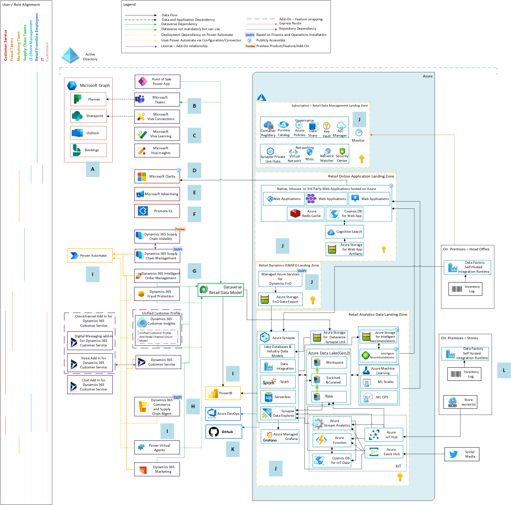

# Reference Architecture

The reference architecture for retail provides opinionated guidance for deploying foundational building blocks for enabling retail-specific use-cases.

## Overview

The building blocks which reference implementation builds upon are:

- Microsoft cloud for Retail (MCR)
- Power Platform Landing Zones
- Azure Landing Zones
- Microsoft 365 (M365)
- Dynamics 365 (D365)

As a fundamental principle, the rerference deployment follows considerations and recommendations for [Azure Enterprise Scale Landing Zones](https://docs.microsoft.com/azure/cloud-adoption-framework/ready/landing-zone/design-principles); [Power Platform](https://github.com/microsoft/industry/tree/main/foundations/powerPlatform); [MS Teams](https://github.com/microsoft/industry/tree/main/foundations/teams); and [Azure Cloud Scale analytics](https://docs.microsoft.com/azure/cloud-adoption-framework/scenarios/cloud-scale-analytics/).

The use-cases targeted by this reference architecture are:
- Intelligent supply chain
- 

The reference implementation (Figure 1) highlights the following areas:

- Retail personas at which each application is targeted at
- Data flow between components
- Individual components
- Dependency and integration points between components

*Figure 1 - Reference implementation*

The table below lists and briefly describes the role of various components deployed as part of the reference implementation.

|Legend|Component|Role|
|:-|:-|:-|
**A**|MS Graph|[Microsoft Graph](https://docs.microsoft.com/graph/overview) is the gateway to data and intelligence in Microsoft 365. It provides a [unified programmability model and ships with REST APIs and client libraries](https://docs.microsoft.com/en-us/graph/overview-major-services) that developers can use to access data in Microsoft 365. Example - Teams for Frontline Worker apps use MS Graph to access data and enable collaboration between frontline and information workers.
**B**|MS Teams|MS Teams provides collaboration capabilities for information and frontline workers. Teams' integration with MS Graph; Power Platform; Teams developer platform enables retailers to build complex apps and experiences surfaced via MS Teams.  Several Teams-based solutions - Teams for Frontline Workers; Teams integration with D365 Commerce; and Teams integration with Dynamics 365 Dataverse apps use MS Teams.
**C**|Viva|Microsoft Viva is an employee experience platform that brings together communications, knowledge, learning, resources, and insights in the flow of work. Powered by Microsoft 365 and experienced through Microsoft Teams. Apart from being a learning platform, it's one of the application platforms which could be used to build applications and experiences targeted at frontline workers.
**D**|MS Clarity|Clarity is a standalone application which tracks how end-users and customers are interacting with a webpage. Goal is to drive engagement by providing insights on how users navigate your website. Based on the insights, you may choose to make appropriate changes to UI. From reference architecture perspective, Clarity can be embedded on web applications hosted on AKS, Azure Service Environment (ASE) or as a web app.
**E**|MS Advertising|Formerly known as BingAds, Microsoft Advertising is a pay-per-click (PPC) advertising platform used to display ads based on the keywords used in a user's search query.   Within reference architecture, retailers would use Microsoft Advertising to setup Ad campaigns for ecommerce sites hosted on one of the Azure runtime environments such as App Service Environments (ASE); Azure Kubernetes Service (AKS) etc.
**F**|Promote IQ|
**G**|Dataverse and its dependent apps|[Dataverse](https://docs.microsoft.com/power-apps/maker/data-platform/data-platform-intro) lets you securely store and manage data that's used by business applications.  Within the reference architecture, Dataverse serves two roles - as a foundational building block for deploying Dataverse Dynamics 365 apps such as Intelligent Order Management; Customer Service etc. See the following [link](https://github.com/microsoft/industry/blob/main/retail/prereqs.md#mcr-and-dataverse-dependencies) for full details of D365 apps which require Dataverse.  The second role which Dataverse plays within the reference architecture is that of a building block for developing and deploying custom or 3P [model-driven](https://docs.microsoft.com/power-apps/maker/model-driven-apps/model-driven-app-overview) and [Canvas](https://docs.microsoft.com/power-apps/maker/canvas-apps/getting-started) apps.
**H**|D365 Finance and Operations apps|The reference architecture includes deployment of D365 Supply Chain Management and D365 Commerce. Both these D365 applications are part of D365 Finance and Operations apps. [D365 Supply Chain](https://docs.microsoft.com/dynamics365/supply-chain/) enables supply chain functions such as cost management; inventory managemenet; warehouse and transportation management etc. [D365 Commerce](https://docs.microsoft.com/dynamics365/commerce/) enables retail functions such as customer management; order management; financial management; products and services management etc.
**I**|Power Platform Landing Zones| The reference architecture uses all of Power Platform components (Automate, Power BI, Virtual Agents, Power Apps) to enable other applications such as Dataverse-based apps (D365 Intelligent Order Management, D365 Fraud Protection etc.). Power Platform components also enable other capabilities across the reference architecture such as automation (Power Automate); reporting and analytics (Power BI). Key point to call-out is that Power Platform components are deployed in line with [Power Platform Landing Zones](https://github.com/microsoft/industry/tree/main/foundations/powerPlatform#power-platform-landing-zones) guidance.
**J**|Azure Landing Zones| The reference architecture deploys several Azure services to enable retail-specific capabilities. The services are on Azure are deployed adhering to [Azure Landing Zones](https://docs.microsoft.com/azure/cloud-adoption-framework/ready/landing-zone/design-principles) principles.   It's worth noting that some services are deployed as an explicit dependency for a parent product or application in Dynamics 365 such as Storage Account is required for D365 Intelligent Order Management (IOM); Intelligent Recommendations requires a storage account (ADLS); D365 Commerce and Supply Chain requires several services compute, storage etc. which are deployed as part of [LCS](https://docs.microsoft.com/dynamics365/fin-ops-core/dev-itpro/lifecycle-services/lcs). In line with design principles for landing zones on Azure, these are deployed across different subscriptions.   The reference architecture has several landing zones: - **Retail data management landing zone** and **Retail analytics data landing zones**. These landing zones are built on [Cloud-Scale Analytics (CSA)](https://docs.microsoft.com/azure/cloud-adoption-framework/scenarios/cloud-scale-analytics/#architectures) and support use-cases for data engineering and analytics. - **Retail online application landing zone** houses Azure services (primarily runtime environments) integrate with headless services such as Intelligent Recommendations; Clarity; MS Advertising etc. and support ecommerce functions i.e. retail website which uses recommendations to provide personalized experiences for customers etc. Any public-facing ecommerce sites will be hosted inside this subscription. To deploy highly available mission critical workloads at scale, we recommend [Azure Mission-Critical](https://github.com/Azure/Mission-Critical). - **Retail D365FO Landing Zone** is for hosting Azure services required for deploying Dynamics 365 Finance and Operations application dependencies. The reference implementation uses a customer-managed [cloud-hosted [deployment](https://docs.microsoft.com/dynamics365/fin-ops-core/dev-itpro/deployment/cloud-deployment-overview?toc=%2Fdynamics365%2Fcommerce%2Ftoc.json).
**K**|Azure DevOps and GitHub|Azure DevOps and GitHub enable DevOps and automation toolchain.
**L**|External systems|The reference architecture depicts external applications/systems which could either be deployed on-premises or another 3P public cloud. The reference architecture proposes using ExpressRoute for network connectivity between on-premises and resources deployed on Azure.

## Design Considerations

- It's not mandatory to deploy all of the components listed here. If you have specific scenario which requires you to deploy a subset of products and/or services, please refer to [solutions](./solutions/README.md)

- There are two networking models available for connecting resources deployed on-premises to services on Azure. Depending on your requirements, you may choose one of the two networking models:
  - **ExpressRoute circuit between head-office and Azure**. To enable connectivity between indiviual stores and Azure, you must route traffic to the head-office and from there the traffic goes to Azure. In such a setup, one must deploy more than one circuit for high availability. Since the traffic to Azure from individual stores must go via the head-office, it will add latency. This will be proportional to the distance between individual stores and the head-office. Since stores are at a different distance from the head-office, not all stores would have the same response time for scenarios where they must interact with services/applications hosted on Azure. For bandwidth, size of provisioned ExpressRoute circuit must be considered. However, from cost perspective, this may be cheaper option compared to the other connectivity model.
  - **ExpressRoute connecivity between Azure and head-office(s)** and **Site to site VPN** for individual stores to connect to Azure.

    > Note: Refer to the [planning table](https://docs.microsoft.com/azure/vpn-gateway/vpn-gateway-about-vpngateways#planningtable) to choose the right solution for your deployment.

- Services such as Power Platform, D365, M365 are designed to be consumed over the internet. As such, the following [considerations](https://docs.microsoft.com/power-platform/guidance/expressroute/things-to-consider) must be factored-in before enabling ExpressRoute to connect to thse services.

- For mission-critical applications and workloads, factor-in design considerations, recommendations and practices outlined in [Azure mission-critical guidance](https://github.com/Azure/Mission-Critical).

- There are applications which require access to one or more Azure services over public endpoint from deployment and operational perspective. Few notable examples are Intelligent Recommendations which connects to ADLS over public endpoint. Similarly, D365 IOM Inventory Visibility provider requires access to Azure Storage over a public endpoint. Consider using separate storage accounts in these scenarios where the account with public endpoint enabled only stores relevant data which is required for parent service such as IR, IOM etc. to operate. The storage account with Private Endpoint(s) enabled sits behind a virtual network.

## Design Recommendations

- We recommend following principles for deploying [Azure](https://docs.microsoft.com/azure/cloud-adoption-framework/ready/landing-zone/design-areas) and [Power Platform](https://github.com/microsoft/industry/tree/main/foundations/powerPlatform#power-platform-landing-zones) landing zones.

- We do not recommend ExpressRoute for Microsoft 365 because it does not provide the best connectivity model for the service in most circumstances. As such, Microsoft authorization is required to use this connectivity model for Microsoft 365.

- Microsoft Defender for Endpoint does not provide integration with Azure ExpressRoute. While this does not stop customers from defining ExpressRoute rules that enable connectivity from a private network to Microsoft Defender for Endpoint cloud services, it is up to the customer to maintain rules as the service or cloud infrastructure evolves.

- The choice of having a separate subscription for Managed D365FO Azure App artifacts was done due to the authorization to managed app is required in subscription level. So every resource created to the subscription hosting D365FO will be visible to Microsoft. Due to the same reason it is suggested to use a separate Storage account hosted in the same subscription for Export to Data Lake feature of D365FO, but only use it for current export and move the data to  Raw Data Lake to create an history and further processing.

- Any API hosting Machine Learning Models should stay in the Retail Analytics Data Landing zone subscription. This recommendation covers both Azure Machine Learning(AML) and Intelligent recommendations(IR). IR is no different than an ML model in AML producing an output and serving as an API. One difference for IR is that the service requires the Storage Account it reads and writes to be public. Therefore we recommend having a separate dedicated storage account for IR. If the access requirements in the service changes in the future this recommendation may be reconsidered.

- Synapse link for Dataverse intentionally designed to sink into a dedicated database instead of Raw Data Lake. The reasoning behind that is that the Linked data changes in sync with the changes in the Power App /Dataverse. In principle Raw should have the unchanging history/snapshots of data to enable reproducible/rerunnable data pipelines. The Workspace Data Lake is also not used since the Workspace Data Lake should only be accessed and used by the Synapse.

## Deployment Steps

*Coming soon*
