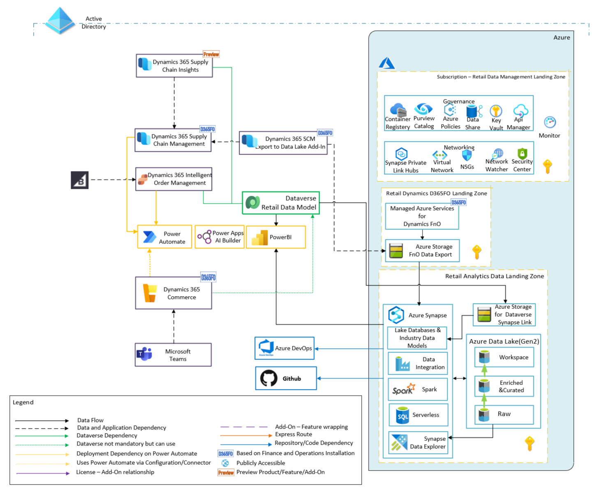

# Flexible Fulfillment

Flexible fulfillment is targeted at optimizing order management and giving customers choice across channels. It leverages D365 Supply Chain Management (SCM) and D365 Intelligent Order Management (IOM).

The solution is composed of several components and due to complexity of the deployment, this guidance has been broken down into two parts to cover IOM and SCM separately.

The table below lists the building blocks for solution and contains a link to their respective deployment guidance. The full solution is broken down into smaller manageable deployments.

| Components | Role | Deploy |
|:----------------------|:------------|--------|
| D365 Intelligent Order Management (IOM) | D365 IOM is a Dataverse application which provides retail organization a single pane of glass to provide end to end view of order lifecycle management. Organizations can build workflows to handle orders based on business events. This includes routing orders based on customer preferences etc. through various fulfillment channels.| [End-to-end deployment and configuration of D365 IOM and BigCommerce](./iom/README.md)
| D365 Supply Chain Management (SCM) |Enables capabilities for managing a supply chain such as warehouse management; transportation management; procurement; demand forecasting etc.|*Coming soon*
| D365 Commerce |Omnichannel solution that unifies back-office, in-store, call center, and digital experiences. |*Coming soon*
| Teams for Frontline Workers | Enables frontline workers to collaborate and provides a building block for scenarios such as BOPIS etc.| *Coming soon*
| Azure Storage account(s)| Azure storage accounts to fulfill D365 app-related feature requirements. Example - D365 IOM and D365 Supply Chain Management require an Azure Storage account for inventory visibility.| *Coming soon*

**Important note about this guidance**

- This guidance uses a single tenant. Please DO NOT use separate AAD tenants for end-to-end deployment of this solution.
- In context of Power Platform Environments, a solution which consists of multiple D365 apps which require access to a common Dataverse instance and other components such as Power Apps; Automate etc., we will use a a single Power Platform environment so that components belonging to an environment can be shared across application boundaries.
- The deployment experience of Flexible Fulfillment is not fully automated and it consists of manual steps which must be performed across Solution Center; Power Platform Admin Center (PPAC) and third-party (3P) BigCommerce platform. There are certain aspects of the deployment primarily those relating to Azure which have been automated for a programmatic and repeatable deployment.
- BigCommerce is a third-party ecommerce platform. For authoratative guidance on deploying BigCommerce and technical support, we recommend reaching out to [BigCommerce](https://www.bigcommerce.com/dm/microsoft/). The intent of having BigCommerce here is to surface `Provider` capabilities of D365 IOM and giving customer multiple channels to buy products from a retailer. The same functionality can be enabled via D365 Commerce.
- This guidance uses **commerce scale unit (cloud)** for D365 Commerce and Supply Chain Management.
- D365 Supply Chain and D365 Commerce rely on Azure capabilities. See [Commerce Scale Unit](https://docs.microsoft.com/en-us/dynamics365/commerce/dev-itpro/retail-store-scale-unit-configuration-installation) for more details.