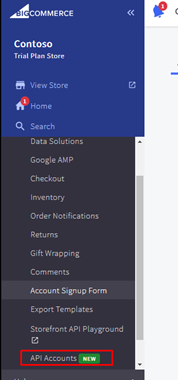
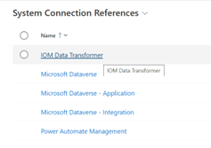

# Intelligent Order Management

| Reference implementation | Description | Deploy |
|:----------------------|:------------|--------|
| IOM | Deployment guidance | [Prerequisites](#d365-iom-prerequisites) and [Deployment steps](#intelligent-order-management-deployment)
| BigCommerce | In this reference implementation, we are using BigCommerce as point of generation for customer orders. IOM is an order management application and it itself cannot generate orders, hence it requires an external application to generate orders which it can then manage once they arrive at IOM via Providers. | [Prerequisites](#bigcommerce-prerequisites) and [Deployment steps](#bigcommerce-deployment)

## Overview of IOM
IOM is a Dynamics 365 app designed and built on Microsoft Dataverse. It relies on Power Platform capabilities to enable key features such as -

- Providers
- Orchestration
- Insights


> Note: It shares the common data model with other apps in the Dynamics 365 family, however it does not depend on any other D365 apps and can be enabled on its own.

IOM has following application goals:

- IOM is designed to provide single pane of glass for managing end-to-end lifecycle of an order across disparate applications and platforms. It’s a common scenario for enterprises to have disparate systems for ecommerce, fulfillment, and shipping/delivery. IOM bridges these disparities and provides a single pane of glass to manage end-to-end lifecycle of an Order. [Extensibility features](https://docs.microsoft.com/dynamics365/intelligent-order-management/extensibility) allow customers to integrate IOM with their existing ecosystem of applications.

- It provides the flexibility organisations need today to capture orders from any order source such as online e-commerce, marketplace, mobile apps, or traditional sources like EDI and fulfill them from their own warehouse, 3PL (third-party logistics), stores, or drop-ship with vendors or other delivery fulfillment partners.

- It's designed for a low-code, no-code experience. IOM’s orchestration designer tools allow users to model and automate the response to fulfillment constraints and leverage machine learning to influence & optimize the flow of the orders.

## Prerequisites

This section breaksdown prerequisites for **D365 IOM** and **BigCommerce** as these are two separate deployments.

### D365 IOM prerequisites

**Licensing**

[IOM is currently in preview](https://docs.microsoft.com/dynamics365/intelligent-order-management/deploy#deployment-options). The preview  can be deployed in one of two ways:

- If you have an existing Power Platform deployment, you can deploy an environment via Power Platform Administration Center (PPAC). You'll only be able to deploy in trial environments

    **OR**

- Deploy trial version of IOM through [D365 IOM Marketing page](https://dynamics.microsoft.com/intelligent-order-management/).

**Credentials**

1. Tenant administrator access to Power Platform Admin center to provision an `Environment`. As noted above, since IOM is in preview, one can only deploy it in `Trial (Subscription-based)` environment type.
2. An administrator for D365 IOM to configure the deployment and setup Providers.

### BigCommerce prerequisites

**Licensing**

If you do not have a license for BigCommerce, you can create a new trial account. Trial account is valid for 14-day period. It can be converted to a licensed account before 14-day period expires. For production deployments, as with any software, we recommend having an appropriate license and support agreement in place for BigCommerce platform.

**BigCommerce Adminstrator Account**

1. An **admin account** for BigCommerce. This account should have privileges to configure the ecommerce store and generate sample orders for to test the integration between BigCommerce and IOM. This account will also be used to generate an API key which is to be used by IOM to interact with BigCommerce. The steps below show how to setup a brand new BigCommerce instance. The credentials used at the time of creation, by default, assigned administrative privileges.

2. Go to [BigCommerce](https://www.bigcommerce.com/) site and create a new account. By default, the credentials used for creation of BigCommerce instance have admin rights to that instance. 

3. Enter email address to use for creation. This email account, by default, will have administrative privileges to BigCommerce instance.

    

4. Enter the details. Please note that you are free to choose any name for your store. Once details have been entered, click on “Create your store” button.

5. You should see the following message on your screen as BigCommerce creates your store. It usually takes a few minutes to create an instance.

    
6. After your online store is ready, you’ll be welcomed by a store summary screen. In this case, we have named our demo store as “Contoso”. You can choose a different name. This is a pre-populated demo environment and ships with sample data i.e., product master data. In a production scenario, you'll add your own item lines (or products) to the store which you could sell through the online store. The steps to add products to a BigCommerce store are covered [here](https://support.bigcommerce.com/s/article/Adding-Products-v3?language=en_US).

**BigCommerce API Key**

This API key will be used by IOM Provider to fetch order data from BigCommerce.

1. An **API key** generated by the admin account configured in (1). This key will be used by IOM Provider for pulling customer orders created on Bigcommerce platform.

> Note: BigCommerce uses its own proprietary authentication and authorization mechanism independent of Azure AD (AAD). Hence, separate privileged account is required to configure and deploy BigCommerce ecommerce store.

2. Login to [BigCommerce portal](https://login.bigcommerce.com/login) using adminstrator credentials for BigCommerce. These were configured previously.


3. Go to **Advanced Settings > API Accounts**.

    

4. Select **Create Account** and then add details for the API account which will be used by BigCommerce Provider. We recommend assigning an appropriate set of OAuth scopes to this account in line with principle of least privilege. Set of screenshots below show OAuth Scopes assigned to this API account.

    

    

    

5. Click on **Save** and you should now see a pop-up with **BigCommerce API credentials**. We are interested in **Access token** as that's the value which must be supplied to the Provider in IOM.
    

    > Note: The value of `Access Token` will not be displayed again and must be stored safely. One solution could be to save it in Azure Key Vault, however the OOTB Providers in IOM cannot access a secret keystore at runtime. An administrator configuring a Provider in IOM must manually copy/paste this value. The role of AKV in this case is to **store credentials** in a secure fashion.

6. This completes the process of creating BigCommerce API account. This will now enable the BigCommerce IOM provider to BigCommerce and fetch orders. We will now switch to IOM portal and carry out of the steps there to complete rest of the configuration setup.

    > Note: At this stage, BigCommerce instance should have a sample store in place. In a production setting, you will be required to configure your store and load products etc. which you are selling through BigCommerce ecommerce platform. Instructions for setting up store are available [here](https://support.bigcommerce.com/s/knowledge).

## Key Capabilities and Architecture of IOM

## Architecture

Intelligent Order Management, built on Power Platform, seamlessly integrates with existing systems through the provider connector framework, providing order orchestration capabilities to help you deliver on your business strategy through order, orchestration, fulfillment, optimization, inventory visibility and fulfillment insights.

IOM shares the Common Data Model with Dynamics 365 applications to facilitate back-office application support for your customer service & sales representatives.

The core architecture of IOM has following main components:

- [Providers](https://docs.microsoft.com/dynamics365/intelligent-order-management/work-providers)
- [Orchestration Flows](https://docs.microsoft.com/dynamics365/intelligent-order-management/orchestration-flows)
- [Insights](https://docs.microsoft.com/dynamics365/intelligent-order-management/report-powerbi-integration)

### Providers

Provider is the integration feature which enables IOM to interact with external applications and platforms. This section focuses on considerations for deploying IOM an Provider at scale.

Provider composition and details are covered in detail [here](https://docs.microsoft.com/dynamics365/intelligent-order-management/work-providers).

- IOM ships with default set of Providers which allow integration with external platforms and services such as BigCommerce; D365 Commerce etc. The default Providers are supported by Microsoft in terms of functionality and covered under support as long as they haven't been customized.
- IOM is an order management application and relies on Providers to interact with external systems for capabilities such as shipping; tax calculation; fulfillment etc. Various Providers can be called as part of an orchestration flow to perform an action or a set of actions based on business events taking place.
- For extensibility, customers can create their own Providers, however these are to be maintained by the customer and do not fall under the purview of Microsoft support.
- Each instance of a Provider requires a `Connection` which enables connectivity to external system or application. There's `1:1` relationship between an instance of Provider and a connection. From security and administrative point of view, one set of credentials per application per Provider is generally a good starting point as it allows administrators to have clear security and administrative boundary between a Provider and consumers.
- You can have more than one instance of a given Provider type within a given instance of IOM in a single `Environment`. Some of the scenarios where you may end up with multiple instances of same Provider type are:
  - You have may have multiple separate instances of a source system type which warrants setting up separate instances Provider for each instance of source system even though the source type is the same. Main reason is that connection configuration is bound to an instance of Provider and if you want to configure connectivity between an instance of IOM and two or more separate instances of a source system then separate Provider instances will be required.
    > Note: There are additional steps which must be taken to address mapping values between a source and IOM if you are connecting to multiple instances of same source system type. `Mapping` (discussed later) enables IOM to translate values between external systems and IOM.
- Provider use Power Automate platform and offer low-code experience and inherit scale characterstics from the underlying platform. We recommend familiarising with [Power Automate scale limits](https://docs.microsoft.com/power-automate/limits-and-config.)
- The default set of Providers which ship with IOM do not support runtime access to a keystore which means that credentials (username; passwords; and/or API keys) must be configured beforehand at the time of setting up a Provider.
- Providers which connect to cloud-based Microsoft applications and platforms support AAD. Example - `D365 Inventory Visibility Provider` leverage AAD to perform for authentication and authorization operations on Azure Data Lake Storage (ADLS).

### Provider Categories

Out of the box (OOTB) Providers can be categorised based on the function/role they play in order management lifecycle. A customer deployment may use one or more OOTB Providers of a given type depending on type of external systems/platforms that an IOM deployment interacts with. The Providers can be categorised as:

- Order intake
- Fulfillment
- Delivery
- Optimisation
- Tax calculation


## Deployment Considerations and Recommendations for D365 IOM

IOM is an application built on Power Platform and Dataverse. For most part, it will inherit design decisions adopted for the the `environment` where IOM is provisioned. This section focuses on calling out areas specific to IOM.

> Note: Reference to `Environment` here is in context of Power Platform. More details are available [here](https://docs.microsoft.com/power-platform/admin/environments-overview). An environment is a space to store, manage, and share your organization's business data, apps, chatbots, and flows.

### Licensing and Tenancy

#### Considerations

- **Intelligent Order Management is licensed per tenant, and it includes with 1K order lines capacity**. If you need additional capacity, you can buy multiple units of the same license. Intelligent Order Management license also includes limited Power Automate use rights, such as Power Platform requests per month, and use of connectors.
- IOM licensing model is based on volume of lines processed/handled by an instance of IOM. Additional capacity can be purchased by buying multiple units of the same license.
- Access to an Azure Subscription is optional in context of IOM. It is required for scenarios where Providers require access to one or more Azure services for deployment.
- In context of Microsoft SaaS offerings, a [tenant](https://docs.microsoft.com/microsoft-365/enterprise/subscriptions-licenses-accounts-and-tenants-for-microsoft-cloud-offerings?view=o365-worldwide#tenants) is the regional location that houses the servers providing cloud services. It's **not** to be confused with an AAD tenant.

#### Recommendations

- If you operate out of different geographies and each business unit has separate operations, we recommend using separate tenants and capacity licenses should be implemented.
- Instantiate tenant in the same region as the applications and services which IOM would be interacting with for day to day operations.
- We recommend familiarising yourself with [North Star Architecture for Power Platform](https://github.com/microsoft/industry/tree/main/foundations/powerPlatform#licensing-and-azure-ad-tenants) from AAD tenancy perspective.

### Security, Governance and Compliance

IOM is an app which is deployed inside an `Environment` on Power Platform. From application security perspective, IOM inherits implementation characterstics from the underlying deployment of Power Platform. Considerations and recommendations for Power Platform are discussed in detail [here](https://github.com/microsoft/industry/tree/main/foundations/powerPlatform#security-governance-and-compliance).

#### Considerations

- Providers enable connectivity with external systems may not use AAD for authentication. Some Providers require API keys issued by third-party (Example - BigCommerce) or credentials generated/managed through an external service (Example - Avalara). These credentials must be configured and stored at the time of creation of a Provider and as such, cannot be accessed via a runtime keystore at the time of API call.
- In scenarios where a third-party credentials are used, one must configure privileges associated with a set of credentials in the external system. Example - BigCommerce (a third-party system) allows administrators to generate credentials and grant privileges to those credentials.

#### Recommendations

- A Provider's connection configuration is defined in Power Automate. Whilst one can reuse a single `Connection` across multiple instances of same type of Providers connecting to the same source, however recommendation is to use separate `Connections` and instead, align the `Connections` to the projects or applications consuming that data.

### Environments

#### Considerations

An `Environment` provides a container for scale and management boundary in Power Platform. The platform considerations and recommendations are documented as part of [North Star Architecture for Power Platform](https://github.com/microsoft/industry/tree/main/foundations/powerPlatform#environments).

> Note: In this guidance, `environment` refers to [Power Platform environments](https://docs.microsoft.com/power-platform/admin/environments-overview) unless otherwise called out explicitly.

- A deployment of IOM resides within an environment.

    A tenant can support multiple environments which in turn offer a container to deploy reources such as Flow, Dataverse etc. to support a D365 app such as IOM.

    > Note: Dynamics 365 apps can only be deployed to an environment that was created with a database with a Dynamics 365 apps enabled during the environment creation. A valid Dynamics 365 license is also required to enable Dynamics 365 apps during the environment creation.

- Each environment has its own Dataverse instance. If you have multiple D365 applications which must share data, flows, Dataverse model etc. then those apps must be deployed within the same environment.

#### Recommendations

- At a bare minimum, we recommend having at separate instances of IOM for development, test and production environments.
- Keeping in line with the [North Star Architecture for Power Platform](https://github.com/microsoft/industry/tree/main/foundations/powerPlatform#environments), as a principle, we recommend using Power Platform `Environments` as the scale-unit and management boundary. An `environment` will also dictate region.
- Within a retail setting, IOM plays a role of **providing a single pane of glass** to manage order lifecycle. IOM provides a unique opportunity to consolidate order management operations across all businesses in an engerprise and as such, a single instance of IOM should suffice business requirements.Business acquisitions can be consolidated and leverage common partnerships for fulfillment; logistics etc. There may be scenarios where more than one instance of IOM could be deployed in a production setting. Some of the scenarios could be:
  - A customer may have multiple different businesses where each business has its own separate applications; platforms; and processes for ordering and fulfillment. In such a sceanrio, a customer may choose to deploy separate of IOM instances to align with different businesses to have a clear boundary between IOM instances.
  - A Power Platform environment construct is also tied back to a region. If a customer has businesses operating out of different geographic regions, they may choose to colocate an IOM instance where other ecosystem; source and consumer applications are deployed.

### Management and Monitoring

For monitoring the underlying platform, the considerations and recommendations documented [here](https://github.com/microsoft/industry/tree/main/foundations/powerPlatform#management-and-monitoring) hold true.

#### Design Considerations

- IOM builds upon monitoring and management capabilities of the underlying platform to surface metrics and observability data relevant to IOM components such as Providers; requests per Provider etc. This feature must be enabled before users can access metrics via **Insights** feature of IOM. Once enabled, it takes approximately 24 hours for backend processes to analyse and aggregate data and populate these dashboards.
- IOM ships with Insights dashboard which tracks metrics such as daily events, system monitoring etc. Dynamics 365 Intelligent Order Management provides insights for the business data moving through the system. The insights are critical for business users to monitor key metrics, respond to issues, and take actions to move orders through their business process.
  - **Daily Events** tracks events flowing through an Orchestration pipeline etc.
        
  - **Order Management** relies on data collected and processed in the background. Once enabled, it takes approximately 24 hours to refresh. It surfaces metrics such as Lines per Order etc. and allows users to slice and dice data based on Providers or Shipping Country.
    

  - **Fulfillment** tracks metrics related to fulfillment such as Fulfillment Lines; Internal cycle time; Fulfillment lines shipped etc.
  - **System Monitoring** surfaces metrics related to inbound and outbound requests processed by Providers. This is targeted primarily at administrators and it can be a useful dashboard for troubleshooting technical issues and tracking provider SLA.
  - **Licenses** surfaces metrics related to order lines processed by an IOM instance. This is targeted at licensing because [IOM pricing is based on number of lines processed each month](https://dynamics.microsoft.com/intelligent-order-management/pricing/).
- IOM Insights feature can be enabled and it provides information about [historical operational metrics and KPIs](https://docs.microsoft.com/dynamics365/intelligent-order-management/report-powerbi-integration).
- Enabling Insights optional feature utilizes storage towards your [storage capacity](https://docs.microsoft.com/power-platform/admin/whats-new-storage).
- There are Power Platform [PowerShell](https://docs.microsoft.com/power-platform/admin/powerapps-powershell) Cmdlets available for monitoring and administration. They offer a way to automate both management and monitoring tasks using PowerShell. These cmdlets can be used in a sequence to automate multistep administrative actions.
- If you are new to Power Platform, there are resources available on [GitHub for automation](https://aka.ms/powerapps/admininaday)and [CoE Starter Kit](https://docs.microsoft.com/power-platform/guidance/coe/starter-kit).

#### Design Recommendations

- In addition to [platform level recommendations](https://github.com/microsoft/industry/tree/main/foundations/powerPlatform#design-recommendations-4), we recommend enabling `Insights` feature so that business metrics and KPIs can be tracked and monitored.
- To track the status of flows associated with various Providers, we recommend leveraging PowerShell Cmdlets for Power Platform. These can be
- Remote applications and systems which Providers interact with will generate their own warnings and errors. These are also captured in the runtime logs in the Flows associated with a given Provider. Example - third-party SaaS platform such as BigCommerce have API rate limits and throttling in place. If a Flow associated with BigCommerce Provider hits a limit, then any error or warnings will be captured in the Flow logs available from Power Automate portal or PowerShell Cmdlets.
- From ops perspective, we recommend leveraging [View analytics for flows](https://docs.microsoft.com/power-platform/admin/analytics-flow) to access insights related to runs, usage, errors etc.

### Business Continuity and Disaster Recovery (BCDR)

BCDR for underlying Power Platform is covered here under [North Star Architecture](https://github.com/microsoft/industry/tree/main/foundations/powerPlatform#business-continuity-and-disaster-recovery).

#### Recommendations

- For calculating overall availability uptime of a cloud-based solution, we recommend using composite SLA. This is covered in detail as part of [Azure Well-Architected Framework](https://docs.microsoft.com/azure/architecture/framework/resiliency/business-metrics#understand-service-level-agreements). This exercise should SLA of IOM and any external dependencies.
- We recommend that you familiarize yourself with [Microsoft's shared responsibility model in cloud](https://docs.microsoft.com/azure/security/fundamentals/shared-responsibility#division-of-responsibility).
- The plan for BCDR must include failover and failback plan for the service which your business provides. It's imperative to understand how the applications and services which you control versus the ones managed by Microsoft will failover and failback.
- We recommend familiarizing yourself with [Power Platform BCDR](https://docs.microsoft.com/power-platform/admin/business-continuity-disaster-recovery).

### Connectivity and Interoperability

The network related decisions are a platform level concern and these are covered under [North Star Architecture for Power Platform](https://github.com/microsoft/industry/tree/main/foundations/powerPlatform#connectivity-and-interoperability).

### Platform Automation and DevOps

Automation and DevOps are a platform level concern and these are covered under [North Star Architecture for Power Platform](https://github.com/microsoft/industry/tree/main/foundations/powerPlatform#platform-automation-and-devops). The design and processes implemented for automation at platform level will be inherited by IOM which itself is built on Power Platform.

## Deployment Guide

This section is divided into two sections covering IOM and BigCommerce deployment steps.

The image (below) shows the components which we will deploy as part of this deployment guide.


> Note: D365 IOM and BigCommerce do not ship APIs or SDK for programmatic deployment. The two applications (at the time of writing this guide) only support graphical user interface. However, certain aspects of the deployment can be automated and these have been called out where applicable. It's also worth noting that some aspects of administration, management and operations post-provisioning can also be automated through APIs and SDKs.

## BigCommerce Deployment

BigCommerce is a popular SaaS ecommerce platform and offers several capabilities such as Cross-Channel Ecommerce; Headless Commerce etc. Full details of BigCommerce product features and services is available [here](https://www.bigcommerce.com/product/). Within a retail setting, it's a SaaS platform which allows you to setup an ecommerce site.

The process of setting up a new store on BigCommerce is manual, however operational tasks can be automated via [BigCommerce REST APIs](https://developer.bigcommerce.com/docs/ZG9jOjIyMDYxMg-big-commerce-ap-is-quick-start).

> Note: This is not an authoritative guide for BigCommerce platform deployment. We recommend contacting BigCommerce team for implementing [fully licensed and supported deployment](https://www.bigcommerce.com/request-demo/).

Licensing and deployment options for BigCommerce are covered [here](https://www.bigcommerce.com/resources/guides/) in detail.

> Note: Within D365 ecosystem, D365 Commerce enables retail capabilities and it can be used for order creation. We chose BigCommerce for this guide to surface Provider capabilities of IOM in context of external applications and platforms.

To setup a BigCommerce instance, we will register a new admin account and use it to setup BigCommerce trial instance.

> Note: We are using trial version of BigCommerce for this deployment.

1. Go to [BigCommerce](https://www.bigcommerce.com/) site and create a new account. By default, the credentials used for creation of BigCommerce instance have admin rights to that instance. 

    > Note: As far as this deployment goes, there is no link between AAD IdP and BigCommerce. You can use any email address for BigCommerce setup, however for a production deployment, we recommend enabling SSO. BigCommerce supports SSO but that requires additional development. More details are available on [BigCommerce site](https://support.bigcommerce.com/s/article/Logging-Into-Your-Store?#sso-help).

2. Enter email address to use for creation. This email account, by default, will have administrative privileges to BigCommerce instance. Post deployment, one can then create different accounts for separation of duties.

    

3. Enter the details. Please note that you are free to choose any name for your store. Once details have been entered, click on “Create your store” button.

4. You should see the following message on your screen as BigCommerce creates your store. It usually takes a few minutes to create an instance.

    
5. After your online store is ready, you’ll be welcomed by a store summary screen. In this case, we have named our demo store as “Contoso”. You can choose a different name. This is a pre-populated demo environment and ships with sample data i.e., product master data. In a production scenario, you'll add your own item lines (or products) to the store which you could sell through the online store. The steps to add products to a BigCommerce store are covered [here](https://support.bigcommerce.com/s/article/Adding-Products-v3?language=en_US).

## Intelligent Order Management Deployment

The deployment experience of IOM consists of scripted/automated and manual steps where an administrator must click through a set of screens within Power Platform Admin Center; and web portals for IOM; and Power Automate for the base install.

### Deploy Power Platform Environment and D365 IOM

IOM is a D365 SaaS application which is deployed on Power Platform. As a prerequisite, we will first deploy [North Star Architecture for Power Platform](https://github.com/microsoft/industry/tree/main/foundations/powerPlatform/referenceImplementation#what-is-north-star-architecture-reference-implementation). This will provide the foundations to deploy one or more `Environments` where D365 IOM application can be deployed.

1. Access the IOM app from Power Platform Admin Center. The link is published under Environments tab in [Power Platform Admin Center](https://admin.powerplatform.microsoft.com/).
2. Create a new environment. You can enter your own details for Name and Purpose fields. As a best practice, we recommend naming the instance of IOM to include environment; location; and business unit using the instance.

   
3. Under the Environments listing on PPAC, you should see newly provisioned environment.

    .
4. To access IOM instance, click on the environment name and then click on the application URL. .
5. You may be prompted again to enter your credentials. Please continue using the admin credentials which were used to deploy Power Platform Environment in the first place. You should now see a *Published Apps* screen.

    
6. Select Intelligent Order Management on the **Published Apps** screen (see image above).
7. You should now see IOM Welcome screen.
    .

#### Configure system connections for the IOM deployment

System connections are used for IOM application to operate.

1. Staying on the **Welcome screen**, scroll down to the section which shows a set of settings which must be configured before you start using IOM. These settings are listed under **Get up and running** section.
   

   > Note: As you navigate between IOM web portal and Power Automate, ensure that you are using the correct environment. This is displayed on the top-right corner of your screen.

2. Click on `Manage` button for **Configure settings**. Every instance of IOM requires connectivity to Dataverse, Power Automate and IOM Data Transformer. These are referred to as system connections and used by IOM for operations. Ideally, these connections should not be used for any jobs or processes developed and configured by the users. The general process of configuring each connection is the same.

   

3. Click on **IOM Data Transformer** and then select **Create**.

   

4. Click on **Retrieve Link** and this will take you to Power Automate where you can configure connection and then bind it to **IOM Data Transformer**.

    
5. In Power Automate, click on **Data > Connections** and then click on **New connection**. 
6. Search for `iom data transformer` and then select **IOM Data Transformer**. 
7. Once connection has been configured, you should see the status change to **Connected**. 
8. Staying on the same screen, click on the connection name. You should now see connection details. Copy the URL as we will need it to configure the Provider in IOM portal. 
9. Switch to IOM portal and paste the URL which you copied in the previous step and paste it in the **Connection URL** textbox. Once URL has been pasted, click on **Save and close** and exit the configuration screen. 
10. Next, we will configure **System connections** which interact with Dataverse. These are **Microsoft Dataverse**; **Microsoft Dataverse - Application**; and **Microsoft Dataverse - Integration**. For this deployment, we will configure Dataverse connection once in Power Automate and then reuse it across the three integrations listed above.
11. Click on **Microsoft Dataverse** under **System Connection References**. In the configuration window, click on **Retrieve Link** and this will take you to Power Automate.

12. In the Power Automate window, click on **Data > Connections** and then select **New Connection**.

    
13. Click on **Create** to initiate creation of a Dataverse connection. This will create a connection to the Dataverse database within that Power Platform Environment.

    

14. Once Dataverse connection has been created, it will be listed under the list of connections active for your environment.

    
15. Click on **Dataverse connection** and copy the URL shown in the address. 
16. Paste the URL for Dataverse into the **Connection URL** textbox and click on **Save and close**. 
17. You should now see **Status Reason** as **Active** for the two system connections configured. 
18. Repeat steps 11-16 for the remaining two system connection references which rely on Dataverse connection. For the remaining two Dataverse connections for (Application and Integration), we will simply reuse the connection reference in Power Automate for Dataverse. Once you have configured all Dataverse connections, you should have a total of 4 connection references in **Active** state.
  
    
19. To configure **Power Automate Management** connection reference, click on **Retrieve Link** and this will open up Power Automate portal.
    
20. In the Power Automate portal, go to **Data > Connections** and then select **Power Automate Management** connection.

    

21. In the prompt for setup, click on **First Party**.
  
    
22. Once the connection has been setup, click on the newly enabled connection and as we did with other connections, copy the URL from the browser.
  
    
23. Paste the URL to **Connection URL** textbox and then click on *Save & close**.
    

24. You should now have 5 system connection references.
25. Click on **Activate System** button on the top of the screen to active the connections and complete configuration of system connections.
    
  
26. You should see the following message on your screen.

    

    > Note: It can take 2-3 minutes to activate. You may also encounter a timeout error during the activation process. Simply click on **Activate System** button again and wait for activation process to complete. In our experience, it can sometimes take 2-3 retries before all connections are activated. The current activation process doesn't issue a separate notification once it has completed activation. The message simply disappears once activation is complete.

27. This completes the process for activating system connections for an IOM deployment. At this stage, you should have all 5 system connections activated with status **Active** listed next to each connection.

    

#### Configure and Deploy BigCommerce Provider

Providers enable connectivity with external applications and systems. In this section, we will enable Providers for BigCommerce; D365 Intelligent Fulfillment Optimization and D365 Inventory Visibility Provider.

The steps for installing and configuring BigCommerce Provider are detailed [here](https://docs.microsoft.com/dynamics365/intelligent-order-management/set-up-bigcommerce-provider). While configuring IOM Provider for BigCommerce, you will use API key which was created earlier.

> Note: While configuring connection for BigCommerce in Power Automate, pay special attention to the value entered for BigCommerce API key as Power Automate will report status of connection as `Connected` even if an incorrect key was used to configure the connection.


#### Map values between BigCommerce and IOM

This is last step where we define a mapping between entities from an external system/application and IOM. This enables IOM to handle incoming data and [map it to values stored in Dataverse](https://docs.microsoft.com/dynamics365/intelligent-order-management/internal-external-id-mapping).

The final step is to configure mapping of values between BigCommerce and IOM. Mapping, as the name suggests, is translation of entities between external applications and IOM. Following entities must be mapped for orders to flow through from BigCommerce:
     - Customer
     - Account
     - Pricelist
     - Unit
     - Product

The steps for configuring internal-external mapping for BigCommerce with an example is covered [here](https://docs.microsoft.com/dynamics365/intelligent-order-management/run-sample-order-bigcommerce).

If the mapping is not configured for a product, then the order will not appear in the IOM portal. The underlying Flow which pulls orders from BigCommerce is designed to exclude orders where mapping is not configured. For example, you may create an order for a product in BigCommerce which does not have a matching mapping definition in IOM. In such a case, the order will not appear in IOM.

> Note: If you have a handful of records per entity (customer, product etc.) to map, then you can use IOM portal experience to manually key-in values and configure mappings for aforementioned entities. However, if you have a large number of products, customers etc. which must be mapped between an external application (such as BigCommerce) and IOM, then we recommend using [import process for Dataverse](https://docs.microsoft.com/power-apps/developer/data-platform/import-data).

#### Configure and Deploy D365 Intelligent Fulfillment Optimization (IFO) Provider (Optional)

[IFO](https://docs.microsoft.com/dynamics365/intelligent-order-management/ifo) is an intelligent optimization service that maximizes order fulfillment within the supply chain network. Intelligent Fulfillment Optimization is built as a microservice. It reads configuration data such as fulfillment sources, source lists, business constraints, and strategies from Microsoft Dataverse, and optimizes the order fulfillment.

> Note: Configuring IFO Provider is optional and required if you want to enable IFO and implement custom fulfillment strategies.

#### Configure and Deploy D365 Inventory Visibility Provider

Inventory Visibility provider enables you to use [Inventory Visibility capabilities](https://docs.microsoft.com/dynamics365/supply-chain/inventory/inventory-visibility) in Dynamics 365 Intelligent Order Management. This provider requires an Azure Storage account (Blob) which is used to store output generated by Inventory Visibility.

1. On Azure, create a Blob Storage Account with Private Endpoints. Since Private Endpoints are enabled, an Azure Data Gateway would be required to allow access to Power Platform. This step is done via automation script provided which ships with this guidance.

    > Note: The automation script will create the Azure resources required to enable this provider.

2. Similar to BigCommerce and D365 Fulfillment Optimization providers, go to **Providers > Catalog** and select **Inventory Visibility provider**. 

3. Inventory Visibility provider requires connectivity to Dataverse and Azure Blob Storage account. The process to configure Dataverse connection is same as other providers.

4. A Dataverse connection enables communication from Dynamics 365 Inventory Visibility Service to Dataverse entities in Dynamics 365 Intelligent Order Management.

    

5. To configure connection with Azure Blob, click on Blob Storage connection and then click on **Retrieve Link**.


6. In the Power Automate portal, click on **Data > Connections** and then search for **Blob Storage**.

    > Note: If Azure Blob Storage does not have public network access enabled or if it's deployed with Private Endpoints enabled then an **On-Premises Data Gateway** will be required to enable connectivity between Power Automate and Azure Storage. Instructions for enabling Data Gateway are published [here](https://docs.microsoft.com/data-integration/gateway/service-gateway-onprem-indepth). There is also [Virtual Network Data Gateway](https://docs.microsoft.com/data-integration/vnet/overview#limitations), however it's in private preview and limited to Power BI Datasets and Power Platform dataflows.

    

7. Change **Authentication Type** to **Azure AD Integrated**. This step assumes that both Power Platform and Azure are deployed on the same AAD tenant.

    > Note: If AAD tenant where Azure Storage is deployed is different from the one where Power Platform is deployed then appropriate cross-tenant access must be enabled. Please refer to Microsoft Docs for [Power Platform](https://docs.microsoft.com/power-platform/guidance/adoption/tenant-isolation) and [Azure AD](https://docs.microsoft.com/azure/active-directory/manage-apps/tenant-restrictions).

    

8. As with other connections setup process in Power Automate, click on newly configured **Azure Blob Storage** connection and copy the URL.

    

9. Switch to IOM provider configuration, paste the URL copied from Power Automate and then click on Activate.

    

10. In the **Parameters** tab, paste the URL of Azure Blob Storage containers created for **File Drop Location** and **Error File Drop Location**. The third parameter to configure here is **OrganizationID**. Once the value for 3 parameters have been filled-out, click on **Save** and then **Activate**.

    

    > Note: Here we have used an arbitrary value for OrganizationID but in a production setting, this should align to your organisation. For more information on Organization entity, please refer to [Dataverse developer guide](https://docs.microsoft.com/power-apps/developer/data-platform/reference/entities/organization).

11. This completes configuration for IOM Inventory Visibility provider.

#### Configure Bing Maps and Timeline features (Optional)

There are optional features available within IOM which are targeted at improving end user experience through integration with Bing Maps and Timeline features.

#### Bing Maps Integration

Integration with [Bing Maps](https://docs.microsoft.com/dynamics365/intelligent-order-management/enable-bing-maps) can be enabled via Power Platform Admin Center (PPAC). Once enabled, this feature displays information about fulfillment order source and destination locations using Bing Maps.

1. In the **D365 IOM portal**, go to **Advanced Settings > Settings > Administration > System Settings** and enable **Bing Maps** toggle.

    

    

    

    

    

    > Note: At the time of writing this guidance, some settings and features have been moved to a different location within **Power Platform Admin Center (PPAC)**. Enabling **Bing Maps** feature for each individual Power Platform Environment can also be done via Settings menu in PPAC.

    

    Once the feature is enabled for an environment, you should see a map within **Fulfillment Order** screen.

    

#### Timeline

This feature (once enabled) displays business events raised by an [IOM orchestration flow](https://docs.microsoft.com/dynamics365/intelligent-order-management/orchestration-flows) as it processes sales and fulfillment orders. The events are listed in a chronological order within IOM portal as described [here](https://docs.microsoft.com/dynamics365/intelligent-order-management/enable-timeline-sales-order).

1. Go to **Settings** in D365 IOM portal and select **Activity Feeds Configuration**.

    

2. Select **salesorder** and then click on **Activate**.

    

3. Select **Activate** at the next prompt.

    

4. Once enabled, you should see timeline of business events within **sales order** and **fulfillment order** screens inside IOM portal.

    

## Troubleshooting issues with BigCommerce API key

- To troubleshoot technical issues related to the scope; network connectivity or authentication of BigCommerce APIs, we recommend using tools such as [Postman](https://www.postman.com/) or CLI utility such as `curl`. Using the `access token` and `store hash` values, one can test the API. The `store hash` can be extracted from the web address or API configuration screen in BigCommerce.

In the example shown below, we use `curl` command-line utility to test BigCommerce's product API to test whether or not endpoint and/or API key works.

```bash
#Testing if the API key works using CURL command. In this example, we are accessing the API endpoint for products. 
access_token="<value_of_access_token>"
store_hash="<value_of_bigcommerce_store_hash>"
curl --header "X-Auth-Token: $access_token" --header "Content-type: application/json" --header "Accept: application/json" -XGET https://www.api.bigcommerce.com/stores/$store_hash/v3/catalog/products
```

It's also worth noting that when BigCommerce API is called from a Flow created within Power Automate, the API responses are logged within the flow logs itself. These can be accessed via the link [here](https://flow.microsoft.com). This includes any rate limits or HTTP response codes and can be useful in troubleshooting technical issues related to integration between BigCommerce APIs and Power Platform.

