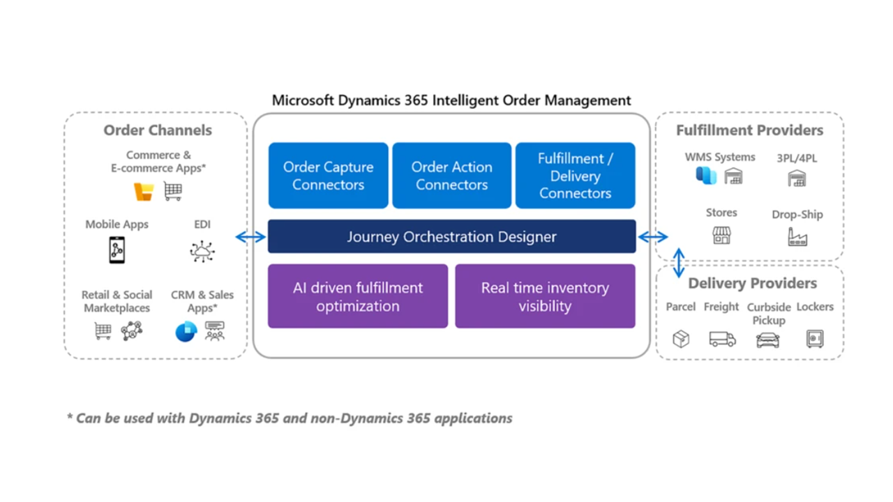
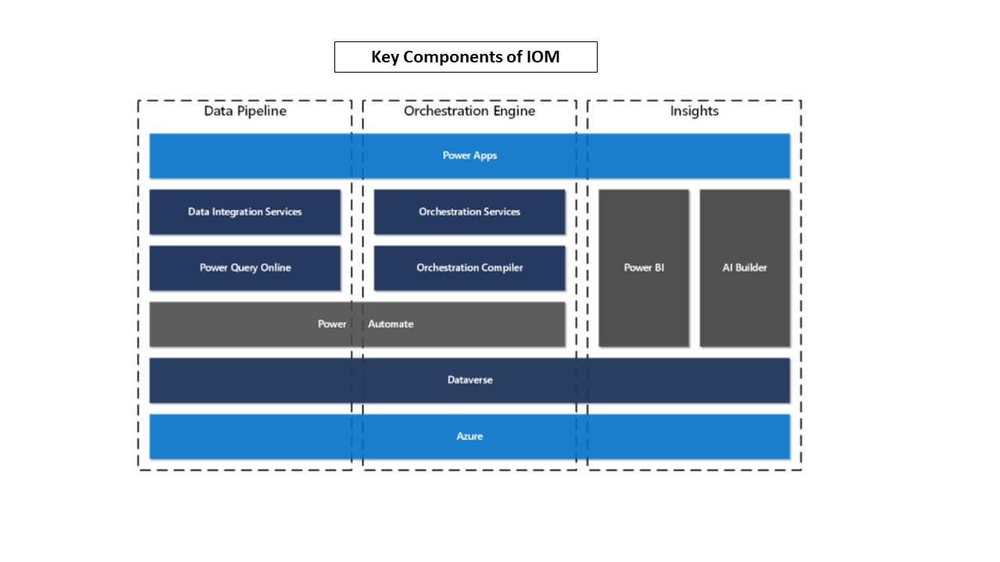

# Intelligent Supply Chain - Intelligent Order Management (IOM)

Intelligent Order Management (IOM) is  a Dynamics 365 application built on Power Platform and Dataverse.

It provides the flexibility organisations need today to capture orders from any order source such as online e-commerce, marketplace, mobile apps, or traditional sources like EDI and fulfill them from their own warehouse, 3PL (third-party logistics), stores, or drop-ship with vendors or other delivery fulfillment partners.

It’s a common scenario for enterprises to have disparate systems for ecommerce, fulfillment, and shipping/delivery. IOM bridges these disparities and provides a single pane of glass to manage end-to-end lifecycle of an Order. [Extensibility features](https://docs.microsoft.com/en-us/dynamics365/intelligent-order-management/extensibility) allow customers to integrate IOM with their existing ecosystem of applications. There are several reasons where customers may end up with disparate systems - certain retail capabilities may have been enabled by a retailer at different points in time.

The system also helps organizations streamline the return processes. Whether returns are collected at a retail store, fulfillment center, or service center, returns can be initiated through an app, online, or at the store.

With low-code, no-code experience, IOM’s orchestration designer tools allow users to model and automate the response to fulfillment constraints and leverage machine learning to influence & optimize the flow of the orders.

## Building blocks for IOM

IOM is a Dynamics 365 app designed and built on Microsoft Dataverse. It also relies on Power Platform capabilities such as Power BI; Automate; and Flow for enabling its key features -  Providers; Orchestration and Insights. It shares the common data model with other apps in the Dynamics 365 family, however it does not depend on any other D365 apps and can be enabled on its own.

## Goals of IOM

- IOM is designed to provide single pane of glass for managing end to end lifecycle of an order across disparate applications and platforms. This enables customers to choose best in class applications for commerce and fulfillment.
- It is designed for customers that are implementing business to consumer, direct to consumer, and business to business order process flows.
- It's designed to deliver low-code development experience.

## Order Lifecycle Management

The lifecycle of an order in Order Management can be described as a series of states and actions. Some of these might be optional or might occur in different sequences, based on the system configuration. In addition, some actions might be configured to occur automatically or to be performed manually. The main stages of an order are – order intake and creation; fulfillment; and delivery.

Intelligent Order Management helps you make order fulfilment a competitive advantage. By orchestrating and automating fulfilment using real-time omnichannel stock data, AI, and machine learning, Dynamics 365 Intelligent Order Management lets you adapt quickly, fulfil efficiently, and deliver on your order promise.

## Architecture

Intelligent Order Management, built on Power Platform, seamlessly integrates with existing systems through the provider connector framework, providing order orchestration capabilities to help you deliver on your business strategy through order, orchestration, fulfillment, optimization, inventory visibility and fulfillment insights.

IOM shares the Common Data Model with Dynamics 365 applications to facilitate back-office application support for your customer service & sales representatives.

The core architecture of IOM has three main components:

- Data Pipeline
- Orchestration Engine
- Insights

**Data pipeline** consists of integration services and Microsoft Power Query online, which is a transformation engine for the connectors and the orchestration engine. The data pipeline in Intelligent Order Management provides the foundation for the providers to move data in and out of the app.

A **pipeline** is composed of:

- Provider
- Connectors
- Connection
- Data transformations
- Business events
- Provider action

**Orchestration engine** orchestrates a business process flow. Order-to-fulfillment flow is complex to model in a single business app, but when combined with other cloud services and supply chain partner systems, the complexity grows. To help business users in the organization to visualize and manage this complexity, Intelligent Order Management ships with a business orchestration designer. Business process flows designed with the orchestration designer are compiled into Power Automate flows when the flow is published.

Components of orchestration engine:

- Designer
- Orchestration flow types – Order Flow and Inventory Flow
- Policies
- Step

The orchestration engine’s components uses an orchestration compiler to compile the business process flows into Power Automate. The orchestration builder offers low code, no code experience for building pipelines.

Under **fulfillment optimization** capabilities, you can construct unlimited fulfillment nodes, bring your own, configure the native distribution order management engine. You can set up flexible order validation rules for easy order routing. With the provider connector capabilities, you can work with warehouse management systems, 3PLs, or other fulfillment systems you’ve chosen for your supply chain needs, based on the connectors we will provide and also partners will provide.

In **inventory visibility**, we have a highly scalable microservice that enables real-time, on-hand inventory tracking with a global view of inventory visibility, external system access through restful APIs. And you can use it as a foundation to build available to promise processing for your business processes.

In fulfillment insights, analytics monitor order through to fulfillment supply chain, out-of-the-box, customizable dashboards to monitor key metrics. AI-based anomaly detection models provide the visibility the order from fulfillment through to delivery and communicate that to the people and the systems that need that visibility in your organization.

**Insights** is built on Power BI and AI Builder. Intelligent Order Management provides several dashboards to help the business user understand key order and fulfillment metrics. Machine learning is used to analyze data using models and uses advanced algorithms to find or predict patterns in data. Customers can build models using AI builder that use data from Intelligent Order Management, so that results are updated on entities used during the order and fulfillments flows. This will help decision making in orchestration flows.

## Dynamics 365 Integration

IOM is a D365 app, however it does not depend on any of the other D365 apps from deployment perspective. It can be deployed as a standlone D365 app.

## Azure Integration

IOM does not have any dependency on any Azure service from deployment perspective; however, if a customer chooses to enable **Dynamics 365 Inventory Visibility** Provider then an Azure `Subscription` and a `Storage Account` is required.

In addition to the aforementioned default Provider, customers may also create custom Providers which could leverage one or more Azure services to fulfil their requirements.
In such a scenario, an IOM will have a depedency on Azure.

> Note: Whilst `Providers` enable integration with external applications, it's not mandatory to enable all of the default `Providers`. Recommendation is to enable the ones which are required to fulfill business requirements.

## Planning Guidelines for IOM

This section provides prescriptive guidance with design considerations and recommendations across the critical design areas for IOM deployment.

IOM is an application built on Power Platform and Dataverse. For most part, it will inherit design decisions adopted for the `tenant` and the `environment` where it's provisioned.

> Note: Reference to `Environment` here is in context of Power Platform and it's not to be confused with environment in a traditional sense (Dev, Test, Prod etc.).. More details are available [here](https://docs.microsoft.com/en-us/power-platform/admin/environments-overview). n environment is a space to store, manage, and share your organization's business data, apps, chatbots, and flows.

### Licensing and AD Tenants

### Security, Governance and Compliance

### Environments

### Management and Monitoring

### Business Continuity and Disaster Recovery

### Connectivity and Interoperability

### Platform Automation and DevOps

### Identity and Access Management

> Note: In this guidance, `environment` refers to [Power Platform environments](https://docs.microsoft.com/en-us/power-platform/admin/environments-overview) unless otherwise called out explicitly.

### Power Platform Environment for IOM

A deployment of IOM resides within an environment.. A tenant can support multiple environments which in turn offer a container to deploy reources such as Flow, Dataverse etc. to support a D365 app such as IOM.

- At a bare minimum, we recommend having at separate instances of IOM for development, test and production environments.
- Keeping in line with the [North Star Architecture for Power Platform](https://github.com/microsoft/industry/tree/main/foundations/powerPlatform#environments), as a principle, we recommend using Power Platform `Environments` as the scale-unit and management boundary. An `environment` will also dictate region.
- Within a retail setting, IOM plays a role of **providing a single pane of glass** to manage order lifecycle. IOM provides a unique opportunity to consolidate order management operations across all businesses in an engerprise and as such, a single instance of IOM should suffice business requirements.Business acquisitions can be consolidated and leverage common partnerships for fulfillment; logistics etc. There may be scenarios where more than one instance of IOM could be deployed in a production setting. Some of the scenarios could be:
  - A customer may have multiple different businesses where each business has its own separate applications; platforms; and processes for ordering and fulfillment. In such a sceanrio, a customer may choose to deploy separate of IOM instances to align with different businesses to have a clear boundary between IOM instances.
  - A Power Platform environment construct is also tied back to a region. If a customer has businesses operating out of different geographic regions, they may choose to co-locate an IOM instance where other ecosystem; source and consumer applications are deployed.

> Note: Dynamics 365 apps can only be deployed to an environment that was created with a database with a Dynamics 365 apps enabled during the environment creation. A valid Dynamics 365 license is also required to enable Dynamics 365 apps during the environment creation.

### Providers

Provider is the primary integration feature of IOM to interact with external applications and platforms. This section focuses on considerations for deploying IOM an `Provider` at scale. We will discuss scenarios and h

`Provider` composition and details are covered in detail [here](https://docs.microsoft.com/en-us/dynamics365/intelligent-order-management/work-providers).

- IOM ships with default set of Providers which allow integration with external platforms and services such as BigCommerce; D365 Commerce etc. The default Providers are supported by Microsoft.
- For `Providers` to work, `Mapping` must be defined for external systems and IOM. For example, Item ID in an external system must be configured to
- IOM is an order management application and relies on `Providers` to interact with external systems for capabilities such as shipping; tax calculation; fulfillment etc. Various `Providers` can be called as part of an orchestration flow to perform an action or a set of actions based on business events taking place.
- For extensibility, customers can create their own `Providers`, however these are to be maintained by the customer and do not fall under the purview of Microsoft support.
- Each instance of a Provider requires a `Connection` which enables connectivity to external system or application. There's `1:1` relationship between an instance of Provider and a connection. From security and administrative point of view, one set of credentials per application per Provider is generally a good starting point as it allows administrators to have clear security and administrative boundary between a Provider and consumers.
- You can have more than one instance of a given `Provider` type within a given instance of IOM in a single `Environment`. Some of the scenarios where you may end up with multiple instances of same `Provider` type are:
  - You have may have multiple separate instances of a source system type which warrants setting up separate instances `Provider` for each instance of source system even though the source type is the same. Main reason is that connection configuration is bound to an instance of `Provider` and if you want to configure connectivity between an instance of IOM and two or more separate instances of a source system then separate `Provider` instances will be required.
    > Note: There are additional steps which must be taken to address mapping values between a source and IOM if you are connecting to multiple instances of same source system type. `Mapping` (discussed later) enables IOM to translate values between external systems and IOM.
- `Provider` use Power Automate platform and offer low-code experience and inherit scale characterstics from the underlying platform. We recommend familiarising with [Power Automate scale limits](https://docs.microsoft.com/en-us/power-automate/limits-and-config.)
- Not all Provides support AAD as an authentication and authorization mechanism. Third-party platforms such as BigCommerce rely on API keys to enable connectivity between IOM and BigCommerce. Similarly, third-party (3P) platforms such as Avalara use their proprietary authentication mechanism and rely on username and password registered with it for authentication.
- Out of the box `Providers` do not support runtime access to a keystore. Username; passwords; and/or API keys must be configured beforehand at the time of setting up a `Provider`. These are then accessed by a `Provider` to connect to an external application or a platform.
- `Providers` which connect to cloud-based Microsoft applications and platforms support AAD. Example - `Fulfilment Provider` leverage AAD to perform for authentication and authorization operations on Azure Data Lake Storage (ADLS).

## Deployment guide
