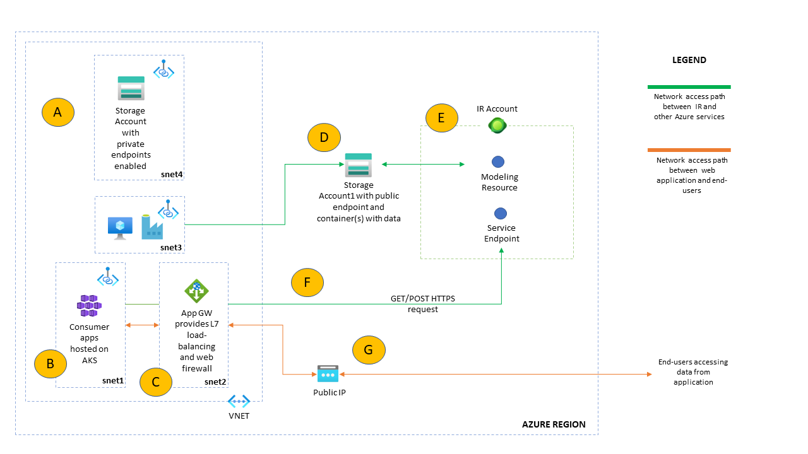
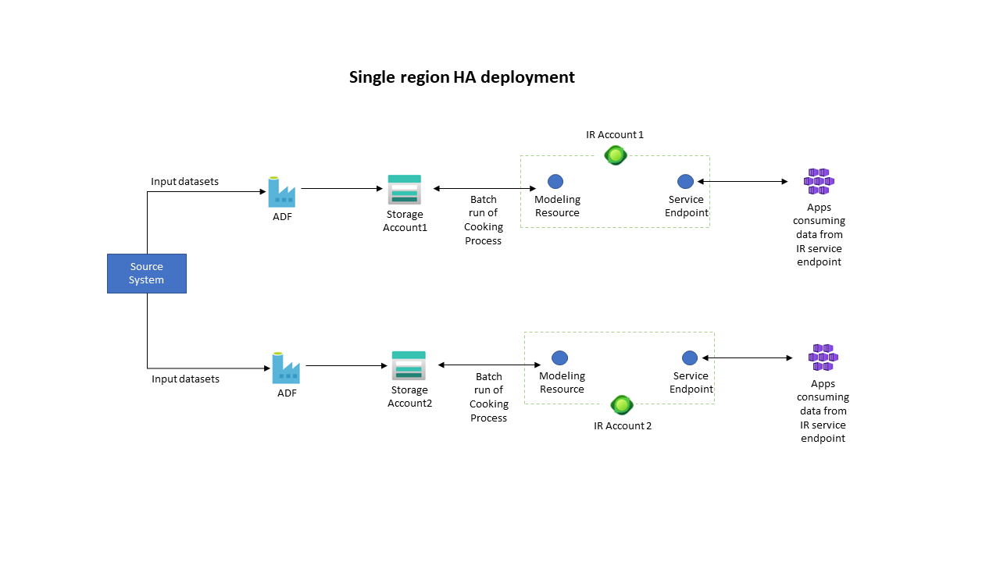
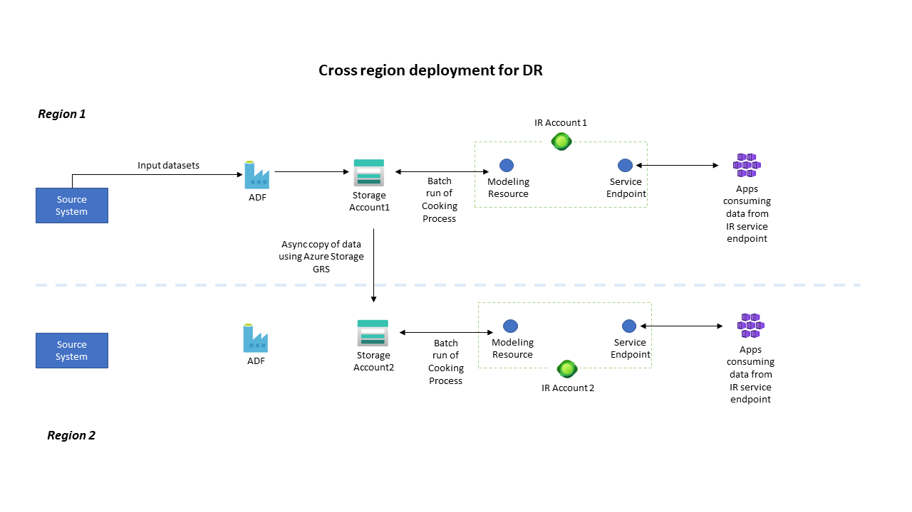

# Personalized recommendations with Intelligent Recommendations

## Table of Contents

- [Personalized recommendations with Intelligent Recommendations](#personalized-recommendations-with-intelligent-recommendations)
  - [Table of Contents](#table-of-contents)
  - [Intelligent Recommendations](#intelligent-recommendations)
    - [Capabilities](#capabilities)
    - [Architecture](#architecture)
    - [Terminology](#terminology)
    - [Integration points for IR](#integration-points-for-ir)
    - [Service flow](#service-flow)
    - [FAQ](#faq)
  - [Considerations and Recommended Practices](#considerations-and-recommended-practices)
    - [One or multiple IR and ADLS instances](#one-or-multiple-ir-and-adls-instances)
    - [Azure billing and Azure Active Directory tenant](#azure-billing-and-azure-active-directory-tenant)
    - [Identity and Access Management](#identity-and-access-management)
    - [DevOps and Automation](#devops-and-automation)
    - [Networking](#networking)
    - [Operations and Monitoring](#operations-and-monitoring)
    - [Security](#security)
    - [High Availability and Disaster Recovery](#high-availability-and-disaster-recovery)
  - [Reference Deployment Guide](#reference-deployment-guide)
  - [Automated Deployment](#automated-deployment)
  - [Known Issues](#known-issues)

## Intelligent Recommendations

[Intelligent Recommendations](https://docs.microsoft.com/en-us/industry/retail/intelligent-recommendations/overview) democratizes AI and machine learning recommendations through a codeless and powerful experience powered by the same technology that fuels Xbox, Microsoft 365, and Microsoft Azure. Businesses can now provide relevant discovery for customers with this new, innovative AI for personalization and recommendations.

Intelligent Recommendations IR) is one of the services included in Microsoft Cloud for Retail. Whilst the service as a standalone offering is new, the algorithm behind the service has been in use for a few years as part of Dynamics Commerce.

### Capabilities

The [Feature Set](https://docs.microsoft.com/en-us/industry/retail/intelligent-recommendations/deploy-intelligent-recommendations-account#add-modeling-and-serving-components) selected at the time of instantiating a `Modeling Resource` dictates type of recommendations available. At this point in time, following types of recommendations are available:

- Personalized recommendations for end users
- Similar items
- Real-time and session-based recommendations for users
- Basket completion

### Architecture

An instance of IR service consists of 3 types of resources:

- `IR account` - parent resource.
- `Modeling resource` - is a child resource and it's responsible for running the `Cooking process` and generating recommendations. An IR account can have one or more Modeling resources.
- `Service Endpoint` - is also a child resource and provides a public endpoint for consumer apps to access recommendations. Size provisioned for a Service Endpoint also predicates maximum no. of requests per second a consumer app can send to IR for reading a set of recommendations.

### Terminology

- `Cooking process` is the backend process of reading; processing and modelling data according to business needs.
- `User interactions` are the interactions between users and items that Intelligent Recommendations models learn from and use to predict future interactions. Examples of user interactions include click streams, purchases etc. The data is stored in CSV format and shipped to IR as an input.

### Integration points for IR

IR is a scalable headless service and it has two integration points:

1. ADLS Gen2 storage - all input datasets are read from ADLS. ADLS is also used for storing output logs generated by IR.
2. Frontend APIs where the recommendations (or output) are made available for apps.

### Service flow

The recommendations process can be broken down into three steps:

1. Read input datasets (user interactions such as purchase, downloads, views etc.) and configuration from an ADLS Storage Account. IR requires a specific data model and base configuration to build recommendations.The entities are defined in a `model.json` file.
2. "Cooking process" is the backend process managed by IR service where datasets (user interactions) are read from ADLS and processed by IR service. This process kicks off automatically once a Modeling resource has been configured. It's also possible to manually trigger `Cooking Process` manually via REST API. Manual trigger is capped at one for a 24-hour window.
3. Data serving part where the results are made available to the customer through a set of published APIs. This is done via Service Endpoint.

> Note: Service Endpoint is a feature of IR and not to be confused with Azure networking service endpoints.

### FAQ

- Does IR support Private Endpoints?

    No, IR doesn't support Private Endpoints. It's designed \ to be accessible over public internet. One of the use cases is to be able to integrate with eCommerce SaaS platforms such as Shopify, BigCommerce etc.

- Can users choose or modify or directly experiment with ML and AI models?

    IR is a PaaS and all model management related tasks are managed by Microsoft. As a result, customers do not have visibility of model(s) used for generating a set of recommendations. However, end users can fine-tune the results through [Flexible Filtering](https://docs.microsoft.com/en-us/industry/retail/intelligent-recommendations/fine-tune-results#flexible-filtering) and [Top candidates for recommendation lists](https://docs.microsoft.com/en-us/industry/retail/intelligent-recommendations/fine-tune-results#show-top-candidates-for-recommendations-lists).

- Monitoring the `cooking process`?

    At the time of writing this document, IR does not have APIs or Azure Monitor integration. However, based on internal benchnarks, cooking process could take up to approximtely 72 hours to process input datasets and generate recommendations. Currently, there is no SLA in place for the `Cooking process`.

- Availability of IR and data residency?

    An IR deployment requires an instance of IR service and an ADLS account where `user interactions` and `model.json` are stored.

    ADLS keeps the data in the region where ADLS service is instantiated. If IR and ADLS share the same region, then data stays within the region. However, if the Data Lake Storage account and modelling resources are in different regions, data will be copied from the Data Lake Storage region to the modelling resource region that you selected. As of Jan 2022, Intelligent Recommendations Modeling resources are available in West US and West Europe.

    Customers can choose region of modelling resources at the time of creating a `Model Instance`. Once IR instance has been created, under click on (A) Modelling blade and then (B) `Create`. Customers can then choose the region from dropdown list.
    

- How to select supported scenarios/models which are computed by IR?
    Customers can choose the feature set to model at the time of creating a Modelling instance. In IR, type of scenarios one can model are tied to the tier of Modelling instance one chooses to create.
    

    `Basic` tier includes modeling of:

        - People also buy
        - Frequently bought together
        - New
        - Trending
        - Best Selling

    `Standard` tier includes modeling scenaros under `Basic` plus:

        - Picks for you (personalization)

    `Premium` tier includes modeling scenarios under `Standard` plus:

        - Similar look (Visual similarity)
        - Similar description (NLP similarity)

- What format is supported for `user interactions` files?

    `User interactions` must be in CSV format. The definition of CSV files is available under [Data Contracts](https://docs.microsoft.com/en-us/industry/retail/intelligent-recommendations/data-contract).

- Does IR support delta or incremental processing for input datasets?

    No. The IR service cannot calculate delta for input datasets. When a dataset is provided to IR for processing, the cooking process will process all the records in the input set of files and then generate a set of recommendations based on that data.

    One option to reduce operational overhead is to extract delta from the source using an ETL tool, however from IR perspective, it expects a full dataset each time to build a set of recommendations. With this approach, one can reduce the overhead associated with full extraction on the source system side.

- Does IR have an availability SLA?

    IR is in preview and currently does not have an availability SLA in place. However, this will be in place when service goes GA.

## Considerations and Recommended Practices

### One or multiple IR and ADLS instances

From a deployment perspective, we recommend having separate instances of IR and ADLS for each environment (production, dev, test). Having separate environments will allow you to experiment and optimize the recommendations without risking any downtime or impact to production environment. Within each environment, from HA perspective, you may further choose to have more than one instance of an IR account.

> Note: IR does not ship with turnkey feature to enable HA. One must deploy a second instance of IR manually. Each instance will have its own set of resources thereby making your deployment highly available.

There maybe reasons where you may instantiate more than one instance in a given environment for reasons related to:

- Scale
- Billing and governance
- Security and/or compliance
- Co-location of resources

An IR account can support multiple `Modeling Resources` and `Service Endpoints`, however the apps which are configured to access **a single IR account** can access **all** the APIs for `Modeling` and `Service Endpoints` belonging to that account. This could be one of the reasons why you may choose to have a separate IR Account per consumer app.

***

### Azure billing and Azure Active Directory tenant

There are no IR specific deployment recommendations from EA and Billing perspective; however, we recommend customers to review the considerations and follow the recommendations for ESLZ available [here](https://docs.microsoft.com/en-us/azure/cloud-adoption-framework/ready/landing-zone/design-area/azure-billing-ad-tenant).
***

### Identity and Access Management

IR supports AAD and Azure RBAC. For an enterprise deployment, we recommend having separate instances of IR for each environment (production, development etc.).

There are 2 key principles which we will follow for building an access strategy for IR control and data planes:

- Principle of least privilege
- Segregation of duties

For **control plane** access, we recommend leveraging Azure RBAC. The control plane strategy outlined below applies to IR and it's dependent services. Azure RBAC roles will control control plane action a user group can perform on an instance of IR. Examples would include creating and deleting Modeling resources etc.

For each instance of ADLS, Modeling resource and Service Endpoint, following AAD groups must be created and then users, Managed Identities or Service Principals must be added to these groups. The rationale behind this strategy for structuring RBAC is that applications which consume data from IR will most likely have different lifecycle; security requirements; possibly different teams involved etc. Having separate user groups aligned per application per environment will enable you to administer each consumer app independent of each other.

- mi_\<app>\_\<env>\_readers
- se_\<app>\_\<env>\_readers
- adls_\<app>\_\<env>\_\<app>\_readers
- mi_\<app>\_\<env>\_\<region>\_\<app>\_writers
- se_\<app>\_\<env>\_\<region>\_\<app>\_writers
- adls_\<app>\_\<env>\_\<region>\_\<app>\_writers
- mi_\<app>\_\<env>\_\<region>\_\<app>\_admins
- se_\<app>\_\<env>\_\<region>\_\<app>\_admins
- adls_\<app>\_\<env>\_\<region>\_\<app>\_admins  

For Azure RBAC, unless you have specific security and access control requirements, we recommend using built-in roles for readers, writers and admins for each service.

For automation, we recommend using AAD Managed Identity (MI) and assigning them appropriate Azure RBAC to for operational tasks. It's common to use multiple MI to control the blast radius and assign MI to each individual instance of IR.

For **data plane** access, we have apps which consume data from IR using Service Endpoints. This is enabled and controlled by `Endpoint Authentication` feature of IR which is configured at IR Account level. It is backed by Azure AD (AAD). Once configured, by default, it allows all accounts to read all of the data plane REST APIs belonging to that IR account. 

The figure below shows the hierarchy of an IR account and the access flow from external application perspective. External applications (A) will use AAD-backed identity to get an access token from Azure Identity Platform. The access token is then used to access the Service Endpoints (D) and Modeling Resources (E).

Endpoint Authentication basically binds an AAD SPN to an IR Account for data plane access.

The default behaviour of Endpoint Authentication assignment belonging to an IR account is that the assigned user, by default, gets read access to all Modeling and Service API endpoints as shown in the figure above. There is no configuration switch or parameter to change this behaviour of Endpoint Authentication.

> Note: It's not possible to modify this assignment through Azure RBAC as this binding between an IR Account and an App ID is done at the backend and not visibile under role assignment. Feedack has been passed on to the product engineering team.

The section discusses the risks and mitigation strategies:

- **Risk - An App ID may trigger `cooking process` for a Modeling resource.**
  By default, once an App ID is granted access to API via Endpoint Authentication process, it can access all APIs under Modeling and Service Endpoints belonging to that IR account. This means that there's a risk that an application ID, if compromised or accidentally, may trigger the `cooking process` for a different Modeling resource. The impact here is that once cooking process has been initiated, it will process the data which is present in the storage account at that point in time. This may lead to different results in case input data has changed. IR Service Endpoint will continue using recommendations from the previous run of the Cooking process while the Cooking process is processing new insights.

  > Note: A Modeling resource has a cap on number of times the Cooking Process can be manually triggered. This cap is currently configured at once every 24 hours.
  
  To mitigate this risk, we recommend protecting the authentication keys using Azure Key Vault, and to configure consuming apps to access them at runtime. In addition, we also recommend configuring an appropriate timeout value for the authorization token issued by AAD identity platform.

  We also recommend having separate App ID for each individual consumer app because it will provide clear auditability and also enable administrators to limit blast radius in case of a compromise of credentials associated with an app. Example - One can revoke access for an App ID associated with a single app thereby not impacting other apps which rely on the same IR account for recommendations.

- **Risk - Data Exfiltration and Manipulation of Backend Data.** The data which is accessible via the endpoints is already meant for public consumption and IR does not rely on PII data for generating recommendations. Having said that, measures such as using separate app ID; rotation of client secret etc. must be implemented as these are best practices for handling application credentials. As far as data modification risks are concerned, it's worth noting that manority of the IR REST APIs support `GET` request, however there are a few which use `POST`. The APIs which use `POST` are built for triggering backend processes such as `Cooking process`, and these cannot manipulate data.

In a standard deployment of IR, input datasets reside on ADLS and individual apps do not require direct access to these datasets on ADLS. For all purposes, the consumer apps just require access to Service Endpoint, hence base input data on ADLS cannot be modified where credentials for apps are compromised unless of course you have granted access to the apps to access ADLS. Best practice is to not grant the apps any access to ADLS. This approach ensures that an App ID cannot modify or exfilterate the input datasets.

***

### DevOps and Automation

As with other Azure services, we recommend using IaC approach to deploying and managing IR Account and its complementary services such as ADLS.

> Note: At the time of writing this document, IR doesn't ship with Bicep support. This may become available at a point in time in future.

> Note: IR, just like any other Azure-based resource, supports ARM however, at the time of writing of this documentation, the `Export template` experience from Azure Portal is not supported.

***Model Management and MLOps***

MLOps is a relatively new trend and it is targeted at data scientists similar to what DevOps does for developers and engineers. This section highlights key areas of MLOps and how they apply to Intelligent Recommendations (IR).

> Note: A key thing to remember here is that IR is a PaaS which means that a large surface area associated with general technical operations and model management are obfuscated from end-users. As a result, some aspects of MLOps do not apply to IR.

- **Source Control** The code behind models used for recommendations is not accessible to end-users or customers. However, customers can experiment by modifiying data entities and their attributes defined in `model.json` file. The changes committed to `model.json` can be tracked via version control such as Azure DevOps Repo or GitHub.

- Following aspects of MLOps are managed by Microsoft:
  - Training pipeline
  - Model packaging
  - Model validation
  - Model deployment
  - Model training

***Release Management***

This section focus on release management in context of Intelligent Recommendations service. IR offers following levers to fine tune results and experiment with the recommendations:

- [Flexible filtering](https://docs.microsoft.com/en-us/industry/retail/intelligent-recommendations/fine-tune-results)
  
- [Data Contracts and entities defined in](https://docs.microsoft.com/en-us/industry/retail/intelligent-recommendations/data-contract#data-contracts) `model.json`

> Note: We are not focusing on release management in context of applications which are consuming output of IR as there is plenty of documentation out in public domain which talks to those themes.

There are fundamental building blocks and capabilities which enable various release management strategies such as Canary; Blue-Green deployments; and A/B testing. These are:

- Ability of an IR account to support multiple Modeling resources and Service Endpoints.
- DevOps tooling such as Azure DevOps (ADO) and its features Pipelines and Repos.
- Runtime environment such as AKS along with networking capabilities which supports balancing traffic between multiple application endpoints.

> Note: In addition to parameters in `model.json`, customers can also experiment with different types of Modeling Endpoints (Basic, Standard or Premium) and adopt deployment strategies discussed below.
  

Using the setup depicted in the figure shown below, customers can build and deploy complex release strategies.
  
An application (shown as F) has > 1 instances hosted on a runtime environment (H) which supports layer 7 load balancing. Each application instance is connecting to two separate Service Endpoints (D and E). The overarching idea is that each Service Endpoint is using different Modeling Reource each of which is driven by parameters declared in `model.json` files (C). Driving the recommendations are datasets hosted inside two separate Azure storage containers (A).

Customers can experiment with input datasets and variables defined in `model.json` to fine tune the recommendations. This IR deployment model combined with capabilities of application runtime environment such as AKS (H) enables customers to implement release management strategies such as Canary; Blue-Green deployments; and A/B Testing.

> Note: IR supports multiple endpoints, however one would require external capabilities such as network load balancing (such as Azure Application Gateway) and application runtime environment to enable end-to-end release management scenarios discussed here.

***

### Networking

This section discusses networking considerations and strategies for an IR deployment.

> Note: At the time of writing this guidance, IR doesn't support Azure Private Endpoints or a feature to disable connectivity over public endpoint. The APIs published by IR for Modeling Resources and Service Endpoints are routable over public networks, however a key is required by consumer apps to access these endpoints and this adds another layer of security.

For a deployment of IR to function, it requires access to a Storage Account which supports public endpoint where customers will host input datasets. The same Storage Account is also used by IR to write output processing logs.

The figure below discusses a deployment strategy where a Storage Account with public endpoint (D) is instantiated for dedicated use with an instance of IR (E). Whilst this Storage Account has an internet routable address, access for any read/write operations is governed by Azure RBAC. The source systems and other services which are not mandatory for an IR deployment hosted on a VNET (A, B and C) with private IP. With this strategy, systems which handle sensitive data or IP continue to reside on VNET and only the subset of the data which is required for recommendations, is copied across to a Storage Account which is bound to a Modeling resource belonging to an IR Account (D and E).

> Note: Service Endpoint is a feature of IR and it's not to be confused with Azure networking service endpoints.

***

### Operations and Monitoring

  *Control plane* actions are captured in the `Activity Logs` and should be exported to a Log Analytics Workspace similar to any other Azure service.

  In terms of observability, at the time of writing of this guidance, IR offers limited features to monitor various aspects of an IR Account such as status of model processing; requests/sec hitting a `Service Endpoint`; resource usage etc.
  
  > Note: Although there is no SLA for the `Cooking Process`, depending on size of data inputs, the cooking process can take up to a maximum of 72 hours. The `Cooking process`, once deployed, continues to process data through a periodic cooking cycle. By default, the data cooking cycle occurs every 36 hours.
  
  IR generates logging and error reports which are written back to the ADLS account configured for use with the Modeling instance. The logs are generated in JSON and currently no turnkey feature exists to integrate them with Azure Monitor. To address this, we recommend piping the logs through to Log Analytics Agent v1.1.0-217+. The details are captured [here](https://docs.microsoft.com/en-us/azure/azure-monitor/agents/data-sources-json). This would require provisioning an Azure VM with Log Analytics Agent installed to process and parse the logs before writing them to LA Workspace as Custom Logs. The [error logs](https://docs.microsoft.com/en-us/industry/retail/intelligent-recommendations/error-logging) track the following metrics and messages:
    - Total Record Count
    - Total Dropped Records
    - Error messages

An alternate approach could be to leave the logs in JSON format, however it does mean that a runtime environment maybe required to analyse the logs in case of an operational issue.

> Note: At the time of writing of this guidance, IR didn't support turnkey features for enabling Diagnostics Logs.

For all other services such as ADLS, ADF etc. we recommend enabling collection of Activity Logs and Diagnostic Logs which can be enabled by implementing Azure Policy.

***

### Security
  
This guidance assumes that the source systems and data stores which support Private Endpoints have this (PE) feature enabled. This guidance focuses on threat surface area associated with the resources and services have a publicily routable IP address. This includes -

1. ADLS account used by IR for storing files.
2. IR account
3. Modeling endpoint
4. Service endpoint

***ADLS***

In context of IR, ADLS is used to store input data files and log files generated by IR. In line with security and privacy principles, none of the input files should contain any PII or payment card data.

> Note: For building a set of recommendations, IR **does not** require any PII or payment data. Please refer to [Data Contract Reference](https://docs.microsoft.com/en-us/industry/retail/intelligent-recommendations/data-contract#interactions) for details of attributes and fields required to drive various types of recommendations. Based on the input datasets, an organisation can carry out analysis and determine the risk to their deployment.

Security recommendations for Azure Storage have been published [here](https://docs.microsoft.com/en-us/azure/storage/blobs/security-recommendations). From networking perspective, Private Endpoints are not supported so Azure Storage must have a public endpoint. To lockdown the access, [grant access to trusted Azure services](https://docs.microsoft.com/en-us/azure/storage/common/storage-network-security?toc=%2Fazure%2Fstorage%2Fblobs%2Ftoc.json&tabs=azure-portal#grant-access-to-trusted-azure-services).

> **Note:** Network access is one layer of security. Authentication and Azure RBAC provides another layer of security to protect against malicious actors.

We also recommend enabling [Network Routing preference for Azure Storage](https://docs.microsoft.com/en-us/azure/storage/common/network-routing-preference?toc=/azure/storage/blobs/toc.json). This feature ensures that traffic from the internet is routed to the public endpoint of your storage account over the Microsoft global network. Azure Storage provides additional options for configuring how traffic is routed to your storage account.

At a bare minimum, we recommend using separate ADLS accounts for each environment with separate containers per app. To further reduce the blast radius and risks associated with exfiltration of data, we recommend a dedicated Storage Account for use with IR which only houses datasets required for Intelligent Recommendations.

You may also want to consider multiple ADLS accounts for a single IR account for the following reasons:

- Scale - there are scale limits associated with each storage account. Perhaps you might want to scale beyond limits supported by a single instance.
- Regulatory - region of deployment is determined by a Storage Account and a customer may have regulatory or data residency requirements.
- Domain alignment - if your organisation is structured around domains, then you may choose to have domain-aligned storage accounts. This also provides a boundary between different teams.
- Security - having separate Storage Accounts can help you spread the risk across multiple accounts.
  
***IR Account***

An IR account is an instance of service and provides control plane for deploying and configuring Modeling and Service endpoints. An IR account itself doesn't doesn't handle data per se. Instances of Modeling and Service endpoints belonging to an IR account handle the actual data. From threat surface area perspective, IR account can be modified via one of the following Azure Portal, CLI or SDK by a malicious actor. Hence, Azure RBAC must be configured to control access to IR account.

- Each environment must have separate IR accounts. This is allow for separation between environments and give flexibility around implementing different RBAC across environments.
- You may also consider separate IR accounts from `Endpoint Authentication` perspective. `Endpoint Authentication` is the authentication mechanism which allows external applications and users to connect to Service Endpoints attached to an IR account. By design, once an `application ID` is granted access to IR Account, it inherits read access to all of the Service and Modelling Endpoints associated with that IR.
- You may also consider deploying multiple IR acconts if your application has different CORS requirements. Similar to `Endpoint Authentication`, CORS configuration is tied to an instance of IR account and thus, all endpoints belonging to an IR account inherit CORS configuration.
  
***Modeling Endpoint***

As discussed earlier, data plane access to Modeling Endpoint is configured at IR Account level through `Endpoint Authentication` parameter.

- Access to the control plane for a Modeling Endpoint is configured by Azure RBAC.
- Access to the data plane for a Modeling Endpoint is configured via Endpoint Authentication configured at IR account level.
- We recommend organisations to review the input datasets which IR relies upon for building recommendations and then assign an appropriate security risk rating to an IR deployment.
- An external application interacts with Modeling Endpoint via a set of [REST APIs](https://docs.microsoft.com/en-us/rest/api/industry/intelligent-recommendations/). As such, security risks associated with REST APIs must be considered for Modeling Endpoints. 

Here are the top risks and a commentary on how these are addressed:
  
- Support for HTTPS: These are enabled by default and cannot be disabled. All API calls take place over HTTPS.

- Rate limiting and throttling: A `Modeling Endpoint` exposes API which allows customers to resubmit jobs. The API can only be called once every 24 hours.
  
- Unprotected identity and keys: An external app an interact with a Modeling Endpoint using AAD backed app identity. As a best practice, we recommend storing the secret in Azure Key Vault which an application can access at runtime.

- Unencrypted payload: The interaction and data exchange between ADLS and Modeling Endpoint takes place over Microsoft's network backbone using HTTPS protocol.

- Weak API keys: As highlighed earlier, AAD backed app ID and secret to call the Modeling Endpoint APIs.
  
- Injection: APIs validate inputs from the applications to reduce risk associated with injection vectors.

***Service Endpoints***

The Service Endpoint (SE) supports the APIs which are referenced by applications to fetch recommendations generated by IR. The same set of risks highlighted for Modeling Endpoint apply to SE REST APIs. There are a few differences which are called out here:

- To ensure QoS, Service Endpoints an instance is instantiated with a pre-allocated capacity which controls maximum transactions-per-second allowed for a given endpoint.

- In a scenario where a single IR account has multiple Modeling and Service Endpoints, it's worth noting that the applications granted access to the endpoints through `Endpoint Authentication` feature, have read access to all the APIs belonging to all Modeling and Service Endpoints belonging to an IR account.

***

### High Availability and Disaster Recovery

For a highly available deployment of IR, we recommend deploying at least two separate instances of IR account in a region. This must be colocated with Azure Storage and all downstream apps which will consume insights from IR for performance reasons.

> Note: For Azure Storage account (ADLS), recommendations for HA-DR are published [here](https://docs.microsoft.com/en-us/azure/storage/common/storage-disaster-recovery-guidance).

> Note: The aforementioned model can also be extended to support HA across multiple regions.

For DR, the above scenario can be extended to multiple regions so that services operate across multiple regions. Whilst Azure Storage ships with native in-built capabilities to failover to secondary region, IR currently does not ship with this feature. Depending on recovery targets, customers may choose to either pre-provision IR in a second region or keep it in an active standby state.

As shown in the figure below, IR along with Azure Storage and application runtime environment can be deployed to a second region for high availability and DR. In this scenario, we are leveraging Azure Storage's native replication feature to copy data to secondary region. If the first region is unavailable, source system and ADF pipelines pre-provisioned in the second region will become active and start feeding input datasets to the Storage Account in the second region.

- From DR perspective, depending on recovery target for your workload, you may choose to pre-provision a second instance of IR. This will typically be the recommended approach if your recovery target are in order of minutes or hours. In context of IR, the `Cooking Process` is the part which takes the longest. Pre-provisioning an instance of IR in a second region can address this challenge.

- If RTO of your application workload is in order of days, you may choose to deploy IR in the second region **after** a disaster has been declared by your business and IT teams. Point to call out here is that the `Cooking process` will run once a Modeling Resource has been configured and this can take a few hours to complete depending on volume of input datasets. This is only recommended if your workloads have a generous RTO target.

> Note: The difference between pre-provisioning IR versus provisioning IR post disaster has been declared is that the `Cooking process`, which is responsible for processing and generating recommendations, will only run once a Modeling resource has been configured and deployed.

***

## Reference Deployment Guide

For reference implementation of Azure Intelligent Recommendation (IR), we recommend leveraging Azure Data Management and Analytics scenario guidance. IR is an ML service and it requires other complementary services such as Azure Data Factory (for data movement) and Azure Data Lake Storage (for storage). Rationale being that it relies heavily on complementary services such as ADLS (for storage) and Azure Data Factory (for pipelines).

The reference implementation of IR builds upon [Azure Data Management and Analytics (DMA) - Data Product Analytics](https://github.com/Azure/data-product-analytics#data-management--analytics-scenario---data-product-analytics).

An enterprise-scale deployment of IR will consist of multiple instances of Modelling and Service Endpoints. This must be complemented with ADLS (to store incoming data) and ADF (to move data between various source systems and ADLS). Whilst an ADLS account is mandatory for deployment of IR, ADF is optional, however a similar product/service capable of implementing data pipelines must be implemented. As such, DMA Data Product Analytics scenario offers a good starting point for such deployment.

> Note: Adoption and implementation of DMA is not mandatory for deploying IR and its complimentary services, however DMA architecture and recommendations have been built for at-scale deployment encompassing principles of security, governance and self-serve. Hence, we are using DMA as for reference implementation.
  
## Automated Deployment

*Coming soon*

## Known Issues
