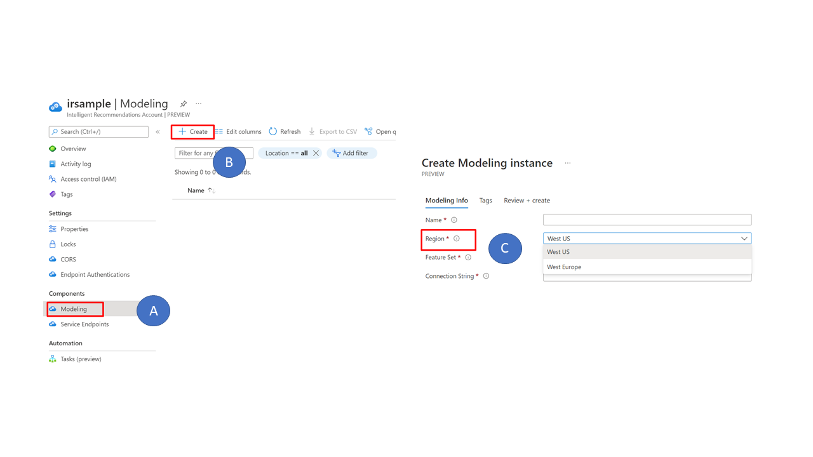

# Intelligent Recommendations

---

| Reference implementation | Description | Deploy |
|:----------------------|:------------|--------|
| Intelligent Recommendations | Deployment of Cloud-Scale Analytics scenario with Intelligent Recommendations service | [Deployment Guide](#deployment-guide)

[Intelligent Recommendations](https://docs.microsoft.com/industry/retail/intelligent-recommendations/overview) democratizes AI and machine learning recommendations through a codeless and powerful experience powered by the same technology that fuels Xbox, Microsoft 365, and Microsoft Azure. Businesses can now provide relevant discovery for customers with this new, innovative AI for personalization and recommendations.

The [Feature Set](https://docs.microsoft.com/industry/retail/intelligent-recommendations/deploy-intelligent-recommendations-account#add-modeling-and-serving-components) selected at the time of instantiating a `Modeling Resource` dictates type of recommendations available. At this point in time, following types of recommendations are available:

- Personalized recommendations for end users
- Similar items
- Real-time and session-based recommendations for users
- Basket completion

## Prerequisites

In line with Cloud-Scale Analytics guidance, following prerequisites must be fulfilled:

- Prerequisites for Cloud-Scale Analytics [Data Management](https://github.com/Azure/data-management-zone/blob/main/docs/DataManagementAnalytics-Prerequisites.md) and [Data Landing Zones](https://github.com/Azure/data-landing-zone/blob/main/docs/DataManagementAnalytics-Prerequisites.md)

- User Access Administrator or Owner access to the subscription to be able to create a service principal and role assignments for it.

## Key Capabilities and Architecture

### Architecture

An instance of IR service consists of 3 types of resources:

- `IR account` - parent resource.
- `Modeling resource` - is a child resource and it's responsible for running the `Cooking process` and generating recommendations. An IR account can have one or more Modeling resources.
- `Service Endpoint` - is also a child resource and provides a public endpoint for consumer apps to access recommendations. Size provisioned for a Service Endpoint also predicates maximum no. of requests per second a consumer app can send to IR for reading a set of recommendations.

IR is a scalable headless service and it has two integration points:

1. ADLS Gen2 storage - all input datasets are read from ADLS. ADLS is also used for storing output logs generated by IR.
2. Frontend APIs where the recommendations (or output) are made available for apps.

### Important Processes and Key Terms

- `Cooking process` is the backend process of reading; processing and modelling data according to business needs.
- `User interactions` are the interactions between users and items that Intelligent Recommendations models learn from and use to predict future interactions. Examples of user interactions include click streams, purchases etc. The data is stored in CSV format and shipped to IR as an input.

Full details about the processes associated with the service are available on [Microsoft Docs](https://docs.microsoft.com/industry/retail/intelligent-recommendations/architecture)

### High-Level Process

The process of generating recommendations can be broken down into three steps:

1. Read input datasets (user interactions such as purchase, downloads, views etc.) and configuration from an ADLS Storage Account. IR requires a specific data model and base configuration to build recommendations.The entities are defined in a `model.json` file.
2. "Cooking process" is the backend process managed by IR service where datasets (user interactions) are read from ADLS and processed by IR service. This process kicks off automatically once a Modeling resource has been configured. It's also possible to manually trigger `Cooking Process` manually via REST API. Manual trigger is capped at one for a 24-hour window.
3. Data serving part where the results are made available to the customer through a set of published APIs. This is done via Service Endpoint.

> Note: Service Endpoint is a feature of IR and not to be confused with Azure networking service endpoints.

## Deployment Considerations and Recommendations

The deployment of IR uses Cloud-Scale Analytics Scenario as its foundations. It enables a [data management subscription](https://github.com/Azure/data-management-zone) and [analytics subscription](https://github.com/Azure/data-product-analytics) where IR and all its dependent services such as ADLS etc. are deployed.

For most part, the critical design areas outlined by [Enterprise-Scale Landing Zones](https://docs.microsoft.com/azure/cloud-adoption-framework/ready/landing-zone/design-areas) are addressed as part of Cloud-Scale Analytics scenario. However, we will call out the areas which are specific to IR implementation, and have an implication on scale, performance and security of your deployment.

### Data residency

An IR deployment requires an instance of IR service and an ADLS account where `user interactions` and `model.json` are stored.

ADLS keeps the data in the region where ADLS service is instantiated. If IR and ADLS share the same region, then data stays within the region. However, if the Data Lake Storage account and modelling resources are in different regions, data will be copied from the Data Lake Storage region to the modelling resource region that you selected. As of Jan 2022, Intelligent Recommendations Modeling resources are available in West US and West Europe.

Customers can choose region of modelling resources at the time of creating a `Model Instance`. Once IR instance has been created, under click on (A) Modelling blade and then (B) `Create`. Customers can then choose the region from dropdown list.

    

### One or multiple IR and ADLS instances

From a deployment perspective, we recommend having separate instances of IR and ADLS for each environment (production, dev, test). Having separate environments will allow you to experiment and optimize the recommendations without risking any downtime or impact to production deployment. Within each environment, from HA perspective, you may further choose to have more than one instance of an IR account.

There maybe reasons where you may instantiate more than one instance in a given environment for reasons related to:

- Scale (Not this would require external load balancing to route traffic between instances of IR)
- Billing and governance
- Security and/or compliance
- Co-location of resources where you may have different business units in different geographical locations

An IR account can support multiple `Modeling Resources` and `Service Endpoints`, however the apps which are configured to access **a single IR account** can access **all** the APIs for `Modeling` and `Service Endpoints` belonging to that account. This could be one of the reasons why you may choose to have a separate IR Account per consumer app.

### Identity and Access Management (IAM)

IR supports AAD and Azure RBAC for data plane and control planes.

General recommendations covered as part of [ESLZ  identity design area apply here](https://docs.microsoft.com/azure/cloud-adoption-framework/ready/landing-zone/design-area/identity-access), however we will call out a few considerations which are specific to IR.

- For each instance of IR, we recommend separate AAD groups and Azure RBAC. This will enable you to manage seprate instances of IR and it's dependent components (ADLS, Service Endpoint, Modeling Resources) separately without impacting each other.

- For automation, we recommend using AAD Managed Identity (MI) and assigning them appropriate Azure RBAC for operational tasks.

- For **data plane** access, we have apps which consume data from IR using Service Endpoints. This is enabled and controlled by `Endpoint Authentication` feature of IR which is configured at **IR Account level** and it is backed by Azure AD (AAD). Once configured, by default, it allows all accounts to read all of the data plane REST APIs belonging to that IR account.

  The figure below shows the hierarchy of an IR account and the access flow from external application perspective. External applications (A) will use AAD-backed identity to get an access token from Azure Identity Platform. The access token is then used to access the Service Endpoints (D) and Modeling Resources (E). The `Endpoint Authentication` feature of IR basically binds an AAD account to an IR Account for data plane access.

- The default behaviour of Endpoint Authentication assignment belonging to an IR account is that the assigned user, by default, gets read access to all Modeling and Service API endpoints as shown in the figure above. Currently, there is no option to change this behaviour of `Endpoint Authentication` feature. To achieve separation, use separate IR instances.

  > Note: It's not possible to modify this assignment through Azure RBAC as this binding between an IR Account and an App ID is done at the backend and not visibile under role assignment.

- By default, once an App ID is granted access to API via Endpoint Authentication process, it can access all APIs under Modeling and Service Endpoints belonging to that IR account. This means that there's a risk that an application ID, if compromised or accidentally, may trigger the `cooking process` for a different Modeling resource. The impact here is that once cooking process has been initiated, it will process the data which is present in the storage account at that point in time. This may lead to different results in case input data has changed. IR Service Endpoint will continue using recommendations from the previous run of the Cooking process while a fresh cycle of Cooking process is initiated.

  > Note: A Modeling resource has a cap on number of times the Cooking Process can be manually triggered. This cap is currently configured at once every 24 hours.
  
  To address this, we recommend having separate App ID and separate IR instances for each individual consumer app because it will provide clear auditability and also enable administrators to limit blast radius in case of a compromise of credentials associated with an app. Example - One can revoke access for an App ID associated with a single app thereby not impacting other apps which rely on the same IR account for recommendations.

- In a standard deployment of IR, datasets which are inputs for Intelligent Recommendations service reside on an ADLS and apps which consume recommendations generated by IR do not require direct access to these datasets. For all purposes, the consumer apps just require access to Service Endpoint of IR from where they can fetch recommendations using REST APIs. Hence, the data stored on ADLS which is used by IR cannot be modified where credentials for apps are compromised unless of course you have configured/assigned RBAC for an app to access ADLS. Best practice is to not grant any access to consumer apps any access to underlying ADLS. This approach ensures that an App ID cannot modify or exfilterate the input datasets. A consumer app should only have read access to an IR Service Endpoint.

### DevOps and Automation

In line with [Azure ESLZ guidance design area for automation and DevOps](https://docs.microsoft.com/azure/cloud-adoption-framework/ready/landing-zone/design-area/platform-automation-devops), we recommend using IaC approach to deploying and managing an IR Account. This section will focus on automation; DevOps; release management areas specific to an instance of IR and it's sub-components (Service Endpoints, Modeling Resource etc.)

> Note: At the time of writing this document, IR doesn't ship with Bicep support. This may become available at a point in time in future. Also, the `Export template` experience from Azure Portal is not supported currently.

***Model Management and MLOps***

MLOps is a relatively new trend and it is targeted at data scientists similar to what DevOps does for developers and engineers. This section highlights key areas of MLOps and how they apply to Intelligent Recommendations (IR).

> Note: A key thing to remember here is that IR is a PaaS which means that a large surface area associated with general technical operations and model management are obfuscated from end users. As a result, some aspects of MLOps do not apply to IR.

- **Source Control** The code behind models used for recommendations is not accessible to end users or customers. However, customers can experiment by modifiying data entities and their attributes defined in `model.json` file. The changes committed to `model.json` can be tracked via version control.

- Following aspects of MLOps are managed by Microsoft:
  - Training pipeline
  - Model packaging
  - Model validation
  - Model deployment
  - Model training

***Release Management***

This section focus on release management in context of Intelligent Recommendations service. IR offers following levers to fine tune results and experiment with the recommendations:

- [Flexible filtering](https://docs.microsoft.com/industry/retail/intelligent-recommendations/fine-tune-results)
  
- [Data Contracts and entities defined in](https://docs.microsoft.com/industry/retail/intelligent-recommendations/data-contract#data-contracts) `model.json`

> Note: We are not focusing on release management in context of applications which are consuming output of IR as there is plenty of guidance available on managing and automating application lifecycle.

There are fundamental building blocks and capabilities which enable various release management strategies such as Canary; Blue-Green deployments; and A/B testing. These are:

- Ability of an IR account to support multiple Modeling resources and Service Endpoints.
- DevOps tooling such as Azure DevOps (ADO) and its features Pipelines and Repos.
- Runtime environment such as AKS along with networking capabilities which supports balancing traffic between multiple application endpoints.

> Note: In addition to parameters in `model.json`, customers can also experiment with different types of Modeling Endpoints (Basic, Standard or Premium) and adopt deployment strategies discussed below.
  

Using the setup depicted in the figure shown below, customers can implement various release strategies.
  
An application (shown as F) has > 1 instances hosted on a runtime environment (H) which supports layer 7 load balancing. Each application instance is connecting to two separate Service Endpoints (D and E). The overarching idea is that each Service Endpoint is using different Modeling Reource each of which is driven by parameters declared in `model.json` files (C). Driving the recommendations are datasets hosted inside two separate Azure storage containers (A).

Customers can experiment with input datasets and variables defined in `model.json` to fine tune the recommendations. This IR deployment model combined with capabilities of application runtime environment such as AKS (H) enables customers to implement release management strategies such as Canary; Blue-Green deployments; and A/B Testing.

> Note: IR supports multiple endpoints, however one would require external capabilities such as network load balancing and an application runtime environment to enable end-to-end release management scenarios discussed here.

### Networking

This section discusses networking considerations and strategies for an IR deployment.

- At the time of writing this guidance, IR doesn't support Azure Private Endpoints or a feature to disable connectivity over public endpoint. The APIs published by IR for Modeling Resources and Service Endpoints are accessed over a public endpoint managed by Microsoft. Whilst endpoint is routable over public network, however a key is required by consumer apps to access these endpoints and this adds another layer of security.

- For a deployment of IR to function, it requires access to a Storage Account which supports public endpoint where customers will host input datasets. The same Storage Account is also used by IR to write processing logs.

  For consideration, the figure below discusses a deployment strategy where a Storage Account with public endpoint (D) is instantiated for dedicated use with an instance of IR (E). Whilst this Storage Account has an internet routable address, access for any read/write operations is governed by Azure AD and RBAC. The source systems and other services which are not required for an IR deployment hosted on a VNET (A, B and C) with private IP. With this strategy, systems which handle sensitive data or IP continue to reside on VNET and only the subset of the data which is required for recommendations, is copied across to a Storage Account which is bound to a Modeling resource belonging to an IR Account (D and E). This strategy could be used to limit exposure of data sitting on a Storage Account which has public IP enabled.

  

  > Note: Service Endpoint is a feature of IR and it's not to be confused with Azure networking service endpoints.

- Even though the service endpoint is accessible on the internet, a key is required to actually interact with the REST endpoints. Hence, there are multiple layers of security in place to prevent unauthorized access to REST APIs and/or underlying ADLS account. Security measures such as using separate app ID; rotation of client secret etc. must be implemented to further strengthen the security posture.

### Operations and Monitoring

- *Control plane* actions are captured in the `Activity Logs` and should be exported to a Log Analytics Workspace similar to any other Azure service. This can be enabled via Azure Policy.
  
- There is no SLA for the `Cooking Process`, depending on size of data inputs, the cooking process can take up to a maximum of 72 hours. The `Cooking process`, once deployed, continues to process data through a periodic cooking cycle. By default, the data cooking cycle occurs every 36 hours.

- IR writes operational logs to [ADLS](https://docs.microsoft.com/industry/retail/intelligent-recommendations/write-back). We recommend using a separate container for storing logs. Operations team woud
  
- IR generates logging and error reports which are written back to the ADLS account configured for use with the Modeling instance. The logs are generated in JSON and currently no turnkey feature exists to integrate them with Azure Monitor. To address this, an option could be to pipe the logs through to Log Analytics Agent v1.1.0-217+. The details are captured [here](https://docs.microsoft.com/azure/azure-monitor/agents/data-sources-json). This would require provisioning an Azure VM with Log Analytics Agent installed to process and parse the logs before writing them to LA Workspace as Custom Logs. The [error logs](https://docs.microsoft.com/industry/retail/intelligent-recommendations/error-logging) capture the following metrics and messages:

  - Total Record Count
  - Total Dropped Records
  - Error messages

- An alternate approach could be to store the logs in native format (JSON), however it does mean that a runtime environment is required to analyse the logs in case of an operational issues or technical investigations.

- IR currently does not generate/support Diagnostic Logs feature in Azure Portal which is common across most Azure services; however, metrics are written to JSON logs as called out previously.

- IR is a PaaS and all model operations and management tasks are managed by Microsoft. As a result, customers do not have visibility of model(s) used for generating a set of recommendations. However, end users can fine-tune the results through [Flexible Filtering](https://docs.microsoft.com/industry/retail/intelligent-recommendations/fine-tune-results#flexible-filtering) and [Top candidates for recommendation lists](https://docs.microsoft.com/industry/retail/intelligent-recommendations/fine-tune-results#show-top-candidates-for-recommendations-lists).

- Customers can choose the feature set to model at the time of creating a Modelling instance. In IR, type of scenarios one can model are tied to the tier of Modelling instance one chooses to create.

  

  `Basic` tier includes modeling of:
  
  - People also buy
  - Frequently bought together
  - New
  - Trending
  - Best Selling

  `Standard` tier includes modeling scenaros under `Basic` plus:
  - Picks for you (personalization)

  `Premium` tier includes modeling scenarios under `Standard` plus:
  - Similar look (Visual similarity)
  - Similar description (NLP similarity)

- `User interactions` must be in CSV format. The structure of input CSV files is covered in detail under [Data Contracts](https://docs.microsoft.com/industry/retail/intelligent-recommendations/data-contract).

- The IR service cannot calculate delta for input datasets. When a dataset is provided to IR for processing, the cooking process will process all the records in the input set of files and then generate a set of recommendations based on that data. One option to reduce operational overhead is to extract delta from the source using an ETL tool, however from IR perspective, it expects a full dataset each time to build a set of recommendations. With this approach, one can reduce the overhead associated with full extraction on the source system side.

### Security

This section focuses on security considerations and recommendations specific to Intelligent Recommendations (IR) and its components listed below:

- ADLS account used by IR for storing files.
- IR account
- Modeling endpoint
- Service endpoint

***ADLS***

- In context of IR, ADLS is used to store input data files and log files generated by IR. In line with security and privacy principles, none of the input files should contain any PII or payment card data. External processes must be built to remove or anonymise PII data (if any) before the data is written to ADLS container for processing by IR.

  > Note: For building a set of recommendations, IR **does not** require any PII or payment data. Please refer to [Data Contract Reference](https://docs.microsoft.com/industry/retail/intelligent-recommendations/data-contract#interactions) for details of attributes and fields required to drive various types of recommendations. Based on the input datasets, an organisation can carry out analysis and determine the risk to their deployment.

- General security recommendations and best practices for Azure Storage have been published [here](https://docs.microsoft.com/azure/storage/blobs/security-recommendations). From networking perspective, Private Endpoints are not supported, hence Azure Storage must have a public endpoint. To lockdown the access, [grant access to trusted Azure services](https://docs.microsoft.com/azure/storage/common/storage-network-security?toc=%2Fazure%2Fstorage%2Fblobs%2Ftoc.json&tabs=azure-portal#grant-access-to-trusted-azure-services).

  > **Note:** Network access is one layer of security. Authentication and Azure RBAC provides another layer of security to protect against malicious actors.

- We also recommend enabling [Network Routing preference for Azure Storage](https://docs.microsoft.com/azure/storage/common/network-routing-preference?toc=/azure/storage/blobs/toc.json). This feature ensures that traffic from the internet is routed to the public endpoint of your storage account over the Microsoft global network. Azure Storage provides additional options for configuring how traffic is routed to your storage account.

- At a bare minimum, we recommend using separate ADLS accounts for each environment with separate containers per app. To further reduce the blast radius and risks associated with exfiltration of data, we recommend a dedicated Storage Account for use with IR which only houses datasets required for Intelligent Recommendations.

- You may also want to consider multiple ADLS storage accounts per IR account instance for the following reasons:

  - Scale - there are scale limits associated with each storage account. Perhaps you might want to scale beyond limits supported by a single instance.
  - Regulatory - region of deployment is determined by a Storage Account and a customer may have regulatory or data residency requirements.
  - Domain alignment - if your organisation is structured around domains, then you may choose to have domain-aligned storage accounts. This also provides a boundary between different teams.
  - Security - having separate Storage Accounts can help you spread the risk across multiple accounts.
  
***IR Account***

- Each environment must have separate IR accounts. This is to allow for separation between environments and give flexibility around implementing different RBAC across environments.
- You may also consider separate IR accounts from `Endpoint Authentication` perspective. `Endpoint Authentication` is the authentication mechanism which allows external applications and users to connect to Service Endpoints attached to an IR account. By design, once an `application ID` is granted access to IR Account, it inherits read access to all of the Service and Modelling Endpoints associated with that IR.
- You may also consider deploying multiple IR acconts if your application has different CORS requirements. Similar to `Endpoint Authentication`, CORS configuration is tied to an instance of IR account and thus, all endpoints belonging to an IR account inherit CORS configuration.
  
***Modeling Endpoint***

As discussed earlier, data plane access to Modeling Endpoint is configured at IR Account level through `Endpoint Authentication` parameter.

- Access to the control plane for a Modeling Endpoint is configured by Azure RBAC.
- Access to the data plane for a Modeling Endpoint is configured via Endpoint Authentication configured at IR account level.
- We recommend organisations to review the input datasets which IR relies upon for building recommendations and then assign an appropriate security risk rating to an IR deployment.
- An external application interacts with Modeling Endpoint via a set of [REST APIs](https://docs.microsoft.com/rest/api/industry/intelligent-recommendations/). As such, security risks associated with REST APIs must be considered for Modeling Endpoints. Key ones have been discussed here:
  
  - Support for HTTPS: These are enabled by default and cannot be disabled. All API calls take place over HTTPS.

  - Rate limiting and throttling: A `Modeling Endpoint` exposes API which allows customers to resubmit jobs. The API can only be called once every 24 hours.
  
  - Unprotected identity and keys: An external app an interact with a Modeling Endpoint using AAD backed app identity. As a best practice, we recommend storing the secret in Azure Key Vault which an application can access at runtime.

  - Unencrypted payload: The interaction and data exchange between ADLS and Modeling Endpoint takes place over Microsoft's network backbone using HTTPS protocol.

  - Weak API keys: As highlighed earlier, AAD backed app ID and secret to call the Modeling Endpoint APIs.
  
  - Injection: APIs validate inputs from the applications to reduce risk associated with injection vectors.

***Service Endpoints***

The Service Endpoint (SE) supports the APIs which are referenced by applications to fetch recommendations generated by IR. The same set of risks highlighted for Modeling Endpoint apply to SE REST APIs. There are a few differences which are called out here:

- To ensure QoS, Service Endpoints an instance is instantiated with a pre-allocated capacity which controls maximum transactions-per-second allowed for a given endpoint.

- In a scenario where a single IR account has multiple Modeling and Service Endpoints, it's worth noting that the applications granted access to the endpoints through `Endpoint Authentication` feature, have read access to all the APIs belonging to all Modeling and Service Endpoints belonging to an IR account.

### High Availability and Disaster Recovery

- For a highly available deployment of IR, we recommend deploying at least two separate instances of IR account in a region. This must be colocated with Azure Storage and all downstream apps which will consume insights from IR for performance reasons.

  > Note: For Azure Storage account (ADLS), recommendations for HA-DR are published [here](https://docs.microsoft.com/azure/storage/common/storage-disaster-recovery-guidance).

  

  > Note: The aforementioned model can also be extended to support HA across multiple regions.

- For DR, the above scenario can be extended to multiple regions so that services operate across multiple regions. Whilst Azure Storage ships with native in-built capabilities to failover to secondary region, IR currently does not ship with this feature. Depending on recovery targets, customers may choose to either pre-provision IR in a second region or keep it in an active standby state.

- As shown in the figure below, IR along with Azure Storage and application runtime environment can be deployed to a second region for high availability and DR. In this scenario, we are leveraging Azure Storage's native replication feature to copy data to secondary region. If the first region is unavailable, source system and ADF pipelines pre-provisioned in the second region will become active and start feeding input datasets to the Storage Account in the second region.

  

- From DR perspective, depending on recovery target for your workload, you may choose to pre-provision a second instance of IR. This will typically be the recommended approach if your recovery target are in order of minutes or hours. In context of IR, the `Cooking Process` is the part which takes the longest. Pre-provisioning an instance of IR in a second region can address this challenge.

- If RTO of your application workload is in order of days, you may choose to deploy IR in the second region **after** a disaster has been declared by your business and IT teams. Point to call out here is that the `Cooking process` will run once a Modeling Resource has been configured and this can take a few hours to complete depending on volume of input datasets. This is only recommended if your workloads have a generous RTO target.

> Note: The difference between pre-provisioning IR versus provisioning IR post disaster has been declared is that the `Cooking process`, which is responsible for processing and generating recommendations, will only run once a Modeling resource has been configured and deployed.

- IR is in preview and currently does not have an availability SLA in place. However, this will be in place when service goes GA.

## Deployment Guide

The reference implementation of IR builds upon [Cloud-scale Analytics Scenario - Data Product Analytics](https://github.com/Azure/data-product-analytics#data-management--analytics-scenario---data-product-analytics) and aligns to Enterprise-Scale Landing Zone principles.

The figure below shows placement of IR and other complementary services which are required for an enterprise deployment of IR. Notably, the deployment consists of:

- Building blocks for Cloud-Scale Analytics included in two separate subscriptions for **Data Management Landing Zone** and **Data Landing Zone**.
- A subscription for hosting application workloads which can consume output of recommendations generated by Intelligent Recommendations. This subscription includes runtime environment to host 3P applications or web application frontend to consume data from IR APIs.

  
### Deployment Steps

*Coming soon*