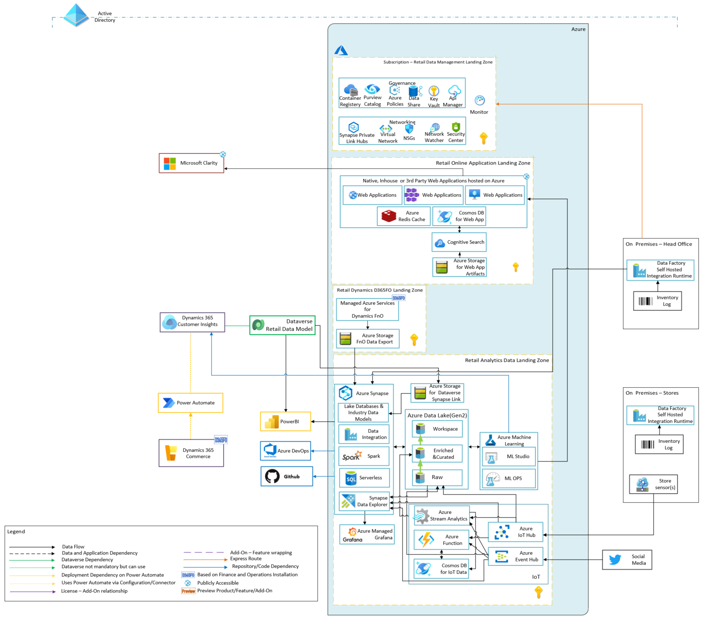

# Shopper and operations analytics

## Table of Contents

- [Shopper and operations analytics](#shopper-and-operations-analytics)
  - [Table of Contents](#table-of-contents)
  - [Shopper and operations analytics Reference Implementations](#shopper-and-operations-analytics-reference-implementations)
  - [Prerequisites](#prerequisites)
  - [Microsoft Cloud  for Retail - Shopper and operations analytics Reference Architecture](#microsoft-cloud-for-retail---shopper-and-operations-analytics-reference-architecture)
  - [Unlock omnichannel insights with advanced analytics](#unlock-omnichannel-insights-with-advanced-analytics)
    - [Design Recommendation](#design-recommendation)

Shopper and operational analytics scenario of Microsoft Cloud for Retail focuses on providing the best possible solution provided by Microsoft technologies to obtain  and analyze the shopper data and therefore by understanding the customer behavior, to provide the best possible experience to customer.

The scenario implementation bases on various Microsoft solutions:
- [D365 Customer Insights](https://dynamics.microsoft.com/ai/customer-insights/) with  power platform and focuses on providing the 365 view of the existing customer data on Power Platform Dataverse by combining the customer data fetched from D365 Commerce and other possible channels.
- [Microsoft Clarity](https://clarity.microsoft.com/) focuses on analyzing anonymized user session experience with various different views to provide Insight on how you can improve your  website. It can collect data from custom, various 3rdparty or D365 commerce websites.
- [Azure Synapse Analytics](https://docs.microsoft.com/azure/synapse-analytics/overview-what-is) is a multi capability analytics platform with native connectors called [Synapse Link](https://docs.microsoft.com/en-us/power-apps/maker/data-platform/azure-synapse-link-synapse?context=/azure/synapse-analytics/context/context) to various Microsoft Data platforms like Dataverse and CosmosDB
which provides extensive analytics and data enrichment possibilities.

In addition to above mentioned key solution components connecting D35 retail solution world with azure opens endless analytics possibilities. You can combine sensor data, social media data and many more data from various different channels.
you can discover more on this in [Microsoft Cloud  for Retail - Shopper and operations analytics Reference Architecture](#microsoft-cloud-for-retail---shopper-and-operations-analytics-reference-architecture) section.

## Shopper and operations analytics Reference Implementations

| Industry Architecture | Description | Deploy | Documentation
|:----------------------|:------------|--------|--------------|
| Shopper and operations analytics | Shopper and operations analytics provides a full, rich, compliant architecture for landing zones for retail industry scenarios | | [User Guide](./referenceImplementation/readme.md)

## Prerequisites

Before you  any piece of existing deploy and configure, verify:

- [Power Platform environments](https://github.com/microsoft/industry/tree/main/foundations/powerPlatform)
  - Power Platform Environment be created upfront
  - Power Platform Environment must have Dataverse enabled
  - Dynamics 365 AI for Customer Insights​(Intelligence)​ needs to be created upfront but it is only available at US(Central,East,West) Europe(North, West) Switzerland North, UAE North, UK south​.
- Storage Account​ accessed via Dynamics 365 AI for Customer Insights​  needs to be assigned below Service Principals:
  - Dynamics 365 AI for Customer Insights​
  - Dynamics 365 AI for Customer Insights engagement insights​

- Power platform environments and Azure environments must be created in the intersect of there MC4R supported regions (*As of latest update in this document, supported regions can be found at: [MC4R docs international availability page](https://docs.microsoft.com/en-us/industry/retail/availability) and Customer Insights(Intelligence)​ available environments*

- For the Microsoft Clarity perquisites you can refer to [Clarity Prerequisites](clarity/README.md#prerequisites)

## Microsoft Cloud  for Retail - Shopper and operations analytics Reference Architecture

## Unlock Omnichannel insights with advanced analytics

There are 40 petabytes of data generated every hour in retail. This data is being collected through multiple customer touch points - from traditional sources like POS systems, inventory logs, and transaction logs, to more modern sources like in-store sensors, and even social media. In a single day, the same customer could interact with your add on social media, open a marketing email, and also walk into your store to purchase an item.

Tapping into the data generated through all these customer touch points is key to better understanding your customers and staying ahead in an increasingly competitive retail landscape.

The data coming from those customer touch points are being stored on separate, legacy systems that often don’t speak the same language. Some of that data is in operational stores (like web click data, foot traffic, or coming from an assembly line) or it’s coming from your apps (like CRM, customer service solutions, tracking systems, etc.). This data is siloed and disconnected, and most retailers are only set up to leverage a fraction of it.

Because this data sits in different databases, speaking different languages, the exact same customer who completes a transaction on social media versus in-store may appear as two, three, or four different customers.

You need something that brings together these different data sources across the retail value chain so that you can derive actionable insights and deliver superior shopping experiences to your customers.

### Design Recommendations

- With Microsoft Cloud for Retail, we recommend using pre agreed/defined data models to bring multiple systems and applications together by providing a shared language for your applications. This simplifies data management and app development by unifying data into common formats and applying consistency across multiple apps and deployments. Microsoft Cloud for Retail provides Retail Data Model as part of [Industry based Lake Database Templates (Industry Data Models-IDM)](https://techcommunity.microsoft.com/t5/azure-synapse-analytics-blog/database-templates-in-azure-synapse-analytics/ba-p/2929112) of [Azure Synapse Analytics](https://docs.microsoft.com/azure/synapse-analytics/overview-what-is). Using Industry Data Models provides benefits listed as below:

  - Industry specificity: Leverage data models with retail-specific semantics
  - Interoperability: Data models ingest, enrich, and unify data to break down data silos and ease interoperability through industry specific pre-built connectors
  - Faster innovation: Extend the value of the platform with additional solutions, analytics, and predictions.
  - Refer to [Clarity Guidance](clarity/README.md#prerequisites) for the recommendations and considerations in collecting and analyzing the website usage data.

### Design Considerations

One important point of the architecture is that we wanted to provide a useful example on how to bring external world data together with power platform to have a more meaningful analysis on customers needs and interests. One part of doing that is collecting physical data in physical shops like we do for the Web shops. Which is not an easy task to do since for that we have very powerful tools like [Microsoft Clarity](https://clarity.microsoft.com/).
the environments to read and process sensory data, social media data etc has different requirements and also device footprints.

When planning the  Azure footprint of these applications and analytics environments consider:

- Complying with [Cloud Adoption Framework - Enterprise Scale Landing Zones (ESLZ)](https://docs.microsoft.com/en-us/azure/cloud-adoption-framework/ready/enterprise-scale/)
- Complying with [Cloud Scale Analytics principles(CSA)](https://docs.microsoft.com/en-us/azure/cloud-adoption-framework/scenarios/cloud-scale-analytics/) with analytics environments
- There is different options of streaming and time series data processing in azure all may answer same/similar and different use-case needs, pick the right tool for the right job.
- Decide the boundaries of your online and corporate world. Due to regulations on personal data processing the environment where you merge all various sources and perform analytics to be governed and protected well.