# Microsoft Clarity

[Microsoft Clarity](https://clarity.microsoft.com/) is a **free** a behavioral analysis tool focuses on the **Maximize the value of your data,
Shopper and operations analytics** priority scenario of Microsoft Cloud
for Retail, by providing insight on your websites' usage patterns either
as an e-commerce web shop built on [Dynamics 365
Commerce](https://dynamics.microsoft.com/commerce/overview/), or a
custom e-commerce website, or a third party commerce provider like [Shopify](https://www.shopify.com/).

With Microsoft Clarity Shopper you can observe customer and operational needs, monitor and understand
your online engagement with your users. By using Clarity\'s analysis tools, you can monitor how your website is used on
different platforms like PC, Mobile, Tablet and enhance your website for your clients and your business. Through Dashboard insights, Session
Recordings and Heatmaps, Clarity helps you identify usability requirements of your web site by allowing you to study user behavior.

You can **monitor and understand  online engagements by**:

-   Utilizing the heatmap feature to see where your site generates the most clicks, what people are ignoring, and how far they're
    scrolling.

-   Watch how customers are using your site with anonymized,
    hi-definition recordings and discover user frustrations by
    documenting rage clicks, dead clicks, and quick backs with
    behavior-focused insights allowing you to come up with solutions
    more efficiently.

-   Understand customer engagement using built-in web and mobile
    analytics existing in Microsoft Clarity and return customer activity recognition, allowing you to
    create custom reports and views based on real-time customer behavior
    data.

All these capabilities  can simply summarized as tracking your website usage behavior.

## Prerequisites

* You need to have the URL of your website ready.
* In order to start using Microsoft Clarity to track your website usage behavior you need to have **sufficient rights to access and change to your web pages source** and be able to **redeploy**.
What you will do in the source code depends on the technology you use for your web page.
For example,

     - For a Custom Web site you need sufficient rights to access and change change the code of the  website's **\<HEAD\>**  section and  again sufficient rights and access to rebuild and redeploy.
     - For a Dynamics E-Commerce page you need the sufficient roles and rights to change the templates and redeploy.

* You will need a user for [Microsoft Clarity](https://clarity.microsoft.com/) access. This user is not necessarily related to the website's or Azure/Dynamics platform's admin users. It only has to be a Microsoft account *(if preferred authentication is Microsoft- otherwise Facebook and Google Authentications are also available)*.
* Clarity only accesses and tracks publicly available websites. so the website URL needs to be publicly accessible.

## Deployment Considerations

There are three key consideration areas for the clarity integration.

1. Order of the events in integration process.

    1. Have the website URL ready. You **can not** change the **URL** after creating the Clarity project.
    1. Introduce the website to Microsoft Clarity: Create the Clarity project using the website URL. Do not underestimate the power of the Site Category in the tracked elements and provided reports. You **can** change the **Site category** after creating the Clarity project. *By the time of creation of this document available Site categories were: E-Commerce, SaaS, Blog, Marketing, Consulting, Media, Education, Community, Non-profit, Other.*
    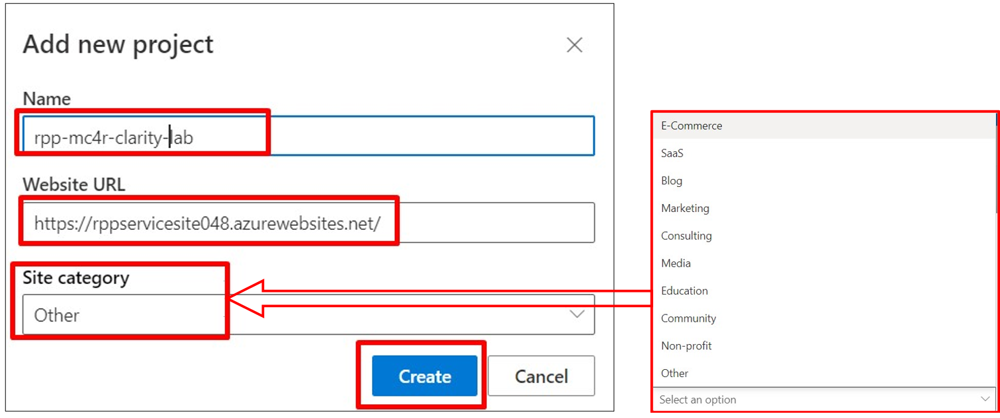
    1. Introduce Microsoft Clarity to the website: Retrieve the Clarity tracking code with the unique key created for the website URL from Clarity project and add it to the designated code block.
1. Making sure to keep the privacy level high.
1. Eliminating the traffic test, admin and maintenance URLs from trackings to be able to capture real customer experience.

## Key product capabilities

You can experience all the key product capabilities without doing a Clarity integration from the publicly available [Microsoft Clarity Demo
Project](https://clarity.microsoft.com/demo/projects/view/3t0wlogvdz/dashboard).

### Dashboard capabilities

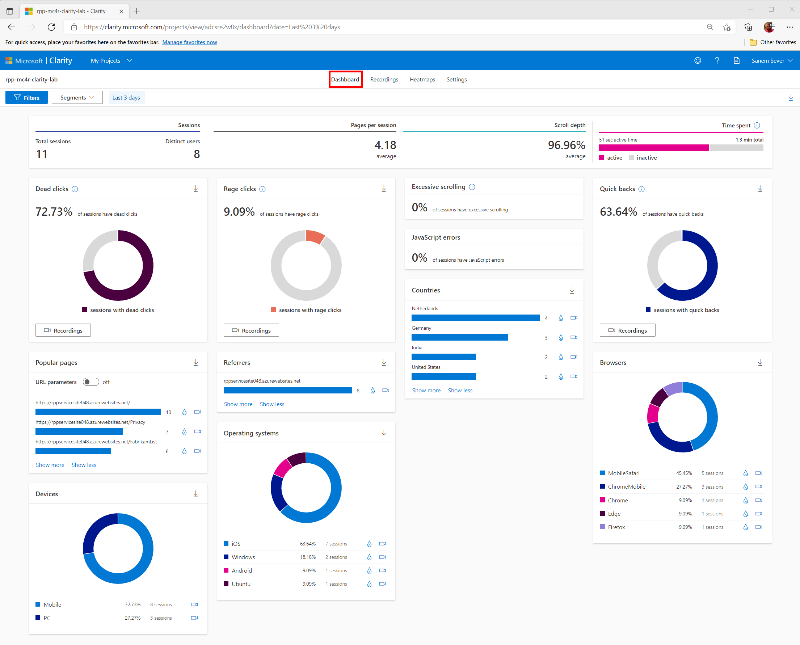

In the Dashboard view  you can see:

a.  Number of sessions, number of distinct users, pages browsed per
    session

b.  Whether the pages are scrolled fully

c.  How much time people spend on your page and how much of the time was
    active

d.  Dead Clicks: ratio of sessions where user clicked or tapped with no
    effect / go nowhere

e.  Rage Clicks: ratio of sessions where user rapidly clicked or tapped
    in the same small area

f.  Quick Backs: ratio of sessions when user navigated to a page then
    quickly returned to the previous one

g.  JavaScript errors: ratio of sessions which had a JavaScript error

h.  The ranked popularity of your application's sub pages

i.  The main referrers to your site (which sites users are coming to
    your page from)

j.  Device Type distribution

k.  Operating Systems distribution

l.  Browser distribution

m.  Countries distribution

You can interact with these Dashboard view contents(modules) and filter
the data directly from them as well. You can also jump to other views
like Recordings and/or Heatmaps by clicking camera and fire icons shown
on the module. Clicking directly on the country itself
allows you to filter your dashboard data to it as well, so you can see
details like Referrer breakdown for sessions in a specific country.

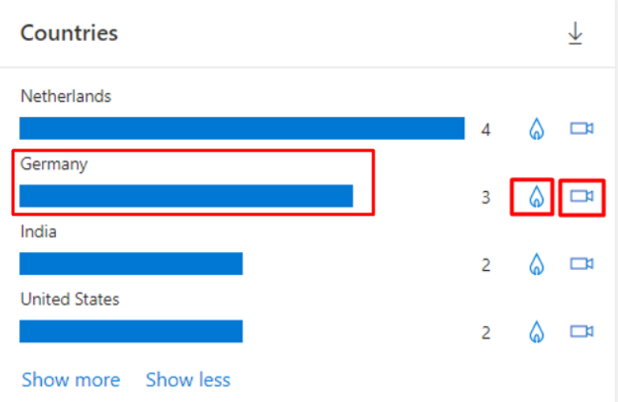

For some type of website technologies you can also see additional e-commerce related information in the Clarity projects :

1. % Sessions ended with purchase (all Shopify sites)
1. % Checkout sessions abandoned (all Shopify Pro sites)
1. Most viewed products (all sites using Product JSON.LD)

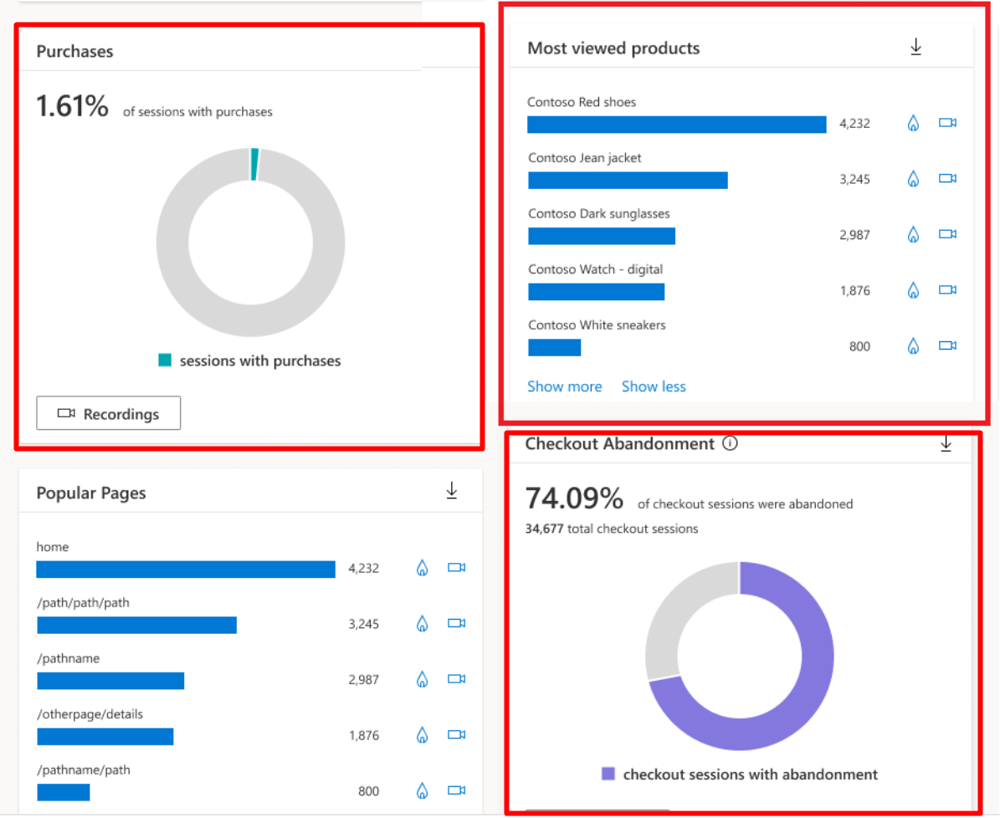

### Filtering capabilities and Segments

You can use Filters and save Filters by creating Segments. Filters can be used in all Capability views of Clarity, like Dashboards  Recordings and Heatmaps.

If you integrate with sites that use Product JSON-LD or are hosted
on Shopify, you can view additional Product filters:

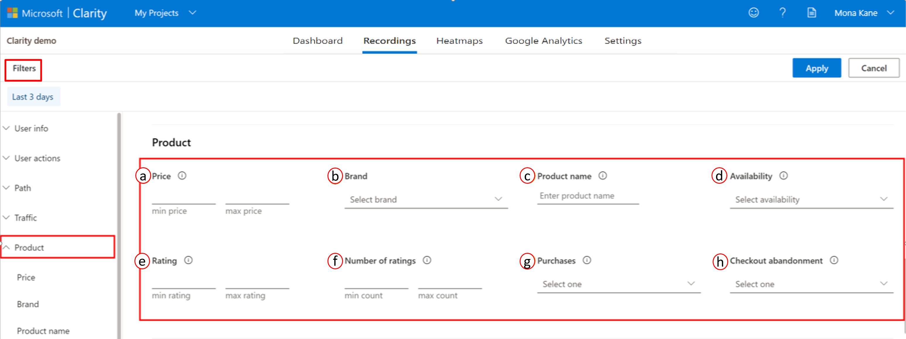

a.  **Price**: Select data for the price value of the product viewed
    based on the currency used on your site. Choose to view data based
    on the minimum and maximum values you input.

b.  **Brand**: Select data that includes the product brand. This filter
    helps you to view more from the specific brand.

c.  **Product name**: Select data based on a product name.

d.  **Availability**: Select data that includes whether a viewed product
    was in stock or not. The dropdown list includes In stock, None, Out
    of stock.

e.  **Rating**: Select data with average user rating. Enter the star min
    and max rating from 1 to 5.

f.  **Number of ratings**: Select data with the total number of users
    rated. Enter a numeric input in min and max count.

g.  **Purchases**: Select the sessions where site visitors did or
    didn\'t purchase a product. Choose to view sessions based on \"Yes\"
    or \"No\".

h.  **Checkout abandonment**: Select the sessions where the user
    abandoned the checkout process at a specific step. Choose to view
    sessions based on the step in the checkout process that was
    abandoned.

> ***Note**: **Filters a-f** are available for site instrumenting with
> Product JSON-LD. **Filter g** is available for Clarity projects of
> Shopify sites. **Filter h** is available for only Shopify plus sites.*

### Recording capabilities

Another important capability of Clarity is showing you recordings of
user sessions.

The recordings are tagged with information like the Originating  **Country**, **OS**, **Device**, Num of **Clicks**, Num of **visited Pages** and Session **Duration**. You can also filter them manually or by creating Segments.

> 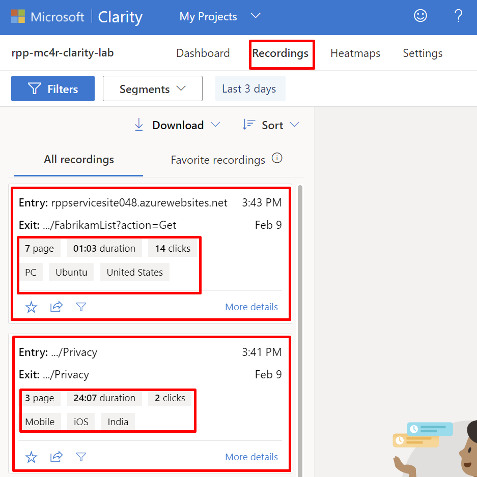

 You  can watch **clicks and scrolls** happening, along with **mouse     movement and hover activity** on the page. Also, you can go directly  to **click moments which are marked on the play bar**. This is a  very useful capability to understand how users perceive your web page and whether they struggle with some menus buttons or  operations.

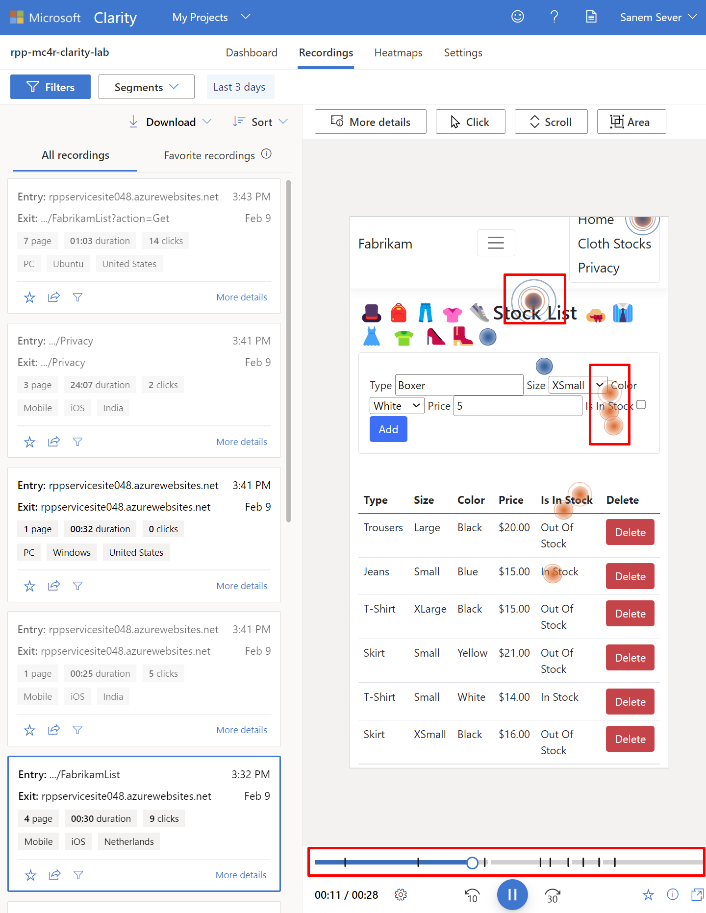

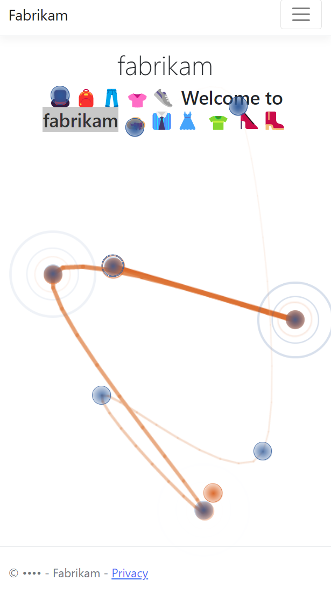

### Heatmap capabilities

**Clarity Heatmaps** capability lets you observe **where** in your
website **users engage the most or the least:** where they **click, tap,
or scroll**. You can analyze this information by **device type** like
**PC**, **Mobile**, **Tablet** and you can look at the details by
**Segment** **filtering** and/or **custom** **filters**.

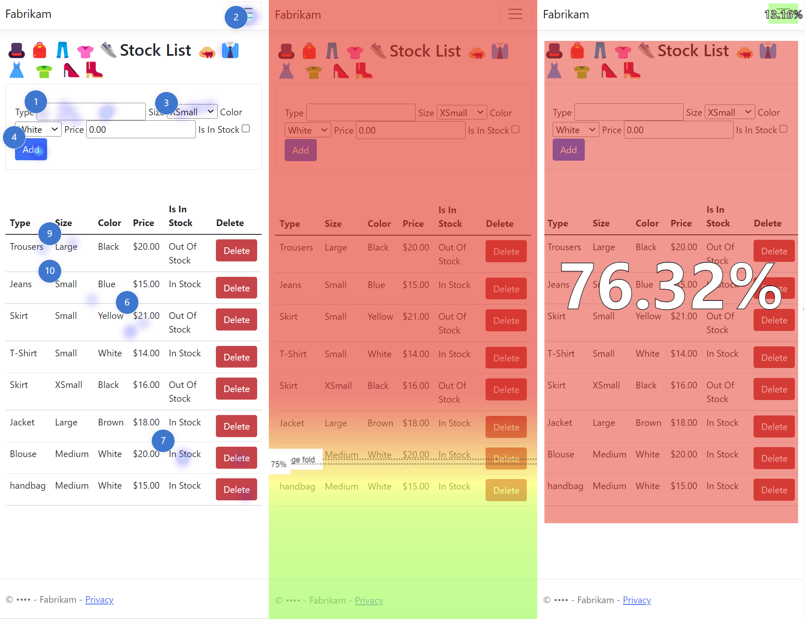

*Side by side representation of Click/Tap Map, Scroll Map, Area Map views.*

- Click and tap maps help you see where users are clicking the most,
    or not at all.

- Scroll maps show you where users are scrolling to -what percent of
    users do and do not see parts of your site pages.

- Area maps are aggregate views of click/tap maps -they show you the
    click rate for a group of elements, instead of just one.

You can even **compare** two different **heatmaps**, for example to
understand differences in user behavior after a change in the website
UI. You can target a specific **Segment**, **filter**, **device**, **URL** or **behavior** as your choice.

> 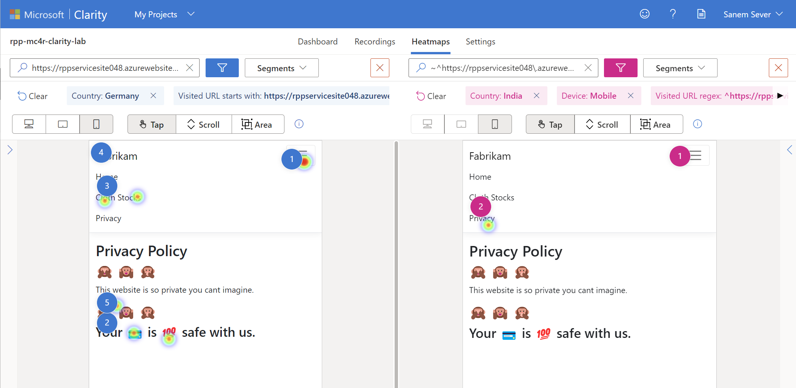

## Design Recommendations

### Eliminating the capture of operational sessions

Clarity provides  **IP blocking** capability to eliminate traffic run or operational session recordings. You should block such ips to have more customer behavior representative data.

1. If you want to **eliminate specific IP's** usage from getting
    captured, you can use **IP blocking** feature. To do that:

    a.  From **Settings** go to **IP blocking** and click on **+ Block
        IP address.**

    b.  Fill a descriptive **Name** for the **IP** you are blocking and
        click **Apply**.

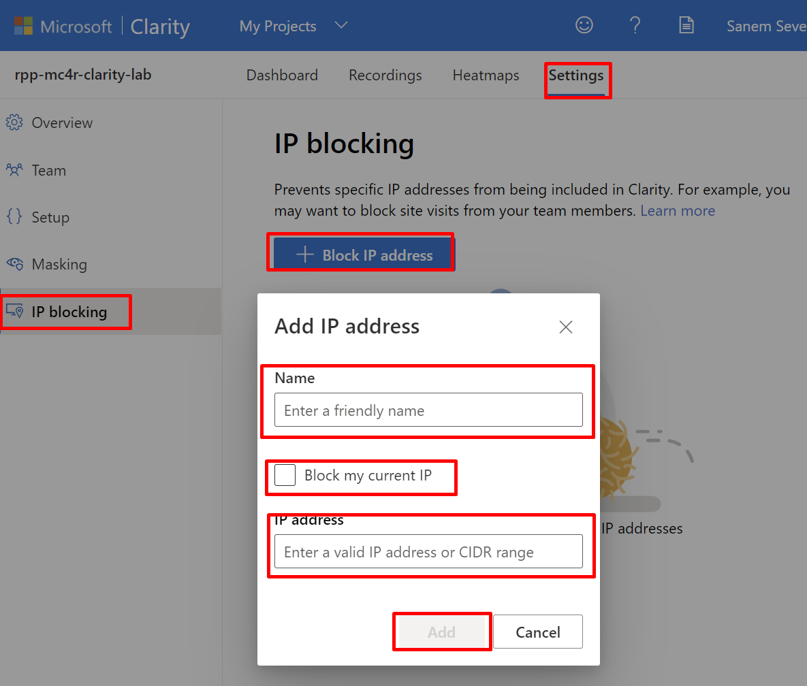

### Creating an Admin team

Always have a team of people to monitor and manage Clarity by using  **Team** management feature.

a.  From **Settings** go to **Team** and click on **+ Add team
        member.**

b.  Fill the **Email** for the **User** you are adding and select a
        role, options are **Member/Admin** and click **Apply**.

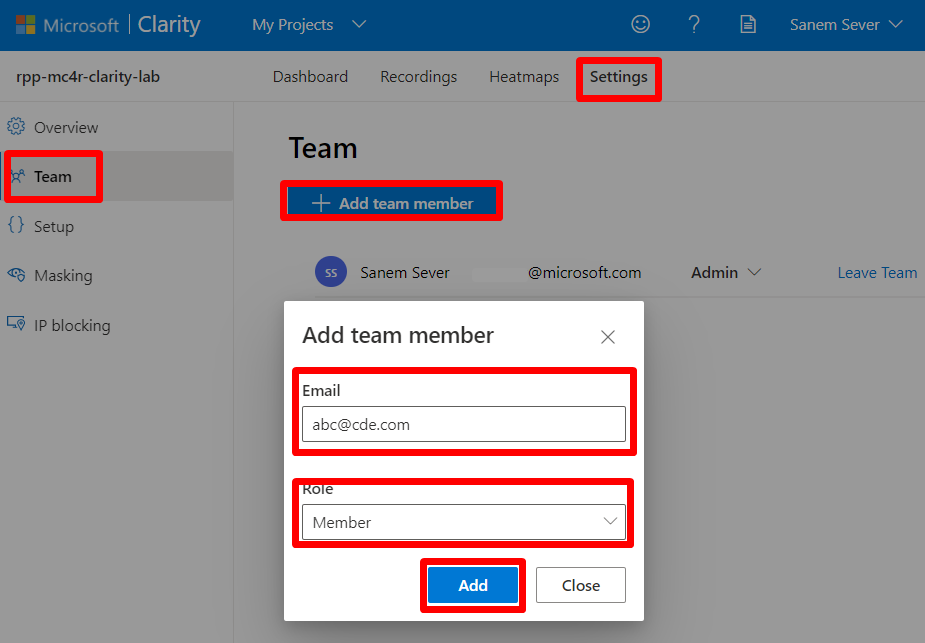

### Privacy

Clarity provides a **Masking** option, which enables you to
mask out certain elements / data on the page that you do not want to
collect from them. In other words you may want some information to **masked** in your **Recordings**. Clarity masks the information it perceives as confidential, **by default** with **Balanced** masking. You can change the masking mode by selecting from three provided options, **Strict**, **Balanced**,  **Relax**. *Changes do not get reflected to previous recordings and  can take an hour the changes to appear.* Therefore to prevent any risks we suggest using either **Strict** or **Balanced** depending on the potential of private data.

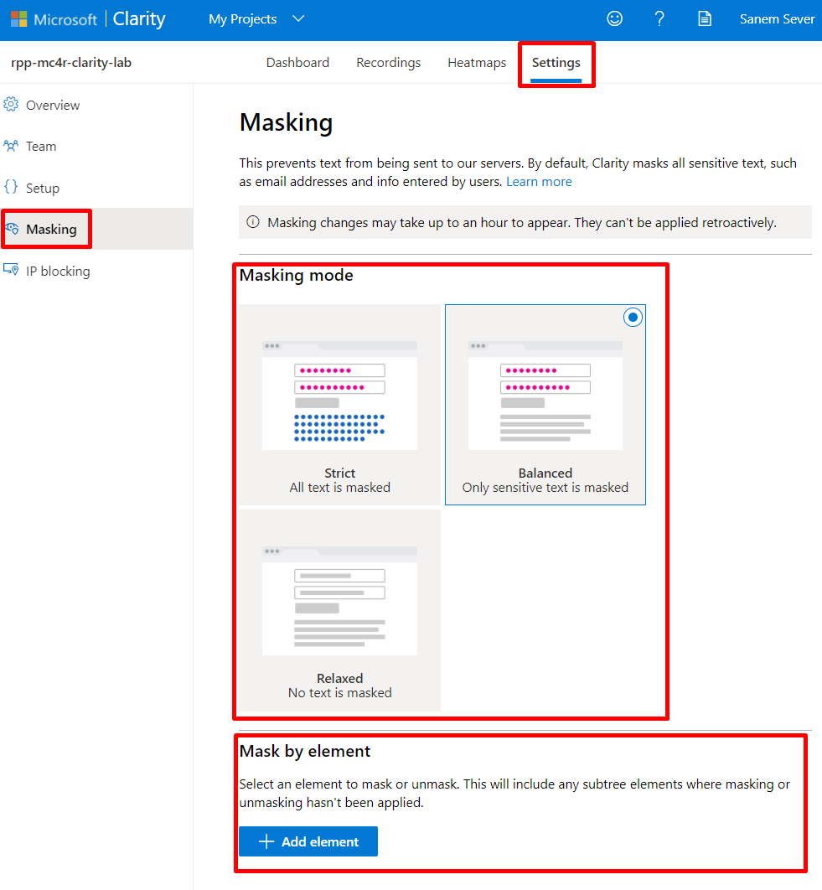

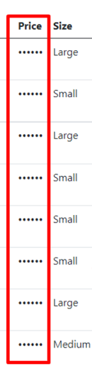
> *Info Note: You can also mask using specific **CSS elements** from
> your web site code. From **Mask by element** you can see above, you
> can enter the **CSS selector** for the element to be masked and
> click **Add**. For example, enter .class_name for a
> class, \#id_value for an ID, and element for a type. From here you can
> adjust whether you want to mask or unmask these specific CSS
> elements.*
