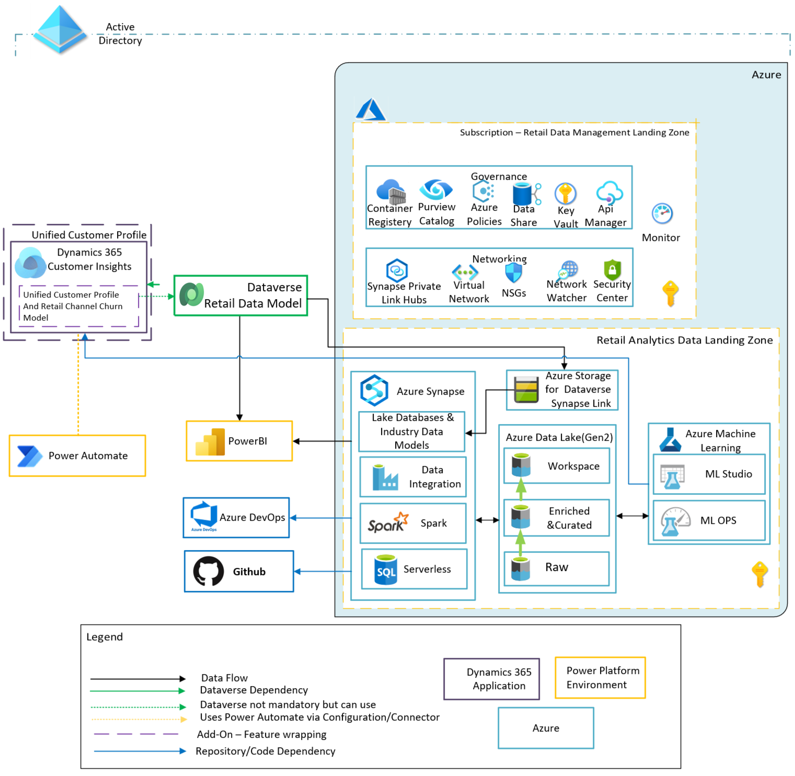

# Unified Customer Profile & Retail Channel Churn Predictive Model

Retail channel churn predictive model is a key feature of Unified customer profile, which is one of the key capabilities of Microsoft Cloud for Retail. In some ways, Unified customer profile is where the data story comes together. So, what does it do? It helps you gain insights across the complete view of a shopper’s journey. 

With Unified customer profile, you can gain a 360-degree perspective of the customer in a clear and intuitive way so that you can provide personalized experiences, reveal important opportunities, prevent potential loss, or **churn**, and improve customer satisfaction. 

Unified customer profile bolsters **unification**. You can: 

- Bring multiple identities together to create a 360 view of the customer through AI-powered identity resolution. 

- Ingest multiple types of data, behaviors, and customer sentiment in real time via more than 500+ built-in connectors. 

It also fosters **unique enrichment**: 

- Gain a 360 view of the customer with proprietary audience intelligence from Microsoft Graph 

- Leverage cross-channel behavior to complete the picture of your end-customer. 

Furthermore, Unified customer profile also gives you better access to customer **insights**: 

- Gain more nuanced insights by combining digital analytics with customer profiles to create richer segments, and leverage churn models to **understand churn risk** at a glance. 

- Observe customer progress through each defined step of the journey, quickly identifying obstacles and opportunities. 

- Create custom reports and views based on real-time customer behavior data, leverage built-in web and mobile analytics to predict customer needs. 

## Churn Predictive Model 

Microsoft Cloud for Retail Unified customer profile includes in the U.S. an **AI-based churn predictive model**, designed for omnichannel retail and built atop Customer Insights. Create a [retail channel churn predictive model](https://docs.microsoft.com/en-us/dynamics365/industry/retail/retail-use-churn-prediction) to fit your business needs, and gain cross-channel insights into the chance of retail customer churn. Run your company data through this model, training it to improve its predictions and identify the factors that contribute to churn, at the customer level.

## Prerequisites

- Retail components, available within Microsoft Cloud for Retail in Microsoft Cloud Solution Center. For more information about deploying Customer Insights B2C environment and other required components, go to [Deploy Unified customer profile in Microsoft Cloud for Retail](https://docs.microsoft.com/en-us/dynamics365/industry/retail/retail-deploy-unified-customer-profile).

> Note 1: You will need to assign Service Principal to Storage Accounts "Dynamics 365 AI for Customer Insights" and "Dynamics 365 AI for Customer Insights engagement insights". 

> Note 2: Customer Insights is only available on specific regions*: US(Central,East,West), Europe(North, West), Switzerland North, UAE North, UK southSoutheast Asia, Canada Central, Australia East. *check current documentation for more recent updates. Take in consideration latency and transfer rates.  

- At least Contributor permissions in Microsoft Dynamics 365 Customer Insights.

- An understanding of what churn means for your organization. A customer is considered to have churned if their purchase value or volume drop below thresholds that you define.

- Entities coming from your operational accounts with fields that map to inputs for your retail churn prediction model:

    - Customer data
    - Session data
    - Transaction data

The model uses inputs that you map to fields from these entities. When your model runs, it stores its churn predictions in an output entity, and provides explainability elements—factors with the most influence on churn risk predictions. It displays these factors along with their level of influence.

## Customer data

A customer entity has fields — also called attributes — that have data about customers, but not their visits or their purchases. A churn prediction model has **one required input and ten optional inputs** that you map to customer entity fields when you create your churn model. To prepare, make sure your customer entity has fields you can map to the model's inputs.

If your customer entity doesn't have all the attributes that you want to include in your churn model, you may be able map, match, and merge the missing attributes so that they're available as churn model inputs.

If you can't find suitable attributes in your source data, you may be able to add data sources, and then map, match, and merge them.

## Session data

A session entity has fields that have data about customer visits, but not their purchases. The churn model has **four required and five optional inputs** for session data. Providing optional inputs will improve the accuracy of predictions.

If your session entity doesn't have all the attributes that you want to include in your churn model, you may be able to map, match, and merge the missing attributes so that they're available as churn model inputs — if your source dataset includes suitable attributes to use. 

If you can't find suitable attributes in your source data, you may be able to add data sources, and then map, match, and merge them.

## Transaction data

**Important**: Because they directly reflect customer purchasing behavior, transactions are key for predicting customer churn — a customer whose transaction volume or value falls below a certain threshold has churned. You define what churn means for your business by setting those thresholds when you create your churn model.

A transaction entity has fields that have data about customer purchases and sessions. A retail churn predictive model has **seven required inputs and six optional inputs** that you map to transaction entity fields when you create your model. To prepare, make sure your transaction entity has fields you can map to the model's inputs. Each optional input that you map will improve the accuracy of your model's predictions.

If your transaction entity doesn't have all the attributes that you want to include in your churn model, you may be able map, match, and merge the missing attributes so that they're available as churn model inputs — if your source dataset includes suitable attributes to use. 

### Architecture

## Considerations and Recommendations for Churn Model Deployment

On the suggested architecture above, the required data entities previously described as pre-requisites (Customer, Session and Transaction data), are stored in either a [Dataverse](https://docs.microsoft.com/en-us/power-apps/maker/data-platform/data-platform-intro?msclkid=4c8db34ccfe511ec879a8b67d05a0e3c) store, or an Azure Storage Account (Blob storage, Data Lake Storage).

The Azure Landing Zones layer where you may place the source data represents the implmentation of [cloud-scale analytics](https://docs.microsoft.com/en-us/azure/cloud-adoption-framework/scenarios/cloud-scale-analytics/overview-cloud-scale-analytics) architecture pattern. On both [Retail Data Management Landing Zone](https://docs.microsoft.com/en-us/azure/cloud-adoption-framework/scenarios/cloud-scale-analytics/architectures/data-management-landing-zone) and [Retail Analytics Data Landing Zone](https://docs.microsoft.com/en-us/azure/cloud-adoption-framework/scenarios/cloud-scale-analytics/architectures/data-landing-zone) areas you see various services that provide secure infrastructure landing zones. This suggested architectural pattern for the source data for the retail churn model provides an enterprise-level architectural pattern based on industry standard [data mesh](https://docs.microsoft.com/en-us/azure/cloud-adoption-framework/scenarios/cloud-scale-analytics/architectures/what-is-data-mesh). 

## Deployment guide

For a step by step guide on how to deploy the retail churn model follow the Microsoft Learn module [Create a unified customer profile in Microsoft Cloud for Retail](https://docs.microsoft.com/en-us/learn/modules/retail-churn-model/)