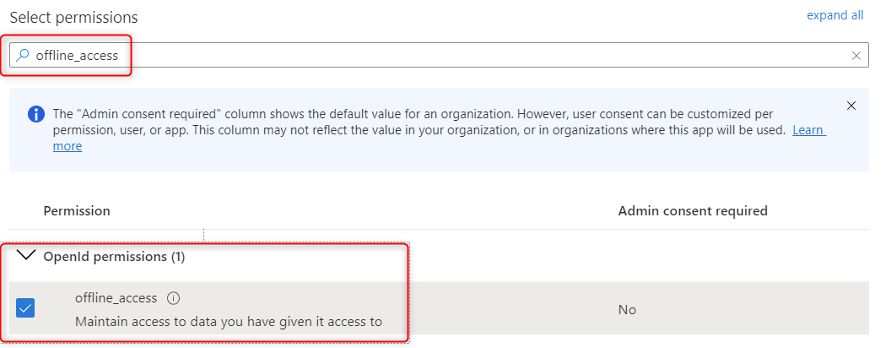
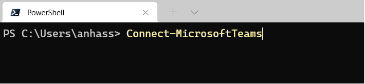

# Retail workforce management

## Table of Contents

- [Dynamics 365 Commerce and Microsoft Teams integration](#dynamics-365-commerce-and-microsoft-teams-integration)
  - [Table of Contents](#table-of-contents)

## Dynamics 365 Commerce and Microsoft Teams integration

[Dynamics 365 Commerce is integrated with Microsoft Teams](https://docs.microsoft.com/dynamics365/teams-integration/teams-integration) to help customers and their employees improve productivity by synchronizing task management between the two applications. Seamless integration between D365 Commerce and Microsoft Teams simplifies task management, and it enables store managers and employees create task lists, assign tasks to multiple stores, and track the status of tasks across stores, from either application.

## Prerequisites

- D365 Commerce
- Microsoft Teams - Microsoft 365 Business Standard License

### Key Capabilities and Architecture

D365 Commerce and Microsoft Teams Integration key features.

- Provision Teams by taking advantage of well-defined information from Commerce, such as the organizational structure and information about stores, workers, permissions, and business context.

- Easily synchronize ongoing changes (for example, the addition of new stores or hiring of new employees) between Commerce and Teams, but keep Commerce as the master source of organizational structure data.

- Integrate task management between Commerce and Teams to help store workers, store managers, regional managers, and communications managers handle task management from either application.

The functional flow for the **Teams for Frontline Workers** scenario can be observed as below:

The suggested physical architecture for the  implementation of the **Teams for Frontline Workers** scenario is as following:

## Considerations and Recommendations

## Deployment Steps

This deployment guide provides detailed steps on how to setup the Microsoft Teams Integration with D365 Commerce. First you it will require a App registration with Azure Active Directory and the required set of permissions that will allow enabling the integration between D365 Commerce and Teams Task Management App.

- Azure Active Directory App Registration

### App Registration and Permissions

- App Registration with Azure Active Directory

1. In the Azure Portal search bar, search for “Active Directory”, the Azure Active Directory will show up in the services. Choose it to Open Azure Active Directory.

    

1. In the Azure Active Directory, Click on App registrations

    

1. In the App registrations, click on add New registration.

1. Name the App registration as “Microsoft Teams Commerce”

1. Under Supported account types: Choose “Accounts in this organizational directory only” (Microsoft only – Single tenant)

1. Under Redirect URI: Select Web and provide the Commerce Finance and Operations URL and add the “oath” suffix.  The full URL should look like `https://fabrikam.sandbox.operations.dynamics.com/oath`

1. Click in Register to complete.

    

1. Save the Application (client) ID in the text editor of your preference. It will be used in later steps.

    

### Add a Secret to the registered App

1. In the Microsoft Teams Commerce registered App. Click in Certificates & Secrets

    

1. Click Add New Client Secret.

    

1. In the Description, provide a name of your choice for the client secret and click Add.

    

1. Copy the key value generated for the client secret and save it in and text editor of your choice. The client secret value will be used in future steps. After closing this window, it will not be possible to retrieve the key again and it will require generating a new client secret.

    

### Adding API permissions to the registered App

1.Click on API permissions in the left tab, then click on + Add a permission

    

1. In the Request API permissions pop-up and select Microsoft Graph.

    

1. Select Delegated permissions, then in Select permission type Group to filter results.

1. Under Group and check Group.ReadWrite.All, then click Add permissions button.  

    

1. Click on + Add permission again to add additional permissions.

    

1. In the Request API permissions pop-up and choose Microsoft Graph.

    

1. Select Application permissions

    

1. With Application permissions selected, then in Select permissions search field type Group to filter results.

1. Click in Group to expand and check Group.ReadWrite.All, then click Add permissions button.  

    

1. In API permissions, click + Add Permission.

    

1. In the Request API permissions pop-up, select APIs my organization uses tab, then search for Microsoft Teams Retail Service and click on it.

    

1. Select **Delegated permissions**

     

1. Click on **TaskPublishing** to expand, check **TaskPublishing.ReadWrite.All**, then click **Add permissions** button.

  

### Configure registered application to expose a web API

1. In Azure Portal go to Azure Active Directory

1. App registrations, and then select your APIs app registration.

  

1. Select Expose an API and then Add a scope.
     

1. You can use the default value provided, which is in the form api://`<application-client-id>`, or specify a more readable URI like `https://contoso.com/api`.

    

1. Click save and Continue
1. In Add a Scope page fill the form with the following values:

    

1. Add another scope by clicking in Add Scope and use the following values.

| Property            | Value |
| ----------------- | ----------- |
| Scope name        | Employees.Write.All |
| Who can consent   | Admins only       |
| Admin consent display name   | Write access to records|
| Admin consent description   | Allow the application to have write access to all Employee data.      |

1. Leave the remaining fields empty and make sure the state is set to Enabled.
1. Click Add Scope

1. The final result should be similar to the picture below.

       

### Configure a client application to access a web API

1. In Azure Portal go to Azure Active Directory

1. App registrations, and then select your APIs app registration.

1. Select API permissions, Add a permission, and then My APIs.

 

1. In My APIs select the Application ID registered in the previous step.

1. Under Select permissions, expand the resource whose scopes you defined for your web API, and select the permissions.

1. If you used the example scope names specified in the previous quickstart, you should see Employees.Read.All and Employees.Write.All.

1. Click Add Permissions

### Add Delegated permissions to access Microsoft Graph

1. In Azure Portal go to Azure Active Directory

1. App registrations, and then select your APIs app registration.

1. Select API permissions, Add a permission, and then Microsoft Graph

1. Choose Microsoft Graph.

1. Select Delegated permissions.

1. In Select Permissions search for email

1. Under Permission, check email

1. In Select Permissions search for offline_access

1. Under Permission, check offline_access

1. In Select Permissions search for openid

1. Under Permission, check openid

1. In Select Permissions search for profile

1. Under Permission, check profile

1. Select Add permissions to complete the process.

### Add Application permissions to access Microsoft Graph

1. In Azure Portal go to Azure Active Directory

1. App registrations, and then select your APIs app registration.

1. Select API permissions, Add a permission, and then Microsoft Graph

1. Choose Microsoft Graph.

1. Under Request API permissions Select Application Permissions

1. In Select Permissions search for files

1. Under Permission, check Files.Read.All

1. Select Add permissions to complete the process.

## Enable Commerce and Teams Integration

In this deployment guide, covers how to enable Microsoft Dynamics 365 Commerce and Microsoft Teams integration.

• Create an external identity for the worker in Commerce Finance and Operations.
• Add store manager to the Publisher Task Manager  
• Provision Teams in Commerce Finance and Operations
• Validate Teams provisioning in the Teams admin center.
• Download Commerce organizational hierarchy to Teams.
• Install Microsoft Teams PowerShell module.
• Upload organization hierarchy to Teams
• Publish a test task list in Teams

### Create and external identity for the worker in Commerce Finance and Operations

1. Log into Commerce Finance and Operations

1. On the left side menu click in Modules

1. Scroll down in the list of options until you find Retail and Commerce.

1. On the right side expand Channels, Stores, and click in All Stores.

1. Click on the Retail Channel id for the first store on the list.

1. On the top menu, click in Set up and then Workers.

1. Find the employee who is the store manager. You can find the role details by clicking on the employee’s name.

1. After identifying the store manager, create an Azure Active Directory identity for the employee to be able to log in to Microsoft Teams. Click in Commerce and then Create new identity.

1. In Alias, define a unique alias that is based on the worker’s name. First letter of first name and last name is the naming conventions used in the example below.

1. The UP will be filled automatically.

1. In the password field, define a strong password for the new identity.

1. In the password field, define a strong password for the new identity.

1. Repeat the same steps for all the stores you want to integrate with Microsoft Teams.

## Assign store manager to the Retail Task Manager Role

1. Navigate to Retail and Commerce > Employees > Users

1. Select the User ID of Store Manager.

1. Select +Assign Roles.

1. Select Retail Task Manager and then select OK button.

### Provision Teams in Commerce Finance and Operations

1. On the **Enable Microsoft Teams Integration** under settings, change to Yes.

1. Provide the **Application ID** sometimes referred to as Client ID, generated during the Application registration process.
1. Provide the **Application Key**. Application Key sometimes referred to as App Password, it is the value generated from the **Application Secret key** generated in the previous steps.

1. Click Save once you update all the values.

1. On the Action Pane, select Provision teams. A batch job that is named Teams provision is created.

1. Go to System administration, Inquiries and then Batch jobs, and find the most recent job that has the description Teams provision.

1. Wait until this job has finished running.

## Validate Teams provisioning in the Teams admin center

1. Go to the Teams admin center, and sign in as the administrator of your e-commerce tenant.

1. In the left navigation pane, select Teams to expand it, and then select Manage teams.

1. Confirm that one team has been created for each Commerce retail store.

1. Select a team and confirm that store workers have been added to it as members.

## Download Commerce organizational hierarchy to Teams

1. In Commerce Finance and Operations, go to Retail and Commerce, Channel setup and then Microsoft Teams Integration Configuration.

1. Select Download targeting hierarchy, and then select Retail Stores by Region to download a comma-separated values (CSV) file of the organizational hierarchy.

1. Click in Download to save to a local folder in your computer.

## Install Microsoft Teams PowerShell module

Microsoft Teams PowerShell module requires PowerShell 5.1 or higher on all platforms. Install the latest version of PowerShell available for your operating system.

1. Check your PowerShell version. To check your PowerShell version, run the following command from within a PowerShell session

PSVersionTable.PSVersion

1. Installing using the PowerShellGallery
1. Install-Module -Name PowerShellGet -Force -AllowClobber

1. Install the Teams PowerShell Module.
1. Install-Module -Name MicrosoftTeams -Force -AllowClobber

## Upload organization hierarchy to Teams

1. To start working with Microsoft Teams PowerShell module, sign in with your Azure credentials.
1. Run the following command in PowerShell to authenticate.
1. Connect-MicrosoftTeams

1. Upload the TargetingHierarchy.csv to Microsoft Teams. You will use Microsoft Teams PowerShell module and cmdlet Set-TeamTargetingHierarchy installed in the previous steps.

1. Set-TeamTargetingHierarchy -FilePath "C:\TargetingHierarchy.csv"

1. Run the following command to check the status of your hierarchy upload.
1. Get-TeamTargetingHierarchyStatus
1. The command will return the following fields:

|**Field** | **Description** |
|------|----------------------|
|**Id**| The unique ID for the upload.|
|**Status** |Upload status. Values include Starting, Validating, Successful, and Failed |
|**ErrorDetails** |Details if there's an upload error. For more information about the error details, see the Troubleshooting section. If there's no error, this field is blank.|
|**LastUpdatedAt** | Timestamp and date of when the file was last updated.|
|**LastModifiedBy**|The ID of the last user who modified the file.|
|**FileName** |The filename of the CSV. |

## Link POS and Teams for task management

1. Go to Retail and Commerce,  Task management, and Tasks integration with Microsoft Teams.

1. Flip the Enable Task Management Integration to Yes

1. On the Action Pane, select Setup task management. You should receive a notification that indicates that a batch job that is named Teams provision is being created.

1. Provide your credentials if ask for authentication. Click close to continue

1. Go to System administration, Inquiries, and then Batch jobs, and find the most recent job that has the description Teams provision. Wait until this job has finished running.

1. Run the CDX job 1070 to publish the plan ID and store references to Retail Server.

The Dynamics 365 Commerce POS application has task management features that let store managers and workers manage tasks and update task status. Store workers can access tasks either by selecting the Tasks tile on the POS home page or by selecting task notifications.

By default, store workers are taken to the My tasks tab, where they can view the tasks that are assigned to them. However, they can easily switch to the Overdue tasks, Open tasks, and Task lists tabs.

## Task Management in POS

### Publish a test task list in Teams

1. Sign into Teams as a communications manager. Typically, communications managers are users who have the **Regional manager** role in Commerce.

1. In the left navigation pane, select **Tasks by Planner**. If it does not show-up in your Teams click on the three dots located lower in the left navigation pane.

1. On the **Published lists** tab, select **Create list** in the lower right.
**Important** - If there are existing tasks, the Create a List button will be located on the left lower corner.

1. Name the new list **Test task list** from **Retail Communication** and Click Create.

1. Under **Task title**, give the first task the title **Testing Teams integration**. Then select **Enter or Click on the check mark on the right**.

1. In the **Drafts** list, select the task list. Then select **Publish** in the upper-right corner.

1. In the **Select who to publish to** dialog box, Click on **Select the teams from hierarchy**.

1. Expand **Retail Communication**, check the **Contoso Retail USA** box on the left side, and then click Next.

1. On Take One last look, notice the Test Task List created in the step below is ready to be published to 33 Teams.

1. Check Ready, everything looks good here, and click Publish.

1. The Test Task List has been published to all 33 Teams. It is now possible to see under Received that all the Teams for each stores has received the published task.

### View and assign the tasks in D365 Commerce POS

In this task, you will login into D365 Commerce POS store, view unassigned tasks and assign it to the store employees.

1. Log into Commerce POS and Select a Store to Manage and Assign Tasks.
1. Once logged into Commerce POS Click on Task Management.

1. In Task Management, click on All Tasks. The Test Task created in Teams completed in previous exercise should show-up in the All Tasks list.

1. Select the Test Task

1. Click on Assign a Task at the right lower corner of the screen.

1. On the Task List Assigned to field, confirm the task has been assigned to Emma Harris

## Review assigned Tasks in Teams and mark them as complete

In this task, you will act as employee and review the assigned tasks in Teams and mark them as complete once the assigned task is completed.

1. Log into Teams and navigate to the assigned store

1. View the assigned tasks, click on New Test Task

1. Mark the New Test Task as complete

