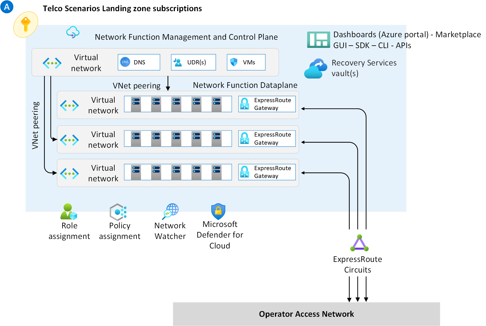
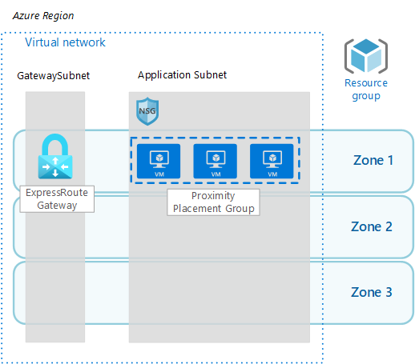
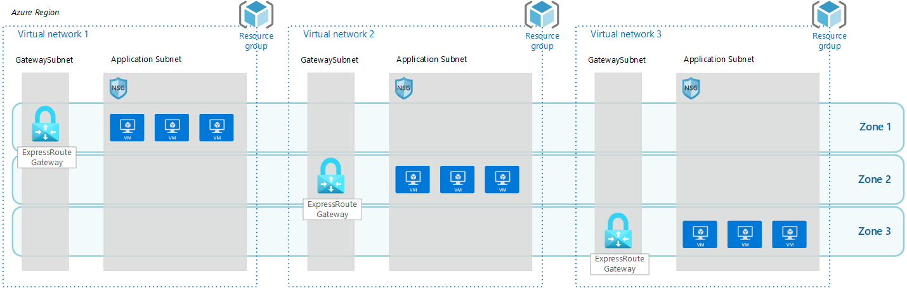

# Operator Landing Zones

An Operator Landing Zone is a special type of landing zone, which has significant differences compared to a traditional corp-connected or online Azure Landing Zone, as a typical application in the telco industry, or a network function, have unique set of requirements such as the need to have multiple virtual networks and multiple ExpressRoute circuits to separete control plane from user plane data. Figure 1 below depicts a sample Operator Landing Zone architecture designed to deliver a especialized network function:

_Figure 1: Sample Operator Landing Zone._

This section focuses on providing guidance with design considerations and recommendations for deploying mission-critical, carieer-grade telco applications (such as 5G Core, packet core, session boarder control, etc) on Azure on specialized Operator Landing Zones.

- [Proximity Placement Groups](#proximity-placement-groups)
- [Availability Zones](#availability-zones)

## Proximity Placement Groups

### Design considerations

- A proximity placement group is a logical grouping used to make sure that Azure compute resources are physically located close to each other. Proximity placement groups are useful for workloads where low latency is a requirement.
- Proximity placement groups offer colocation in the same data center. However, because proximity placement groups represent an additional deployment constraint, [allocation failures can occur](https://docs.microsoft.com/azure/virtual-machines/co-location#what-to-expect-when-using-proximity-placement-groups).
- A single proximity placement group cannot span zones

### Design recommendations

- If latency is your first priority, put VMs in a proximity placement group and the entire solution in an availability zone. But, if resiliency is your top priority, spread your instances across multiple availability zones.

## Availability Zones

### Design considerations

- Azure availability zones are physically separate locations within each Azure region that are tolerant to local failures (such as floods or fire).
- To ensure resiliency, a minimum of three separate availability zones are present in all availability zone-enabled regions. Availability zones are designed so that if one zone is affected, regional services, capacity, and high availability are supported by the remaining two zones.
- Azure availability zones are connected by a high-performance network with a round-trip latency of less than 2 ms.
- Azure availability-zones enabled services can be either zone redundant, with automatic replication across zones, or zonal, with instances pinned to a specific zone.
- Availability zones is currently [available](https://docs.microsoft.com/azure/availability-zones/az-overview#azure-regions-with-availability-zones) in many Azure regions.
- Azure virtual network spans across availability zones when created in a region that supports them.
- An ExpressRoute gateway can be deployed as regional, zonal or zone redundant. However, there can be up to only one ExpressRoute gateways per VNet.
- While currently there are no charges for network traffic across Availability Zones, data transfer across availability zones [will be charged](https://azure.microsoft.com/pricing/details/bandwidth/) beginning from July 1, 2022. The following Availability Zone data transfer will be charged:
  - Data transfer, ingress and egress, from a VNet resource deployed in an Availability Zone to another resource in a different Availability Zone in the same VNET.

### Design recommendations

- For Azure regions that do not support Availability Zones, resources should be deployed as regional.
- For Azure regions that support Availability Zones, deploy resource instances within the Operator Landing Zone to be spread across the availability zones. As examples, virtual machine instances should be deployed across Availability Zones, and exposed via a Load Balancer Standard, or if the application requires ExpressRoute Gateways to be deployed in the landing zone they should be deployed as zone-redundant gateways.
  - Applications which resources are deployed across Availability Zones may experience extra latency as resource instances may be spread across different AZs.
- For Azure regions that do support availability zones, and if the Telco solution is latency sensitive or if the projected network charges are expected to be relatively high when cross avilability zones traffic is charged, deploy the Telco solution as Zonal (pin application resources to a specific AZ). This will minimize latency between application resources and will avoid cross-zones data transfer charges (when included). For zonal deployments:
  - Deploy the ExpressRoute Gateway to a zone, and ensure the application resources (such as VMs) are also deployed in the same zone.
  

  _Figure 1: Zonal deployment._
  - If latency is the first priority, put VMs in a Proximity Placement Group and the entire solution in an availability zone.
  

  _Figure 2: Zonal deployment with proximity placement group._
  - If the Telco solution scales-out by using multiple stamps, each stamp must include a VNet and a zonal ExpressRoute gateway. Then resources for that stamp must be deployed in the same zone as the zone where the ExpressRoute gateway was deployed.
  

   _Figure 3: Multiple stamps across availability zones._
