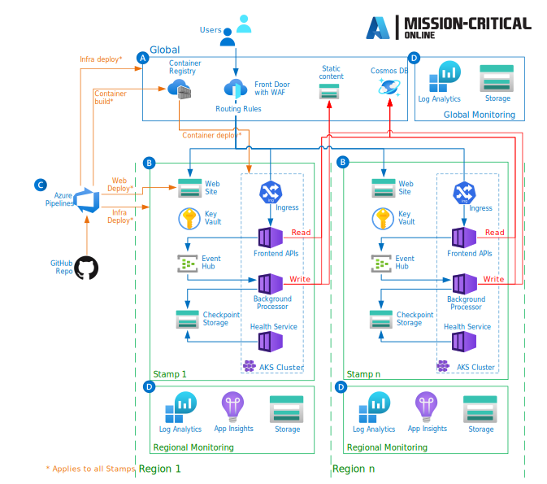

# Operator Landing Zones

An Operator Landing Zone is a special type of landing zone, which has significant differences compared to traditional corp-connected or online Azure Landing Zones, as a typical application or network functions in the telco industry have unique set of requirements such as the need to have multiple virtual networks and multiple ExpressRoute circuits to separete control plane from user plane traffic. Figure 1 below depicts a sample Operator Landing Zone architecture designed to deliver a especialized network function:

_Figure 1: Sample Operator Landing Zone._

It is also not uncommon for applications in the telco industry to have high SLO availability targets usually measured in the 4 (99.99%) or 5 (99.999%) nine's availability of the solution.

This section focuses on providing guidance with design considerations and recommendations for deploying mission-critical, carieer-grade telco applications (such as 5G Core, packet core, session boarder control, etc) on Azure on specialized Operator Landing Zones. This section will first introduce the AlwaysOn project, and readers are strongly recommended to familiarize with it before proceeding to the remaining sections of this article which provide additional considerations when deploying and delivering network functions from Azure.

- [Azure Mission-Critical](#azure-mission-critical)
- [Proximity Placement Groups](#proximity-placement-groups)
- [Availability Zones](#availability-zones)

## Azure Mission-Critical

[Azure Mission-Critical (aka AlwaysOn)](https://github.com/Azure/Mission-Critical) is an open source architectural approach to building highly-reliable cloud-native applications on Microsoft Azure for mission-critical applications. The 'AlwaysOn' or 'Mission-Critical' project name refers to the highly-reliable and mission-critical nature of the architectural pattern it represents, where for given set of business requirements, an application should always be operational and available.

Building mission-critical applications on any hyper-scale cloud platform requires significant technical expertise and engineering investment to appropriately select and piece together services and features. The Azure Mission-Critical project strives to address this complex consumption experience for Microsoft Azure, by applying Well-Architected best practices to mission-critical application scenarios, providing prescriptive and opinionated technical guidance alongside streamlined consumption mechanisms for common industry patterns through reference implementations.

The Azure Mission-Critical project is based on a Design Methodology (which provides easy to follow guidance surrounding the critical design decisions required to produce a target Mission-Critical architecture on Azure) and by 5 key Design Principles which serve as a compass for subsequent design decisions across technical domains and the critical design areas.

- [Azure Mission-Critical - Design Methodology](https://aka.ms/mission-critical): The Azure Mission-Critical design methodology is intended to define easy to follow guidance surrounding critical design decisions which must be made to produce a target Mission-Critical architecture.
- [Azure Mission-Critical - Design Principles](https://docs.microsoft.com/azure/architecture/framework/mission-critical/mission-critical-design-principles): The Azure Mission-Critical architectural framework presented within this repository is underpinned by 5 key design principles which serve as a compass for subsequent design decisions across technical domains and the critical design areas.
  - **Maximum Reliability**: Fundamental pursuit of the most reliable solution, ensuring trade-offs are properly understood.
  - **Sustainable Performance and Scalability**: Design for scalability across the end-to-end solution without performance bottlenecks.
  - **Operations by Design**: Engineered to last with robust and assertive operational management.
  - **Cloud-Native Design**: Focus on using native platforms services to minimize operational burdens, while mitigating known gaps.
  - **Always Secure**: Design for end-to-end security to maintain application stability and ensure availability.
- [Azure Mission-Critical - Critical Design Areas](https://docs.microsoft.com/azure/architecture/framework/mission-critical/mission-critical-architecture-pattern): The 8 design areas below represent the architecturally significant topics which must be discussed and designed for when defining a target Mission-Critical application architecture.
  - [Application Design](https://docs.microsoft.com/azure/architecture/framework/mission-critical/mission-critical-application-design): Both functional application requirements and non-functional requirements, such as those surrounding high-availability and performance, are critical to inform key design decisions for an Mission-Critical application design. However, these requirements should be examined alongside key cloud application design patterns to ensure Mission-Critical and AlwaysOn aspirations are fully achieved.
  - [Application Platform](https://docs.microsoft.com/azure/architecture/framework/mission-critical/mission-critical-application-platform): Azure ultimately provides several highly available computational platforms that differ in capability and complexity. It is therefore essential that key non-functional requirements surrounding reliability, availability, performance, and security are fully considered alongside other decision factors such as scalability, cost, operability, and complexity.
  - [Data platform](https://docs.microsoft.com/azure/architecture/framework/mission-critical/mission-critical-data-platform): Azure ultimately offers a multitude of relational, non-relational, and analytical data platforms which differ greatly in capability. It is therefore essential that key non-functional requirements be fully considered alongside other decision factors such as consistency, operability, cost, and complexity.
  - [Health modeling](https://docs.microsoft.com/azure/architecture/framework/mission-critical/mission-critical-health-modeling): Health modeling and observability are essential concepts to maximize reliability, which focus on robust and contextualized instrumentation and monitoring to gain critical insight into application health, promoting the swift identification and resolution of issues.
  - [Deployment and testing](https://docs.microsoft.com/azure/architecture/framework/mission-critical/mission-critical-deployment-testing): Application outages are often caused by failed deployments or erroneous releases, which is precisely why the design of Continuous Integration and Continuous Deployment (CI/CD) pipelines to encompass deployment and testing methodologies plays such a critical role in the overall reliability of an Mission-Critical application.
  - [Networking and connectivity](https://docs.microsoft.com/azure/architecture/framework/mission-critical/mission-critical-networking-connectivity): Networking is a fundamental design topic for an Mission-Critical application, particularly given the recommended globally distributed active-active design approach.
  - [Security](https://docs.microsoft.com/azure/architecture/framework/mission-critical/mission-critical-security): Security is paramount for any mission-critical application, particularly given the myriad of threat actors that exist in present-day society. Security must therefore be treated as a first-class concern within the Mission-Critical architectural process, to ensure that security services and practices are interwoven within the solution.
  - [Operational procedures](https://docs.microsoft.com/azure/architecture/framework/mission-critical/mission-critical-operational-procedures): The Mission-Critical design methodology leans heavily on the principles automation wherever possible and configuration as code to drive reliable and effective operations through DevOps processes, with automated deployment pipelines used to execute versioned application and infrastructure code artifacts within a source repository
- [Azure Mission-Critical Online - Reference Architecture](https://aka.ms/mission-critical-online): This repository contains the reference implementation for an Mission-Critical "online" scenario, i.e. a workload which does not require direct connectivity to other company resources (such as via a hub-and-spoke model).
- [Azure Mission-Critical Connected - Reference Architecture](https://aka.ms/mission-critical-connected): This repository contains the reference implementation for an Azure Mission-Critical enterprise connected scenario. The pipeline deploys the application Azure Subscription security and compliance guardrails and takes a dependency on pre-provided Virtual Networks for connectivity to other company resources (usually achieved through a hub-and-spoke model via peering).

_Figure 1: Azure Mission-Critical - Reference Architecture._

Readers are strongly advised to familiarize themselves with the Azure Mission-Critical project, its design methodology, its design principles and the critical design areas when designing for and deploying carrier-grade, mission-critical applications and network functions on Microsoft Azure.

## Proximity Placement Groups

### Design considerations

- A proximity placement group is a logical grouping used to make sure that Azure compute resources are physically located close to each other. Proximity placement groups are useful for workloads where low latency is a requirement.
- Proximity placement groups offer colocation in the same data center. However, because proximity placement groups represent an additional deployment constraint, [allocation failures can occur](https://docs.microsoft.com/azure/virtual-machines/co-location#what-to-expect-when-using-proximity-placement-groups).
- A single proximity placement group cannot span zones

### Design recommendations

- If latency is your first priority, put VMs in a proximity placement group and the entire solution in an availability zone. But, if resiliency is your top priority, spread your instances across multiple availability zones.

## Availability Zones

### Design considerations

- Azure availability zones are physically separate locations within each Azure region that are tolerant to local failures (such as floods or fire).
- To ensure resiliency, a minimum of three separate availability zones are present in all availability zone-enabled regions. Availability zones are designed so that if one zone is affected, regional services, capacity, and high availability are supported by the remaining two zones.
- Azure availability zones are connected by a high-performance network with a round-trip latency of less than 2 ms.
- Azure availability-zones enabled services can be either zone redundant, with automatic replication across zones, or zonal, with instances pinned to a specific zone.
- Availability zones is currently [available](https://docs.microsoft.com/azure/availability-zones/az-overview#azure-regions-with-availability-zones) in many Azure regions.
- Azure virtual network spans across availability zones when created in a region that supports them.
- An ExpressRoute gateway can be deployed as regional, zonal or zone redundant. However, there can be up to only one ExpressRoute gateways per VNet.
- While currently there are no charges for network traffic across Availability Zones, data transfer across availability zones [will be charged](https://azure.microsoft.com/pricing/details/bandwidth/) beginning from July 1, 2022. The following Availability Zone data transfer will be charged:
  - Data transfer, ingress and egress, from a VNet resource deployed in an Availability Zone to another resource in a different Availability Zone in the same VNET.

### Design recommendations

- For Azure regions that do not support Availability Zones, resources should be deployed as regional.
- For Azure regions that support Availability Zones, deploy resource instances within the Operator Landing Zone to be spread across the availability zones. As examples, virtual machine instances should be deployed across Availability Zones, and exposed via a Load Balancer Standard, or if the application requires ExpressRoute Gateways to be deployed in the landing zone they should be deployed as zone-redundant gateways.
  - Applications which resources are deployed across Availability Zones may experience extra latency as resource instances may be spread across different AZs.
- For Azure regions that do support availability zones, and if the Telco solution is latency sensitive or if the projected network charges are expected to be relatively high when cross avilability zones traffic is charged, deploy the Telco solution as Zonal (pin application resources to a specific AZ). This will minimize latency between application resources and will avoid cross-zones data transfer charges (when included). For zonal deployments:
  - Deploy the ExpressRoute Gateway to a zone, and ensure the application resources (such as VMs) are also deployed in the same zone.
  

  _Figure 2: Zonal deployment._
  - If latency is the first priority, put VMs in a Proximity Placement Group and the entire solution in an availability zone.
  

  _Figure 3: Zonal deployment with proximity placement group._
  - If the Telco solution scales-out by using multiple stamps, each stamp must include a VNet and a zonal ExpressRoute gateway. Then resources for that stamp must be deployed in the same zone as the zone where the ExpressRoute gateway was deployed.
  

   _Figure 4: Multiple stamps across availability zones._

[Back to Azure for Telecommunications](../README.md)